  
```
**Learning Objectives**

The Learner will be able to

- Understand chromosomal theory of inheritance.

- Analyze the three - point test crosses and appreciate results in linkage map construction.

- Differentiate mutation types with examples.

- Explain DNA metabolism in Plants
```

In the previous chapter you have learned about Mendelian genetics, now you are going to be study with deviations of concepts related to Mendelian genetics and chromosomal theory of inheritance. You must recall the structure of chromosome and cell division from eleventh standard. 

## Chromosomal Theory of Inheritance

G. J. Mendel (1865) studied the inheritance of well-defined characters of pea plant but for several reasons it was unrecognized till 1900. Three scientists (de Vries, Correns and Tschermak) independently rediscovered Mendel’s results on the inheritance of characters. Various cytologists also observed cell division due to advancements in microscopy. This led to the discovery of structures inside nucleus. In eukaryotic cells, worm-shaped structures formed during cell division are called **chromosomes** (colored bodies, visualized by staining). An organism which possesses two complete basic sets of chromosomes are known as diploid. A chromosome consists of long, continuous coiled piece of DNA in which genes are arranged in linear order. Each gene has a definite position (locus) on a chromosome. These genes are hereditary units. Chromosomal theory of inheritance states that Mendelian factors (genes) have specific locus (position) on chromosomes and they carry information from one generation to the next generation.

### Historical development of chromosome theory

The important cytological findings related to the chromosome theory of inheritance are given below.  

**Wilhelm Roux (1883)** postulated that the chromosomes of a cell are responsible for transferring heredity.

**Montgomery (1901)** was first to suggest occurrence of distinct pairs of chromosomes and he also concluded that maternal chromosomes pair with paternal chromosomes only during meiosis.

- **T. Boveri (1902)** supported the idea that the chromosomes contain genetic determiners, and he was largely responsible for developing the chromosomal theory of inheritance.

- **W.S. Sutton (1902),** a young American student independently recognized a parallelism (similarity) between the behaviour of chromosomes and Mendelian factors during gamete formation. 

**Sutton** and **Boveri (1903)** independently proposed the chromosome theory of inheritance. Sutton united the knowledge of chromosomal segregation with Mendelian principles and called it chromosomal theory of inheritance.

### Salient features of the Chromosomal theory of inheritance

- Somatic cells of organisms are derived from the zygote by repeated cell division (mitosis). These consist of two identical sets of chromosomes. One set is received from female parent (maternal) and the other from male parent (paternal). These two chromosomes constitute the homologous pair.

- Chromosomes retain their structural uniqueness and individuality throughout the life cycle of an organism.

- Each chromosome carries specific determiners or Mendelian factors which are now termed as genes.

- The behaviour of chromosomes during the gamete formation (meiosis) provides evidence to the fact that genes or factors are located on chromosomes.

### Comparison between gene and chromosome behaviour

Around twentieth century cytologists established that, generally the total number of chromosomes is constant in all cells of a species.

A diploid eukaryotic cell has two haploid sets of chromosomes, one set from each parent. All somatic cells of an organism carry the same genetic complement. The behaviour of chromosomes during meiosis not only explains Mendel’s principles but leads to new and different approaches to study about heredity.


**Table 3.1:** Parallelism between Mendelian factors and chromosomal behaviour

| Mendelian factors                                                                                       | Chromosomes<br>behaviour                                                                                                                                                  |
|---------------------------------------------------------------------------------------------------------|----------------------------------------------------------------------------------------------------------------------------------------------------------------------------|
| 1.  Alleles of a factor<br>    occur in pair                                                            | Chromosomes occur<br>in pairs                                                                                                                                              |
| 2.  Similar or dissimilar<br>    alleles of a factor<br>    separate during the<br>    gamete formation | The homologous<br>chromosomes separate<br>during meiosis                                                                                                                   |
| 3.  Mendelian<br>    factors can assort<br>    independently                                            | The paired<br>chromosomes<br>can separate<br>independently during<br>meiosis but the<br>linked genes in the<br>same chromosome<br>normally do not<br>assort independently. |

**Table 3.1:** Parallelism between Mendelian factors and chromosomal behaviour.


| Organism                                | Number of<br>chromosomes (2n) |
|-----------------------------------------|-------------------------------|
| Adder’s tongue fern<br>(Ophioglossum) |              1262             |
| Horsetail (Equisetum)                 |              216              |
| Giant sequoia                           |               22              |
| Arabidopsis                           |               10              |
| Sugarcane                               |               80              |
| Apple                                   |               34              |
| Rice                                    |               24              |
| Potato                                  |               48              |
| Maize                                   |               20              |
| Onion                                   |               16              |
| Haplopappus gracilis                  |               4               |

**Table 3.2 :** Number of Chromosomes

**Thomas Hunt Morgan (1933)** received Nobel Prize in Physiology or Medicine for his discoveries concerning the role played by chromosomes in heredity.

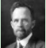


## Linkage
The genes which determine the character of an individual are carried by the chromosomes. The genes for different characters may be present either in the same chromosome or in different chromosomes. When the genes are present in different chromosomes, they assort independently according to Mendel’s Law of Independent Assortment. Biologists came across certain genetic characteristicsthat did not assort out independently in other organisms after Mendel’s work. One such case was reported in Sweet pea **_(Lathyrus odoratus)_** by **William Bateson** and **Reginald C. Punnet** in 1906. They crossed one homozygous strain of sweet peas having **purple flowers** and long **pollen grains** with another homozygous strain having **red flowers** and **round pollen grains**. All the F1 progenies had purple flower and long pollen grains indicating purple flower long pollen **(PL/ PL)** was dominant over red flower round pollen **(pl/pl)**. When they crossed the F1 with double recessive parent (test cross) in results, F2 progenies did not exhibit in 1:1:1:1 ratio as expected with independent assortment. A greater number of F2 plants had purple flowers and long pollen or red flowers and round pollen. So they concluded that genes for purple colour and long pollen grain and the genes for red colour and round pollen grain were found close together in the same homologous pair of chromosomes. These genes do not allow themselves to be separated. So they do not assort independently. This type of tendency of genes to stay together during separation of chromosomes is called **Linkage.**

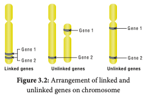

Genes located close together on the same chromosome and inherited together are called **linked genes.** But the two genes that are sufficiently far apart on the same chromosome are called **unlinked genes or syntenic genes** (Figure 3.4). Such condition is known as **synteny**. It is to be differentiated by the value of recombination frequency. If the recombination frequency value is more than 50 % the two genes show unlinked. when the recombination frequency value is less than 50 %, they show linked. Closely located genes show strong linkage, while genes widely located show weak linkages.

```
**Fossil Genes:** Some of the junk DNA is made up of pseudo genes, the sequences presence in that was once working genes.
They lost their ability to make proteins. They tell the story of evolution through fossilized parts.

```
### Coupling and Repulsion theory

The two dominant alleles or recessive alleles occur in the same homologous chromosomes, tend to inherit together into same gamete are called **coupling or cis configuration** (Figure: 3.5). If dominant or recessive alleles are present on two different, but homologous chromosomes they inherit apart into different gamete are called **repulsion or trans configuration** (Figure: 3.6).

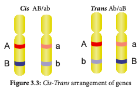

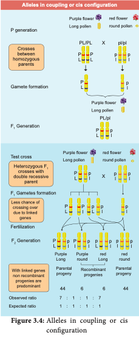


### Kinds of Linkage 

**T.H. Morgan** found two types of linkage. They are complete linkage and incomplete linkage depending upon the absence or presence of new combination of linked genes.

**Complete Linkage** 

If the chances of separation of two linked genes are not possible those genes always remain together as a result, only parental combinations are observed. The linked genes are located very close together on the same chromosome such genes do not exhibit crossing over. This phenomenon is called **complete linkage**. It is rare but has been reported in male **_Drosophila_. C.B Bridges** (1919) discovered that crossing over is completely absent in some species of male **_Drosophila_**.

**Incomplete Linkage** 

If two linked genes are sufficiently apart, the chances of their separation are possible. As a result, parental and non-parental combinations are observed. The linked genes exhibit some crossing over. This phenomenon is called**incomplete linkage**. This was observed in maize. It was reported by Hutchinson.

### Linkage Groups

 The groups of linearly arranged linked genes on a chromosome are called **Linkage groups**. In any species the number of linkage groups corresponds to the number haploid set of chromosomes. Example:

| Name of organism | Linkage groups |
|------------------|----------------|
| Mucor            |        2       |
| Drosophila       |        4       |
| Sweet pea        |        7       |
| Neurospora       |        7       |
| Maize            |       10       |

**Table 3.3 :** Linkage groups in some organisms

Linkage and crossing over are two processes that have opposite effects. Linkage keeps particular genes together but crossing over mixes them. The differences are given below.

| Linkage                                                                        | Crossing over                                                                                             |
|--------------------------------------------------------------------------------|-----------------------------------------------------------------------------------------------------------|
| 1. The genes<br>   present on<br>   chromosome<br>   stay close<br>   together |                                 It leads to separation<br>of linked genes                                 |
| 2. It involves<br>   same chromosome<br>   of homologous<br>   chromosome      |   It involves exchange <br>of segments between<br>non-sister chromatids <br>of homologous<br>chromosome.  |
| 3. It reduces<br>   new gene<br>   combinations                                | It increases variability<br>by forming new gene <br>combinations. lead<br>to formation of new<br>organism |

**Table 3.4:** Differences between linkage and crossing over

## Crossing Over
Crossing over is a biological process that produces new combination of genes by inter-changing the corresponding segments between non-sister chromatids of homologous pair of chromosomes. The term 'crossing over' was coined by Morgan **(1912).** It takes place during pachytene stage of prophase I of meiosis. Usually crossing over occurs in germinal cells during gametogenesis. It is called meiotic or germinal crossing over. It has universal occurrence and has great significance. Rarely, crossing over occurs in somatic cells during mitosis. It is called somatic or mitotic crossing over. 
 
### Mechanism of Crossing Over
 
Crossing over is a precise process that includes stages like synapsis, tetrad formation, cross over and terminalization.

**(i) Synapsis** Intimate pairing between two homologous

chromosomes is initiated during zygotene stage of prophase I of meiosis I. Homologous chromosomes are aligned side by side resulting in a pair of homologous chromosomes called **bivalents. This pairing phenomenon is called synapsis or syndesis.** It is of three types,


1. **Procentric synapsis:** Pairing starts from middle of the chromosome.

2. **Proterminal synapsis:** Pairing starts from the telomeres.

3. **Random synapsis:** Pairing may start from anywhere.

**(ii) Tetrad Formation** Each homologous chromosome of a bivalent begin to form two identical sister chromatids, which remain held together by a centromere. At this stage each bivalent has four chromatids. This stage is called tetrad stage.

**(iii) Cross Over** After tetrad formation, crossing over occurs in pachytene stage. The non-sister chromatids of homologous pair make a contact at one or more points. These points of contact between non- sister chromatids of homologous chromosomes are called **Chiasmata** (singular-Chiasma). At chiasma, cross-shaped or X-shaped structures are formed, where breaking and rejoining of two chromatids occur. This results in reciprocal exchange of equal and corresponding segments between them.

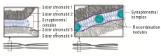

**(iv) Terminalisation** 

After crossing over, chiasma starts to move towards the terminal end of chromatids. This is known as **terminalisation**. As a result, complete separation of homologous chromosomes occurs.

```

**Activity: Solve this**

Consider two hypothetical recessive autosomal genes a and b, where a heterozygote is testcrossed to a double homozygous mutant. Predict the phenotypic ratios under the following conditions: 

(a) a and b are located on separateautosomes. 

(b) a and b are linked on the same autosome but are so far apart that a crossover occurs between them.

(c) a and b are linked on the same autosome but are so close together that a crossover almost never occurs.

```

### Importance of Crossing Over

Crossing over occurs in all organisms like bacteria, yeast, fungi, higher plants and animals. Its importance is  
 
- Exchange of segments leads to new gene combinations which plays an important role in evolution. 
 
- Studies of crossing over reveal that genes are arranged linearly on the chromosomes. 
 
- Genetic maps are made based on the frequency of crossing over. 
 
- Crossing over helps to understand the nature and mechanism of gene action. 

- If a useful new combination is formed it can be used in plant breeding. 

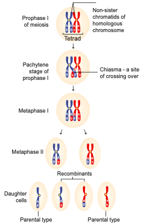


### Recombination 

Crossing over results in the formation of new combination of characters in an organism called recombinants. In this, segments of DNA are broken and recombined to produce new combinations of alleles. This process is called **Recombination.**

**Calculation of Recombination Frequency (RF)**

The percentage of recombinant progeny in a cross is called recombination frequency. The recombination frequency (cross over frequency) (RF) is calculated by using the following formula. The data is obtained from alleles in coupling configuration.

### Genetic Mapping

Genes are present in a linear order along the chromosome. They are present in a specific location called locus (plural: loci). The diagrammatic representation of position of genes and related distances between the adjacent genes is called **genetic mapping**. It is directly proportional to the frequency of recombination between them. It is also called as linkage map. The concept of gene mapping was first developed by Morgan’s student **Alfred H Sturtevant** in 1913. It provides clues about where the genes lies on that chromosome. **Map distance** The unit of distance in a genetic map is called a **map unit** (m.u). One map unit is equivalent to one percent of crossing over (Figure 4. ). One map unit is also called a centimorgan (cM) in honour of **T.H. Morgan**. 100 centimorgan is equal to one Morgan (M). For example: A distance between A and B genes is estimated to be 3.5 map units. It is equal to 3.5 centimorgans or 3.5 % or 0.035 recombination frequency between the genes.

**Uses of genetic mapping** 

- It is used to determine gene order, identify the locus of a gene and calculate the distances between genes.

- They are useful in predicting results of dihybrid and trihybrid crosses.

- It allows the geneticists to understand the overall geneti complexity of particular organism.


## Multiple alleles
A given phenotypic trait of an individual depends on a single pair of genes, each of which occupies a specific position called the locus on homologous chromosome. When any of the three or more allelic forms of a gene occupy the same locus in a given pair of homologous chromosomes, they are said to be called **Multiple alleles** 

```

**Check your Grasp**

There may be multiple alleles within the population, but individuals have only two of those alleles. Why?

```

### Characteristics of multiple alleles
 
-  Multiple alleles of a series always occupy the same locus in the homologous chromosome. Therefore, no crossing over occurs within the alleles of a series.

- Multiple alleles are always responsible for the same character.

- The wild type alleles of a series exhibit dominant character whereas mutant type will influence dominance or an intermediate phenotypic effect.

- When any two of the mutant multiple alleles are crossed the phenotype is always mutant type and not the wild type

### Self-sterility in _Nicotiana_
 In plants, multiple alleles have been reported in association with self-sterility or self- incompatibility. Self-sterility means that the pollen from a plant is unable to germinate on its own stigma and will not be able to bring about fertilization in the ovules of the same plant. **East (1925)** observed multiple alleles in **_Nicotiana_** which are responsible for self-incompatibility or self-sterility. The gene for self-incompatibility can be designated as S, which has allelic series S1, S2, S3, S4 and S5 (Figure 3.8).

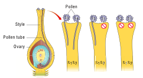

The cross-fertilizing tobacco plants were not always homozygous as S_1S_1 or S_2S_2, but all plants were heterozygous as S<sub>1</sub>S<sub>2</sub> 	| , S<sub>3</sub>S<sub>4</sub> 	| , S_5S_6. When crosses were made between different S<sub>1</sub>S<sub>2</sub> 	|  plants, the pollen tube did not develop normally. But effective pollen tube development was observed when crossing was made with other than S<sub>1</sub>S<sub>2</sub> 	  for example S<sub>3</sub>S<sub>4</sub>.

| Female<br>parent 	| Male parent <br> 	| (Pollen 	| source) 	|
|---	|---	|---	|---	|
| **Stigma spot** 	| S<sub>1</sub>S<sub>2</sub> 	| S<sub>2</sub>S<sub>3</sub> 	| S<sub>3</sub>S<sub>4</sub> 	|
| S<sub>1</sub>S<sub>2</sub> 	| Self<br>Sterile 	| S<sub>3</sub>S<sub>2</sub><br>S<sub>3</sub>S<sub>1</sub> 	| S<sub>3</sub>S<sub>1</sub><br>S<sub>3</sub>S<sub>2</sub><br>S<sub>4</sub>S<sub>1</sub><br>S<sub>4</sub>S<sub>2</sub> 	|
| S<sub>2</sub>S<sub>3</sub> 	| S<sub>1</sub>S<sub>2</sub><br>S<sub>1</sub>S<sub>3</sub> 	| Self<br>Sterile 	| S<sub>4</sub>S<sub>2</sub><br>S<sub>4</sub>S<sub>3</sub> 	|
| S<sub>3</sub>S<sub>4</sub> 	| S<sub>1</sub>S<sub>3</sub><br>S<sub>1</sub>S<sub>4</sub><br>S<sub>2</sub>S<sub>3</sub><br>S<sub>2</sub>S<sub>4</sub> 	| S<sub>2</sub>S<sub>3</sub><br>S<sub>2</sub>S<sub>4</sub> 	| Self<br>Sterile 	|

When crosses were made between seed parents with S<sub>1</sub>S<sub>2</sub>  and pollen parents with S<sub>2</sub>S<sub>3</sub> , two kinds of pollen tubes were distinguished. Pollen grains carrying S<sub>2</sub> were not effective, but the pollen grains carrying S<sub>3</sub> were capable of fertilization. Thus, from the cross S<sub>1</sub>S<sub>2</sub>XS<sub>3</sub>S<sub>4</sub>, all the pollens were effective and four kinds of progeny resulted: S1S3, S<sub>1</sub>S<sub>4</sub>, S2S3 and S<sub>2S</sub>4. Some combinations are showed in the table

### Sex determination in maize 

Zea mays (maize) is an example for monoecious, which means male and female flowers are present on the same plant. There are two types of i n f l o r e s c e n c e . The terminal i n f l o r e s c e n c e which bears staminate florets develops from shoot apical meristem called tassel. The lateral inflorescence which develop pistillate florets from axillary bud is called ear or cob. Unisexuality in maize occurs through the selective abortion of stamens in ear florets and pistils in tassel florets. A substitution of two single gene pairs '**ba**' for barren plant and '**ts**' for tassel seed makes the difference between monoecious and dioecious (rare) maize plants. The allele for barren plant (ba) when homozygous makes the stalk staminate by eliminating silk and ears. The allele for tassel seed (ts) transforms tassel into a pistillate structure that produce no pollen. The table-3.6 is the resultant sex expression based on the combination of these alleles. Most of these mutations are shown to be defects in gibberellin biosynthesis. Gibberellins play an important role in the suppression of stamens in florets on the ears.

 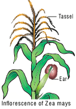
 
| **Genotype**           | **Dominant/<br>recessive**   | **Modification**                                                      | **Sex**               |
|------------------------|------------------------------|-----------------------------------------------------------------------|-----------------------|
| ba/ba<br>ts/ts         |      Double<br>recessive     | Lacks silk on<br>the stalk, but<br>transformed<br>tassel to<br>pistil | Rudimentary<br>female |
| ba/ba<br>ts^+/ts^+     | Recessive<br>and<br>dominant | Lacks silk<br>and have<br>tassel                                      | Male                  |
| ba^+/ba^+<br>ts^+/ts^+ |      Double<br>dominant      | Have both<br>tassel and cob                                           | Monoecious            |
| ba^+/ba^+<br>ts/ts     | Dominant<br>and<br>recessive | Bears cob<br>and lacks<br>tassel                                      | Normal<br>female      |

**Table 3.6:** Sex determination in Maize (Superscript (+) denotes dominant character)
## Mutation


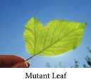

Genetic variation among individuals provides the raw material for the ultimate source of evolutionary changes. Mutation and recombination are the two major processes responsible for genetic variation. A sudden change in the genetic material of an organisms is called **mutation**. The term mutation was introduced by **Hugo de Vries** (1901) while he has studying on the plant, evening primrose **(Oenothera lamarkiana)** and proposed **‘Mutation theory’**. There are two broad types of changes in genetic material. They are point mutation and chromosomal mutations. Mutational events that take place within individual genes are called gene mutations or point mutation, whereas the changes occur in structure and number of chromosomes is called chromosomal mutation. Agents which are responsible for mutation are called **mutagens,** that increase the rate of mutation. Mutations can occur either spontaneously or induced. The production of mutants through exposure of mutagens is called mutagenesis, and the organism is said to be **mutagenized.**


## Types of mutation
 
 Let us see the two general classes of gene mutation: 

- Mutations affecting single base or base pair of DNA are called point mutation 

- Mutations altering the number of copies of a small repeated nucleotide sequence within a gene
**Types of mutations Point mutation in DNA are categorised

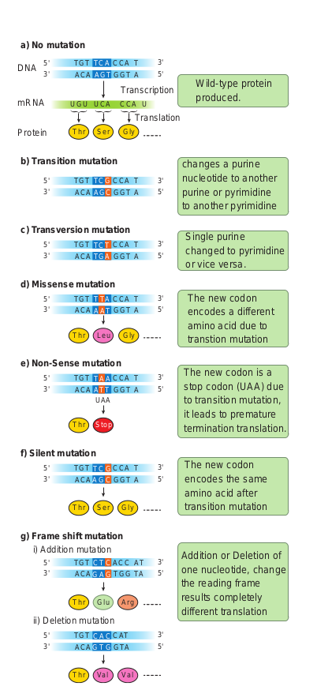

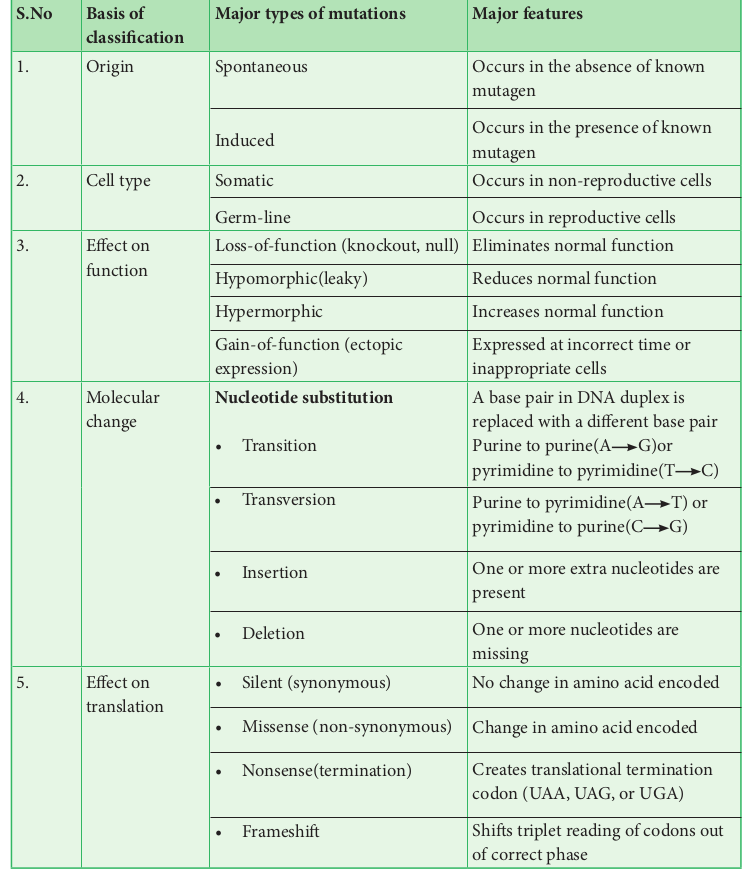

**Point mutation**

It refers to alterations of single base pairs of DNA or of a small number of adjacent base pairs

**Types of point mutations**

Point mutation in DNA are categorised into two main types. They are base pair substitutions and base pair insertions or deletions. Base substitutions are mutations in which there is a change in the DNA such that one base pair is replaced by another. It can be divided into two subtypes: transitions and transversions. Addition or deletion mutations are actually additions or deletions of nucleotide pairs and also called base pair addition or deletions. Collectively, they are termed **indel mutations** (for insertiondeletion). 
Substitution mutations or indel mutations affect translation. Based on these different types of mutations are given below.

The mutation that changes one codon for an amino acid into another codon for that same amino acid are called **Synonymous or silent mutations**. The mutation where the codon for one amino acid is changed into a codon for another amino acid is called **Missense or non-synonymous mutations**. The mutations where codon for one amino acid is changed into a termination or stop codon is called **Nonsense mutation**. Mutations that result in the addition or deletion of a single base pair of DNA that changes the reading frame for the translation process as a result of which there is complete loss of normal protein structure and function are called **Frameshift mutations** (Figure: 3.13)


### Mutagenic agents 

The factors which cause genetic mutation are called **mutagenic agents or mutagens**. Mutagens are of two types, physical mutagen and chemical mutagen. **Muller** (1927) was the first to find out physical mutagen in Drosophila. **Physical mutagens:** Scientists are using temperature and radiations such as X rays, gamma rays, alfa rays, beta rays, neutron, cosmic rays, radioactive isotopes, ultraviolet rays as physical mutagen to produce mutation in various plants and animals. **Temperature:** Increase in temperature increases the rate of mutation. While rise in temperature, breaks the hydrogen bonds between two DNA nucleotides which affects the process of replication and transcription. 

**Radiation:**

The electromagnetic spectrum** contains shorter and longer wave length rays than the visible spectrum. These are classified into ionizing and non-ionizing radiation. Ionizing radiation are short wave length and carry enough higher energy to ionize electrons from atom. X rays, gamma rays, alfa rays, beta rays and cosmic rays which breaks the chromosomes (chromosomal mutation) and chromatids in irradiated cells. Non-ionizing radiation, UV rays have longer wavelengths and carry lower energy, so they have lower penetrating power than the ionizing radiations. It is used to treat unicellular microorganisms, spores, pollen grains which possess nuclei located near surface membrane. **Sharbati Sonora** 

Sharbati Sonora is a mutant variety of wheat, which is developed from Mexican variety (Sonora 64) by irradiating of gamma rays. It is the work of Dr. **M.S.Swaminathan** who is known as **‘Father of Indian green revolution’** and his team.

**Castor Aruna** 

Castor Aruna is mutant variety of castor which is developed by treatment of seeds with thermal neutrons in order to induce very early maturity (120 days instead of 270 days as original variety).

**Chemical mutagens:** 

Chemicals which induce mutation are called chemical mutagens. Some chemical mutagens are mustard gas, nitrous acid, ethyl and methyl methane sulphonate (EMS and MMS), ethyl urethane, magnous salt, formaldehyde, eosin and enthrosine. Example: Nitrous oxide alters the nitrogen bases of DNA and disturb the replication and transcription that leads to the formation of incomplete and defective polypeptide during translation. 

**Comutagens**

The compounds which are not having own mutagenic properties but can enhance the effects of known mutagens are called comutagens. 

Example: Ascorbic acid increase the damage caused by hydrogen peroxide.

Caffeine increase the toxicity of methotrexate

```
Mustard gas (Dichloro ethyl sulphide) used as chemical weapon in world war I.H J Muller (1928) first time used X rays to induce mutations in fruit fly.L J Stadler reported induced mutations in plants by using X rays and gamma rays. Chemical mutagenesis was first reported by C. Auerback (1944).

```

### Chromosomal mutations

The genome can also be modified on a larger scale by altering the chromosome structure or by changing the number of chromosomes in a cell. These large-scale variations are termed as **chromosomal mutations** or **chromosomal aberrations**. Gene mutations are changes that take place within a gene, whereas chromosomal mutations are changes to a chromosome region consisting of many genes. It can be detected by microscopic examination, genetic analysis, or both. In contrast, gene mutations are never detectable microscopically. Chromosomal mutations are divided into two groups: changes in chromosome number and changes in chromosome structure.

**I. Changes in chromosome number**

Each cell of living organisms possesses fixed number of chromosomes. It varies in different species. Even though some species of plants and animals are having identical number of chromosomes, they will not be similar in character. Hence the number of chromosomes will not differentiate the character of species from one another but the nature of hereditary material (gene) in chromosome that determines the character of species.
Sometimes the chromosome number of somatic cells are changed due to addition or elimination of individual chromosome or basic set of chromosomes. This condition in known as **numerical chromosomal aberration** or **ploidy. There are two types of ploidy.**

(i). Ploidy involving individual chromosomes within a diploid set (**Aneuploidy**)

(ii). Ploidy involving entire sets of chromosomes (**Euploidy**) (Figure 3.10)

**(i) Aneuploidy**

It is a condition in which diploid number is altered either by addition or deletion of one or more chromosomes. Organisms showing aneuploidy are known as **aneuploids** or heteroploids. They are of two types, Hyperploidy and Hypoploidy (Figure 3.11).


**1. Hyperploidy**

Addition of one or more chromosomes to diploid sets are called **hyperploidy**. Diploid set of chromosomes represented as Disomy. Hyperploidy can be divided into three types. They are as follows,

**(a) Trisomy** Addition of single chromosome to diploid set is called **Simple trisomy**(2n+1). Trisomics were first reported by Blackeslee (1910) in Datura **_stramonium_** (Jimson weed). But later it was reported in **_Nicotiana, Pisum_** and **_Oenothera._** Sometimes addition of two individual chromosome from different chromosomal pairs to normal diploid sets are called **Double trisomy** (2n+1+1).

**(b) Tetrasomy** Addition of a pair or two individual pairs of chromosomes to diploid set is called **tetrasomy** (2n+2) and **Double tetrasomy** (2n+2+2)respectively. 


**(c) Pentasomy**
Addition of three individual chromosome from different chromosomal pairs to normal diploid set are called pentasomy (2n+3).
 
**2. Hypoploidy**
Loss of one or more chromosome from the diploid set in the cell is called **hypoploidy**. It can be divided into two types. They are

**(a) Monosomy**

Loss of a single chromosome from the diploid set are called **monosomy**(2n-1). However loss of two individual or three individual chromosomes are called **double monosomy** (2n-1-1) and **triple monosomy** (2n-1-1-1) respectively. Double monosomics are observed in maize.

**(b) Nullisomy**

Loss of a pair of homologous chromosomes or two pairs of homologous chromosomes from the diploid set are called **Nullisomy** (2n-2) and **double Nullisomy** (2n-2-2) respectively. Selfing of monosomic plants produce nullisomics. They are usually lethal.

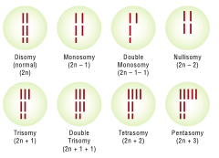

**(ii) Euploidy**

Euploidy is a condition where the organisms possess one or more basic sets of chromosomes. Euploidy is classified as monoploidy, diploidy and polyploidy. The condition where an organism or somatic cell has two sets of chromosomes are called diploid (2n). Half the number of somatic chromosomes is referred as gametic chromosome number called haploid(n). It should be noted that haploidy (n) is different from a monoploidy (x). For example, the common wheat plant is a polyploidy (hexaploidy) 2n=6x=72 chromosomes. Its haploid number (n) is 36, but its monoploidy (x) is 12. Therefore, the haploid and diploid condition came regularly one after another and the same number of chromosomes is maintained from generation to generation, but monoploidy condition occurs when an organism is under polyploidy condition. In a true diploid both the monoploid and haploid chromosome number are same. Thus a monoploid can be a haploid but all haploids cannot be a monoploid. 

**Polyploidy**

Polyploidy is the condition where an organism possesses more than two basic sets of chromosomes. When there are three, four, five or six basic sets of chromosomes, they are called triploidy (3x) tetraploidy (4x), pentaploidy (5x) and hexaploidy (6x) respectively. Generally, polyploidy is very common in plants but rarer in animals. An increase in the number of chromosome sets has been an important factor in the origin of new plant species. But higher ploidy level leads to death. Polyploidy is of two types. They are autopolyploidy and allopolyploidy

**1. Autopolyploidy** The organism which possesses more than two haploid sets of chromosomes derived from within the same species is called autopolyploid. They are divided into two types. Autotriploids and autotetraploids.

**Autotriploids** have three set of its own genomes. They can be produced artificially by crossing between autotetraploid and diploid species. They are highly sterile due to defective gamete formation. Example: The cultivated banana are usually triploids and are seedless having larger fruits than diploids. Triploid sugar beets have higher sugar content than diploids and are resistant to moulds. Common doob grass (**_Cyanodon_** **_dactylon_**) is a natural autotriploid. Seedless watermelon, apple, sugar beet, tomato, banana are man made autotriploids.


**Autotetraploids** have four copies of its own genome. They may be induced by doubling the chromosomes of a diploid species. Example: rye, grapes, alfalfa, groundnut, potato and coffee.

**2. Allopolyploidy**

An organism which possesses two or more basic sets of chromosomes derived from two different species is called allopolyploidy. It can be developed by interspecific crosses and fertility is restored by chromosome doubling with colchicine treatment. Allopolyploids are formed between closely related species only. (Figure 3.15)

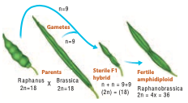


Example:1 **_Raphanobrassica_**, **G.D. Karpechenko** (1927) a Russian geneticist, crossed the radish (**_Raphanus sativus_**, 2n=18) and cabbage (**_Brassica oleracea_**, 2n=18) to produce F1 hybrid which was sterile. When he doubled the chromosome of F1 hybrid he got it fertile. He expected this plant to exhibit the root of radish and the leaves like cabbage, which would make the entire plant edible, but the case was vice versa, so he was greatly disappointed.

Example: 2 **Triticale**, the successful first man made cereal. Depending on the ploidy level Triticale can be divided into three main groups.

(i). Tetraploidy: Crosses between diploid wheat and rye.

(ii). Hexaploidy: Crosses between tetraploid wheat Triticum durum (macaroni wheat) and rye

(iii). Octoploidy: Crosses between hexaploid wheat T. aestivum (bread wheat) and rye

Hexaploidy Triticale hybrid plants demonstrate characteristics of both macaroni wheat and rye.

For example, they combine the high-protein content of wheat with rye’s high content of the amino acid lysine, which is low in wheat. It can be explained by chart below (Figure: 3.16).
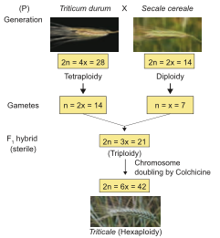


**Colchicine** , an alkaloid is extracted from root and corms of **_Colchicum autumnale_**, when applied in low concentration to the growing tips of the plants it will induce polyploidy. Surprisingly it does not affect the source plant Colchicum, due to presence of anticolchicine.


**Significance of Ploidy** 

- Many polyploids are more vigorous and
more adaptable than diploids. 
- Many ornamental plants are autotetraploids and have larger flowers and longer flowering duration than diploids.
- Autopolyploids usually have higher fresh weight due to more water content.
- Aneuploids are useful to determine the phenotypic effects of loss or gain of different chromosomes.
- Many angiosperms are allopolyploids and they play a role in the evolution of plants.

```
**Activity: Solve this**

When two plants (A and B) belonging to the same genus but different species are crossed, the F1 hybrid is viable and has more ornate flowers. Unfortunately, this hybrid is sterile and can only be propagated by vegetative cuttings. Explain the sterility of the hybrid and what would have to occur for the sterility of this hybrid to be reversed.

```

**II Structural changes in chromosome (Structural chromosomal aberration)**

Structural variations caused by addition or deletion of a part of chromosome leading to rearrangement of genes is called **structural chromosomal aberration**. It occurs due to ionizing radiation or chemical compounds. On the basis of breaks and reunion in chromosomes, there are four types of aberrations. They are classified under two groups.

**A. Changes in the number of the gene loci** 

1. Deletion or Deficiency 
2. Duplication or Repeat

**B. Changes in the arrangement of gene loci** 

3. Inversion 
4. Translocation

**1. Deletion or Deficiency** Loss of a portion of chromosome is called deletion. On the basis of location of breakage on chromosome, it is divided into terminal deletion and intercalary deletion. It occurs due to chemicals, drugs and radiations. It is observed in **_Drosophila_** and Maize. (Figure 3.29)

**2. Duplication or Repeat** The process of arrangement of the same order of genes repeated more than once in the same chromosome is known as **duplication.** Due to duplication some genes are present in more than two copies. It was first reported in **_Drosophila_** by Bridges (1919) and other examples are Maize and Pea

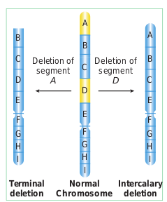

**4. Translocation**

The transfer of a segment of chromosome to a non-homologous chromosome is called translocation. Translocation should not be confused with crossing over, in which an exchange of genetic material between homologous chromosome takes place. Translocation occurs as a result of interchange of chromosome segments in non-homologous chromosomes. There are three types

i. Simple translocation 
ii. Shift translocation 
iii. Reciprocal translocation


## DNA Metabolism in Plants

 As the repository of genetic information, DNA occupies a unique and central place among biological macromolecules. The structure of DNA is a marvelous device for the storage of genetic information. The term “DNA Metabolism” can be used to describe process by which copies of DNA molecules are made (replication) along with repair and recombination.

In this chapter we briefly discuss about the DNA metabolism in plants

**DNA Replication:** In the double helix the two parental strands of DNA separate and each parental strand synthesizes a new complementary strand. DNA replication is semiconservative, i.e each new DNA molecule conserves one original strand.

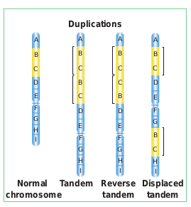

**DNA Repair:** How is genomic stability maintained in all living organisms? How do organisms on earth survive? What is essential for their survival? DNA is unique because it is the only macromolecule where the repair system exists, which recognises and removes mutations. DNA is subjected to various types of damaging reactions such as spontaneous or environmental agents or natural endogenous threats. Such damages are corrected by repair enzymes and proteins, immediately after the damage has taken place. DNA repair system plays a major role in maintaining the genomic / genetic integrity of the organism. DNA repair systems protect the integrity of genomes from genotoxic stresses.

```

Plants are sessile. How do they protect themselves from the exposure of sunlight throughout the day?

Plants have effective DNA repair mechanism to prevent UV damage from sunlight. They produce an enzyme called photolyase, which can repair the thymine dimers and restore the structure of DNA.

```

**Recombination:** In cells the genetic information within and among DNA molecule are re-arranged by a process called genetic recombination. Recombination is the result of crossing over between the pairs of homologous chromosomes during meiosis. In earlier classes you have learnt chromosomal recombination. In molecular level it involves breakage and reunion of polynucleotides.

### Eukaryotic DNA replication
Replication starts at a specific site on a DNA sequence known as the Origin of replication. There are more than one origin of replication in eukaryotes. **_Saccharomyces cerevisiae_** (yeast) has approximately 400 origins of replication. DNA replication in eukaryotes starts with the assembly of a prereplication complex (preRC) consisting of 14 different proteins. Part of a preRC is a group of 6 proteins called the origin recognition complex (ORC) which acts as initiator in eukaryotic DNA replication. The origin of replication in **yeast** is called as **ARS** **sites (Autonomously Replicating Sequences).** In yeast, ORC was identified as a protein complex which binds directly to ARS elements.

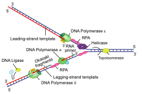

Replication fork is the site (point of unwinding) of separation of parental DNA strands where new daughter strands are formed. Multiple replication forks are found in eukaryotes. The enzyme helicases are involved in unwinding of DNA by breaking hydrogen bonds holding the two strands of DNA and replication protein A (RPA) prevents the separated polynucleotide strand from getting reattached.

**Topoisomerase** is an enzyme which breaks DNAs covalent bonds and removes positive supercoiling ahead of replication fork. It eliminates the torsional stress caused by unwinding of DNA double helix.

DNA replication is initiated by an enzyme **DNA polymerase α** / primase which synthesizes short stretch of RNA primers on both leading strand (continuous DNA strand) and lagging strands (discontinuous DNA strand). Primers are needed because DNA polymerase requires a free 3’ OH to initiate synthesis. DNA polymerase covalently connects the nucleotides at the growing end of the new DNA strand. DNA Pol α (alpha), DNA Pol δ (delta) and DNA Pol ε (Epsilon) are the 3 enzymes involved in nuclear DNA replication. **DNA Pol α –** Synthesizes short primers of RNA 
**DNA Pol δ –** Main Replicating enzyme of cell nucleus 
**DNA Pol ε –** Extend the DNA Strands in replication fork

```

DNA Polymerase β does not play any role in the replication of normal DNA. Function - Removing incorrect bases from damaged DNA. It is involved in Base excision repair.

```

DNA Synthesis takes place in 5’->  3’ direction and it is semidiscontinuous. When DNA is synthesized in 5’ -> 3’ direction, only in the free 3’ end (OH end) DNA is elongated. In 1960s Reiji Okazaki and his colleagues found out that one of the new DNA strands is synthesized in short pieces called **Okazaki fragments**. In discontinuous  strand where the Okazakifragments are united by ligase is called Lagging strand where the replication direction is 5’-> 3’ which is opposite to the direction of fork movement. . The continuous strand is called Leading strand where the replication direction is 5’-> 3’ which is same to the direction to that of the replication fork movement. DNA ligase joins any nicks in the DNA by forming a phosphodiester bond between 3’ hydroxyl and 5’ phosphate group.


**Arabidopsis telomere sequence - TTTAGGG**

**Plants Lacks Telomere Clock** 

Plant meristematic cells produces telomerase so the meristematic cells has an unlimited ability to divide. You have already studied about the telomeres in Chapter 6 and 8 of Class XI. In plants telomeres do not shrink as in somatic cells of vertebrates. Telomerase levels are higher in root tips and seedlings (renewable tissue) which has a higher amount of meristematic cells than proliferative structures like leaves.

**What is the special mechanism which replicates chromosomal ends?** 

After the replication of the chromosomes, the enzyme **telomerase** adds several more repeats of DNA sequences to the telomeres. Telomerase use short RNA molecules as a template and add repeat sequences on to telomeres (DNA nucleotide polymerisation).

**The Energetics of DNA Replication -** Deoxyribonucleotides such as deoxyadenosine triphosphate dATP, dGTP, dCTP and dTTP provide energy for the synthesis of DNA. Purpose of Deoxyribonucelotides (1) acts as a substrate (2) provide energy for polymerisation.

### Experimental evidence of DNA replication: Taylors Experiment 

**J. Herbert Taylor, Philip Woods and Walter Hughes demonstrated the semiconservative replication of DNA in the root cells of _Vicia faba.** 

They labelled DNA with 3H Thymidine,_
a radioactive precursor of DNA and performed autoradiography. They grew root tips in a medium in the presence of radioactive labelled thymidine, so that the radioactivity was incorporated into the DNA of these cells. The outline of this labelled chromosomes appears in the form of scattered black dots of silver grains on a photographic film.

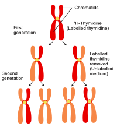

The root tips with labelled chromosomes were placed in an unlabelled medium containing colchicine to arrest the culture at the metaphase and examine the chromosome by autoradiography. The observations were,

1. In the chromosome of first generation the **radioactivity** was found to be distributed to **both the chromatids** because in the original strand of DNA double helix was labelled with radioactivitiy and the new strand was unlabelled.

2. In the chromosome of the **second generation only one of the two chromatids** in each chromosome was radioactive (labelled).

The results proved the semiconservative method of DNA replication.

## Protein synthesis in plants
The process of protein synthesis consists of two major steps, they are Transcription and Translation.
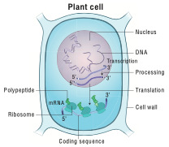 
 
## Transcription
 
 Transcription is the process in which one strand of DNA acts as a template to generate mRNA with the bases complementary to the template strand. It is catalyzed by the enzymes called RNA polymerases.

**Transcription** and processing of RNA takes place in the **nucleus**, whereas the **translation** occurs in the ribosomes found in **cytoplasm**. In Eukaryotes, mRNA molecules are **monocistronic** with only one protein being derived from each mRNA.

The transcription begins with unwinding of DNA double helix and the hydrogen bonds are broken at the site of the gene being transcribed. **Template Strand / Non-Coding Strand / Antisense Strand** The strand of DNA which is oriented in 3’-> 5’ direction that serves as a template for the synthesis of mRNA is called template strand.

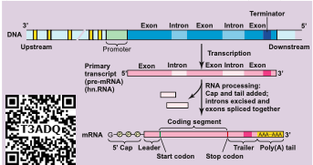

**Coding strand / Non-template strand / Sense Strand**

The other strand of DNA which is not transcribed is called the Coding Strand.

A specific sequence of DNA nucleotides called the **Promoter** is necessary for transcription to takes place. It consists of TATA box and transcription start site where transcription begins.

**Termination sequences** are the DNA sequences which tells when the RNA polymerase should stop producing RNA molecule.

Eukaryotic structural gene has 3 features in promoter 
1. Regulatory elements 
2. TATA box 
3. A transcriptional start site 

The transcription start site contains about 25 bp (basepairs) upstream, the sequence is TATAAT known as **TATA or Hogness box** which is present in core promoter. **General transcriptional factors** are the proteins which recognise base sequences of DNA and controls transcription. Some transcription factors bind directly to the promoter.

Some transcription factors recognize the regulatory elements and bind to them to increase the rate of transcription, others inhibits transcription.

To start the process of transcription the Regulatory elements help the RNA polymerase

to recognize core promoter. The two categories of regulatory elements are

**1. Enhancer sequences** – they are DNA sequences (activating sequences) which help to influence transcription.

**2. Silencer sequence** – DNA sequences that inhibit transcription or decrease transcription.

```
**Consensus sequence** – An ideal sequence in which each position represents the base which is found most often.

```

In addition to General transcription factors (GTF) and **RNA Pol II, a mediator** is required for transcription. The interactions between RNA polymerase II and regulatory TF that bind to enhancers or silencers are mediated by a mediator.

RNA Polymerases cannot bind directly to the DNA, first it binds to the transcription factor which recognizes the promoter sequences which helps to find the protein coding regions of DNA.

RNA Polymerase with the promoter sequence will transcribe the gene. Transcription factor plays an important role in guiding RNA Polymerases to the promoter sequence. RNA Polymerases bind RNA nucleotides together forming a growing strand in the 5’-> 3’ direction. Transcription occurs in 5’-> 3’ direction, RNA Polymerase catalyses the addition of nucleotides at the 3’ end of the growing chain of RNA.

In Eukaryotes, 3 different RNA Polymerases called RNA Polymerases I, II and III are found.

| **Enzyme**            | **Synthesis**                                             |
|-----------------------|-----------------------------------------------------------|
| RNA<br>Polymerase I   | Large Ribosome RNAs<br>except 5S rRNA                     |
| RNA<br>Polymerase II  | Precursors of mRNAs<br>(hnRNAs)                           |
| RNA<br>Polymerase III | tRNAs, 5S ribosomal RNA,<br>snRNAs (small nuclear<br>RNA) |

**The processing of pre-mRNA to mature mRNA / Molecular mechanism of RNA modification**

In eukaryotes three major types of RNA, mRNA, tRNA and rRNA are produced from a precursor RNA molecule termed as the primary transcript or preRNA. The RNA polymerase II transcribes the precursor of mRNA, which are also called the **heterogenous nuclear RNA** or hnRNA which are processed in the nucleus before they are transported into the cytoplasm.

**Capping**

Modification at the 5’ end of the primary RNA transcript (hn RNA) with methylguanosine triphosphate is called capping.

```

**Internal methylation** Apart from capping, the internal nucleotides in mRNA are also methylated.

Methylated sites are present in translated, untranslated regions, introns and exons.

```

**Purpose of Capping** 

1. Protects RNA from degradation. 
2. Capping plays an important role in
removal of first intron in pre mRNA. 
3. It regulates the mRNA export from the
nucleus into the cytoplasm. 
4. It helps in binding of mRNA to the ribosome.

**Tailing / Polyadenylation**

The 3’ end of hnRNA is cleaved by an endonuclease and a string of adenine nucleotides is added to the 3’ end of hnRNA (pre mRNA) is known as Poly (A) tail - Polyadenylation. This process is called tailing or polyadenylation.

**Purpose of Tailing**

1. Translation of RNA transcript is facilitated.

2. Helps in the synthesis of Polypeptides.
3. It enhances the mRNA stability in the cytoplasm. 

The protein coding regions are not continuous in eukaryotes. Split genes were independently discovered by Richard J Roberts and Phillip A. Sharp in 1977 and was awarded Nobel Prize in 1993. **Exons** are the coding sequences or expressed sequences contain biological informations in the matured processed mRNA. **Introns** are intervening sequences, which are non-coding sequences (non-amino acid- coding sequences) that should be removed from a gene before the mRNA product is made. Introns do not code for any enzyme or structural protein or polypeptides. These exons and introns are known as Split Genes.

### RNA Splicing in plants

RNA Splicing is a process which involves the cutting or removing out of introns and knitting of exons. This process takes place in spherical particles which is a multiprotein complex called **SPLICISOMES.** It is approximately 40 – 60 nm in diameter. The spliceosomes have many small nuclear ribonucleic acids (snRNAs) and small nuclear ribonuclear protein particles (snRNPs) which identify and helps in the removal of introns.

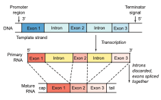

A spliceosome removes the introns with an enzyme ribozyme. Now the mature mRNA comes away from the spliceosomes through the nuclear pore and is transported out from the nucleus into cytoplasm, and gets attached to ribosome to carry out translation. The RNA and many proteins are transported through a nuclear pore complex by an energy dependent process.

### Translation
 The genetic information in the DNA code is copied onto mRNA bound in ribosomes for making polypeptides. The mRNA nucleotide sequence is decoded into amino acid sequence of the protein which is catalyzed by the ribosome. This process is called translation.

**Terminology in Protein synthesis**

**Codon** – DNA codes are referred to as triplet codes and those in mRNA is called as Codons. Each triplet specifies a particular amino acid. Codons present in mRNA are read in 5’-> 3’ direction. There are 64 codons of which 61 codons codes for amino acids.

**Start codon** – AUG specified methionine

**Stop or Termination codon** – UAA – Ochre UAG – amber and UGA – Opal.

**Anticodons** – The triplet of bases in a tRNA molecule is known as anticodon. In tRNA sequence of three bases which is complementary to codons of mRNA are called anticodon. The codons of mRNA are recognized by the anticodons of tRNA which are oriented in 3’-> 5’ direction.

**Process of translation** 

The following are major steps in translation process

**1. Initiation** The translation begins with the AUG codon (start codon) of mRNA. Translation occurs on the surface of the macromolecular arena called the ribosome. It is a nonmembranous organelle. During the process of translation the two subunits of ribosomes unite (combine) together and hold mRNA between them. The protein synthesis begins with the reading of codons of mRNA. The tRNA brings amino acid to the ribosome, a molecular machine which unites amino acids into a chain according to the information given by mRNA. rRNA plays the structural and catalytic role during translation.

A ribosome has one binding site for mRNA and two for tRNA. The two binding sites of tRNA are

**i. P-Site – The peptidyl – tRNA binding site** is one of the tRNA binding site. At this site tRNA is held and linked to the growing end of the polypeptide chain.

**ii. A-Site – The Aminoacyl – tRNA binding site.** This is another tRNA binding site which holds the incoming amino acids called aminoacyl tRNA. The anticodons of tRNA pair with the codons of the mRNA in these sites.

**2. Elongation of polypeptide chain** The P and A sites are nearby, so that two tRNA form base pairs with adjacent codon. The polypeptide chain is formed by the pairing of codons and anticodons according to the nucleotide sequence of the mRNA.

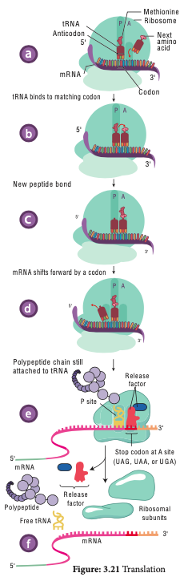

**Translators of the genetic code - tRNA** 

The tRNA translates the genetic code from the nucleic acid sequence to the amino acid sequence i.e from gene – Polypeptide. When an amino acid is attached to tRNA it is called **aminoacylated or charged**. This is an energy requiring process which uses the ATP for its energy requirement. Protein synthesis takes place as the next aminoacyl tRNA binds to the A-Site.

The translation begins with the AUG codon (start codon) of mRNA. The tRNA which carries first amino acid **methionine** attach itself to P-site of ribosome. The ribosome adds new amino acids to the growing polypeptides. The second tRNA molecules has anticodons which carries amino acid **alanine** pairs with the mRNA codon in the A-site of the ribosome. The aminoacids **methionine** and **alanine** are close enough so that a peptide bond is formed between them.

The bond between the first tRNA and **methionine** now breaks. The first tRNA leaves the ribosome and the P-site is vacant. The ribosome now moves one codon along the mRNA strand. The second t-RNA molecule now occupies the P-site. The third t-RNA comes and fills the A site (serine). Now a peptide bond is formed between **alanine** and **serine.** The mRNA then moves through the
ribosome by three bases. This expels deacylated / uncharged tRNA from P-site and moves peptidyl tRNA into the P-site and empties the A-site.This movement of tRNA from A-site to P-site is said to be translocation. The translocation requires the hydrolysis of GTP.

**The ribosome (ribozyme - peptidyl transferase)** catalyses the formation of peptide bond by adding amino acid to the growing polypeptide chain.

The ribosome moves from codon to codon along the mRNA in the 5’ to 3’ direction. Amino acids are added one by one translated into polypeptide as dictated by the mRNA. Translation is an energy intensive process. A cluster of ribosomes are linked together by a molecule of mRNA and forming the site of protein synthesis is called as **polysomes** or **polyribosomes.**

**3. Termination of polypeptide synthesis**

Eukaryotes have cytosolic proteins called **release factors** which recognize the termination codon, UAA, UAG, or UGA when it is in the A site. When the ribosome reaches a stop codon the protein synthesis comes to an end. So ribosomes are the protein making factories of a cell. When the polypeptide is completed the ribosome releases the polypeptide and detaches from the mRNA molecule. Now the ribosome splits into small and large subunits after the release of mRNA.

### Alternative Splicing in plants
 It is very useful in regulating gene expression to overcome the environmental stress in plants.

 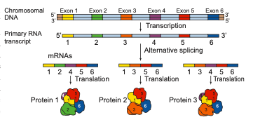

Alternative splicing is an important mechanism / process by which multiple mRNA’s and multiple proteins products can be generated from a single gene. The different proteins generated are called isoforms. There are various modes of alternative splicing. When multiple introns are present in a gene, they are removed separately or as a unit. In certain cases one or more exons which is present between the introns are also removed.

**Significance of alternative splicing**

1. The proteins transcribed from alternatively spliced mRNA containing different amino acid sequence lead to the generation of protein diversity and biological functions.

2. Multiple protein isoforms are formed. 

3. It creates multiple mRNA transcripts from a single gene. A process of producing related proteins from a single gene thereby the number of gene products are increased.

4. It plays an important role in plant functions such as stress response and trait selection. The plant adapts or regulates itself to the changing environment.

### RNA Editing – Post Transcriptional RNA Processing in plants

Transcriptional RNA Processing in plants

Chemical modification such as base modification, nucleotide insertion or deletions and nucleotide replacements of
mRNA results in the alteration of amino acid sequence of protein that is specified is called RNA editing. This results in the change in the protein coding sequence of RNA following transcription. The coding properties of the RNA transcript is changed. The genetic information encoded in the chloroplast genome is altered by post transcriptional phenomenon which is site – specific (C -> U) in chloroplast of higher plants – RNA editing occurs in plant mitochondria and chloroplast.

In plant cells RNA editing by pyrimidine transitions occurs in mitochondria and plastids (chloroplast). There are two main types of RNA editing. (1) Substitution editing – Alteration of individual nucleotide bases. Mitochondria and chloroplast RNA in plants. (2) Insertion / Deletion editing – Nucleotides are added or deleted from the total number of bases.

**Plant organelle gene expression is coordinated with the nuclear gene expression**

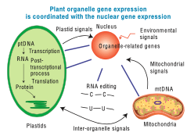

**Significance of RNA Editing**

1. In higher plant chloroplast, it helps to restore the codons for conserved amino
acids which include initiation and termination codon.

2. It regulates Organellar gene expression in plants.

3. RNA editing results in the restoration of codons for phylogenetically conserved amino acid residues.

**RNA Editing types**

| **Year** | **Editing type** | **Organelle in Plant cell** | **Target** | **Inference / Result**                                              |
|----------|------------------|-----------------------------|------------|---------------------------------------------------------------------|
| 1989     | C -> U           | **Plant mitochondria**      | mRNA       | For conserved amino acids, multiple<br>changes in codon takes place |
| 1990     | U -> C           | **Plant mitochondria**      | mRNA       | First report on editing (U -> C)                                    |
| 1991     | C -> U           | **Pllant chloroplast**      | mRNA       | First report in **chloroplast**                                     |

### Jumping Genes

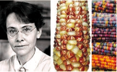

 **Have you heard of Jumping Genes or Hopping Genes?**

This is the nick name of transposable genetic elements. Transposons are the DNA sequences which can move from one position to another position in a genome. This was first reported in 1948 by American Geneticist Barbara McClintock as “mobile controlling element” in Maize. One of the most significant scientists of 20th century was Barbara McClintock because she gave a shift in gene organization. McClintock was awarded Nobel prize in 1983 for her work on transposons. Barbara McClintock when studying aleurone of single maize kernels, noted the unstable inheritance of the mosaic pattern of blue, brown and red spots due to the differential production of vacuolar anthocyanins. 

In maize plant genome has AC / Ds transposon (AC = Activator, Ds = Dissociation). The activity of AC element is very distinct in maize plant. The transposition in somatic cells results in the changes in gene expression such as variegated pigmentation in maize kernels. Maize genome has transposable elements which regulated the different colour pattern of kernels. 

McClintock’s findings concluded that Ds and AC genes were mobile controlling elements. We now call it as transposable elements, a term coined by maize geneticist, Alexander Brink. McClintock gave the first direct experimental evidence that genomes are not static but are highly plastic entities.

**Significance of transposons** 

1. They contribute to many visible mutations and mutation rate in an Organism. 
2. In evolution, they contribute to genetic diversity. 
3. In genetic research transposons are
valuable tools which are used as mutagens, as cloning tags, vehicles for inserting foreign DNA into model organism.

**Plant genome –** The word genome is defined as the full complement of DNA (including all the genes and the intergenic regions) present in an organism It specifies the entire biological information of an organism. There are three distinct genomes in eukaryotic cells and they are (1) The nuclear genome (2) The mitochondrial genome and (3) The chloroplast genome present only in plants.

_Arabidopsis thaliana_ – Thale cress, Mouse- ear cress

1. It is a model plant for the study of genetic and molecular aspects of plant development.

2. It belongs to mustard family and it is the first flowering plant, where its entire genome is sequenced.

3. The two regions of the nucleolar organiser ribosomal DNA which codes for the ribosomal RNA are present at the extremity of chromosomes 2 and 4

4. It is Diploid plant having small genome with 2n = 10 chromosomes. Several generations can be produced in one year. So it facilitates rapid genetic analysis. The genome has low repetitive DNA, over 60% of the nuclear DNA have protein coding functions.

5. The plant is small, self fertilizes, annual long-day plant with short-life cycle (only 6 weeks), large numbers of seeds are produced and they are easy to be grown in laboratory. It is easy to induce mutations. It has many genomic resources and the transformation can be done easily.

6. In 1982, Arabidopsis has successfully completed its life cycle in Microgravity i.e. space. This shows that Human Space Missions with plant companions may be possible.

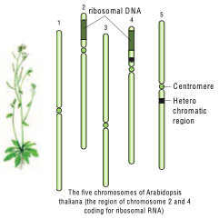

## SUMMARY 

Chromosomal theory of inheritance states that Mendelian factors have specific loci on chromosomes and they carry information from one generation to the next generation. Genes located close together on the same chromosome and inherited together are called linked genes the phenomenon is called Linkage. Two types of linkage are complete linkage and incomplete linkage. The groups of linearly arranged linked genes are called Linkage groups. Crossing over is a biological process that produces new combination of genes by inter-changing the corresponding segments between non-sister chromatids of homologous pair of chromosomes. In this segments of DNA are broken and recombined to produce new combinations of alleles a process is called Recombination. The diagrammatic representation of distances between the adjacent genes which is directly proportional to the frequency of recombination between them is called genetic mapping. When any of the three or more allelic forms of a gene occupy the same locus in a given pair of homologous chromosomes, they are said to be multiple alleles. They are m, M1 and M2 of a single gene. Mutational events that take place within individual genes are called gene mutations or point mutation, whereas the changes that occur in structure and number of chromosomes are called chromosomal mutation. The agents which are responsible for mutation is called mutagens.

DNA metabolism includes replication, repair and recombination. Protein synthesis in eukaryotes is unique due to the capping, tailing and splicing. Transcription takes place in nucleus and translation in cytoplasm. AUG codes for methionine and it is monocistronic. Alternative splicing is a mechanism to overcome stress in plants. RNA editing takes place in chloroplast and mitochondria of plants which is of phylogenetic importance. Controlling elements gave a major shift in the
gene organisation in plants to prove that DNA is not static but plastic entities. The first genome sequenced is Arabidopsis thaliana, which is a potential genetic tool to study the development and metabolism in plants.

---
title: 'Chromosomal Basis of Inheritance'
weight: 4
---
  
```
**Learning Objectives**

The Learner will be able to

- Understand chromosomal theory of inheritance.

- Analyze the three - point test crosses and appreciate results in linkage map construction.

- Differentiate mutation types with examples.

- Explain DNA metabolism in Plants
```

In the previous chapter you have learned about Mendelian genetics, now you are going to be study with deviations of concepts related to Mendelian genetics and chromosomal theory of inheritance. You must recall the structure of chromosome and cell division from eleventh standard. 

## Chromosomal Theory of Inheritance

G. J. Mendel (1865) studied the inheritance of well-defined characters of pea plant but for several reasons it was unrecognized till 1900. Three scientists (de Vries, Correns and Tschermak) independently rediscovered Mendel’s results on the inheritance of characters. Various cytologists also observed cell division due to advancements in microscopy. This led to the discovery of structures inside nucleus. In eukaryotic cells, worm-shaped structures formed during cell division are called **chromosomes** (colored bodies, visualized by staining). An organism which possesses two complete basic sets of chromosomes are known as diploid. A chromosome consists of long, continuous coiled piece of DNA in which genes are arranged in linear order. Each gene has a definite position (locus) on a chromosome. These genes are hereditary units. Chromosomal theory of inheritance states that Mendelian factors (genes) have specific locus (position) on chromosomes and they carry information from one generation to the next generation.

### Historical development of chromosome theory

The important cytological findings related to the chromosome theory of inheritance are given below.  

**Wilhelm Roux (1883)** postulated that the chromosomes of a cell are responsible for transferring heredity.

**Montgomery (1901)** was first to suggest occurrence of distinct pairs of chromosomes and he also concluded that maternal chromosomes pair with paternal chromosomes only during meiosis.

- **T. Boveri (1902)** supported the idea that the chromosomes contain genetic determiners, and he was largely responsible for developing the chromosomal theory of inheritance.

- **W.S. Sutton (1902),** a young American student independently recognized a parallelism (similarity) between the behaviour of chromosomes and Mendelian factors during gamete formation. 

**Sutton** and **Boveri (1903)** independently proposed the chromosome theory of inheritance. Sutton united the knowledge of chromosomal segregation with Mendelian principles and called it chromosomal theory of inheritance.

### Salient features of the Chromosomal theory of inheritance

- Somatic cells of organisms are derived from the zygote by repeated cell division (mitosis). These consist of two identical sets of chromosomes. One set is received from female parent (maternal) and the other from male parent (paternal). These two chromosomes constitute the homologous pair.

- Chromosomes retain their structural uniqueness and individuality throughout the life cycle of an organism.

- Each chromosome carries specific determiners or Mendelian factors which are now termed as genes.

- The behaviour of chromosomes during the gamete formation (meiosis) provides evidence to the fact that genes or factors are located on chromosomes.

### Comparison between gene and chromosome behaviour

Around twentieth century cytologists established that, generally the total number of chromosomes is constant in all cells of a species.

A diploid eukaryotic cell has two haploid sets of chromosomes, one set from each parent. All somatic cells of an organism carry the same genetic complement. The behaviour of chromosomes during meiosis not only explains Mendel’s principles but leads to new and different approaches to study about heredity.


**Table 3.1:** Parallelism between Mendelian factors and chromosomal behaviour

| Mendelian factors                                                                                       | Chromosomes<br>behaviour                                                                                                                                                  |
|---------------------------------------------------------------------------------------------------------|----------------------------------------------------------------------------------------------------------------------------------------------------------------------------|
| 1.  Alleles of a factor<br>    occur in pair                                                            | Chromosomes occur<br>in pairs                                                                                                                                              |
| 2.  Similar or dissimilar<br>    alleles of a factor<br>    separate during the<br>    gamete formation | The homologous<br>chromosomes separate<br>during meiosis                                                                                                                   |
| 3.  Mendelian<br>    factors can assort<br>    independently                                            | The paired<br>chromosomes<br>can separate<br>independently during<br>meiosis but the<br>linked genes in the<br>same chromosome<br>normally do not<br>assort independently. |

**Table 3.1:** Parallelism between Mendelian factors and chromosomal behaviour.


| Organism                                | Number of<br>chromosomes (2n) |
|-----------------------------------------|-------------------------------|
| Adder’s tongue fern<br>(Ophioglossum) |              1262             |
| Horsetail (Equisetum)                 |              216              |
| Giant sequoia                           |               22              |
| Arabidopsis                           |               10              |
| Sugarcane                               |               80              |
| Apple                                   |               34              |
| Rice                                    |               24              |
| Potato                                  |               48              |
| Maize                                   |               20              |
| Onion                                   |               16              |
| Haplopappus gracilis                  |               4               |

**Table 3.2 :** Number of Chromosomes

**Thomas Hunt Morgan (1933)** received Nobel Prize in Physiology or Medicine for his discoveries concerning the role played by chromosomes in heredity.


## Linkage
The genes which determine the character of an individual are carried by the chromosomes. The genes for different characters may be present either in the same chromosome or in different chromosomes. When the genes are present in different chromosomes, they assort independently according to Mendel’s Law of Independent Assortment. Biologists came across certain genetic characteristicsthat did not assort out independently in other organisms after Mendel’s work. One such case was reported in Sweet pea **_(Lathyrus odoratus)_** by **William Bateson** and **Reginald C. Punnet** in 1906. They crossed one homozygous strain of sweet peas having **purple flowers** and long **pollen grains** with another homozygous strain having **red flowers** and **round pollen grains**. All the F1 progenies had purple flower and long pollen grains indicating purple flower long pollen **(PL/ PL)** was dominant over red flower round pollen **(pl/pl)**. When they crossed the F1 with double recessive parent (test cross) in results, F2 progenies did not exhibit in 1:1:1:1 ratio as expected with independent assortment. A greater number of F2 plants had purple flowers and long pollen or red flowers and round pollen. So they concluded that genes for purple colour and long pollen grain and the genes for red colour and round pollen grain were found close together in the same homologous pair of chromosomes. These genes do not allow themselves to be separated. So they do not assort independently. This type of tendency of genes to stay together during separation of chromosomes is called **Linkage.**


Genes located close together on the same chromosome and inherited together are called **linked genes.** But the two genes that are sufficiently far apart on the same chromosome are called **unlinked genes or syntenic genes** (Figure 3.4). Such condition is known as **synteny**. It is to be differentiated by the value of recombination frequency. If the recombination frequency value is more than 50 % the two genes show unlinked. when the recombination frequency value is less than 50 %, they show linked. Closely located genes show strong linkage, while genes widely located show weak linkages.

```
**Fossil Genes:** Some of the junk DNA is made up of pseudo genes, the sequences presence in that was once working genes.
They lost their ability to make proteins. They tell the story of evolution through fossilized parts.

```
### Coupling and Repulsion theory

The two dominant alleles or recessive alleles occur in the same homologous chromosomes, tend to inherit together into same gamete are called **coupling or cis configuration** (Figure: 3.5). If dominant or recessive alleles are present on two different, but homologous chromosomes they inherit apart into different gamete are called **repulsion or trans configuration** (Figure: 3.6).


### Kinds of Linkage 

**T.H. Morgan** found two types of linkage. They are complete linkage and incomplete linkage depending upon the absence or presence of new combination of linked genes.

**Complete Linkage** 

If the chances of separation of two linked genes are not possible those genes always remain together as a result, only parental combinations are observed. The linked genes are located very close together on the same chromosome such genes do not exhibit crossing over. This phenomenon is called **complete linkage**. It is rare but has been reported in male **_Drosophila_. C.B Bridges** (1919) discovered that crossing over is completely absent in some species of male **_Drosophila_**.

**Incomplete Linkage** 

If two linked genes are sufficiently apart, the chances of their separation are possible. As a result, parental and non-parental combinations are observed. The linked genes exhibit some crossing over. This phenomenon is called**incomplete linkage**. This was observed in maize. It was reported by Hutchinson.

### Linkage Groups

 The groups of linearly arranged linked genes on a chromosome are called **Linkage groups**. In any species the number of linkage groups corresponds to the number haploid set of chromosomes. Example:

| Name of organism | Linkage groups |
|------------------|----------------|
| Mucor            |        2       |
| Drosophila       |        4       |
| Sweet pea        |        7       |
| Neurospora       |        7       |
| Maize            |       10       |

**Table 3.3 :** Linkage groups in some organisms

Linkage and crossing over are two processes that have opposite effects. Linkage keeps particular genes together but crossing over mixes them. The differences are given below.

| Linkage                                                                        | Crossing over                                                                                             |
|--------------------------------------------------------------------------------|-----------------------------------------------------------------------------------------------------------|
| 1. The genes<br>   present on<br>   chromosome<br>   stay close<br>   together |                                 It leads to separation<br>of linked genes                                 |
| 2. It involves<br>   same chromosome<br>   of homologous<br>   chromosome      |   It involves exchange <br>of segments between<br>non-sister chromatids <br>of homologous<br>chromosome.  |
| 3. It reduces<br>   new gene<br>   combinations                                | It increases variability<br>by forming new gene <br>combinations. lead<br>to formation of new<br>organism |

**Table 3.4:** Differences between linkage and crossing over

## Crossing Over
Crossing over is a biological process that produces new combination of genes by inter-changing the corresponding segments between non-sister chromatids of homologous pair of chromosomes. The term 'crossing over' was coined by Morgan **(1912).** It takes place during pachytene stage of prophase I of meiosis. Usually crossing over occurs in germinal cells during gametogenesis. It is called meiotic or germinal crossing over. It has universal occurrence and has great significance. Rarely, crossing over occurs in somatic cells during mitosis. It is called somatic or mitotic crossing over. 
 
### Mechanism of Crossing Over
 
Crossing over is a precise process that includes stages like synapsis, tetrad formation, cross over and terminalization.

**(i) Synapsis** Intimate pairing between two homologous

chromosomes is initiated during zygotene stage of prophase I of meiosis I. Homologous chromosomes are aligned side by side resulting in a pair of homologous chromosomes called **bivalents. This pairing phenomenon is called synapsis or syndesis.** It is of three types,


1. **Procentric synapsis:** Pairing starts from middle of the chromosome.

2. **Proterminal synapsis:** Pairing starts from the telomeres.

3. **Random synapsis:** Pairing may start from anywhere.

**(ii) Tetrad Formation** Each homologous chromosome of a bivalent begin to form two identical sister chromatids, which remain held together by a centromere. At this stage each bivalent has four chromatids. This stage is called tetrad stage.

**(iii) Cross Over** After tetrad formation, crossing over occurs in pachytene stage. The non-sister chromatids of homologous pair make a contact at one or more points. These points of contact between non- sister chromatids of homologous chromosomes are called **Chiasmata** (singular-Chiasma). At chiasma, cross-shaped or X-shaped structures are formed, where breaking and rejoining of two chromatids occur. This results in reciprocal exchange of equal and corresponding segments between them.


**(iv) Terminalisation** 

After crossing over, chiasma starts to move towards the terminal end of chromatids. This is known as **terminalisation**. As a result, complete separation of homologous chromosomes occurs.

```

**Activity: Solve this**

Consider two hypothetical recessive autosomal genes a and b, where a heterozygote is testcrossed to a double homozygous mutant. Predict the phenotypic ratios under the following conditions: 

(a) a and b are located on separateautosomes. 

(b) a and b are linked on the same autosome but are so far apart that a crossover occurs between them.

(c) a and b are linked on the same autosome but are so close together that a crossover almost never occurs.

```

### Importance of Crossing Over

Crossing over occurs in all organisms like bacteria, yeast, fungi, higher plants and animals. Its importance is  
 
- Exchange of segments leads to new gene combinations which plays an important role in evolution. 
 
- Studies of crossing over reveal that genes are arranged linearly on the chromosomes. 
 
- Genetic maps are made based on the frequency of crossing over. 
 
- Crossing over helps to understand the nature and mechanism of gene action. 

- If a useful new combination is formed it can be used in plant breeding. 


### Recombination 

Crossing over results in the formation of new combination of characters in an organism called recombinants. In this, segments of DNA are broken and recombined to produce new combinations of alleles. This process is called **Recombination.**

**Calculation of Recombination Frequency (RF)**

The percentage of recombinant progeny in a cross is called recombination frequency. The recombination frequency (cross over frequency) (RF) is calculated by using the following formula. The data is obtained from alleles in coupling configuration.

### Genetic Mapping

Genes are present in a linear order along the chromosome. They are present in a specific location called locus (plural: loci). The diagrammatic representation of position of genes and related distances between the adjacent genes is called **genetic mapping**. It is directly proportional to the frequency of recombination between them. It is also called as linkage map. The concept of gene mapping was first developed by Morgan’s student **Alfred H Sturtevant** in 1913. It provides clues about where the genes lies on that chromosome. **Map distance** The unit of distance in a genetic map is called a **map unit** (m.u). One map unit is equivalent to one percent of crossing over (Figure 4. ). One map unit is also called a centimorgan (cM) in honour of **T.H. Morgan**. 100 centimorgan is equal to one Morgan (M). For example: A distance between A and B genes is estimated to be 3.5 map units. It is equal to 3.5 centimorgans or 3.5 % or 0.035 recombination frequency between the genes.

**Uses of genetic mapping** 

- It is used to determine gene order, identify the locus of a gene and calculate the distances between genes.

- They are useful in predicting results of dihybrid and trihybrid crosses.

- It allows the geneticists to understand the overall geneti complexity of particular organism.


## Multiple alleles
A given phenotypic trait of an individual depends on a single pair of genes, each of which occupies a specific position called the locus on homologous chromosome. When any of the three or more allelic forms of a gene occupy the same locus in a given pair of homologous chromosomes, they are said to be called **Multiple alleles** 

```

**Check your Grasp**

There may be multiple alleles within the population, but individuals have only two of those alleles. Why?

```

### Characteristics of multiple alleles
 
-  Multiple alleles of a series always occupy the same locus in the homologous chromosome. Therefore, no crossing over occurs within the alleles of a series.

- Multiple alleles are always responsible for the same character.

- The wild type alleles of a series exhibit dominant character whereas mutant type will influence dominance or an intermediate phenotypic effect.

- When any two of the mutant multiple alleles are crossed the phenotype is always mutant type and not the wild type

### Self-sterility in _Nicotiana_
 In plants, multiple alleles have been reported in association with self-sterility or self- incompatibility. Self-sterility means that the pollen from a plant is unable to germinate on its own stigma and will not be able to bring about fertilization in the ovules of the same plant. **East (1925)** observed multiple alleles in **_Nicotiana_** which are responsible for self-incompatibility or self-sterility. The gene for self-incompatibility can be designated as S, which has allelic series S1, S2, S3, S4 and S5 (Figure 3.8).


The cross-fertilizing tobacco plants were not always homozygous as S_1S_1 or S_2S_2, but all plants were heterozygous as S<sub>1</sub>S<sub>2</sub> 	| , S<sub>3</sub>S<sub>4</sub> 	| , S_5S_6. When crosses were made between different S<sub>1</sub>S<sub>2</sub> 	|  plants, the pollen tube did not develop normally. But effective pollen tube development was observed when crossing was made with other than S<sub>1</sub>S<sub>2</sub> 	  for example S<sub>3</sub>S<sub>4</sub>.

| Female<br>parent 	| Male parent <br> 	| (Pollen 	| source) 	|
|---	|---	|---	|---	|
| **Stigma spot** 	| S<sub>1</sub>S<sub>2</sub> 	| S<sub>2</sub>S<sub>3</sub> 	| S<sub>3</sub>S<sub>4</sub> 	|
| S<sub>1</sub>S<sub>2</sub> 	| Self<br>Sterile 	| S<sub>3</sub>S<sub>2</sub><br>S<sub>3</sub>S<sub>1</sub> 	| S<sub>3</sub>S<sub>1</sub><br>S<sub>3</sub>S<sub>2</sub><br>S<sub>4</sub>S<sub>1</sub><br>S<sub>4</sub>S<sub>2</sub> 	|
| S<sub>2</sub>S<sub>3</sub> 	| S<sub>1</sub>S<sub>2</sub><br>S<sub>1</sub>S<sub>3</sub> 	| Self<br>Sterile 	| S<sub>4</sub>S<sub>2</sub><br>S<sub>4</sub>S<sub>3</sub> 	|
| S<sub>3</sub>S<sub>4</sub> 	| S<sub>1</sub>S<sub>3</sub><br>S<sub>1</sub>S<sub>4</sub><br>S<sub>2</sub>S<sub>3</sub><br>S<sub>2</sub>S<sub>4</sub> 	| S<sub>2</sub>S<sub>3</sub><br>S<sub>2</sub>S<sub>4</sub> 	| Self<br>Sterile 	|

When crosses were made between seed parents with S<sub>1</sub>S<sub>2</sub>  and pollen parents with S<sub>2</sub>S<sub>3</sub> , two kinds of pollen tubes were distinguished. Pollen grains carrying S<sub>2</sub> were not effective, but the pollen grains carrying S<sub>3</sub> were capable of fertilization. Thus, from the cross S<sub>1</sub>S<sub>2</sub>XS<sub>3</sub>S<sub>4</sub>, all the pollens were effective and four kinds of progeny resulted: S1S3, S<sub>1</sub>S<sub>4</sub>, S2S3 and S<sub>2S</sub>4. Some combinations are showed in the table

### Sex determination in maize 

Zea mays (maize) is an example for monoecious, which means male and female flowers are present on the same plant. There are two types of i n f l o r e s c e n c e . The terminal i n f l o r e s c e n c e which bears staminate florets develops from shoot apical meristem called tassel. The lateral inflorescence which develop pistillate florets from axillary bud is called ear or cob. Unisexuality in maize occurs through the selective abortion of stamens in ear florets and pistils in tassel florets. A substitution of two single gene pairs '**ba**' for barren plant and '**ts**' for tassel seed makes the difference between monoecious and dioecious (rare) maize plants. The allele for barren plant (ba) when homozygous makes the stalk staminate by eliminating silk and ears. The allele for tassel seed (ts) transforms tassel into a pistillate structure that produce no pollen. The table-3.6 is the resultant sex expression based on the combination of these alleles. Most of these mutations are shown to be defects in gibberellin biosynthesis. Gibberellins play an important role in the suppression of stamens in florets on the ears.

 
 
| **Genotype**           | **Dominant/<br>recessive**   | **Modification**                                                      | **Sex**               |
|------------------------|------------------------------|-----------------------------------------------------------------------|-----------------------|
| ba/ba<br>ts/ts         |      Double<br>recessive     | Lacks silk on<br>the stalk, but<br>transformed<br>tassel to<br>pistil | Rudimentary<br>female |
| ba/ba<br>ts^+/ts^+     | Recessive<br>and<br>dominant | Lacks silk<br>and have<br>tassel                                      | Male                  |
| ba^+/ba^+<br>ts^+/ts^+ |      Double<br>dominant      | Have both<br>tassel and cob                                           | Monoecious            |
| ba^+/ba^+<br>ts/ts     | Dominant<br>and<br>recessive | Bears cob<br>and lacks<br>tassel                                      | Normal<br>female      |

**Table 3.6:** Sex determination in Maize (Superscript (+) denotes dominant character)
## Mutation


Genetic variation among individuals provides the raw material for the ultimate source of evolutionary changes. Mutation and recombination are the two major processes responsible for genetic variation. A sudden change in the genetic material of an organisms is called **mutation**. The term mutation was introduced by **Hugo de Vries** (1901) while he has studying on the plant, evening primrose **(Oenothera lamarkiana)** and proposed **‘Mutation theory’**. There are two broad types of changes in genetic material. They are point mutation and chromosomal mutations. Mutational events that take place within individual genes are called gene mutations or point mutation, whereas the changes occur in structure and number of chromosomes is called chromosomal mutation. Agents which are responsible for mutation are called **mutagens,** that increase the rate of mutation. Mutations can occur either spontaneously or induced. The production of mutants through exposure of mutagens is called mutagenesis, and the organism is said to be **mutagenized.**


## Types of mutation
 
 Let us see the two general classes of gene mutation: 

- Mutations affecting single base or base pair of DNA are called point mutation 

- Mutations altering the number of copies of a small repeated nucleotide sequence within a gene
**Types of mutations Point mutation in DNA are categorised


**Point mutation**

It refers to alterations of single base pairs of DNA or of a small number of adjacent base pairs

**Types of point mutations**

Point mutation in DNA are categorised into two main types. They are base pair substitutions and base pair insertions or deletions. Base substitutions are mutations in which there is a change in the DNA such that one base pair is replaced by another. It can be divided into two subtypes: transitions and transversions. Addition or deletion mutations are actually additions or deletions of nucleotide pairs and also called base pair addition or deletions. Collectively, they are termed **indel mutations** (for insertiondeletion). 
Substitution mutations or indel mutations affect translation. Based on these different types of mutations are given below.

The mutation that changes one codon for an amino acid into another codon for that same amino acid are called **Synonymous or silent mutations**. The mutation where the codon for one amino acid is changed into a codon for another amino acid is called **Missense or non-synonymous mutations**. The mutations where codon for one amino acid is changed into a termination or stop codon is called **Nonsense mutation**. Mutations that result in the addition or deletion of a single base pair of DNA that changes the reading frame for the translation process as a result of which there is complete loss of normal protein structure and function are called **Frameshift mutations** (Figure: 3.13)


### Mutagenic agents 

The factors which cause genetic mutation are called **mutagenic agents or mutagens**. Mutagens are of two types, physical mutagen and chemical mutagen. **Muller** (1927) was the first to find out physical mutagen in Drosophila. **Physical mutagens:** Scientists are using temperature and radiations such as X rays, gamma rays, alfa rays, beta rays, neutron, cosmic rays, radioactive isotopes, ultraviolet rays as physical mutagen to produce mutation in various plants and animals. **Temperature:** Increase in temperature increases the rate of mutation. While rise in temperature, breaks the hydrogen bonds between two DNA nucleotides which affects the process of replication and transcription. 

**Radiation:**

The electromagnetic spectrum** contains shorter and longer wave length rays than the visible spectrum. These are classified into ionizing and non-ionizing radiation. Ionizing radiation are short wave length and carry enough higher energy to ionize electrons from atom. X rays, gamma rays, alfa rays, beta rays and cosmic rays which breaks the chromosomes (chromosomal mutation) and chromatids in irradiated cells. Non-ionizing radiation, UV rays have longer wavelengths and carry lower energy, so they have lower penetrating power than the ionizing radiations. It is used to treat unicellular microorganisms, spores, pollen grains which possess nuclei located near surface membrane. **Sharbati Sonora** 

Sharbati Sonora is a mutant variety of wheat, which is developed from Mexican variety (Sonora 64) by irradiating of gamma rays. It is the work of Dr. **M.S.Swaminathan** who is known as **‘Father of Indian green revolution’** and his team.

**Castor Aruna** 

Castor Aruna is mutant variety of castor which is developed by treatment of seeds with thermal neutrons in order to induce very early maturity (120 days instead of 270 days as original variety).

**Chemical mutagens:** 

Chemicals which induce mutation are called chemical mutagens. Some chemical mutagens are mustard gas, nitrous acid, ethyl and methyl methane sulphonate (EMS and MMS), ethyl urethane, magnous salt, formaldehyde, eosin and enthrosine. Example: Nitrous oxide alters the nitrogen bases of DNA and disturb the replication and transcription that leads to the formation of incomplete and defective polypeptide during translation. 

**Comutagens**

The compounds which are not having own mutagenic properties but can enhance the effects of known mutagens are called comutagens. 

Example: Ascorbic acid increase the damage caused by hydrogen peroxide.

Caffeine increase the toxicity of methotrexate

```
Mustard gas (Dichloro ethyl sulphide) used as chemical weapon in world war I.H J Muller (1928) first time used X rays to induce mutations in fruit fly.L J Stadler reported induced mutations in plants by using X rays and gamma rays. Chemical mutagenesis was first reported by C. Auerback (1944).

```

### Chromosomal mutations

The genome can also be modified on a larger scale by altering the chromosome structure or by changing the number of chromosomes in a cell. These large-scale variations are termed as **chromosomal mutations** or **chromosomal aberrations**. Gene mutations are changes that take place within a gene, whereas chromosomal mutations are changes to a chromosome region consisting of many genes. It can be detected by microscopic examination, genetic analysis, or both. In contrast, gene mutations are never detectable microscopically. Chromosomal mutations are divided into two groups: changes in chromosome number and changes in chromosome structure.

**I. Changes in chromosome number**

Each cell of living organisms possesses fixed number of chromosomes. It varies in different species. Even though some species of plants and animals are having identical number of chromosomes, they will not be similar in character. Hence the number of chromosomes will not differentiate the character of species from one another but the nature of hereditary material (gene) in chromosome that determines the character of species.
Sometimes the chromosome number of somatic cells are changed due to addition or elimination of individual chromosome or basic set of chromosomes. This condition in known as **numerical chromosomal aberration** or **ploidy. There are two types of ploidy.**

(i). Ploidy involving individual chromosomes within a diploid set (**Aneuploidy**)

(ii). Ploidy involving entire sets of chromosomes (**Euploidy**) (Figure 3.10)

**(i) Aneuploidy**

It is a condition in which diploid number is altered either by addition or deletion of one or more chromosomes. Organisms showing aneuploidy are known as **aneuploids** or heteroploids. They are of two types, Hyperploidy and Hypoploidy (Figure 3.11).


**1. Hyperploidy**

Addition of one or more chromosomes to diploid sets are called **hyperploidy**. Diploid set of chromosomes represented as Disomy. Hyperploidy can be divided into three types. They are as follows,

**(a) Trisomy** Addition of single chromosome to diploid set is called **Simple trisomy**(2n+1). Trisomics were first reported by Blackeslee (1910) in Datura **_stramonium_** (Jimson weed). But later it was reported in **_Nicotiana, Pisum_** and **_Oenothera._** Sometimes addition of two individual chromosome from different chromosomal pairs to normal diploid sets are called **Double trisomy** (2n+1+1).

**(b) Tetrasomy** Addition of a pair or two individual pairs of chromosomes to diploid set is called **tetrasomy** (2n+2) and **Double tetrasomy** (2n+2+2)respectively. 


**(c) Pentasomy**
Addition of three individual chromosome from different chromosomal pairs to normal diploid set are called pentasomy (2n+3).
 
**2. Hypoploidy**
Loss of one or more chromosome from the diploid set in the cell is called **hypoploidy**. It can be divided into two types. They are

**(a) Monosomy**

Loss of a single chromosome from the diploid set are called **monosomy**(2n-1). However loss of two individual or three individual chromosomes are called **double monosomy** (2n-1-1) and **triple monosomy** (2n-1-1-1) respectively. Double monosomics are observed in maize.

**(b) Nullisomy**

Loss of a pair of homologous chromosomes or two pairs of homologous chromosomes from the diploid set are called **Nullisomy** (2n-2) and **double Nullisomy** (2n-2-2) respectively. Selfing of monosomic plants produce nullisomics. They are usually lethal.


**(ii) Euploidy**

Euploidy is a condition where the organisms possess one or more basic sets of chromosomes. Euploidy is classified as monoploidy, diploidy and polyploidy. The condition where an organism or somatic cell has two sets of chromosomes are called diploid (2n). Half the number of somatic chromosomes is referred as gametic chromosome number called haploid(n). It should be noted that haploidy (n) is different from a monoploidy (x). For example, the common wheat plant is a polyploidy (hexaploidy) 2n=6x=72 chromosomes. Its haploid number (n) is 36, but its monoploidy (x) is 12. Therefore, the haploid and diploid condition came regularly one after another and the same number of chromosomes is maintained from generation to generation, but monoploidy condition occurs when an organism is under polyploidy condition. In a true diploid both the monoploid and haploid chromosome number are same. Thus a monoploid can be a haploid but all haploids cannot be a monoploid. 

**Polyploidy**

Polyploidy is the condition where an organism possesses more than two basic sets of chromosomes. When there are three, four, five or six basic sets of chromosomes, they are called triploidy (3x) tetraploidy (4x), pentaploidy (5x) and hexaploidy (6x) respectively. Generally, polyploidy is very common in plants but rarer in animals. An increase in the number of chromosome sets has been an important factor in the origin of new plant species. But higher ploidy level leads to death. Polyploidy is of two types. They are autopolyploidy and allopolyploidy

**1. Autopolyploidy** The organism which possesses more than two haploid sets of chromosomes derived from within the same species is called autopolyploid. They are divided into two types. Autotriploids and autotetraploids.

**Autotriploids** have three set of its own genomes. They can be produced artificially by crossing between autotetraploid and diploid species. They are highly sterile due to defective gamete formation. Example: The cultivated banana are usually triploids and are seedless having larger fruits than diploids. Triploid sugar beets have higher sugar content than diploids and are resistant to moulds. Common doob grass (**_Cyanodon_** **_dactylon_**) is a natural autotriploid. Seedless watermelon, apple, sugar beet, tomato, banana are man made autotriploids.


**Autotetraploids** have four copies of its own genome. They may be induced by doubling the chromosomes of a diploid species. Example: rye, grapes, alfalfa, groundnut, potato and coffee.

**2. Allopolyploidy**

An organism which possesses two or more basic sets of chromosomes derived from two different species is called allopolyploidy. It can be developed by interspecific crosses and fertility is restored by chromosome doubling with colchicine treatment. Allopolyploids are formed between closely related species only. (Figure 3.15)


Example:1 **_Raphanobrassica_**, **G.D. Karpechenko** (1927) a Russian geneticist, crossed the radish (**_Raphanus sativus_**, 2n=18) and cabbage (**_Brassica oleracea_**, 2n=18) to produce F1 hybrid which was sterile. When he doubled the chromosome of F1 hybrid he got it fertile. He expected this plant to exhibit the root of radish and the leaves like cabbage, which would make the entire plant edible, but the case was vice versa, so he was greatly disappointed.

Example: 2 **Triticale**, the successful first man made cereal. Depending on the ploidy level Triticale can be divided into three main groups.

(i). Tetraploidy: Crosses between diploid wheat and rye.

(ii). Hexaploidy: Crosses between tetraploid wheat Triticum durum (macaroni wheat) and rye

(iii). Octoploidy: Crosses between hexaploid wheat T. aestivum (bread wheat) and rye

Hexaploidy Triticale hybrid plants demonstrate characteristics of both macaroni wheat and rye.

For example, they combine the high-protein content of wheat with rye’s high content of the amino acid lysine, which is low in wheat. It can be explained by chart below (Figure: 3.16).


**Colchicine** , an alkaloid is extracted from root and corms of **_Colchicum autumnale_**, when applied in low concentration to the growing tips of the plants it will induce polyploidy. Surprisingly it does not affect the source plant Colchicum, due to presence of anticolchicine.


**Significance of Ploidy** 

- Many polyploids are more vigorous and
more adaptable than diploids. 
- Many ornamental plants are autotetraploids and have larger flowers and longer flowering duration than diploids.
- Autopolyploids usually have higher fresh weight due to more water content.
- Aneuploids are useful to determine the phenotypic effects of loss or gain of different chromosomes.
- Many angiosperms are allopolyploids and they play a role in the evolution of plants.

```
**Activity: Solve this**

When two plants (A and B) belonging to the same genus but different species are crossed, the F1 hybrid is viable and has more ornate flowers. Unfortunately, this hybrid is sterile and can only be propagated by vegetative cuttings. Explain the sterility of the hybrid and what would have to occur for the sterility of this hybrid to be reversed.

```

**II Structural changes in chromosome (Structural chromosomal aberration)**

Structural variations caused by addition or deletion of a part of chromosome leading to rearrangement of genes is called **structural chromosomal aberration**. It occurs due to ionizing radiation or chemical compounds. On the basis of breaks and reunion in chromosomes, there are four types of aberrations. They are classified under two groups.

**A. Changes in the number of the gene loci** 

1. Deletion or Deficiency 
2. Duplication or Repeat

**B. Changes in the arrangement of gene loci** 

3. Inversion 
4. Translocation

**1. Deletion or Deficiency** Loss of a portion of chromosome is called deletion. On the basis of location of breakage on chromosome, it is divided into terminal deletion and intercalary deletion. It occurs due to chemicals, drugs and radiations. It is observed in **_Drosophila_** and Maize. (Figure 3.29)

**2. Duplication or Repeat** The process of arrangement of the same order of genes repeated more than once in the same chromosome is known as **duplication.** Due to duplication some genes are present in more than two copies. It was first reported in **_Drosophila_** by Bridges (1919) and other examples are Maize and Pea


**4. Translocation**

The transfer of a segment of chromosome to a non-homologous chromosome is called translocation. Translocation should not be confused with crossing over, in which an exchange of genetic material between homologous chromosome takes place. Translocation occurs as a result of interchange of chromosome segments in non-homologous chromosomes. There are three types

i. Simple translocation 
ii. Shift translocation 
iii. Reciprocal translocation


## DNA Metabolism in Plants

 As the repository of genetic information, DNA occupies a unique and central place among biological macromolecules. The structure of DNA is a marvelous device for the storage of genetic information. The term “DNA Metabolism” can be used to describe process by which copies of DNA molecules are made (replication) along with repair and recombination.

In this chapter we briefly discuss about the DNA metabolism in plants

**DNA Replication:** In the double helix the two parental strands of DNA separate and each parental strand synthesizes a new complementary strand. DNA replication is semiconservative, i.e each new DNA molecule conserves one original strand.


**DNA Repair:** How is genomic stability maintained in all living organisms? How do organisms on earth survive? What is essential for their survival? DNA is unique because it is the only macromolecule where the repair system exists, which recognises and removes mutations. DNA is subjected to various types of damaging reactions such as spontaneous or environmental agents or natural endogenous threats. Such damages are corrected by repair enzymes and proteins, immediately after the damage has taken place. DNA repair system plays a major role in maintaining the genomic / genetic integrity of the organism. DNA repair systems protect the integrity of genomes from genotoxic stresses.

```

Plants are sessile. How do they protect themselves from the exposure of sunlight throughout the day?

Plants have effective DNA repair mechanism to prevent UV damage from sunlight. They produce an enzyme called photolyase, which can repair the thymine dimers and restore the structure of DNA.

```

**Recombination:** In cells the genetic information within and among DNA molecule are re-arranged by a process called genetic recombination. Recombination is the result of crossing over between the pairs of homologous chromosomes during meiosis. In earlier classes you have learnt chromosomal recombination. In molecular level it involves breakage and reunion of polynucleotides.

### Eukaryotic DNA replication
Replication starts at a specific site on a DNA sequence known as the Origin of replication. There are more than one origin of replication in eukaryotes. **_Saccharomyces cerevisiae_** (yeast) has approximately 400 origins of replication. DNA replication in eukaryotes starts with the assembly of a prereplication complex (preRC) consisting of 14 different proteins. Part of a preRC is a group of 6 proteins called the origin recognition complex (ORC) which acts as initiator in eukaryotic DNA replication. The origin of replication in **yeast** is called as **ARS** **sites (Autonomously Replicating Sequences).** In yeast, ORC was identified as a protein complex which binds directly to ARS elements.


Replication fork is the site (point of unwinding) of separation of parental DNA strands where new daughter strands are formed. Multiple replication forks are found in eukaryotes. The enzyme helicases are involved in unwinding of DNA by breaking hydrogen bonds holding the two strands of DNA and replication protein A (RPA) prevents the separated polynucleotide strand from getting reattached.

**Topoisomerase** is an enzyme which breaks DNAs covalent bonds and removes positive supercoiling ahead of replication fork. It eliminates the torsional stress caused by unwinding of DNA double helix.

DNA replication is initiated by an enzyme **DNA polymerase α** / primase which synthesizes short stretch of RNA primers on both leading strand (continuous DNA strand) and lagging strands (discontinuous DNA strand). Primers are needed because DNA polymerase requires a free 3’ OH to initiate synthesis. DNA polymerase covalently connects the nucleotides at the growing end of the new DNA strand. DNA Pol α (alpha), DNA Pol δ (delta) and DNA Pol ε (Epsilon) are the 3 enzymes involved in nuclear DNA replication. **DNA Pol α –** Synthesizes short primers of RNA 
**DNA Pol δ –** Main Replicating enzyme of cell nucleus 
**DNA Pol ε –** Extend the DNA Strands in replication fork

```

DNA Polymerase β does not play any role in the replication of normal DNA. Function - Removing incorrect bases from damaged DNA. It is involved in Base excision repair.

```

DNA Synthesis takes place in 5’->  3’ direction and it is semidiscontinuous. When DNA is synthesized in 5’ -> 3’ direction, only in the free 3’ end (OH end) DNA is elongated. In 1960s Reiji Okazaki and his colleagues found out that one of the new DNA strands is synthesized in short pieces called **Okazaki fragments**. In discontinuous  strand where the Okazakifragments are united by ligase is called Lagging strand where the replication direction is 5’-> 3’ which is opposite to the direction of fork movement. . The continuous strand is called Leading strand where the replication direction is 5’-> 3’ which is same to the direction to that of the replication fork movement. DNA ligase joins any nicks in the DNA by forming a phosphodiester bond between 3’ hydroxyl and 5’ phosphate group.


**Arabidopsis telomere sequence - TTTAGGG**

**Plants Lacks Telomere Clock** 

Plant meristematic cells produces telomerase so the meristematic cells has an unlimited ability to divide. You have already studied about the telomeres in Chapter 6 and 8 of Class XI. In plants telomeres do not shrink as in somatic cells of vertebrates. Telomerase levels are higher in root tips and seedlings (renewable tissue) which has a higher amount of meristematic cells than proliferative structures like leaves.

**What is the special mechanism which replicates chromosomal ends?** 

After the replication of the chromosomes, the enzyme **telomerase** adds several more repeats of DNA sequences to the telomeres. Telomerase use short RNA molecules as a template and add repeat sequences on to telomeres (DNA nucleotide polymerisation).

**The Energetics of DNA Replication -** Deoxyribonucleotides such as deoxyadenosine triphosphate dATP, dGTP, dCTP and dTTP provide energy for the synthesis of DNA. Purpose of Deoxyribonucelotides (1) acts as a substrate (2) provide energy for polymerisation.

### Experimental evidence of DNA replication: Taylors Experiment 

**J. Herbert Taylor, Philip Woods and Walter Hughes demonstrated the semiconservative replication of DNA in the root cells of _Vicia faba.** 

They labelled DNA with 3H Thymidine,_
a radioactive precursor of DNA and performed autoradiography. They grew root tips in a medium in the presence of radioactive labelled thymidine, so that the radioactivity was incorporated into the DNA of these cells. The outline of this labelled chromosomes appears in the form of scattered black dots of silver grains on a photographic film.


The root tips with labelled chromosomes were placed in an unlabelled medium containing colchicine to arrest the culture at the metaphase and examine the chromosome by autoradiography. The observations were,

1. In the chromosome of first generation the **radioactivity** was found to be distributed to **both the chromatids** because in the original strand of DNA double helix was labelled with radioactivitiy and the new strand was unlabelled.

2. In the chromosome of the **second generation only one of the two chromatids** in each chromosome was radioactive (labelled).

The results proved the semiconservative method of DNA replication.

## Protein synthesis in plants
The process of protein synthesis consists of two major steps, they are Transcription and Translation.
 
 
## Transcription
 
 Transcription is the process in which one strand of DNA acts as a template to generate mRNA with the bases complementary to the template strand. It is catalyzed by the enzymes called RNA polymerases.

**Transcription** and processing of RNA takes place in the **nucleus**, whereas the **translation** occurs in the ribosomes found in **cytoplasm**. In Eukaryotes, mRNA molecules are **monocistronic** with only one protein being derived from each mRNA.

The transcription begins with unwinding of DNA double helix and the hydrogen bonds are broken at the site of the gene being transcribed. **Template Strand / Non-Coding Strand / Antisense Strand** The strand of DNA which is oriented in 3’-> 5’ direction that serves as a template for the synthesis of mRNA is called template strand.


**Coding strand / Non-template strand / Sense Strand**

The other strand of DNA which is not transcribed is called the Coding Strand.

A specific sequence of DNA nucleotides called the **Promoter** is necessary for transcription to takes place. It consists of TATA box and transcription start site where transcription begins.

**Termination sequences** are the DNA sequences which tells when the RNA polymerase should stop producing RNA molecule.

Eukaryotic structural gene has 3 features in promoter 
1. Regulatory elements 
2. TATA box 
3. A transcriptional start site 

The transcription start site contains about 25 bp (basepairs) upstream, the sequence is TATAAT known as **TATA or Hogness box** which is present in core promoter. **General transcriptional factors** are the proteins which recognise base sequences of DNA and controls transcription. Some transcription factors bind directly to the promoter.

Some transcription factors recognize the regulatory elements and bind to them to increase the rate of transcription, others inhibits transcription.

To start the process of transcription the Regulatory elements help the RNA polymerase

to recognize core promoter. The two categories of regulatory elements are

**1. Enhancer sequences** – they are DNA sequences (activating sequences) which help to influence transcription.

**2. Silencer sequence** – DNA sequences that inhibit transcription or decrease transcription.

```
**Consensus sequence** – An ideal sequence in which each position represents the base which is found most often.

```

In addition to General transcription factors (GTF) and **RNA Pol II, a mediator** is required for transcription. The interactions between RNA polymerase II and regulatory TF that bind to enhancers or silencers are mediated by a mediator.

RNA Polymerases cannot bind directly to the DNA, first it binds to the transcription factor which recognizes the promoter sequences which helps to find the protein coding regions of DNA.

RNA Polymerase with the promoter sequence will transcribe the gene. Transcription factor plays an important role in guiding RNA Polymerases to the promoter sequence. RNA Polymerases bind RNA nucleotides together forming a growing strand in the 5’-> 3’ direction. Transcription occurs in 5’-> 3’ direction, RNA Polymerase catalyses the addition of nucleotides at the 3’ end of the growing chain of RNA.

In Eukaryotes, 3 different RNA Polymerases called RNA Polymerases I, II and III are found.

| **Enzyme**            | **Synthesis**                                             |
|-----------------------|-----------------------------------------------------------|
| RNA<br>Polymerase I   | Large Ribosome RNAs<br>except 5S rRNA                     |
| RNA<br>Polymerase II  | Precursors of mRNAs<br>(hnRNAs)                           |
| RNA<br>Polymerase III | tRNAs, 5S ribosomal RNA,<br>snRNAs (small nuclear<br>RNA) |

**The processing of pre-mRNA to mature mRNA / Molecular mechanism of RNA modification**

In eukaryotes three major types of RNA, mRNA, tRNA and rRNA are produced from a precursor RNA molecule termed as the primary transcript or preRNA. The RNA polymerase II transcribes the precursor of mRNA, which are also called the **heterogenous nuclear RNA** or hnRNA which are processed in the nucleus before they are transported into the cytoplasm.

**Capping**

Modification at the 5’ end of the primary RNA transcript (hn RNA) with methylguanosine triphosphate is called capping.

```

**Internal methylation** Apart from capping, the internal nucleotides in mRNA are also methylated.

Methylated sites are present in translated, untranslated regions, introns and exons.

```

**Purpose of Capping** 

1. Protects RNA from degradation. 
2. Capping plays an important role in
removal of first intron in pre mRNA. 
3. It regulates the mRNA export from the
nucleus into the cytoplasm. 
4. It helps in binding of mRNA to the ribosome.

**Tailing / Polyadenylation**

The 3’ end of hnRNA is cleaved by an endonuclease and a string of adenine nucleotides is added to the 3’ end of hnRNA (pre mRNA) is known as Poly (A) tail - Polyadenylation. This process is called tailing or polyadenylation.

**Purpose of Tailing**

1. Translation of RNA transcript is facilitated.

2. Helps in the synthesis of Polypeptides.
3. It enhances the mRNA stability in the cytoplasm. 

The protein coding regions are not continuous in eukaryotes. Split genes were independently discovered by Richard J Roberts and Phillip A. Sharp in 1977 and was awarded Nobel Prize in 1993. **Exons** are the coding sequences or expressed sequences contain biological informations in the matured processed mRNA. **Introns** are intervening sequences, which are non-coding sequences (non-amino acid- coding sequences) that should be removed from a gene before the mRNA product is made. Introns do not code for any enzyme or structural protein or polypeptides. These exons and introns are known as Split Genes.

### RNA Splicing in plants

RNA Splicing is a process which involves the cutting or removing out of introns and knitting of exons. This process takes place in spherical particles which is a multiprotein complex called **SPLICISOMES.** It is approximately 40 – 60 nm in diameter. The spliceosomes have many small nuclear ribonucleic acids (snRNAs) and small nuclear ribonuclear protein particles (snRNPs) which identify and helps in the removal of introns.


A spliceosome removes the introns with an enzyme ribozyme. Now the mature mRNA comes away from the spliceosomes through the nuclear pore and is transported out from the nucleus into cytoplasm, and gets attached to ribosome to carry out translation. The RNA and many proteins are transported through a nuclear pore complex by an energy dependent process.

### Translation
 The genetic information in the DNA code is copied onto mRNA bound in ribosomes for making polypeptides. The mRNA nucleotide sequence is decoded into amino acid sequence of the protein which is catalyzed by the ribosome. This process is called translation.

**Terminology in Protein synthesis**

**Codon** – DNA codes are referred to as triplet codes and those in mRNA is called as Codons. Each triplet specifies a particular amino acid. Codons present in mRNA are read in 5’-> 3’ direction. There are 64 codons of which 61 codons codes for amino acids.

**Start codon** – AUG specified methionine

**Stop or Termination codon** – UAA – Ochre UAG – amber and UGA – Opal.

**Anticodons** – The triplet of bases in a tRNA molecule is known as anticodon. In tRNA sequence of three bases which is complementary to codons of mRNA are called anticodon. The codons of mRNA are recognized by the anticodons of tRNA which are oriented in 3’-> 5’ direction.

**Process of translation** 

The following are major steps in translation process

**1. Initiation** The translation begins with the AUG codon (start codon) of mRNA. Translation occurs on the surface of the macromolecular arena called the ribosome. It is a nonmembranous organelle. During the process of translation the two subunits of ribosomes unite (combine) together and hold mRNA between them. The protein synthesis begins with the reading of codons of mRNA. The tRNA brings amino acid to the ribosome, a molecular machine which unites amino acids into a chain according to the information given by mRNA. rRNA plays the structural and catalytic role during translation.

A ribosome has one binding site for mRNA and two for tRNA. The two binding sites of tRNA are

**i. P-Site – The peptidyl – tRNA binding site** is one of the tRNA binding site. At this site tRNA is held and linked to the growing end of the polypeptide chain.

**ii. A-Site – The Aminoacyl – tRNA binding site.** This is another tRNA binding site which holds the incoming amino acids called aminoacyl tRNA. The anticodons of tRNA pair with the codons of the mRNA in these sites.

**2. Elongation of polypeptide chain** The P and A sites are nearby, so that two tRNA form base pairs with adjacent codon. The polypeptide chain is formed by the pairing of codons and anticodons according to the nucleotide sequence of the mRNA.


**Translators of the genetic code - tRNA** 

The tRNA translates the genetic code from the nucleic acid sequence to the amino acid sequence i.e from gene – Polypeptide. When an amino acid is attached to tRNA it is called **aminoacylated or charged**. This is an energy requiring process which uses the ATP for its energy requirement. Protein synthesis takes place as the next aminoacyl tRNA binds to the A-Site.

The translation begins with the AUG codon (start codon) of mRNA. The tRNA which carries first amino acid **methionine** attach itself to P-site of ribosome. The ribosome adds new amino acids to the growing polypeptides. The second tRNA molecules has anticodons which carries amino acid **alanine** pairs with the mRNA codon in the A-site of the ribosome. The aminoacids **methionine** and **alanine** are close enough so that a peptide bond is formed between them.

The bond between the first tRNA and **methionine** now breaks. The first tRNA leaves the ribosome and the P-site is vacant. The ribosome now moves one codon along the mRNA strand. The second t-RNA molecule now occupies the P-site. The third t-RNA comes and fills the A site (serine). Now a peptide bond is formed between **alanine** and **serine.** The mRNA then moves through the
ribosome by three bases. This expels deacylated / uncharged tRNA from P-site and moves peptidyl tRNA into the P-site and empties the A-site.This movement of tRNA from A-site to P-site is said to be translocation. The translocation requires the hydrolysis of GTP.

**The ribosome (ribozyme - peptidyl transferase)** catalyses the formation of peptide bond by adding amino acid to the growing polypeptide chain.

The ribosome moves from codon to codon along the mRNA in the 5’ to 3’ direction. Amino acids are added one by one translated into polypeptide as dictated by the mRNA. Translation is an energy intensive process. A cluster of ribosomes are linked together by a molecule of mRNA and forming the site of protein synthesis is called as **polysomes** or **polyribosomes.**

**3. Termination of polypeptide synthesis**

Eukaryotes have cytosolic proteins called **release factors** which recognize the termination codon, UAA, UAG, or UGA when it is in the A site. When the ribosome reaches a stop codon the protein synthesis comes to an end. So ribosomes are the protein making factories of a cell. When the polypeptide is completed the ribosome releases the polypeptide and detaches from the mRNA molecule. Now the ribosome splits into small and large subunits after the release of mRNA.

### Alternative Splicing in plants
 It is very useful in regulating gene expression to overcome the environmental stress in plants.

 

Alternative splicing is an important mechanism / process by which multiple mRNA’s and multiple proteins products can be generated from a single gene. The different proteins generated are called isoforms. There are various modes of alternative splicing. When multiple introns are present in a gene, they are removed separately or as a unit. In certain cases one or more exons which is present between the introns are also removed.

**Significance of alternative splicing**

1. The proteins transcribed from alternatively spliced mRNA containing different amino acid sequence lead to the generation of protein diversity and biological functions.

2. Multiple protein isoforms are formed. 

3. It creates multiple mRNA transcripts from a single gene. A process of producing related proteins from a single gene thereby the number of gene products are increased.

4. It plays an important role in plant functions such as stress response and trait selection. The plant adapts or regulates itself to the changing environment.

### RNA Editing – Post Transcriptional RNA Processing in plants

Transcriptional RNA Processing in plants

Chemical modification such as base modification, nucleotide insertion or deletions and nucleotide replacements of
mRNA results in the alteration of amino acid sequence of protein that is specified is called RNA editing. This results in the change in the protein coding sequence of RNA following transcription. The coding properties of the RNA transcript is changed. The genetic information encoded in the chloroplast genome is altered by post transcriptional phenomenon which is site – specific (C -> U) in chloroplast of higher plants – RNA editing occurs in plant mitochondria and chloroplast.

In plant cells RNA editing by pyrimidine transitions occurs in mitochondria and plastids (chloroplast). There are two main types of RNA editing. (1) Substitution editing – Alteration of individual nucleotide bases. Mitochondria and chloroplast RNA in plants. (2) Insertion / Deletion editing – Nucleotides are added or deleted from the total number of bases.

**Plant organelle gene expression is coordinated with the nuclear gene expression**


**Significance of RNA Editing**

1. In higher plant chloroplast, it helps to restore the codons for conserved amino
acids which include initiation and termination codon.

2. It regulates Organellar gene expression in plants.

3. RNA editing results in the restoration of codons for phylogenetically conserved amino acid residues.

**RNA Editing types**

| **Year** | **Editing type** | **Organelle in Plant cell** | **Target** | **Inference / Result**                                              |
|----------|------------------|-----------------------------|------------|---------------------------------------------------------------------|
| 1989     | C -> U           | **Plant mitochondria**      | mRNA       | For conserved amino acids, multiple<br>changes in codon takes place |
| 1990     | U -> C           | **Plant mitochondria**      | mRNA       | First report on editing (U -> C)                                    |
| 1991     | C -> U           | **Pllant chloroplast**      | mRNA       | First report in **chloroplast**                                     |

### Jumping Genes


 **Have you heard of Jumping Genes or Hopping Genes?**

This is the nick name of transposable genetic elements. Transposons are the DNA sequences which can move from one position to another position in a genome. This was first reported in 1948 by American Geneticist Barbara McClintock as “mobile controlling element” in Maize. One of the most significant scientists of 20th century was Barbara McClintock because she gave a shift in gene organization. McClintock was awarded Nobel prize in 1983 for her work on transposons. Barbara McClintock when studying aleurone of single maize kernels, noted the unstable inheritance of the mosaic pattern of blue, brown and red spots due to the differential production of vacuolar anthocyanins. 

In maize plant genome has AC / Ds transposon (AC = Activator, Ds = Dissociation). The activity of AC element is very distinct in maize plant. The transposition in somatic cells results in the changes in gene expression such as variegated pigmentation in maize kernels. Maize genome has transposable elements which regulated the different colour pattern of kernels. 

McClintock’s findings concluded that Ds and AC genes were mobile controlling elements. We now call it as transposable elements, a term coined by maize geneticist, Alexander Brink. McClintock gave the first direct experimental evidence that genomes are not static but are highly plastic entities.

**Significance of transposons** 

1. They contribute to many visible mutations and mutation rate in an Organism. 
2. In evolution, they contribute to genetic diversity. 
3. In genetic research transposons are
valuable tools which are used as mutagens, as cloning tags, vehicles for inserting foreign DNA into model organism.

**Plant genome –** The word genome is defined as the full complement of DNA (including all the genes and the intergenic regions) present in an organism It specifies the entire biological information of an organism. There are three distinct genomes in eukaryotic cells and they are (1) The nuclear genome (2) The mitochondrial genome and (3) The chloroplast genome present only in plants.

_Arabidopsis thaliana_ – Thale cress, Mouse- ear cress

1. It is a model plant for the study of genetic and molecular aspects of plant development.

2. It belongs to mustard family and it is the first flowering plant, where its entire genome is sequenced.

3. The two regions of the nucleolar organiser ribosomal DNA which codes for the ribosomal RNA are present at the extremity of chromosomes 2 and 4

4. It is Diploid plant having small genome with 2n = 10 chromosomes. Several generations can be produced in one year. So it facilitates rapid genetic analysis. The genome has low repetitive DNA, over 60% of the nuclear DNA have protein coding functions.

5. The plant is small, self fertilizes, annual long-day plant with short-life cycle (only 6 weeks), large numbers of seeds are produced and they are easy to be grown in laboratory. It is easy to induce mutations. It has many genomic resources and the transformation can be done easily.

6. In 1982, Arabidopsis has successfully completed its life cycle in Microgravity i.e. space. This shows that Human Space Missions with plant companions may be possible.


## SUMMARY 

Chromosomal theory of inheritance states that Mendelian factors have specific loci on chromosomes and they carry information from one generation to the next generation. Genes located close together on the same chromosome and inherited together are called linked genes the phenomenon is called Linkage. Two types of linkage are complete linkage and incomplete linkage. The groups of linearly arranged linked genes are called Linkage groups. Crossing over is a biological process that produces new combination of genes by inter-changing the corresponding segments between non-sister chromatids of homologous pair of chromosomes. In this segments of DNA are broken and recombined to produce new combinations of alleles a process is called Recombination. The diagrammatic representation of distances between the adjacent genes which is directly proportional to the frequency of recombination between them is called genetic mapping. When any of the three or more allelic forms of a gene occupy the same locus in a given pair of homologous chromosomes, they are said to be multiple alleles. They are m, M1 and M2 of a single gene. Mutational events that take place within individual genes are called gene mutations or point mutation, whereas the changes that occur in structure and number of chromosomes are called chromosomal mutation. The agents which are responsible for mutation is called mutagens.

DNA metabolism includes replication, repair and recombination. Protein synthesis in eukaryotes is unique due to the capping, tailing and splicing. Transcription takes place in nucleus and translation in cytoplasm. AUG codes for methionine and it is monocistronic. Alternative splicing is a mechanism to overcome stress in plants. RNA editing takes place in chloroplast and mitochondria of plants which is of phylogenetic importance. Controlling elements gave a major shift in the
gene organisation in plants to prove that DNA is not static but plastic entities. The first genome sequenced is Arabidopsis thaliana, which is a potential genetic tool to study the development and metabolism in plants.

