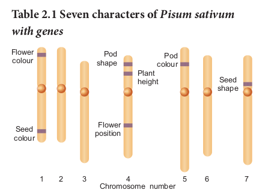

Genetics – The Science of heredity (Inheritance) - “Genetics” is the branch of biological science which deals with the mechanism of transmission of characters from parents to offsprings. The term **Genetics** was introduced by **W. Bateson** in 1906. The four major subdisciplines of genetics are 1. **Transmission Genetics / Classical Genetics**

– Deals with the transmission of genes from parents to offsprings. The foundation of classical genetics came from the study of hereditary behaviour of seven genes by Gregor Mendel.

2\. **Molecular Genetics –** Deals with the structure and function of a gene at molecular level.

3\. **Population Genetics –** Deals with heredity in groups of individuals for traits which is determined by a few genes.

4\. **Quantitative Genetics** – Deals with heredity of traits in groups of individuals where the traits are governed by many genes simultaneously.

**Learning Objectives**

The Learner will be able to _Differentiate_

classical and modern genetics.

Understand the concepts of principles of inheritance.

Describe the extensions of Mendelism. Explain polygenic inheritance and

Pleiotropy. Analyze extra chromosomal

inheritance in cytoplasmic organelles.

Genetics is the study of how living things receive common traits from previous generations. No field of science has changed the world more, in the past 50 years than genetics. The scientific and technological advances in genetics have transformed agriculture, medicine and forensic science etc.

**UNIT VII: Genetics** Chapter

**2 Classical Genetics**

What is the reason for similarities, differences of appearance and skipping of generations? Genes – Functional Units of inheritance: The basic unit of heredity (biological information) which transmits biochemical, anatomical and behavioural traits from parents to offsprings.

## Heredity and variation
 Genetics is often described as a science which deals with heredity and variation.

**Heredity:** Heredity is the transmission of characters from parents to offsprings.

**Variation: The organisms belonging to the** same natural population or species that shows a difference in the characteristics is called variation. Variation is of two types (i) Discontinuous variation and (ii) Continuous variation

**1\. Discontinuous Variation:**

Within a population there are some characteristics which show a limited form of variation. Example: Style length in _Primula_, plant height of garden pea. In discontinuous variation, the characteristics are controlled by one or two major genes which may have two or more allelic forms. These variations are genetically determined by inheritance factors. Individuals produced by this variation show differences without any intermediate form between them and there is no overlapping between the two phenotypes. The phenotypic expression is unaffected by environmental conditions. This is also called as qualitative inheritance.

**2\. Continuous Variation:**

This variation may be due to the combining effects of environmental and genetic factors. In a population most of the characteristics exhibit a complete gradation, from one extreme to the other without any break. Inheritance of phenotype is determined by the combined effects of many genes, (polygenes) and environmental factors. This is also known as quantitative inheritance. Example: Human height and skin color.

**Importance of variations** • Variations make some individuals better

fitted in the struggle for existence.
- They help the individuals to adapt themselves to the changing environment.
- It provides the genetic material for natural selection
- Variations allow breeders to improve better yield, quicker growth, increased resistance and lesser input.
- They constitute the raw materials for evolution.

## Mendelism
 The contribution of Mendel to Genetics is called Mendelism. It includes all concepts brought out by Mendel through his original research on plant hybridization. Mendelian genetic concepts are basic to modern genetics. Therefore, Mendel is called as **Father of Genetics.**

### Father of Genetics – Gregor Johann Mendel (1822 – 1884)

The first Geneticist, Gregor Johann Mendel unraveled the mystery of heredity. He was born on 22nd July 1822 in Heinzendorf Silesia (now Hyncice, C z e c h o s l o v a k i a ) , Austria. After school education, later he studied botany, physics and mathematics at the University of Vienna.He then entered a monastery of St.Thomas at Brunn in Austria and continued his interest in plant hybridization. In 1849 Mendel got a temporary position in a school as a teacher and he performed a series of elegant experiments with pea plants in his garden. In 1856, he started his historic studies on pea plants. 1856 to 1863 was the period of Mendel’s hybridization experiments on pea plants. Mendel discovered the principles of heredity by studying the inheritance of seven pairs of contrasting traits of pea plant in his garden. Mendel crossed and catalogued 24,034

  

plants through many generations. His paper entitled **“Experiments on Plant Hybrids”** was presented and published in The Proceedings of the Brunn Society of Natural History in 1866. Mendel was the first systematic researcher in the field of genetics.

**Mendel was successful because:** • He applied mathematics and statistical

methods to biology and laws of probability to his breeding experiments.
- He followed scientific methods and kept accurate and detailed records that include quantitative data of the outcome of his crosses.
- His experiments were carefully planned and he used large samples.
- The pairs of contrasting characters which were controlled by factor (genes)were present on separate chromosomes.(Figure 2.4)
- The parents selected by Mendel were pure breed lines and the purity was tested by self crossing the progeny for many generations.

**Mendel’s Experimental System – The Garden pea.**

He chose pea plant because, • It is an annual plant and has clear

contrasting characters that are controlled by a single gene separately.
- Self-fertilization occurred under normal conditions in garden pea plants. Mendel used both self-fertilization and cross- fertilization.
- The flowers are large hence emasculation and pollination are very easy for hybridization.

### Mendel’s experiments on pea plant

Mendel’s theory of inheritance, known as the Particulate theory, establishes the existence of minute particles or hereditary units or factors, which are now called as **genes**. He performed artificial pollination or cross pollination

experiments with several true-breeding lines of pea plants. A true breeding lines (Pure-breeding strains) means it has undergone continuous self pollination having stable trait inheritance from parent to offspring. Matings within pure breeding lines produce offsprings having specific parental traits that are constant in inheritance and expression for many generations. Pure line breed refers to homozygosity only. Fusion of male and female gametes produced by the same individual i.e pollen and egg are

derived from the same plant is known as self- fertilization. Self pollination takes place in Mendel’s peas. The experimenter can remove the anthers (Emasculation) before fertilization and transfer the pollen from another variety of pea to the stigma of flowers where the anthers are removed. This results in cross-fertilization, which leads to the creation of hybrid varieties with different traits. Mendel’s work on the study of the pattern of inheritance and the principles or laws formulated, now constitute the Mendelian Genetics.

**The First Model Organism in Genetics – Garden Peas (_Pisum sativum_) – Seven characters studied by Mendel.**

Mendel worked at the rules of inheritance and arrived at the correct mechanism before any knowledge of cellular mechanism, DNA, genes, chromosomes became available. Mendel insights and meticulous work into the mechanism of inheritance played an important role which led to the development of improved crop varieties and a revolution in crop hybridization.

Mendel died in 1884. In 1900 the work of Mendel’s experiments were rediscovered by three biologists, **Hugo de Vries** of Holland, **Carl Correns** of Germany and **Erich von Tschermak** of Austria.

### Terminology related to Mendelism

Mendel noticed two different expressions of a trait – Example: Tall and dwarf. Traits are expressed in different ways due to the fact that a gene can exist in alternate forms (versions) for the same trait is called **alleles.**

If an individual has two identical alleles of

Can you identify Mendel’s gene for **regulating white colour in peas? Let us find** the **molecular answer** to understand the gene function. Now the **genetic mystery of Mendel’s white flowers is solved.** It is quite fascinating to trace the Mendel’s genes. In 2010, the gene responsible for regulating flower colour in peas were identified by an international team of researchers. It was called **Pea Gene A** which encodes a **protein** that functions as a transcription factor which is responsible for the production of **anthocyanin pigment. So the flowers are** purple. Pea plants with white flowers do not have anthocyanin, even though they have the gene that encodes the enzyme involved in anthocyanin synthesis. Researchers delivered normal copies of gene A into the cells of the petals of white flowers by the gene gun method. When Gene A entered in a small percentage of cells of white flowers it is expressed in those particular cells, accumulated anthocyanin pigments and became purple. In white flowers the gene A sequence showed a single-nucleotide change that makes the transcription factor inactive. So the mutant form of gene A do not accumulate anthocyanin and hence they are white.

a gene, it is called as **homozygous(TT)**. An individual with two different alleles is called **heterozygous(Tt)**. Mendels non-true breeding plants are heterozygous, called as **hybrids**.

When the gene has two alleles the dominant allele is symbolized with capital letter and the recessive with small letter. When both alleles are recessive the individual is called **homozygous recessive** (tt) dwarf pea plants. An individual with two dominant alleles is called **homozygous dominant** (TT) tall pea plants. One dominant allele and one recessive allele (Tt) denotes non- true breeding tall pea plants **heterozygous tall.**

### Mendelian inheritance – Mendel’s Laws of Heredity

Mendel proposed two rules based on his observations on monohybrid cross, today these rules are called laws of inheritance The first law is The Law of Dominance and the second law is The Law of Segregation. These scientific laws play an important role in the history of evolution.

**The Law of Dominance: The characters are** controlled by discrete units called factors which occur in pairs. In a dissimilar pair of factors one member of the pair is dominant and the other is recessive. This law gives an explanation to the monohybrid cross (a) the expression of only one of the parental characters in F1 generation and (b) the expression of both in the F2 generation. It also explains the proportion of 3:1 obtained at the F2

**The Law of Segregation (Law of Purity of gametes)**: Alleles do not show any blending, both characters are seen as such in the F2 generation although one of the characters is not seen in the F1 generation. During the formation of gametes, the factors or alleles of a pair separate and segregate from each other such that each gamete receives only one of the two factors. A homozygous parent produces similar gametes

and a heterozygous parent produces two kinds of gametes each having one allele with equal proportion. **Gametes are never hybrid.**

## Monohybrid cross
 Monohybrid inheritance is the inheritance of a single character i.e. plant height.It involves the inheritance of two alleles of a single gene. When the F1 generation was selfed Mendel noticed that 787 of 1064 F2 plants were tall, while 277 of 1064 were dwarf. The dwarf trait disappeared in the F1 generation only to reappear in the F2 generation. The term genotype is the genetic constitution of an individual. The term phenotype refers to the observable characteristic of an organism. In a genetic cross the genotypes and phenotypes of offspring, resulting from combining gametes during fertilization can be easily understood with the help of a diagram called Punnett’s Square named after a British Geneticist Reginald C.Punnett. It is a graphical representation to calculate the probability of all possible genotypes of offsprings in a genetic cross.The Law of Dominance and the Law of Segregation give suitable explanation to Mendel’s monohybrid cross.

**Reciprocal cross** – In one experiment, the tall pea plants were pollinated with the pollens from a true-breeding dwarf plants, the result was all tall plants. When the parental types were reversed, the pollen from a tall plant was used to pollinate a dwarf pea plant which gave only tall plants. The result was the same - All tall plants. Tall ( ) x Dwarf ( ) and Tall ( ) x Dwarf ( ) matings are done in both ways which are called reciprocal crosses.The results of the reciprocal crosses are the same. So it was concluded that the trait is not sex dependent. The results of Mendel’s monohybrid crosses were not sex dependent.

The gene for plant height has two alleles: Tall (T) x Dwarf (t). The phenotypic and genotypic analysis of the crosses has been shown by Checker board method or by Forkline method.

Tall (True - breeding)

TT

Dwarf (True - breeding)

tt

T t

tT Tt (tall)

Tt (tall)

Tt (tall)

Tt (tall)

X

Homozygous tall plant

(TT)

Homozygous dwarf plant

(tt)

Heterozygous tall plant

(Tt)

Heterozygous tall plant

(Tt)

gametes

Offspring (F2) genotypes

Genotypic Ratio

Phenotypes

Phenotypic Ratio

gametes

T T

tt

TT Tt tt

1 : 2 : 1

3 : 1

Tall Dwarf

P generation

F1 generation All tall (**Selfed**)

F2 generation

### Mendel’s analytical and empirical approach

Mendel chose two contrasting traits for each character. So it seemed logical that two distinct factors exist. In F1 the recessive trait and its factors do not disappear and they are hidden or masked only to reappear in ¼ of the F2 generation. He concluded that tall and dwarf alleles of F1 heterozygote segregate randomly into gametes. Mendel got 3:1 ratio in F2 between the dominant and recessive trait. He was the first scientist to use this type of quantitative analysis in a biological experiment. Mendel’s data is concerned with the proportions of offspring.

Mendel’s analytical approach is truly an outstanding scientific achievement. His meticulous work and precisely executed breeding experiments proposed that discrete particulate units of heredity are present and they are transmitted from one generation to the other. Now they are called as genes. Mendel’s experiments were well planned to determine the relationships which govern hereditary traits. This rationale is called an empirical approach. Laws that were arrived from an empirical approach is known as empirical laws.

**2\. 3.2 Test cross**

Test cross is crossing an individual of unknown genotype with a homozygous recessive.

In Mendel’s monohybrid cross all the plants are tall in F1 generation. In F2 tall and dwarf plants were in the ratio of 3:1. Mendel self pollinated dwarf F2 plants and got dwarf plants in F3 and F4 generations. So he concluded that the genotype of dwarf was homozygous (tt). The genotypes of tall plants TT or Tt from F1and F2 cannot be predicted. But how we can tell if a tall plant is homozygous or heterozygous? To determine the genotype of a tall plant Mendel crossed the plants from F2 with the homozygous recessive dwarf plant. This he called a test cross. The progenies of the test cross can be easily analysed to predict the genotype of the plant or the test organism. Thus in a typical test cross an organism (pea plants) showing dominant phenotype (whose genotype is to be determined) is crossed with the recessive parent instead of self crossing. Test cross is used to identify whether an individual is homozygous or heterozygous for dominant character.

**If heterozygous tall test cross** F1 Heterozygous tall

Tt

Homozygous dwarf

tt

Parental (P) Phenotypes

x

Genotypes

Gametes T t t t

Offspring (F1) genotypes

Genotypic Ratio

Phenotypes

Phenotypic Ratio

Tt tt

1 : 1

1 : 1

Tall Dwarf

Homozygous dwarf plant

(tt) Homozygous

dwarf plant (tt)

Heterozygous tall plant

(Tt)

Heterozygous tall plant

(Tt)

gametes gametes

t t

tT

F1 Homozygous tall

TT

Homozygous dwarf

tt

Parental (P) Phenotypes

x

Genotypes

Gametes T T t t

Heterozygous tall plant

(Tt) Heterozygous

tall plant (Tt)

Heterozygous tall plant

(Tt)

Heterozygous tall plant

(Tt)

gametes

Offspring (F1) genotypes

gametes

T t

tT

Tt Tt

Phenotypes Tall Tall All tall plants

**If homozygous tall test cross**

**Why Mendel’s pea plants are tall and dwarf? Find out the molecular explanation.**

Molecular characterization of Mendel’s gene for plant height.

The plant height is controlled by a single gene with two alleles. The reason for this difference in plant height is due to the following facts: (i) the cells of the pea plant have the ability to convert a precursor molecule of gibberellins into an active form (GA1) (ii) Tall pea plants have one allele (Le) that codes for a protein (functional enzyme) which functions normally in the gibberellin-synthesis pathway and catalyzes the formation of gibberellins (GA1). The allele is dominant even if it is two (Le Le) or single (Le le), it produces gibberellins and the pea plants are tall. Dwarf pea plants have two recessive alleles (le le) which code for non-functional protein, hence they are dwarf.

**Gene for plant height in Peas**

(Le Le / Le le) (le le)

**Tall pea plants Dwarf pea plant**

Le allele codes for functional enzyme GA1

le allele codes for nonfunctional enzyme

Gibberellin

Precursor molecule

Gibberellins are not

produced

Gibberellin

Precursor molecule

GA1 Active

gibberellins

### Back cross
 • Back cross is a cross of F1 hybrid with any

one of the parental genotypes. The back cross is of two types; they are dominant back cross and recessive back cross.
- It involves the cross between the F1 offspring with either of the two parents.

- When the F1offsprings are crossed with the dominant parents all the F2 develop dominant character and no recessive individuals are obtained in the progeny.
- If the F1 hybrid is crossed with the recessive parent individuals of both the phenotypes appear in equal proportion and this cross is specified as test cross.
- The recessive back cross helps to identify the heterozygosity of the hybrid.

### Dihybrid cross
 It is a genetic cross which involves individuals differing in two characters. Dihybrid inheritance is the inheritance of two separate genes each with two alleles.

**Law of Independent Assortment** – When two pairs of traits are combined in a hybrid, segregation of one pair of characters is independent to the other pair of characters. Genes that are located in different chromosomes assort independently during meiosis. Many possible combinations of factors can occur in the gametes.

**Homozygous** Round seeds

**Heterozygous**

**Homozygous** Wrinkled seeds

Parental

x

x

Gametes

Gametes

F1 generation

RY

RY Ry rY ry RY Ry rY ry

RrYy

RrYy RrYy

ry

Yellow cotyledon

Green cotyledon

RRYY Meiosis

rryy Meiosis

Round seeds Yellow cotyledon

Selfed – Genes are present on separate chromosomes and random assortment takes place. So four different types of gametes in equal proportions are formed. Law of Independent Assortment.

Independent assortment leads to genetic diversity. If an individual produces genetically dissimilar gametes it is the consequence of independent assortment. Through independent assortment, the maternal and paternal members of all pairs were distributed to gametes, so all possible chromosomal combinations were produced leading to genetic variation. In sexually reproducing plants / organisms, due to independent assortment, genetic variation takes place which is important in the process of evolution. The Law of Segregation is concerned with alleles of one gene but the Law of Independent Assortment deals with the relationship between genes.

The crossing of two plants differing in two pairs of contrasting traits is called dihybrid cross. In dihybrid cross, two characters (colour and shape) are considered at a time. Mendel considered the seed shape (round and wrinkled) and cotyledon colour (yellow & green) as the two characters. In seed shape round (R) is dominant over wrinkled (r) ; in cotyledon colour yellow (Y) is dominant over green (y). Hence the pure breeding round yellow parent is represented by the genotype RRYY and the pure breeding green wrinkled parent is represented by the genotype rryy. During gamete formation the paired genes of a character assort out independently of the other pair. During the F1 x F1 fertilization each zygote with an equal probability receives one of the four combinations from each parent. The resultant gametes thus will be genetically different and they are of the following four types: 1) Yellow round (YR) - 9/16 2) Yellow wrinkled (Yr) - 3/16 3) Green round (yR) - 3/16 4) Green wrinkled (yr) - 1/16

These four types of gametes of F1 dihybrids unite randomly in the process of fertilization and produce sixteen types of individuals in F2

in the ratio of 9:3:3:1 as shown in the figure. Mendel’s 9:3:3:1 dihybrid ratio is an ideal ratio based on the probability including segregation, independent assortment and random

fertilization. In sexually reproducing organism / plants from the garden peas to human beings, Mendel’s findings laid the foundation for understanding inheritance and revolutionized the field of biology. The dihybrid cross and its result led Mendel to propose a second set of generalisations that we called Mendel's Law of independent assortment.

Phenotypic Ratio 9:3:3:1

Parent 2Parent 1

Round yellow cotyledon

P Generation Parental phenotype

Diploid parental genotype

Haploid gametes

F1 generation

F1 genotypes : All _Rr Yy_

F1 phenotype : All round-yellow cotyledon

_RR YY_

X

X

X

_rr yy_

Wrinkled green cotyledon

_r_

_r_

_R y_

_y_

_Y_

_R Y_

F2 Generation

F1 gametes

Haploid F1 gametes

F1

gametes

_Rr YyRr Yy_

R Y R YR y r Y r y

R Y

R Y

R y

R y

r Y

r Y

r y

r y

R y r Y r y

1/4

1/4

1/4

1/4

1/4 1/4 1/4 1/4

_RR YY RR Yy_

_RR Yy RR yy_

_Rr YY Rr Yy_

_Rr Yy Rr yy_

_Rr YY_

_Rr Yy_

_rr YY_

_rr Yy_

_Rr Yy_

_Rr yy_

_rr Yy_

_rr yy_

Parent 2Parent 1

Round yellow cotyledon

F1 Generation (**selfed**)

Round yellow cotyledon

**How does the wrinkled gene make Mendel’s peas wrinkled? Find out the molecular explanation.**

The protein called starch branching enzyme (SBEI) is encoded by the wild-type allele of the gene (RR) which is dominant. When the seed matures, this enzyme SBEI catalyzes the formation of highly branched starch molecules. Normal gene (R) has become interrupted by the insertion of extra piece of DNA (0.8 kb) into the gene, resulting in r allele. In the homozygous mutant form of the gene (rr) which is recessive, the activity of the enzyme SBEI is lost resulting in wrinkled peas. The wrinkled seed accumulates more sucrose and high water content. Hence the osmotic pressure inside the seed rises. As a result, the seed absorbs more water and when it matures it loses water as it dries. So it becomes wrinkled at maturation. When the seed has atleast one copy of normal dominant gene heterozygous, the dominant allele helps to synthesize starch, amylopectin an insoluble carbohydrate, with the osmotic balance which minimises the loss of water resulting in smooth structured round seed.

**The wrinkled gene make Mendel’s peas wrinkled**

RR rr

Recessive allele rr

Active enzyme SBE - I

Inactive enzyme

Converted to

**Round Peas & Wrinkled Peas**

Dominant allele RR

Linear unbranched

starch amylose

Branched starch

amylopectin Round

peas

No conversion

Wrinkled peas

Linear unbranched

starch amylose

Linear unbranched

starch amylose

Epistatic / Non-epistatic interactions

Additive / Polygenic

interactions

I. Dominant relationship a) Complete dominance Example: Tall and

dwarf pea plants b) Incomplete dominance c) Codominance d) Over dominance II. Lethal genes a) Dominant lethals b) Recessive lethals c) Conditional lethals d) Sex linked lethals e) Balanced lethals

III. Multiple alleles

**Gene interactions**

Intralocus interactions

(Allelic interactions)

Interlocus interactions

(Non-allelic interactions)

![Gene Interaction Mendelian experiments prove that a single gene controls one character. But in the post Mendelian findings, various exception have been noticed, in which different types of interactions are possible between the genes. This gene interaction concept was introduced and explained by W. Bateson. This concept is otherwise known as Factor hypothesis or Bateson’s factor hypothesis. According to Bateson’s factor hypothesis, the gene interactions can be classified as • Intragenic gene interactions or Intra allelic]( "")

or allelic interactions • Intergenic gene interactions or inter allelic

or non-allelic interactions **2.4 Intragenic interactions** Interactions take place between the alleles of the same gene i.e., alleles at the same locus is called intragenic or intralocus gene interaction. It includes the following: 1) Incomplete dominance (2) Codominance (3) Multiple alleles (4) Pleiotropic genes are common examples for intragenic interaction.

### The Dihybrid test cross

Heterozygous round peas

Homozygous Wrinkled peas

Parental (P) Phenotypes F1

x

x

Gametes

Genotypes

RY Ry rY ry ry ry ry ry

RrYy rryy

Yellow cotyledon

Green cotyledon

The F1 hybrid plant (round yellow peas) is crossed with homozygous double recessive genotype, wrinkled green peas (rryy). This is called dihybrid test cross with the ratio of 1:1:1:1.

Gametes RY Ry rY ry

RrYy

RrYy

Rryy rrYy rryy

Rryy rrYy rryy

Round Round Wrinkled Wrinkled Yellow

round Yellow

round Green

Wrinkled Yellow

Wrinkled Green

Green Yellow Green all ry

Genotypes

Genotypic ratio

Phenotypes

Phenotypic ratio

1 : 1 : 1 : 1

25% 25% 25% 25%

**The Dihybrid test cross**

### Extensions of Mendelian Genetics
 Apart from monohybrid, dihybrid and trihybrid crosses, there are exceptions to Mendelian principles, i.e. the occurrence of different phenotypic ratios. The more complex patterns of inheritance are the extensions of Mendelian Genetics. There are examples where phenotype of the organism is the result of the interactions among genes.

**Gene interaction –** A single phenotype is controlled by more than one set of genes, each of which has two or more alleles. This phenomenon is called Gene Interaction. Many characteristics of the organism including structural and chemical which constitute the phenotype are the result of interaction between two or more genes.

  

**2.4.1. Incomplete dominance – No blending of genes**

**The German Botanist Carl Correns’s (1905) Experiment -** In 4 O’ clock plant, _Mirabilis jalapa_ when the pure breeding homozygous red (R1R1) parent is crossed with homozygous white (R2R2), the phenotype of the F1 hybrid is heterozygous pink (R1R2). The F1 heterozygous phenotype differs from both the parental homozygous phenotype. This cross did not exhibit the character of the dominant parent but an intermediate colour pink. When one allele is not completely dominant to another allele it shows incomplete dominance. Such allelic interaction is known as incomplete dominance. F1 generation produces intermediate phenotype pink coloured flower. When pink coloured plants of F1 generation were interbred in F2 both phenotypic and genotypic ratios were found to be identical as 1 : 2 : 1(1 red : 2 pink : 1 white). Genotypic ratio is 1 R1R1 : 2 R1R2 : 1 R2R2.From this we conclude that the alleles themselves remain discrete and unaltered proving the Mendel’s Law of Segregation. The phenotypic and genotypic ratios are the same. There is no blending of genes. In the F2 generation R1 and R2 genes segregate and recombine to produce red, pink and white in the ratio of 1 : 2 : 1. R1 allele codes for an enzyme responsible for the formation of red pigment. R2 allele codes for defective enzyme. R1 and R2 genotypes produce only enough red pigments to make the flower pink. Two R1R1 are needed for producing red flowers. Two R2R2 genes are needed for white flowers. If blending had taken place, the original pure traits would not have appeared and all F2 plants would have pink flowers. It is very clear that Mendel’s particulate inheritance takes place in this cross which is confirmed by the reappearance of original phenotype in F2.

**Figure 2.14:**Incomplete dominance in 4 O’ clock plant

**How are we going to interpret the lack of dominance and give explanation to the intermediate heterozygote phenotype? How will you explain incomplete dominance at the molecular level?** Gene expression is explained in a quantitative way. Wild-type allele which is a functional allele when present in two copies (R1 R1) produces an functional enzyme which synthesizes red pigments. The mutant allele which is a defective allele in two copies (R2 R2) produces an enzyme which cannot synthesize necessary red pigments. The white flower is due to the mutation causing complete loss of function. The F1 intermediate phenotype heterozygote (R1R2) has one copy of the allele R1. R1 produces 50% of the functional protein resulting in half of the pigment of red flowered plant and so it is pink. The intermediate phenotype pink heterogyzote with 50% of functional protein is not enough to create the red phenotype homozygous, which makes 100% of the functional protein.

**2.4.2. Codominance (1 : 2 : 1) This pattern occurs due to simultaneous (joint) expression of both alleles in the heterozygote - The phenomenon in which two** alleles are both expressed in the heterozygous individual is known as codominance. Example: Red and white flowers of Camellia, inheritance of sickle cell haemoglobin, ABO blood group system in humanbeings. In humanbeings, IA and IB alleles of I gene are codominant which follows

  

Mendels law of segregation. The codominance was demonstrated in plants with the help of electrophoresis or chromatography for protein or flavonoid substance. Example: Gossypium _hirsutum_ and _Gossypium sturtianum_, their F1 hybrid (amphiploid) was tested for seed proteins by electrophoresis. Both the parents have different banding patterns for their seed proteins. In hybrids, additive banding pattern was noticed. Their hybrid shows the presence of both the types of proteins similar to their parents.

The heterozygote genotype gives rise to a phenotype distinctly different from either of the homozygous genotypes. The F1 heterozygotes produce a F2 progeny in a phenotypic and genotypic ratios of 1 : 2 : 1. **2.4.3. Lethal genes An allele which has the potential to cause the death of an organism is called a “Lethal Allele”.** In 1907, E. Baur reported a lethal gene in snapdragon (_Antirrhinum sp._). It is an example for recessive lethality. In snapdragon there are three kinds of plants. 1. Green plants with chlorophyll. (CC) 2. Yellowish green plants with carotenoids are

referred to as pale green, golden or aurea plants (Cc)

3\. White plants without any chlorophyll. (cc) The genotype of the homozygous green

plants is CC. The genotype of the homozygous white plant is cc.

The aurea plants have the genotype Cc because they are heterozygous of green and white plants. When two such aurea plants are crossed the F1 progeny has identical phenotypic and genotypic ratio of 1 : 2 : 1 (viz. 1 Green (CC) : 2 Aurea (Cc) : 1 White (cc))

Since the white plants lack chlorophyll pigment, they will not survive. So the F2

ratio is modified into 1 : 2. In this case the homozygous recessive genotype (cc) is lethal.

x

x Cc Cc

F1

F2

Heterozygote Antirrhinum aurea

Antirrhinum aurea

1CC : 2 Cc : 1 cc Green Aurea White (lethal)

**Figure: 2.15:** Lethal genes

The term “lethal” is applied to those changes in the genome of an organism which produces effects severe enough to cause death. Lethality is a condition in which the death of certain genotype occurs prematurely. The fully dominant or fully recessive lethal allele kills the carrier individual only in its homozygous condition. So the F2 genotypic ratio will be 2 : 1 or 1 : 2 respectively.

**2.4.4. Pleiotropy – A single gene affects multiple traits** In Pleiotropy, the single gene affects multiple traits and alter the phenotype of the organism. The Pleiotropic gene influences a number of characters simultaneously and such genes are called pleiotropic gene. These were crossed with a variety of peas having white flowers, light coloured seeds and no spot on the axils of the leaves, the three traits for flower colour, seed colour and a leaf axil spot all were inherited together as a single unit. Another example is sickle cell anemia.

## Intergenic interactions
 Interlocus interactions take place between the alleles at different loci i.e between alleles of different genes.It includes the following:

**Dominant Epistasis –** It is a gene interaction in which two alleles of a gene at one locus interfere and suppress or mask the phenotypic expression of a different pair of alleles of another gene at another locus. The gene that suppresses or masks the phenotypic expression of a gene at another locus is known as **epistatic**. The gene whose expression is interfered by non- allelic genes and prevents from exhibiting its character is known as **hypostatic**. When both the genes are present together, the phenotype is determined by the epistatic gene and not by the hypostatic gene.

In the summer squash the fruit colour locus has a dominant allele ‘W’ for white

  

colour and a recessive allele ‘w’ for coloured fruit. ‘W’ allele is dominant that masks the expression of any colour. In another locus hypostatic allele ‘G’ is for yellow fruit and its recessive allele ‘g’ for green fruit. In the first locus the white is dominant to colour where as in the second locus yellow is dominant to green. When the white fruit with genotype WWgg is crossed with yellow fruit with genotype wwGG, the F1 plants have white fruit and are heterozygous (WwGg). When F1 heterozygous plants are crossed they give rise to F2 with the phenotypic ratio of 12 white : 3 yellow : 1 green.

WW gg

**Parent generation**

**Gametes**

**F1 (selfed)**

**F2**

ww GG

Wg

X

wG

WwGg

White fruit

White fruit

White fruit Yellow fruit Green fruit

Yellow fruit

WWGG White

WWGg White

WwGG White

WwGg White

WWGg White

WWgg White

WwGg White

Wwgg White

WwGG White

WwGg White

wwGG Yellow

wwGg Yellow

WwGg White

Wwgg White

WG Wg wG wg

WG

Wg

wG

wg

12 : 3 : 1

**Phenotypes**

**Phenotypic ratio**

wwGg Yellow

wwgg Green

Since W is epistatic to the alleles ‘G’ and ‘g’, the white which is dominant, masks the effect of yellow or green. Homozygous recessive ww genotypes only can give the coloured fruits (4/16). Double recessive ‘wwgg’ will give green fruit (1/16). The Plants having only ‘G’ in its genotype (wwGg or wwGG) will give the yellow fruit(3/16).

**Intra –genic or allelic interaction**

**S. No.**

**Gene interaction Example**

**F2**

**Phenotypic ratio**

1 Incomplete Dominance

Flower colour in _Mirabilis jalapa._

Flower colour in snapdragon _(Antirrhinum_ spp.)

1 : 2 : 1

1 : 2 : 1

2 Codominance ABO Blood group system in humans

1 : 2 : 1

**Table 2.1:** Intra- genic interaction

**Inter-genic or non-allelic interaction**

**S. No.**

**Epistatic interaction Example**

**F2 Ratio**

**Phenotypic ratio**

1 Dominant epistasis

Fruit colour in summer squash

12 : 3 : 1

2 Recessive epistasis

Flower colour of _Antirrhinum_ spp.

9 : 3 : 4

3 Duplicate genes with cumulative effect

Fruit shape in summer squash

9 : 6 : 1

4 Complementary genes

Flower colour in sweet peas

9 : 7

5 Supplementary genes

Grain colour in Maize

9 : 3 : 4

6 Inhibitor genes Leaf colour in rice plants

13 : 3

7 Duplicate genes Seed capsule shape (fruit shape) in shepherd’s purse Bursa bursa-pastoris

15 : 1

**Table 2.2:** Inter-genic interaction

## Polygenic Inheritance in Wheat (Kernel colour)
 Polygenic inheritance - Several genes combine to affect a single trait.

A group of genes that together determine (contribute) a characteristic of an organism

  

is called polygenic inheritance. It gives explanations to the inheritance of continuous traits which are compatible with Mendel’s Law.

The first experiment on polygenic inheritance was demonstrated by Swedish Geneticist H. Nilsson - Ehle (1909) in wheat kernels. Kernel colour is controlled by two genes each with two alleles, one with red kernel colour was dominant to white. He crossed the two pure breeding wheat varieties dark red and a white. Dark red genotypes R1R1R2R2 and white genotypes are r1r1r2r2. In the F1 generation medium red were obtained with the genotype R1r1R2r2. F1 wheat plant produces four types of gametes R1R2, R1r2, r1R2, r1r2. The intensity of the red colour is determined by the number of R genes in the F2 generation.

**Four R genes:** A dark red kernel colour is obtained.Three R genes: Medium - dark red kernel colour is obtained.**Two R genes:** Medium-red kernel colour is obtained.**One R gene:** Light red kernel colour is obtained. **Absence of R gene:**Results in White kernel colour.

The R gene in an additive manner produces the red kernel colour. The number of each phenotype is plotted against the intensity of red kernel colour which produces a bell shaped curve. This represents the distribution of phenotype. Other example: Height and skin colour in humans are controlled by three pairs of genes.

**Conclusion:**

Finally the loci that was studied by Nilsson – Ehle were not linked and the genes assorted independently.

Later, researchers discovered the third gene that also affect the kernel colour of wheat. The three independent pairs of alleles were involved in wheat kernel colour. Nilsson – Ehle found the ratio of 63 red : 1 white in F2 generation – 1 : 6 : 15 : 20 : 15 : 6 : 1 in F2 generation.

R1r1R2r2

R1r1R2r2

r1r1r2r2R1R1R2R2

R1r1R2r2

R1R1R2R2 R1R1R2r2 R1r1R2R2 R1r1R2r2

R1R1R2r2 R1R1r2r2 R1r1R2r2 R1r1r2r2

R1r1R2R2 R1r1R2r2 r1r1R2R2 r1r1R2r2

R1r1R2r2 R1r1r2r2 r1r1R2r2 r1r1r2r2

F1 generation

Parent generation

Dark Red White

Medium Red

F2 generation

F1 generation (selfed)

R1R2

R1R2

R1r2

r1R2

r1r2

R1r2 r1R2 r1r2

1 4 6 4 1

X

Dark Red Wheat kernel colour

White

The data produce a bell shaped curve. which demonstrate continuous variation in wheat kernel from dark red to white in F2

X

**Genotype**

**XParents**

**F1**

**F2**

**2 2**

**42 2**

## 1

_R1 R1 R2 R2_

_R1 R1 R2 R2_

_R1 r1 R2 r2_

_r1 r1 r2 r2_

_R1 R1 R2 r2_

_R1 r1 R2 R2_

_R1 r1 R2 r2_

_R1 R1 r2 r2_

_R1 r1 r2 r2_

_r1 r1 R2 r2_

_r1 r1 r2 r2_

_r1 r1 R2 R2_

**Phenotype**

Dark red

Dark red

Medium red

White

Medium-dark red Medium-dark red

15 red to

1 white

Medium red Medium red Medium red

Light red Light red

White

**Parents**

**F1**

**F2**

Dark red Wheat Kernel

1

Dark red

6

Moderate red

15

Red

20

Intermediate red

15

Light red

6

Very light red

1

White

White Wheat Kernel

AABBCC aabbcc

X

AaBbCc Intermediate red

(Selfed)

63 Red (many shades) : 1 White

From the above results Nilsson – Ehle showed that the blending inheritance was not taking place in the kernel of wheat. In F2 generation plants have kernels with wide range of colour variation. This is due to the fact that the genes are segregating and recombination takes place. Another evidence for the absence of blending inheritance is that the parental phenotypes dark red and white appear again in F2. There is no blending of genes, only the phenotype. The cumulative effect of several pairs of gene interaction gives rise to many shades of kernel colour. He hypothesized that the two loci must contribute additively to the kernel colour of wheat. The contribution of each red allele to the kernel colour of wheat is additive.

## Extra Chromosomal Inheritance or Extra Nuclear Inheritance (Cytoplasmic Inheritance)
 DNA is the universal genetic material. Genes located in nuclear chromosomes follow Mendelian inheritance. But certain traits are governed either by the chloroplast or mitochondrial genes. This phenomenon is known as extra nuclear inheritance. It is a kind of Non-Mendelian inheritance. Since it involves cytoplasmic organelles such as chloroplast and

mitochondrion that act as inheritance vectors, it is also called Cytoplasmic inheritance. It is based on independent, self-replicating extra chromosomal unit called plasmogene located in the cytoplasmic organelles, chloroplast and mitochondrion.

**Chloroplast Inheritance** It is found in 4 O’ Clock plant (_Mirabilis jalapa_). In this, there are two types of variegated leaves namely dark green leaved plants and pale green leaved plants. When the pollen of dark green leaved plant (male) is transferred to the stigma of pale green leaved plant (female) and pollen of pale green leaved plant is transferred to the stigma of dark green leaved plant, the F1 generation of both the crosses must be identical as per Mendelian inheritance. But in the reciprocal cross the F1 plant differs from each other. In each cross, the F1 plant reveals the character of the plant which is used as female plant.

F1 Dark Green leaved

Pale Green leaved Plant

(Male)

Dark Green leaved Plant

(Female) x

F1 Pale Green leaved

Pale Green leaved Plant

(Female)

Dark Green leaved Plant

(Male) x

This inheritance is not through nuclear gene. It is due to the chloroplast gene found in the ovum of the female plant which contributes the cytoplasm during fertilization since the male gamete contribute only the nucleus but not cytoplasm.

Recently it has been discovered that cytoplasmic genetic male sterility is common in many plant species. This sterility is maintained by the influence of both nuclear and cytoplasmic genes. There are commonly two types of

  

cytoplasm N (normal) and S (sterile). The genes for these are found in mitochondrion. There are also restores of fertility (Rf) genes. Even though these genes are nuclear genes, they are distinct from genetic male sterility genes of other plants. Because the Rf genes do not have any expression of their own, unless the sterile cytoplasm is present. Rf genes are required to restore fertility in S cytoplasm which is responsible for sterility.

So the combination of N cytoplasm with rfrf and S cytoplasm with RfRf produces plants with fertile pollens, while S cytoplasm with rfrf produces only male sterile plants.

**Atavism Atavism is a modification of a biological** structure whereby an ancestral trait reappears after having been lost through reemergence of sexual reproduction in the flowering plant _Hieracium pilosella_ is the best example for Atavism in plants. **Summary** Gregor Johann Mendel, father of Genetics unraveled the mystery of heredity through his experiments on garden peas. Mendel’s laws, analytical and empirical reasoning endure till

now guiding geneticists to study variation. The monohybrid cross of Mendel proved his particulate theory of inheritance. In F2 the alternative traits were expressed in the ratio of 3 dominant and 1 recessive. The characteristic 3 : 1 segregation is referred to as Mendelian ratio. Parents transmit discrete information about the traits to their offspring which Mendel called it as “factors”. To test his experimental results Mendel devised a powerful procedure called the test cross. Test cross is used to determine the genotype of an individual when two genes are involved. In Mendel’s dihyrbid cross, the two pairs of factors were inherited independently. From the results of dihybrid cross Mendel gave the Law of Independent Assortment. Mendel’s dihybrid ratio of 9 : 3 : 3 : 1 with the representation of two new recombinations appeared in the progeny, i.e. round green peas or wrinkled yellow peas. Molecular explanation of Mendel’s gene for monohybrid cross, dihybrid cross were explained. Extension of Mendelian Genetics was dealt with examples for interaction among genes. Incomplete dominance is not an example for blending inheritance. Incomplete dominance exhibits a phenotypic heterozygote intermediate between the two homozygous. In plants codominance can be demonstrated by the methods of electrophoresis or chromatography for protein or flavonoid substances. Lethal genes with an example are explained. Pleiotropy a single gene which affects multiple traits was explained with an example of Pisum sativum. Dominant epistatis in summer squash with 12 : 3 : 1 ratio was discussed. Polygenic inheritance is an example for inheritance of continuous traits which is compatible with Mendel’s laws. The inheritance of mitochondrial and chloroplast genes were explained with examples which does not follow the rules of nuclear genes.

  

**Evaluation** 1. Extra nuclear inheritance is

a consequence of presence of genes in

a) Mitrochondria and chloroplasts

b) Endoplasmic reticulum and mitrochondria

c) Ribosomes and chloroplast d) Lysososmes and ribosomes 2. In order to find out the different types of

gametes produced by a pea plant having the genotype AaBb, it should be crossed to a plant with the genotype

a) aaBB b) AaBB c) AABB d) aabb 3. How many different kinds of gametes

will be produced by a plant having the genotype AABbCC?

a) Three b) Four c) Nine d) Two 4. Which one of the following is an example

of polygenic inheritance? a) Flower colour in _Mirabilis Jalapa_ b) Production of male honey bee c) Pod shape in garden pea d) Skin Colour in humans 5. In Mendel’s experiments with garden pea,

round seed shape (RR) was dominant over wrinkled seeds (rr), yellow cotyledon (YY) was dominant over green cotyledon (yy). What are the expected phenotypes in the F2 generation of the cross RRYY x rryy?

a) Only round seeds with green cotyledons b) Only wrinkled seeds with yellow

cotyledons c) Only wrinkled seeds with green

cotyledons d) Round seeds with yellow cotyledons an

wrinkled seeds with yellow cotyledons

6. Test cross involves a) Crossing between two genotypes with

recessive trait b) Crossing between two F1 hybrids c) Crossing the F1 hybrid with a double

recessive genotype d) Crossing between two genotypes with

dominant trait 7. In pea plants, yellow seeds are dominant

to green. If a heterozygous yellow seed pant is crossed with a green seeded plant, what ratio of yellow and green seeded plants would you expect in F1 generation?

a) 9:1 b) 1:3 b) 3:1 d) 50:50 8. The genotype of a plant showing the

dominant phenotype can be determined by

a) Back cross b) Test cross c) Dihybrid corss d) Pedigree analysis 9. Select the correct statement from the ones

given below with respect to dihydrid cross

a) Tightly linked genes on the same chromosomes show very few combinations

b) Tightly linked genes on the same chromosomes show higher combinations

c) Genes far apart on the same chromosomes show very few recombinations

d) Genes loosely linked on the same chromosomes show similar recombinations as the tightly linked ones

10.Which Mendelian idea is depicted by a cross in which the F1 generation resembles both the parents

a) Incomplete dominance b) Law of dominance c) Inheritance of one gene d) Co-dominance

  

16. Which of the following explains how progeny can posses the combinations of traits that none of the parent possessed?

a) Law of segregation b) Chromosome theory c) Law of independent assortment

d) Polygenic inheritance 17. “Gametes are never hybrid”. This is a

statement of a) Law of dominance b) Law of independent assortment c) Law of segregation d) Law of random fertilization 18. Gene which suppresses other genes

activity but does not lie on the same locus is called as

a) Epistatic b) Supplement only c) Hypostatic d) Codominant 19. Pure tall plants are crossed with pure

dwarf plants. In the F1 generation, all plants were tall. These tall plants of F1 generation were selfed and the ratio of tall to dwarf plants obtained was 3:1. This is called

a) Dominance b) Inheritance c) Codominance d) Heredity 20. The dominant epistatis ratio is a) 9:3:3:1 b) 12:3:1 c) 9:3:4 d) 9:6:1 21. Select the period for Mendel’s

hybridization experiments a) 1856 - 1863 b) 1850 - 1870 c) 1857 - 1869 d) 1870 - 1877 22. Among the following characters which

one was not considered by Mendel in his experimentation pea?

a) Stem – Tall or dwarf b) Trichomal glandular or non-glandular c) Seed – Green or yellow d) Pod – Inflated or constricted

11.Fruit colour in squash is an example of a) Recessive epistatsis b) Dominant epistasis c) Complementary genes d) Inhibitory genes

12. In his classic experiments on Pea plants, Mendel did not use

a)Flowering position b) Seed colour c) Pod length d) Seed shape

13. The epistatic effect, in which the dihybrid cross 9:3:3:1 between AaBb Aabb is modified as

a) Dominance of one allele on another allele of both loci

b) Interaction between two alleles of different loci

c) Dominance of one allele to another alleles of same loci

d) Interaction between two alleles of some loci

14. In a test cross involving F1 dihybrid flies, more parental type offspring were produced than the recombination type offspring. This indicates

a) The two genes are located on two different chromosomes

b) Chromosomes failed to separate during meiosis

c) The two genes are linked and present on the some chromosome

d) Both of the characters are controlled by more than one gene

15. The genes controlling the seven pea characters studied by Mendel are known to be located on how many different chromosomes?

a) Seven b) Six c) Five d) Four

**Genetic Code: The set of 64 triplets of bases** (codons) corresponding to the twenty amino acids in proteins and the signals for initiation and termination of polypeptide synthesis.

**Genotype: The types of alleles in a single** individual is called genotype

**Genome: The total complement of genes** contained in a cell.

**Heterozygous:** Diploid organisms that have two different allels at a specific gene locus are said to be heterozygous.

**Homozygous:** A diploid organism in which both alleles are the same at a given gene locus is said to be homozygous.

**Hybrid Vigour or Heterosis: The superiority of** hybrid over either of its parents in one or more traits.

**Locus: The site or position of a particular gene** on a chromosome.

**Phenotype: The physical expression of an** individuals gene. The physical observable characteristics of an organism.

**Punnett Square / Checkerboard:** A sort of cross-multiplication matrix used in the prediction of the outcome of a genetic cross, in which male and female gametes and their frequencies are arranged along the edges.

23. Name the seven contrasting traits of Mendel.

24. What is meant by true breeding or pure breeding lines / strain?

25. Give the names of the scientists who rediscovered Mendelism.

26. What is back cross? 27. Define Genetics. 28. What are multiple alleles 29. What are the reasons for Mendel’s

successes in his breeding experiment? 30. Explain the law of dominance in

monohybrid cross. 31. Differentiate incomplete dominance and

codominance. 32. What is meant by cytoplasmic inheritance 33. Describe dominant epistasis with an

example. 34. Explain polygenic inheritance with an

example. 35. Differentiate continuous variation with

discontinuous variation. 36. Explain with an example how single

genes affect multiple traits and alleles the phenotype of an organism.

37. Bring out the inheritance of chloroplast gene with an example.

**Glossary**

**Alleles:** Alternative forms of a gene.

**Back Cross: Crosses between F1 off-springs with** either of the two parents (hybrid) are known as back cross

**F1 / First Filial Generation: The second stage** of Mendel’s experiment is called F1 generation

**Gene: The determinant of a characteristic of an** organism (Mendelian factor). Gene symbols are underlined or italicized.

