```hint { role="info" }
**Learning Objectives** 

- The learner will be able to,
- Describe the Structure, functions and types of ecosystems
- Draw ecological pyramids by means of number, biomass and energy
- Interpret carbon and phosphorus cycle Recognise pond ecosystem as a self- sufficient and self-regulating system
- Analyse ecosystem services and its management
- Discuss about the importance and conservation of ecosystem
- Explain causes, process and types of plant succession
- Classify vegetation types of India and Tamil Nadu

```


Have you seen lakes, ponds and pools in your surroundings? They are all called water bodies with many components in them. Can you list out the things which are found in water bodies? Mud, nutrients, clay, dissolved gases, planktons, microorganisms, plants like algae, _Hydrilla, Nelumbo, Nymphaea_ and animals like snake, small fish, large fish, frog, tortoise and crane are the components of the water bodies which constitutes **ecosystem**. Further, we all know that plants and animals are prominent living components in the environment. They interact with space components such as air, water, soil, sunlight, etc. For example, you have studied in class XI, one of the life processes, photosynthesis which utilizes sunlight , water, carbondioxide, nutrients from the soil and release oxygen to the atmosphere. From this, we understand that the exchange of materials takes place between living and space components. Likewise, you can study the structure, function and types of ecosystem in this chapter. The term ‘ecosystem’ was proposed by A.G. Tansley (1935), who defined it as ‘the system resulting from the **integration of all the living and nonliving factors of the environment’**. Whereas, Odum (1962) defined ecosystem ‘as the structural and **functional unit of ecology’.**

```
**Parallel terms for ecosystem coined by various ecologists** 
• Biocoenosis – Karl Mobius 
• Microcosm – S.A. Forbes 
• Geobiocoenosis – V. V. Dokuchaev, G.F. Morozov 
• Holocoen - Friederichs 
• Biosystem – Thienemann 
• Bioenert body – Vernadsky

```

##  Structure of Ecosystem
Ecosystem comprises of two major components. They are: 

i) **Abiotic (non-living) components**: 

It includes climatic factors (air, water, sunlight, rainfall, temperature and humidity), edaphic factors (soil air, soil water and pH of soil),topography (latitude, altitude), organic components (carbohydrates, proteins, lipids and humic substances) and inorganic substances (C, H, O, N and P ). Abiotic components play vital role in any ecosystem and hence the total inorganic substances present in any ecosystem at a given time is called **standing quality** (or) **standing state**.

ii) **Biotic (living) components**: It includes all living organisms like plants, animals, fungi and bacteria. They form the trophic structures of any ecosystem. On the basis of nutritional relationships, trophic levels of an ecosystem have two components. (1) autotrophic components and (2) heterotrophic components.

**(1) Autotrophic components:** Autotrophs are organisms which can manufacture the organic compounds from simple inorganic components through a process called photosynthesis. In most of the ecosystems, green plants are the autotrophs and are also called **producers**.

**(2) Heterotrophic components: Those** organisms which consume the producers are called **consumers** and can be recognized into macro and micro consumers. **Macroconsumers** refer to herbivores, carnivores and omnivores (primary, secondary and tertiary consumers). **Microconsumers** are called decomposers. Decomposers are organisms that decompose the dead plants and animals to release organic and inorganic nutrients into the environment which are again reused by plants. Example: Bacteria, Actinomycetes and Fungi.

The amount of living materials present in a population at any given time is known as **standing crop**, which may be expressed in terms of number or biomass per unit area. **Biomass** can be measured as fresh weight or dry weight or carbon weight of organisms. Biotic components are essential to construct the food chain, food web and ecological pyramids.

### Functions of ecosystem
The function of ecosystem include creation of energy creation, sharing of energy and cycling of materials between the living and nonliving components of an ecosystem.

Before studying the productivity in any ecosystem, we should understand the essential role of sunlight used by producers of the first trophic level. The quantity of sunlight is directly proportional to the production of energy by plants.

#### Photosynthetically Active Radiation (PAR)

The amount of light available for photosynthesis of plants is called **P**hotosynthetically **A**ctive **R**adiation (PAR) which is from 400-700 nm in wave length. It is essential for photosynthesis and plant growth. PAR is not always constant because of clouds, tree shades, air, dust particles, seasons, latitudes and length of the daylight availability. Generally plants absorb more blue and red light for efficient photosynthesis.

Of the total sunlight, 34 percent that reaches the atmosphere is reflected back into the atmosphere, moreover 10% is held by ozone, water vapours and atmospheric gases and the remaining 56% reaches the earth’s surface. Out of this 56%, only 2 – 10% of the solar energy is used by green plants for photosynthesis while the remaining portion is dissipated as heat.

PAR is generally expressed in millimoles / square meter / second by using silicon photo voltic detectors which detect only 400 – 700


nm wavelength of light. PAR values range from 0 to 3000 millimoles /square meter / second. At night PAR is zero and during midday in the summer, PAR often reaches 2000 – 3000 millimoles /square meter/second.
```
**Types of Carbon**

**Green carbon** – carbon stored in the biosphere (by the process

of photosynthesis).

**Grey carbon** – carbon stored in fossil fuel (coal, oil and biogas deposits in the lithosphere).

**Blue carbon** – carbon stored in the atmosphere and oceans.

**Brown carbon** – carbon stored in industrialized forests (wood used in making commercial articles)

**Black carbon** – carbon emitted from gas, diesel engine and coal fired power plants.
```

### Productivity of an ecosystem

The rate of biomass production per unit area in a unit time is called productivity. It can be expressed in terms of gm /m2/year or Kcal/m2/ year. It is classified as given bellow.

1. Primary productivity

2. Secondary productivity

3. Community productivity

#### Primary productivity

The chemical energy or organic matter generated by autotrophs during the process of photosynthesis and chemosynthesis is called **primary productivity**. It is the source of energy for all organisms, from bacteria to human.

**a.** **Gross Primary Productivity (GPP)** The total amount of food energy or organic matter or biomass produced in an ecosystem by autotrophs through the process of photosynthesis is called **gross primary productivity**

**b. Net Primary Productivity (NPP)**

The proportion of energy which remains after respiration loss in the plant is called **net primary productivity**. It is also called as apparent photosynthesis. Thus the difference between GPP and respiration is known as NPP.


NPP = GPP – Respiration


NPP of whole biosphere is estimated to be about 170 billion tons (dry weight) per year. Out of which NPP of oceanic producers is only 55 billion tons per year.

#### Secondary productivity

The amount of energy stored in the tissues of heterotrophs or consumers is called **secondary productivity**.
**a. Gross secondary productivity** It is equivalent to the total amount of plant material ingested by the herbivores minus the materials lost as faeces. **b. Net secondary productivity** Storage of energy or biomass by consumers per unit area per unit time, after respiratory loss is called **net secondary productivity**.

#### Community productivity

The rate of net synthesis of organic matter (biomass) by a group of plants per unit area per unit time is known as **community productivity**.

**Factors affecting primary productivity** Primary productivity depends upon the plant species of an area, their photosynthetic capacity, availability of nutrients, solar radiation, precipitation, soil type, topographic factors (altitude, latitude, direction), and other environmental factors. It varies in different types of ecosystems.

### Concept of trophic level in an ecosystem
(Greek word ‘ trophic’ = to food or feeding) 

A trophic level refers to the position of an organism in the food chain. The number of trophic levels is equal to the number of steps in the food chain. The green plants (producers) occupying the first trophic level (T1) are called producers. The energy produced by the producers is utilized by the plant eaters (herbivores) they are called **primary consumers** and occupy the second trophic level (T2).


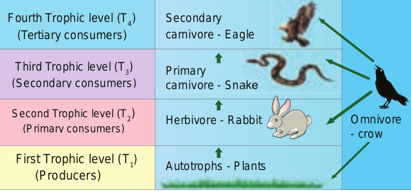

Herbivores are eaten by carnivores, which occupy the third trophic level (T3). They are also called **secondary consumers** or **primary carnivores**. Carnivores are eaten by the other carnivores, which occupy the fourth trophic level (T4). They are called the **tertiary consumers or secondary carnivores**. Some organisms which eat both plants and animals are called as **omnivores** (Crow). Such organisms may occupy more than one trophic level in the food chain.

### Energy flow Sun

**Plants Herbivores Carnivores**

**Decomposers**

**Heat Heat Heat**

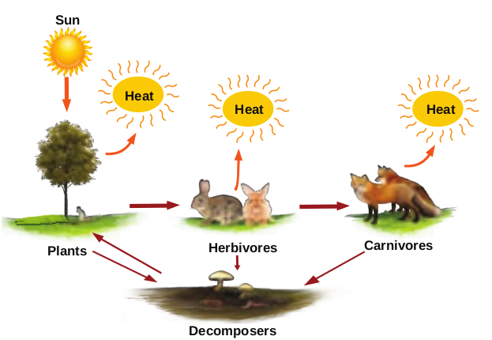

The transfer of energy in an ecosystem between trophic levels can be termed as energy flow. It is the key function in an ecosystem. Part of the energy obtained from the sun by producers are transferred to consumers and decomposers

through each trophic level, while some amount of energy is dissipated in the form of heat. Energy flow is always unidirectional in an ecosystem.

**Laws of thermodynamics**

The storage and loss of energy in an ecosystem is based on two basic laws of thermo-dynamics.

**i. First law of thermodynamics** It states that energy can be transmitted from one system to another in various forms. Energy cannot be destroyed or created. But it can be transformed from one form to another. As a result, the quantity of energy present in the universe is constant.

**Example:**

In photosynthesis, the product of starch (chemical energy) is formed by the combination of reactants (chlorophyll, H2O, CO2). The energy stored in starch is acquired from the external sources (light energy) and so there is no gain or loss in total energy. Here light energy is converted into chemical energy.

Chlorophyll C6H1206 + 6 O26 CO2 + 6 H20

light

chemical energyLight energy

**ii. Second law of thermodynamics** It states that energy transformation results in the reduction of the free energy of the system. Usually energy transformation cannot be 100% efficient. As energy is transferred from one organism to another in the form of food, a portion of it is stored as energy in living tissue, whereas a large part of energy is dissipated as heat through respiration. The transfer of energy is irreversible natural process. Example: Ten percent law

**Ten percent law** This law was proposed by Lindeman (1942). It states that during transfer of food energy from one trophic level to other, only about 10% stored at every level and rest of them (90%) is lost in respiration, decomposition and in the form of heat. Hence, the law is called **ten percent law.**


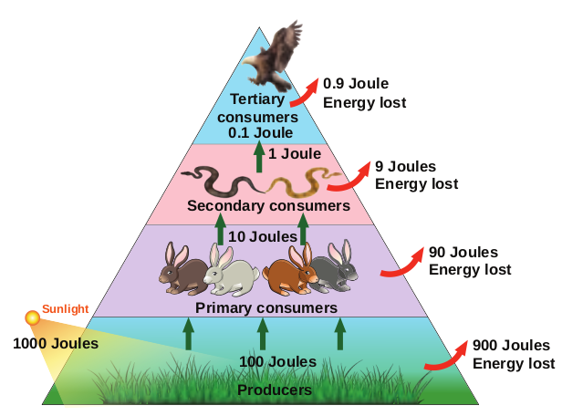

**Example:** It is shown that of the 1000 Joules of Solar energy trapped by producers. 100 Joules of energy is stored as chemical energy through photosynthesis. The remaining 900 Joules would be lost in the environment. In the next trophic level herbivores, which feed on producers get only 10 Joules of energy and the remaining 90 Joules is lost in the environment. Likewise, in the next trophic level, carnivores, which eat herbivores store only 1 Joule of energy and the remaining 9 Joules is dissipated. Finally, the carnivores are eaten by tertiary consumers which store only 0.1 Joule of energy and the remaining 0.9 Joule is lost in the environment. Thus, at the successive trophic level, only ten percent energy is stored.

### Food chain
The movement of energy from producers upto top carnivores is known as **food chain**, i.e., in any food chain, energy flows from producers to primary consumers, then from primary consumers to secondary consumers, and finally secondary consumers to tertiary consumers. Hence, it shows linear network links. Generally, there are two types of food chain, (1) Grazing food chain and (2) Detritus food chain.

**1. Grazing food chain** Main source of energy for the grazing food chain is the Sun. It begins with the first link,

producers (plants). The second link in the food chain is primary consumers (mouse) which get their food from producers. The third link in the food chain is secondary consumers (snake) which get their food from primary consumers. Fourth link in the food chain is tertiary consumers (eagle) which get their food from secondary consumers.

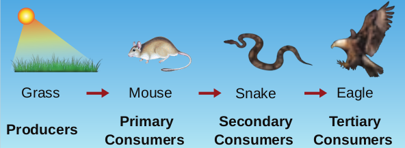

Grass EagleMouse Snake

**Primary Consumers Producers Secondary**

**Consumers Tertiary**

**Consumers**

**2. Detritus food chain:**

This type of food chain begins with dead organic **matter** which is an important source of energy. A large amount of organic matter is derived from the dead plants, animals and their excreta. This type of food chain is present in all ecosystems.

The transfer of energy from the dead organic matter, is transferred through a series of organisms called detritus consumers (detritivores)- small carnivores - large (top) carnivores with repeated eating and being eaten respectively. This is called the detritus food chain.

Fallen leaves HawkEarthworm Black bird

**DetritivoresDetritus Small carnivores**


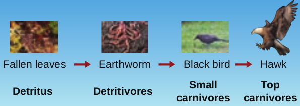

### Food Web
The inter-locking pattern of a number of food chain form a web like arrangement called **food web**. It is the basic unit of an ecosystem, to maintain its stability in nature. Which its also called homeostasis.

Example: In a grazing food chain of a grass


land, in the absence of a rabbit, a mouse may also eat food grains. The mouse in turn may be eaten directly by a hawk or by a snake and the snake may be directly eaten by hawks.

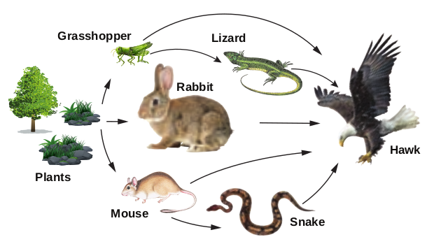

**Plants**

**Grasshopper Lizard**

**Hawk**

**SnakeMouse**

**Rabbit**

Hence, this interlocking pattern of food chains is the food web and the species of an ecosystem may remain balanced to each other by some sort of natural check.

**Significance of food web** • Food web is constructed to describe species

interaction called direct interaction. • It can be used to illustrate indirect

interactions among different species. • It can be used to study bottom-up or top-

down control of community structure. • It can be used to reveal different patterns

of energy transfer in terrestrial and aquatic ecosystems.

### Ecological pyramids

Graphic representation of the trophic structure and function at successive trophic levels of an ecosystem is called ecological pyramids. The concept of ecological pyramids was introduced by Charles Elton (1927). Thus they are also called as **Eltonian pyramids**.

There are three types: (1) pyramid of number (2) pyramid of biomass (3) pyramid of energy.

**1. Pyramid of number**

A graphical representation of the number of organisms present at each successive trophic level in an ecosystem is called **pyramids of number. There are three different shapes of** pyramids upright, spindle and inverted.

There is a gradual decrease in the number of organisms in each trophic level from producers to primary consumers and then to secondary consumers, and finally to tertiary consumers. Therefore, pyramids of number in grassland and **pond ecosystem** are always **upright**.

In a **forest ecosystem** the pyramid of number is somewhat different in shape, it is because the base (T1) of the pyramid occupies large sized trees (Producer) which are lesser in number. Herbivores (T2) (Fruit eating birds, elephant, deer) occupying second

**A**

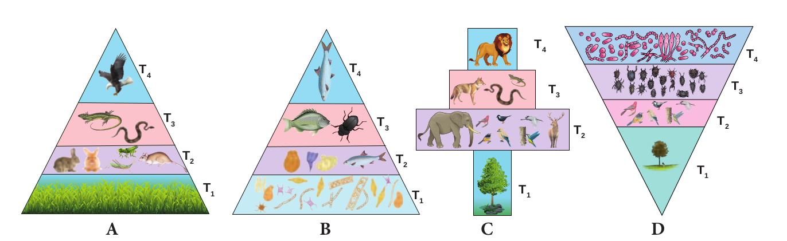

**Inverted**\-D) Parasite ecosystem

T1 - Producers | T2 - Herbivores | T3 - Secondary consumers | T4 - Tertiary consumers

**T1**

**T2**

**T3**

**T4**

**T1**

**T2**

**T3**

**T4**

**T1**

**T2**

**T3**

**T4**

**T1**

**T2**

**T3**

**T4**

**B C D**


trophic level, are more in number than the producers. In final trophic level (T4), tertiary consumers (lion) are lesser in number than the secondary consumer (T3) (fox and snake). Therefore, the pyramid of number in forest ecosystem looks **spindle shaped**.

The pyramid of number in a parasite **ecosystem** is always **inverted**, because it starts with a single tree. Therefore there is gradual increase in the number of organisms in successive tropic levels from producer to tertiary consumers.

**2 Pyramid of biomass**

A graphical representation of the amount of organic material (biomass) present at each successive trophic level in an ecosystem is called **pyramid of biomass**.

In **grassland** and **forest ecosystems**, there is a gradual decrease in biomass of organisms at successive trophic levels from producers to top carnivores (Tertiary consumer). Therefore, these two ecosystems show pyramids as **upright** pyramids of biomass.

However, in **pond ecosystem**, the bottom of the pyramid is occupied by the producers, which comprise very small organisms possessing the least biomass and so, the value gradually increases towards the tip of the pyramid. Therefore, the pyramid of biomass is always **inverted** in shape.

**3. Pyramid of energy**

A graphical representation of energy flow at each successive trophic level in an ecosystem is called pyramid of energy. The bottom of the pyramid of energy is occupied by the producers. There is a gradual decrease in energy transfer at successive tropic levels from producers to the upper levels. Therefore, the pyramid of energy is **always upright**.

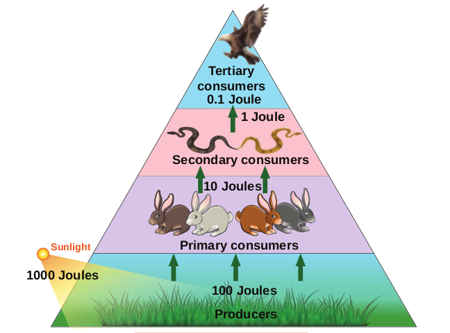

**Primary consumers**

**Secondary consumers**

**Tertiary consumers**

**Producers**

## Joules

**10 Joules**

**1 Joule 0.1 Joule**

## Joules

**Sunlight**

### Decomposition:

Decomposition is a process in which the detritus (dead plants, animals and their excreta) are broken down in to simple organic matter by the decomposers. It is an essential process for recycling and balancing the nutrient pool in an ecosystem. **Nature of decomposition** The process of decomposition varies based

T1 - Producers | T2 - Herbivores | T3 - Secondary consumers | T4 - Tertiary consumers

**A B C**

**T1**

**T2**

**T3**

**T1**

**T2**

**T3**

**T4**

**T1**

**T2**

**T3**

**T4**

**Figure 7.8: Pyramids of biomass ( dry weight per unit area)in different types of ecosystems. Upright**\-A) Grassland ecosystem B) Forest ecosystem, **Inverted**\- C)Pond ecosystem


inorganic compounds from the surface to the lower layer of soil or the carrying away of the same by water is called **leaching** or **eluviation**.

**d. Humification - It is a process by which** simplified detritus is changed into dark coloured amorphous substance called **humus**. It is highly resistant to microbial action, therefore decomposition is very slow. It is the reservoir of nutrients.

**e.** **Mineralisation -** Some microbes are involved in the release of inorganic nutrients from the humus of the soil, such process is called **mineralisation**.

**Factors affecting decomposition**

Decomposition is affected by climatic factors like temperature, soil moisture, soil pH ,oxygen and also the chemical quality of detritus.

### Biogeochemical cycles (Nutrient cycles)

Exchange of nutrients between organisms and their environment is one of the essential aspects of an ecosystem. All organisms require nutrients for their growth, development, maintenance

on the nature of the organic compounds, i.e., some of the compounds like carbohydrate, fat and protein are decomposed rapidly than the cellulose, lignin, chitin, hair and bone.

**Mechanism of decomposition**

Decomposition is a step wise process of degradation mediated by enzymatic reactions. Detritus acts as a raw material for decomposition. It occurs in the following steps.

**a. Fragmentation - The breaking down** of detritus into smaller particles by detritivores like bacteria, fungi and earth worm is known as fragmentation. These detritivores secrete certain substances to enhance the fragmentation process and increase the surface area of detritus particles.

**b. Catabolism - The decomposers produce** some extracellular enzymes in their surroundings to break down complex organic and inorganic compounds in to simpler ones. This is called catabolism

**c.** **Leaching or Eluviation -** The movement of decomposed, water soluble organic and

**Fragmentation**

Senescence

**Raw material for decomposition Catabolism**

**HumificationMineralisation**

**Absorption by plants**

**Leaching**

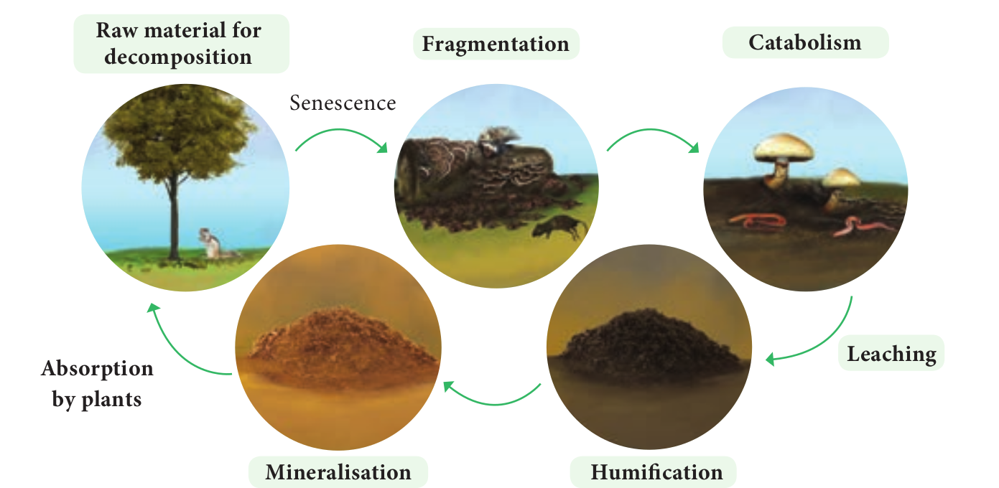


  


and reproduction. Circulation of nutrients within the ecosystem or biosphere is known as **biogeochemical cycles** and also called as ‘cycling of materials.’ There are two basic types,

1. **Gaseous cycle** – It includes atmospheric Oxygen, Carbon and Nitrogen cycles.

2. **Sedimentary cycle** – It includes the cycles of Phosphorus, Sulphur and Calcium - Which are present as sediments of earth.

Many of the cycles mentioned above are studied by you in previous classes. Therefore, in this chapter, only the carbon and phosphorous cycles are explained.

**Carbon cycle**

The circulation of carbon between organisms and environment

is known as the **carbon cycle**. Carbon is an inevitable part of all biomolecules and is substantially impacted by the change in global climate. Cycling of carbon between organisms and atmosphere is a consequence of two reciprocal processes of photosynthesis and respiration. The releasing of carbon in


Peat Coal

Oil and Gas

**Atmospheric CO2**

**Diffusion**

**Volcanic eruption**

**Diffusion**

**Respiration**

**Photosynthesis**

**Dead organic matter Deposition / Sediments**

**Photosynthesis Forest fire**

**Decomposition**

**Respiration**

**Combustion**

**Fossil fuel Decomposition**

**Dead organic matter (DOM)**

**Transport (DOM)**

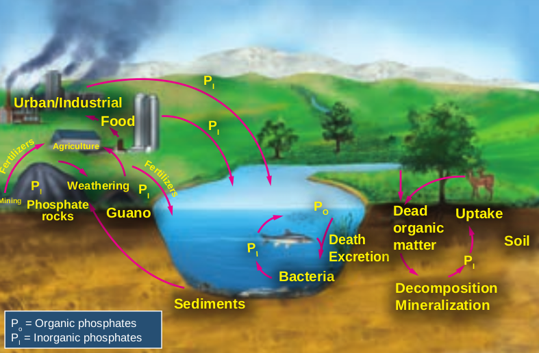

**Decomposition Mineralization**

**Urban/Industrial Food**

**Agriculture**

**Weathering Mining**

**Guano**

**Sediments**

**Bacteria**

**Death Excretion**

**Dead organic matter Soil**

**Uptake**

**PI**

**PI**

**PI**

**PI**

**PO**

**PI PI**

**Phosphate rocks**

Po = Organic phosphates PI = Inorganic phosphates

**Fe rti**

**lize rs**

**Fertilizers**


  


the atmosphere increases due to burning of fossile fuels, deforestration, forest fire, volcanic eruption and decomposition of dead organic matters. The details of carbon cycle are given in the figure 7.11.

**Phosphorus cycle**

It is a type of sedimentary cycle. Already we know that phosphorus is found in the biomolecules like DNA, RNA, ATP, NADP and phospholipid molecules of living organisms. Phosphorus is not abundant in the biosphere, whereas a bulk quantity of phosphorus is present in rock deposits, marine sediments and guano. It is released from these deposits by weathering **7.2.10 Types of ecosystem**

Biosphere consists of different types of ecosystems, which are as follows:

**Ecosystem**

Natural Ecosystem

(With or without human

interference)

Artificial or Manmade Ecosystem

(Artifically maintained by man)

Example: Rice field and Maize field

Aquatic ecosystem

(Open water)

Terrrestrial Ecosystem Example: Forest ecosystem

Grass land ecosystem Desert ecosystem

Fresh water ecosystem Marine ecosystem

Lotic (Running water

bodies) Example: River

Spring and Stream

Lentic (Standing water

bodies) Example: Pond

and Lake


**Structure of Pond ecosystem**

Producers

Consumers

Decomposers

Abiotic components

**Mud**

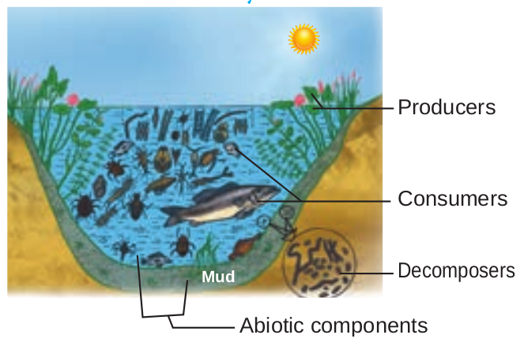

It is a classical example for natural, aquatic, freshwater, lentic type of ecosystem. It helps us to understand the structure and function of an ecosystem. When rain water gathers in a shallow area, gradually over a period of time, different kinds of organisms (microbes, plants, animals) become part of this ecosystem. This pond ecosystem is a self sustaining and self regulatory fresh water ecosystem, which shows a complex interaction between the abiotic and biotic components in it.

Activity

Collect few living and nonliving components from any water body found near by.

**Abiotic components** A pond ecosystem consists of dissolved inorganic (CO2, O2, Ca, N, Phosphate) and organic substances (amino acids and humic acid) formed from the dead organic matter. The function of pond ecosystem is regulated by few factors like the amount of light, temperature, pH value of water and other climatic conditions.

**Biotic components** They constitute the producers, variety of consumers and decomposers (microorganisms).


  


**a. Producers** A variety of phytoplanktons like _Oscillatoria, Anabaena, Chlamydomonas, Pandorina Eudorina, Volvox_ and _Diatoms._ Filamentous algae such as _Ulothrix, Spirogyra, Cladophora_ and Oedogonium; floating plants Azolla, _Salvia, Pistia, Wolffia and Eichhornia; sub-_ merged plants _Potamogeton_ and _Phragmitis_; rooted floating plants Nymphaea and Nelumbo; macrophytes like _Typha_ and _Ipomoea,_ constitute the major producers of a pond ecosystem.

**b. Consumers** The animals represent the consumers of a pond ecosystem which include zooplanktons like _Paramoecium_ and _Daphnia_ (primary consumers); benthos (bottom living animals) like mollusces and annelids; secondary consumers like water beetles and frogs; and tertiary consumers (carnivores) like duck , crane and some top carnivores which include large fish, hawk ,man, etc.

Sea grasses and mangroves of Estuarine and coastal ecosystems are the most efficient in carbon sequestration. Hence,

these ecosystems are called as “ **Blue carbon ecosystems”. They are not properly utilized** and maintained all over the world although they have rich bioresources potential.

**c. Decomposers**

They are also called as microconsumers. They help to recycle the nutrients in the ecosystem. These are present in mud water and bottom of the ponds. Example: Bacteria and Fungi. Decomposers perform the process of decomposition in order to enrich the nutrients in the pond ecosystem.

The cycling of nutrients between abiotic and biotic components is evident in the pond ecosystem, making itself self sufficient and self regulating.

**Limnology** It is the study of biological, chemical, physical and geological

components of inland fresh water aquatic ecosystems (ponds, lakes, etc.).

**Oceanography** – It is the study of biological, chemical, physical and geological components of ocean.

**Stratification of pond ecosystem**

Sun

LITTORAL ZONE

PROFUNDAL ZONE

light LIMNETIC ZONE

compensation level

BENTHIC ZONE


Based on the factors like distance from the shore, penetration of light, depth of water, types of plants and animals, there may be three zones, littoral, limnetic and profundal. The littoral zone, which is closest to the shore with shallow water region, allows easy penetration of light. It is warm and occupied by rooted plant species. The limnetic zone refers the open water of the pond with an effective penetration of light and domination of planktons. The deeper region of a pond below the limnetic zone is called profundal zone with no effective light penetration and predominance of heterotrophs. The bottom zone of a pond is termed benthic and is occupied by a community of organisms called benthos (usually decomposers).The primary productivity through photosynthesis of littoral and limnetic zone is more due to greater penetration of light than the profundal zone.


### Ecosystem services ( Benefits)
Ecosystem services are defined as the benefits that people derive from nature. Robert Constanza et al (1927) stated “Ecosystem services are the benefits provided to human, through the transformation of resources (or Environmental assets including land, water, vegetation and atmosphere) into a flow of essential goods and services”.

Study on ecosystem services acts as an effective tool for gaining knowledge on ecosystem benefits and their sustained use. Without such knowledge gain, the fate of any ecosystem will be at stake and the benefits they provide to us in future will become bleak.

Robert Constanza and his colleagues estimated the value of global ecosystem services based on various

parameters. According to them in 1997, the average global value of ecosystems services estimated was US $ 33 trillion a year. The updated estimate for the total global ecosystem services in 2011 is US $ 125 trillion / year, indicating a four-fold increase in ecosystem services from 1997 to 2011.

**Mangrove ecosystem services**
- Offers habitat and act as nursery for aquatic plants and animals
- Provides medicine, fuel wood and timber.
- Act as bridge between sea and rivers by balancing sedimentation and soil erosion.
- Help to reduce water force during cyclones, tsunamis and high tide periods.
- Help in wind break, O2 production, carbon sequestration and prevents salt spray from waves.

**How do anthropogenic activities affect ecosystem services?** Now, we all exploit the ecosystem more than that of our needs. The Millennium Ecosystem **Assessment (2005)** found that “over the past 50 years, humans have changed the ecosystem more rapidly and extensively than in any comparable period of time in human history, largely to meet rapidly growing demands for food, fresh water, medicine, timber, fiber and fuel.”

The varieties of benefits obtained from the ecosystem are generally categorized into the following four types

**Ecosystem services**

**Provisoning services**
- Food, fiber and fuel
- Genetic resources
- Bio-chemicals • Fresh water • Medicines

**Cultural services** • Spiritual and

religious values • Knowledge system • Education and

inspiration • Recreation and

aesthetic values • Ecotourism

**Supporting services** • Primary production • Provision of habitat • Nutrient cycling • Soil formation and

retention • Production of

atmospheric oxygen • Water cycling

**Regulating services** • Invasion resistance • Herbivory pollination • Seed dispersal • Climate regulation • Pest regulation • Disease regulation • Erosion regulation • Water purification • Natural hazard protection


  


Generally the following human activities disturb or re-engineer an ecosystem every day. • Habitat destruction • Deforestation and over grazing • Erosion of soils • Introduction of non-native species • Over harvesting of plant material • Pollution of land, water and air • Run off pesticides, fertilizers and animal wastes

**Ecosystem resilience** Ecosystem is damaged by disturbances from fire, flood, predation,

infection, drought, etc., removing a great amount of biomasss. However, ecosystem is endowed with the ability to resist the damage and recover quickly. This ability of ecosystem is called ecosystem resilience or ecosystem robustness.

**How to protect the ecosystem?** It is a practice of protecting ecosystem at individual, organisational and governmental levels for the benefits of both nature and humans. Threats to ecosystems are many, like adverse human activities, global warming, pollution, etc. Hence, if we change our everyday life style, we can help to protect the planet and its ecosystem.

**“If we fail to protect environment, we will fail to save posterity”.**

Therefore, we have to practice the following in our day today life:
- Buy and use only ecofriendly products and recycle them.
- Grow more trees
- Choose sustained farm products (vegetables, fruits, greens, etc.)
- Reduce the use of natural resources.
- Recycle the waste and reduce the amount of waste you produce.
- Reduce consumption of water and electricity.
- Reduce or eliminate the use of house-hold chemicals and pesticides.
- Maintain your cars and vehicles properly. (In order to reduce carbon emission)
- Create awareness and educate about ecosystem protection among your friends and family members and ask them to find out solution to minimise this problem.

**Go green It refers to the changing of one’s lifestyle for the safety and benefits of the environments (Reduce, Reuse, Recycle)** **Way to go green and save green** • Close the tap when not in use. • Switch off the electrical gadgets

when not in use. • Never use plastics and replace them

with biodegradable products • Always use ecofriendly technology

and products. **“USE ECOSYSTEM BUT DON’T LOSE ECOSYSTEM; MAKE IT SUSTAINABLE”**

### Ecosystem Management
 It is a process that integrates ecological, socio economic and institutional factors into a comprehensive strategy in order to sustain and enhance the quality of the ecosystem to meet current and future needs.

Ecosystem management emphasis on human role in judicious use of ecosystem


and for sustained benefits through minimal human impacts on ecosystems. Environmental degradation and biodiversity loss will result in depletion of natural resources, ultimately affecting the existence of human

"By 2025, at least 3.5 billion people, nearly 50% of the world’s population are projected to face water

scarcity." – IUCN. "Forests house approximately 50% of global bio-diversity and at least 300 million people are dependent on forest’s goods and services to sustain their livelihood." – IUCN

**Strategy of ecosystem management** • It is used to maintain biodiversity of

ecosystems. • It helps in indicating the damaged

ecosystem (Some species indicate the health of the ecosystem: such species are called a **flagship species).**
- It is used to recognize the inevitability of ecosystem change and plan accordingly.
- It is one of the tools used for achieving sustainability of ecosystem through sustainable development programme (or projects).
- It is also helpful in identifying ecosystems which are in need of rehabilitation.
- It involves collaborative management with government agencies, local population, communities and NGO’s.
- It is used to build the capacity of local institutions and community groups to assume responsibility for long term implementation of ecosystem management activities even after the completion of the project.

**Urban ecosystem restoration model** Adayar Poonga is located in Chennai and covers an area around a total of 358 acres of Adayar creek and estuary, of which 58 acres were taken up for eco restoration under the auspices of Government of Tamil Nadu. It is maintained by Chennai Rivers Restoration Trust (CRRT).This was a dumping site previously. Presently it has 6 species of mangroves, about 170 species of littoral and tropical dry evergreen forests (TDF) which have successfully established as a sustainable ecosystem. Restoration of plants species has brought other associated fauna such as butterflies, birds, reptiles, amphibians and other mammals of the ecosystem. Currently Adayar Poonga functions as an environmental education Centre for school and college students and the public. The entire area stands as one of the best examples for urban eco restoration in the state of Tamil Nadu.

**Adayar Poonga**

## Plant Succession
 We very often see that forests and lands in our areas are drastically affected by natural calamities (Flood, earthquake) and anthropogenic activities (Fire, over grazing, cutting of trees). Due to these reasons all plants of an area are destroyed and the areas become nude. When we observe this area, over a period of a time we can see that


  


it will be gradually covered by plant community again and become fertile. Such successive replacement of one type of plant community by the other of the same area/ place is known as plant succession. The first invaded plants in a barren area are called **pioneers**. On the other hand, a series of transitional developments of plant communities one after another in a given area are called **seral communities**. At the end a final stage and a final plant community gets established which are called as climax and climax community respectively.

### Causes of Succession
 Ever since the onset of origin of life, organic evolution and ecological succession are taking place parallelly. Ecological succession is a complex process. There are three types of causes for any ecological succession. They are

a. **Initiating causes -** Activity of abiotic (light, temperature, water, fire, soil erosion and wind) and biotic factors (competition among organisms) leads to formation of a barren area or destruction of the existing community of an area, initiating primary or secondary succession respectively.

b. Continuing causes - The processes of migration, aggregation, competition, reaction etc, are the continuing causes which lead to change the plant communities and nature of the soil in an area.

c. Stabilizing causes - The stabilization of the plant community in an area is primarly controlled by climatic factors rather than other factors.

### Characteristics of ecological succession
 • It is a systematic process which

causes changes in specific structure of plant community.
- It is resultant of changes of abiotic and biotic factors.
- It transforms unstable community

into a stable community. • Gradual progression in species diversity,

total biomass, niche specialisation, and humus content of soil takes place.
- It progresses from simple food chain to complex food web.
- It modifies the lower and simple life form to the higher life forms.
- It creates inter-dependence of plants and animals.

### Types of succession
 The various types of succession have been classified in different ways on the basis of different aspects. These are as follows:

**1. Primary succession - The development** of plant community in a barren area where no community existed before is called primary succession. The plants which colonize first in a barren area is called **pioneer species** or **primary community** or **primary colonies**. Generally, Primary succession takes a very long time for the occurrence in any region.

**Example:** Microbes, Lichen, Mosses.

**2. Secondary succession - The development of** a plant community in an area where an already developed community has been destroyed by some natural disturbance (Fire, flood, human activity) is known as **secondary succession**. Generally, This succession takes less time than the time taken for primary succession.

**Example: The forest destroyed by fire and** excessive lumbering may be re-occupied by herbs over a period of time.

**Secondary Succession**

Fire Annual plants

0 Year 1 - 2 Years 3 - 4 Years 5 - 150 Years 150 + Years

Grasses and

Perennials Grasses, Shrubs Shrubs and trees

Intermediate Species

Climax CommunityPioneer Species

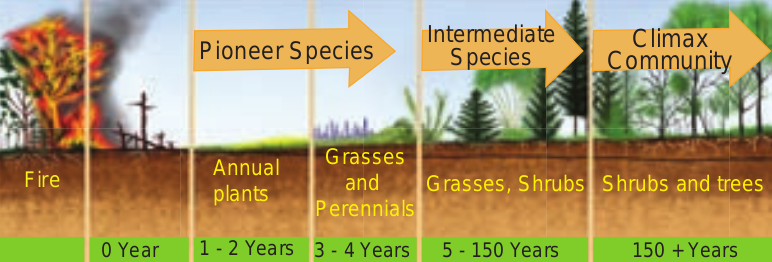


Primary succession Secondary succession 1 Developing in an

barren area Developing in disturbed area

2 Initiated due to a biological or any other external factors

Starts due to external factors only

3 No soil, while primary succession starts

It starts where soil covers is already present

4 Pioneer species come from outside environment

Pioneer species develop from existing environment

5 It takes more time to complete

It takes comparatively less time to complete

**Table 1: Differences between primary and** secondary succession

**3. Allogenic succession**

Allogeneic succession occurs as a result of abiotic factors. The replacement of existing community is caused by other external factors (soil erosion, leaching, etc.,) and not by existing organisms.

Example: In a forest ecosystem soil erosion and leaching alter the nutrient value of the soil leading to the change of vegetation in that area.

**4. Autotrophic succession**

If the autotrophic organisms like green plants are dominant during the early stages of succession it is called **autotrophic succession**, this occurs in the habitat which is rich in inorganic substances. Since, green plants dominate in the beginning of this succession, there is a gradual increase in organic matter and subsequently the energy flow in the ecosystem.

### Process of succession
 There are a number of sequential processes in primary autotrophic succession. They are (1) Nudation, (2) Invasion (migration) (3) Ecesis, (4) Aggregation, (5) Competition, (6) Reaction (7) Stabilization (climax).

**1. Nudation - This is the development of a** barren area without any form of life. The barren area may be developed due to topographic (soil erosion, wind action), climatic (hails, storm, fire), and biotic (human activities, epidemics, etc.,) factors.

**2. Invasion -** If species invade or reach a barren area from any other area it is called invasion. When the seeds, spores or other propagules of plant species reach the barren area, by air, water and various other agent, it is known as migration.

**3. Ecesis (Establishment) - After reaching a new** area (invasion), the successful establishment of the species, as a result of adjustment with the conditions prevailing in the area, is known as **ecesis.** If the establishment is complete, the plant will be able to reproduce sexually in that particular area.

4. Aggregation - The successful establishment of species, as a result of reproduction and increase in population of the species than the earlier stage is called aggregation.

5. **Competition -** It refers to the aggregation of a particular species in an area which leads to inter specific and intraspecific competition among the individuals for water, nutrient,radiant energy, CO2, O2 and space, etc.


```goat

                                                                                                                                                               
                                                      +--------------------------------+                                   -                                   
                                                      |                                |                                                                       
                                                      |     Types of succession        |                                                                       
                                                      +----------------|---------------+                                                                       
                                                                       |                                                      -                                
              |------------------------|--------------------|----------|----------|-----------------------|-------------------|                                
              |                        |                    |                     |                       |                   |                                
              |                        |                    |                    -|                       |                   |                                
     +------------------+    +---------|---------+  +-------|------+    +---------|--------+    +---------|---------+  +------|-------+                        
     |   Primary        |    | Secondary         |  | Autogenic    |    |   Allogenic      |    |Autotropic         |  |Heterotrophic |                        
     |   Succession     |    | Succession        |  | Succession   |    |  +Succession     |    |Succession         |  |Succession    |                        
     |   Development    |    | Development       |  | Controlled   |    |   Controlled     |    |It occurs in the   |  |It occurs     |                        
     |   of plant       |    | of plant          |  | by biotic    |    |   by abiotic     |    |medium that is     |  |in the        |                        
     |   community on   |    | community on      |  | components of|    |   components     |    |rich in inorganic  |  |medium that is|                        
     |   barren area.   |    | disturbed area.   |  | ecosystem.   |    |   of ecosystem.  |    |substances .       |  |rich in organic                        
     +------------------+    +-------------------+  +--------------+    +------------------+    +-------------------+  +substances.---+                        
                                                                                                                                          

```

6. Reaction - The species occupying a habitat gradually modify the environmental condition, where the existing species community is displaced or replaced by another. This is called reaction. The community which is replaced by another community is called **seral community**.

**7. Stabilization (Climax stage) - The final** establishment of plant community is called stabilization. This establishment of a plant community which maintains itself in equilibrium with climax of the area and not replaced by others is known as **climax community** and the stage is climax stage.

### Classification of plant succession
 Detailed study of Hydrosere and Lithosere are discussed below:

**Hydrosere** (Succession

starts in regions where

water is plenty)

Example: Ponds, lakes,

stream , swamps

**Mesosere** (Succession

starts in regions where

moisture condition

is adequate)

**Xerosere** (Succession

starts in regions where

moisture is present

in minimal amount with

water

**Lithosere** (Initiating on a barren rock)

**Halosere** (Initiating in saline water)

**Psammosere** (Initiating on

a sand)

Plant succession

**Figure 7.19: Classification of plant succession**

**Hydrosere** The succession in a freshwater ecosystem is also referred to as hydrosere. Succession in a pond, begins with colonization of the pioneers like phytoplankton and finally ends with the formation of climax community like forest stage. It includes the following stages Fig 7.20.

**1. Phytoplankton stage - It is the first stage** of succession consisting of the pioneer

community like blue green algae, green algae, diatoms, bacteria, etc., The colonization of these organisms enrich the amount of organic matter and nutrients of pond due to their life activities and death. This favors the development of the next seral stages.

**2. Submerged plant stage -** As the result of death and decomposition of planktons, silt brought from land by rain water, lead to a loose mud formation at the bottom of the pond. Hence, the rooted submerged hydrophytes begin to appear on the new substratum. Example: _Chara, Utricularia, Vallisneria_ and _Hydrilla etc. The death and decay of these_ plants will build up the substratum of pond to become shallow. Therefore, this habitat now replaces another group of plants which are of floating type.

**3. Submerged free floating stage - During** this stage, the depth of the pond will become almost 2-5 feet. Hence, the rooted hydrophytic plants and with floating large leaves start colonising the pond. Example: Rooted floating plants like _Nelumbo, Nymphaea_ and _Trapa_. Some free floating species like Azolla, Lemna, _Wolffia and Pistia are also present in this stage._ By death and decomposition of these plants, further the pond becomes more shallow. Due to this reason, floating plant species is gradually replaced by another species which makes new seral stage.

**4. Reed-swamp stage -** It is also called an amphibious stage. During this stage, rooted floating plants are replaced by plants which can live successfully in aquatic as well as aerial environment. Example: _Typha, Phragmites, Sagittaria_ and _Scirpus_ etc. At the end of this stage, water level is very much reduced, making it unsuitable for the continuous growth of amphibious plants.

**5. Marsh meadow stage -** When the pond becomes swallowed due to decreasing water level, species of Cyperaceae and Poaceae such as


_Carex, Juncus, Cyperus_ and _Eleocharis_ colonise the area. They form a mat-like vegetation with the help of their much branched root system. This leads to an absorption and loss of large quantity of water. At the end of this stage, the soil becomes dry and the marshy vegetation disappears gradually and leads to shurb stage.

**6. Shrub stage -** As the disappearance of marshy vegetation continues, soil becomes dry. Hence, these areas are now invaded by terrestrial plants like shrubs (_Salix_ and _Cornus) and trees (Populus and Alnus). These_ plants absorb large quantity of water and make the habitat dry. Further, the accumulation of humus with a rich flora of microorganisms produce minerals in the soil, ultimately favouring the arrival of new tree species in the area.

**7. Forest stage -** It is the climax community of hydrosere. A variety of trees invade the area and develop any one of the diverse type of vegetation. Example:Temperate mixed forest (_Ulmus,Acer_ and _Quercus_), Tropical rain forest (_Artocarpus_ and _Cinnamomum_ ) and Tropical deciduous forest (_Bamboo_ and _Tectona_).

In the 7 stages of hydrosere succession, stage1 is occupied by pioneer community, while the stage 7 is occupied by the climax community. The stages 2 to 6 are occupied by seral communities.

**Lithosere** Lithosere is a type of xerosere initiating on a barren rock surface. The barren rock is devoid of water and organic matter. A barren rock surface gets mineral deposits due to weathering. This results in the colonization of pioneer organisms like crustose lichens. Through a series of successive seral stages, forest stage (Climax community) is achieved finally. These series of stages are given below Fig 7.21.

**1. Crustose lichen stage - The pioneers like** crustose lichens (_Rhizocarpon_ and _Lecanora_) secrete some acids which enhance the

**Fi gu**

**re 7**

**.2 0:**

D ia

gr am

m at

ic re

pr es

en ta

tio n

sh ow

s d iff

er en

t s ta

ge s o

f h yd

ro se

re .

Ph yt

op la

nk to

n st

ag e

Su bm

er ge

d pl

an t

st ag

e Su

bm er

ge d

fr ee

flo

at in

g st

ag e

Re ed

\-s w

am p

st ag

e M

ar sh

m ea

do w

st

ag e

Sh ru

b st

ag e

Fo re

st st

ag e


  


weathering of rock. Due to this continuous process, small particles of rocks are formed, which together with decaying lichen make the first thin layer of soil on rock surface. However, this process is very slow. At the end, this habitats become less fit for existing plants and is gradually replaced by another type of lichens called foliose lichen.

**2. Foliose lichen stage -** Gradually crustose lichens are replaced by foliose lichen like _Parmelia and Dermatocarpon etc. These plants_ have leaf like structures. They also secrete some acids which further loosen the rocks into small soil particles. This process enhances water retaining capacity of the habitat and causes further accumulation of soil particles and humus. Gradual changes make the area less favourable for existing foliose lichen.

**3. Moss stage -** When the habitat is changed, the existing foliose lichen starts disappearing and favours the growth of some xerophytic moss like _Polytrichum, Tortula_ and _Grimmia_. The luxurious growth of moss competes with lichens. Due to the death and decay of mosses, further addition of humus and moisture to the habitat takes place. Therefore, the next seral community tries to replace the moss community.

**4. Herb stage -** With the gradual disappearance of moss stage, herbaceous plant communities like _Aristida, Festuca_ and _Poa,_ etc., invade the habitat. The extensive growth of these herbs alter the habitat. The decaying leaves, stems, root and other parts of these plants get deposited on the soil surface in the form of humus. It further increases the water holding capacity of soil. These conditions become more suitable for shrubs.

**5. Shrub stage - The habitat change** results in the invasion of shrubs like _Rhus, Zizyphus, Capparis_ and dominated by herbaceous plants. The death and decaying of

**Fi gu**

**re 7**

**.2 1:**

D ia

gr am

m at

ic re

pr es

en ta

tio n

sh ow

s d iff

er en

t s ta

ge s o

f l ith

os er

e

C ru

st os

e lic

he n

st ag

e Fo

lio se

lic

he n

st ag

eM os

s s ta

ge H

er b

st ag

e Sh

ru b

st ag

e Fo

re st

st ag

e


  


shrubs further enrich the habitat with soil and humus. Therefore, the shrubs are replaced by trees which constitute the climax community.

**6. Forest stage - The trees capable of growing** in xerophytic condition try to invade the area which was occupied previously by shrubs. Further increasing the humus content of the soil favours the arrival of more trees and vegetation finally become mesophytes. As the trees are deeply rooted and much branched, they absorb more quantity of water and nutrients. After a long interval, a complete harmony is established among the plant communities. The climax stage remains unchanged unless some major environmental changes disturb it

Of the 6 stages of lithosere succession, stage 1 is occupied by pioneer community and the stage 6 is occupied by climax community. The stages 2 to 5 are occupied by seral communities. Seral stages occurring on the same rock surfaces.

### Significance of Plant Succession
 • Succession is a dynamic process. Hence

an ecologist can access and study the seral stages of a plant community found in a particular area.
- The knowledge of ecological succession helps to understand the controlled growth of one or more species in a forest.
- Utilizing the knowledge of succession, even dams can be protected by preventing siltation.
- It gives information about the techniques to be used during reforestation and afforestation.
- It helps in the maintenance of pastures.
- Plant succession helps to maintain species diversity in an ecosystem.
- Patterns of diversity during succession are influenced by resource availability and

disturbance by various factors.
- Primary succession involves the colonization of habitat of an area devoid of life.
- Secondary succession involves the reestablishment of a plant community in disturbed area or habitat.
- Forests and vegetation that we come across all over the world are the result of plant succession.

## Vegetation
 Vegetation refers to the plant cover of an area. Geographically, India is a tropical country and also has strong monsoon climate and differs from other tropical regions of the World. India has four major climatic regions such as wet zone, intermediate zone, dry zone and arid zone, These regions are characterized by different types of natural vegetation. Nature of vegetation is also determined by several factors like altitude, types of plants, animals, climate, soil type, etc. Vegetation in Indian sub-continent is influenced by biotic factors and the existing human culture for a long time. The influence of man on plant formation and distribution is called anthropogenic effect on vegetation.

Tamil Nadu has a rich biodiversity right from the Gulf of Mannar to Western Ghats. Tamil Nadu shares the Western Ghats with states of Kerala, Karnataka, Goa, Maharashtra, Gujarat while Eastern Ghats is shared with the State of Andhra Pradesh. Of the 10 geographic zones in India, Coramandel (or) East Coast and Western Ghats are from Tamil Nadu.

### Vegetation types of India and Tamil Nadu
 Vegetation of India and Tamil Nadu consists of variety of plant communities and also possesses rich bio-diversity. It is classified in to the following four types, Which are explained with reference to their unique characteristics and distribution in India and Tamil Nadu:


  


Forest vegetation Grassland vegetation Riparian vegetation Aquatic and semi aquatic vegetation

**Forest Vegetation** Champion and Seth (1968) recognized a total of 16 forest types in India, Whereas 9 types of them in Tamil Nadu.

**I) Moist Tropical Forests**

It is in the warmer plains. It is characterised by very dense, multi-storeyed diverse trees, shrubs, lianas and scrub jungles. These areas experience a high rainfall and dry climate. These are further classified into the following types on the basis of wetness.

1. **Tropical wet evergreen forests**

This type is found at an altitude of nearly 1500 m on the slopes of hills and mountains .These are also called tropical rain forests or tropical wet evergreen forests, where annual rainfall is more than 250 cm.. Vegetation consists of luxuriantly growing huge trees of more than 45 m in height, shrubs, lianas and abundant epiphytes. The common plants are _Dipterocarpus, Artocarpus, Mangifera, Emblica and Ixora. These forests_ occur in Andaman and Nicobar Islands, Western Coasts, Anamalai hills and Assam. This type is also found in western ghats of Thirunelveli, Kanyakumari, Anamalai Hills of Tamil Nadu

2. **Tropical semi-evergreen forests**

This type occurs on the slopes of hills and mountain usually up to 1000 m altitude.The annual rainfall in these forests is between 200 to 250 cm. Vegetation consists of luxuriantly growing evergreen species of giant trees and shrubs. The common tree species are Terminalia, _Bambusa, Ixora, Artocarpus, Michelia, Eugenia,_ and _Shorea._ Orchids, ferns, some grasses,and herbs are also dominant. These forest are found in Western Coasts, Eastern Orissa and Upper Assam. This type is also present in Coimbatore, Thirunvelveli and Kanyakumar District of

Tamil Nadu

3. **Tropical moist deciduous forests**

The annual rainfall of these forests is 100 to 200 cm with short dry periods. These are spread over an extensive part of the country. Many of the plants shed their leaves in hot summer. Some are ever green and semi-evergreen. The common plant species are _Terminalia, Grewia, Adina, Melia, Albizzia, Dalbergia_ and _Shorea._ The most dominant plants are Tectona and Sal. These are found in Kerala, Karnataka, South Madhya Pradesh, northern parts of Uttar Pradesh, Bihar, Bengal, Orissa and Assam. This type is also present in Kanyakumari, Theni, Gudalur, Dindigul, Madurai and Nilgiris of Tamil Nadu.

4. **Littoral and swamp forests**

These include beach forests, tidal forests, mangrove forests and fresh water swamp forests.

a. **Beach forests**

These are found all along the sea coasts and river deltas. These areas have sandy soil which consists of large amount of lime and salts but poor in nitrogen and other mineral nutrients. The rainfall varies from 75 cm to 500 cm with moderate temperature. The common tree species are _Casuarina, Borassus, Phoenix, Pandanus , Morinda and Thespesia with many_ twiners and climbers.

**b. Tidal or mangrove forests**

Tidal forests grow near the estuaries, swampy margins of islands and along sea coasts. The plants are halophytes characterized by the presence of stilt roots, pneumatophores and viviparous germinations of seed. The common plants are _Rhizophora, Avicennia,_ and Sonneratia. These are found near sea coast,Gujarat, Ganges, delta regions of Mahanadhi, Godavari, Krishna, Sundarbans and Pulicat, Pichavaram, Ramanathapuram of Tamil Nadu.


**c. Fresh water swamp forests**

These forests grow in low lying land areas where rain or river water gets collected for some time. So the water table is closer to the earth surface. The common plants are _Salix, Acer, Ficus_ and all varieties of grasses and sedges. These forests are found in wetlands of Kanchipuram, Kanniyakumari of Tamil Nadu.

**II. Dry Tropical Forests**

These are classified into three types: Tropical dry deciduous forests, tropical thorn forests and tropical dry evergreen forests

5. **Tropical dry deciduous forests**

These forests are found at about 400 to 800 m MSL .These forests are found in the areas where annual rainfall is usually low, ranging between 70 and 100 cm. The largest forest area of the country is occupied by tropical dry deciduous forest. The dry season is long and most of the trees remain leafless during this season. The forest trees are not dense, and grow up to 10 to 15 m in height. The common plant species are Dalbergia, _Diospyros, Terminalia, Acacia, Chloroxylon,_

**IV. Montane Temperate Forests**

11. Montane Wet temperate forests 12. Himalayan moist temperate forests 13. Himalayan dry temperate forests

**V. Sub-Alpine Forests**

14. Sub alpine forests

**VI. Alpine Scrub**

15. Moist alpine scrub 16. Dry alpine scrub

**I. Moist Tropical Forests**

01. Tropical wet evergreen forests

02. Tropical semi-evergreen forests

03. Tropical moist deciduous forests

04. Littoral and swamp forests

**II. Dry Tropical Forests**

05. Tropical dry deciduous forests

06. Tropical thorn forests

07. Tropical dry evergreen forests

**III. Montane Sub- Tropical Forests**

08. Sub-tropical broad leaved hill forests

09. Sub-tropical pine forests

10. Sub-tropical dry evergreen forests

**FOREST TYPES OF INDIA Champion and Seth (1968)**


_Bauhinia_ and _Zizyphus._ Some common Climbers are _Combretum, Hiptage_: herbs like _Abutilon, Achyranthes_ and Tribulus.These are found in Andhra Pradesh, Punjab, Uttar Pradesh, Bihar, Orissa, Madhya Pradesh and also found in all districts of Tamil Nadu at lower elevations.

6. **Tropical thorn forests**

These forests extend from plains upto 400 M . Occur in the areas where annual rainfall is between 20 and 70 cm. The dry season is hot and very long. The vegetation is of open type consisting of small trees (8 to 10 m length) and thorny or spiny shrubs with a stunted growth. The plants remain leafless for most of the year and many species have latex.. In rainy season, there is a luxuriant growth of ephemeral herbs and grass. The most common plant species are _Acacia, Cassia, Calotropis, Albizzia, Zizyphus, Dichrostachys, Euphorbia, Capparis,_ and including unpalatable species. They are found in Karnataka, Andhra Pradesh, Maharashtra, South

**FOREST TYPES IN TAMIL NADU** Champion and Seth (1968)

**I. Moist tropical Forests** 1. Tropical wet evergreen forests 2. Tropical semi evergreen forests 3. Tropical moist deciduous

forests 4. Littoral and swamp forests

**II. Dry tropical Forests** 5. Tropical dry

deciduous forests 6. Tropical thorn forests 7. Tropical dry

evergreen forests

**III. Montane Sub-Tropical Forests**

8. Sub-tropical broad leaved hill forests

**IV. Montane Temperate Forests**

District Boundary

**LEGEND**

**TAMILNADU FOREST COVER MAP**

**(DIAGRAMMATIC)**

**FOREST TYPES** Tropical Wet Evergreen Forests

Tropical Thorn Forests

Tropical Semi - Evergreen Forests Tropical Moist Deciduous Forests

Tropical Dry Evergreen Forests

Tropical Dry Deciduous Forests

Montane Subtropical Forests Montane Wet Temperate Forests

al and Swamp Forests

**e TAMILNADU FOREST DEPARTMENT**

**CHENNAI**

**CHENNAI**

**KANCHEEPURAM THIRUVANNAMALAI**

**VILLUPPURAM**

**CUDDALORE**

**PERAMBALUR**

**ARIYA LU**

**R**

**VELLORE**

**KRISHNAGIRI**

**DHARMAPURI**

**SALEM**

**NAMAKKAL**

**KARUR TRICHY**

**TANJORE**

**NAGAPATTINAM PUDUKKOTTAI**

**RAMANATHA**

**PURAM**

**SIVAGANGAI**

**V URIHT**

**URA R**

**ERODE**

**THIRUPPUR**

**DINDIGUL**

**MADURAI**

**VIRUTHUNAGAR**

**THOOTHUKUDI**

**KANYAKUMARI**

**TI RU**

**N EL**

**VE LI**

**THENI**

**COIMBATORE**

**NILGIRIS**

**THIRUVALLUR**

**YELAGIRIJAVADHU HILLS**

**URIGAM GUTHIRAYAN**

**CHITTERI HILLS**

**KALRAYAN HILLS**

**SHERVAROY HILLS BARGUR HILLS**

**PALAMALAIGUTTIYALATTUR**

**TALAMALAI HILLS**

**KOLLIMALAI PACHAI MALAI**

**ANAIMALAI**

**PALANI HILLS KARANDA**

**MALAI SIRUMALAI**

**ALAGAR HILLSBODI HILLS**

**CUMBUM VALLEY**

**AGASTHYAMALAI**

**KALAKAD-MUNDANTHURAI**

Eastern Ghats Western Ghats

EW

N

S

**N o**

**t to**

**S c**

**a le**


  


Punjab, most parts of Rajasthan and part of Gujarat and Thirunelveli in Tamil Nadu.

7. **Tropical dry evergreen forests**

This type of vegetation is found in areas where annual rainfall is in plenty but the dry season is comparatively longer. The trees are dense, evergreen, short and about 10 to 15 meter height. The common plant species are _Manilkara , Walsura, Diospyros and Memexylon_ These types of forests are found in the eastern parts of Tamil Nadu, East coat of Andhra pradesh. They are also found in all coastal districts in Tamil Nadu from Thiruvallur to Nagapatinum districts.

**III. Montane Subtropical Forests**

This type of vegetation occurs in the areas with fairly high rainfall but where the climate is cooler than the tropical and warmer than the temperate forests. They are found in the altitude between 1000 m and 2000 m. The common plants are _Eugenia, Syzygium_ and _Toona_ are mostly evergreens. Many epiphytes including orchids and ferns are present. These are found in Nilgiri, Mahabaleswar, Assam and Manipur. In Eastern Ghats,it is found in the upper slopes and plateau of shervaroys, Kollimalai and Pachamalai of Tamil Nadu

These are further classified into

**8. Sub-tropical broad leaved hill forests** (Tamil Nadu,Kerala,Karnataka and Assam).

**9. Sub-tropical pine forests** (Punjab, U.P and a part of Sikkim)

**10.** **Sub-tropical dry evergreen forests** (Shivaliks and foot hills of western Himalayas).

**IV. Montane Temperate Forests**

This type of vegetation occurs where humidity and temperature are comparatively low. These forests are very dense with an extensive growth of grass and evergreen trees of 15 – 45 meters tall. The common plants are _Artocarpus, Balanocarpus, Pterocarpus,_

_Myristica_ and woody climbers besides ferns and epiphytes. It is also called mountain wet temperate forests. They are found in mountains of Himalayas. These are further classified into

**11. Montane wet temperate forests.**

**12. Himalayan moist temperate forests**.

**13. Himalayan dry temperate forests**.

In Tamil Nadu montane forest is mostly confined to moist and sheltered valleys, glens and hollows as in the Anamalis, Nilgiri and Palani hills tops at above 1000 m. They are known in Tamil as ‘Sholas’. The common vegetation of sholas are _Ilex, Syzygium, Michelia, Eurya_ and _Rhododendron_.

**V Sub-Alpine Forests**

**14 Sub-Alpine Forests**

This type of vegetation is found in the altitude ranging between 2900 m to 3500 m, where snow fall occurs for several weeks in a year with less than 65 cm annual rainfall. Hence, strong winds and below 00 C temperature prevail for greater part of the year. The common tree species are _Abies, Pinus, Betula, Quercus, Salix, Rhododendron_ with plenty of epiphytic orchids ,mosses and lichens. They occur in Himalayas from Ladakh in the West to Arunachal in the East Bengal, Uttar Pradesh, Assam, Jammu and Kashmir.

**VI Alpine - Scrub**

This type of vegetation is found in the Himalayas at an altitude ranging from 3600 m to 4900 m. The height of the trees decreases with increasing altitudes. The common plants are small sized plants such as _Sedum, Primula, Saxifraga,_ _Rhododendron_ , _Juniperus_ and with many types of lichens. These are further classified into

**15. Moist alpine scrubs**

**16.** **Dry alpine scrubs**.


Himalayan ranges, Nagaland, Himachal Pradesh and Western ghats.

In Tamil Nadu ,these grasslands are found in higher regions of western ghats and are found between the sholas forest patches that occur in the depressions and furrows created by water courses flowing in these rolling downs are called as **rolling grassland** and also called **shola grassland. It shows different types of vegetation** like grasses, herbs, few shrubs and stunted trees.

Existence of two climax communities under the influence of same climatic conditions are found in

higher mountain hill tops, above 7000 feet MSL (Mean sea level) of Nilgiris. Example: Sholas and grasslands.

**3. Riparian Vegetation**

This type of vegetation is located along streams and rivers. The most common species are, _Terminalia, Diospyros,Salix,Ficus_ and grasses. They are found on the banks of Godavari, Krishna, Ganga, Brahmaputria, Narmadha Yamuna and riverbeds of Cauvery and Thamirabharani in Tamil Nadu.

Activity

Visit nearby forest and water bodies, observe the species found, describe and then identify the various types of vegetation

**4. Aquatic And Semi-Aquatic Vegetation**

This type of vegetation is found in lakes, ponds, puddles and marshy places. The common plant species are _Nelumbo, Nymphaea, Bacopa, Typha, Pandanus, Cyperus, Aeschynomene, Hydrilla, Aponogeton_ and _Potomogeton_. It is found in various parts of Tamil Nadu.

**2. Grass land vegetation** Grassland refer to the vegetation community predominated by graminoids (i.e. grass and grass like plants). These are found in the altitude ranging from 150 to 2000 m and above mean sea level. The major plant families of the plants are Poaceae, Cyperaceae, Fabaceae , Gentianaceae and Asteraceae are common in this type of vegetation. The grass land not only comprises plants but also serves as habitats to a variety of micro and macro fauna. Based on the range of altitude, grasslands are categorized into: low altitude grasslands and high altitude grasslands.

Grasslands created and maintained by human are called anthropogenic grasslands.

**a. Low altitude grasslands**

This type of grasslands are found at an altitude upto 1000 m. The common plant species are _Halopyrum,_ Wild _Saccharum, Arundinella, Heteropogon and Chrysopogon. These types_ of grasslands are spread over coastal areas, riverline and alluvial areas of Deccan plateau, Chota Nagpur plateau, Gangetic, Brahmaputra valley and Eastern Ghats.

In Tamil Nadu, these are found in the Eastern Ghats .These are scattered and intermixed with local forests. They are exposed to considerable biotic interference. Fire is common during dry months.

**b. Higher altitude grasslands**

This type of grasslands are found in altitude above 1000 m.The common plants species are _Chrysopogon, A r u n d i n e l l a , Andropogon, Heteropogon, Cymbopogon, Imperata, Festuca,_ and _Agrostis._. It is spread over the southern slopes of Himalayas, sub-vegetation, Riparian vegetation, Aquatic and semi aquatic vegetation). According to Champion and Seth (1968), forest vegetation of India and Tamil Nadu has been classified in to 16 and 9 types respectively.


**Summary** The interaction between biotic and abiotic components in an environment is called ecosystem. Autotrophs and heterotrophs are the producers and consumers respectively. The function of ecosystem refers to creation of energy, flow of energy and cycling of nutrients. The amount of light available for photosynthesis is called Photo synthetically Active Radiation . It is essential for increase in the productivity of ecosystem. The rate of biomass production per unit area /time is called productivity. It is classified as primary productivity, secondary productivity and community productivity. The transfer of energy in an ecosystem can be termed as energy flow. It is explained through the food chain, food web , ecological pyramids ( pyramid of number, biomass and energy ) and biogeochemical cycle. Cycling of nutrients between abiotic and biotic components is evident in the pond ecosystem, making itself self sufficient and self regulating Ecosystem protected for the welfare of posterity is called ecosystem management.

Successive replacement of one type of plant community by the other of the same area/ place is known as plant succession. The first invaded plants in a barren (nude) area are called pioneers (pioneers communities). On the other hand, a series of transitional developments of plant communities one after another in a given area are called seral communities. Succession is classified as primary succession, secondary succession, allogeneic succession and autotrophic succession. Plant succession is classified in to hydrosere (Initiating on a water bodies) ,Mesosere and xerosere. Further xerosere is subdivided in to Lithosere ( Initiating on a barren rock), Halosere and Pasmmosere.

Vegetation refers to the plant cover of an area. Geographically, India and Tamil Nadu show tropical climate. Hence it has rich vegetation (Forest vegetation, Grassland

**Evaluation** I Choose the most suitable answer from the given four alternatives and write the option code and the corresponding answer. 1. Which of the following is not a abiotic

component of the ecosystem? a) Bacteria b) Humus c) Organic compounds d) Inorganic compounds

2. Which of the following is / are not a natural ecosystem?

a) Forest ecosystem b) Rice field c) Grassland ecosystem d) Desert ecosystem

3. Pond is a type of a) forest ecosystem b) grassland ecosystem c) marine ecosystem d) fresh water ecosystem

4. Pond ecosystem is a) not self sufficient and self regulating b) partially self sufficient and self regulating c) self sufficient and not self regulating d) self sufficient and self regulating 5. Profundal zone is predominated by

heterotrophs in a pond ecosystem, because of a) with effective light penetration b) no effective light penetration c) complete absence of light d) a and b

6. Solar energy used by green plants for photosynthesis is only

a) 2 – 8% b) 2 – 10%


  


c) 3 – 10% d) 2 – 9% 7. Which of the following ecosystem has the

highest primary productivity? a) Pond ecosystem b) Lake ecosystem c) Grassland ecosystem d) Forest ecosystem

8. Ecosystem consists of a) decomposers b) producers c) consumers d) all of the above

9. Which one is in descending order of a food chain

a) Producers  Secondary consumers  Primary consumers  Tertiary consumers

b) Tertiary consumers  Primary consumers  Secondary consumers  Producers

c) Tertiary consumers  Secondary consumers  Primary consumers  Producers

d) Tertiary consumers  Producers  Primary consumers  Secondary consumers

10. Significance of food web is / are a) it does not maintain stability in nature b) it shows patterns of energy transfer c) it explains species interaction d) b and c

11. The following diagram represents

**T1**

**T2**

**T3**

**T4**

a) pyramid of number in a grassland ecosystem

b) pyramid of number in a pond ecosystem c) pyramid of number in a forest ecosystem

d) pyramid of biomass in a pond ecosystem

12. Which of the following is / are not the mechanism of decomposition

a) Eluviation b) Catabolism c) Anabolism d) Fragmentation

13. Which of the following is not a sedimentary cycle

a) Nitrogen cycle b) Phosphorous cycle c) Sulphur cycle d) Calcium cycle

14. Which of the following are not regulating services of ecosystem services

i) Genetic resources ii) Recreation and aesthetic values iii) Invasion resistance iv) Climatic regulation a) i and iii b) ii and iv c) i and ii d) i and iv 15. Productivity of profundal zone will be low.

Why? 16. Discuss the gross primary productivity is

more efficient than net primary productivity. 17. Pyramid of energy is always upright. Give

reasons 18. Write some plants are found in sub alpine

forest. 19. What will happen if all producers are

removed from ecosystem? 20. Construct the food chain with the following

data. Hawk, plants, frog, snake, grasshopper. 21. Name of the food chain which is generally

present in all type of ecosystem. Explain and write their significance.

22. Shape of pyramid in a particular ecosystem is always different in shape. Explain with example.

23. Generally human activities are against to the ecosystem, where as you a student how will you help to protect ecosystem?

24. Generally in summer the forest are affected by natural fire. Over a period of time it


recovers itself by the process of successions . Find out the types of succession and explain.

25. Draw a pyramid from following details and explain in brief.

Quantities of organisms are given-Hawks-50, plants-1000.rabbit and mouse-250 +250, pythons and lizard- 100 + 50 respectively.

26. Various stages of succession are given bellow. From that rearrange them accordingly. Find out the type of succession and explain in detail.

Reed-swamp stage, phytoplankton stage, shrub stage, submerged plant stage, forest stage, submerged free floating stage, marsh medow stage.

**Glossary**

**Ecosystem:** Study of interaction between living and non-living components

**Standing quality:** Total inorganic substances presents in any ecosystem at a given time and given area

**Standing crops:** Amount of living material present in a population at any time.

**Biomass:** Can be measured as fresh weight or dry weight of organisms

**Benthic:** Bottom zone of the pond

**Trophic:** Refers to the position of organisms in food chain

**Omnivores: Those eats both plants and animals**

**Food chain:** Refers movement of energy from producers up to top carnivores

**Food web:** Interlocking pattern of food chain

**Pyramid of number:** Refers number of organisms in a successive trophic level

**Pyramid of biomass:** Refers to quantitative relationship of the standing crops

**Pyramid of energy:** Refers transformation of energy at successive trophic levels

**Ten per cent law:** refers only 10 per cent of energy is stored in each successive trophic levels

**Bio geo chemical cycle:** Exchange of nutrients between organisms and environments

**Carbon cycle:** Circulation of carbon among organisms and environments

**Guano:** It is a accumulated excrement of sea birds and bats.

**Phosphorus cycle:** Circulation of Phosphorus among organisms and environments

**Succession:** Successive replacement of one type of plant communities by other on barren or disturbed area.

**Pioneers:** Invaded plants on barren area

**Primary succession:** Plants colonising on barren area

**Secondary succession:** Plants colonising on disturbed area.

**Climax communities:** Final establishment of plant communities which are not replaced by others.


URL: **https://play.google.com/store/apps/details?id=com.ksolve. ecologyfree**

**ICT Corner**

**ECO SYSTEM**

**Steps** • Type the URL or scan the QR code to open the activity page then Introduction page will open. • Click on the Learn icon in the introduction page to know in detail. • Click on the Flashcards icon in the introduction page to know about the topics easily. • Click on the Test icon to write a quiz test finally it displays the marks we scored.

Let us know about the **Ecosystem** in detail through this activity.

\* Pictures are indicative only

**Step 3 Step 4Step 1 Step 2**


