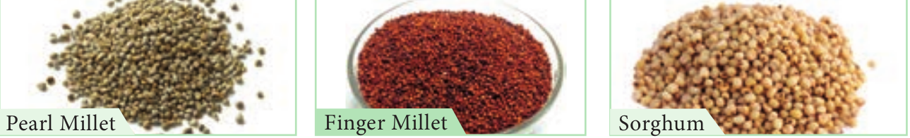

  
```hint { role="info"}
**Learning Objectives**

- Acquire knowledge about origin, area of cultivation and uses of various food yielding plants.
- Describe the different spices and condiments and their uses.
- Elicit the uses of fibre, timbers, paper and dye yielding plants.
- Acquire knowledge about the active principles, chemical composition and medicinal uses of plants.
- Develop skill of mushroom cultivation, knowledge of SCP production and sea weed liquid fertilizers
- Gains knowledge of organic farming- bio fertilisers and bio pest repellants.
- Learn to make terrarium and bonsai Acquires knowledge of cultivation of medicinal plants.
```

The land and water of the earth sustain a vast assemblage of plants upon which all other living forms are directly or indirectly dependent. Pre-historic humans lived on berries, tubers, herbage, and the wild game which they collected and hunted that occupied whole of their time. Domestication of plants and animals has led to the production of surplus food which formed the basis for civilizations. Early civilization in different parts of the world has domesticated different species of plants for various purposes. Based on their utility, the economically useful plants are classified into food plants, fodder plants, fibre plants, timber plants, medicinal plants, and plants used in paper industries, dyes and cosmetics. Selected examples of economically important plants for each category are discussed in this chapter.

## Food plants
Currently about 10,000 food plants are being used of which only around 1,500 species were brought under cultivation. However, food base of majority of the population depends only on three grass species namely rice, wheat and maize.

### Cereals
The word cereal is derived from Ceres, which according to the Roman mythology denotes “Goddess of agriculture”. All cereals are members of grass family (Poaceae) that are grown for their edible starchy seeds. The prominence of cereals as food plants is due to the following attributes:

- Greater adaptability and successful colonisation on every type of habitat.
- The relative ease of cultivation
- Tillering property that produce more branches which results in higher yield per unit area.
- Compact and dry grains that they can be easily handled, transported and stored without undergoing spoilage.
- High caloric value that provides energy. 
  
The nutrients provided by cereals include carbohydrates, proteins, fibres and a wide range of vitamins and minerals. Cereals can be classified into two different types based on their size namely Major Cereals and Minor Cereals.

#### Major Cereals 


**Rice / Paddy** 
Botanical name : _Oryza sativa_

Paddy is a semi-aquatic crop and is grown in standing water. It is an important food crop of the world, occupying the second position in terms of area under cultivation and production, next to wheat. Rice is the chief source of carbohydrate. 
**Origin and Area of cultivation**
South East Asia is considered as the center of origin of rice. Earliest evidences of rice cultivation have been found in China, India and Thailand. It is mainly cultivated in Delta and irrigated regions of Tamil Nadu. 
**Uses** 
Rice is the easily digestible calorie rich cereal food which is used as a staple food in Southern and North East India. Various rice products such as **Flaked rice** (Aval), **Puffed rice** / **parched rice** (Pori) are used as breakfast cereal or as snack food in different parts of India. 

**Rice bran oil** obtained from the rice bran is used in culinary and industrial purposes. 

**Husks** are used as fuel, and in the manufacture of packing material and fertilizer.

```hint { role="warn"}
**International Rice Research Institute (IRRI)** 

International Rice Research Institute (IRRI) is located in Los Banos, Manila the capital city of Philippines. This is the only institute in the world which exclusively carries out research as on rice. IRRI aims to improve livelihoods and nutrition, abolishing poverty, hunger, and malnutrition. Whatever IR rice varieties available in the world are developed through rice breeding programme and released by IRRI. Till date IRRI has produced 843 rice varieties that have been released in 77 countries. IR8 is a high-yielding semi-dwarf rice variety developed by IRRI in the early 1960s and it is called as miracle rice, much celebrated for fighting famine. Another variety to mention is IR36 which is a semi-dwarf variety that proved highly resistant to a number of insect pests and diseases that raised farmers’ rice yields and brought down the prices of the staple food in Asian families. The International Rice Gene bank of IRRI has a collection of more than 117 000 types of rice, comprising of modern and traditional varieties including wild relatives of Paddy.
```

**Wheat** 
Botanical name : _Triticum aestivum_

**Origin and Area of cultivation**
Earliest evidence for wheat cultivation comes from Fertile Crescent region. The common cultivated wheat, _Triticum aestivum_ is cultivated for about 7,500 years. Wheat is mostly cultivated in the North Indian states such as Uttar Pradesh, Punjab, Haryana, Rajasthan, Madhya Pradesh and Bihar.

**Uses** 
Wheat is the staple food in Northern India. Wheat flour is suitable to make bread and other bakery products. Processed wheat flour, that has little fibre, is called Maida which is used extensively in making parota, naan and bakery products. Malted wheat is a major raw material for producing alcoholic beverages and nutritive drinks.

**Maize / Corn** 
Botanical name : _Zea mays_

**Origin and Area of cultivation**
Maize is the only cereal that has originated and domesticated from the New World. Madhya Pradesh, Himachal Pradesh and Punjab are the major maize producing states of India.Whereas Perambalur, Ariyalur, Cuddalore, Dindigul and Tirupur are the major maize growing belts in Tamil Nadu.

```hint { role="warn"}
**Why do popcorn pops?** 


Endosperm in corn consists of two type namely soft and hard. In popcorn soft endosperm constitutes most part of the grain surrounded by thin layer of hard endosperm. When heated, the internal starch and protein are converted into gelatinous substances and when pressure mount further, the soft endosperm expands and explodes reversing the grain and the gelatinous starch are converted into foam, which readily solidifies outside and convert into crispy, tasty popcorn.  
```

**Uses** Most of the corn produced is used as fodder than food. Corn syrup is used in the manufacture of infant foods. Corn is a raw material in the industrial production of alcohol and alcoholic beverages.

```hint { role="warn"}
**PSEUDO-CEREAL** 


The term pseudo-cereal is used to describe foods that are prepared and eaten as a whole grain, but are botanical outliers from grasses. Example: **quinoa**. It is actually a seed from the _Chenopodium quinoa_ plant belongs to the family Amaranthaceae. It is a gluten-free, whole-grain carbohydrate, as well as a whole protein (meaning it contains all nine essential amino acids) and have been eaten for 6,000 years in Andes hill region.
```

### Millets (Siru Thaniyangal)
The term millet is applied to a variety of very small seeds originally cultivated by ancient people in Africa and Asia. They are gluten free and have less glycemic index.



**Pearl Millet** 
Botanical name: _Pennisetum americanum_

It is one of the millets introduced in India and Africa. Pearl Millet is rich in fibre, iron and minerals, stable food grain in many parts of India, especially in Gujarat and Rajasthan.

**Uses** It is commonly used to make flat bread, gluten free cereal based products, porridge (Kambang koozh), biscuits, pasta and non- dairy probiotic beverages.

**Finger Millet – Ragi** 
Botanical name : _Eleusine coracana_ Finger millet is the crop of early introduction from East Africa into India. Ragi is rich in calcium. **Uses** It is used as a staple food in many southern hilly regions of India. Ragi grains are made into porridge and gruel. Ragi malt is the popular nutrient drink. It is used as a source of fermented beverages.

**Sorghum** 
Botanical name : _Sorghum vulgare_ Sorghum is native to Africa. It is one of the major millets in the world and is rich in calcium and iron.

**Uses** It is fed to poultry, birds, pigs and cattle and a source of fermented alcoholic beverage

### Minor Millets 


**Little Millet** 
Botanical name- _Panicum sumatrense_ 

This is one of the oldest millets and is native to India. The species name is based on a specimen collected from Sumatra. It is rich in iron and fibre than rice that makes it best for diabetes. 

**Uses**
It is cooked like rice and also milled and baked. It cures anaemic condition, constipation and other gastrological problems.

**Foxtail Millet**
Botanical name : _Setaria italica_ 

This is one of the oldest millet used traditionally in India. Which is domesticated first in China about 6000 years. Rich in protein, carbohydrate, vitamin B and C, Potassium and Calcium. 

**Uses**
It supports in strengthening of heart and improves eye sight. Thinai porridge is given to lactating mother.

**Kodo Millet** 
Botanical name : _Paspalum scrobiculatum_ 

Kodo millet is originated from West Africa, which is rich in fibre, protein and minerals. 

**Uses** 

Kodo millet is ground into flour and used to make pudding. Good diuretic and cures constipation. Helps to reduce obesity, blood sugar and blood pressure.

### Pulses
The word Pulse is derived from the Latin words ‘puls’ or ‘pultis’ meaning “thick soup”. Pulses are the edible seeds that are harvested from the fruits of Fabaceae. They provide vital source of plant-based protein, vitamins and minerals for people around the globe.


**Black gram** 
Botanical name : _Vigna mungo_ 

**Origin and Area of cultivation**
Black gram is native to India. Earliest archeobotanical evidences record the presence of black gram about 3,500 years ago. It is cultivated as a rain fed crop in drier parts of India. India contributes to 80% of the global production of black gram. Important states growing black gram in India are Uttar Pradesh, Chattisgarh and Karnataka.

**Uses** 

Black gram is eaten whole or split, boiled or roasted or ground into flour. Black gram batter is a major ingredients for the preparation of popular Southern Indian breakfast dishes. Split pulse is used in seasoning Indian curries.

**Red gram / Pigeon pea** 
Botanical name : _Cajanus cajan_ 

**Origin and Area of cultivation:** 
It is the only pulse native to Southern India. It is mainly grown in the states of Maharashtra, Andhra Pradesh, Madhya Pradesh, Karnataka and Gujarat.

**Uses** 

Red gram is a major ingredient of sambar, a characteristic dish of Southern India. Roasted seeds are consumed either salted or unsalted as a popular snack. Young pods are cooked and consumed.

**Green gram** 
Botanical name : _Vigna radiata_ 

**Origin and Area of cultivation**
Green gram is a native of India and the earliest archaeological evidences are found in the state of Maharashtra. It is cultivated in the states of Madhya Pradesh, Karnataka and Tamil Nadu. 

**Uses** 

It can be used as roasted cooked and sprouted pulse. Green gram is one of the ingredients of pongal, a popular breakfast dish in Tamil Nadu. Fried dehulled and broken or whole green gram is used as popular snack. The flour is traditionally used as a cosmetic, especially for the skin.

**Chick pea / Bengal gram** 
Botanical name : _Cicer arietinum_ 

**Origin and Area of cultivation:** 
It has originated in West Asia and was known in cultivation for more than 4,000 years in India. It is mainly grown in the states of Madhya Pradesh, Uttar Pradesh and Rajasthan. 

**Uses** 
Chick pea protein is rated high in terms of amino acid content and digestibility. Infant food formulae uses malted chick pea as an ingredient. Chick pea seed flour is a prime constituent of many forms of Indian confectionary. Roasted and salted, whole or split gram forms the popular snacks of middle class.

### Vegetables
While walking through a market filled with fresh vegetables like stacks of lady’s finger, mountains of potatoes, pyramids of brinjal, tomatoes, cucurbits, we learn to choose the vegetables that is fresh, tender, ripe and those suit the family taste through experience and cultural practices. Why do we need to eat vegetables and what do they provide us?

Vegetables are the important part of healthy eating and provide many nutrients, including potassium, fiber, folic acid and vitamins A, E and C. The nutrients in vegetables are vital for maintenance of our health.


**Potato** 
Botanical name : _Solanum tuberosum_ 
Family: Solanaceae


**Origin and Area of cultivation**
Potato has originated from the highlands of Peru and Bolivia. It is cultivated in Uttar Pradesh, West Bengal and Bihar are the major potato cultivating states of India. Nilgiri and Palani hills also contribute to the potato cultivation in Southern Indian hills.

**Uses** 
Potato tubers are used in a variety of ways like boiled, steamed, fried, baked, roasted or as an ingredient in soup, stews, pies and other dishes. It is the major raw material for the chips industry, brewing industry and in the manufacture of products used for microbiological and clinical applications.

**Lady’s finger / Okra** 
Botanical name : _Abelmoschus esculentus_ 
Family: Malvaceae 

**Origin and Area of cultivation**
Lady’s finger is a native of the Tropical Africa. Assam, Maharashtra and Gujarat are the important states where Lady’s finger is grown in abundance. Coimbatore, Dharmapuri and Vellore are the major cultivating regions of Tamil Nadu.

**Uses** 

The fresh and green tender fruits are used as a vegetable. Often they are sliced and dehydrated to conserve them for later use. It has most important nutrients.

**Cucumber** 
Botanical name : _Cucumis sativus_ 
**Family: Cucurbitaceae** 

The cucurbits are the vining plants of the family Cucurbitaceae, which include cucumbers, squash, pumpkins, melons and gourds.

**Origin and Area of cultivation**
The cucumber is an important summer vegetable in all parts of India. It is originated in India. It has been cultivated for at least three thousand years. Cucumber is commonly cultivated throughout India.

**Uses** 
Depending on the species immature or mature fruit are consumed as fresh or cooked vegetables. It is used in the preparation of salad and pickle. Oil obtained from cucumber seed is good for the brain and the body and the kernels are used in confectionaries.

### Fruits
Edible fruits are fleshy structures with a pleasant aroma and flavours. Fruits are sources of many nutrients including potassium, dietary fiber, folic acid and vitamins.Depending on the climatic region in which fruit crops grow, they can be classified into temperate(apple, pear, plum) and tropical fruits (mango, jack, banana). In this chapter we will study some examples of tropical fruits.

**Mango** (National fruit of India) 

Botanical name : _Mangifera indica_ 
Family: Anacardiaceae


**Origin and Area of cultivation**
The mango is the native to Southern Asia, especially Burma and Eastern India. It is the National fruit of India. Major mango producing States are Andhra Pradesh, Bihar, Gujarat and Karnataka. Salem, Krishnagiri, Dharmapuri are the major mango producing districts of Tamil Nadu. Some of the major cultivars of mango in India are Alphonsa, Banganapalli, neelam and malgova.

**Uses** 
Mango is the major table fruit of India, which is rich in beta carotenes. It is utilized in many ways, as dessert, canned, dried and preserves in Indian cuisine. Sour, unripe mangoes are used in chutneys, pickles, side dishes, or may be eaten raw with salt and chili. Mango pulp is made into jelly. Aerated and non-aerated fruit juice is a popular soft drink.


**Banana** 
Botanical name : _Musa_ x _paradisiaca_ 
Family: Musaceae 


**Origin and Area of cultivation**
Bananas were domesticated in South East Asia. Tamil Nadu is the world’s No. 1 banana producer. Theni, Trichy, Erode, Thoothukudi, Coimbatore, Kanyakumari, Thanjavur and Dindigul are the prominent regions in Tamil Nadu where the crop is being cultivated. Major cultivars of banana are Chevazhai, Nentheran, Karpooravalli, Poovan and Peyan.

**Uses** 
The banana fruit is loaded with potassium and essential vitamins, which can be eaten raw or cooked (deep fried, dehydrated, baked or steamed). The fruit can be processed into flour and can be fermented for the production of beverages such as banana juice, beer, vinegar and vine.

**Jack fruit** (State fruit of Tamil Nadu) 

Botanical name : _Artocarpus heterophyllus_ 
Family: Moraceae


**Origin and Area of cultivation**
The jackfruit has originated in the Western Ghats of India and it is the state fruit of Tamil Nadu. The major Jack fruit cultivating areas of Tamil Nadu are Cuddalore, Kanyakumari, Dindigul, Pudukottai, Namakkal, Tirunelveli and Nilgiris. Panruti and Coimbatore districts are the major marketing centres.

**Uses** The fruit can be eaten raw or cooked. Unripe flake slices are deep-fried to make crispy chips. The seeds are either boiled or roasted and eaten. Unripe fruits are used as vegetables.

|CommonName |Tamil Name |Botanical name |Family |Edible part |
|------|------|------|------|------|
|Guava |கொய்யா |Psidium guajava |Myrtaceae |Mesocarp and Endocarp |
|Papaya |பப்பாளி |Carica papaya |Caricaceae |Mesocarp |
|Pomegranate | மாதுளை |Punica granatum |Punicaceae |Aril |
|Fig | அத்தி |Ficus carica |Moraceae |Fleshy receptacle |
|Date Palm | பேரிச்சம் |Phoenix dactylifera |Arecaceae |Pericarp |


### Nuts
Nuts are simple dry fruits composed of a hard shell and an edible kernel. They are packed with a good source of healthy fats, fibre, protein, vitamins, minerals and antioxidants. Some of the important nuts are discussed below.


**Cashew nut** 
Botanical name : _Anacardium occidentale_ 
Family: Anacardiaceae

**Origin and Area of cultivation**
Cashew has originated in Brazil and made its way to India in the 16th century through Portuguese sailors. Cashew is grown in Kerala, Karnataka, Goa, Maharashtra, Tamil Nadu, and Orissa.

**Uses** Cashews are commonly used for garnishing sweets or curries, or ground into a paste that forms a base of sauces for curries or some sweets. Roasted and raw kernels are used as snacks.

**Almond** 
Botanical name : _Prunus dulcis_ 
Family: Rosaceae 

**Origin and Area of cultivation**
Almond is a tree native to Mediterranean regions of the Middle East. Almond is cultivated in Kashmir, Himachal Pradesh and Uttar Pradesh. 

**Uses** 
Almonds are often eaten raw or roasted and are available as whole, sliced (flaked), and as flour. Almond oil is made into almond butter or almond milk, which are used in sweet and savoury dishes. Almond helps in promoting HDL (High Density Lipids)

### Sugars


We experienced sweetness while eating the stems of sugarcane, roots of sugar beet, fruits of apple and while drinking palmyra sap. This is due to the different proportions of sugars found in it. Sugar is the generic name for sweet tasting soluble carbohydrate, which are used in foods and beverages. Sugars found in sugarcane and palmyra make them ideal for efficient extraction to make commercial sugar.

**Sugarcane** 
Botanical name : Saccharum officinarum
Family : Poaceae

**Origin and Area of cultivation**
The cultivated Saccharum officinarum has evolved by repeated back crossing of _S.officinarum of New Guinea with wild S.spontaneum_ of India to improve the quality. All districts except Kanyakumari and Nilgiris of Tamil Nadu cultivate Sugarcane. 

**Uses** 
Sugar cane is the raw material for extracting white sugar. Sugarcane supports large number of industries like sugar mills producing refined sugars, distilleries producing liquor grade ethanol and millions of jaggery manufacturing units. Fresh sugarcane juice is a refreshing drink. Molasses is the raw material for the production of ethyl alcohol.

**Stevia /Sweet leaf** 
Botanical name : _Stevia rebaudiana_ Family: Asteraceae Stevia is a sweetener and a sugar substitute, extracted from the leaves of _Stevia rebaudiana._ It has no calories and is 200 times sweeter than sugar. The Steveocide is the chemical that is responsible for sweetness in Stevia.


**Origin and Area of cultivation**
Stevia is a native to Brazil and Paraguay. It is cultivated in the states of Himachal Pradesh, Gujarat and Tamil Nadu.

**Uses** 
This is the most popular natural sweetener and is a substitute for white sugar, hence it is extensively used by diabetic patients and health conscious people.

Palmyra tree and Palm Jaggery


**Palmyra** (State tree of Tamil Nadu) 

Botanical name : Borassus flabellifer 
Family: Arecaceae

**Origin and Area of cultivation**
Palmyra is native to tropical regions of Africa, Asia and New Guinea. Palmyra grows all over Tamil Nadu, especially in coastal districts. 

**Uses** 
Exudate from inflorescence axis is collected for preparing palm sugar. Inflorescence is tapped for its sap which is used as health drink. Sap is processed to get palm jaggery or fermented to give **toddy**. Endosperm is used as a refreshing summer food. Germinated seeds have an elongated embryo surrounded by fleshy scale leaf which is edible.

### Oil Seeds
Why fried foods are tastier than boiled foods? There are two kinds of oils namely, essential oils and vegetable oils or fatty oils. The essential oils or volatile oils which possess aroma evaporate or volatilize in contact with air. Any organ of a plant may be the source of essential oil. For example, flowers of Jasmine, fruits of orange and roots of ginger. The vegetable oils or non-volatile oils or fixed oils that do not evaporate. Whole seeds or endosperm form the sources of vegetable oils.


```goat
                           ┌──────────────────────┐
                           │                      │
                           │  Fatty Acids in Oil  │
                           │                      │
            ┌──────────────┴──────────────────────┴────────────┐
            │                                                  │
            │                                                  │
            │                                                  │
            │                                                  │
 ┌──────────▼────────┐                              ┌──────────▼─────────┐
 │  Saturated Fatty  │                              │ Unsaturated Fatty  │
 │  Acid (SFA)       │                              │ Acid (UFA)         │
 │                   │                              └──────────┬─────────┘
 └───────────────────┘                                         │
                                                               │
                                                               │
                                                               │
        ┌──────────────────────────────────────────────────────┤
        │                                                      │
        │                                                      │
        │                                                      │
        │                                                      │
┌───────▼───────────────┐                            ┌─────────▼───────────┐
│                       │                            │ Poly Unsaturated    │
│ Mono Unsaturated      │                            │ Fatty Acid          │
│ Fatty Acid            │                            │ (PUFA)              │
│ (MUFA)                │                            │ Liquid form in room │
│ Liquid form in        │                            │ temperature and     │
│ room temperature      │                            │ stay in liquid form │
│ but get solidified in │                            │ even when chilled.  │
│ low temperature.      │                            │ Example: Sunflower  │
│ Example: Coconut      │                            │ oil and Soybean oil │
│ oil                   │                            └─────────────────────┘
└───────────────────────┘
```
Gingelly oil and Rice bran oil are mixture of MUFA and PUFA  

Let us know about few oil seeds 
**Groundnut / Peanut** 

Botanical name : _Arachis hypogaea_ 
Family : Fabaceae 

**Origin and Area of Cultivation:** 

Groundnut is native of Brazil. Portuguese introduced groundnut into Africa. The Spanish took it to the South East Asia and India via Philippines. In India Gujarat, Andhra Pradesh and Rajasthan are top producers. 

**Uses** 
Nuts contain about 45% oil. The kernels are also rich sources of phosphorous and vitamins, particularly thiamine, riboflavin and niacin. It is premium cooking oil because it does not smoke. Lower grade oil is used in manufacture of soaps and lubricants.

**Sesame / Gingelly** 
Botanical name : _Sesamum indicum_ 
Family : Pedaliaceae 

**Origin and Area of cultivation:** 
_Sesamum_ _indicum_ has originated from Africa.. Sesame is cultivated as a dry land crop. West Bengal and Madhya Pradesh are the top producers in India during 2017-18. It is considered as a healthy oil in Southern Indian culture. 

**Uses** 
Sesame oil is used for mostly culinary purposes in India. Lower grades are used in manufacture of soaps, in paint industries, as a lubricant and as an illuminant. In India, the oil is the basis of most of the scented oils used in perfumes. Sesame seed snacks are popular throughout India.

**Coconut** 
Botanical name : _Cocos nucifera_ 
Family : Arecaceae

**Origin and Area of cultivation:**

The origin of coconut is Pacific island region. Kerala and Tamil Nadu are the leading producers in India.

**Uses** 
Coconut oil is classified as edible-industrial oil. Soaps obtained from coconut oil lathers well in soft and hard water. It is used in manufacture of rubber, synthetic resins, lubricants, brake fluids for aeroplanes and detergents. It is used as major hair oil and a base for applying medicinal powders.

### Beverages 
How about a cup of coffee or tea? We always entertain our guests with this offer. Children exchange chocolates during their birthdays.** All non-alcoholic beverages contain alkaloids that stimulate central nervous system and also possess mild diuretic properties. In this part of chapter, we learn about three popular non- alcoholic beverages namely tea, coffee and cocoa. 


**Tea** 
Botanical name : _Camellia sinensis_ 
Family : Theaceae 

**Origin and Area of cultivation:** 

Tea is native of China.Assam is the top tea producer in India, followed by Kerala and Tamil Nadu. 

**Uses**
Tea is the most popular beverage among all sections of people in India. Regular consumption of green tea is believed to lowers the bad cholesterol and increases the good cholesterol.

**Coffee** 
Botanical name : Coffea arabica 
Family : Rubiaceae

Why does a student or a driver prefer tea or coffee during night work? **Origin and Area of cultivation:**
Coffea arabica is the prime source of commercial coffee which is native to the tropical Ethiopia An Indian Muslim saint, Baba Budan introduced coffee from Yemen to Mysore.Karnataka is the largest coffee producing state in India followed by Tamil Nadu and Kerala. Tamil Nadu is the largest consumer of coffee in India. 

**Uses** 

Drinking coffee in moderation provides the following health benefits:

Caffeine enhances release of acetylcholine in brain, which in turn enhances efficiency. It can lower the incidence of fatty liver diseases, cirrhosis and cancer. It may reduce the risk of type 2 diabetes.

**Cocoa** 
Botanical name: Theobroma cacao Family : Malvaceae 

**Origin and Area of cultivation:** 
Cocoa is native of Tropical American region. The word Theobroma (Theos means god, broma means food) means ‘food of the Gods’. Kerala is the largest producer of Cocoa in India followed by Karnataka. 

**Uses** 
Cocoa is mainly used in confectionaries and forms an important ingredient in nutritive drinks. Cocoa products are rich in fibres, minerals and antioxidants, thus preventing cancer, cardiovascular diseases, premature ageing.

## Spices and Condiments 
“Aroma attracts everyone” 

**History:**
Spices were used extensively throughout the world for several thousands of years. Records of use of garlic and onion dates back 2500 years.

Majority of the spices are native to Mediterranean region, India and South East Asian countries. Spices, especially pepper triggered the search for sea route to India and paved way for the exploratory voyages by Spanish and Portuguese.

Spices are accessory foods mainly used for flavouring during food preparation to improve their palatability. Spices are aromatic plant products and are characterized by sweet or bitter taste. Spices are added in minimal quantities during the cooking process. For example black pepper.

Condiments, on the other hand, are flavouring substances having a sharp taste and are usually added to food after cooking. For example, curry leaves.

The following spices and condiment are discussed in detail.

**Spices** 
Cardamom 
Botanical name : _Elettaria cardamomum_ 
Family : Zingiberaceae 

**Origin and Area of cultivation:** 
It is indigenous to Southern India and Sri Lanka. Cardamom is called as “Queen of Spices”. In India it is one of the main cash crops cultivated in the Western Ghats, and North Eastern India


**Uses** 
The seeds have a pleasing aroma and a characteristic warm, slightly pungent taste. It is used for flavouring confectionaries, bakery products and beverages. The seeds are used in the preparation of curry powder, pickles and cakes. Medicinally, it is employed as a stimulant and carminative. It is also chewed as a mouth freshener.

**Black Pepper** 
Botanical name : _Piper nigrum_ 
Family : Piperaceae 

**Origin and Area of cultivation:** 
It is indigenous to Western Ghats of India. Pepper is one of the most important Indian spices referred to as the “King of Spices” and also termed as “Black Gold of India”. Kerala, Karnataka and Tamil Nadu are the top producers in India.

The characteristic pungency of the pepper is due to the presence of alkaloid Piperine. There are two types of pepper available in the market namely black and white pepper. 

**Uses** It is used for flavouring in the preparation of sauces, soups, curry powder and pickles. It is used in medicine as an aromatic stimulant for enhancing salivary and gastric secretions and also as a stomachic. Pepper also enhances the bio-absorption of medicines.


| S. No |C ommon Name |Tamil Name |Botanical Name |Family |
|------|------|------|------|------|
| 1 |Coriander |க�ொÚ« மà‡ |Coriandrum sativum. L |Apiaceae |
| 2 |Cumin |ர �Ý |Cuminum cyminum. L |Apiaceae |
| 3 |Fenugreek |கெநE ்Ý |Trigonella foenum graecum. L |Fabaceae |
| 4 |Cloves |இல ெங�Ý |Eugenia aromaticum |Myrtaceae |
| 5 |Asafoetidia |கப ±ங �ொ் Ý |Ferula asafoetida.L |Umbelliferae (Apiaceae) |
| 6 |Onion |கெங �ொ் Ý |Allium cepa |Amarillidaceae |

**Turmeric** 
Botanical name : _Curcuma longa_ 
Family : Zingiberaceae 

**Origin and Area of cultivation:** 
It is indigenous to Southern Asia India is the largest producer, consumer and exporter of turmeric. Erode in Tamil Nadu is the World’s largest wholesale turmeric market. 

**Uses** 

Turmeric is one of the most important and ancient Indian spices and used traditionally over thousands of years for culinary, cosmetic, dyeing and for medicinal purposes. It is an important constituent of curry powders. Turmeric is used as a colouring agent in pharmacy, confectionery and food industry. Rice coloured with turmeric (yellow) is considered sacred and auspicious which is used in ceremonies. It is also used for dyeing leather, fibre, paper and toys.

Curcumin extracted from turmeric is responsible for the yellow colour. Curcumin is a very good anti-oxidant which may help fight various kinds of cancer. It has anti-inflammatory, anti-diabetic, anti-bacterial, anti-fungal and anti- viral activities. It stops platelets from clotting in arteries, which leads to heart attack.

**Chillies / Red Pepper** 
Botanical name : _Capsicum annuum, C. frutescens_. 
Family : Solanaceae 

**Origin and Area of cultivation:** 
Capsicum is native to South America and is popularly known as chillies or red pepper in English. India is leading producer and exporter. _C. annuum_ and _C. frutescens_ are important cultivated species of chillies. 

**Uses** 
The fruits of C.annuum are less pungent than thefruits of _C.frutescens_. _C.annum_ includes large, sweet bell peppers. Long fruit cultivars of this species are commercially known as ‘Cayenne pepper’ which are crushed, powdered and used as condiment. Chillies are used in manufacture of sauces, curry powders and preparation of pickles. Capsaicin is an active component of chillies. It has pain relieving properties and used in pain relieving balms. Chillies are a good source of Vitamin C, A and E.

```hint {role="warn"}
Capsaicin is responsible for the pungency or spicy taste of chillies. Pungency of Chillies is measured in Scoville Heat Units (SHU). World’s hottest chilli, Carolina reaper pepper measures 2,200,000 SHU. Naga viper chilli is the hottest in India that measures 1,349,000 SHU. Commonly used cayenne pepper measures 30,000 to 50,000 SHU.
```

**Condiment** 
**Tamarind** 
Botanical name :_Tamarindus indica_ 
Family : Fabaceae-Caesalpinioideae 


**Origin and Area of cultivation:** 
Tamarind is native of tropical African region and was introduced into India several thousand years before. It is cultivated in India, Myanmar, south asian countries and several African and Central American countries.


  

Tamarind has long been used in Africa and in Southern Asia. The name tamarindus is of Arabian origin, which means “dates of India”. (tamar – dates; Indus – India). 

**Uses** 

It is used in flavouring sauces in the United States and Mexico. In India, the fruit pulp is major ingredients for many culinary preparations. Sweet tamarinds are sold as table fruits in India imported from Thailand and Malaysia.

```hint {role="warn"}
**Sambar – The World Inside** 

When we see the bowl of sambar, we can see the world inside. Mustard, Cumin and Coriander from Mediterranean, pepper from Western Ghats of India, turmeric from Southern Asia, chilly from South America, onion from Afganisthan, tamarind from Tropical Africa, tomato from South America, potato from Peru and Bolivia, lady’s-finger from Africa, and redgram from South India make the Sambar as a global dish.
```

## Fibres
Botanically a fiber is a long narrow and thick- walled cell. Plant fibres are classified according to their use (Table 10.3)

| S. No |Types of Fibre |Uses |Example |
|------|------|------|------|
| 1 |Textile Fibre |Manufacture of fabrics, netting and cordage. |Cotton, hemp, jute. |
| 2 |Brush Fibre |Making brushes andbrooms. |Palm bres and brooms. |
| 3 |Plaiting Fibre |Making hats, baskets, furniture. |Cane, Vitex and Lantana. |
| 4 |Filling Fibre |Stung pillows, cushions and beds. |Silk cotton, Calotropis. |

**Cotton** 
Botanical name : _Gossypium_ spp. Family : Malvaceae Cotton is the world’s most important non- food commercial crop. 

**Origin and Area of cultivation:** 

It is one of the oldest cultivated crops of the world. It has been cultivated for about 8000 years both in new world and in old world. Commercial cotton comes from four cotton species: two from the new world and two from the old world. (1) _G. hirsutum_ (2) _G.barbadense_ are the New world species and (3) _G. arboretum_ (4) _G. herbaceum_ are the old world species. In India cotton is cultivated in Gujarat, Maharashtra, Andhra Pradesh and Tamil Nadu. 

**Uses**
It is mainly used in the manufacturing of various textile, hosiery products, toys and is also used in hospitals.

**Jute** 
Botanical name : _Corchorus_ spp. 
Family : Malvaceae 

**Origin and Area of cultivation:** 

Jute is derived from the two cultivated species (1) _Corchorus capsularis_ and (2) _C.olitorius_ is of African origin whereas _C. capsularis,_ is believed to be Indo-Burmese origin. It is an important cultivated commercial crop in Gangetic plains of India and Bangladesh. 

**Uses**
It is one of the largest exported fibre material of India. The jute industry occupies an important place in the national economy of India. Jute is used for ‘safe’ packaging in view of being natural, renewable, bio-degradable and eco-friendly product. It is used in bagging and wrapping textile. About 75% of the jute produced is used for manufacturing sacks and bags. It is also used in manufacture of blankets, rags, curtains etc. It is also being used as a textile fibre in recent years.


**Coconut / Coir** 
Botanical name : _Cocos nucifera_ Family : Arecaceae Commercial coir is obtained from the mesocarp of coconut. The fibre is known for its light mass, elasticity, high resistance to sea water and for its insulating capacity. 

**Origin and Area of cultivation:** 
We have already studied the origin of Coconut under the oil crops. India and Sri Lanka are the top producers since 2001. Kerala and Tamil Nadu are the top producers in India. 

**Uses** 
It is used in manufacture of mats, cushion seats, bags, packaging material, water-proof and sound proof boards and thermal insulation. Using coir peat in horticulture also made demand for coir. It is also used for manufacturing ecofriendly horticultural products such as biodegradable planting pots.

## Timber
The basic need of shelter is obtained from the timber trees. In this lesson we learn about few timber plants.


**Teak** 
Botanical name : _Tectona grandis_ 
Family: Lamiaceae


RosewoodTeak wood carving

Cotton plant Jute products **Figure 10.1**  

**Origin and Area of cultivation: This is native** to South east Asia. It is observed wild in Assam. But cultivated in Bengal, Assam, Kerala, Tamil Nadu and North-West India. **Uses** It is one of best timbers of the world. The heartwood is golden yellow to golden brown when freshly sawn, turning darker when exposed to light. Known for its durability as it is immune to the attack of termites and fungi.

The wood does not split or crack and is a carpenter friendly wood. It was the chief railway carriage and wagon wood in India. Ship building and bridge-building depends on teakwood. It is also used in making boats, toys, plywood, door frames and doors.

**Rosewood** 
Botanical name : _Dalbergia latifolia_ 
Family: Fabaceae 

**Origin and Area of cultivation:** 
Rose wood is native to India It is cultivated in Uttar Pradesh, Bihar, Odisha, Central, Western and Southern India. 

**Uses** 
Indian rosewood has yellowish sapwood and dull brown to almost purple coloured heartwood. The wood is characterised by fragrant, heavy, narrowly interlocked grained and medium coarse textured. It is a durable and heavy wood and is suitable for under water use. Wood is used for making furniture, army wagons, temple chariots, cabinets, railway sleepers, musical instruments, hammer handles, shoe heels and tobacco pipes.


**Ebony** 
Botanical name : _Diospyros ebenum_ 
Family: Ebenaceae 

**Origin and Area of cultivation:** 
It is commonly found in tropical forests Southern India and Srilanka. Ebony is distributed in forests of Karnataka, Kerala and Tamil Nadu. 

**Uses** 
The heartwood is jet black with a metallic lustre when smoothened and is resistant to attack by insects and fungi. The wood is difficult to season and hence cut into small pieces before seasoning It is used mainly for making piano keys, handles of cutlery, musical instruments, making sticks, umbrella handles, whips and furniture.

## Latex 
Rubber 

Botanical name : _Hevea brasiliensis_ 
Family : Euphorbiaceae 


**Origin and Area of cultivation:** 
It is a native of Brazil and was introduced outside its native range during the colonial period and has become an important cash crop. Asia contributed 90% of the world production. Kerala is the largest producer in India followed by Tamil Nadu. 

**Uses**
Tyre and other automobile parts manufacturing industries consume 70% of the rubber production. Rubber is used in manufacturing footwear, wire and cable insulations, rain- coats, household and hospital goods, shock absorbers, belts, sports goods, erasers, adhesives, and rubber-bands Hard rubber is used in the electrical and radio engineering industries Concentrated latex is used for making gloves, balloons and condoms.

Foamed latex is used in the manufacture of cushions, pillows and life-belts.

```hint { role="warn" }
**Rubber – Vulcanization** 
Charles Goodyear invented vulcanization in 1839. He found that the defects in rubber articles could be overcome by heating rubber with sulphur under pressure at 1500 C. The process was called vulcanization. The name was given from the Roman God of Fire, Vulcan. Because of this, solid rubber tyres were used for first time in 1867. That is why we smoothly travel on road.
```

## Pulp Wood


The term paper is derived from the word ‘papyrus’ a plant (_Cyperus papyrus_) that was used by Egyptians to make paper-like materials. Paper production is a Chinese invention. The Chinese discovered the paper that was prepared from the inner bark of paper mulberry in 105 A.D. For a long time, the art of paper making remained a monopoly of the Chinese until Arabs learned the technique and improved it around 750 A.D. Invention of printing increased the demand for paper. 

**Manufacture of Wood pulp:**
Wood is converted into pulp by mechanical, and chemical processes. Wood of Melia azadirachta, _Neolamarkia_ _chinensis_, _Casuarina_ spp, _Eucalyptus_ spp are used for making paper pulp.

```hint {role="warn"}
Purified dissolving pulp is used as a basic material in the manufacture of rayon or artificial silk, fabrics,transparent films (cellophane, cellulose acetate films), plastics. The viscose process of making rayon is the most common process.
```

## Dyes
The ability to perceive colour is a wonderful aspect of human eyes and dyes add colour to the goods we use. They have been in use since the ancient times.

The earliest authentic records of dyeing were found in the tomb painting of ancient Egypt. Colourings on mummy cements (wrapping) included saffron and indigo. They can also be seen in rock paintings in India.

**Indigo** 
Botanical name : _Indigofera_ 
Family : Fabaceae 

**Origin and Area of cultivation:** 
Indigofera tinctoria is native to India. It was grown in many states in India. Now it is grown limited states mainly in Tamil Nadu and Andhra Pradesh. 

**Uses** 
A brilliant dark blue dye ‘indigo’ was extracted from the leaves of several species of Indigofera. The people of Asia, especially India have known the dye for over 4,000 years. It is also used in painting of murals. Indigofera have long been used in Southern India in temple arts and folk arts, popularly known as Kalamkari. Indigo used for dyeing and printing cotton, rayon and wool.

**Henna** 
Botanical name : _Lawsonia inermis_ 
Family : Lythraceae 


**Origin and Area of cultivation:** 
It is indigenous to North Africa and South-west Asia. It is grown mostly throughout India, especially in Gujarat, Madya Pradesh and Rajasthan.


**Uses** 

An orange dye ‘Henna’ is obtained from the leaves and young shoots of Lawsonia inermis. The principal colouring matter of leaves ‘lacosone” is harmless and causes no irritation to the skin. This dye has long been used to dye skin, hair and finger nails. It is used for colouring leather, for the tails of horses and in hair-dyes.

**Champaran Satyagraha** _Indigofera_ is a very important cash crop among plants cultivated in India during the British regime. Farmers were forced to cultivate _Indigofera_ instead of food crops. Gandhi started satyagraha at Champaran, a village in Bihar in support of farmers. This was the first satyagraha in India by Gandhi. Government accepted ‘champaran farmers bill’. Gandhi’s first satyagraha in India achieved a great success.

## Cosmetics
Traditionally in Southern India, people have been using turmeric, green gram powder, henna, sigaikai and usilai for their skin and hair care. These were mostly home prepared products that are used for grooming. Today, cosmetics have a high commercial value and have become chemical based industrial products. Providing personal care services has become a major industry. In recent years, people have realized the hazards of chemical- based cosmetics and are turning back to natural products. In this chapter one of the major plants namely Aloe which is used in the cosmetic industries is discussed.

**Aloe** 
Botanical name : _Aloe vera_ 
Family: Asphodelaceae (formerly Liliaceae) 

**Origin and Area of cultivation:** 
It is a native of Sudan. It is cultivated on a large scale in Rajasthan, Gujarat, Maharashtra, Andhra Pradesh and Tamil Nadu. 

**Uses** 
‘Aloin’ (a mixture of glucosides) and its gel are used as skin tonic. It has a cooling effect and moisturizing characteristics and hence used in preparation of creams, lotions, shampoos, shaving creams, after shave lotions and allied products. It is used in gerontological applications for rejuvenation of aging skin. Products prepared from aloe leaves have multiple properties such as emollient, antibacterial, antioxidant, antifungal and antiseptic. Aloe vera gel is used in skin care cosmetics.

### Perfumes
The word perfume is derived from the Latin word **Per** (through) and **fumus
(to smoke), meaning **through smoke**. It refers to the age-old tradition of burning scented woods at religious ceremonies.In early days, when people were less conscious of personal hygiene, essential oils not only masked offensive odours, but also may have acted as antiseptics. Perfumes are added to baths and used for anointing the body.

Perfumes are manufactured from essential oil which are **volatile** and **aromatic**. Essential oils are found at different parts of the plant such as leaves, (curry leaf, mint), flowers (rose, jasmine), fruits (citrus, straw berry) and wood (sandal, eucalyptus).


**Jasmine** 
Botanical name : Jasminum grandiflorum 
Family: Oleaceae 

Jasmine, as a floral perfume, ranks next to the rose oil. Major species cultivated on the commercial scale is Jasminum grandiflorum, a native of the north-western Himalayas. In Tamil Nadu, the major jasmine cultivation centres are Madurai and Thovalai of Kanyakumari District. The essential oil is present in the epidermal cells of the inner and outer surfaces of both the sepals and petals. One ton of Jasmine blossom yields about 2.5 to 3 kg of essential oil, comprising 0.25 to 3% of the weight of the fresh flower. 

**Uses** 
Jasmine flowers have been used since ancient times in India for worship, ceremonial purposes, incense and fumigants, as well as for making perfumed hair oils, cosmetics and soaps. Jasmine oil is an essential oil that is valued for its soothing, relaxing, antidepressant qualities.

Jasmine blends well with other perfumes. It is much used in modern perfumery and cosmetics and has become popular in air freshners, anti-perspirants, talcum powders, shampoos and deodorants.

**Madurai Malli** 

‘Madurai Malli’ is the pride of Madurai has a distinct reputation universally because of its uniqueness and has been given the Geographical Indications (GI) mark by the Geographical indication Registry of India. Madurai malli has thick petals with long stalk equal to that of petals and the distinct fragrance is due to the presence of chemicals such as jasmine and alpha terpineol. This makes it easy to distinguish Madurai Malli from other places. This is the second GI tag for Jasmine after ‘Mysore Malli’.

**Rose** 
Botanical name : _Rosa X damascena_ 
Family: Rosaceae 

**Origin and Area of cultivation:** 
R.X damascena, has its origin from the Middle East. Major scented rose cultivating states include Rajasthan, Delhi, Haryana, Maharashtra, West Bengal, Karnataka, Andhra Pradesh and Tamil Nadu. Rose oil is one of the oldest and most expensive of perfume oils. The oil is concentrated in the epidermal cells on the inner surface of the petals.The average oil yield is a little less than 0.5 g. from 1000 g. of flowers. 

**Uses** 
Rose oil is largely used in perfumes, scenting soaps, flavouring soft drinks, liqueurs and certain types of tobacco, particularly snuff of chewing tobacco.

Rose water (panneer) containing much of phenylethyl alcohol and other compounds in dissolved confectioneries syrups and soft drinks. In India, the water is much used in eye lotions and eye-washes. In addition, it is sprinkled on guests as a ceremonial welcome.

**Sandalwood** 
Botanical name : _Santalum album_ 
Family: Santalaceae 
**Origin and Area of cultivation:** 
Sandal tree is native of South East Asia. Karnataka and Tamil Nadu are states that possess large natural populations of Santalum album in India. The heart-wood is scented due to the presence of santalol, from which oil is extracted. The oil yield from a wood chips, varies from 4-5%

Jasmine Rose **Figure 10.20**  

being the highest when distilled from roots (10% of the dry weight). **Uses** Sandalwood oil is a valuable fixative for other fragrances due to the excellent blending properties. More than 90% of the oil is used in the manufacture of scented soaps, talcum powder, face powder, creams, hair oils, hand lotions as well as in perfumery and pharmaceutical industries.

## Traditional Systems of Medicines
India has a rich medicinal heritage. A number of Traditional Systems of Medicine (TSM) are practiced in India some of which come from outside India. TSM in India can be broadly classified into institutionalized or documented and **non-institutionalized
or oral traditions. Institutionalized Indian systems include Siddha and Ayurveda which are practiced for about two thousand years. These systems have prescribed texts in which the symptoms, disease diagnosis, drugs to cure, preparation of drugs, dosage and diet regimes, daily and seasonal regimens. Non- institutional systems, whereas, do not have such records and or practiced by rural and tribal peoples across India. The knowledge is mostly held in oral form. The TSM focus on healthy lifestyle and healthy diet for maintaining good health and disease reversal.

**Siddha system of medicine** Siddha is the most popular, widely practiced and culturally accepted system in Tamil Nadu. It is based on the texts written by 18 Siddhars. There are different opinions on the constitution of 18 Siddhars. The Siddhars are not only from Tamil Nadu, but have also come from other countries. The entire knowledge is documented in the form of poems in Tamil. Siddha is principally based on the **Pancabūta** philosophy. According to this system three humors namely **Vātam,** **Pittam** and **Kapam** that are responsible for the health of human beings and any disturbance in the equilibrium of these humors result in ill health. The drug sources of Siddha include plants, animal parts, marine products and minerals. This system specializes in using minerals for preparing drugs with the long shelf-life. This system uses about 800 herbs as source of drugs. Great stress is laid on disease prevention, health promotion, rejuvenation and cure.

**Ayurveda system of medicine** 
Ayurveda supposed to have originated from Brahma. The core knowledge is documented by **Charaka,** **Sushruta** and **Vagbhata** in compendiums written by them. This system is also based on three humor principles namely, Vatha, Pitha and Kapha which would exist in equilibrium for a healthy living. This system Uses more of herbs and few animal parts as drug sources. Plant sources include a good proportion of Himalayan plants. The **Ayurvedic** **Pharmacopoeia** of India lists about 500 plants used as source of drugs.

**Folk system of medicine** 
Folk systems survive as an oral tradition among innumerable rural and tribal communities of India. A consolidated study to document the plants used by ethnic communities was launched by the Ministry of Environment and Forests, Government of India in the form of All India Coordinated Research Project on Ethnobiology. As a result about 8000 plant species have been documented which are used for medicinal purposes. The efforts to document in several under-explored and unexplored pockets of India still continue. Major tribal communities in Tamil Nadu who are known for their medicinal knowledge include **Irulas, Malayalis, Kurumbas, Paliyans** and **Kaanis**. Some of the important medicinal plants are discussed below.

## Medicinal Plants
India is a treasure house of medicinal plants. They are linked to local heritage as well as to global-trade. All institutional systems in India primarily use medicinal plants as drug sources. At present, 90% collection of medicinal plants is from the non-cultivated sources. Growing demand for herbal products has led to quantum jump in volume of plant materials traded within and across the countries. Increasing demand exerts a heavy strain on the existing resources. Now efforts are being made to introduce cultivation techniques of medicinal plants to the farmers.

Medicinal plants play a significant role in providing primary health care services to rural and tribal people. They serve as therapeutic agents as well as important raw materials for the manufacture of traditional and modern medicines. Medicinally useful molecules obtained from plants that are marketed as drugs are called Biomedicines. Medicinal plants which are marketed as powders or in other modified forms are known as Botanical medicines. In this chapter you will be learning about a few medicinal plants that are commonly used in Tamil Nadu. All these plants are commonly available in and around dwelling places and can be easily cultivated in home gardens.

**Keezhanelli** 
Botanical name : _Phyllanthus amarus_ 
Family : Euphorbiaceae (Now in Phyllanthaceae)


**Origin and Area of cultivation:** 
The plant is a native of Tropical American region and is naturalised in India and other tropical countries. It is not cultivated and is collected from moist 
places in plains. _Phyllanthus maderspatensis_ is also commonly sold in the medicinal plant markets collected from non-forest are as keezhanelli. 

**Active principle:** Phyllanthin is the major chemical component. 

**Medicinal importance** _Phyllanthus_ is a well-known hepato-protective plant generally used in Tamil Nadu for the treatment of Jaundice. Research carried out by Dr. S P Thyagarajan and his team from University of Madras has scientifically proved that the extract of P. amarus is effective against hepatitis B virus.

**Adathodai** 
Botanical name : _Justicia adhatoda_ 
Family: Acanthaceae 

**Origin and Area of cultivation:** 

It is native to India and Srilanka. This species is not known in wild in Tamil Nadu but widely cultivated as a live fence and around temples. **Active principle:** Vascin 

**Uses** 

Adhatoda possess **broncho dilating** property. The decoction is used in treating many bronchial disorders such as cough,cold and asthma. It is also used in treating fevers. The extract forms an ingredient of cough syrups.

| S. No |Common Name |Tamil Name |Botanical Name |Family |Plantpart used |Medicinal Uses |
|------|------|------|------|------|------|------|
| 1 |Holy basil |«ைz |Ocimumsanctum |Lamiaceae |Leaves and Roots |e le aves a re s timulant,  a ntiseptic, a nti-hypertensive and anti-bacterial and expectorant used in b ronchitis. D ecoction o f r oots i s g iven as a diaphoretic in malarial fevel. |
| 2 |Indian gooseberr y |கெà‡ |Phyllanthusemblica |Phyllanthaceae |Fruit |It i s a p otent r ejuvenator a nd imm une modulator. I t h as a a nti-ageing p roperties. It h elps t o p romote lo ngevity, en hance digestion, treat constipation and reduce fever and cough. |
| 3 |Indian Acalypha |¤ப ளபபம  |Acalyphaindica |Euphorbiaceae |Leaves |Used t o c ure s kin di seases c aused b y ringworms. Powdered leaves are used to cure bedsores and infected wounds. |
| 4 |Vilvam |Šàெ Ý |Aegle marmelos |Rutaceae |Fruit |e unr ipe f ruit i s u sed t o t reat p roblems o fstomach indigestion.  It kills intestinal parasites. |
| 5 |Veldt grape |‚ரண ளC |Cissusquadrangularis |Vitaceae |Stem and root |Paste o btained f rom t he  powdered s tem a nd r oot of this plant is used in bone fractures. Whole plant is useful to treat asthma and stomach troubles. |

**Nilavembu** 
Botanical name : _Andrographis paniculata_ Family : Acanthaceae _Andrographis paniculata,_ known as the **King of Bitters** is traditionally used in Indian systems of medicines. 
**Active principle:** Andrographolides. 
**Medicinal importance:** Andrographis is a **potent hepatoprotective** and is widely used to treat liver disorders.

Concoction of _Andrographis paniculata_ and eight other herbs (Nilavembu Kudineer) is effectively used to treat malaria and dengue.

**Turmeric** 
Botanical name : _Curcuma longa_ 
Family: Zingiberaceae 

**Origin and Area of Cultivation:** 
You have already studied the details under the spices. 
**Active principle:** Curcumin. 
**Medicinal importance:** Curcumin (the yellow colouring principle is the major pharmacologically active compound of turmeric) is well known for its medicinal properties.

It is used to treat **Alzheimer’s** disease due to its property to cross over blood brain barrier. It has a very powerful anti-oxidant, anti-cancerous, anti-inflammatory, anti- diabetic, anti-bacterial, anti-fungal and anti-

```hint {role="hint"}
**Patenting Of Turmeric** 
University of Mississippi medical center, USA was granted a patent for wound healing property of Turmeric in 1995. The patent was granted both for oral and topical applications and provides an exclusive right to sell and distribute. Since the use of turmeric to heal wounds is a common domain knowledge in India, the Government of India has decided to fight against the patent through the Indian Council for Scientific and Industrial Research (CSIR). CSIR collected documentary evidences from various literature to prove that the knowledge on wound healing property of turmeric existed in India for a long time and provided the evidences to the United States Patent and Trade mark Office (USPTO). Based on the evidences the patent was revoked by USPTO. Hence the traditional knowledge (TK) on turmeric was safeguarded from Bio piracy. viral properties. It is one of the traditional medicines used for wound healing.
```

**Psychoactive Drugs** In the above chapter you have learnt about plants that are used medicinally to treat various diseases. Phytochemicals / drugs from some of the plants alter an individual’s perceptions of mind by producing hallucination are known as psychoactive drugs. These drugs are used in all ancient culture especially by Shamans and by traditional healers. Here we focus on two such plants namely Poppy and Marijuana.

**Opium poppy** 
Botanical name : _Papaver somniferum_ 
Family: Papaveraceae 

**Origin and Area of cultivation:** 
_Opium poppy_ is native to South Eastern Europe and Western Asia. Madhya Pradesh, Rajasthan and Uttar Pradesh are the licenced states to cultivate opium poppy.

Opium is derived from the exudates of fruits of poppy plants. It was traditionally used to induce sleep and for relieving pain. Opium yields **Morphine**, a strong analgesic which is used in surgery. However, opium is an addiction forming drug.

**Cannabis / Marijuana** 
Botanical name : _Cannabis sativa_ 
Family: Cannabiaceae 

**Origin and Area of Cultivation:** 

Marijuana is native to China. States such as Gujarat, Himachal Pradesh, Uttarkand, Uttarpradesh and Madhaya Pradesh have legally permitted to cultivate industrial hemp/Marijuana

The active principle in Marijuana is **trans-tetrahydrocanabinal** (THC). It possess a number of medicinal properties. It is an effective pain reliever and reduces hypertension. THC is used in treating **Glaucoma** a condition in which pressure develops in the eyes. THC is also used in reducing nausea of cancer patients undergoing radiation and chemotherapy. THC provides relief to bronchial disorders, especially asthma as it dilates bronchial vessels. Because of these medicinal properties, cultivation of cannabis is legalized in some countries. However, prolonged use causes addiction and has an effect on individual’s health and society. Hence most of the countries have banned its cultivation and use.

```hint {role="warn"}
**Narcotics Control Bureau (NCB)** 
Drugs come in various forms and can be taken in numerous ways. Some are legal and others are not. Drug abuse and misuse can cause numerous health problems and in serious cases death can occur. The Narcotics Control Bureau (NCB) is the nodal drug law enforcement and intelligence agency of India and is responsible for fighting drug trafficking and the abuse of illegal substances.
```

## Entrepreneurial Botany 
Entrepreneurial Botany is the study of how new businesses are created using plant resources as well as the actual process of starting a new business. An **entrepreneur** is someone who has an idea and who works to create a product or service that people will buy, by building an organization to support the sales. **Entrepreneurship
is now a popular topic for higher secondary students, with a focus on developing ideas to create new ventures among the young people. Vast opportunities are there for the students of Botany. In the present scenario students should acquire ability to merge skills and knowledge in a meaningful way. Converting botanical knowledge into a business idea that can be put into practice for earning a livelihood is the  

much-needed training for the students. This part of chapter is aimed to help the students to acquire such skills with practical knowledge to start a few activities of entrepreneurship.

### Mushroom cultivation
Malnutrition caused by the lack of adequate protein and other nutrients in daily diet of people is becoming a major health hazard in developing countries. Under such circumstances, mushroom being a rich source of protein and other nutrients can be a part and parcel of every day’s food. Mushrooms are the **fruiting body** of edible fungi and is the most priced commodity among vegetables, not only because of its nutritive value but also for its characteristic aroma and flavor. M u s h r o o m s are also called **white vegetable**. M u s h r o o m cultivation has great scope in India and in other developing c o u n t r i e s . M u s h r o o m c u l t i v a t i o n activities can play an important role in supporting the local economy. Selling mushroom in a local market form a source of additional income to the family.


 **Steps involved in mushroom cultivation**
- The straw used for composting should be ripe and golden-yellow in colour. It should be cut into 2-4 inches and properly sterilized.
- The culture space should be clean and the ventilators and windows should be covered with fine wire mesh to prevent the entry of flies and birds.
- The culture space should be sprayed with 0.1% Nuvan and 5% Formalin, two days prior to spawning and transferring to bags to cropping rooms.
- The spawn used for mushroom should be free from contaminations. Bags should be filled with 8 kg of wet straw.
- During spawning running temperature and relative humidity should be maintained 200C to 300C, 75 to 85% respectively.
- Proper watering should be done when the growth coverings are removed. There should not be dry patches on blocks. Excess watering must be avoided.
- About 20 cm gap should be maintained in between two bags or blocks.
- Picking must be done as their caps become 10 – 12 cm by twisting.

Two kinds of mushrooms are cultivated namely **button** and **oyster**.

### Single Cell Protein (SCP) Production

Single-cell proteins are the dried cells of microorganism, which are used as protein supplement in human foods or animal feeds. Microorganisms that can be used for the production of SCP have the capacity to synthesize proteins rapidly than higher living organisms. Microorganisms like algae, fungi, yeast and bacteria are used for this purpose. Here you will learn about the production of SCP from an algae, _Spirulina_.


**Small scale biomass production of _Spirulina_.**

It requires an aquarium, air pump, nutrients and _Spirulina_ mother culture.

- Take a 30 litre capacity aquarium and fill half of it with water.
- Check if any heavy metal concentration or fluorine or calcium carbonate in water.
- Fill the tank with water and add nutrients preferably **zarrouk medium**. (Add half of the required nutrients first and add another half later).
- To aerate the culture, fix the air pump (avoid centrifugal pump) after adding nutrients.
- Add the mother culture to the aquarium. For every 1 liter of water add 4 gm. mother culture.
- Place it in sunlight for 10-12 hrs. every day. - After a week check the culture and add more
water leave it for one more week, till the biomass becomes dark green.
- Use a very fine cloth and harvest the algae. - Water can be reused in aquarium. 
- Dry the algae for later use.

Single cell protein has a high nutritive value due to higher protein, vitamin, essential amino acids and lipid content. Hence it can form a good protein supplement. However it cannot completely replace the conventional protein sources due to their high nucleic acid content and slower in digestibility. They may result in allergic reactions.

### Seaweed Liquid Fertilizer
Seaweed is rich in trace elements and potassium, which makes it ideal to add to compost in its raw state, to work in as a mulch, or to create a liquid fertilizer. This is easy to do. Seaweed fertilizer releases about 60 nutrients from which plants can benefit.

- Collect the seaweed that is not too stinky.
- Rinse the seaweed to remove the excess salt.
- Fill a bucket to three quarters way with water. Add as much seaweed as will fit and leave to soak.
- Stir the seaweed mix every two to four days. 
- Allow to soak for several weeks to months.
So that the fertilizer grows stronger and stronger over time. (Make sure to keep the brew somewhere so that its odour will not affect the daily household.)
- It is ready for use once it no longer carries a smell of ammonium.
- When it is ready, use as a fertilizer for plants and garden beds (soil). (It should be diluted with water at a minimum of three parts to one).


Liquid seaweed extract enhances healthy growth of plants, flowers and vegetables. Regular use will help plants to withstand environmental stress, pests and disease attack. It can be used as a foliar spray for fruit, flower, vegetable crops as well as for shrubs and trees. It stimulates healthy growth for all plants.

### Organic farming
Organic farming is an alternative agricultural system in which plants/crops are cultivated in natural ways by using biological inputs to maintain soil fertility and ecological balance thereby minimizing pollution and wastage. Indians were organic farmers by default until the green revolution came into practice.

Use of biofertilizers is one of the important components of integrated organic farm management, as they are cost effective and renewable source of plant nutrients to supplement the chemical fertilizers for sustainable agriculture. Several microorganisms and their association with crop plants are being exploited in the production of biofertilizers. Organic farming is thus considered as the movement directed towards the philosophy of **Back to Nature.**

**I. Organic Pesticide** Pest like aphids, spider and mites can cause serious damage to flowers, fruits, and vegetables. These creatures attack the garden in swarms, and drain the life of the crop and often invite disease in the process. Many chemical pesticides prove unsafe for human and the environment. It turns fruits and vegetables unsafe for consumption. Thankfully, there are many homemade, organic options to turn to war against pests.

**Preparation of Organic Pesticide**

Refer figure: 10.24

**II. Bio-pest repellent** Botanical pest repellent and insecticide made with the dried leaves of _Azadirachta indica_

**Preparation of Bio-pest repellent** - Pluck leaves from the neem tree and chop

the leaves finely. - The chopped up leaves were put in a 50-liter

container and fill to half with water; put the lid on and leave it for 3 days to brew.

- Using another container, strain the mixture which has brewed for 3 days to remove the leaves, through fine mesh sieve. The filtrate can be sprayed on the plants to repel pests.
- To make sure that the pest repellent sticks to the plants, add 100 ml of cooking oil and the same amount of soap water. (The role of  
the soap water is to break down the oil, and the role of the oil is to make it stick to the leaves).
- The stewed leaves from the mixture can be used in the compost heap or around the base of the plants.

**Activity**


### Terrarium 
Can portable miniature indoor greenery be commercially sold?
A terrarium is a collection of small plants growing in a transparent, sealed container. Terrariums are easy to make, low maintenance gardens, and it can survie indefinitely with minimal water. **How to make a terrarium? Prepare the Container**: Collect whatever interesting glassware you have or source your container from a store and clean it thoroughly. Plan how to arrange the plants inside the glassware.


**Add Drainage Layers**: To create a false drainage layer, fill the bottom with pebbles so that water can settle and does not flood. The depth of the pebbles depends on the size of the container. 
**Add the Activated Charcoal**: Cover the pebbles with charcoal to improve the quality of the terraria by reducing bacteria, fungi and odors. 
**Add Soil**: Add enough soil so that the plant roots will have enough space to fit and grow. 
**Plant**: Select the desired plant such as_, Caralluma spp, Asperagus spp, Portulaca spp, Begonia spp,_ and _Chlorophytum spp_; trim the roots if they are too long. Dig a pit using a stick, and place the plants’ roots in it. Add more soil around the top and compact the soil down around the base of the plant. Place little plants in the container and try to keep them away from the edges of the container, so that the leaves do not touch the sides. After planting add accessories like a layer of moss (dried or living), little figurines (old toys, glass beads, stones) or a layer of miniature rocks. This is the little green world 
**Cleaning and Watering**: Wipe if there is any dirt along the sides of the container. Give the terrarium a little bit of water and enjoy the beautiful miniature living world on your table or in your living room. Ready made terrariums can fetch a good price as indoor garden objects or as gift articles.


### Cultivation of Medicinal and Aromatic Plants
Globalization has brought opportunities and challenges in all business sectors. Government of India has identified medicinal and aromatic plants as one of the sectors that can make India a global leader in the 21st century owing to the treasure of about **8,000** medicinal and **2,500 aromatic plants that can provide large number of consumer products with national and international demand. Medicinal plants synthesize a number of secondary metabolites with pharmacological properties through secondary metabolism. The chemicals isolated from medicinal plants are used in traditional and biomedicine systems to treat diseases of both humans and animals. But most of the medicinal and aromatic plants are still wild collecting.

Central Institute of Medicinal and Aromatic Plants (CIMAP) has developed a number of high yielding varieties and processing technologies to promote cultivation of medicinal and aromatic plants. Profitable cultivation of medicinal plants can be practiced by the entrepreneurs along with traditional agriculture horticulture crops. They can be profitably intercropped in plantations. Cultivation of medicinal/aromatic plants offers following advantages:

- Generate employment through development of ancillary industries.
- Foreign exchange earnings through exports.
- Crops are not damaged by domestic animals or by birds.
- Technologies are farmer and eco-friendly.

**I. Cultivation of Medicinal Plant - _Gloriosa superba_**

**Economically useful part** – Seed, Rhizome. **Major constituents -** Colchicine (0.5-0.7%) and Colchicoside **Uses - Cures gout, anti-inflammatory,** anticancer.  


[_Gloriosa ](10.26.png "")

superba_ **Soil and Climate:** Red loamy soils are well suited for cultivation. Glory lily is cultivated in Tamil Nadu mainly in the parts of Tirupur, Dindigul, Karur and Salem districts covering an area of 2000 hectare. **Planting**: Planting is distributed from June – July. Plough the field 2 -3 times and add 10 tons of Farmyard Manure during last ploughing. Trenches of 30 cm depth are formed and tubers are planted at 30 – 45 cm spacing. The vines are trained over support. **Irrigation:** Irrigation should be given immediately after planting. Subsequent irrigation is given at 5 days intervals of time. **Harvest:** Pods are harvested at 160 – 180 days.

```hint {role="warn"}
**National Medicinal Plants Board (NMPB)**

Government of India has set up National Medicinal Plants Board (NMPB) on 24th November 2000. Currently this board is working under AYUSH Government of India. Developing an apt mechanism for coordination of various ministries and implementation of policies for overall growth of medicinal plant sector both at central / state and international level is the primary mandate of NMPB. It focusses on in-situ and ex-situ conservation and enhancing local medicinal plants and aromatic species of medicinal significance to meet the growing demand.
```

**II. Cultivation of Aromatic plant - _Cymbopogon citratus_(Lemongrass)**

Lemongrass is a tropical herb packed with strong citrus flavor. The lemon taste is prized in Asian cooking, as well as in tea, sauces, and soups.
**Economic part:** Stem base and leaves. **Major constituents:** Citronella, geraniol and citronellol. Uses: The aromatic oil has flavouring properties and is used in perfumery, cosmetics, confectionary, beverages, mosquito repellents and toilet cleaners. **Soil and Climate:** Lemongrass grow well in full sun, with plenty of water, in a rich, well- draining soil. 
**Planting: This plant can thrive well all through** the year. Fill planting holes with composted manure to improve fertility and enhance the soil’s ability to hold water. If you’re adding several lemongrass plants to planting beds, space plants 60 cm apart. 
**Irrigation:** Water requirements for this plant will vary dependent upon the type of soil they grow. Sandy, loose soils require more frequent watering than silty loam. 
**Harvest:** Start harvesting as soon as plants are 30 cm tall and stem bases are at least 1.5 cm thick. Cut stalks at ground level.

[Lemon grass](10.27.png "")

```hint {role="class"}
**CSIR Aroma Mission of India** 
The Council of Scientific and Industrial Research (CSIR) has Catalyzing Rural Empowerment through Cultivation, Processing, Value Addition and Marketing of Aromatic Plants”. This program has contributed significantly in the development, nurturing and positioning of essential oil-based aroma industry in the country. This has led to creation of an ecosystem benefitting the industry, farmers and next generation entrepreneurs. The activities are pursued in a synergistic mode with the organization in public and private set ups. This program has also paved way for developing entrepreneurship in different parts of the country through cultivation and commercial utilization of aromatic crops.  
```

**Summary** 
Early civilization in different parts of the world has domesticated different species of plants for various purposes. Based on their utility, the economically useful plants are classified into food plants, fodder plants, fibre plants, timber plants, medicinal plants, and plants used in paper industries, dyes and cosmetics.

However, food base of majority of the population depends on very few Cereals, Millets, Pulses, Vegetables, Fruits, Nuts, Sugars, Oil seeds, Beverages, Spices and Condiments.

Oils can be classified into two types namely, essential oils and vegetable oils. Fatty acids in oil may be saturated or unsaturated. The oil yielding plants are groundnut, sesame, sunflower, coconut and mustard. The oils are used in cooking, making soaps and other purposes. Beverages contain alkaloids that stimulate central nervous system. Non alcoholic beverages are coffee, tea and cocoa. Spices were used throughout the world for several years. Cardamom is ‘Queen of Spices’ used for flavouring confectionaries and beverages. Black pepper is King of Spices.

Botanically a fibre is a long, narrow, thick walled cell. It is classified based on uses: textile fibres, brush fibres, plaiting fibres and

filling fibres. Cotton, Jute and Coconut are fibre yielding plants. Teak, Rosewood, and Ebony are woods used for making furniture. Rubber is produced from the latex of Hevea brasiliensis. Paper production is a Chinese invention. Dyes have been used since ancient times. Indigo was extracted from the leaves of Indigofera. The orange dye henna is from the leaves of Lawsonia. Cosmetics have a high commercial value and have become chemical based industrial products. Perfumes are volatile and aromatic in nature, manufactured from essential oils which are found at different parts of the plant. Medicinal plants serve as therapeutic agents. Medicinally useful molecules obtained from these plants are marketed as drugs are called Biomedicines. Whereas phytochemicals from some of the plants which alter an individual’s perceptions of mind by producing hallucination are known as psychoactive drugs. Thus plantsplay a vital role in the lives of people throughout the world. Entrepreneurial Botany is the study of how new businesses are created using plant resources as well as the actual process of starting a new business. Mushrooms are the fruiting body of edible fungi and is the most priced commodity among vegetables.

Single-cell proteins are the dried cells of microorganism, which are used as protein supplement in human foods or animal feeds. Microorganisms like algae, fungi, yeast and bacteria are used for this purpose.

A terrarium is a collection of small plants growing in a transparent, sealed container. Bonsai is the art and science of dwarfing and shaping of a tree. Specialty materials like essential oils and pharmaceuticals, are obtained from plants. Many species of medicinal and aromatic plants (MAPs) are cultivated for such industrial uses, but most are still wild collected.  

**Glossary**

**Term**: Description

**Lubricant**: Oily substance reduces friction.

**Odour**: Smell (pleasant or unpleasant).

**Diuretic**: Substance that promote urine production

**Cirrhosis**: A chronic liver disease typically caused by alcoholism or hepatitis.

**Antioxidant**: A substance that scavenges free radicals.

**Carminative**: A drug causing expulsion of gas from the stomach or bowel.

**Malnutrition: Deficiencies, excesses or** imbalances in a person’s intake of energy and / or nutrients

**Spawn**: Mycelium especially prepared for propagating mushrooms

**Aromatic crops**: Plants that produce aromatic oils.  

**Perfumery: The art or process of making** perfume

**Cosmetics:** substances or products used foe personal grooming.

**confectionary**: a place where confections/ sweets are kept or made

**Anti-inflammatory: the property of a substance** or treatment that reduces swelling.

**Alzheimer’s disease**: A type of dementia that causes problems with memory, thinking and behavior

**Ethnobiology**: Ethnobiology is the study of relationships between peoples and plants.

**Pharmacopoeia**: Is a book containing directions for the identification of compound medicines, and published by the authority of a government or a medical or pharmaceutical society.

**Fixative**: A substance used to reduce the evaporation rate and improve stability when added to more volatile components.

**Antiperspirant**: Products whose primary function is to inhibit perspiration / sweat

**Seasoning: The processing of food with spices** and condiments to enhance the flavour.