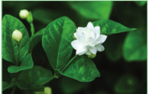

Unit X: Economic B Chapter

1.  Economicall Useful Plants a Entrepreneurial B Learning Objectives The learner will be able to A cquire knowledge about origin, area of cultivation and uses of various food yielding plants.

D escribe the different spices and condiments and their uses. E licit the uses of fibre, timbers, paper and dye yielding plants. A cquire knowledge about the active principles, chemical composition and medicinal uses of plants. D evelop skill of mushroom cultivation, knowledge of SCP production and sea weed liquid fertilizers G ains knowledge of organic farming- bio fertilisers and bio pest repellants. L earn to make terrarium and bonsai A cquires knowledge of cultivation of medicinal plants.

otany y nd otany The land and water of the earth sustain a vast assemblage of plants upon which all other living forms are directly or indirectly dependent. Pre-historic humans lived on berries, tubers, herbage, and the wild game which they collected and hunted that occupied whole of their time. Domestication of plants and animals has led to the production of surplus food which formed the basis for civilizations. Early civilization in different parts of the world has domesticated different species of plants for various purposes. Based on their utility, the economically useful plants are classified into food plants, fodder plants, fibre plants, timber plants, medicinal plants, and plants used in paper industries, dyes and cosmetics. Selected examples of economically important plants for each category are discussed in this chapter.

## Food plants

Currently about 10, 00. food plants are being used of which only around 1, 50. species were brought under cultivation. However, food base of majority of the population depends only on three grass species namely rice, wheat and maize.

### Cereals

The word cereal is derived from Ceres, which according to the Roman mythology denotes “Goddess of agriculture”. All cereals are members of grass family (Poacea e) that are grown for their edible starchy seeds. The prominence of cereals as food plants is due to the following attributes:

i. G reater adaptability and successful colonisation on every type of habitat.
ii. The relative ease of cultivation
iii. Tillering property that produce more branches which results in higher yield per unit area.

iv. Compact and dry grains that they can be easily handled, transported and stored without undergoing spoilage. v. High caloric value that provides energy. The nutrients provided by cereals include carbohydrates, proteins, fibres and a wide range of vitamins and minerals. Cereals can be classified into two different types based on their size namely Major Cereals and Minor Cereals.

Major Cereals Rice / Paddy Botanical name : Oryza sativa Paddy is a semi-aquatic crop and is grown in standing water. It is an important food crop of the world, occupying the second position in terms of area under cultivation and production, next to wheat. Rice is the chief source of carbohydrate. Origin and Area of cultivation South East Asia is considered as the center of origin of rice. Earliest evidences of rice cultivation have been found in China, India and Thailand. It is mainly cultivated in Delta and irrigated regions of Tamil Nadu. Uses Rice is the easily digestible calorie rich cereal food which is used as a staple food in Southern and North East India. Various Rice Wheat

rice products such as Flaked rice (Aval), Puffed rice / parched rice (Pori) are used as breakfast cereal or as snack food in different parts of India.

Rice bran oil obtained from the rice bran is used in culinary and industrial purposes. Husks are used as fuel, and in the manufacture of packing material and fertilizer. International Rice Research Institute (IRRI) International Rice Research Institute (IRRI) is located in Los Banos, Manila the capital city of Philippines. This is the only institute in the world which exclusively carries out research as on rice. IRRI aims to improve livelihoods and nutrition, abolishing poverty, hunger, and malnutrition. Whatever IR rice varieties available in the world are developed through rice breeding programme and released by IRRI. Till date IRRI has produced 84. rice varieties that have been released in 7. countries. IR8 is a high-yielding semi-dwarf rice variety developed by IRRI in the early 1960. and it is called as miracle rice, much celebrated for fighting famine. Another variety to mention is IR 3. which is a semi-dwarf variety that proved highly resistant to a number of insect pests and diseases that raised farmers’ rice yields and brought down the prices of the staple food in Asian families. The International Rice Gene bank of IRRI has a collection of more than 11.

0.  types of rice, comprising of modern and traditional varieties including wild relatives of Paddy.

Maize ajor Cereals 

Wheat Botanical name : Triticum aestivum Origin and Area of cultivation Earliest evidence for wheat cultivation comes from Fertile Crescent region. The common cultivated wheat, Triticum aestivum is cultivated for about 7, 50. years. Wheat is mostly cultivated in the North Indian states such as Uttar Pradesh, Punjab, Haryana, Rajasthan, Madhya Pradesh and Bihar. Uses Wheat is the staple food in Northern India. Wheat flour is suitable to make bread and other bakery products. Processed wheat flour, that has little fibre, is called Maida which is used extensively in making parota, naan and bakery products. Malted wheat is a major raw material for producing alcoholic beverages and nutritive drinks.

Maize / Corn Botanical name : Zea mays Origin and Area of Cultivation Maize is the only cereal that has originated and domesticated from the New World. Madhya Pradesh, Himachal Pradesh and Punjab are the major maize producing states of India. Why do popcorn pops? Endosperm in corn consists of two type namely soft and hard. In popcorn soft endosperm constitutes most part of the grain surrounded by thin layer of hard endosperm. When heated, the internal starch and protein are converted into gelatinous substances and when pressure mount further, the soft endosperm expands and explodes reversing the grain and the gelatinous starch are converted into foam, which readily solidifies outside and convert into crispy, tasty popcorn.

Whereas Perambalur, Ariyalur, Cuddalore, Dindigul and Tirupur are the major maize growing belts in Tamil Nadu. PSEUDO-CEREAL The term pseudo-cereal is used to describe foods that are prepared and eaten as a whole grain, but are botanical outliers from grasses. Example: quinoa. It is actually a seed from Pseudo cereal - the Chenopodium Chenopodium quinoa quinoa plant belongs to the family Amaranthaceae. It is a gluten-free, whole-grain carbohydrate, as well as a whole protein (meaning it contains all nine essential amino acids) and have been eaten for 6, 00. years in Andes hill region. Uses Most of the corn produced is used as fodder than food. Corn syrup is used in the manufacture of infant foods. Corn is a raw material in the industrial production of alcohol and alcoholic beverages.

### Millets (Siru Thaniyangal)

The term millet is applied to a variety of very small seeds originally cultivated by ancient people in Africa and Asia. They are gluten free and have less glycemic index. Pearl Millet Botanical name: Pennisetum americanum It is one of the millets introduced in India and Africa. Pearl Millet is rich in fibre, iron and minerals, stable food grain in many parts of India, especially in Gujarat and Rajasthan. Uses It is commonly used to make flat bread, gluten free cereal based products, porridge (Kambang kooz h) , biscuits, pasta and non- dairy probiotic beverages.

Pearl Millet Finger Millet Figure 10.

Finger Millet – Ragi Botanical name : Eleusine coracana Finger millet is the crop of early introduction from East Africa into India. Ragi is rich in calcium. Uses It is used as a staple food in many southern hilly regions of India. Ragi grains are made into porridge and gruel. Ragi malt is the popular nutrient drink. It is used as a source of fermented beverages. Sorghum Botanical name : Sorghum vulgare Sorghum is native to Africa. It is one of the major millets in the world and is rich in calcium and iron. Uses It is fed to poultry, birds, pigs and cattle and a source of fermented alcoholic beverage

### Minor Millets

Little Millet Botanical name- Panicum sumatrense This is one of the oldest millets and is native to India. The species name is based on a specimen collected from Sumatra. It is rich in iron and fibre than rice that makes it best for diabetes.  
Uses It is cooked like rice and also milled and baked. It cures anaemic condition, constipation and other gastrological problems. Little Millet Foxtail Millet

Sorghum

2.  Millets Foxtail Millet Botanical name : Setaria italica This is one of the oldest millet used traditionally in India. Which is domesticated first in China about
3.  years. Rich in protein, carbohydrate, vitamin B and C, Potassium and Calcium.

Uses It supports in strengthening of heart and improves eye sight. Thinai porridge is given to lactating mother.

Kodo Millet Botanical name : Paspalum scrobiculatum Kodo millet is originated from West Africa, which is rich in fibre, protein and minerals. Uses Kodo millet is ground into flour and used to make pudding. Good diuretic and cures constipation. Helps to reduce obesity, blood sugar and blood pressure.

### Pulses

The word Pulse is derived from the Latin words ‘puls’ or ‘pultis’ meaning “thick soup”. Pulses are the edible seeds that are harvested from the fruits of Fabaceae. They provide vital source of plant-based protein, vitamins and minerals for people around the globe. Kodo Millet inor Millets 

Black gram Sprouted green gram Figure 10.

Black gram Botanical name : Vigna mungo Origin and Area of cultivation Black gram is native to India. Earliest archeobotanical evidences record the presence of black gram about 3, 50. years ago. It is cultivated as a rain fed crop in drier parts of India. India contributes to 80. of the global production of black gram. Important states growing black gram in India are Uttar Pradesh, Chattisgarh and Karnataka. Uses Black gram is eaten whole or split, boiled or roasted or ground into flour. Black gram batter is a major ingredients for the preparation of popular Southern Indian breakfast dishes. Split pulse is used in seasoning Indian curries. Red gram / Pigeon pea Botanical name : Cajanus cajan Origin and Area of cultivation: It is the only pulse native to Southern India. It is mainly grown in the states of Maharashtra, Andhra Pradesh, Madhya Pradesh, Karnataka and Gujarat. Uses Red gram is a major ingredient of sambar, a characteristic dish of Southern India. Roasted seeds are consumed either salted or unsalted as a popular snack. Young pods are cooked and consumed.

Green gram Botanical name : Vigna radiata Origin and Area of cultivation Green gram is a native of India and the earliest archaeological evidences are found in the state of Maharashtra. It is cultivated in the states of Madhya Pradesh, Karnataka and Tamil Nadu.

Red gram Chick pea

4.  Pulses Uses It can be used as roasted cooked and sprouted pulse. Green gram is one of the ingredients of pongal, a popular breakfast dish in Tamil Nadu. Fried dehulled and broken or whole green gram is used as popular snack. The flour is traditionally used as a cosmetic, especially for the skin. Chick pea / Bengal gram Botanical name : Cicer arietinum Origin and Area of cultivation: It has originated in West Asia and was known in cultivation for more than 4,
5.  years in India. It is mainly grown in the states of Madhya Pradesh, Uttar Pradesh and Rajasthan. Uses Chick pea protein is rated high in terms of amino acid content and digestibility. Infant food formulae uses malted chick pea as an ingredient. Chick pea seed flour is a prime constituent of many forms of Indian confectionary. Roasted and salted, whole or split gram forms the popular snacks of middle class.

### Vegetables

While walking through a market filled with fresh vegetables like stacks of lady’s finger, mountains of potatoes, pyramids of brinjal, tomatoes, cucurbits, we learn to choose the vegetables that is fresh, tender, ripe and those suit the family taste through experience and cultural practices. Why do we need to eat vegetables and what do they provide us? Vegetables are the important part of healthy eating and provide many nutrients, including potassium, fiber, folic acid and vitamins A, E and C. The nutrients in vegetables are vital for maintenance of our health.

Potato Botanical name : Solanum tuberosum Family: Solanaceae Origin and Area of cultivation Potato has originated from the highlands of Peru and Bolivia. It is cultivated in Uttar Pradesh, West Bengal and Bihar are the major potato cultivating states of India. Nilgiri and Palani hills also contribute to the potato cultivation in Southern Indian hills. Uses Potato tubers are used in a variety of ways like boiled, steamed, fried, baked, roasted or as an ingredient in soup, stews, pies and other dishes. It is the major raw material for the chips industry, brewing industry and in the manufacture of products used for microbiological and clinical applications. Lady’s finger / Okra Botanical name : Abelmoschus esculentus Family: Malvaceae Origin and Area of cultivation Lady’s finger is a native of the Tropical Africa. Assam, Maharashtra and Gujarat are the important states where Lady’s finger is grown in abundance. Coimbatore, Dharmapuri and Vellore are the major cultivating regions of Tamil Nadu. Uses The fresh and green tender fruits are used as a vegetable. Often they are sliced and dehydrated to conserve them for later use. It has most important nutrients. Cucumber Botanical name : Cucumis sativus Family: Cucurbitaceae The cucurbits are the vining plants of the family Cucurbitaceae, which include cucumbers, squash, pumpkins, melons and gourds. Origin and Area of Cultivation The cucumber is an important summer vegetable in all parts of India. It is originated in India. It has been cultivated for at least

three thousand years. Cucumber is commonly cultivated throughout India. Uses Depending on the species immature or mature fruit are consumed as fresh or cooked vegetables. It is used in the preparation of salad and pickle. Oil obtained from cucumber seed is good for the brain and the body and the kernels are used in confectionaries.

### Fruits

Edible fruits are fleshy structures with a pleasant aroma and flavours. Fruits are sources of many nutrients including potassium, dietary fiber, folic acid and vitamins.Depending on the climatic region in which fruit crops grow, they can be classified into temperate(apple, pear, plum) and tropical fruits (mango, jack, banan a) . In this chapter we will study some examples of tropical fruits.

Mango (National fruit of Indi a) Botanical name : Mangifera indica Family: Anacardiaceae Origin and Area of cultivation The mango is the native to Southern Asia, especially Burma and Eastern India. It is the National fruit of India. Major mango producing States are Andhra Pradesh, Bihar, Figure 10. 5. Mango Gujarat and Karnataka. Salem, Krishnagiri, Dharmapuri are the major mango producing districts of Tamil Nadu. Some of the major cultivars of mango in India are Alphonsa, Banganapalli, neelam and malgova. Uses Mango is the major table fruit of India, which is rich in beta carotenes. It is utilized in many ways, as dessert, canned, dried and preserves in Indian cuisine. Sour, unripe mangoes are used in chutneys, pickles, side dishes, or may be eaten raw with salt and chili. Mango pulp is 

made into jelly. Aerated and non-aerated fruit juice is a popular soft drink. Banana Botanical name : Musa x paradisiaca Family: Musaceae Origin and Area of cultivation Bananas were domesticated in South East Asia.

Tamil Nadu is the world’s No. 1 banana producer. Theni, Figure 10. 6. Banana Trichy, Erode, Thoothukudi, Coimbatore, Kanyakumari, Thanjavur and Dindigul are the prominent regions in Tamil Nadu where the crop is being cultivated. Major cultivars of banana are Chevazhai, Nentheran, Karpooravalli, Poovan and Peyan.

Uses The banana fruit is loaded with potassium and essential vitamins, which can be eaten raw or cooked (deep fried, dehydrated, baked or steame d) . The fruit can be processed into flour and can be fermented for the production of beverages such as banana juice, beer, vinegar and vine. Jack fruit (State fruit of Tamil Nadu) Botanical name : Artocarpus heterophyllus Family: Moraceae Origin and Area of cultivation The jackfruit has originated in the Western Ghats of India and it is the state fruit of Tamil Nadu. The major Jack fruit cultivating Table ## : Other S.No Common Tamil Name Botanical nam Name 1 Guava க�ொய்ொ Psidium guajav 2 Papaya பபபொளி Carica papaya 3 Pomegranate மொதுளை Punica granatu 4 Fig அத்தி Ficus carica 5 Date Palm பபரீச்சம் Phoenix dactyli

areas of Tamil Nadu are Cuddalore, Kanyakumari, Dindigul, Pudukottai, Namakkal, Tirunelveli and Nilgiris. Figure 10. 7. Jackfruit Panruti and Coimbatore districts are the major marketing centres. Uses The fruit can be eaten raw or cooked. Unripe flake slices are deep-fried to make crispy chips. The seeds are either boiled or roasted and eaten. Unripe fruits are used as vegetables.

### Nuts

Nuts are simple dry fruits composed of a hard shell and an edible kernel. They are packed with a good source of healthy fats, fibre, protein, vitamins, minerals and antioxidants. Some of the important nuts are discussed below. Cashew nut Botanical name : Anacardium occidentale Family: Anacardiaceae Origin and Area of cultivation Cashew has originated in Brazil and made its way to India in the 16th century through Portuguese sailors. Cashew is grown in Kerala, Karnataka, Goa, Maharashtra, Tamil Nadu, and Orissa. Uses Cashews are commonly used for garnishing sweets or curries, or ground into a paste that forms a base of sauces for curries or some sweets. Roasted and raw kernels are used as snacks. common fruits e Family Edible part a Myrtaceae Mesocarp and Endocarp Caricaceae Mesocarp m Punicaceae Aril Moraceae Fleshy receptacle fera Arecaceae Pericarp

Cashew Almond

Almond Botanical name : Prunus dulcis Family: Rosaceae Origin and Area of cultivation Almond is a tree native to Mediterranean regions of the Middle East. Almond is cultivated in Kashmir, Himachal Pradesh and Uttar Pradesh. Uses Almonds are often eaten raw or roasted and are available as whole, sliced (flake d) , and as flour. Almond oil is made into almond butter or almond milk, which are used in sweet and savoury dishes. Almond helps in promoting HDL (High Density Lipids)

### Sugars

We experienced sweetness while eating the stems of sugarcane, roots of sugar beet, fruits of apple and while drinking palmyra sap. This is due to the different proportions of sugars found in it. Sugar is the generic name for sweet tasting soluble carbohydrate, which are used in foods and beverages. Sugars found in sugarcane and palmyra make them ideal for efficient extraction to make commercial sugar. Sugarcane Botanical name : Saccharum officinarum Family : Poaceae Sugarcane products Stevia leaves Figure 1

Origin and Area of cultivation The cultivated Saccharum officinarum has evolved by repeated back crossing of S.officinarum of New Guinea with wild S.spontaneum of India to improve the quality. All districts except Kanyakumari and Nilgiris of Tamil Nadu cultivate Sugarcane. Uses Sugar cane is the raw material for extracting white sugar. Sugarcane supports large number of industries like sugar mills producing refined sugars, distilleries producing liquor grade ethanol and millions of jaggery manufacturing units. Fresh sugarcane juice is a refreshing drink. Molasses is the raw material for the production of ethyl alcohol. Stevia /Sweet leaf Botanical name : Stevia rebaudiana Family: Asteraceae Stevia is a sweetener and a sugar substitute, extracted from the leaves of Stevia rebaudiana. It has no calories and is 20. times sweeter than sugar. The Steveocide is the chemical that is responsible for sweetness in Stevia. Origin and Area of cultivation Stevia is a native to Brazil and Paraguay. It is cultivated in the states of Himachal Pradesh, Gujarat and Tamil Nadu. Uses This is the most popular natural sweetener and is a substitute for white sugar, hence it is extensively used by diabetic patients and health conscious people. Palmyra tree and Palm Jaggery 0. 9. Sugars 

Palmyra (State tree of Tamil Nadu) Botanical name : Borassus flabellifer Family: Arecaceae Origin and Area of cultivation Palmyra is native to tropical regions of Africa, Asia and New Guinea. Palmyra grows all over Tamil Nadu, especially in coastal districts. Uses Exudate from inflorescence axis is collected for preparing palm sugar. Inflorescence is tapped for its sap which is used as health drink. Sap is processed to get palm jaggery or fermented to give toddy. Endosperm is used as a refreshing summer food. Germinated seeds have an elongated embryo surrounded by fleshy scale leaf which is edible.

### Oil Seeds

Why fried foods are tastier than boiled foods? There are two kinds of oils namely, essential oils and vegetable oils or fatty oils. The essential oils or volatile oils which possess aroma evaporate or volatilize in contact with air. Any organ of a plant may be the source of essential oil. For example, flowers of Jasmine, fruits of orange and roots of ginger. The vegetable oils or non-volatile oils or fixed oils that do not evaporate. Whole seeds or endosperm form the sources of vegetable oils. Fatty acids in Oils Saturated Fatty Unsaturated Fatty Acid (SFA) Acid (UFA) Mono Unsaturated Poly Unsaturated Fatty Acid Fatty Acid (MUFA) (PUFA) Liquid form in Liquid form in room room temperature temperature and but get solidified in stay in liquid form low temperature. even when chilled. Example: Coconut Example: Sunflower oil oil and Soybean oil Gingelly oil and Rice bran oil are mixture of MUFA and PUFA

Let us know about few oil seeds Groundnut / Peanut Botanical name : Arachis hypogaea Family : Fabaceae Origin and Area of Cultivation: Groundnut is native of Brazil. Portuguese introduced groundnut into Africa. The Spanish took it to the South East Asia and India via Philippines. In India Gujarat, Andhra Pradesh and Rajasthan are top producers. Uses Nuts contain about 45. oil. The kernels are also rich sources of phosphorous and vitamins, particularly thiamine, riboflavin and niacin. It is premium cooking oil because it does not smoke. Lower grade oil is used in manufacture of soaps and lubricants. Sesame / Gingelly Botanical name : Sesamum indicum Family : Pedaliaceae Origin and Area of cultivation: Sesamum indicum has originated from Africa.. Sesame is cultivated as a dry land crop. West Bengal and Madhya Pradesh are the top producers in India during 2017- 18. It is considered as a healthy oil in Southern Indian culture. Uses Sesame oil is used for mostly culinary purposes in India. Lower grades are used in manufacture of soaps, in paint industries, as a lubricant and as an illuminant. In India, the oil is the basis of most of the scented oils used in perfumes. Sesame seed snacks are popular throughout India. Coconut Botanical name : Cocos nucifera Family : Arecaceae Origin and Area of cultivation: The origin of coconut is Pacific island region. Kerala and Tamil Nadu are the leading producers in India.

Groundnut Sesame Figure ## Uses Coconut oil is classified as edible-industrial oil. Soaps obtained from coconut oil lathers well in soft and hard water. It is used in manufacture of rubber, synthetic resins, lubricants, brake fluids for aeroplanes and detergents. It is used as major hair oil and a base for applying medicinal powders.

### Beverages

How about a cup of coffee or tea? We always entertain our guests with this offer. Children exchange chocolates during their birthdays. All non-alcoholic beverages contain alkaloids that stimulate central nervous system and also possess mild diuretic properties. In this part of chapter, we learn about three popular non- alcoholic beverages namely tea, coffee and cocoa. Tea Botanical name : Camellia sinensis Family : Theaceae Origin and Area of cultivation: Tea is native of China.Assam is the top tea producer in India, followed by Kerala and Tamil Nadu. Uses Tea is the most popular beverage among all sections of people in India. Regular consumption of green tea is believed to lowers the bad cholesterol and increases the good cholesterol. Coffee Botanical name : Coffea arabica Family : Rubiaceae Tea plantation Coffee Figure 10.11

Coconut : Oil Seeds Why does a student or a driver prefer tea or coffee during night work? Origin and Area of cultivation: Coffea arabica is the prime source of commercial coffee which is native to the tropical Ethiopia An Indian Muslim saint, Baba Budan introduced coffee from Yemen to Mysore.Karnataka is the largest coffee producing state in India followed by Tamil Nadu and Kerala. Tamil Nadu is the largest consumer of coffee in India. Uses Drinking coffee in moderation provides the following health benefits: Caffeine enhances release of acetylcholine in brain, which in turn enhances efficiency. It can lower the incidence of fatty liver diseases, cirrhosis and cancer. It may reduce the risk of type 2 diabetes. Cocoa Botanical name: Theobroma cacao Family : Malvaceae Origin and Area of cultivation: Cocoa is native of Tropical American region. The word Theobroma (Theos means god, broma means foo d) means ‘food of the Gods’. Kerala is the largest producer of Cocoa in India followed by Karnataka. Uses Cocoa is mainly used in confectionaries and forms an important ingredient in nutritive drinks. Cocoa products are rich in fibres, minerals and antioxidants, thus preventing cancer, cardiovascular diseases, premature ageing. Cocoa : Beverages 

11.  Spices and Condiments “Aroma attracts everyone” History: Spices were used extensively throughout the world for several thousands of years. Records of use of garlic and onion dates back
12.  years. Majority of the spices are native to Mediterranean region, India and South East Asian countries. Spices, especially pepper triggered the search for sea route to India and paved way for the exploratory voyages by Spanish and Portuguese. Spices are accessory foods mainly used for flavouring during food preparation to improve their palatability. Spices are aromatic plant products and are characterized by sweet or bitter taste. Spices are added in minimal quantities during the cooking process. For example black pepper. Condiments, on the other hand, are flavouring substances having a sharp taste and are usually added to food after cooking. For example, curry leaves. The following spices and condiment are discussed in detail. Spices Cardamom Botanical name : Elettaria cardamomum Family : Zingiberaceae Origin and Area of cultivation: It is indigenous to Southern India and Sri Lanka. Cardamom is called as “Queen of Spices”. In India it is one of the main cash crops cultivated in the Western Ghats, and North Eastern India Cardamom Black Pepper Figure 10.1

Uses The seeds have a pleasing aroma and a characteristic warm, slightly pungent taste. It is used for flavouring confectionaries, bakery products and beverages. The seeds are used in the preparation of curry powder, pickles and cakes. Medicinally, it is employed as a stimulant and carminative. It is also chewed as a mouth freshener. Black Pepper Botanical name : Piper nigrum Family : Piperaceae Origin and Area of cultivation: It is indigenous to Western Ghats of India. Pepper is one of the most important Indian spices referred to as the “King of Spices” and also termed as “Black Gold of India”. Kerala, Karnataka and Tamil Nadu are the top producers in India. The characteristic pungency of the pepper is due to the presence of alkaloid Piperine. There are two types of pepper available in the market namely black and white pepper. Uses It is used for flavouring in the preparation of sauces, soups, curry powder and pickles. It is used in medicine as an aromatic stimulant for enhancing salivary and gastric secretions and also as a stomachic. Pepper also enhances the bio-absorption of medicines. Turmeric Botanical name : Curcuma longa Family : Zingiberaceae Origin and Area of cultivation: It is indigenous to Southern Asia India is the largest producer, consumer and exporter of Turmeric Chillies

2.  Spices

turmeric. Erode in Tamil Nadu is the World’s largest wholesale turmeric market. Uses Turmeric is one of the most important and ancient Indian spices and used traditionally over thousands of years for culinary, cosmetic, dyeing and for medicinal purposes. It is an important constituent of curry powders. Turmeric is used as a colouring agent in pharmacy, confectionery and food industry. Rice coloured with turmeric (yellow) is considered sacred and auspicious which is used in ceremonies. It is also used for dyeing leather, fibre, paper and toys. Curcumin extracted from turmeric is responsible for the yellow colour. Curcumin is a very good anti-oxidant which may help fight various kinds of cancer. It has anti-inflammatory, anti-diabetic, anti-bacterial, anti-fungal and anti- viral activities. It stops platelets from clotting in arteries, which leads to heart attack. Chillies / Red Pepper Botanical name : Capsicum annuum, C. frutescens.

Family : Solanaceae Origin and Area of cultivation: Capsicum is native to South America and is popularly known as chillies or red pepper in English. India is leading producer and exporter. C. annuum and C. frutescens are important cultivated species of chillies. Uses The fruits of C.annuum are less pungent than the Table ## : Other commo S. No Common Name Tamil Name 1 Coriander க�ொத்துமல்லி Cor 2 Cumin சீர�ம் Cum 3 Fenugreek கெந்த்ம் Trig 4 Cloves இலெங�ம் Eug 5 Asafoetidia கபருங�ொ்ம் Feru 6 Onion கெங�ொ்ம் Alli

fruits of C.frutescens. C.annum includes large, sweet bell peppers. Long fruit cultivars of this species are commercially known as ‘Cayenne pepper’ which are crushed, powdered and used as condiment. Chillies are used in manufacture of sauces, curry powders and preparation of pickles. Capsaicin is an active component of chillies. It has pain relieving properties and used in pain relieving balms. Chillies are a good source of Vitamin C, A and E. Capsaicin is responsible for the pungency or spicy taste of chillies. Pungency of Chillies is measured in Scoville Heat Units (SHU). World’s hottest chilli, Carolina reaper pepper measures 2,200, 00. SHU. Naga viper chilli is the hottest in India that measures

### SHU. Commonly used cayenne

pepper measures 30, 00. to ### SHU. Condiment Tamarind Botanical name :Tamarindus indica Family : Fabaceae-Caesalpinioideae Origin and Area of cultivation: Tamarind is native of tropical African region and was introduced into India several thousand years Figure 10.

1.  : Tamarind before. It is cultivated in India, Myanmar, south asian countries and several African and Central American countries. n spices and condiments Botanical Name Family iandrum sativum. L Apiaceae inum cyminum. L Apiaceae onella foenum graecum. L Fabaceae enia aromaticum Myrtaceae la asafoetida.L Umbelliferae (Apiacea e) um cepa Amarillidaceae 

Tamarind has long been used in Africa and in Southern Asia. The name tamarindus is of Arabian origin, which means “dates of India”. (tamar – dates; Indus – Indi a) . Uses It is used in flavouring sauces in the United States and Mexico. In India, the fruit pulp is major ingredients for many culinary preparations. Sweet tamarinds are sold as table fruits in India imported from Thailand and Malaysia. Sambar – The World Inside When we see the bowl of sambar, we can see the world inside. Mustard, Cumin and Coriander from Mediterranean, pepper from Western Ghats of India, turmeric from Southern Asia, chilly from South America, onion from Afganisthan, tamarind from Tropical Africa, tomato from South America, potato from Peru and Bolivia, lady’s-finger from Africa, and redgram from South India make the Sambar as a global dish.

## Fibres

Botanically a fiber is a long narrow and thick- walled cell. Plant fibres are classified according to their use (Table 10.3) Table ## Classification of fibres S. No Types of fibre Uses Example 1 Textile fibre Manufacture Cotton, of fabrics, hemp, jute. netting and cordage.

2 Brush fibre Making Palm fibres brushes and and brooms. brooms.

3 Plaiting fibre Making hats, Cane, Vitex baskets, and Lantana. furniture.

4 Filling fibre Stuffing Silk cotton, pillows, Calotropis. cushions and beds.

Cotton Botanical name : Gossypium spp. Family : Malvaceae Cotton is the world’s most important non- food commercial crop. Origin and Area of cultivation: It is one of the oldest cultivated crops of the world. It has been cultivated for about

800.  years both in new world and in old world. Commercial cotton comes from four cotton species: two from the new world and two from the old world. (
801.  G. hirsutum (
802.  G.barbadense are the New world species and (
803.  G. arboretum (4) G. herbaceum are the old world species. In India cotton is cultivated in Gujarat, Maharashtra, Andhra Pradesh and Tamil Nadu. Uses It is mainly used in the manufacturing of various textile, hosiery products, toys and is also used in hospitals. Jute Botanical name : Corchorus spp. Family : Malvaceae Origin and Area of cultivation: Jute is derived from the two cultivated species (
804.  Corchorus capsularis and (
805.  C.olitorius is of African origin whereas C. capsularis, is believed to be Indo-Burmese origin. It is an important cultivated commercial crop in Gangetic plains of India and Bangladesh. Uses It is one of the largest exported fibre material of India. The jute industry occupies an important place in the national economy of India. Jute is used for ‘safe’ packaging in view of being natural, renewable, bio-degradable and eco-friendly product. It is used in bagging and wrapping textile. About
806.  of the jute produced is used for manufacturing sacks and bags. It is also used in manufacture of blankets, rags, curtains etc. It is also being used as a textile fibre in recent years.

Cotton plant Jute products Figure ## Coconut / Coir Botanical name : Cocos nucifera Family : Arecaceae Commercial coir is obtained from the mesocarp of coconut. The fibre is known for its light mass, elasticity, high resistance to sea water and for its insulating capacity. Origin and Area of cultivation: We have already studied the origin of Coconut under the oil crops. India and Sri Lanka are the top producers since 2001. Kerala and Tamil Nadu are the top producers in India.  
Uses It is used in manufacture of mats, cushion seats, bags, packaging material, water-proof and sound proof boards and thermal insulation. Using coir peat in horticulture also made demand for coir. It is also used for manufacturing ecofriendly horticultural products such as biodegradable planting pots.

## Timber

The basic need of shelter is obtained from the timber trees. In this lesson we learn about few timber plants.

Teak Botanical name : Tectona grandis Family: Lamiaceae Teak wood carving Rosewood

Coconut coir

4.  Fibres Origin and Area of cultivation: This is native to South east Asia. It is observed wild in Assam. But cultivated in Bengal, Assam, Kerala, Tamil Nadu and North-West India. Uses It is one of best timbers of the world. The heartwood is golden yellow to golden brown when freshly sawn, turning darker when exposed to light. Known for its durability as it is immune to the attack of termites and fungi. The wood does not split or crack and is a carpenter friendly wood. It was the chief railway carriage and wagon wood in India. Ship building and bridge-building depends on teakwood. It is also used in making boats, toys, plywood, door frames and doors. Rosewood Botanical name : Dalbergia latifolia Family: Fabaceae Origin and Area of cultivation: Rose wood is native to India It is cultivated in Uttar Pradesh, Bihar, Odisha, Central, Western and Southern India.

Uses Indian rosewood has yellowish sapwood and dull brown to almost purple coloured heartwood. The wood is characterised by fragrant, heavy, narrowly interlocked grained and medium coarse textured. It is a durable and heavy wood and is suitable for under water use. Wood is used for making furniture, army wagons, temple chariots, cabinets, railway sleepers, musical instruments, hammer handles, shoe heels and tobacco pipes. 

Ebony Botanical name : Diospyros ebenum Family: Ebenaceae Origin and Area of cultivation: It is commonly found in tropical forests Southern India and Srilanka. Ebony is distributed in forests of Karnataka, Kerala and Tamil Nadu. Uses The heartwood is jet black with a metallic lustre when smoothened and is resistant to attack by insects and fungi. The wood is difficult to season and hence cut into small pieces before seasoning It is used mainly for making piano keys, handles of cutlery, musical instruments, making sticks, umbrella handles, whips and furniture.

## Latex

Rubber Botanical name : Hevea brasiliensis Family : Euphorbiaceae Origin and Area of cultivation: It is a native of Brazil and was introduced outside its native range during the colonial period and has become an important Figure 10.

1.  : Rubber Tree cash crop. Asia contributed
2.  of the world production. Kerala is the largest producer in India followed by Tamil Nadu.

Uses Tyre and other automobile parts manufacturing industries consume 70. of the rubber production. Rubber is used in manufacturing footwear, wire and cable insulations, rain- coats, household and hospital goods, shock absorbers, belts, sports goods, erasers, adhesives, and rubber-bands Hard rubber is used in the electrical and radio engineering industries Concentrated latex is used for making gloves, balloons and condoms.

Foamed latex is used in the manufacture of cushions, pillows and life-belts. Rubber – Vulcanization Charles Goodyear invented vulcanization in

1839.  He found that the defects in rubber articles could be overcome by heating rubber with sulphur under pressure at
    
1840.  C. The process was called vulcanization. The name was given from the Roman God of Fire, Vulcan. Because of this, solid rubber tyres were used for first time in
    
1841.  That is why we smoothly travel on road.
    

## Pulp Wood

The term paper is derived from the word ‘papyrus’ a plant (Cyperus papyrus) that was used by Egyptians to make paper-like materials. Paper production is a Chinese invention. The Chinese discovered the paper that was prepared from the inner bark of paper mulberry in 10. A.D. For a long time, the art of paper making remained a monopoly of the Chinese until Arabs learned the technique and improved it around 75. A.D. Invention of printing increased the demand for paper. Manufacture of Wood pulp: Wood is converted into pulp by mechanical, and chemical processes. Wood of Figure 10.

1.  : Wood pulp Melia azadirachta, Neolamarkia chinensis, Casuarina spp, Eucalyptus spp are used for making paper pulp.

Purified dissolving pulp is used as a basic material in the manufacture of rayon or artificial silk, fabrics, transparent films (cellophane, cellulose acetate films), plastics. The viscose process of making rayon is the most common process.

## Dyes

The ability to perceive colour is a wonderful aspect of human eyes and dyes add colour to the goods we use. They have been in use since the ancient times.

The earliest authentic records of dyeing were found in the tomb painting of ancient Egypt. Colourings on mummy cements (wrappin g) included saffron and indigo. They can also be seen in rock paintings in India. Indigo Botanical name : Indigofera Family : Fabaceae Origin and Area of cultivation: Indigofera tinctoria is native to India. It was grown in many states in India. Now it is grown limited states mainly in Tamil Nadu and Andhra Pradesh. Uses A brilliant dark blue dye ‘indigo’ was extracted from the leaves of several species of Indigofera. The people of Asia, especially India have known the dye for over 4, 00. years. It is also used in painting of murals. Indigofera have long been used in Southern India in temple arts and folk arts, popularly known as Kalamkari. Indigo used for dyeing and printing cotton, rayon and wool. Henna Botanical name : Lawsonia inermis Family : Lythraceae Origin and Area of cultivation: It is indigenous to North Africa and South-west Asia. It is grown mostly throughout India, especially in Gujarat, Madya Pradesh and Rajasthan. Indigo dye Henna d

Uses An orange dye ‘Henna’ is obtained from the leaves and young shoots of Lawsonia inermis. The principal colouring matter of leaves ‘lacosone” is harmless and causes no irritation to the skin. This dye has long been used to dye skin, hair and finger nails. It is used for colouring leather, for the tails of horses and in hair-dyes. Champaran Satyagraha Indigofera is a very important cash crop among plants cultivated in India during the British regime. Farmers were forced to cultivate Indigofera instead of food crops. Gandhi started satyagraha at Champaran, a village in Bihar in support of farmers. This was the first satyagraha in India by Gandhi. Government accepted ‘champaran farmers bill’. Gandhi’s first satyagraha in India achieved a great success. 10. 8. Cosmetics Traditionally in Southern India, people have been using turmeric, green gram powder, henna, sigaikai and usilai for their skin and hair care. These were mostly home prepared products that are used for grooming. Today, cosmetics have a high commercial value and have become chemical based industrial products. Providing personal care services has become a major industry. In recent years, people have realized the hazards of chemical- based cosmetics and are turning back to ye es 

natural products. In this chapter one of the major plants namely Aloe which is used in the cosmetic industries is discussed. Aloe Botanical name : Aloe vera Family: Asphodelaceae (formerly Liliacea e) Origin and Area of cultivation: It is a native of Sudan. It is cultivated on a large scale in Rajasthan, Gujarat, Maharashtra, Andhra Pradesh and Tamil Nadu. Uses ‘Aloin’ (a mixture of glucosides) and its gel are used as skin tonic. It has a cooling effect Figure 10. 19. Aloe vera and moisturizing characteristics and hence used in preparation of creams, lotions, shampoos, shaving creams, after shave lotions and allied products. It is used in gerontological applications for rejuvenation of aging skin. Products prepared from aloe leaves have multiple properties such as emollient, antibacterial, antioxidant, antifungal and antiseptic. Aloe vera gel is used in skin care cosmetics.

### Perfumes

The word perfume is derived from the Latin word Per (throug h) and fumus (to smoke), meaning through smoke. It refers to the age-old tradition of burning scented woods at religious ceremonies.In early days, when people were less conscious of personal hygiene, essential oils not only masked offensive odours, but also may have acted as antiseptics. Perfumes are added to baths and used for anointing the body. Perfumes are manufactured from essential oil which are volatile and aromatic. Essential oils are found at different parts of the plant such as leaves, (curry leaf, mint), flowers (rose, jasmin e) , fruits (citrus, straw berry) and wood (sandal, eucalyptus).

Jasmine Botanical name : Jasminum grandiflorum Family: Oleaceae Jasmine, as a floral perfume, ranks next to the rose oil. Major species cultivated on the commercial scale is Jasminum grandiflorum, a native of the north-western Himalayas. In Tamil Nadu, the major jasmine cultivation centres are Madurai and Thovalai of Kanyakumari District. The essential oil is present in the epidermal cells of the inner and outer surfaces of both the sepals and petals. One ton of Jasmine blossom yields about ## to 3 kg of essential oil, comprising 0. 2. to 3% of the weight of the fresh flower. Uses Jasmine flowers have been used since ancient times in India for worship, ceremonial purposes, incense and fumigants, as well as for making perfumed hair oils, cosmetics and soaps. Jasmine oil is an essential oil that is valued for its soothing, relaxing, antidepressant qualities. Jasmine blends well with other perfumes. It is much used in modern perfumery and cosmetics and has become popular in air freshners, anti-perspirants, talcum powders, shampoos and deodorants. Madurai Malli ‘Madurai Malli’ is the pride of Madurai has a distinct reputation universally because of its uniqueness and has been given the Geographical Indications (GI) mark by the Geographical indication Registry of India. Madurai malli has thick petals with long stalk equal to that of petals and the distinct fragrance is due to the presence of chemicals such as jasmine and alpha terpineol. This makes it easy to distinguish Madurai Malli from other places. This is the second GI tag for Jasmine after ‘Mysore Malli’.

Jasmine Rose Figure ## Rose Botanical name : Rosa X damascena Family: Rosaceae Origin and Area of cultivation: R.X damascena, has its origin from the Middle East. Major scented rose cultivating states include Rajasthan, Delhi, Haryana, Maharashtra, West Bengal, Karnataka, Andhra Pradesh and Tamil Nadu. Rose oil is one of the oldest and most expensive of perfume oils. The oil is concentrated in the epidermal cells on the inner surface of the petals.The average oil yield is a little less than 0.5 g. from 100. g. of flowers.  
Uses Rose oil is largely used in perfumes, scenting soaps, flavouring soft drinks, liqueurs and certain types of tobacco, particularly snuff of chewing tobacco. Rose water (panneer) containing much of phenylethyl alcohol and other compounds in dissolved confectioneries syrups and soft drinks. In India, the water is much used in eye lotions and eye-washes. In addition, it is sprinkled on guests as a ceremonial welcome. Sandalwood Botanical name : Santalum album Family: Santalaceae Origin and Area of cultivation: Sandal tree is native of South East Asia. Karnataka and Tamil Nadu are states that possess large natural populations of Santalum album in India. The heart-wood is scented due to the presence of santalol, from which oil is extracted. The oil yield from a wood chips, varies from 4- 5.

Sandal : Perfumes being the highest when distilled from roots ( 10. of the dry weight). Uses Sandalwood oil is a valuable fixative for other fragrances due to the excellent blending properties. More than 90. of the oil is used in the manufacture of scented soaps, talcum powder, face powder, creams, hair oils, hand lotions as well as in perfumery and pharmaceutical industries.

## Traditional Systems

of Medicines India has a rich medicinal heritage. A number of Traditional Systems of Medicine (TSM) are practiced in India some of which come from outside India. TSM in India can be broadly classified into institutionalized or documented and non-institutionalized or oral traditions. Institutionalized Indian systems include Siddha and Ayurveda which are practiced for about two thousand years. These systems have prescribed texts in which the symptoms, disease diagnosis, drugs to cure, preparation of drugs, dosage and diet regimes, daily and seasonal regimens. Non- institutional systems, whereas, do not have such records and or practiced by rural and tribal peoples across India. The knowledge is mostly held in oral form. The TSM focus on healthy lifestyle and healthy diet for maintaining good health and disease reversal. Siddha system of medicine Siddha is the most popular, widely practiced and culturally accepted system in Tamil Nadu. It is based on the texts written by 1. 

Siddhars. There are different opinions on the constitution of

1.  Siddhars. The Siddhars are not only from Tamil Nadu, but have also come from other countries. The entire knowledge is documented in the form of poems in Tamil. Siddha is principally based on the Pancabūta philosophy. According to this system three humors namely Vātam, Pittam and Kapam that are responsible for the health of human beings and any disturbance in the equilibrium of these humors result in ill health. The drug sources of Siddha include plants, animal parts, marine products and minerals. This system specializes in using minerals for preparing drugs with the long shelf-life. This system uses about
2.  herbs as source of drugs. Great stress is laid on disease prevention, health promotion, rejuvenation and cure. Ayurveda system of medicine Ayurveda supposed to have originated from Brahma. The core knowledge is documented by Charaka, Sushruta and Vagbhata in compendiums written by them. This system is also based on three humor principles namely, Vatha, Pitha and Kapha which would exist in equilibrium for a healthy living. This system Uses more of herbs and few animal parts as drug sources. Plant sources include a good proportion of Himalayan plants. The Ayurvedic Pharmacopoeia of India lists about
3.  plants used as source of drugs. Folk system of medicine Folk systems survive as an oral tradition among innumerable rural and tribal communities of India. A consolidated study to document the plants used by ethnic communities was launched by the Ministry of Environment and Forests, Government of India in the form of All India Coordinated Research Project on Ethnobiology. As a result about
4.  plant species have been documented which are used for medicinal purposes. The efforts to document in several under-explored and

unexplored pockets of India still continue. Major tribal communities in Tamil Nadu who are known for their medicinal knowledge include Irulas, Malayalis, Kurumbas, Paliyans and Kaanis. Some of the important medicinal plants are discussed below.

## Medicinal Plants

India is a treasure house of medicinal plants. They are linked to local heritage as well as to global-trade. All institutional systems in India primarily use medicinal plants as drug sources. At present, 90. collection of medicinal plants is from the non-cultivated sources. Growing demand for herbal products has led to quantum jump in volume of plant materials traded within and across the countries. Increasing demand exerts a heavy strain on the existing resources. Now efforts are being made to introduce cultivation techniques of medicinal plants to the farmers. Medicinal plants play a significant role in providing primary health care services to rural and tribal people. They serve as therapeutic agents as well as important raw materials for the manufacture of traditional and modern medicines. Medicinally useful molecules obtained from plants that are marketed as drugs are called Biomedicines. Medicinal plants which are marketed as powders or in other modified forms are known as Botanical medicines. In this chapter you will be learning about a few medicinal plants that are commonly used in Tamil Nadu. All these plants are commonly available in and around dwelling places and can be easily cultivated in home gardens.

Keezhanelli Botanical name : Phyllanthus amarus Family : Euphorbiaceae (Now in Phyllanthacea e) Origin and Area of cultivation: The plant is a native of Tropical American region and is naturalised in India and other tropical countries. It is not cultivated and is collected from moist

Phyllanthus amarus Justicia adhatoda

places in plains. Phyllanthus maderspatensis is also commonly sold in the medicinal plant markets collected from non-forest are as keezhanelli.

Active principle: Phyllanthin is the major chemical component.

Medicinal importance Phyllanthus is a well-known hepato-protective plant generally used in Tamil Nadu for the treatment of Jaundice. Research carried out by Dr. S P Thyagarajan and his team from University of Madras has scientifically proved that the extract of P. amarus is effective against hepatitis B virus.

Adathodai Botanical name : Justicia adhatoda Family: Acanthaceae Origin and Area of cultivation: It is native to India and Srilanka. This species is not known in wild in Tamil Nadu but widely cultivated as Table 4. Other comm S. Common Tamil Botanical No Name Name Name Family 1 Holy basil துைசி Ocimum Lamiaceae sanctum 2 Indian கெல்லி Phyllanthus Phyllanthac gooseberry emblica 3 Indian குபளபபமனி Acalypha Euphorbiac Acalypha indica 4 Vilvam வில்ெம் Aegle Rutaceae marmelos 5 Veldt grape பிரணளடை Cissus Vitaceae quadrangularis

Andrographis paniculata Curcuma longa edicinal Plants a live fence and around temples. Active principle: Vascin Uses Adhatoda possess broncho dilating property. The decoction is used in treating many bronchial disorders such as cough,cold and asthma. It is also used in treating fevers. The extract forms an ingredient of cough syrups.

Nilavembu Botanical name : Andrographis paniculata Family : Acanthaceae Andrographis paniculata, known as the King of Bitters is traditionally used in Indian systems of medicines. Active principle: Andrographolides. Medicinal importance: Andrographis is a potent hepatoprotective and is widely used to treat liver disorders. on Medicinal plants Plant part used Medicinal Uses Leaves and The leaves are stimulant, antiseptic, anti- Roots hypertensive and anti-bacterial and expectorant used in bronchitis. Decoction of roots is given as a diaphoretic in malarial fevel. eae Fruit It is a potent rejuvenator and immune modulator. It has a anti-ageing properties. It helps to promote longevity, enhance digestion, treat constipation and reduce fever and cough.

eae Leaves Used to cure skin diseases caused by ringworms. Powdered leaves are used to cure bedsores and infected wounds. Fruit The unripe fruit is used to treat problems of stomach indigestion. It kills intestinal parasites. Stem and Paste obtained from the powdered stem and root root of this plant is used in bone fractures. Whole plant is useful to treat asthma and stomach troubles. 

Concoction of Andrographis paniculata and eight other herbs (Nilavembu Kudineer) is effectively used to treat malaria and dengue. Turmeric Botanical name : Curcuma longa Family: Zingiberaceae Origin and Area of Cultivation: You have already studied the details under the spices. Active principle: Curcumin. Medicinal importance: Curcumin (the yellow colouring principle is the major pharmacologically active compound of turmeri c) is well known for its medicinal properties.  
It is used to treat Alzheimer’s disease due to its property to cross over blood brain barrier. It has a very powerful anti-oxidant, anti-cancerous, anti-inflammatory, anti- diabetic, anti-bacterial, anti-fungal and anti- Patenting Of Turmeric University of Mississippi medical center, USA was granted a patent for wound healing property of Turmeric in 1995. The patent was granted both for oral and topical applications and provides an exclusive right to sell and distribute. Since the use of turmeric to heal wounds is a common domain knowledge in India, the Government of India has decided to fight against the patent through the Indian Council for Scientific and Industrial Research (CSIR). CSIR collected documentary evidences from various literature to prove that the knowledge on wound healing property of turmeric existed in India for a long time and provided the evidences to the United States Patent and Trade mark Office (USPTO). Based on the evidences the patent was revoked by USPTO. Hence the traditional knowledge (TK) on turmeric was safeguarded from Bio piracy.

viral properties. It is one of the traditional medicines used for wound healing. Psychoactive Drugs In the above chapter you have learnt about plants that are used medicinally to treat various diseases. Phytochemicals / drugs from some of the plants alter an individual’s perceptions of mind by producing hallucination are known as psychoactive drugs. These drugs are used in all ancient culture especially by Shamans and by traditional healers. Here we focus on two such plants namely Poppy and Marijuana. Opium poppy Botanical name : Papaver somniferum Family: Papaveraceae Origin and Area of cultivation: Opium poppy is native to South Eastern Europe and Western Asia. Madhya Pradesh, Rajasthan and Uttar Pradesh are the licenced states to cultivate opium poppy. Opium is derived from the exudates of fruits of poppy plants. It was traditionally used to induce sleep and for relieving pain. Opium yields Morphine, a strong analgesic which is used in surgery. However, opium is an addiction forming drug. Cannabis / Marijuana Botanical name : Cannabis sativa Family: Cannabiaceae Origin and Area of Cultivation: Marijuana is native to China. States such as Gujarat, Himachal Pradesh, Uttarkand, Uttarpradesh and Madhaya Pradesh have legally permitted to cultivate industrial hemp/Marijuana The active principle in Marijuana is trans-tetrahydrocanabinal (THC). It possess a number of medicinal properties. It is an effective pain reliever and reduces hypertension. THC is used in treating Glaucoma a condition in which pressure develops in the eyes. THC is also used in

reducing nausea of cancer patients undergoing radiation and chemotherapy. THC provides relief to bronchial disorders, especially asthma as it dilates bronchial vessels. Because of these medicinal properties, cultivation of cannabis is legalized in some countries. However, prolonged use causes addiction and has an effect on individual’s health and society. Hence most of the countries have banned its cultivation and use. Narcotics Control Bureau (NCB) Drugs come in various forms and can be taken in numerous ways. Some are legal and others are not. Drug abuse and misuse can cause numerous health problems and in serious cases death can occur. The Narcotics Control Bureau (NCB) is the nodal drug law enforcement and intelligence agency of India and is responsible for fighting drug trafficking and the abuse of illegal substances.

## Entrepreneurial Botany

Entrepreneurial Botany is the study of how new businesses are created using plant resources as well as the actual process of starting a new business. An entrepreneur is someone who has an idea and who works to create a product or service that people will buy, by building an organization to support the sales. Entrepreneurship is now a popular topic for higher secondary students, with a focus on developing ideas to create new ventures among the young people.

Vast opportunities are there for the students of Botany. In the present scenario students should acquire ability to merge skills and knowledge in a meaningful way. Converting botanical knowledge into a business idea that can be put into practice for earning a livelihood is the

much-needed training for the students. This part of chapter is aimed to help the students to acquire such skills with practical knowledge to start a few activities of entrepreneurship.

### Mushroom cultivation

Malnutrition caused by the lack of adequate protein and other nutrients in daily diet of people is becoming a major health hazard in developing countries. Under such circumstances, mushroom being a rich source of protein and other nutrients can be a part and parcel of every day’s food. Mushrooms are the fruiting body of edible fungi and is the most priced commodity among vegetables, not only because of its nutritive value but also for its characteristic aroma and flavor. M u s h r o o m s are also called white vegetable. M u s h r o o m cultivation has great scope in India and in other developing c o u n t r i e s . M u s h r o o m c u l t i v a t i o n Figure 10. 22. Mushroom activities can play Cultivation an important role in supporting the local economy. Selling mushroom in a local market form a source of additional income to the family. Steps involved in mushroom cultivation • The straw used for composting should be ripe and golden-yellow in colour. It should be cut into ## inches and properly sterilized.

• The culture space should be clean and the ventilators and windows should be covered with fine wire mesh to prevent the entry of flies and birds.

• The culture space should be sprayed with 0.

1.  Nuvan and 5% Formalin, two days prior to spawning and transferring to bags to cropping rooms.

• The spawn used for mushroom should be free from contaminations. Bags should be filled with 8 kg of wet straw. • During spawning running temperature and relative humidity should be maintained

200.  to 300C, 75 to 85% respectively. • Proper watering should be done when the growth coverings are removed. There should not be dry patches on blocks. Excess watering must be avoided. • About
    
201.  cm gap should be maintained in between two bags or blocks. • Picking must be done as their caps become
    
202.  – 12 cm by twisting. Two kinds of mushrooms are cultivated namely button and oyster.
    

10.11. 2. Single Cell Protein (SCP) Production Single-cell proteins are the dried cells of microorganism, which are used as protein supplement in human foods or animal feeds. Microorganisms that can be used for the production of SCP have the capacity to synthesize proteins rapidly than higher living organisms. Microorganisms like algae, fungi, yeast and bacteria are used for this purpose. Here you will learn about the production of SCP from an algae, Spirulina.

Small scale biomass production of Spirulina. It requires an aquarium, air pump, nutrients and Spirulina mother culture. • T ake a 3. litre capacity aquarium and fill half of it with water. • C heck if any heavy metal concentration or fluorine or calcium carbonate in water. • F ill the tank with water and add nutrients preferably zarrouk medium. (Add half of the required nutrients first and add another half later). • T o aerate the culture, fix the air pump (avoid centrifugal pump) after adding nutrients. • A dd the mother culture to the aquarium. For every 1 liter of water add 4 gm. mother culture.

• P lace it in sunlight for 10-

1.  hrs. every day. • A fter a week check the culture and add more water leave it for one more week, till the biomass becomes dark green. • Use a very fine cloth and harvest the algae. • Water can be reused in aquarium. • Dry the algae for later use. Single cell protein has a high nutritive value due to higher protein, vitamin, essential amino acids and lipid content. Hence it can form a good protein supplement. However it cannot completely replace the conventional protein sources due to their high nucleic acid content and slower in digestibility. They may result in allergic reactions.

### Seaweed Liquid Fertilizer

Seaweed is rich in trace elements and potassium, which makes it ideal to add to compost in its raw state, to work in as a mulch, or to create a liquid fertilizer. This is easy to do. Seaweed fertilizer releases about 6. nutrients from which plants can benefit.

• Collect the seaweed that is not too stinky. • Rinse the seaweed to remove the excess salt. • F ill a bucket to three quarters way with

water. Add as much seaweed as will fit and leave to soak.

• Stir the seaweed mix every two to four days. • A llow to soak for several weeks to months. So that the fertilizer grows stronger and stronger over time. (Make sure to keep the brew somewhere so that its odour will not affect the daily household.) • I t is ready for use once it no longer carries a smell of ammonium. • W hen it is ready, use as a fertilizer for plants and garden beds (soil). (It should be diluted with water at a minimum of three parts to on e) . Preparation of Or Mix 120. of hot Blend the Add chillies with 11. vegetables together paste g of garlic or manually or using warm onion. Chop them an electric grinder ingre thoroughly. until it forms a thoro thick paste. toget ## Strain the mixture. Pour the Pour the pesticid solution through a strainer, bottle. Make sure remove the vegetables and collect bottle has first the vegetable-infused water and with warm wat pour into another container. This to get rid it of filtrate is the pesticide. Either contaminants. U discard the vegetables or use it as to transfer the l a compost. squirt bottle an nozzle.

5 Avoid spraying the plants during the sunny tim other plants possess insect repellent or insecticid be fermented and used as biopesticide.

Liquid seaweed extract enhances healthy growth of plants, flowers and vegetables. Regular use will help plants to withstand environmental stress, pests and disease attack. It can be used as a foliar spray for fruit, flower, vegetable crops as well as for shrubs and trees. It stimulates healthy growth for all plants.

### Organic farming

Organic farming is an alternative agricultural system in which plants/crops are cultivated in natural ways by using biological inputs to maintain soil fertility and ecological balance thereby minimizing pollution and wastage. Indians were organic farmers by default until the green revolution came into practice. ganic Pesticide the vegetable Pour the solution into a glass to 50. ml of container and leave it undisturbed water. Give the for 2. hours. If possible, keep the dients a stir to container in a sunny location. If ughly mix them not, at least keep the mixture in a her. warm place. ## e into a squirt Spray your plants with the that the spray pesticide. Treat the infected been cleaned plants every 4 to 5 days with the er and soap solution. After 3 or 4 treatments, any potential the pest will be eliminated. If the se a funnel area is thoroughly covered with iquid into the d replace the the solution, this pesticide should keep bugs away for the rest of the 6 season. 7 es of the day since it could burn plants. Many al properties. Combinations of these plants can n of organic pesticide 

Use of biofertilizers is one of the important components of integrated organic farm management, as they are cost effective and renewable source of plant nutrients to supplement the chemical fertilizers for sustainable agriculture. Several microorganisms and their association with crop plants are being exploited in the production of biofertilizers. Organic farming is thus considered as the movement directed towards the philosophy of Back to Nature.

I. Organic Pesticide Pest like aphids, spider and mites can cause serious damage to flowers, fruits, and vegetables. These creatures attack the garden in swarms, and drain the life of the crop and often invite disease in the process. Many chemical pesticides prove unsafe for human and the environment. It turns fruits and vegetables unsafe for consumption. Thankfully, there are many homemade, organic options to turn to war against pests. Preparation of Organic Pesticide Refer figure: ## II. Bio-pest repellent Botanical pest repellent and insecticide made with the dried leaves of Azadirachta indica Preparation of Bio-pest repellent • P luck leaves from the neem tree and chop the leaves finely.

• The chopped up leaves were put in a 50-liter container and fill to half with water; put the lid on and leave it for 3 days to brew. • Using another container, strain the mixture which has brewed for 3 days to remove the leaves, through fine mesh sieve. The filtrate can be sprayed on the plants to repel pests. • To make sure that the pest repellent sticks to the plants, add 10. ml of cooking oil and the same amount of soap water. (The role of

the soap water is to break down the oil, and the role of the oil is to make it stick to the leaves).

• The stewed leaves from the mixture can be used in the compost heap or around the base of the plants. Activity Hanging Garden 1 Mix the garden soil, mass and clay into a ball 2 Dig a hole and tuck plant root inside 3 Cover the soil ball with mass sheet 4 Wrap 5 Hang it up and with twine spray with water

### Terrarium

Can portable miniature indoor greenery be commercially sold? A terrarium is a collection of small plants growing in a transparent, sealed container. Terrariums are easy to make, low maintenance gardens, and it can survie indefinitely with minimal water. How to make a terrarium? Prepare the Container: Collect whatever interesting glassware you have or source your container from a store and clean it thoroughly. Plan how to arrange the plants inside the glassware.

Add Drainage Layers: To create a false drainage layer, fill the bottom with pebbles so that water can settle and Plants and ornates does not flood. The depth of the pebbles depends on Moss dried the size of the container. Add the Activated Charcoal: Cover the Coal pebbles with charcoal to improve the quality of the terraria by reducing Coloured glass bacteria, fungi and odors. Add Soil: Add enough Pebbles soil so that the plant roots will have enough space to Sand fit and grow. Plant: Select the desired plant such as, Caralluma spp, Asperagus spp, Portulaca spp, Begonia spp, and Chlorophytum spp; trim the roots if they are too long. Dig a pit using a stick, and place the plants’ roots in it. Add more soil around the top BONSAI Bonsai is a Japanese art form using miniature trees g containers that mimic the shape and scale of full size How do you make a Bonsai tree? Visualize the finished product of bonsai while selecting a plant species and the pot.

1.  Plug out the sapling Prepa and clean 2 pot and p and prune the tree i the roots.
    
2.  After re-potting the plant in a sem shaded area unti roots have re-est
    

and compact the soil down around the base of the plant. Place little plants in the container and try to keep them away from the edges of the container, so that the leaves do not touch the sides. After planting add accessories like a layer of moss (dried or livin g) , little figurines (old toys, glass beads, stones) or a layer of miniature rocks. This is the little green world Cleaning and Watering: Wipe if there is any dirt along the sides of the container. Give the terrarium a little bit of water and enjoy the beautiful miniature living world on your table or in your living room. Ready made terrariums can fetch a good price as indoor garden objects or as gift articles.

COMMON BONSAI STYLES rown in trees.

Formal Upright Informal upright re the osition Broom style Slant n it leave i l the ablished. Cascade - Overflowing potential of growth Semi Cascade 

### Cultivation of Medicinal and

Aromatic Plants Globalization has brought opportunities and challenges in all business sectors. Government of India has identified medicinal and aromatic plants as one of the sectors that can make India a global leader in the 21st century owing to the treasure of about 8, 00. medicinal and 2, 50. aromatic plants that can provide large number of consumer products with national and international demand. Medicinal plants synthesize a number of secondary metabolites with pharmacological properties through secondary metabolism. The chemicals isolated from medicinal plants are used in traditional and biomedicine systems to treat diseases of both humans and animals. But most of the medicinal and aromatic plants are still wild collecting.

Central Institute of Medicinal and Aromatic Plants (CIMAP) has developed a number of high yielding varieties and processing technologies to promote cultivation of medicinal and aromatic plants. Profitable cultivation of medicinal plants can be practiced by the entrepreneurs along with traditional agriculture horticulture crops. They can be profitably intercropped in plantations. Cultivation of medicinal/aromatic plants offers following advantages: • Generate employment through development of ancillary industries. • Foreign exchange earnings through exports.

• Crops are not damaged by domestic animals or by birds. • Technologies are farmer and eco-friendly. I. Cultivation of Medicinal Plant - Gloriosa superba Economically useful part – Seed, Rhizome. Major constituents - Colchicine (0.5-0.7%) and Colchicoside Uses - Cures gout, anti-inflammatory, anticancer.

National Medicinal Plants Board (NMPB) Government of India has set up National Medicinal Plants Board (NMPB) on 24th November 2000. Currently this board is working under AYUSH Government of India. Developing an apt mechanism for coordination of various ministries and implementation of policies for overall growth of medicinal plant sector both at central / state and international level is the primary mandate of NMPB. It focusses on in-situ and ex-situ conservation and enhancing local medicinal plants and aromatic species of medicinal significance to meet the growing demand.

Soil and Climate: Red loamy soils are well suited for cultivation. Glory lily is cultivated in Tamil Nadu mainly in the parts of Tirupur, Dindigul, Karur and Salem districts covering an area of 200. hectare. Planting: Planting is distributed from June – July. Plough the field 2 -3 times and add

1.  tons of Farmyard Manure during last ploughing. Trenches of
2.  cm depth are formed and tubers are planted at
3.  – 45 cm spacing. The vines are trained over support. Irrigation: Irrigation should be given immediately after planting. Subsequent irrigation is given at 5 days intervals of time. Harvest: Pods are harvested at
4.  – ## days.

CSIR Aroma Mission of India The Council of Scientific and Industrial Research (CSIR) has Catalyzing Rural Empowerment through Cultivation, Processing, Value Addition and Marketing of Aromatic Plants”. This program has contributed significantly in the development, nurturing and positioning of essential oil-based aroma industry in the country. This has led to creation of an ecosystem benefitting the industry, farmers and next generation entrepreneurs. The activities are pursued in a synergistic mode with the organization in public and private set ups. This program has also paved way for developing entrepreneurship in different parts of the country through cultivation and commercial utilization of aromatic crops.

II. Cultivation of Aromatic plant - Cymbopogon citratus(Lemongrass) Lemongrass is a tropical herb packed with strong citrus flavor. The lemon taste is prized in Asian cooking, as well as in tea, sauces, and soups.

Economic part: Stem base and leaves. Major constituents: Citronella, geraniol and citronellol. Uses: The aromatic oil has flavouring properties and is used in perfumery, cosmetics, confectionary, beverages, mosquito repellents and toilet cleaners. Soil and Climate: Lemongrass grow well in

full sun, with plenty of water, in a rich, well- draining soil.

Planting: This plant can thrive well all through the year. Fill planting holes with composted manure to improve fertility and enhance the soil’s ability to hold water. If you’re adding several lemongrass plants to planting beds, space plants 6. cm apart. Irrigation: Water requirements for this plant will vary dependent upon the type of soil they grow. Sandy, loose soils require more frequent watering than silty loam. Harvest: Start harvesting as soon as plants are

3.  cm tall and stem bases are at least ## cm thick. Cut stalks at ground level. Summary Early civilization in different parts of the world has domesticated different species of plants for various purposes. Based on their utility, the economically useful plants are classified into food plants, fodder plants, fibre plants, timber plants, medicinal plants, and plants used in paper industries, dyes and cosmetics. However, food base of majority of the population depends on very few Cereals, Millets, Pulses, Vegetables, Fruits, Nuts, Sugars, Oil seeds, Beverages, Spices and Condiments. Oils can be classified into two types namely, essential oils and vegetable oils. Fatty acids in oil may be saturated or unsaturated. The oil yielding plants are groundnut, sesame, sunflower, coconut and mustard. The oils are used in cooking, making soaps and other purposes. Beverages contain alkaloids that stimulate central nervous system. Non alcoholic beverages are coffee, tea and cocoa. Spices were used throughout the world for several years. Cardamom is ‘Queen of Spices’ used for flavouring confectionaries and beverages. Black pepper is King of Spices. Botanically a fibre is a long, narrow, thick walled cell. It is classified based on uses: textile fibres, brush fibres, plaiting fibres and 

filling fibres. Cotton, Jute and Coconut are fibre yielding plants. Teak, Rosewood, and Ebony are woods used for making furniture. Rubber is produced from the latex of Hevea brasiliensis. Paper production is a Chinese invention. Dyes have been used since ancient times. Indigo was extracted from the leaves of Indigofera. The orange dye henna is from the leaves of Lawsonia. Cosmetics have a high commercial value and have become chemical based industrial products. Perfumes are volatile and aromatic in nature, manufactured from essential oils which are found at different parts of the plant. Medicinal plants serve as therapeutic agents. Medicinally useful molecules obtained from these plants are marketed as drugs are called Biomedicines. Whereas phytochemicals from some of the plants which alter an individual’s perceptions of mind by producing hallucination are known as psychoactive drugs. Thus plantsplay a vital role in the lives of people throughout the world.

Entrepreneurial Botany is the study of how new businesses are created using plant resources as well as the actual process of starting a new business. Mushrooms are the fruiting body of edible fungi and is the most priced commodity among vegetables. Single-cell proteins are the dried cells of microorganism, which are used as protein supplement in human foods or animal feeds. Microorganisms like algae, fungi, yeast and bacteria are used for this purpose. A terrarium is a collection of small plants growing in a transparent, sealed container. Bonsai is the art and science of dwarfing and shaping of a tree. Specialty materials like essential oils and pharmaceuticals, are obtained from plants. Many species of medicinal and aromatic plants (MAPs) are cultivated for such industrial uses, but most are still wild collected.

Evaluation

1.  Consider the following statements and choose the right option.

i) Cereals are members of grass family.

ii) Most of the food grains come from monocotyledon.

a) (i) is correct and (ii) is wrong

b) Both (i) and (ii) are correct

c) (i) is wrong and (ii) is correct

d) Both (i) and (ii) are wrong

2.  Assertion: Vegetables are important part of healthy eating.

Reason: Vegetables are succulent structures of plants with pleasant aroma and flavours.

a) Assertion is correct, Reason is wrong

b) Assertion is wrong, Reason is correct

c) Both are correct and reason is the correct explanation for assertion.

d) Both are correct and reason is not the correct explanation for assertion.

3.  Groundnut is native of \_\_\_\_\_\_\_\_\_\_\_\_\_

a) Philippines b) India

c) North America d) Brazil

4.  Statement A: Coffee contains caffeine Statement B: Drinking coffee enhances cancer

a) A is correct, B is wrong

b) A and B – Both are correct

c) A is wrong, B is correct

d) A and B – Both are wrong

5.  This is an example of brush fibre yielding plant

a) Cyperus b) Neem

c) Cotton d) Palm

6.  Tectona grandis is coming under family

a) Lamiaceae b) Fabaceae

c) Dipterocaipaceae e) Ebenaceae

7.  Tamarindus indica is indigenous to

a) Tropical African region

b) South India, Sri Lanka

c) South America, Greece

d) India alone

8.  New world species of cotton

a) Gossipium arboretum

b) G.herbaceum

c) Both a and b

d) G.barbadense

9.  Assertion: Turmeric fights various kinds of cancer Reason: Curcumin is an anti-oxidant present in turmeric

a) Assertion is correct, Reason is wrong

b) Assertion is wrong, Reason is correct

c) Both are correct

d) Both are wrong

10.  Find out the correctly matched pair.

a) Rubber Shorea robusta

b) Dye Indigofera annecta

c) Timber Cyperus papyrus

d) Pulp Hevea brasiliensis

11.  Find out the wrongly paired one

a) Burma teak Tectona grandis

b) Rosewood Dalbergia sp.

c) Ebony Diaspyros eberum

d) Henna Shorea robusta

12.  Observe the following statements and pick out the right option from the following: Statement I – Perfumes are manufactured from essential oils. Statement II – Essential oils are formed at different parts of the plants.

a) Statement I is correct

b) Statement II is correct

c) Both statements are correct

d) Both statements are wrong

13.  Observe the following statements and pick out the right option from the following:

Statement I: The drug sources of Siddha include plants, animal parts, ores and minerals. Statement II: Minerals are used for preparing drugs with long shelf-life.

a) Statement I is correct

b) Statement II is correct

c) Both statements are correct

d) Both statements are wrong

14.  Select the mismatch.

a) Andrographis – hepato protective

b) Adhatada – broncho dialator

c) Phyllanthus – anti-diabetic

d) Curcumin – anti-oxidant

15.  The active principle trans-tetra hydro canabial is present in

a) Opium b) Curcuma

c) Marijuana d) Andrographis

16.  Which one of the following matches is correct?

a) Palmyra - Native of Brazil

b) Saccharun - Abundant in Kanyakumari

c) Steveocide - Natural sweetener

d) Palmyra sap - Fermented to give ethanol

17.  The only cereal that has originated and domesticated from the New world.

a) Oryza sativa b)Triticum asetumn

c) Triticum duram d) Zea mays

18.  Which of the following statement(s) is/are correct? i. Mushrooms are the fruiting body of edible fungi.

ii. Single-cell proteins are the dried cells of macro organism.

iii. Regular use of liquid seaweed fertilizer will help plants to withstand environmental stress. iv. SCP can completely replace the conventional protein sources. A. (i) and (ii), B. (i) and (iii), C. (i) and (iv), D. (i) alone 

19.  Select the incorrect pair/pairs of statements about single cell protein i. Chemical pesticides - Safe for human and the environment
ii. Mushrooms - White vegetable
iii. Zarrouk medium- Culture medium iv. Seaweed - Rich in potassium A. (i) and (ii), B. (i) and (iv), C. (i) and (iii), D. (i) alone
    
20.  Match the following pairs about mushroom cultivation.
    

A. Straw size (i) 75-85% B. Distant between blocks (ii) 2. cm C. Cap size at harvesting (iii) ## inch D. Relative humidity (iv) 10-

1.  cm A. A-(ii), B-(iii), C-(iv), D-(i) B. A-(iii), B-(ii), C-(iv), D-(i) C. A-(ii), B-(iii), C-(iv), D-(i) D. A-(i), B-(ii), C-(iii), D-(iv)
    
2.  A ssertion: In Spirulina culture, half of the required nutrie nts added first and the rest in later. Reason: If all the nutrients are added first, it will affect the culture growth. ( a) Both A and R are true and R is the correct explanation of A. ( b) Both A and R are true but R is not the correct explanation of A. ( c) A is true but R is false. ( d) Both A and R are false.
    
3.  Write the cosmetic uses of Aloe.
    
4.  What is pseudo cereal? Give an example.
    
5.  W hat are cucurbits? Why it is considered as an important summer vegetable?
    
6.  W hich fruit is rich in potassium? Mention its economic importance.
    
7.  D iscuss which wood is better for making furniture.
    
8.  A person got irritation while applying chemical dye. What would be your suggestion for alternative?
    

28.  N ame the humors that are responsible for the health of human beings.
    
29.  Give definitions for organic farming?
    
30.  Define bonsai?
    
31.  What is terrarium?
    
32.  W hich is called as the “King of Bitters”? Mention their medicinal importance.
    
33.  D ifferentiate bio-medicines and botanical medicines.
    
34.  W rite the origin and area of cultivation of green gram and red gram.
    
35.  W hat are millets? What are its types? Give example for each type.
    
36.  W rite the economic importance of Lycopersicon esculentum.
    
37.  I f a person drinks a cup of coffee daily it will help him for his health. Is this correct? If it is correct, list out the benefits.
    
38.  Enumerate the uses of turmeric.
    
39.  W hat is TSM? How does it classified and what does it focuses on?
    
40.  What are the advantages of cultivation of aromatic plants?
    
41.  How will you make a Bonsai tree
    
42.  What is NMPB?
    
43.  Write the uses of nuts you have studied.
    
44.  G ive an account on the role of Jasminum and Rosa in perfuming.
    
45.  G ive an account of active principle and medicinal values of any two plants you have studied.
    
46.  Write the economic importance of rice.
    
47.  W hich TSM is widely practiced and culturally accepted in Tamil Nadu? - explain.
    
48.  W hat are psychoactive drugs? Add a note Marijuana and Opium
    
49.  D escribe the types of fibres.
    
50.  W hat are the King and Queen of spices? Explain about them and their uses.
    
51.  H ow will you prepare an organic pesticide for your home garden with the vegetables available from your kitchen?
    
52.  W hat will you do if you want to make a portable indoor greenery?
    
53.  G ive an account on cultivation of Gloriosa superba / Cymbopogon citrates Glossary Term: Description Lubricant: Oily substance reduces friction. Odour: Smell (pleasant or unpleasant). Diuretic: Substance that promote urine production Cirrhosis: A chronic liver disease typically caused by alcoholism or hepatitis. Antioxidant: A substance that scavenges free radicals.
    

Carminative: A drug causing expulsion of gas from the stomach or bowel. Malnutrition: Deficiencies, excesses or imbalances in a person’s intake of energy and / or nutrients Spawn: Mycelium especially prepared for propagating mushrooms Aromatic crops: Plants that produce aromatic oils.

Perfumery: The art or process of making perfume Cosmetics: substances or products used foe personal grooming.

confectionary: a place where confections/ sweets are kept or made Anti-inflammatory: the property of a substance or treatment that reduces swelling. Alzheimer’s disease: A type of dementia that causes problems with memory, thinking and behavior Ethnobiology: Ethnobiology is the study of relationships between peoples and plants. Pharmacopoeia: Is a book containing directions for the identification of compound medicines, and published by the authority of a government or a medical or pharmaceutical society. Fixative: A substance used to reduce the evaporation rate and improve stability when added to more volatile components. Antiperspirant: Products whose primary function is to inhibit perspiration / sweat Seasoning: The processing of food with spices and condiments to enhance the flavour. 

ICT Corner Economically Useful Plants Let us know about the agriculture in detail through this activity Steps • Type the URL or scan the QR code to open the • Select Package of Practices to know the variou • Click on Chat with expert helps the farmer • Click on Videos to know about the agricul Step 1 Step 2 URL: https://play.google.com/store/apps/details?id Let us know about the Agri book in detail through this activity.

Steps • Type the URL or scan the QR code to open the • Click on Agriculture it will display the approa sugarcane.

• Click on Horticulture it will display the ap like tea, coffee.

• Click on Organic Farming it will explain Traditional Fertilizers. • Click on Forestry it will explain the garde Step 1 Step 2 URL: https://play.google.com/store/apps/details?id=com.

activity page then Introduction page will open. s methods of agricultural crops breeding system. s to clarify their doubts. tural methods visually through videos. Step 3 Step 4 =com.criyagen activity page then Introduction page will open. ches to cultivate the planted paddy, cotton and proaches to cultivate the agricultural crops the Traditional method of farming and ning methods about plants. Step 3 Step 4

*   Pictures are indicative only agribook.venkatmc.agri

References UNIT VI – Reproduction in Plants

1.  G angulee,H.C., and Datta,C., ## College Botany,-Volume 1 New Central Book Agency,Calcutta-9.
    
2.  B hojwani,S.S and Bhatnagar, S.P. 1997. The Embryology of Angiosperms. VIKAS Publishing Housing Pvt Limited, New Delhi.
    
3.  R ao,K.N and Krishnamurthy, K.V. ## Angiosperms ,Publisher S.Viswanathan, Chennai.
    
4.  Maheswari, P. 1950. An introduction to the embryology of angiosperms Tata Mcgraw Hill Publishing Co Ltd. New Delhi.
    
5.  Pat Willmer, 2011. Pollination and Floral Ecology, Princeton University Press. USA
    
6.  E mbryology of Flowering Plants Terminology and Concepts.
    
7.  Vol. 3:Reproductive Systems (Edited by T.B.Batygin a) Science Publishers Enfield (NH) USA.
    

UNIT VII – Genetics

1.  Anthony J.F. Griffiths, Susan R. Wessler, Richard C. Lewontin, Sean B. Carroll (
    
2.  Introduction to Genetics Analysis 8th Edition, USA: W.H. Freeman & Co. Ltd.
    
3.  Benjamin A. Pierce (2010), Genetics: A conceptual approach, 3rd Edition, New York
    
4.  Carl P. Swanson, Timothy Merz, William J. Yound, Cytogenetics, (
    
5.  Eastern Economy Edition.
    
6.  Carl-Erik Tornqvist, William G Hopkins, (2006), Plant Genetics, New York: Chelsa House publications.
    
7.  Clegg C J, (2014) Biology, London: Hooder Education
    
8.  Daniel L, Hartl, David Freifelder, Leon A. Snyder, Jones (2009), Basic Genetics, Bartlett publishers, USA
    
9.  James D.Watson, Tania A. Baker, Stephen P.Bell, Alexander Gann, Michael Levine, Richard Losick, (
    
10.  Molecular Biology of the Gene –London: Pearson Education
    
11.  Krishnan.V, N. Senthil, Kalaiselvi Senthil (2015), Principles of Genetics, 2nd Edition.
    
12.  Leland H. Hartwell, Leroy Hood, (2011), Genetics, 4th Edition, New York: McGraw Hill Companies.
    
13.  Linda E Graham, James M. Graham, Lee W. Wilcox (2006), Plant Biology, 2nd Edition, Pearson Education, Inc.
    
14.  Monroe W. Strickberger, Genetics – London: Pearson Education, Inc.
    
15.  Peter J. Russell (2003), Essential Genetics, Pearson Education, Benjamin Cummings, San Francisco.
    
16.  Randhawa S.S (2010), A Text Book of Genetics, 3rd Edition, S.Vikas and company.
    
17.  Rober J. Brooker (2015), Genetics, 4th Edition , London: McGraw Hill. UNIT VIII - Biotechnology
    
18.  Alan Seragg (2010). Environmental Biotechnology. Second Edition. Oxford University Press, Oxford, New York.
    
19.  Bernard R. Glick; Jack J. Pasternak, Cheryl L. Patten (2010). Molecular Biotechnology: Principles and Applications of Recombinant DNA. ASM Press, USA.
    
20.  Bernard, R., Glick and Jack, Pasternak, J. (2001). Molecular Biotechnology: Principles of Applications Recombinant DNA Technology. ASM Press, Washington DC.
    
21.  Bhojwani, S. S. and Razdan, M. K. (2004). Plant Tissue Culture: Theory and Practice. Elsevier Science.
    
22.  Bhojwani, S. S. (1990). Plant Tissue Culture: Applications and Limitations. Elsevier, Amsterdam.
    
23.  Bhojwani, S. S. and Razdan, M. K. (1996). Plant Tissue Culture Theory and Practice. A Revised Edition, Elsevier, Amsterdam.
    
24.  Bimal, C., Bhattacharyya and Rintu Banerjee (2010). Environmental Biotechnology. Oxford University Press, Oxford, New York.
    

249

8.  Brown, T. A. (2007). Gene Cloning and DNA Analysis - An Introduction. 6th ed., Wiley-Blackwell, UK.
    
9.  Chen, Z. and Evans, D. A. (1990). General techniques of tissue cultures in perennial crops. In: Z. Chen et al. (ed.). Handbook of Plant Cell Culture. Vol.
    
10.  Perennial Crop. McGraw-Hill Publishing Company, New York.
    
11.  Dixon, R. A. and Gonzales, R. A. (2004). Plant Cell Culture. IRL Press.
    
12.  Dixon, R. A. and Gonzales, R. A. (2004). Plant Cell Culure, IRL Press.
    
13.  Dubey, R. C. (2009). A Textbook of Biotechnology. S. Chand & Co. Ltd., New Delhi.
    
14.  Glick, B. R. and Pasternak, J. J. (2002). Molecular Biotechnology: Principles and Applications of Recombinant DNA. Panima Publishers Co., USA.
    
15.  Gupta, P. K. (2010). Elements of Biotechnology. Rastogi & Co., Meerut.
    
16.  Kalyankumar De (2007). An Introduction to Plant Tissue Culture Techniques, New Central Book Agency, Kolkata.
    
17.  Kalyankumar, De (2007). An Introduction to Plant Tissue Culture Technique. New Central Book Agency, Kolkata.
    
18.  Morgan, Thomas Hunt (1901). Regeneration. New York: Macmillan.
    
19.  Ramawat, K. G. (2000). Plant Biotechnology. S. Chand & Co. Ltd., New Delhi.
    
20.  Razdan, M. K. (2004). Introduction to Plant Tissue Culture. Second Edition. Oxford & IBH Publishing Co. Pvt. Ltd., New Delhi.
    
21.  Smita Rastogi and Neelam Pathak (2010). Genetic Engineering. Oxford University Press, New Delhi.
    

UNIT IX Plant Ecology

1.  Chapman J.L. and Reiss M.J., (1995), Ecology – Principles and Applications, NewYork: Cambridge University Press,
    
2.  Dash M.C., (2011), 3rd Edition, Fundamental of Ecology, Tata McGrawhill, New Delhi. 250
    
3.  Eugene P. Odum, Ecology, 2nd Edition, New Delhi:Oxford & IBH Publishing Co. Pvt. Ltd.,
    
4.  Kochar P.L., (1995), Plant Ecology, Agra: Ratch Prakashon Mandir,
    
5.  Madhab Chandra Dash, Sathya Prakash, (2011), Fundamentals of Ecology, New Delhi: Tata McGrawhill,.
    
6.  M annel C. Molles Jr., (2010), Ecology – Concepts and Applications, New Delhi: Tata McGrawhill,
    
7.  Michael Cain, William D. Bowman, Sally D. Hacker, (2008), Ecology, V Publisher: Sinauer Associates, Inc
    
8.  Misra K.C., (1998), Manual of Plant Ecology, Oxford & IBH Publishing Co. Pvt. Ltd., New Delhi.
    
9.  Mohan P. Arora, (2016), Ecology, Mumbai: Himalaya Publishers
    
10.  Peter J. Russel, Stephan L. Wolla, Paul E. Hertz, Cacie Starr, Haventy McMillan, (2008), Ecology, New Delhi: Cengage Learing India Pvt. Ltd.,
    
11.  Peter Stiling, (2012), Ecology Global Insighto and Investigations, New Delhi:.Tata McGrawhill,
    
12.  Sharma P.D., (2018), 13th Edition, Ecology and Environment, Meerut : Rastogi Publication.
    
13.  Shukla and Handel.C, (2016), Plant Ecology, S. Chand & Company Ltd., New Delhi.
    
14.  Singh. H.R., (2009), Environmental Biology, New Delhi: S. Chand and Company Limited.
    
15.  Sir Harry G. Champion, Seth S.K., (2005), The forest types of India, Natraj Publication, Dehradun.
    
16.  Thomas M. Smith, Robert Leo Smith, (2015), Elements of Ecology, England: Pearson Education Ltd.,
    
17.  Verma. V, (2011), Plant Ecology, New Delhi: Anu Books Pvt. Ltd.,
    

UNIT X – Economic Botany

1.  Gopalan C, Rama Sastri B.V, and Balasubramanian S.C., (
    
2.  Nutritive value of Indian Foods – Revised and updated by Narasinga RaoB.S., Deosthale Y.G.,. and Pant K.C., Hyderabad; National Institute of Nutrition, ICMR.
    
3.  Kochhar, S.L. (2016) Economic Botany in the Tropics, (Fifth Edition), Delhi:Cambridge University Press
    
4.  S impson, B.B., Ogozaly, M.C., (2001) Economic Botany (3rd Edition)Newyork: McGraw- Hill.
    
5.  Marriyaom H. Reshid, (2017), The Flavour of Spices – Journeys, Recipes and Stores, Hochette India.
    
6.  Gerrald E. Wickens, (2001) Economic Botany Principles and Practices, Netherlands: Springer.
    
7.  Rajkumar Joshi, (2013) Aromatic and Vital Oil Plants. New Delhi:Agrotech Press,
    
8.  Singh P. Ornamental, (2008), Medicinal, Aromatic and Tuber Crops, New Delhi: Agrotech Press, Jaipur,.
    
9.  Mukund Joshi, (2015), Text Book of Field Crops, Delhi: PHI Learning Private Limited.
    
10.  Rajesh Kumar Dubey, (2016) Green Growth, Eco-Livelihood & Sustainability New Delhi: Ocean Books Private Limited.
    

English – Tamil Terminology Unit VI – Reproduction in plants Apomixis கருவுறா இனப்பெருககம் Apospory கருவுறா வித்து Archesporium முன்வித்து திசு Cleistogamous மூடிய பூ flower Cryopreservation குளிரபொதுகாபபு Embryo sac கருப்பெ Floral primordium மலர த�ாற்றுவி Funiculus சூல் காம்பு Microsporogenesis நுண் வித்துருவாககம் Polyembryony பெல்கருநி்ல Scion ஒட்டுத் �ண்டு Stock தவரகட்்டை Unit VII - Genetics Allele அல்லீல் Allopolyploidy அயல்பென்மடியம் Alternative splicing மாற்று இ்யத்�ல் Anticodons எதிர குறியன்கள் Autopolyploidy �ன்பென்மடியம் Backcross பிற்கலபபு Blending inheritance கலபபு பொரம்பெரியம் Branch migration கி்ைவழி இடைம்்பெயர�ல் Capping நுனி மூடு�ல் Coding strand குறியீட்டு இ்ை Codominance இ்ைஓங்குத்�ன்்ம Complete linkage முழு்மயான பி்ைபபு Complementation நிரபபு த�ா�்ன test Coupling இ்ைபபு Crossing over குறுகதகற்றம் DNA metabolism DNA வைரசி்� மாற்றம் Dominance ஓங்குத்�ன்்ம Duplication இரட்டிபபொ�ல் F1 generation (first மு�ல் மகவுச�ந�தி filial generation) 251

Frame shift mutation கட்டை �கரவு �டுதி மாற்றம் Gene interaction மரபெணு இ்டைச்�யல் Gene mapping மரபெணு வ்ரபெடைம் Genome மரபெணுத்்�ா்கயம் Genotype மரபெணுவ்கயம் Haploidy ஒருமடியம் (பென்மம்) Heredity பொரம்பெரியம் Heterozygous மாறுபெட்டைபெண்பி்ைவு Homologous ஒத்� அ்மவிடை chromosome குதராதமாத�ாம் Incomplete முழு்ம்பெறா dominance ஓங்குத்�ன்்ம Incomplete linkage முழு்மயற்ற பி்ைபபு Independent �ாராஒதுங்கு விதி assortment Internal methylation அக ்மத்திலாககம் Inversion �்லகீழ் திருபபெம் Jumping genes �ாவும் மரபெணுககள் Linkage group பி்ைபபுத் ்�ாகுதி Locus நி்லயிடைம் Map unit வ்ரபெடை அலகு �வறாக Mis-sense mutation ்வளிபபொட்டை்டையும் �டுதிமாற்றம் Monohybrid ஒரு பெண்புககலபபுயிரி Multiple alleles பெல்கூட்டு அல்லீல்கள் Mutagen �டுதிமாற்றக காரணி Mutation �டுதிமாற்றம் ்வளிபபொடை்டையா� �டுதி Non-sense mutation மாற்றம் Palindrome முன்பின்ஒத்�வரி்� Phenotype புறத்த�ாற்றவ்கயம் Purity of gametes இனச்�ல்கலபபெற்றது Recessive ஒடுங்குத்�ன்்ம Repulsion விலகல் Restriction enzymes �்டைககட்டு ்�ாதிகள் RNA Splicing RNA இ்யத்�ல் Saltation திடீர மாற்றம் Segregation �னித்்�ாதுங்கு�ல் 252

Sequence ்�ாடைரவரி்� Sex linkage பொல் பி்ைபபு Silent mutation அ்மதி �டுதிமாற்றம் Split genes பிைவுறு மரபெணு Start codon ்�ாடைககக குறியன் Synaptonemal இ்ைபபி்ைபபுக complex கூட்டை்மபபு Synopsis இ்ைச த�ர�ல் Tailing வாலாககம் Tassel seed கதிர குஞ�வி்� Template strand வாரபபு இ்ை Test cross த�ா�்னககலபபு Tetrad stage �ான்மய நி்ல Three point test முபபுள்ளி த�ா�்னக cross கலபபு Translocation இடைம்்பெயர�ல் UNIT VIII - Biotechnology Artificial seeds ்�யற்்க வி்�கள் Aseptic condition நுண்ணுயிர அற்ற நி்ல Autoradiography கதிரியகக பெடை்மடுபபு Biochip உயிரி சில்லு Biomass உயிரி கூைம் Biopharming உயிரி மருந�ாககம் Biopiracy உயிரி்பொருள் ்காள்்ை Bioreactor / உயிரி வி்னகலன் / Fermentor ்�ாதிகலன் Biosynthesis உயிரி உற்பெத்தி Buffer �ாங்கல் க்ர�ல் Carriers கடைத்தி Cloned Plants �க்லாத்� �ாவரங்கள் Cloning �கல்்பெருககம் Cloning Site �கலாகக கைம் Cryoconservation உ்றகுளிர ்வபபெநி்ல தபெைல் Cybrids கலபபின பிைாஸ்மிட்கள்

Dedifferentiation தவறுபொடு இைத்�ல் Differentiation தவறபொடுறு�ல் DNA Bank DNA வங்கி Downstream கீழ்காற் பெ�பபெடுத்�ம் Process Embryogenesis கரு உருவாககம் Embryoids சிறுகருககள் Explant பிரிகூறு Fermentation ்�ாதித்�ல் Gel Electrophoresis இழும மின்னாற் பிரித்�ல் Gene மரபெணு Gene Bank மரபெணு வங்கி Gene Gun மரபெணு துபபொககி Gene Manipulation மரபெணு ்கயாளும் Technique ்�ாழில்நுட்பெம் Genetically மரபெணு மாற்றபபெட்டை modified plants �ாவரங்கள் Genome மரபெணு ்�ா்கயம் Green Fluorescence பெசு்ம ஒளிர புர�ம் Protein Hardening வன்்மயாககு�ல் Human Genome மனி� மரபெணு ்�ா்கய Sequence ்�ாடைர வரி்� Inoculation உள்நு்ைத்�ல் Insert ்�ருகி invitro culture ஆய்வுகூடை த�ா�்ன  
வைரபபு Isolation �னி்மபெடுத்து�ல் Laminar air flow சீரடுககு காற்று பொய்வு chamber அ்ற Liquid medium/ திரவ ஊடைகம் / திரவ liquid culture வைரபபு Marker அ்டையாைககுறி Microinjection நுண்்�லுத்து�ல் Micropropagation நுண்்பெருககம் Mycoremediation பூஞ்� சீர்மபபொககம் Nutritional medium ஊட்டை ஊடைகம் Organogenesis உறுபபுகைாககம் Palindrome முன்பின் ஒத்� வரி்� Sequence Phytoremediation �ாவர சீர்மபபொககம்

Pollen Bank மகரந� வங்கி Probe துருவி Recombinant DNA மறுகூட்டி்ைவு DNA Recombinant மறுகூட்டி்ைவு Redifferentiation மறுதவறுபொடுறு�ல் Regeneration மீள் உருவாககம் Replica Blotting �கல் முலாம் Technique ்�ாழில்நுட்பெம் Restriction Enzyme �்டை கட்டு ்�ாதி Somatic Embryoids உடைல் கருவுருககள் Sterile condition நுண்ணுயிர நீககிய நி்ல Sterilization நுண்ணுயிர நீககம் Tissue culture திசு வைரபபு Totipotency முழு ஆககுத்திறன் ்பெற்ற்வ Transfection ்�ாற்று�ல் Transposon இடைமாற்றிக கூறுகள் Upstream Process தமல்காற் பெ�பபெடுத்�ம் Vector �ாங்கி கடைத்தி Virus free plants ்வரஸ் அற்றத் �ாவரங்கள் Walking Genes �டைககும் மரபெணுககள் UNIT IX – Plant Ecology Agroforestry தவைாண்காடுகள் Alien Invasive அயல் ஊடுருவும் species சிற்றினங்கள் Allelopathic தவதியத்�்டைப chemicals ்பொருட்கள் Altitude குத்துயரம் Autecology சுய சூழ்நி்லயில் Benthic ஆழ்மிகு மண்டைலம் Benthos ஆழ் உயிரிகள் Biochar உயிரித்்�ாகுபபு Biome உயிரமம் Biotope உயிரி நில அ்மவு 253

Carbon foot print காரபென் �டைம் Carbon காரபென் ஒதுககம்டை�ல் sequestration Carbon sink காரபென் த�ககி Co-evolution கூட்டுப பெரிைாமம் Decomposers சி்�பபெ்வகள் Ecological hierarchy சூழ்நி்லபபெடிகள் Ecotone இ்டைசசூைல்மபபு Ecotope சூைல் நில அ்மவு Furgivores பெை உண்ணிகள் Gnano கடைல் அருகு வாழ் பெற்வகளின் எச�ம் Habitat புவி வாழிடைம் Humus மட்கு Latitude விரிவகலம் Mimicry பொவ்ன ்�யல்கள் Niche ்�யல் வாழிடைம் Ozone depletion ஓத�ான் கு்ற�ல் Photosyntheicaly ஒளிசத�ரக்க �ார active radioactive ்�யலூககக கதிரவீசசு Plant Ecology �ாவர சூழ்நி்லயியல் Predation ்கான்றுண்ணும் வாழ்க்க மு்ற Sacred groves தகாயில் காடுகள் Seedball வி்�பபெநது Social forestry �மூகககாடுகள் Soil profile மண்ணின் ்�டுககு்வட்டு விவரம் Standing crops நி்லபபெயிர Standing quality நி்லத்�ரம் Succession வழிமு்ற வைரசசி Synecology கூட்டுச சூழ்நி்லயில் Topographic factors நிலபபெரபபு வடிவ்மபபு காரணிகள் Trophic level ஊட்டைஞ�ார மட்டைம் 254

UNIT X - Economic Botany புதிய �ட்பெ்வபபெ Acclimatization நி்லககு பெைகு�ல் Archeological records ்�ால்லியல் பெதிவுகள் Aromatic plant �றுமை �ாவரம் Bio medicine உயிரிமூலககூறு மருநது Biofertilizers உயிரி உரம் Culinary �்மயல் Decoction வடிநீர வைரபபுச சூைலுககு Domestification உட்பெடுத்து�ல் Emasculation மகரந�த்�ாள் நீககம் Entrepreneur ்�ாழில் மு்னதவார Essential oil �றுமை எண்்ைய் Fruiting body கனி உடைலம் Gluten பெ்�யம் Green manuring �்ை உரம் Kelp பெழுபபு பொசி Organic agriculture இயற்்க தவைாண்்ம சிற்றுருண்்டைகள் Pelleting ஆககு�ல் Plant pathology �ாவர த�ாயியல் Pseudo cereal ்பொய் �ானியம் Pungent ்�டி (அல்லது) காரம் Resin பிசின் Sapwood ்மன்கட்்டை நி்றவுற்ற ்காழுபபு Saturated fatty acids அமிலம் Seed treatment / seed வி்� த�ரத்தி dressing Spawn பூஞ்� வித்து Stimulant தூண்டி Tillering புல் கி்ைத்�ல் Unsaturated fatty நி்றவுறா ்காழுபபு acids அமிலம் Vigour வீரியம் எளிதில் ஆவியாகும் Volatile oil எண்்ைய்

Competitive Exami UNIT VI – Reproduction in plants

1.  Which of the following plant reproduces by leaf (DPMT 2003)

a) Agave b) Bryophyllum

c) Gladiolus d) Potato

2.  Advantage of cleistogamy (NEET 2013)

a) Higher genetic variability

b) More vigorous offspring

c) No dependence on pollinators

d) Vivipary

3.  An example for edible underground stem is (NEET 2014)

a) Carrot b) Groundnut

c) Sweet potato d) Potato

4.  Pollen tablets are available in the market for (NEET 2014)

a) invitro fertilization

b) Breeding programmes

c) supplementing food

d) ex situ conservation

5.  Geitonogamy involves (NEET 2014)

a) F ertilization of a flower by pollen from another flower of a same plant

b) Fertilization of a flower by pollen of the same flower

c) Fertilization of a flower by pollen from a flower of another plant in a same population

d) Fertilization of a flower by the pollen from a flower of another plant belongs to distant population.

6.  Which one of the following generates new genetic combinations leading to variations? (NEET 2016)

a) vegetative reproduction

b) parthenogenesis

c) Sexual reproduction

d) Nucellar polyembryony

7.  Functional megaspore in angiosperm develops into an (NEET 2017)

nation Questions

a) endosperm b) Embryo sac

c) embryo d) ovule

8.  Which of the statement is not true. (NEET 2016)

a) Pollen grain of many species cause severe allergies

b) Stored pollen in liquid nitrogen can be used in crop breeding programmes

c) T apetum helps in the dehiscence of anther

d) Exine of pollen grains is made up of sporopollenin

9.  When a diploid female plant is crossed with a tetraploid male, the ploidy of endosperm cells in the resulting seed is (AIPMT 2004)

a) pentaploidy b) diploidy

c) triploidy d) tetraploidy

10.  Which one of the following pairs of plant structures has haploid number of chromosomes? (AIPMT 2008)

a) Egg nucleus and secondary nucleus

b) Megaspore mother cell and antipodal cells

c) Egg cell and and antipodal cells

d) Nucellus and antipodal cells

11.  The arrangement of nuclei in a normal embryo sac in the dicot plant is (AIPMT 2006)

a) 2 + 4 + 2 b) 3 + 2 + 3

c) 2 + 3 + 3 d) 3 + 3 + 2

12.  Wind pollinated flowers are (AIPMT PRE 2010)

a) Small, producing nectar and dry pollen

b) small, brightly colored, producing large number of pollen grains

c) s mall, producing large number of pollen grains

d) large, producing abundant nectar and pollen 255

13.  Function of filiform apparatus is to (AIPMT 2014)

a) recognize the suitable pollen at stigma

b) stimulate division of generative cell

c) produce nectar

d) guide the entry of pollen tube

14.  The coconut water from tender coconut represents (NEET 2016)

a) endocarp

b) fleshy mesocarp

c) free nuclear proembryo

d) free nuclear endosperm

15.  Pollination in water hyacinth and water lily is brought about by the agency of (NEET 2016)

a) insects or wind b) birds

c) bats d) water

16.  Perisperm differs from endosperm in (NEET 2013)

a) being haploid tissue

b) having no reserve food

c) being a diploid tissue

d) its formation by fusion of secondary nucleus with several sperms

17.  Male gametes in angiosperms are formed by the division of (AIPMT 2007)

a) microspore mother cell b) microspore

c) generative cell d) vegetative cell

18.  In a type of apomixes known as adventive polyembryony,embryo develop directly from the (AIPMT 2005)

a) synergids or antipodals in an embryo sac

b) nucellus or integuments

c) zygote

d) accessory embryo sac in the ovule

19.  In a cereal grain the single cotyledon of the embryo is represented by (AIPMT 2006)

a) coleorhizae b) scutellum

c) prophyll d) coleoptiles 256

20.  An ovule which becomes curved so that the nucellus and embryo sac lie at right angles to the funicle is (AIPMT 2004)

a) camylotropous b) anatropous

c) orthotropous d) hemianatropous

21.  Endosperm is formed during the double fertilization by (AIPMT 2000)

a) t wo polar nuclei and one male gamete

b) one polar nuclei and one male gamete

c) ovum and male gametes

d) two polar nuclei and two male gametes UNIT VII – Genetics

1.  Genes for cytoplasmic male sterility in plants are generally located in (AIPMT 2005)

a) M itrochondrial genome b) Cytosol

c) Chloroplast genome d) Nuclear genome

2.  In which mode of inheritance do you expect more maternal influence among the off spring (AIPMT 2006)

a) Autosomal b) Cytoplasmic

c) Y-linked d) X-linked

3.  Which one of the following cannot be explained on the basis of Mendel’s Law of Dominance? (AIPMT 2010)

a) Factors occur in pairs

b) The discrete unit controlling a particular character is called a factor

c) Out of one pair of factors one is dominant and the other is recessive

d) Alleles does not show any blending and both the characters recover as such in F2 generation

4.  F 2 generation in a Mendelian cross shows that both genotypic and phenotypic ratios are same as 1:2:
5.  It represents a case of (AIPMT 2012)

a) Monohybrid crosses with incomplete dominance

b) Co-dominance c) Dihybrid cross

d) Monohybrid cross with complete dominance

5.  A Pleiotropic gene (AIPMT
6.  – Re-exam)

a) Controls multiple traits in an individual

b) Is expressed only in primitive plants

c) Is a gene evolved during Pliocene

d) Controls a trait only in combination with another L gene

6.  A true breeding plant is (NEET Phase II 2016)

a) Near homozygous and produces offspring of its own kind

b) Always homozygous recessive in its genetic construction

c) One that is able to breed on its own

d) Produced due to cross pollination among unrelated plants

7.  Mendel obtained wrinkled seeds in pea due to the deposition of sugars instead of starch. It was due to which enzyme? (AIPMT 2001)

a) Amylase b) Invertase c) Diastase

d) Absence of starch branching enzyme

8.  Ratio of complementary gene is (AIPMT 2001)

a) ### b) 12:## c) 9:3:3:4 d) 9:7

9.  If there are ## bases in an RNA that codes for a protein with
10.  amino acid and the base at position
11.  is deleted such that the length of the RNA becomes
12.  bases, how many codons will be altered? (NEET 2017)

a) 1 b)

1.  c) 33 d) 333
    
2.  If a homozygous red flowered plant is crossed with a homozygous white flowered plant, then the off-springs will be (AIIMS
    
3.  2002, 2007)
    

a) Half-white flowered b) Half-red flowered

c) All white flowered d) All red flowered

11.  The ratio in a dihyrbid test cross between two individuals is given by (AIIMS 2001)

a) ## b) ### c) 3:1 d) 1:1:1:1

12.  Pure line breed refers to (AIIMS
13.  AIIMS 2007)

a) Heterozygosity only

b) Heterozygosity and linkage

c) Homozygosity only

d) Homozygosity and self assortment

13.  How many different types of gametes can be formed by F1 progeny, resulting from the following cross AABBCC x aabbcc (AIIMS 2004)

a) 3 b) 8 c) 2. d) 64

14.  Which of the following conditions represents a case of co-dominant genes? (AIIMS 2009)

a) A gene expresses itself, suppressing the phenotypic effect of its alleles

b) Genes that are similar in phenotypic effect when present separately, but when together interact to produce a different trait

c) Alleles both of which interact to produce a trait which may or may not resemble either of the parental type

d) Alleles, each of which produces an independent effect in a heterozygous condition.

15.  If ‘A’ represents the dominant gene and ‘a’ represents its recessive allele, which of the following would be most likely result in the first generation off spring when Aa is crossed with aa? (AIIMS 2016)

a) All will exhibit dominant phenotype

b) All will exhibit recessive phenotype

c) D ominant and recessive phenotypes will be 50. each

d) Dominant phenotype will be 75%

16.  I n Pisum Sativum, there are 14 chromosomes. How many types of homologous pairs can be prepared? (JIPMER 2010)

a)

1.  b) 7 c) ## d) 210 257
    
2.  The year ## AD is highly significant for geneticists due to (JIPMER 2013)
    

a) Discovery of genes

b) Principle of linkage

c) Chromosomal theory of heredity

d) Rediscovery of Mendelism

18.  The phenotypic ratio of trihybrid cross in F2 generation is (JIPMER 2016)

a) 27:9:9:9:3:### b) 9:3:3:1

c) 1:4:### d) 27:9:3:3:9:1:2:1

19.  In a mutational event when adenine is replaced by guanine, it is the case of (AIPMT 2004)

a) Frameshift mutatin b) Transcription

c) Transition d) Transversion

20.  Mutations can be induced with (AIPMT 2011)

a) Gamma radiations b) Infrared radiations

c) IAA d) Ethylene

21.  The mechanism that causes a gene to move from one linkage group to another is called (AIPMT
22.  NEET (Phase – II) 2016)

a) Translocation b) Crossing over

c) Inversion d) Duplication

22.  A point mutation comprising the substitution of a purine by pyrimidine is called (AIIMS 2002)

a) Transition b) Translocation

c) Deletion d) Transversion

23.  Frameshift mutation occurs when (AIPMT 2008)

a) Base is substituted

b) base is deleted or added

c) Anticodons are absent

d) None of these

24.  The distance between two genes in a chromosome is measured in cross-over units which represent (AIIMS 2008)

a) Ratio of crossing over between them

b) Percentage of crossing over between them

c) Number of crossing over between them

d) None of these 258

25.  When a cluster of genes show linkage behaviour they (AIPMT 2003)

a) do not show a chromosome map

b) show recombination during meiosis

c) do not show independent assortment

d) induce cell division

26.  Genetic map is one that (AIPMT 2003)

a) E stablish sites of the genes on a chromosome

b) Establishes the various stages in gene evolution

c) Shows the stages during the cell division

d) Shows the distribution of various species in a region

27.  After a mutation at a genetic locus of the character of an organism changes due to the change in (AIPMT 2004)

a) DNA replication

b) Protein synthesis pattern

c) RNA transcription pattern

d) Protein structure

28.  In a hexaploidy wheat, the haploid (n) and basic (x) numbers of chromosomes are (AIPMT 2007)

a) n = 2. and x =7 b) n =7 and x =21

c) n = 2. and x =21 d) n =21 and x =14

29.  Point mutation involves (AIPMT 2009)

a) Deletion b) Insertion

c) Change in single base pair

d) duplication

30.  Which one of the following is a wrong statement regarding mutations? (AIPMT 2012)

a) UV and Gamma rays are mutagens

b) C hange in a single base pair of DNA does not cause mutation

c) Deletion and insertion of base pairs cause frame shift mutations.

d) Cancer cells commonly show chromosomal aberrations.

31.  Which of the following statement is not true of two genes that show
32.  recombination frequency? (NEET 2013)

a) The genes may be on different chromosomes

b) The genes are tightly linked

c) The genes show independent assortment

d) If the genes are present on the same chromosome, they undergo more than one crossover in every meiosis.

32.  Haploids are more suitable for mutation studies than the diploids. This is because (AIPMT 2008)

a) A ll mutations, whether dominant or recessive are expressed in haploids

b) Haploids are reproductively more stable than diploids

c) Mutagens penetrate in haploids more effectively than diploids

d) Haploids are more abundant in nature than diploids

33.  Crossing over that results in genetic recombination in higher organisms occurs between (AIPMT 2004)

a) Non-sister chromatids of a bivalent

b) Two daughter nuclei

c) Two different bivalents

d) Sister chromatids of bivalents

34.  Removal of introns and joining the exons in a defined order in a transcription unit is called (AIPMT
35.  AIPMT Pre 2012)

a) Tailing b) Transformation

c) Capping d) Splicing

35.  Selection the correct option (AIPMT 2014)  
    Direction of Direction of reading of RNA synthesis the template DNA strand

a)  
5\. – 3’ 3’ – 5’

b)  
3\. – 5’ 5’ – 3’

c)  
5\. – 3’ 5’ – 3’

d)  
3\. – 5’ 3 ‘ – 5’

36.  Peptide synthesis inside a cell takes place in (AIPMT 2011)

a) Ribosomes b) Chloroplast

c) Mitrochondria d) Chloroplast

37.  During protein synthesis in a organism at one point the process comes to a halt. Select the group of the three codons from the following from which any one of the three could bring about this halt. (AIIMS 2006)

a) UUU, UCC, UAU b) UUUC, UUA, UAC

c) UAG, UGA, UAA d) UUG, UCA, UCG

38.  The binding site of tRNA with mRNA and amino acids respectively are (AIIMS 2009)

a) mRNA with DHU loop and amino acid with CCA end

b) mRNA with CCA end and amino acid with anticodon loop

c) mRNA with anticodon loop and amino acid with DHU loop

d) m RNA with anticodon loop and amino acid with CCA end

39.  Which of the following is correct regarding genetic code? (AIIMS 2010)

a) UUU is the initiation codon which also codes for phenylalanine

b) Th ere are 6. triplet codons and only 20 amino acids

c) Three random nitrogen bases specify the placement of one amino acid

d) UAA is the nonsense codon which also codes for methionine

40.  Which of the following set of options is used in translation? (AIIMS 2015)

a) hnRNA, tRNA, rRNA

b) mRNA, tRNA, rRNA

c) mRNA, tRNA, hnRNA

d) hnRNA, rRNA, lRNA

41.  Sequence of DNA (non-codin g) is known as (JIPMER 2006)

a) exon b) intron

b) cistron d) none of these 259

42.  During transcription holoenzyme RNA polymerase binds to a DNA sequence and the DNA assumes a saddle like structure at that point. What is that sequence called (JIPMER 2007)

a) CAAT box b) GGTT box

c) AAAT box d) TATA box

43.  The successive nucleotides of RNA are covalently linked through (JIPMER 2001)

a) Hydrogen bonds

b) Phosphodiester bonds

c) Glycosidic bonds d) None of these

44.  The Okazaki fragments in DNA chain growth (AIPMT
45.  JIPMER 2004)

a) Polymerize in the 3. - to 5’ direction and forms replication fork

b) Prove semi conservative nature of DNA replication

c) P olymerize in the 5. to 3’ direction and explains 3. – to – 5’ DNA replication

d) Result in transcription

45.  Taylor conducted the experiment to prove semiconservative mode of chromosome replication on (NEET (Phase II) 2016)

a) Drosophila melanogaster b) e-coli

c) Vinca rosea d) vicia faba

46.  The new strand synthesized in small pieces and then joined together during DNA replication is called (AIIMS 1994)

a) Dead strand b) Lagging strand

c) Leading strand d) All of these

47.  What is incorrect about the following figure representing DNA replication (AIIMS 2009)
    
48.  3’ Strand (i) Strands (ii)
    
49.  5’ 260
    

a) The direction of DNA replication in strand (i)

b) The direction of DNA replication in strand (ii)

c) Discontinuous replication of strand (i)

d) Discontinuous replication of strand (ii)

48.  DNA multiplication is called (JIPMER 2009)

a) Translation b) Replication

c) Transduction d) Transcription

49.  The complete set of chromosome inherited as a single unit from one parent is known as (AIIMS 1994)

a) Genome b) Linkage

c) Gene pool d) Genotype

50.  The mobile genetic element is (JIPMER 2014)

a) Transposon b) Mutation

c) Endonuclease d) Variation UNIT VIII – Biotechnology

1.  What is the criterion for DNA fragments movement on agarose gel during gel electrophoresis? (NEET 2017)

a) Th e smaller the fragment size, the farther it moves.

b) Positively charged fragments move to farther end.

c) Negatively charged fragments do not move.

d) The larger the fragment size, the farther it moves.

2.  Stirred-tank bioreactors have been designed for (NEET – II 2016)

a) Purification of product.

b) Addition of preservatives to the product

c) Availability of oxygen throughout the process

d) Ensuring anaerobic conditions in the culture vessel.

3.  Which of the following is not a component of downstream processing? (NEET-II 2016)

a) Separation b) Purification

c) Preservation d) Expression

4.  Which of the following is not a feature of the plasmids? (NEET-I 2016)

a) Transferable b) Single-stranded

c) Independent replication

d) Circular structure

5.  Which of the following is not required for nay of the techniques of DNA fingerprinting available at present? (NEET-I 2016)

a) Restriction enzymes

b) DNA-DNA hybridization

c) Polymerase chain reaction

d) Zinc finger analysis

6.  Which vector can clone only a small fragment of DNA? (AIPMT 2014)

a) Bacterial artificial chromosome

b) Yeast artificial chromosome

c) Plasmid d) Cosmid

7.  The colonies of recombinant bacteria appear white in contrast to blue colonies of non-recombinant bacteria because of (NEET 2013)

a) Insertional inactivation of alpha galactosidase in recombinant bacteria.

b) Inactivation of glycosidase enzyme in recombinant bacteria.

c) Non-recombinant bacteria containing beta galactosidase.

d) Insertional inactivation of alpha galactosidase in non-recombinant bacteria.

8.  During the process of isolation of DNA, chilled ethanol is added to (Karnataka NEET 2013)

a) Precipitate DNA

b) Break open the cell to release DNA

c) Facilitate action of restriction enzymes

d) Remove proteins such as histones.

9.  For transformation, micro-particles coated with DNA to be bombarded with gene gun are made up of (AIPMT 2012)

a) Silver or platinum b) Platinum or zinc

c) Silicon or platinum d) Gold or tungsten.

10.  Biolistics (gene-gun) is suitable for (AIPMT Mains 2012)

a) disarming pathogen vectors

b) transformation of plant cells

c) constructing recombinant DNA by joining with vectors

d) DNA fingerprinting.

11.  Genetic engineering is possible because (CBSE 1998)

a) phenomenon of transduction in bacteria understood

b) we can see DNA by electron microscope

c) we can cut DNA at specific sites by endonuclease like DNAase I

d) restriction endonuclease purified from bacteria can be used invitro

12.  Genetic Engineering is (BHU 2003)

a) Making artificial genes

b) H ybridisation of DNA of one organism to that of the others

c) Production of alcohol by using microorganisms

d) Making artificial limbs, diagnostic instruments such as ECG, EFG, etc.

13.  Ligase is used for (AMU 2006)

a) Joining of two DNA fragments

b) Separating DNA

c) DNA polymerase reaction

d) All of these

14.  In genetic engineering, gene of interest is transferred to the host cell through a vector. Consider the following four agents (1-

in this regard and select the correct option about which one or more of these can be used as vectors

1.  A bacterium 2. Plasmid
    
2.  Plasmodium 4. Bacteriophage (AIPMT Main 2010)
    

a) 1 and 4 only b) 2 and 4 only

c) 1 only d) 1 and 3 only 261

15.  Given below is a sample of a portion of DNA strand giving the base sequence on the opposite strands. What is so special shown in it? (AIPMT 2014) 5’---GAATTC---
16.  3’---CTTAAG---5’

a) Palindromic sequence of base pairs

b) Replication completed

c) Deletion mutation

d) Start codon at the 5’end

16.  There is a restriction endonuclease called EcoRI. What does “co” part in it stand for ? (AIPMT 2011)

a) Coelom b) Colon

c) Coli d) Coenzyme

17.  The figure below is the diagrammatic representation of the vector pBR
18.  Which one of the given options correctly identifies its certain components? (AIPMT 2012)

a) Ori-original restriction enzyme

b) rop-reduced osmotic pressure

c) Hind III, EcoRI – selectable markers

d) ampR, tetR – antibiotic resistance genes

18.  A mixture containing DNA fragments a,b,c,d with molecular weights of a+b=c, a>b and d>c, was subjected to agarose gel electrophoresis. The position of these fragmets from cathode to anode sides of the gel would be (DPMT 2010)

a) b,a,c,d b) a,b,c,d

c) c,b,a,d d) b,a,d,c

19.  An analysis of chromosomal DNA using the southern hybridisation technique does not use (AIPMT 2014)

a) Electrophoresis

b) Blotting 262

c) Autoradiography

d) PCR

20.  The colonies of recombinant bacteria appear white in contrast to blue colonies of non- recombinant bacteria because of  
    (NEET 2013)

a) Non-recombinant bacteria containing beta galactosidase

b) Insertional inactivation of a-galactosidase in non-recombinant bacteria

c) I nsertional inactivation of b-galactosidase in recombinant bacteria

d) Inactivation of glycosidase enzyme in recombinant bacteria

21.  Which one of the following palindromic base sequence in DNA can be easily cut at about the middle by some particular restriction enzyme? (AIPMT 2010)

a) 5’CGTTCG 3. 3’ATCGTA 5’

b)  
5\. GATATG 3’ 3’ CTACTA 5’

c)  
5\. GAATTC 3’ 3’ CTTAAG 5’

d)  
5\. CACGTA 3’ 3’ CTCAGT 5’

22.  Silencing of mRNA has been used in producing transgenic plants resistant to (AIPMT, 2011)

a) Boll worms b) Nematodes

c) White rusts d) Bacterial blights

23.  Some of the characteristics of Bt cotton are (AIPMT,2010)

a) Long fibre and resistant to aphids

b) Medium yield, long fibre and resistant to beetle pests

c) High yield and production of toxic protein crystals which kill dipteran pests

d) High yield and resistant to boll worms

24.  An improved variety of transgenic basmati rice (AIPMT,2010)

a) Does not require chemical fertilisers and growth hormones

b) G ives high yield and is rich in vitamin A

c) Is completely resistant to all insect pests and diseases of paddy

d) Gives high yield but no characteristic aroma

25.  Consumption of which one of the following foods prevent the kind of blindness associated with vitamin A deficiency?  
    (AIPMT 2012)

a) Flavr Savr b) Canola

c) Golden rice d) Bt brinjal

26.  A protoplast is a cell (NEET 2016)

a) undergoing division

b) without cell wall

c) without plasma membrane d) without nucleus.

27.  A technique of micropropagation is (NEET

a) Protoplast fusion

b) embryo rescue

c) somatic hybridization

d) somatic embryogenesis

28.  To obtain virus-free healthy plants from a diseased one by tissue culture technique, which part/parts of the diseased plant will be taken? (AIPMT 2014)

a) Apical meristem only

b) Palisade parenchyma

c) Both apical and axillary meristems d) Epidermis only.

29.  Cellular totipotency was demonstrated by  
    (AIPMT 1991)

a) Theodore Schwann

b) A.V. Leeuwenhoek

c) F.C. Steward

d) Robert Hooke

30.  Tissue culture technique can produce infinite number of new plants from a small parental tissue. The economic importance of the technique is raising. (Karnataka NEET 2013)

a) g enetically uniform population identical to the original parent.

b) homozygous diploid plants

c) new species

d) variants through picking up somaclonal variations

31.  Which of the following statements is not true about somatic embryogenesis? (Karnataka NEET 2013). a. The pattern of development of a somatic embryo is comparable to that of a zygotic embryo.

b) S omatic embryos can develop from microspores.

c) Somatic embryo is induced usually by an auxin such as 2. 4-D.

d) A somatic embryo develops from a somatic cell.

32.  Which one of the following is a case of wrong matching? (AIPMT 2012)

a) Somatic - Fusion of two diverse hybridization cells

b) Vector DNA - Site for tRNA synthesis

c) Micropropagation - in vitro production of plants in large numbers

d) Callus - U n o r g a n i s e d mass of cells produced in tissue culture.

33.  Polyethylene glycol method is used for  
    (AIPMT

a) biodiesel production

b) seedless fruit production

c) energy production from sewage

d) gene transfer without a vector.

34.  Somaclones are obtained by (AIPMT 2009)

a) Plant breeding

b) Irradiation

c) genetic engineering d) tissue culture.

35.  The technique of obtaining large number of plantlets by tissue culture method is called

a) Plantlet culture ( AIPMT 2005)

b) Organ culture

c) Micropropagation

d) Macropropagation 263

36.  Coconut milk is used in tissue culture in which present ( AIPMT 2000)

a) cytokinin b) auxin

c) gibberellins d) ethylene.

37.  Haploid plants can be obtained by culturing. ( AIPMT 1994)

a) pollen grains b) root tips

c) young leaves d) endosperm. UNIT IX - Plant Ecology

1.  Plants which produce characteristic pneumatophores and show vivipary belong to (NEET 2017)

a) Halophytes b) psammophytes

c) hydrophytes d) mesophytes

2.  Mycorrhizae are the example of (NEET I 2017)

a) amensalism b) antibiosis

c) mutualism d) fungistatis

3.  If ‘+’ sign is assigned to beneficial interaction, ‘-’ sign to detrimental and ‘
4.  sign to neutral interaction, then the population interaction represented by ‘+’ ‘-’ refers to (NEET 2016)

a) mutualism b) amensalism

c) commensalism d) parasitism

4.  Which of the following is correctly matched? (NEET Phase 2 – 2016)

a) Aerenchyma - Opuntia

b) Age pyramid - Biome

c) P arthenium - Threat to hysterophorus biodiversity

d) Stratification - Population

5.  An association of individuals of different species living in the same habitat and having functional interactions is  
    (Re-AIPMT 2015)

a) Population b) Ecological niche

c) Biotic community d) Ecosystem 264

6.  Roots play in significant role in absorption of water in (Re-AIPMT 2015)

a) Wheat b) Sunflower

c) Pistia d) Pea

7.  If we uncover half of the forest covering the earth, what crisis will be produced at most and the first? (AIPMT 1996) a. Some species will be extinct b. Population and ecological imbalance will rise up c. Energy crisis will occur d. Rest half forests will maintain this imbalance.
    
8.  Most animals are tree dwellers in a (AIPMT 2015)
    

a) Tropical rain forest

b) Coniferous forest

c) Thorn woodland

d) Temperate deciduous fo

9.  Cuscuta is an example of (AIPMT Mains 2012)

a) Ectoparasitism b) Brood parasitism

c) Predation d) Endoparasitism

10.  Large woody vines are more commonly found in (AIPMT Prelims 2011)

a) Alphine forests

b) Temperate forests

c) Mangroves

d) Tropical rain forests

11.  Niche overlap indicates (AIPMT Prelims 2006)

a) Active co-operation between two species

b) Two different parasites on the same host

c) S haring of one or more resources between the two species

d) Mutualism between two species

12.  Which one of the following pairs is mismatched? (AIPMT Prelims 2005)

a) Savanna – Acacia trees

b) Prairie – Epiphytes

c) Tundra – Permafrost

d) Coniferous forest – Evergreen trees

13.  Which ecosystem has the maximum biomass? (NEET 2017)

a) Grassland ecosystem

b) Pond ecosystem

c) Lake ecosystem

d) Forest ecosystem

14.  Which of the following would appear as the pioneer organisms on bare rocks? (NEET 2016)

a) Mosses b) Green algae

c) Lichens d) Liverworts

15.  In which of the following both pairs have correct combination? (NEET 2015) Gaseous nutrient Nitrogen and

a) cycle Sulphur Sedimentary Carbon and nutrient cycle Phosphorous Gaseous nutrient Sulphur and

b) cycle Phosphorous Sedimentary Carbon and nutrient cycle Nitrogen Gaseous Carbon and

c) nutrient cycle Nitrogen Sedimentary Sulphur and nutrient cycle Phosphorous Gaseous nutrient Carbon and

d) cycle Sulphur Sedimentary Nitrogen and nutrient cycle Phosphorous

16.  Secondary succession takes place on / in (NEET
17.  cancelle d)

a) newly created pond b) newly cooled lava

c) bare rock d) degraded forest

17.  In an ecosystem the rate of production of organic matter during photosynthesis is termed as (NEET
18.  cancelle d)

a) Secondary productivity

b) net productivity

c) Net primary productivity

d) gross primary productivity

18.  Natural reservoir of phosphorous is (NEET 2013)

a) rock b) fossils

c) sea water d) animal bones

19.  Secondary productivity is rate of formation of new organic matter by (NEET 2013)

a) consumers b) decomposers

c) producers d) parasites

20.  Which one of the following processes during decomposition is correctly described? (NEET 2013)

a) Catabolism – Last step in the decomposition under fully anaerobic condition

b) Leaching – Water soluble inorganic nutrient rise to the top layers of soil

c) Fragmentation – Carried out by organisms such as earthworms.

d) Humification – Leads to the accumulative of a dark coloured substance humus which undergoes microbial action in a very fast rate.

21.  Which one of the following is not a functional unit of an ecosystem? (AIPMT 2012)

a) Energy flow b) decomposition

c) Productivity d) stratification

22.  The upright pyramid of number is absent in (AIPMT 2012)

a) Pond b) forest

c) lake d) grassland

23.  The rate of formation of new organic matter by rabbit in a grassland is called (Mains 2012)

a) net productivity

b) secondary productivity

c) net primary productivity

d) gross primary productivity 265

24.  The second stage of hydrosere is occupied by plants like (Mains 2012)

a) Azolla b) Typha

c) Salix d) Vallisneria

25.  Which one of the following is a characteristic feature of cropland ecosystem? (NEET 2016)

a) Ecological succession

b) Absence of soil organisms

c) Least genetic diversity

d) Absence of weeds

26.  Most animals that live in deep oceanic waters are (Re-AIPMT 2015)

a) Detritivores

b) Primary consumers

c) Secondary consumers

d) Tertiary consumers

27.  During ecological succession  
    (Re-AIPMT 2015)

a) The changes lead to a community that is in near equilibrium with the environment and is called pioneer community.

b) Th e gradual and predictable change in species composition occurs in a given area.

c) The establishment of a new biotic community is very fast in its primary phase.

d) The number and types of animals remain constant.

28.  The mass of living material at a trophic level at a particular time is called (AIPMT 2015)

a) Standing crop

b) Gross primary productivity

c) Standing state

d) Net primary productivity

29.  Match the following and select the correct option (AIPMT 2014) Column I Column II (I) Earthworm (i) pioneer species (II) Succession (ii) Detritivore (III) Ecosystem service (iii) Natality (IV) Population growth (iv) Pollination 266

I II III IV

a) i ii
ii. iv

b) iv i
ii. ii

c)
ii. ii iv i

d) ii i iv iii

30.  Given below is a simplified model of phosphorous cycling in a terrestrial ecosystem with four blanks (A – D. Identify the blanks. (AIPMT 2014) Consumers C D A Uptake Soil Solution Run off B A B C D

a) Rock minerals Detritus Litter fall Producers

b) Litter fall Producers Rock minerals Detritus

c) Detritus Rock minerals Producers Litter fall

d) Producers Litter fall Rock minerals Detritus

31.  If 20 J of energy is trapped at producer level, then how much energy will be available to peacock as food in the following chain? (AIPMT 2014) Plant → Mice → Snake → Peacock

a) 0. 0. J b) ### J

c) ## J d) 0. 000. J

32.  Given below is an imaginary pyramid of numbers. What could be one of the possibilities about certain organisms at some of the different levels ? (AIPMT Prelims 2012)

TC 10 SC 50 PC ## PP 1

a) Level one PP is ‘pipal trees’ and the level SC is ‘sheep’.

b) Level PC is ‘rats’ and level SC is ‘cats’

c) Level PC is ‘insects’ and level SC is ‘small insectivorous birds’

d) Level PP is ‘phytoplanktons’ in sea and ‘whale’ on top level TC

33.  Which one of the following statements for pyramid of energy is incorrect, whereas the remaining three are correct? (AIPMT Prelims 2011)

a) It is upright in shape

b) Its base is broad

c) It shows energy content of different trophic level organisms

d) It is inverted in shape

34.  Which one of the following animals may occupy more than one trophic levels in the same ecosystem at the same time?  
    (AIPMT Mains 2011)

a) Goat b) Frog

c) Sparrow d) Lion

35.  Both hydrarch and xerarch successions lead to (AIPMT Mains 2011)

a) Highly dry conditions

b) Excessive wet conditions

c) Medium water conditions

d) Xeric conditions

36.  Of the total incident solar radiation the proportion of PAR is (AIPMT Prelims 2011)

a) More than 80. b) About 70%

c) About 60. d) Less than 50%

37.  The breakdown of detritus into smaller particles by earthworm is a process called (AIPMT Mains 2011)

a) Mineralisation b) Catabolism

c) Humification d) Fragmentation

38.  The biomass available for consumption by the herbivores and the decomposers is called (AIPMT Prelims 2010)

a) Gross primary productivity

b) Net primary productivity

c) Secondary productivity

d) Standing crop

39.  The correct sequence of plants in a hydrosere is (AIPMT Prelims 2009)

a) Volvox → Hydrilla → Pistia → Scirpus → Lantana → Oak

b) Pistia→Volvox→Scirpus→Hydrilla→Oak → Lantana

c) Oak→Lantana→Volvox→Hydrilla→Pistia →Scirpus

d) Oak→Lantana→Scirpus→Pistia→Hydrilla →Volvox

40.  About 70% of the total global carbon is found in (AIPMT Prelims 2008)

a) Forests b) Grasslands

c) Agro ecosystems d) Oceans

41.  Consider the following statements concerning food chains i) Removal of
42.  tigers from an area resulted in greatly increased growth of vegetation.

ii) Removal of most of the carnivores resulted in an increased population of deers.

iii) The length of food chains is generally limited to 3 – 4 trophic levels due to energy loss.

iv) The length of food chains may vary from 2 to 8 trophic levels. Which two of the above statements are correct? (AIPMT Prelims 2008)

a) i and ii b) ii and iii

c)
ii. and iv d) i and iv 267

42.  Which one of the following is not used for construction of ecological pyramids? (AIPMT Prelims 2006)

a) Dry weight

2.  Number of individuals

c) Rate of energy flow

4.  Fresh weight
    
5.  The UN Conference of Parties on climate change in the year
    
6.  was held at (NEET
    

a. Lima b. Warsaw c. Durban d. Doha.

44.  Which of the following are most suitable indicators of SO2 pollution in the environment? ( NEET 2015) a. Algae b. Fungi c. Lichens d. Conifers
    
45.  Which of the following is not one of the prime health risks associated with greater UV radiations through the atmosphere due to depletion of stratospheric ozone? (NEET
    

a. Damage to eyes b. Increased liver cancer c. Increased skin cancer d. d. Reduced Immune system

46.  A location with luxuriant growth of lichens on the trees indicates that the  
    (AIPMT 2014) a. trees are very healthy b. trees are heavily infested c. location is highly polluted d. location is not polluted.
    
47.  The ozone of atmosphere in which the ozone layer is present is called (AIPMT 2014) a. ionosphere b. mesosphere c. stratosphere d. troposphere 268
    
48.  Which one of the following is a wrong statement? (AIPMT 2012) a. Most of the forests have been lost in tropical areas.
    

b. Ozone in upper part of atmosphere is harmful to animals.

c. Greenhouse effect is a natural phenomenon.

d. Eutrophication is a natural phenomenon in freshwater bodies.

49.  Good ozone is found in the (Mains 2011) a. mesosphere b.troposphere c. stratosphere d. ionosphere
    
50.  Chipko movement was launched for the protection of (AIPMT 2009) a. forests b. livestock c.wetlands d.grasslands
    
51.  Identify the correctly matched pair. (AIPMT 2005) a. Basal convention - B i o d i v e r s i t y conservation b.Kyoto protocol -Climatic change c. Montreal protocol -Global warming d. Ramsar convention -Ground water  
    pollution
    
52.  Common indicator organism of water pollution is (AIPMT 2004) a. Lemna pancicostata b. Eichhornia crassipes c. Escherichia coli d. Entamoeba histolytica
    
53.  Which country has the greatest contribution for the hole formation in ozone layer? (AIPMT 1996) a. Russia b. Japan c. USA d Germany
    

UNIT X - Economic Botany

1.  The name of Dr. Norman Borlaug is associated with (JIPMER

a) Green revolution

b) Yellow revolution

c) White revolution

d) Blue revolution

2.  Which of the following is generally used for induced mutageneis in crop plants (JIPMER 2007)

a) Alpha b) X-ray

c) UV ray d) Gamma ray

3.  A man-made allopolyploid cereal crop is  
    (OJEE 2010)

a) Hordeum vulgare b) Triticale

c) Raphanus brassica d) Zee mays

4.  Objective of plant breeding is (MP PMT 2001)

a) better yield

b) better quality

c) disease / stress resistance

d) All of the above

5.  Selection is a method of (MP Pmet 2001)

a) cytology b) plant phycology

c) plant breeding d) genetics

6.  Green revolution in India occurred during ( AIPMT 2012)

a) 1960’s b) 1970’s

c) 1980’s d) 1950’s

7.  Jaya and ratna developed for green revolution in India are the varieties of (AIPMT 2011)

a) maize b) rice

c) sugarcane d) wheat.

8.  First man-made cereal triticale is  
    (HPMT 2008)

a) Octaploid b) hexaploid

c) Both a & b d) diploid

9.  In plant breeding programmes, the entire collection (of plants / seeds) having all the

diverse alleles for all genes in a given crop is called (NEET 2013)

a) cross hybridization among the selected parents

b) evaluation is selection of parents

c) germplasm collection

d) selection of superior recombinants

10.  An example for semi dwarf variety of wheat is (HPPMT 2012)

a) IR 8 b) Sonalika

c) Triticum d) Saccharum

11.  Himgiri developed by hybridization is selection for disease resistance against rust  
    pathogen is a variety of (AIPMT 2011)

a) Chilli b) Maize

c) Sugarcane d) Wheat

12.  Breeding of crops with high levels of minerals, vitamins and proteins is called (CBSE AIPMT 2010)

a) somatic hybridization

b) biofortification

c) bio magnification

d) micro propagation

13.  The reason for vegetatively reproducing crop plants to suit for maintaining hybrid vigour is that (AIPMT 1998)

a) they are more resistant to disease

b) o nce a desired hybrid produced, no chances of losing it

c) they can be easily propagated

d) they have a longer life span.

14.  Wonder wheat is a new wheat variety developed by (AIIMS 2009)

a) M exico’s International Wheat and Maize improvement centre

b) Indian National Botanical Research Institute

c) Australian crop Improvement centre

d) African Crop Improvement centre 269