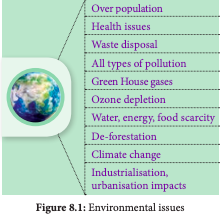
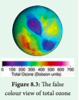

  
```

**Learning Objectives** 
The learner will be able to,

- Understand the importance of growing more plants to mitigate the environmental problems.

- Distinguish between the importance and conservation of endemic and endangered species.

- Appreciate the use of technologies for agriculture and forestry.

- Participate in community activities to improve environmental conditions.

- Develop methods in conservation of water and plants for sustainable development.

- Get acquainted with satellite technology and utilising it in our daily life needs

```


After understanding the structure and functions of major ecosystems of the world, now student community should observe and understand environmental problems of their surroundings at local, national and international level.

Now we are going to understand some of the environmental issues such as



Environmental issues are the problems and harmful effects created by human’s unmindful activity and over utilisation of valuable resources obtained from the nature (environment). Student should understand not only the environmental issues we are facing now, but also find solutions to rectify or reduce these problems.

Countries of the world agree that something needs to be done about these important environmental issues. Many global summits, conferences and conventions are regularly conducted by the United Nations and many steps are taken to minimise human-induced issues by signing agreements with around 150 countries.


```

##Activity 1

Students may form ‘ECOGROUPS’ and discuss eco-issues of their premises and find solutions to the existing problems like, litter disposal, water stagnation, health and hygiene, greening the campus and its maintenance.

```

Drastic increase in population resulted in demand for more productivity of food materials, fibres, fuels which led to many environmental issues in agriculture, land use modifications resulting in loss of biodiversity, land degradation, reduction in fresh water availability and also resulting in man-made global warming by green house gases even altering climatic conditions.

## Green House effect and Global Warming

Green House Effect is a process by which radiant heat from the sun is captured by gases in the atmosphere that increase the temperature of the earth ultimately. The gases that capture heat are called **Green House Gases** which include carbon dioxide (CO_2), methane (CH_4), Nitrous Oxide (N_2O) and a variety of manufactured chemicals like chlorofluorocarbon (CFC). Increase in greenhouse gases lead to irreversible changes


in major ecosystems and climate patterns. For example, coral ecosystem is affected by increase in temperature, especially **coral bleaching** observed in Gulf of Mannar, Tamil Nadu. 

**Human activities lead to produce the green house effect by**

- Burning fossil fuels, which releases CO_2 and CH_4

- Way of Agriculture and animal husbandry practices

- Electrical gadgets like refrigerator and air conditioners release chloro fluoro carbons

- The fertilizers used in Agriculture which release N<sub>2</sub>o

- The emissions from automobiles. The increase in mean global temperature (highest in 4000 years) due to increased concentration of green house gases is called **global warming.** One of the reasons for this is over population which creates growing need for food, fibre and fuel and considered to be the major cause of global warming.

```

Clouds and Dust particles can also produce Green House effect. That is why clouds, dusts and humid nights are warmer than clear dust free dry nights.


```

### Effects of Global Warming

- Rise in global temperature which causes sea levels to rise as polar ice caps and glaciers begin to melt causing submergence of many coastal cities in many parts of the world.

- There will be a drastic change in weather patterns bringing more floods or droughts in some areas.

- Biological diversity may get modified, some species ranges get redefined. Tropics and sub-tropics may face the problem of decreased food production.

### Sources of Green House Gases Emission (Natural and Anthropogenic)

**CO_2 (Carbon dioxide)** 

- Coal based power plants, by the burning of fossil fuels for electricity generation. 

- Combustion of fuels in the engines of automobiles, commercial vehicles and air planes contribute the most of global warming.

- Agricultural practices like stubble burning result in emission of CO_2.

- Natural from organic matter, volcanoes, warm oceans and sediments.

**Methane** 

Methane is 20 times as effective as CO_2 at trapping heat in the atomosphere. Its sources are attributed paddy cultivation, cattle rearing, bacteria in water bodies, fossil fuel production, ocean, non-wetland soils and forest / wild fires. 

**N_2O (Nitrous oxide)** 

It is naturally produced in Oceans from biological sources of soil and water due to microbial actions and rainforests. Man-made sources include nylon and nitric acid production, use of fertilizers in agriculture, manures cars with catalytic converter and burning of organic matter.

```

**Global Warming Effects on Plants** 

- Low agricultural productivity in tropics

- Frequent heat waves (Weeds, pests, fungi need warmer temperature)

- Increase of vectors and epidemics 

- Strong storms and intense flood damage

- Water crisis and decreased irrigation 

- Change in flowering seasons and pollinators 

- Change in Species distributional ranges 

- Species extinction

```

### Strategies to deal with Global Warming

- Increasing the vegetation cover, grow more trees 

- Reducing the use of fossil fuels and green house gases

- Developing alternate renewable sources of energy

- Minimising uses of nitrogeneous fertilizers, and aerosols.

###  Ozone depletion

Ozone layer is a region of Earth’s stratosphere that absorbs most of the Sun’s ultra violet radiation. The ozone layer is also called as the ozone shield and it acts as a protective shield, cutting the ultra- violet radiation emitted by the sun.

Just above the atmosphere there are two layers namely troposphere (the lower layer) and stratosphere (the upper layer). The ozone layer of the troposphere is called **bad ozone** and the ozone layer of stratosphere is known as **good ozone** because this layer acts as a shield for absorbing the UV radiations coming from the sun which is harmful for living organisms causing DNA damage. The thickness of the ozone column of air from the ground to the top of the atmosphere is measured in terms of **Dobson Units**.


Ozone is a colourless gas, reacts readily with air pollutants and cause rubber to crack, hurt plant life, damages lung tissues. But ozone absorbs harmful ultra violet β (uv-β) and UV – α radiation from sunlight. What is Dobson Unit? DU is the unit of measurement for total ozone. One DU (0.001 atm. cm) is the number of molecules of ozone that would be required to create a layer of pure ozone 0.01 millimetre thick at a temperature of 0° C and a pressure of 1 atmosphere (atm = the air pressure at the surface of earth). Total ozone layer over the earth surface is 0.3 centrimetres (3 mm) thick and is written as 300 DU. The false colour view of total ozone - The purple and blue colours are where there is the least ozone, and the yellows and reds are where there is more ozone.



The ozone shield is being damaged by chemicals released on the Earth’s surface notably the chlorofluorocarbons widely used in refrigeration, aerosols, chemicals used as cleaners in many industries. The decline in the thickness of the ozone layer over restricted area is called **Ozone hole.**

```

September 16 is WORLD OZONE DAY

```

Ozone depletion in the stratosphere results in more UV radiations especially UV B radiations (shortwaves). UV B radiation destroys biomolecules (skin ageing) and damages living tissues. UV – C is the most damaging type of UV radiation, but it is completely filtered by the atmosphere (ozone layer). UV – a contribute 95% of UV radiation which causes tanning burning of skin and enhancing skin cancer. Hence the uniform ozone layer is critical for the wellbeing of life on earth.

During 1970’s research findings indicated that man-made chlorofluorocarbons (CFC) reduce and convert ozone molecules in the atmosphere. The threats associated with reduced ozone pushed the issue to the forefront of global climate issues and gained promotion through organisation such as World Meterological Organisation and the United Nations. The Vienna Convention was agreed upon at the Vienna conference of 1985 but entered into force in 1988 provided the frameworks necessary to create regulative measures in the form of the Montreal protocol. The International treaty called the **Montreal Protocol** (1987) was held in Canada on **substances that deplete ozone layer** and the main goal of it is gradually eliminating the production and consumption of ozone depleting substances and to limit their damage on the Earth’s ozone layer.

**Clean Development Mechanism** (CDM) is defined in the Kyoto protocol (2007) which provides project based mechanisms with two objectives to prevent dangerous climate change and to reduce green house gas emissions. CDM projects helps the countries to reduce or limit emission and stimulate sustainable development.

An example for CDM project activity, is replacement of conventional electrification projects with solar panels or other energy efficient boilers. Such projects can earn Certified Emission Reduction (CER) with credits / scores, each equivalent to one tonne of CO2, which can be counted towards meeting Kyoto targets.


**Plant indicators** 

The presence or absence of certain plants indicate the state of environment by their response. The plant species or plant community acts as a measure of environmental conditions, it is referred as biological indicators or phytoindicators or plant indicators.
Examples

|    | Plants                                      | Indicator for                                |
|----|---------------------------------------------|----------------------------------------------|
| 1. | Lichens, Ficus, Pinus,   <br>Rose<br>       | SO2 pollution                                |
| 2. | Petunia,<br>Chrysanthemum                   | Nitrate                                      |
| 3. | Gladiolus                                   | Flouride<br>pollution                        |
| 4. | Robinia pseudoacacia<br>(Black locust tree) | Indicator of<br>heavy metal<br>contamination |


### Effects of Ozone depletion

The main ozone depletion effects are: 

- Increases the incidence of cataract, throat and lung irritation and aggravation of asthma or emphysema, skin cancer and diminishing the functioning of immune system in human beings.

- Juvenile mortality of animals. - Increased incidence of mutations.

- In plants, photosynthetic chemicals will be affected and therefore photosynthesis will be inhibited. Decreased photosynthesis will result in increased atmospheric CO_2 resulting in global warming and also shortage of food leading to food crisis.

- Increase in temperature changes the climate and rainfall pattern which may result in flood / drought, sea water rise, imbalance in ecosystems affecting flora and fauna.

## Forestry

### Agro forestry
 
Agroforestry is an integration of trees, crops and livestock on the same plot of land. The main objective is on the interaction among them . Example: intercropping of two or more crops between different species of trees and shrubs, which results in higher yielding and reducing the operation costs. This intentional combination of agriculture and forestry has varied benefits including increased bio-diversity and reduced erosion.

Some of the major species cultivated in commercial Agroforestry include _Casuarina, Eucalyptus_, Malai Vembu, Teak and Kadambu trees which were among the 20 species identified as commercial timber. They are of great importance to wood-based industries. 

**Benefits of agroforestry** 

- It is an answer to the problem of soil and water conservation and also to stabilise the soil (salinity and water table) reduce landslide and water run-off problem.

- Nutrient cycling between species improves and organic matter is maintained.

- Trees provide micro climate for crops and maintain O2 – CO2 balanced, atmospheric temperature and relative humidity.

- Suitable for dry land where rainfall is minimum and hence it is a good system for alternate land use pattern.

- Multipurpose tree varieties like _Acacia_ are used for wood pulp, tanning, paper and firewood industries.

- Agro-forestry is recommended for the following purposes. It can be used as Farm Forestry for the extension of forests, mixed forestry, shelter belts and linear strip plantation.

**Rehabilitation of degraded forests and recreation forestry** 

The production of woody plants combined with pasture is referred to **silvopasture** system. The trees and shrubs may be used primarily to produce fodder for livestock or they may be grown for timber, fuel wood and fruit or to improve the soil.

 This system is classified into following categories. 
 
 - **Protein Bank:** In this various multipurpose trees are planted in and around farm lands and range lands mainly for fodder production.

**Example:** _Acacia nilotica, Albizzia lebbek, Azadirachta indica, Gliricidia sepium, Sesbania grandiflora._

- **Livefence of fodder trees and hedges:** Various fodder trees and hedges are planted as live fence to protect the property from stray animals or other biotic influences. **Example:** _Gliricidia sepium, Sesbania grandiflora, Erythrina spp., Acacia spp.._

### Social forestry
 
 It refers to the sustainable management of forests by local communities with a goal of climate carbon sequestration, change mitigation, depollution, deforestation, forest restoration and providing indirect employment opportunity for the youth. Social forestry refers to the management of forests and afforestation **on barren lands** with the purpose of helping the environmental, social and rural development and benefits. Forestry programme is done for the benefit of people and participation of the people. Trees grown outside forests by government and public organisation reduce the pressure on forests.


In order to encourage tree cultivation outside forests, **Tree cultivation in Private Lands** was implemented in the state from 2007-08 to 2011- 12. It was implemented by carrying out block planting and inter-crop planting with profitable tree species like Teak, _Casuarina, Ailanthus_, Silver Oak, etc. in the farming lands and by a free supply of profitable tree species for planting in the bunds. The Tank foreshore plantations have been a major source of firewood in Tamil Nadu. The 32 Forestry extension centres provide technical support for tree growing in rural areas in Tamil Nadu. These centres provide quality tree seedlings like thorn / thornless bamboo, _casuarinas_, teak, neem, _Melia dubia_, grafted tamarind and nelli, etc. in private lands and creating awareness among students by training / camps.

### Major activities of forestry extension centres
- Training on tree growing methods 

- Publicity and propaganda regarding tree growing 

- Formation of demonstration plots 

- Raising and supply of seedlings on subsidy 

- Awareness creation among school children and youth about the importance of forests through training and camps.

## Deforestation
 Deforestation is one of the major contributors to enhance green house effect and global warming. The conversion of forested area into a non-forested area is known as deforestation. Forests provide us many benefits including goods such as timber, paper, medicine and industrial products. The causes are 
 
 - The conversion of forests into agricultural plantation and     livestock ranching is a major cause of deforestation. 
 
 - Logging for timber - Developmental activities like road construction, electric tower lines and dams. 
 
 - Over population, Industrialisation, urbanisation and increased global needs. 
 
 **Effects of deforestation** 
 
 - Burning of forest wood release stored carbon, a negative impact just opposite of carbon sequestration.

- Trees and plants bind the soil particles. The removal of forest cover increases soil erosion and decreases soil fertility. Deforestation in dry areas leads to the formation of deserts.

- The amount of runoff water increases soil erosion and also creates flash flooding, thus reducing moisture and humidity.

- The alteration of local precipitation patterns leading to drought conditions in many regions. It triggers adverse climatic conditions and alters water cycle in ecosystem.

- It decreases the bio-diversity significantly as their habitats are disturbed and disruption of natural cycles.

- Loss of livelihood for forest dwellers and rural people. 

- Increased global warming and account for one-third of total CO2 emission.

- Loss of life support resources, fuel, medicinal herbs and wild  edible fruits.

## Afforestation
 Afforestation is planting of trees where there was no previous tree coverage and the conversion of non-forested lands into forests by planting suitable trees to retrieve the vegetation. Example: Slopes of dams afforested to reduce water run- off, erosion and siltation. It can also provide a range of environmental services including carbon sequestration, water retention.

```

**The Man who Single Handedly Created a Dense Forest Jadav "Molai" Payeng** (born 1963) is an environmental activist has single-handedly planted a forest in the middle of a barren wasteland. This Forest Man of India has transformed the world’s largest river island, Majuli, located on one of India’s major rivers, the Brahmaputra, into a dense forest, home to rhinos, deers, elephants, tigers and birds. And today his forest is larger than Central Park.

Former vice-chancellor of Jawahar Lal Nehru University, Sudhir Kumar Sopory named Jadav Payeng as **Forest Man of India**, in the month of October 2013. He was honoured at the Indian Institute of Forest Management during their annual event ‘Coalescence’. In 2015, he was honoured with Padma Shri, the fourth highest civilian award in India. He received honorary doctorate degree from Assam Agricultural University and Kaziranga University for his contributions.

```

**Afforestation Objectives** 

- To increase forest cover, planting more trees, increases O2 production and air quality. 
- Rehabilitation of degraded forests to increase carbon fixation and reducing CO2 from atmosphere.
- Raising bamboo plantations. - Mixed plantations of minor forest produce and medicinal plants. 
- Regeneration of indigenous herbs / shrubs. 
- Awareness creation, monitoring and evaluation. 
- To increase the level and availability of water
table or ground water and also to reduce nitrogen leaching in soil and nitrogen contamination of drinking water, thus making it pure not polluted with nitrogen.
- Nature aided artificial regeneration.

**Achievements** 

- Degraded forests were restored 
- Community assets like overhead tanks bore-wells, hand pumps, community halls, libraries, etc were established
- Environmental and ecological stability was maintained.
- Conserved bio-diversity, wildlife and genetic resources.
- Involvement of community especially women in forest management.

```
Case study

**Tamil Nadu Afforestation Project (TAP)** With an aim of ecological restoration and biological up-gradation of degraded forests and other lands, the government of Tamil Nadu launched the project in 2 phases Tap I (1997-2005). It aimed to uplift the quality and life of villagers abutting forest areas and to resolve the degraded forests in Tamil Nadu. This is a massive Joint Forest Management Programme. TAP II (2005- 2013) had 2 main objectives. - To restore the ecological equilibrium of the forests, watersheds and adjacent villages of Tamil Nadu. - To improve the quality of the life of inhabitants through reforestation, water conservation and sustained community action.

A. Check Dam B. Percolation pond 

A B

## Agrochemicals and their effects
 An agro-chemical is useful in managing agriculture or in farming area which is one of the major issues of the environment. Agro-


  


chemicals includes **fertilizers, liming and acidifying agents, soil conditioners, pesticides and chemicals** used in animal husbandry, such as antibiotics and hormones.

Excessive use of fertilizers and pesticides leads to the contamination of groundwater and makes it nonpotable, ultimately affecting the soil fertility. Most of the chemical fertilizers contain varying amounts of nitrogen, phosphorous, potassium and nutrients that plants need to grow. Soil acidity influences C and N cycles by affecting soil microbes, also green house gas flux in soils and affect bio availability of N, P, S like major nutrients. This makes the soil too acidic or alkaline so that it becomes difficult for the plants to survive. These residues and synthetic chemicals like DDT (dichloro diphenyl trichloro ethane) and PCBs (polychlorinated biphenyls) cause nutrient and pH imbalance and quality reduction of agricultural produce. This problem can be minimised by sustainable agriculture. Pesticides increase incidence of brain, blood cancer and neurotoxicity, Parkinson like symptoms, infertility, birth defects, reproductive and behavioural disorders.
- Nitrates from fertilizers interact with the haemoglobin to form methyl haemoglobin. This reduces oxygen uptake,

results in Blue baby syndrome (cyanosis) and hypoxia. Nitrates vasodilate and reduce blood pressure. - Bio-magnification: Pollutants, toxic substances increase in water move from one food chain to many and finally reach human being and this process of bio-amplification or increase in concentration is called bio-magnification.

## Alien invasive species
 Invasion of alien or introduced species disrupts ecosystem processes, threaten biodiversity,

reduce native herbs, thus reducing the ecosystem services (benefits). During eradication of these species, the chemicals used increases greenhouse gases. Slowly they alter ecosystem, micro climate and nature of soil and make it unsuitable for native species and create human health problems like allergy, thus resulting in local environmental degradation and loss of important local species.

According to World Conservation Union invasive alien species are the second most significant threat to bio-diversity after habitat loss. **What is invasive species?** A non-native species to the ecosystem or country under consideration that spreads naturally, interferes with the biology and existence of native species, poses a serious threat to the ecosystem and causes economic loss.

It is established that a number of invasive species are accidental introduction through ports via air or sea. Some research organisations import germplasm of wild varieties through which also it gets introduced. Alien species with edible fruits are usually spread by birds.

Invasive species are fast growing and are more adapted. They alter the soil system by changing litter quality thereby affecting the soil community, soil fauna and the ecosystem processes.

It has a negative impact on decomposition in the soils by causing stress to the neighbouring native species. Some of the alien species which cause environmental issues are discussed below

**_Eichhornia crassipes_** It is an invasive weed native to South America. It was introduced as aquatic ornamental plant, which grows faster throughout the year. Its widespread growth is


  


a major cause of biodiversity loss worldwide. It affects the growth of phytoplanktons and finally changing the aquatic ecosystem.

It also decreases the oxygen content of the waterbodies which leads to eutrophication. It poses a threat to human health because it creates a breeding habitat for disease causing mosquitoes (particularly _Anopheles_) and snails with its free floating dense roots and semi submerged leaves. It also blocks sunlight entering deep and the waterways hampering agriculture, fisheries, recreation and hydropower.

**_Lantana camara_** Identified as one of the worst invasive species by Global Invasive Species Database. It is also an invasive weed native to South America introduced as ornamental plant. It occupies a widely adaptable range of habitats.

This species is spread by birds It exerts allelopathic effect, which reduces the growth of surrounding plants by inhibiting germination and root elongation. Root removal and bio- control are the best methods to control. Now tribes are trained to use the stem as fibre for making household materials like baskets, furniture and even cots.

**_Parthenium hysterophorus_** _Parthenium hysterophorus_ native to South America introduced accidently into many regions of the world along with imported food grains. It is a harmful weed in the forest which suppresses the growth of native species and reduces the availability of fodder for animals

It infests pastures and farmland causing often loss of yield. The plant produces allelopathic chemicals that suppress crop and native plants and its pollen causes allergic rhinitis and asthma, dermatitis in humanbeing.

**_Prosopis juliflora_** _Prosopis juliflora_ is an invasive species native to Mexico and South America. It was first introduced in Gujarat to counter d e s e r t i f i c a t i o n and later on in Andhra Pradesh, Tamil Nadu as a source of firewood. It is an aggressive coloniser and as a consequence the habitats are rapidly covered by this species. Its invasion reduced the cover of native medicinal herbaceous species. It is used to arrest wind erosion and stabilize sand dunes on coastal and desert areas. It can absorb hazardous chemicals from soil and it is the main source of charcoal.

## Conservation
 India due to its topography, geology and climate patterns has diverse life forms. Now this huge diversity is under threat due to many environmental issues for this conservation becomes an important tool by which we can reduce many species getting lost from our native land. By employing conservation management strategies like germplasm conservation, in situ, ex-situ, in-vitro methods, the endemic as well as threatened species can be protected

**In-situ conservation** It means conservation and management of genetic resources in their natural habitats. Here the plant or animal species are protected within the existing habitat. Forest trees, medicinal and aromatic plants under threat are conserved by this method. This is carried out by the


  


community or by the State conservation which include wildlife, National park and Biosphere reserve. The ecologically unique and biodiversity rich regions are legally protected as wildlife sanctuaries, National parks and Biosphere reserves. Megamalai, Sathyamangalam wildlife, Guindy and Periyar National park, and Western ghats, Nilgiris, Agasthyamalai and Gulf of Mannar are the biosphere reserves of Tamil Nadu.

**Sacred groves** These are the patches or grove of cultivated trees which are community protected and are based on strong religious belief systems which usually have a significant religious connotation for protecting community. Each grove is an abode of a deity mostly village God Or Goddesses like Aiyanar or Amman. 448 grooves were documented throughout Tamil Nadu, of which 6 groves (Banagudi shola, Thirukurungudi and Udaiyankudikadu, Sittannnavasal, Puthupet and Devadanam) were taken up for detailed floristic and faunistic studies. These groves provide a number of ecosystem services to the neighbourhood like protecting watershed, fodder, medicinal plants and micro climate control.

**Ex-situ conservation** It is a method of conservation where species are protected outside their natural environment. This includes establishment of botanical gardens, zoological parks, conservation strategies such as gene, pollen, seed, in-vitro conservation, cryo preservation, seedling, tissue culture and DNA banks. These facilities not only provide housing and care for endangered species, but also have educational and recreational values for the society

### International Union for Conservation of Nature (IUCN)
 Founded in 1948, the International Union for Conservation of Nature (IUCN) is the world’s oldest environmental organisation with its headquarters at Gland, Switzerland. It is a neutral forum for Governments, NGO’s, Scientists, business and local communities with the aim of developing solution and implementing policies related to the conservation of environment and sustainable development.

**IUCN Red List** IUCN Red List categories help us to evaluate the degree of threat and conservation priorities to the flora and fauna It is also a powerful tool for

**Bio-diversity Conservation**

In-situ Ex-situ

Protected area network

Sacred plants home gardens

Seed banks, Pollen banks, Field gene, Cryopreservation

Botanical gardens Arboreta, Zoological

parks, Aquaria Community

Protected Government

Protected

Sacred groves Sacred lakes Biosphere

Reserves National parks Wildlife Sanctuaries

Terrestial Marine


  


A - Population reduction B - Geographic range C - Small population size and decline D - Very small or restricted population E - Quantitative analysis

Erlinct (Ex)

Adequate data

Ex tin

ct io

n ris

k

+

–

Evaluated

All species

Extinct in the wild (EW)

Threatened species

Critically endangered

Endangered EN

Vulnerable VU

Near threatened (NT)

Least concerned (LC)

Data Deficient (DD)

Not evaluated (NE)


**IUCN Red List categories Extint (EX)** A taxon is Extinct when there is no reasonable doubt on the death of the last individual. A taxon is presumed Extinct when exhaustive surveys in known and/or expected habitat, at appropriate times (diurnal, seasonal, annual), throughout its historic range have failed to record an individual. Example: _Neuracanthus neesianus_.

**Extinct in the wild (EW)** A taxon is Extinct in the Wild when it is known only to survive in cultivation, in captivity or as a naturalised population (or populations) well outside the past range. Example: _Ginkgo biloba_

**Critically endangered (CR)** A taxon is Critically Endangered when the best available evidence indicates that it meets any of the criteria A to E for Critically Endangered, and it is therefore considered to be facing an extremely high risk of extinctions in the wild. Example: _Euphorbia santapaui, Piper barberi, Syzygium gambelianum._

**Conservation movement** A community level participation can help in preservation and conservation of our environment. Our environment is a common treasure for all the living organisms on earth. Every individual should be aware of this and participate actively in the programs meant for the conservation of the local environment. Indian history has witnessed many people movements for the protection of environment.

**Chipko Movement** The tribal women of Himalayas protested against the exploitation of forests in 1972. Later on it transformed into **Chipko Movement** by **Sundarlal Bahuguna** in Mandal village of Chamoli district in 1974. People protested by hugging trees together which were felled by a sports goods company. Main features of Chipko movement were, - This movement remained non political - It was a voluntary movement based on

Gandhian thought. - It was concerned with the ecological balance

of nature - Main aim of Chipko movement was to give a

slogan of five F’s – Food, Fodder, Fuel, Fibre and Fertilizer, to make the communities self sufficient in all their basic needs.

**Appiko Movement** The famous Chipko Andolen of Uttarakhand in the Himalayas inspired the villagers of Uttara Karnataka to launch a similar movement to save their forests. This movement started in Gubbi Gadde a small village near Sirsi in Karnataka by Panduranga Hegde. This movement started to protest against felling of trees, monoculture, forest policy and deforestation.

persuading governments to protect threatened species and for most of the plant and animal species world-wide. IUCN has developed protected areas and developed criteria for threatened species. The criteria are as follows .


**Endangered (EN)** A taxon is Endangered when the best available evidence indicates that it meets any of the criteria A to E for Endangered, and it is therefore considered to be facing a very high risk of extinction in the wild. Example: _Elaeocarpus venustus, Pogostemon nilagricus, Eugenia singampattiana._

**Vulnerable (VU)** A taxon is Vulnerable when the best available evidence indicates that it meets any other criteria A to E for Vulnerable, and it is therefore considered to be facing a high risk of extinction in the wild. Example: _Dalbergia latifolia, Santalum album, Chloroxylon sweitenia_

**Near threatened (NT)** A taxon is Near Threatened when it has been evaluated against the criteria but does not qualify for Critically Endangered, Endangered or Vulnerable now, but is close to qualifying for or is likely to qualify for threatened category in the near future.

**Least concerned (LC)** A taxon is Least Concerned when it has been evaluated against the criteria and does not qualify for Critically Endangered, Endangered, Vulnerable or Near Threatened, Widespread and abundant taxa are included in this category.

**Data deficient (DD)** A taxon is Data Deficient when there is inadequate information to make a direct, or indirect, assessment of the risk of extinction based on its distribution and/or population status.

**Not evaluated (NE)** A taxon is Not Evaluated when it has not yet been evaluated against the criteria.

### Endemic Centres and Endemic Plants
 Endemic species are plants and animals that exist only in one geographic region. Species can be endemic to large or small areas of the earth. Some are endemic to a particular continent, some to a part of a continent and others to a single island.

Any species found restricted to a specified geographical area is referred to as ENDEMIC.. It may be due to various reasons such as isolation, interspecific interactions, seeds dispersal problems, site specificity and many other environmental and ecological problems. There are 3 Megacentres of endemism and 27 microendemic centres in India. Approximately one third of Indian flora have been identified as endemic and found restricted and distributed in three major phytogeographical regions of india, that is Indian Himalayas, Peninsular India and Andaman nicobar islands. Peninsular India, especially Western Ghats has high concentration of endemic plants. _Hardwickia_ _binata_ and _Bentinckia condapanna_ are good examples for endemic plants. A large percentage of Endemic species are herbs and belong to families such as Poaceae. Apiaceae, Asteraceae and Orchidaceae. **Endemic plants Habit Name of endemic centre** _Baccaurea courtallensis_

Tree Southern Western Ghats

_Agasthiyamalaia pauciflora_

Tree Peninsular india

_Hardwickia binata_

Tree Peninsular and northern India

_Bentinckia condappana_

Tree Western ghats of Tamil Nadu and kerala

_Nepenthes khasiyana_

Liana Khasi hills, Meghalaya

**Table 1:** Endemic plants Majority of endemic species are threatened due to their narrow specific habitat, reduced seed production, low dispersal rate, less viable nature and human intereferences.. Serious efforts need to be undertaken for their conservation, otherwise these species may become globally extinct.


  


**ba**

## Carbon Capture and Storage (CCS)
 Carbon capture and storage is a technology of capturing carbondioxide and injects it deep into the underground rocks to a depth of 1 km or more and it is an approach to mitigate global warming by capturing CO2 from large point sources such as industries and power plants and subsequently storing it instead of releasing it into the atmosphere. Various safe sites have been selected for permanent storage in various deep geological formations, liquid storage in the Ocean and solid storage by reduction of CO2 with metal oxide to produce stable carbonates. It is also known as Geological sequestration which involves injecting CO2 directly into the underground geological formations (such as declining oil fields, gas fields saline aquifers and unmineable coal have been suggested as storage sites).

**Carbon Sequestration** Carbon sequestration is the process of capturing and storing CO2 which reduces the amount of CO2 in the atmosphere with a goal of reducing global climate change. Carbon sequestration occurs naturally by plants and in ocean. Terrestrial sequestration is typically accomplished through forest and soil conservation practices that enhance the storage carbon. As an example microalgae such as species of _Chlorella_, _Scenedesmus_, _Chroococcus_ and _Chlamydomonas_ are used globally for CO2 sequestration. Trees like _Eugenia caryophyllata_, _Tecoma stans_, _Cinnamomum verum_ have high capacity and noted to sequester carbon. Macroalgae and marine grasses and mangroves are also have ability to mitigate carbon-di-oxide.

**Carbon Foot Print (CFP)** Every human activity leaves a mark just like our footprint. This Carbon foot print is the

0 1 2 3 4 5 6 7

**EAT SMART** Your food choices affect the climate

Lentils

Tomatos

Beans Broccoli Yoghurt Nuts Peanut butter Rice Potatoes

Egg Fish Chicken

Solman fish, Pork Cheese

Beef & Lamb

**Protein good choice of fibre & nutrient**

**Veggies, fruits low in fat and colorie high in nutrient**

**Organic, high protein, good fat, more nutritions conventional foods**

**Organic rich omega**

**Processed food.**

**Processed food. CARBON FOOTPRINT**

Different foods have a different impacts.Here’s how the green house gas emissions (GHGs) of twenty common foods compare.

Highest carbon foot print.

**car miles driven per 4oz(118.29 ml). consumed**


**Carbon Sink** Any system having the capacity to accumulate more atmospheric carbon during a given time interval than releasing CO2. Example: forest, soil, ocean are natural sinks. Landfills are artificial sinks.


  


total amount of green house gases produced by human activities such as agriculture, industries, deforestation, waste disposal, buring fossil fuels directly or indirectly. It can be measured for an individual, family, organisation like industries, state level or national level. It is usually estimated and expressed in equivalent tons of CO2 per year. The burning of fossil fuels releases CO2and other green house gases. In turn these emissions trap solar energy and thus increase the global temperature resulting in ice melting, submerging of low lying areas and inbalance in nature like cyclones, tsunamis and extreme weather conditions. To reduce the carbon foot print we can follow some practices like (i) Eating indigenous fruits and products (ii) Reducing use of electronic devices (iii) Reduce travelling (iv) Avoid buying fast and preserved, processed, packed foods. (v) Plant a garden (vi) Reducing consumption of meat and sea food. Poultry requires little space, nutrients and less pollution compared cattle farming. (vii) reducing use of Laptops (when used for 8 hours, it releases nearly 2 kg. of CO2 annually) (viii) Line drying clothes. (Example: If you buy imported fruit like kiwi, indirectly it increases CFP. How? The fruit has travelled a long distance in shipping or airliner thus emitting tons of CO2)

**Biochar Biochar** is another long term method to store carbon. To increase plants ability to store more carbon, plants are partly burnt such as crop waste, waste woods to become carbon rich slow decomposing substances of material called Biochar. It is a kind of charcoal used as a soil amendment. Biochar is a stable solid, rich in carbon and can endure in soil for thousands of years. Like most charcoal, biochar is made from biomass via pyrolysis. (Heating biomas in low oxygen environment) which arrests wood from complete burning. Biochar thus has the potential to help mitigate climate change via carbon sequestration. Independently, biochar when added to soil can increase soil fertility of

acidic soils, increase agricultural productivity, and provide protection against some foliar and soil borne diseases. It is a good method of preventing waste woods and logs from getting decayed and instead we can convert them into biochar thus converting them to carbon storage material.

## Rain water harvesting – RWH (Solution to water crisis – A ecological problem)

Rain water canal

Over flow pipe to

well

Drain pipe

Sand filter

Water tank

Well **Rainwater harvesting in individual house**


**Water storage tank** The water is then supplied to flats, which can be used for domestic purposes

**Rainwater inlet** The rainwater that collects on the terrace makes its way down a pipe

**Collection tank** A fitted sensor then sends the water to the tank

**Suction tank** A filter placed in the tank clears the water of impurities


  


Rainwater harvesting is the accumulation and storage of rain water for reuse in-site rather than allowing it to run off. Rainwater can be collected from rivers, roof tops and the water collected is directed to a deep pit. The water percolates and gets stored in the pit. RWH is a sustainable water management practice implemented not only in urban area but also in agricultural fields, which is an important economical cost effective method for the future.

### Environmental benefits of Rain Water Harvesting:
 - Promotes adequacy of underground water

and water conservation. - Mitigates the effect of drought. - Reduces soil erosion as surface run-off is

reduced. - Reduces flood hazards. - Improves groundwater quality and water

table / decreases salinity. - Avoid land wastage for storage purpose and

no population displacement is involved. - Stores water underground as an eco-friendly

measure and is a part of sustainable water storage strategy for local communities.

### Importance of Lakes
 Water bodies like lakes, ponds not only provide us a number of environmental benefits but they strengthen our economy as well as our quality of life like health. Lakes as a storage of rain water provide drinking water, improves ground water level and preserve the fresh water bio-diversity and habitat of the area where it occurs.

In terms of services lakes offer sustainable solutions to key issues of water management and climatic influences and benefits like nutrient retention, influencing local rainfall, removal of pollutants, phosphorous and nitrogen and carbon sequestration.

**Important lakes in Tamil Nadu** Lakes are man-made surface water harvesting systems. They are useful for irrigation, drinking, fishing and recreation purposes. It is the responsibility of the individuals as well as communities collectively to maintain and manage water bodies. Understanding catchment areas help us to halt the degradation of water bodies and protecting it from getting polluted. **Sholavaram Lake :** I**t** is located in Ponneri Taluk of Thiruvallur District. It is one of the rain fed reservoir from where water is drawn for supply to Chennai city. The full capacity of the lake is 65.5 ft. Built in the British era this lake is responsible for treating the guests to water sports too. This lake is rich in varied species of flora and fauna. **Chembarampakkam Lake:** I**t** is located about 25 km. from Chennai. This lake is 500 yrs old. This lake is a rain fed water body which aids the Chennai City in its water supply. A river named Adyar also incepts from this lake which acts as the primary outflow for this reservoir. This lake is spread over an area of 15 square km. **Maduranthakam Lake:** It is located in Kancheepuram district and it is a man-made creation. An ideal spot for an evening picnic, the widespread pristine waters of the lake are an exceptionally calming sight. The full capacity of the reservoir is 23.3ft. Kiliyar is a small river that originates from Madhuranthagam reservoir. It spreads to an area of 2908 acres and was built by Uttama Chola and the boundaries (stretched upto 12960 feet) are strengthened by Britishers with a storing capacity of 690 million cu.feet. Rain water from Cheyyar, Thiruvannamalai and Vandavasi reaches this lake.


  


## Sewage disposal
 Sewage disposal treatment helps to transform raw sewage into an easier manageable waste and to retrieve and reuse treated residual sewage materials. Greenhouse gases like carbon-dioxide, methane, nitrous oxide are produced during sewage treatment which apart from causing the impact on the atmosphere, it also affect the urban ecosystem, aquatic ecosystems. By making use of advanced disposal treatment plants, climate change and pollution can be minimised.

Sewage is waste matter such as faeces or used dirty water from homes and factories, which flows away through sewers. Sewage treatment is the process of removing contaminants from waste water, primarily from household sewage. Physical, chemical and biological processes are used to remove contaminants and produce treated waste water, that is safer for the environment. Sewage contains large amounts of organic matter and microbes. This cannot be discharged into natural water bodies like rivers and streams directly. Hence sewage is treated in sewage treatment plants (STPs) to make it less

polluting. Sewage treatment generally involves three

stages, called primary, secondary and tertiary treatment. **Solid waste management** Solid waste refers to all non liquid wastes which causes health problems and unpleasant living environment leading to pollution. Solid waste management is a term that is used to refer to the process of collecting and treating solid wastes. It is all about how it can be changed and recycled as a valuable resource.

Methods of solid waste management includes Landfill, incineration, recovery, recycling, composting, and pyrolysis.
- T e c h n o l o g i c a l advancement for processing treatment and disposal of solid waste helps in converting it into renewable energy and organic manure. - Electronic waste contains toxic materials and are found to be non-biodegradable which causes threat to human health and the smoke during recycling and leaching causes great threat to water bodies. Agricultural landfills method stands a good method to reduce these problems.Figure 8.17: Sanitary landfill

Primary treatment

Raw sewage

Screens

Comminutor

Primary effluent

Primary clarifier

Grit chamber Grit disposal

Raw or primary sludge

Sludge treatement and disposal

Return sludge pump

Discharge to surface water

(or tertiary treatment if needed)

Activated sludge

Air compressor

Aeration tank Secondary clarifer

Disinfectant

Secondary effluent

Secondary treatment

**Figure 8.16: Sewage treatment plant process flow diagram**


  


**Liquid Waste Management** Liquid waste includes point source and non- point source discharges such as storm water and waste water. Examples of liquid waste include wash water from homes, liquids, used for cleaning in industries and waste detergents.

Grey water is the one from municipal waste which contains harmful pathogens. Water coming from domestic equipments other than toilets (bathtub, showers, sinks, and washing machine) is also referred as grey water. Municipal wastes can be detoxified biologically and then recycled. Domestic waste water can be recycled and used for gardening.

## Environmental Impact Assessment (EIA)
 Environmental Impact Assessment is an environmental management tool. It helps to regulate and recommend optimal use of natural resources with minimum impact on ecosystem and biotic communities. It is used to predict the environmental consequences of future proposed developmental projects (example: river projects, dams, highway projects) taking into account inter-related socio-economic, cultural and human-health impacts. It reduces environmental stress thus helping to shape the projects that may suit local environment by ensuring optimal utilization of natural resources and disposal of wastes to avoid environmental degradation. **The benefits of EIA to society** - A healthier environment - Maintenance of biodiversity - Decreased resource usage - Reduction in gas emission and environment

damage

### Biodiversity Impact Assessment (BIA)
 Biodiversity Impact Assessment can be defined as a decision supporting tool to help biodiversity inclusive of development, planning

and implementation. It aims at ensuring development proposals which integrate bio- diversity considerations. They are legally compliant and include mechanisms for the conservation of bio-diversity resources and provide fair and equitable sharing of the benefits arising from the use of bio-diversity.

**Biomonitoring** The act of observing and assessing the current state and ongoing changes in ecosystem, biodiversity components, landscape including natural habitats, populations and species. An agricultural drone is an unmanned aerial vehicle applied to farming in order to help increased crop production and monitor crop growth. Agricultural drones let farmers see their fields from the sky. This bird’s eye-view can reveal many issues such as irrigation problems, soil variation and pest and fungal infestations. It is also used for cost effective safe method of spraying pesticides and fertilizers, which proves very easy and non-harmful.


**Bio-diversity impacts can be assessed by** - Change in land use and cover - Fragmentation and isolation - Extraction - External inputs such as emissions, effluents

and chemicals - Introduction of invasive, alien or genetically

modified species - Impact on endemic and threatened flora and

fauna.

**8.12. Geographic Information System** GIS is a computer system for capturing, storing, checking and displaying data related to positions


  


on Earth’s surface. Also to manipulate, analyse, manage and present spacial or geographic data.

GPS is a satellite navigation system used to determine the ground position of an object. It is a **constellation** of approximately 30 well spaced satellites that orbit the earth and make it possible for the people with ground receivers to pinpoint their geographic location. Some applications in which GPS is currently being used for around the world include Mining, Aviation, Surveying Agricultural and Marine ecosystem. **Importance of GIS** - Environmental impact assessment - Disaster management - Zoning of landslide hazard - Determination of land cover and land use - Estimation of flood damage - Management of natural resources - Soil mapping - Wetland mapping - Irrigation management and identification of

volcanic hazard - Vegetation studies and mapping of

threatened and endemic species. **Remote Sensing** is the process of detecting and monitoring the physical characteristics of an area by measuring its reflected and emitted radiation at a distance from the targeted area. It is an tool used in conservation practices by giving exact picture and data on identification of even a single tree to large area of vegetation and wild life for classification of land use patterns and studies, identification of biodiversity rich or less areas for futuristic works on conservation and maintenance of various species including commercial crop, medicinal plants and threatened plants. **Specific uses** - Helps predicting favourable climate, for the

study of spreading of disease and controlling it.
- Mapping of forest fire and species distribution.
- Tracking the patterns of urban area development and the changes in Farmland or forests over several years
- Mapping ocean bottom and its resources

**Applications of Satellites**

**Name of the Satellites**

**Year of Launch Application**

SCATSAT – I Sep. 2016 Weather forecasting, cyclone prediction and tracking services in India

INSAT 3DR Sep. 2016 Disaster management

CARTOSAT – 2 Jan. 2018 Earth observation GSAT – 6A March

2018 Communication

CARTOSAT – 2 (100th Satellite)

Jan. 2018 To watch border surveillance

**Summary** Green house effect leads to climate change which results in global warming. Deforestation causes soil erosion, whereas Afforestation helps to restore vegetation and increases ground water table. Agrochemicals like fertilizers, pesticides and runoff from fields cause soil infertility and in turn depletes the growth of plants. Help the government to retrieve the vegetation. Regeneration of trees by Agroforestry is possible with the involvement of community and government. Help to conserve the flora and fauna in their natural habitat and man-made environments like zoological parks and national parks. IUCN is the oldest environmental organisation which protects endemic and threatened species. Mitigation of carbon in the atmosphere done in the form of sequestration. Rain water harvesting is done for improving the ground water table. Importance and location of lakes in Tamil Nadu which aids water supply to the city is a measure of conservation of drinking water. Assessment of Environment and Biodiversity helps to study risk analysis and disaster management. Forest cover is monitored through Remote sensing and GIS.


**Evaluation**

1\. Which of the following would most likely help to slow down the greenhouse effect.

a) Converting tropical forests into grazing land for cattle.

b) Ensuring that all excess paper packaging is buried to ashes.

**c) Redesigning landfill dumps to allow** methane to be collected.

d) Promoting the use of private rather than public transport.

2\. With respect to _Eichhornia_ Statement A: It drains off oxygen from water

and is seen growing in standing water. Statement B: It is an indigenous species of

our country. a) Statement A is correct and Statement B is

wrong. b) Both Statements A and B are correct. c) Statement A is correct and Statement B is

wrong. d) Both statements A and B are wrong.

3\. Find the wrongly matched pair. a) Endemism - Species confined to a

region and not found anywhere else.

b) Hotspots - Western ghats c) Ex-situ

Conservation - Zoological parks d) Sacred groves - Saintri hills of Rajasthan e) Alien sp.

Of India - Water hyacinth

4\. Depletion of which gas in the atmosphere can lead to an increased incidence of skin cancer?

a) Ammonia b) Methane c) Nitrous oxide d) Ozone

5\. One green house gas contributes 14% of total global warming and another contributes 6%. These are respectively identified as

a) N20 and CO2 b) CFCs and N20 c) CH4 and CO2 d) CH4 and CFCS

6\. One of the chief reasons among the following for the depletion in the number of species making endangered is

a) over hunting and poaching b) green house effect c) competition and predation d) habitat destruction

7\. Deforestation means a) growing plants and trees in an area where

there is no forest b) growing plants and trees in an area where

the forest is removed c) growing plants and trees in a pond d) removal of plants and trees

8\. Deforestation does not lead to a) Quick nutrient cycling b) soil erosion c) alternation of local weather conditions d) Destruction of natural habitat weather

conditions

9\. The unit for measuring ozone thickness a) Joule b) Kilos c) Dobson d) Watt

10\. The lake which was built in British era and is near the Indian Army Base

a) Veeranam lake b) Maduranthagam lake c) Sholavaram lake d) Chembrambakkam lake

11\. People’s movement for the protection of environment in Sirsi of Karnataka is

a) Chipko movement b) Amirtha Devi Bishwas movement c) Appiko movement d) None of the above

12\. The invasive species introduced in India from Philippines

a) Lantana b) Prosopis c) Parthenium d) Kappaphycus


  


13\. Cash crops like sesame and pearl millet are inhibited by the invasive plant

a) Kappaphycus b) Parthenium c) Lantana d) Prosopis

14\. The plants which are grown in silivpasture system are

a) Sesbania and Acacia b) Solenum and Crotalaria c) Clitoria and Begonia d) Teak and sandal

15\. IUCN red list categories has developed criteria for threatened species. The criteria ‘C’ refers to

a) Geographic range b) Quantitiative analysis c) Small population size and decline d) population reduction

16\. What is ozone hole?

17\. Give four examples of plants cultivated in commercial agroforestry.

18\. What are agrochemicals?

19\. Expand CCS.

20\. How do forests help in maintaining the climate?

21\. How do sacred groves help in the conservation of biodiversity?

22\. Which one gas is most abundant out of the four commonest greenhouse gases? Discuss the effect of this gas on the growth of plants?

23\. Distinguish between endangered, vulnerable and rare species.

24\. Suggest a solution to water crisis and explain its advantages.

25\. Explain afforestation with case studies.

26\. What are the effects of deforestation and benefits of agroforesty?

**Glossary Algae Blooms**: Sudden sprout of algae growth, which can affect the water quality adversely and indicate potentially hazardous changes in local water chemistry.

**Atmosphere**: A major regional community of plants and animals with similar life forms and environmental conditions.

**Biodegradable waste:** Organic waste, typically coming from a plant or animal sources, which other living organisms can break done.

**Biosphere: The portion of earth and its** atmosphere that can support life.

**Effluent: Liquid waste such as sewage and** liquid waste from industries.

**Landfill: A site that is specially designed to** dispose of waste and operates with a license granted by the Environmental Protection Agency (EPA).

**Oil spill: The harmful release of oil into the** environment, usually through water, which is very difficult to clean up and often kills, birds, fish and other wildlife.

**Radiation**: A form of energy that is transmitted in waves, rays or particles from a natural source such as the sun and the ground or an artificial source such as an X-ray machine.

**Radioactive**: A materials is said to be radioactive if it emits radiation.

**Recycle**:To break waste items done into their raw materials, which are then used to remake the original item or to make new items.

**Sewage**: Liquid waste from communities which may be a mixture of domestic effluent from homes, and liquid waste from industries.

**Sustainable development:** Development using hand of energy sources in a way that meets the needs of people today without reducing the ability in future generation to meet their own needs.


URL:

**https://play.google.com/store/apps/details?id=gov.nasa.jpl.earthnow.activity**

**ICT Corner**

**Environmental Issues**

**Step 2Step 1 Step 3 Step 4**

**Steps**
- Type the URL or scan the QR code to open the activity page. - Click on the satellite it displays the shape and activities of the satellite. - Click on the Vital Signs to see the global Climate data including surface air

temperature, Carbondioxide, Ozone, etc.,

Let us know about the Environmental issues using the **EARTH NOW** app through this activity.

\* Pictures are indicative only


