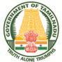

  

**GOVERNMENT OF TAMIL NADU**

**BOTANY**

A publication under Free Textbook Programme of Government of Tamil Nadu

**_Department of School Education_**

**HIGHER SECONDARY SECOND YEAR**

Untouchability is Inhuman and a Crime

  

III

Conceptual diagram that depicts relationships between concepts to enable students to learn the content schematically**Concept Map**

Model questions to face various competitive exams **Competitive Exam questions**

Explanation of scientific termsGlossary

Assess students to pause, think and check their understanding**Evaluation**

List of professions related to the subject**Career corner**

List of digital resources**Web links**

List of related books for further details of the topic**References**

Directions are provided to students to conduct activities in order to explore, enrich the concept.

**Activity**

Visual representation of the lesson to enrich learning .**Infographics**

To motivate the students to further explore the content digitally and take them in to virtual world

Amazing facts, Rhetorical questions to lead students to biological inquiry

Tamil terminology for Botanical terms given for easy understanding**English - Tamil Terminology**

HOW TO USE THE BOOK

To enhance digital Science skills among students**ICT**

Learning objectives are brief statements that describe what students will be expected to learn by the end of school year, course, unit, lesson or class period.

**Learning Objectives:**

Illustrate the complete overview of chapter**Chapter Outline**

  

IV

**Scope of Botany Higher Studies and Career Opportunities**

**1 M. B. B. S. (Bachelor of Medicine and Bachelor of Surgery) – 5.5 years** MBBS is the bachelor degree in medical field for cure & diagnose, awarded in many countries.

**8 B.O.T (Occupational Therapy) – 3 years** The Occupational Therapy helps the people to enable in their everyday life and treats the emotionally and physically challenged people.

**9 B.U.M.S (Unani Medicine) – 5.5 years** BUMS degree is equivalent to the BAMS, but in Unani medicines. **Naturopathy & Yogic Science** is one of the trusted fields after Allopathy in India. **Duration:** 4 Years

**10 D.Pharm (Ayurvedic, Siddha Medicine) – 2 years** It is a medical diploma course in pharmacy of ayurvedic medicines.

**11 BMLT (Bachelor of Medical Lab Technicians) – 3 year** It is a bachelor degree of medical laboratory technology, contains the entire laboratory practices of the medical system. Various institutions are offering the B.Sc. programme in medical laboratory technology in India.

**12 DMLT (Diploma of Medical Lab Technicians) – 1 year** It is a medical diploma course of medical laboratory technology, contains the laboratory practices of the medical field. Candidate must have cleared the 10+2 exam with PCB.

**2 B. D. S. (Bachelor of Dental Surgery) – 4 years** BDS is a professional degree programme in dentistry.

**3 B. H. M. S. (Bachelor of Homeopathic Medicine & Surgery) – 5.5 years** BHMS is a bachelor degree in Homeopathic Education in India regulated by the National Institute of Homeopathy.

**4 B. A. M. S. (Bachelor of Ayurvedic Medicine and Surgery) – 5.5 years** BAMS is a bachelor degree in ayurvedic system of medical field. In India, the Ayurvedic Education is regulated by the Central Council of Indian Medicine (CCIM).

**5 B.Pharm (Bachelor of Pharmacy) – 4 years** This degree involves the knowledge of pharmacy.

**6 B.Sc Nursing – 4 years** The motive of B.Sc. Nursing programme is to produce the qualified nurses, as a member of the health care team.

**7 B.P.T (Physiotherapy) – 4.5 years** Physiotherapy helps the temporary disabled people in their rehabilitation.

**List of Medical Courses**

  

V

 B.Sc in Agriculture  B.Sc in Genetics and Plant Breeding  B.Sc in Agriculture Economics and Farm

Management  B.Sc in Animal Husbandry  B.Sc in Fisheries  B.Sc in Forestry  B.Sc Soil and Water Management  B.Sc in Horticulture  B.Sc Agriculture and Food Business  M.Sc in Agronomy  M.Sc Agricultural Economics  M.Sc Seed science and Technology  M.Sc Agricultural Entomology  M.Sc Agricultural Statistics  Diploma in Agriculture

**Agricultural Courses**

 Bachelor of Science in Botany  Bachelor of Science (Hons) in Botany  Master of Science in Botany  Master of Science in Botany and Forestry  Master of Science in Applied Botany  Master of Science in Herbal Science  Post Graduate Diploma in Medico botany  Post Graduate Diploma in Plant Biodiversity

**Specializations available for botany are:**  Cytology  Genetics  Lichenology  Economic botany  Palynology  Palaeobotany  Bryology  Ethnobotany  Phycology Phytochemistry  Forestry  Plant morphology  Phytopathology  Plant anatomy  Plant physiology  Plant genetics  Agronomy  Horticulture  Plant ecology  Plant systematic

**Veterinary Science**

**Various Botany courses**

**Botany Career Opportunities and Job Prospects**

Bachelor of Veterinary Science or B.V.Sc. is an undergraduate program in veterinary

The amount of diversity in the field of Botany gives it students to choose their specializations as per their choice, aptitude and interests. One can be a part of any reputed organization as a

**Plant explorer:** Botanist with a passion for plants who could be a photographer, writer, expeditioner, etc

**Conservationist:** Is an individual who works for the conservation of the environment and is often linked to organisations working for the cause.

**Ecologist:** A person who works for the eco- system and a balanced environment.

**Environment consultant:** Some botanists qualify to work as environmental consultants, providing inputs and advice for the conservation of the environment.

**Horticulturist:** A horticulturist knows the science behind different plants, flowers, and greenery. They conduct research in gardening and landscaping, plant propagation, crop production, plant breeding, genetic engineering, plant biochemistry, and plant physiology.

**Plant biochemist:** Biochemists study the chemical and physical principles of living things and of biological processes, such as cell development, growth, heredity, and disease.

**Molecular biologist:** Molecular biologists conduct research and academic activities. The research component involves the study of biological structures in well-equipped laboratories with advanced technology to help them explore complex molecular structures and their particular functions. The equipment

  

VI

**Research Institutes involved in Plant Science**may include microscopes, lab centrifuges, computers with specific software that allows them to analyze obtained data, and many more.

The knowledge of plant sciences is essential for development and management of forests, parks, waste lands, sea wealth etc.

**Few of the industries which one can work with are:**

 Chemical Industry

 Food Companies

 Arboretum

 Forest Services

 Biotechnology Firms

 Oil Industry

 Land Management Agencies

 Seed And Nursery Companies

 Plant Health Inspection Services

 Biological Supply Houses

 Plant Resources Laboratory

 Educational Institutions

 National Park Service

 Departments of Conservation and Land Management

 Public Health Service

 Department of Agriculture

 Forest Service

 Departments of Environmental Protection

 Departments of Agriculture and Water

 Nature Conservancy

 Environmental Protection Agency

 Medical Plant Resources Laboratory

 Several foreign countries provide platforms for Msc in Botany graduates to build up a good career in the field of Botany. Several undertakings functioning abroad demand the service of Msc in Botany graduates.

**a. Affiliated to Ministry of Environment and Forests**

 Centre for Environment Education, Ahmedabad  Forest Survey of India, Dehra Dun  Indian Institute of Forest Management, Bhopal  Institute of Forest Genetics and Tree

Breeding, Jorhat

**b. Affiliated to Indian Council of Agricultural Research**

 Central Agricultural Research Institute, Port Blair  Central Research Institute for Jute and

Allied fibres, Barrackpore  Directorate of Oilseeds Research, Hyderabad  Indian Grassland and Fodder Research

Institute, Jhansi  Jute Technological Research Laboratories,

Calcutta  National Centre for Mushroom Research

and Training, Solan

**c. Affiliated to Council of Scientific and Industrial Research**

 Central Drug Research Institute, Lucknow  Central Food Technological Research

Institute, Mysore  National Environment Engineering

Research Institute, Nagpur

**d. Affiliated to Indian Council of Medical Research**

 Central Council for Research in Unani Medicine, Delhi

 Central Council for Research in Ayurveda and Sidda, Delhi

**e. Research Academics**  Indian Academy of Science, Bangalore  Indian Botanical Society, Delhi  Indian Mycological Society, Delhi  Indian National Science Academy, Delhi  Indian Society for Plantation Crops,

Kasargod.

  

VII

**CONTENTS**

**E-book Assessment**

**BOTANY**

**UNIT VI: Reproduction in Plants** Chapter 1 Asexual and Sexual Reproduction in Plants 

**UNIT VII: Genetics** Chapter 2 Classical Genetics 

Plants and Entrepreneurial Botany 

**Annexure References 249 English – Tamil Terminology 251 Competitive Examination Questions 255**

**Botany Practicals 270**

  

VIII

