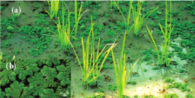
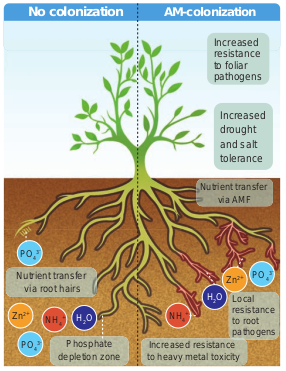
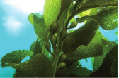
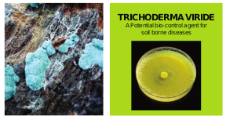
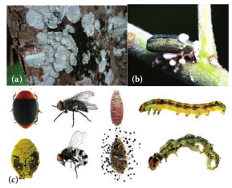
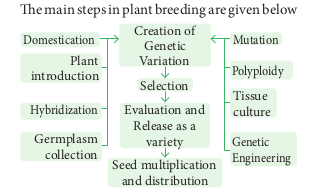
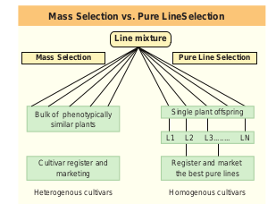
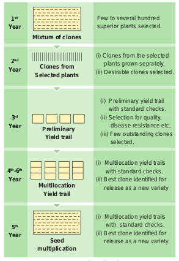
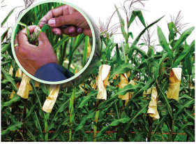
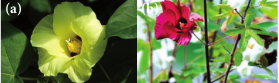

**Learning Objectives**

The learner will be able to Appreciate the relationship between

humans and plants. Recognise the origin of agriculture. Perceive the importance of organic

agriculture. _Understand the different conventional_

methods of plant breeding. Realize the importance of seed

protection and seed storage. Compare the traditional methods of

seed storage with modern methods.

**Chapter outline**

9.1 Relationship between human and plants

9.2 Domestication of plants

9.3 Origin of agriculture

9.4 Organic agriculture

9.5 Plant breeding

9.6 Conventional plant breeding methods

9.7 Modern plant breeding Techniques

9.8 Seed protection

9.9 Seed storage

Economic botany is the study of the relationship between people and economically important plants. It explores the ways by which humans use plants for food, medicines and other uses. Economic botany intersects many fields including established disciplines such as agronomy, anthropology, archaeology, chemistry, trade and commerce.

## Relationship between humans and plants

From the very early times, human beings have co-existed with plants which played a vital role in their survival. Through a long process of trial and error, our ancestors have selected hundreds of wild plants from the various parts of the world for their specific use. The knowledge of the plants and its applications have led to the development of the humans and their civilization in many ways.

## Domestication of plants
 Domestication is the process of bringing a plant species under the control of humans and gradually changing it through careful selection, genetic alteration and handling so that it is more useful to people. The domesticated species are renewable sources that have provided food and other benefits to human. The possible changes in the plant species due to domestication are listed below; • Adaptation to a greater diversity of

environments and a wider geographical range.

- Simultaneous /uniform flowering and fruiting.

- Lack of shattering or scattering of seeds.

- Increased size of fruits and seeds. 
- Change from a perennial to annual habit.
- Change in breeding system. • Increased yield. 
- Increased resistance for disease and pest. 
- Developing seedless parthenocarpicfruit. 

- Enhancing colour, appearance,

palatability and nutritional composition.

## Origin of Agriculture
 Archeological evidence for earliest record of agriculture is found in the fertile crescent region in and around Tigris and Euphrates river valleys, approximately about 12,000 years ago.

The earlier Greek and Roman naturalists like Theophrastus, Dioscorides, Pliny the elder and Galen laid down the scientific foundation in understanding origin and domestication of cultivated plants.

## Organic Agriculture
 Organic farming is an alternative agricultural system which originated early in the twentieth century in reaction to rapidly changing farming practices. It is a production system that sustains the health of the soils, ecosystems and people. It relies on ecological processes, biodiversity and cycles adapted to local conditions rather than the use of inputs with adverse effects. 
 
 **9.5.1. Biofertilizers** Biofertilizers are defined as preparations containing living cells or latent cells of efficient strains of microorganisms that help crop plants uptake of nutrients by their interactions in the rhizosphere when applied through seed or soil. Biofertilizers could be also called as microbial cultures, bioinoculants, bacterial inoculants or bacterial fertilizers.

They are efficient in fixing nitrogen, solubilising phosphate and decomposing cellulose. They are designed to improve the soil fertility, plant growth, and also the number and biological activity of beneficial microorganisms in the soil. They are eco-friendly organic agro inputs and are more efficient and cost effective than chemical fertilizers.

**Indian Plant Breeders** a. **Dr. M. S. Swaminathan** –

He is a pioneer mutation breeder.

b. **Sir. T.S. Venkataraman** – An eminent sugarcane breeder.

c. **Dr. B.P. Pal** – Famous wheat breeder, developed superior disease resistant varieties of wheat.

d. **Dr. K. Ramiah** – Eminent rice breeder, developed several high yielding varieties of rice.

e. **N.G.P. Rao** – An eminent sorghum breeder, developed world’s first hybrid of Sorghum (CSH-1).

f. **C.T. Patel** – Who developed world’s first cotton hybrid.

g. **Choudhary Ram Dhan** – Wheat breeder, who is famous for C-591 variety of wheat, which made Punjab the wheat granary of India.

**_Rhizobium_** Bio-fertilisers containing rhizobium bacteria are called _rhizobium_ bio-fertilizer culture. Symbiotic bacteria that reside inside the root nodules convert the atmospheric nitrogen into a bio available form to the plants. This nitrogen fixing bacterium when applied to the soil undergoes multiplication and fixes the atmospheric nitrogen in the soil. _Rhizobium_ is best suited for the paddy fields which increase the yield by 15 – 40%.

**_Azolla_** _Azolla is a free-floating water fern that fixes_ the atmospheric nitrogen in association with nitrogen fixing blue green alga Anabaena azollae. It is used as a bio-fertilizer for wetland rice cultivation and is known to contribute 40 – 60 kg/ha/crop. The agronomic potential of Azolla is quite significant particularly for increasing the yield of rice crop, as it quickly decompose in soil.

Apart from increasing the availability of
phosphorus, AM provides necessary strength to
resist disease, germs and unfavourable weather
conditions. It also assures water availability.

**Seaweed** **Liquid Fertilizer** Seaweed liquid f e r t i l i z e r **(**SLF) contains c y t o k i n i n , g i b b e r e l l i n s and auxin apart from macro and micro n u t r i e n t s . Most seaweed based fertilizers are made from kelp(brown algae) which grows to length of 150 metres. Liquid seaweed fertilizer is not only organic but also eco-friendly. The alginates in the seaweed that reacts with metals in the soil and form long, cross-linked polymers in the

soil. These polymers improve the crumbing in the soil, swell up when they get wet and retain moisture for a long time. They are especially useful in organic gardening which provides carbohydrates for plants. Seaweed has more than 70 minerals, vitamins and enzymes. It promotes vigorous growth. Improves resistance of plants to frost and disease. Seeds soaked in seaweed extract germinate much rapidly and develop a better root system.

**Bio-Pesticides** Bio-pesticides are biological agents used for the control of plant pests. They are in high use due to their non-toxic, cheaper and eco-friendly characteristics as compared to chemical or synthetic pesticides. Bio- pesticides have become an integral component of pest management in terms of the environmental and health issues attributed to the use of chemicals in agriculture.

**_Trichoderma_** species are free-living fungi that are common in soil and root ecosystem. They have been recognized as bio-control agent for (1) the control of plant disease (2) ability to enhance root growth development (3) crop productivity (4) resistance to abiotic stress and (5) uptake and use of nutrients.

**_Beauveria_** species is an entomo-pathogenic fungus that grows naturally in soils throughout the world. It acts as a parasite on various arthropod species causing white muscardine disease without affecting the plant health and growth. It also controls damping off of tomato caused by _Rhizoctonia solani_.

**Green Manuring** Green manuring is defined as the growing of green manure crops and use of these crops directly in the field by ploughing. One of the main objectives of the green manuring is to increase the content of nitrogen in the soil. Also it helps in improving the structure and physical properties of the soil. The most important green manure crops are _Crotalaria juncea, Tephrosia purpurea, Indigofera tinctoria_

The green manuring can be practised as Green in-situ manuring or Green leaf manuring. Green in-situ manuring refers to the growing of green manuring crops in the border rows or as intercrops along with the main crops. Example: Sun hemp, Cowpea, Green gram etc. whereas green leaf manuring is the application of green leaves and twigs of trees, shrubs, plants growing in wastelands and field bunds. The important plant species useful for green leaf manure are _Cassia fistula_, _Sesbania grandiflora, Azadirachta indica, Delonix regia, Pongamia pinnata_ etc.,

## Plant Breeding
 Plant breeding is the science of improvement of crop varieties with higher yield, better quality, resistance to diseases and shorter durations which are suitable to particular environment. In other words, it is a purposeful manipulation of plant species in order to create desired genotype and phenotype for the benefit of humans. In early days, plant breeding activities were based mainly on skills and ability of person involved. But as the principles of genetics and cytogenetics have elucidated breeding methods such as selection, introduction, hybridization, ploidy, mutation, tissue culture and biotechnology techniques were designed to develop improved crop varieties.

**9.6.1. Objectives of Plant Breeding** 

- To increase yield, vigour and fertility of the crop 

- To increase tolerance to environmental condition, salinity, temperature and drought.

- To prevent the premature falling of buds, fruits etc.

- To improve synchronous maturity. • To develop resistance to pathogens and
pests. 

- To develop photosensitive and thermos-sensitive varieties.

**9.6.2. Steps in Plant Breeding** The main steps in plant breeding are given below

## Conventional Plant Breeding Methods

Conventional plant breeding methods resulting in hybrid varieties had a tremendous impact on agricultural productivity over the last decades. It develops new plant varieties by the process of selection and seeks to achieve expression of genetic material which is already present within

the species. In this chapter we will discuss about some of the conventional methods of plant breeding.

**9.7.1. Plant Introduction** Plant introduction may be defined as the introduction of genotypes from a place where it is normally grown to a new place or environment. Rice variety of IR8 introduced from Philippines and Wheat varieties of Sonora 63, Sonora 64 from Mexico.

The newly introduced plant has to adapt itself to the new environment. This adjustment or adaptation of the introduced plant in the changed environment is called **acclimatization.** All the introductions must be free from presence of weeds, insects and disease causing organisms. This has to be carefully examined by the process called **quarantine**, a strict isolation imposed to prevent the spread of disease.

Introduction may be classified as Primary introduction and Secondary introduction 

(1) **Primary introduction** - When the introduced variety is well adapted to the new environment without any alternation to the original genotype.

(2) **Secondary introduction** - When the introduced variety is subjected to selection to isolate a superior variety and hybridized with a local variety to transfer one or a few characters to them. The botanical gardens in different parts of the world also played a significant role in plant introduction. Example : Tea varieties collected from China and North East India initially grown in Botanical Garden of Kolkata from which appropriate clones have selected and introduced to different parts of India. 

**9.7.2. Selection** 

Selection is the choice of certain individuals from a mixed population for a one or more desirable traits. Selection is the oldest and basic method of plant breeding. There are two main types of Selection.

**i. Natural Selection:**
This is a rule in nature and results in evolution reflected in the Darwinian principle “survival of the fittest”. It takes longer time in bringing about desired variation.

**ii. Artificial Selection: It is a human involved** process in having better crop from a mixed population where the individuals differ in character. The following are the three main types of artificial selection.

a. **Mass Selection:** In mass selection a large number of plants of similar phenotype or morphological characters are selected and their seeds are mixed together to constitute a new variety. The population obtained from the selected plants would be more uniform than the original population and are not individually tested. After repeated selection for about five to six years, selected seeds are multiplied and distributed to the farmers. The only disadvantage of mass selection is that it is difficult to distinguish the hereditary variation from environmental variation.

**b. Pureline selection:** Johannsen in 1903 coined the word pureline. It is a collection of plants obtained as a result of repeated self-pollination from a single homozygous individual. Hence, a variety formed by this method shows more homozygosity with respect to all genes. The disadvantage of this type is that the new genotypes are never created and they are less adaptable and less stable to the environmental fluctuations.

**c. Clonal Selection:** In asexually propagated crop, progenies derived from a plant resemble in genetic constitution with the parent plant as they are mitotically divided. Based on their phenotypic appearance, clonal selection is employed to select improved variety from a mixed population (clones). The selected plants are multiplied through vegetative propagation to give rise to a clone. The genotype of a clone remains unchanged for a long period of time.

**9.7.3. Hybridization** Hybridization is the method of producing new crop varieties in which two or more plants of unlike genetically constitution all crossed together that result in a progeny called hybrid. Hybridization offers improvement in crop and is the only effective means of combining together the desirable characters of two or more varieties or species. The first natural hybridization was observed by Cotton Mather in maize.

 **Steps in Hybridization** Steps involved in hybridization are as follows. 1. **Selection of Parents:** Male and female

plants of the desired characters are selected. It should be tested for their homozygosity.

2. **Emasculation:** It is a process of removal of anthers to prevent self pollination before dehiscence of anther.

3. **Bagging:** The stigma of the flower is protected against any undesirable pollen grains, by covering it with a bag .

: 

4. **Crossing:** Transfer of pollen grains from selected male flower to the stigma of the female emasculated flower.

5. **Harvesting seeds and raising plants:** The pollination leads to fertilization and finally seed formation takes place. The seeds are grown into new generation which are called hybrids.

**Types of Hybridization** According to the relationship between
plants, the hybridization is divided into. 

**i. Intravarietal hybridization** - The cross between the plants of same variety. Such crosses are useful only in self-pollinated crops.

**ii. Intervarietal hybridization** - The cross between the plants belonging to two different varieties of the same species and is also known as intraspecific hybridization. This technique has been the basis of improving self-pollinated as well as cross pollinated crops

**iii. Interspecific hybridization** - The cross between the plants belonging to different species belonging to the same genus is also called intragenic hybridization. It is commonly used for transferring the genes of disease, insect, pest and drought resistance from one species to another.
 **Example:** Gossypium hirsutum x Gossypium arboreum – Deviraj.

**iv. Intergeneric hybridization – The crosses** are made between the plants belonging to two different genera. The disadvantages are hybrid sterility, time consuming and expensive procedure. **Example:** _Raphanobrassica, Triticale._ (Refer chapter 4 for detailed illustration)

**9.7.4. Heterosis** Heterosis (hetero- different; sis - condition) G.H. Shull was the first scientist to use the term heterosis in 1912. The superiority of the F1 hybrid in performance over its parents is called heterosis or hybrid vigour. Vigour refers to increase in growth, yield, greater adaptability of resistance to diseases, pest and drought. Vegetative propagation is the best suited measure
for maintaining hybrid vigour, since the desired characters are not lost and can persist over a period of time. Many breeders believe that the magnitude of heterosis is directly related to the degree of genetic diversity between the two parents. Depending on the nature, origin, adaptability and reproducing ability heterosis can be classified as: 
**i. Euheterosis-** 
This is the true heterosis which is inherited and is further classified as: 

**a. Mutational Euheterosis** - Simplest type of euheterosis and results from the sheltering or eliminating of the deleterious, unfavourable often lethal, recessive, mutant genes by their adaptively superior dominant alleles in cross pollinated crops.

**b. Balanced Euheterosis** – Well balanced gene combination which is more adaptive to environmental conditions and agricultural usefulness.

**ii.** **Pseudoheterosis** – Also termed as luxuriance. Progeny possess superiority over parents in vegetative growth but not in yield and adaptation, usually sterile or poorly fertile.

**9.7.5. Mutation Breeding** 
Muller and Stadler (1927- 1928) coined the term mutation breeding. It represents a new method of conventional breeding procedures as they have the advantage of improving the defect without losing agronomic and quality character in agriculture and crop improvement. Mutation means the sudden heritable changes in the genotype or phenotype of an organism. Gene mutations are of considerable importance in plant breeding as they provide essential inputs for evolution as well as for re-combination and selection. It is the only method for improving seedless crops.

Radiation such as UV short wave, X-ray, Alpha (α), Beta (β), Gamma waves and many chemicals such as cesium, EMS (ethyl methane sulfonate), nitromethylurea induce mutation to develop new varieties of crops. **Example:** Triple gene dwarf wheat with increase in

yield and height. Atomita 2 - rice with salinity tolerance and pest resistance. 

**9.7.6. Polyploid Breeding** Majority of flowering plants are diploid (2n). The plants which possess more than two sets of chromosome are called polyploids. Polyploidy is a major force in the evolution of both wild and cultivated plants. Polyploidy often exhibits increased hybrid vigour, increased heterozygosity, increase tolerance to both biotic and abiotic stresses, buffering of deleterious mutations. In addition, polyploidy often results in reduced fertility due to meiotic error allowing the production of seedless varieties.

**Do you know = Gamma Garden or Atomic Garden**: Is a form of mutation breeding where plants are exposed to radioactive sources
typically cobalt-60 or caesium-137 in order to generate desirable mutation in crop plants. The first Gamma garden in India is Bose Research Institute at Calcutta in 1959 and the second is IARI in 1960 which produced large variation in short type.

When chromosome number is doubled by itself in the same plant, is called autopolyploidy. Example: A triploid condition in sugarbeets, apples and pear has resulted in the increase in vigour and fruit size, large root size, large leaves, flower, more seeds and sugar content in them. It also resulted in seedless tomato, apple, watermelon and orange. Polyploidy can be induced by the use of colchicine to double the chromosome number. Allopolyploids are produced by multiplication of chromosome sets that are initially derived from two different species. Example: _Triticale (Triticum durum x secale cereale) Raphanobrassica (Brassica oleraceae x Raphanus sativus).

**9.7.7. Green Revolution** Green revolution the term was coined by William S.Gaud in (1968). It is defined as the cumulative result of a series of research, development, innovation and technology transfer initiatives. Agricultural production (especially wheat and rice) manifolds worldwide particularly in the developing countries between the 1940’s and the late 1960’s.

The Green revolution or third Agricultural Revolution is the intensive plan of 1960’s to increase crop yield in developing countries by introducing the high yielding, resistant varieties, increased irrigation facilities, fertilizer application and better agricultural management.

In 1963 semi-dwarf wheat of Mexico was introduced from which India got five prolonged strategies for breeding a wide range of high varieties like Sonora 64, Sonalika and Kalyansona possessing a broad spectrum of resistance to major biotic and abiotic condition. Same as wheat M.S.Swaminathan produced the first semi-dwarf fertiliser responsive hybrid variety of rice TNI (Taichung Native-1) in 1956 from Taiwan. The derivatives were introduced in 1966. Later better yielding semi dwarf varieties of rice Jaya and Ratna developed in India.

**NORIN 10 –** The cultivars found that Norin 10 dwarfing genes have high photosynthetic rate per unit
leaf area and increase respiratory activity. Gonjiro Inazuka selected the semi-dwarf wheat variety that became Norin 10. He would have never thought that the semi dwarf genes would not only revolutionize the world of wheat but also helped to save more than one billion lives from hunger and starvation.

**Plant Breeding for Developing Resistance to diseases**

Some crop varieties bred by hybridization and selection, for disease resistance to fungi, bacteria and viral diseases are released (Table 9.1).

**Crop Variety Resistance to diseases**

**Table 9.1** Disease resistance varieties Resistance to yellow mosaic virus in bhindi

**Plant Breeding for Developing Resistance to Insect Pests**

Insect resistance in host crop plants may be due to morphological, biochemical or physiological characteristics. Hairy leaves in several plants are associated with resistance to insect pests. Example: resistance to jassids in cotton and cereal leaf beetle in wheat. In wheat, solid stems lead to non-preference by the stem sawfly and smooth leaves and nectar-less cotton varieties do not attract bollworms. High aspartic acid, low nitrogen and sugar content in maize leads to resistance to maize stem borers.

**Crop Variety Insect pests**

_Brassica_ (rapeseed mustard)

Pusa Gaurav Aphids

Flat been Pusa Sem 2 Pusa Sem 3

Jassids, aphids and fruit borer

Okra (Bhindi)

Pusa Sawani Pusa A-4

Shoot and Fruit borer

**Table 9.2** Pest resistance varieties

## Modern Plant Breeding
 In the milestones of plant breeding methods Genetic Engineering, Plant tissue culture, Protoplasmic fusion or somatic hybridisation, Molecular marking and DNA finger printing are some of the modern plant breeding tools used to improve the crop varieties. We have already discussed about the various techniques and application of the above mentioned concepts in Unit VIII. **New Plant Engineering Techniques / New Breeding Techniques (NBT)** NBT are a collection of methods that could increase and accelerate the development of new traits in plant breeding. These techniques often involve genome editing, to modify DNA at specific locations within the plants to produce new traits in crop plants. The various methods of achieving these changes in traits include the following. • Cutting and modifying the genome

during the repair process by tools like CRISPR /Cas.
- Genome editing to introduce changes in few base pairs using a technique called Oligonucleotide-directed mutagenesis (ODM).
- Transferring a gene from an identical or closely related species (cisgenesis)
- Organising processes that alter gene activity without altering the DNA itself (epigenetic methods).

**Norman E. Borlaug: The plant pathologist** plant breeder devoted his life at the International Maize and Wheat improvement centre at Sonord in Mexico. He developed a new high yielding, rust resistant, non-lodging dwarf wheat varieties like Norin-10, Sonora-64, Lerma rojo-64, etc. which are now being cultivated in many countries. This formed the base for ‘green revolution’. He was awarded a Nobel prize for Peace in 1970.

**Dr. M. S. Swaminathan:** He is a pioneer mutation breeder. He has produced Sharbati Sonora, is the amber grain coloured variety of wheat by mutation, which is responsible for green revolution in India.
Dr. Swaminathan is called “Father of green revolution in India”.

**Nel Jayaraman:** Mr. Jayaraman, hails from
Adirangam village in Tiruvarur district. He was a disciple of Dr.Nammalvar and state co- ordinator of ‘Save our rice campaign, Tamil Nadu. He strived hard for conservation of traditional rice varieties. He had trained a team of farmers and regularly update them on the current issues that affect them.

In 2005, he organized a first ever traditional paddy seed festival in his farm as an individual. The seed festival in May 2016 at Adhirangam was 10th in a row and in which 156 different traditional varieties were distributed to more than 7000 farmers across Tamil Nadu. He was invited by the Philippines Government to give a talk at the International Rice Research Institute (IRRI) on his work and mission. In 2011, he received the State Award for best organic farmer for his contribution to organic farming, and in the year 2015, he received the National Award for best Genome Savior.

Resistance to yellow mosaic virus in bhindi (Abelmoschus escullentus) was transferred from a wild species and resulted in a new variety of A. Escullentus called Parbharni kranti. 
**Plant Breeding for Developing Resistance to Insect Pests** 

Insect resistance in host crop plants may be due to morphological, biochemical or physiological characteristics. Hairy leaves in several plants are associated with resistance to insect pests. Example: resistance to jassids in cotton and cereal leaf beetle in wheat. In wheat, solid stems lead to non-preference by the stem sawfly and smooth leaves and nectar-less cotton varieties do not attract bollworms. High aspartic acid, low nitrogen and sugar content in maize leads to resistance to maize stem borers.

9.8 Modern Plant Breeding
In the milestones of plant breeding methods
Genetic Engineering, Plant tissue culture,
Protoplasmic fusion or somatic hybridisation,
Molecular marking and DNA finger printing are
some of the modern plant breeding tools used
to improve the crop varieties. We have already
discussed about the various techniques and
application of the above mentioned concepts in
Unit VIII.
New Plant Engineering Techniques / New
Breeding Techniques (NBT)
NBT are a collection of methods that could
increase and accelerate the development of new
 
**Summary** 

Economic Botany deals with the

relationship between people and economically important plants to fulfill the three basic needs of life such as food, clothing and shelter. Domestication, a term often used for a more intricate process, involves the genetic alteration of plants which did not appear at once, but rather over a substantial period of time, perhaps hundreds of years for some species. In the history of agriculture Vavilov has given the eight main centres of origin of plants were now divided into 12 centres of origin. In Organic agriculture biofertilizers are microbial inoculants which all ecofriendly, more effective even though cost effective than chemical fertilizers. _Rhizobium, Azolla,_ VAM and sea weeds are used as fertilizers which increase the crop yield many fold.

Plant breeding is a purposeful manipulation of plant species in order to create desirable genotype and phenotype for the benefit of mankind. Plant introduction, selection, hybridization, heterosis, mutation breeding, polyploidy breeding and green revolution are the different methods of conventional breeding.

5\. The quickest method of plant breeding is a) Introduction b) Selection c) Hybridization d) Mutation breeding

6\. Desired improved variety of economically useful crops are raised by a) Natural Selection b) hybridization c) mutation d) biofertilisers

7\. Plants having similar genotypes produced by plant breeding are called a) clone b) haploid c) autopolyploid d) genome

8\. Importing better varieties and plants from outside and acclimatising them to local environment is called a) cloning b) heterosis c) selection d) introduction

9\. Dwarfing gene of wheat is a) pal 1 b) Atomita 1 c) Norin 10 d) pelita 2

10\. Crosses between the plants of the same variety are called a) interspecific b) inter varietal c) intra varietal d) inter generic

11\. Progeny obtained as a result of repeat self pollination a cross pollinated crop to called a) pure line b) pedigree line c) inbreed line d) heterosis

12\. Jaya and Ratna are the semi dwarf varieties of a) wheat b) rice c) cowpea d) mustard

13\. Which one of the following are the species that are crossed to give sugarcane varieties with high sugar, high yield, thick stems and ability to grow in the sugarcane belt of North India? a) _Saccharum robustum_ and _Saccharum_

_officinarum_ b) _Saccharum barberi_ and _Saccharum_

_officinarum_ c) _Saccharum sinense_ and _Saccharum_

_officinarum_ d) _Saccharum barberi_ and _Saccharum_

_robustum_

14\. Match column I (crop) with column II (Corresponding disease resistant variety) and select the correct option from the given codes. Column I Column II I) Cowpea i) Himgiri II) Wheat ii) Pusa komal III) Chilli iii) Pusa Sadabahar IV) Brassica iv) Pusa Swarnim I II III IV a) iv iii ii i b) ii i iii iv c) ii iv i iii d) i iii iv ii

15\. A wheat variety, Atlas 66 which has been used as a donor for improving cultivated wheat, which is rich in a) iron b) carbohydrates c) proteins d) vitamins

16\. Which one of the following crop varieties correct matches with its resistance to a disease?

Variety Resistance to disease a) Pusa Komal Bacterial blight b) Pusa Sadabahar White rust c) Pusa Shubhra Chilli mosaic virus d) Brassica Pusa swarnim

17\. Which of the following is incorrectly paired? a) Wheat - Himgiri b) Milch breed - Sahiwal c) Rice - Ratna d) Pusa Komal - Brassica

18\. Match list I with list II

**List I List II Biofertilizer Organisms**

i) Free living N2 a) _Aspergillus_ ii) Symbiotic N2 b) _Amanita_ iii) P Solubilizing c) _Anabaena azollae_ iv) P Mobilizing d) _Azotobactor_

a. ic, iia, iiib, ivd b. id, iic, iiia, ivb.

c. ia, iic, iiib, ivd c. ib, iia, iiid, ivc.

19\. List the ways by which seeds can be stored for longer duration.

20\. Differentiate primary introduction from secondary introduction.

21\. How are microbial innoculants used to increase the soil fertility?

22\. Discuss the importance of neem in seed storage?

23\. What are the different types of hybridization?

24\. Explain the best suited type followed by plant breeders at present?

25\. Write a note on heterosis.

26\. List out the new breeding techniques involved in developing new traits in plant breeding.

**Glossary**

**Acclimatization : The adaptation of an** individual to a changed climate or the adjustment of a species or a population to

**Vavilov’s Centre of Crop Origin Crops domesticated**

1 China Foxtail millet, soybean, bamboo, onion, crucifers.

2 India Rice, sugarcane, mango, orange, eggplant, sesame.

2 a South East Asia Rice, banana, coconut, clove , hemp.

3 Central East Wheat, pea, hemp, cotton etc.

4 The Near East Wheat, rye, many subtropical and tropical fruits.

5 Mediterranean Olive, vegetables, oil yielding plants, wheats

6 Ethiopia (Abyssinian) Wheat, barley, sesame, castor, coffee.

7 Mesoamerica (South Mexican & Central American Centre)

Maize, bean, sweet potato, papaya, guava, tobacco.

8 South America Tomato, pine-apple

8 a The Chiloe Centre Potato

8 b The Brazilian –Paraguayan Centre Groundnut, cashew nut, pine apple, peppers, rubber.

**APPENDIX**

a changed environment over a number of generations.

**Agronomy :** Science of farming

**Certified seed : Seed produced from the** foundation or certified seed under the regulation of a legally constituted agency.

**Germplasm Collection : The entire collection** (of plants / seeds) having all the diverse alleles for all genes in a given crop is called **germplasm collection.**

**Non recurrent parent : The parent of a hybrid** that is not again used as a parent in backcrossing

**Pure-Line:** Progeny of a single self-fertilised homozygous individual.

**Quarantine :** Strict isolation imposed to prevent the spread of disease

**Strain :** A group of similar individuals from a common origin.

**MILESTONES IN PLANT BREEDING**

**Crop Domestication** Farmers select the best wild species to create crops

**Mutagenesis** Developing new genetic diversity by exposing crop plants to chemical agents or radiation

Understanding the structure of **DNA** James watson and Francis Crick identify the double helix of DNA

Plant breeding Based on **Genetic information** Development of improved varieties by working directly with DNA

Domestication of wheat

More vigorous hybrid corn

### BC

**Hybrid breeding** Crossing two genetically different individuals to develop better performing hybrid

Plant breeding based on **Cross breeding** Development of improved varieties by combining good characteristics from two parents

**GMO** Introducing foreign genes into the DNA of a plant

**Mendel's laws** Gregor Mendel describes the inheritance of traits from one generation to the next. His laws become the core of classical genetics

**Marker-assisted Selection** Locating desirable traits in a plant for efficient selection and breeding

### now

Waxy corn

**future**

Insect - resistant cotton

Barely resistant to yellow dwarf virus

**Targeted Breeding** Using modern tools such as genome editing for more targeted breeding

Blast-resistant rice

For 10,000 years, farmers and breeders have been developing and improving crops

For 150 years, plant scientists and breeders have improved plant breeding on a scientific basis

Today, farmers feed at least 10 times more people using almost same amount of lands as 100 years ago

By 2050, we will need 50% more food to feed the rapid growing population

Milestones in Plant Breeding

**Biofortification – breeding crops with higher levels of vitamins and minerals or higher protein** and healthier fats – is the most practical means to improve public health. Breeding for improved nutritional quality is undertaken with the objectives of improving
- Protein content and quality • Oil content and quality • Vitamin content and • Micronutrient and mineral content

In 2000, maize hybrids that had twice the amount of amino acids, lysine and tryptophan, compared to existing maize hybrids were developed. Wheat variety, Atlas 66 having a high protein content, has been used a donor for improving cultivated wheat. It has been possible to develop an iron fortified rice variety containing over five times as much iron as in commonly consumed varieties. The Indian Agricultural Research Institute, New Delhi has also released several vegetable crops that are rich in vitamins and minerals, example: vitamin A enriched carrots, spinach, pumpkin; vitamin C enriched bitter gourd, bathua, mustard, tomato; iron and calcium enriched spinach and protein enriched beans – broad, lablab, French garden peas.

**Sugar cane:** _Saccharum bareri_ was originally grown in North India, but had poor sugar content and yield. Tropical canes grown in South India Saccharum officinarum had thicker stems and higher sugar content but did not grow well in North India. These two species were successfully crossed to get sugar cane varieties combining the desirable qualities of high yield, thick stems, high sugar and ability to grow in the sugarcane areas of North India.

  

URL: **https://play.google.com/store/apps/details?id=com.dssoft.plantasmedicinales**

**Plant Breeding**

**Steps** • Type the URL or scan the QR code to open the activity page then Introduction page will open. • Click on ‘Plants’ it will display list of Medicinal Plants. • Click on each plants individually on the next screen it displays the description,

harvesting and properties of the plants. • Click the option on the top left side of the front page to see the preparation of oils,

Powder etc.,

Let us know about the details of Medicinal Plants in detail.

\* Pictures are indicative only

**ICT Corner**

**Step 3 Step 4Step 1 Step 2**

**New generation plant breeding** Crops with improved characteristics produced by cross breeding plants with desired gene

**TR AD**

**IT IO**

**NA L**

**M ET**

**HO D**

**M O**

**D ER**

**N M**

**ET H**

**O D**

Combines genes from different species

**Bacteria**

Chromosome

Bacterial chromosome

**1\. Plasmid:** Circular DNA molecule is removed from cell. This acts as **vector** to carry gene

**3\. Vector:** Restriction enzyme cleaves plasmid. Second enzyme – **DNA ligase** – pastes gene into DNA molecule, making **recombinant vector**

**NE W**

**B RE**

**ED IN**

**G**

**TE CH**

**NI Q**

**UE S** Plant with desired gene has gene pasted

into all its chromosomes. Gene is transmitted to nearly all offspring

**CRISPR/Cas9\*:** Precise gene-editing cuts DNA at specified sequence and enables introduction of replacement sequence

Gene has 50-50 chance of being passed to offspring. Desired gene will take multiple generations to spread

2\. DNA containing gene for desired trait is removed from chromosome. **Restriction enzyme** cuts gene from DNA

4\. Vector inserts gene into chromosomes of plant cells

\*Clustered Regularly Interspaced Short Palindromic Repeats. Cas9 is a cleaving protein.

Gene Plant cell

Sequential development of plant breeding techniques

