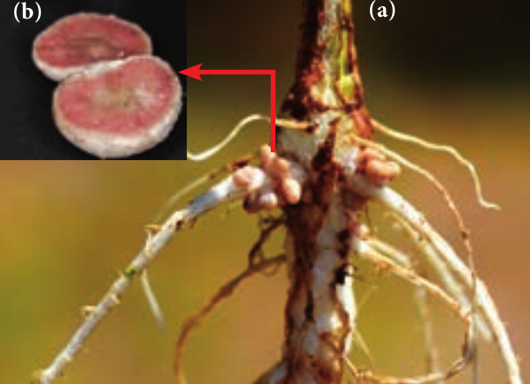
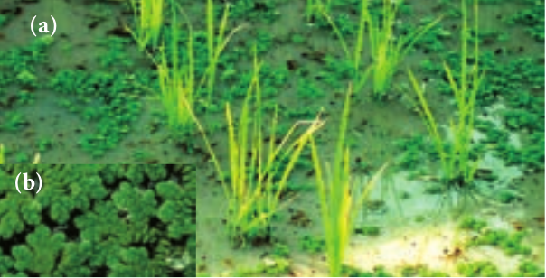
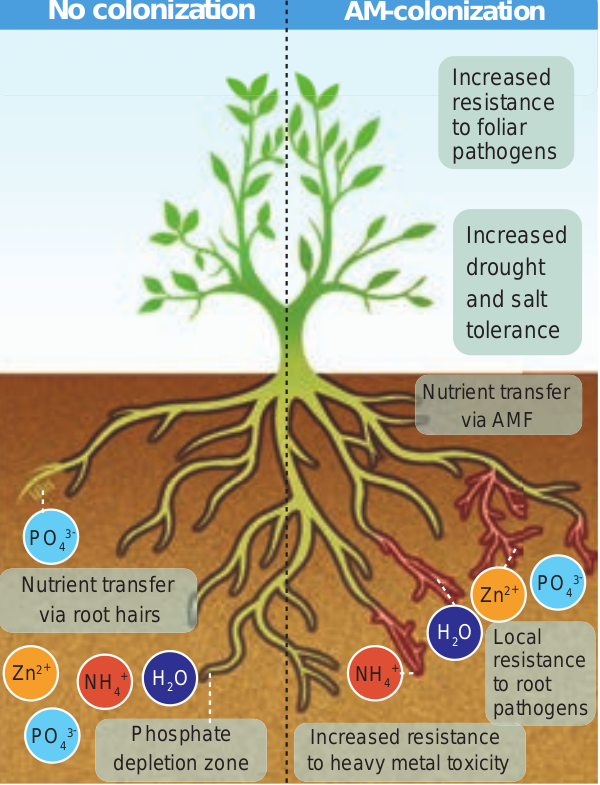
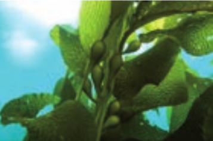
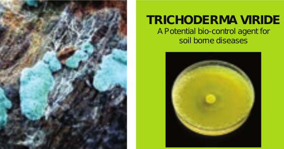
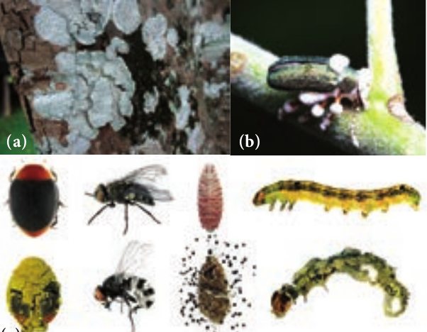
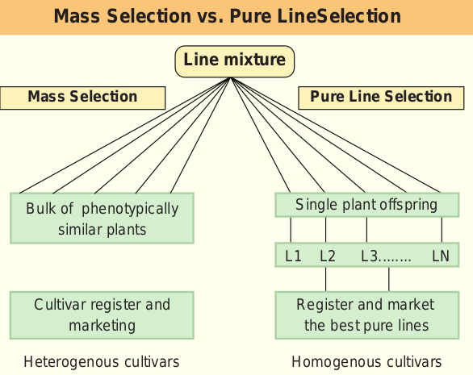
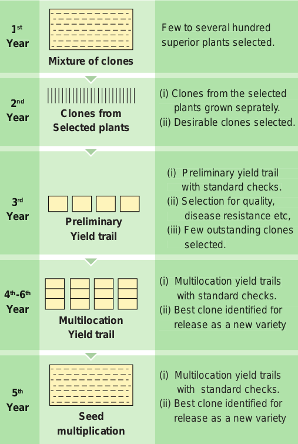
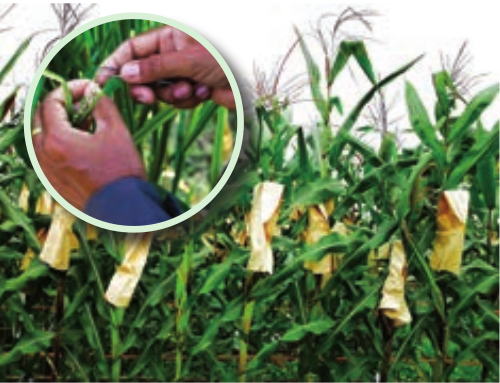
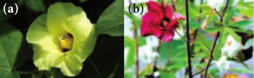

  
```hint {role="info"}
**Learning Objectives**
- Appreciate the relationship between humans and plants. 
- Recognise the origin of agriculture. 
- Perceive the importance of organic agriculture. 
- Understand the different conventional 
methods of plant breeding. 
- Realize the importance of seed protection and seed storage. 
- Compare the traditional methods of seed storage with modern methods.
```

Economic botany is the study of the relationship between people and economically important plants. It explores the ways by which humans use plants for food, medicines and other uses. Economic botany intersects many fields including established disciplines such as agronomy, anthropology, archaeology, chemistry, trade and commerce.

## Relationship between humans and plants

From the very early times, human beings have co-existed with plants which played a vital role in their survival. Through a long process of trial and error, our ancestors have selected hundreds of wild plants from the various parts of the world for their specific use. The knowledge of the plants and its applications have led to the development of the humans and their civilization in many ways.

## Domestication of plants
Domestication is the process of bringing a plant species under the control of humans and gradually changing it through careful selection, genetic alteration and handling so that it is more useful to people. The domesticated species are renewable sources that have provided food and other benefits to human. The possible changes in the plant species due to domestication are listed below. 

- Adaptation to a greater diversity of environments and a wider geographical range.
- Simultaneous/uniform flowering and fruiting.
- Lack of shattering or scattering of seeds.
- Increased size of fruits and seeds. 
- Change from a perennial to annual habit. 
- Change in breeding system. 
- Increased yield. 
- Increased resistance for disease and pest. 
- Developing seedless parthenocarpic fruit. 
- Enhancing colour, appearance, palatability and nutritional composition.

## Origin of Agriculture
Archeological evidence for earliest record of agriculture is found in the fertile crescent region in and around Tigris and Euphrates river valleys, approximately about 12,000 years ago.

The earlier Greek and Roman naturalists like Theophrastus, Dioscorides, Pliny the elder and Galen laid down the scientific foundation in understanding origin and domestication of cultivated plants.

## Organic Agriculture
Organic farming is an alternative agricultural system which originated early in the twentieth century in reaction to rapidly changing farming practices. It is a production system that sustains the health of the soils, ecosystems and people. It relies on ecological processes, biodiversity and cycles adapted to local conditions rather than the use of inputs with adverse effects. 

### Biofertilizers
Biofertilizers are defined as preparations containing living cells or latent cells of efficient strains of microorganisms that help crop plants uptake of nutrients by their interactions in the rhizosphere when applied through seed or soil. Biofertilizers could be also called as microbial cultures, bioinoculants, bacterial inoculants or bacterial fertilizers.

They are efficient in fixing nitrogen, solubilising phosphate and decomposing cellulose. They are designed to improve the soil fertility, plant growth, and also the number and biological activity of beneficial microorganisms in the soil. They are eco-friendly organic agro inputs and are more efficient and cost effective than chemical fertilizers.


```hint {role="warn"}
**Indian Plant Breeders** 

a. **Dr. M. S. Swaminathan** – He is a pioneer mutation breeder.
b. **Sir. T.S. Venkataraman** – An eminent sugarcane breeder.
c. **Dr. B.P. Pal** – Famous wheat breeder, developed superior disease resistant varieties of wheat.
d. **Dr. K. Ramiah** – Eminent rice breeder, developed several high yielding varieties of rice.
e. **N.G.P. Rao** – An eminent sorghum breeder, developed world’s first hybrid of Sorghum (CSH-1).
f. **C.T. Patel** – Who developed world’s first cotton hybrid.
g. **Choudhary Ram Dhan** – Wheat breeder, who is famous for C-591 variety of wheat, which made Punjab the wheat granary of India.
```

**_Rhizobium_** 
Bio-fertilisers containing rhizobium bacteria are called _rhizobium_ bio-fertilizer culture. Symbiotic bacteria that reside inside the root nodules convert the atmospheric nitrogen into a bio available form to the plants. This nitrogen fixing bacterium when applied to the soil undergoes multiplication and fixes the atmospheric nitrogen in the soil. _Rhizobium_ is best suited for the paddy fields which increase the yield by 15 – 40%.



**_Azolla_** 
_Azolla is a free-floating water fern that fixes_ the atmospheric nitrogen in association with nitrogen fixing blue green alga Anabaena azollae. It is used as a bio-fertilizer for wetland rice cultivation and is known to contribute 40 – 60 kg/ha/crop. The agronomic potential of Azolla is quite significant particularly for increasing the yield of rice crop, as it quickly decompose in soil.



**Arbuscular mycorrhizae** 
Arbuscular mycorrhizae (AM) is formed by the symbiotic association between certain phycomycetous fungi and angiosperm roots. They have the ability to dissolve the phosphates found in abundance in the soil.


 Apart from increasing the availability of phosphorus, AM provides necessary strength to resist disease, germs and unfavourable weather conditions. It also assures water availability.

**Seaweed Liquid Fertilizer** 

Seaweed liquid Fertilizer **(**SLF) contains cytokinin , gibberellins and auxin apart from macro and micro n u t r i e n t s . Most seaweed based fertilizers are made from kelp(brown algae) which grows to length of 150 metres. Liquid seaweed fertilizer is not only organic but also eco-friendly. The alginates in the seaweed that reacts with metals in the soil and form long, cross-linked polymers in the soil. These polymers improve the crumbing in the soil, swell up when they get wet and retain moisture for a long time. They are especially useful in organic gardening which provides carbohydrates for plants. Seaweed has more than 70 minerals, vitamins and enzymes. It promotes vigorous growth. Improves resistance of plants to frost and disease. Seeds soaked in seaweed extract germinate much rapidly and develop a better root system.

**Bio-Pesticides** 
Bio-pesticides are biological agents used for the control of plant pests. They are in high use due to their non-toxic, cheaper and eco-friendly characteristics as compared to chemical or synthetic pesticides. Bio- pesticides have become an integral component of pest management in terms of the environmental and health issues attributed to the use of chemicals in agriculture.

**_Trichoderma_** species are free-living fungi that are common in soil and root ecosystem. They have been recognized as bio-control agent for (1) the control of plant disease (2) ability to enhance root growth development (3) crop productivity (4) resistance to abiotic stress and (5) uptake and use of nutrients.



**_Beauveria_** species is an entomo-pathogenic fungus that grows naturally in soils throughout the world. It acts as a parasite on various arthropod species causing white muscardine disease without affecting the plant health and growth. It also controls damping off of tomato caused by _Rhizoctonia solani_.  



**Green Manuring** 
Green manuring is defined as the growing of green manure crops and use of these crops directly in the field by ploughing. One of the main objectives of the green manuring is to increase the content of nitrogen in the soil. Also it helps in improving the structure and physical properties of the soil. The most important green manure crops are _Crotalaria juncea, Tephrosia purpurea, Indigofera tinctoria_

The green manuring can be practised as Green in-situ manuring or Green leaf manuring. Green in-situ manuring refers to the growing of green manuring crops in the border rows or as intercrops along with the main crops. Example: Sun hemp, Cowpea, Green gram etc. whereas green leaf manuring is the application of green leaves and twigs of trees, shrubs, plants growing in wastelands and field bunds. The important plant species useful for green leaf manure are _Cassia fistula_, _Sesbania grandiflora, Azadirachta indica, Delonix regia, Pongamia pinnata_ etc.,

## Plant Breeding
Plant breeding is the science of improvement of crop varieties with higher yield, better quality, resistance to diseases and shorter durations which are suitable to particular environment. In other words, it is a purposeful manipulation of plant species in order to create desired genotype and phenotype for the benefit of humans. In early days, plant breeding activities were based mainly on skills and ability of person involved. But as the principles of genetics and cytogenetics have elucidated breeding methods such as selection, introduction, hybridization, ploidy, mutation, tissue culture and biotechnology techniques were designed to develop improved crop varieties.

### Objectives of Plant Breeding
- To increase yield, vigour and fertility of the cro. 
- To increase tolerance to environmental condition, salinity, temperature and drought.
- To prevent the premature falling of buds, fruits etc.
- To improve synchronous maturity. 
- To develop resistance to pathogens and pests. 
- To develop photosensitive and thermos-sensitive varieties.

### Steps in Plant Breeding
 The main steps in plant breeding are given below

```goat

                                        ┌─────────────┐
 ┌──────────────┐                       │ Creation of │                      ┌──────────┐
 │Domestication ├─────────▲─────────────► Genetic     │◄─────────▲───────────┤ Mutation │
 └──────────────┘         │             │ Variation   │          │           └──────────┘
                          │             └─────┬───────┘          │
                          │                   │                  │           ┌──────────┐
 ┌────────────────┐       │                   │                  ├───────────┤Polyploidy│
 │  Plant         │       │              ┌────▼──────┐           │           └──────────┘
 │  introduction  ├───────┤              │           │           │
 └────────────────┘       │              │ Selection │           │            ┌─────────┐
                          │              └─────┬─────┘           │            │ Tissue  │
                          │                    │                 ├────────────┼┐culture │
┌─────────────────┐       │                    │                 │            └┴────────┘
│ Hybridization   ├───────┤             ┌──────▼─────────┐       │
└─────────────────┘       │             │ Evaluation and │       │            ┌───────────┐
                          │             │ Release as a   │       │            │Genetic    │
 ┌───────────────┐        │             │ variety        │       └────────────┤Engineering│
 │  Germplasm    │        │             └───────┬────────┘                    └───────────┘
 │  collection   ├────────┘                     │
 │               │                              ▼
 └───────────────┘                     ┌───────────────────┐
                                       │ Seed multiplicatio│
                                       │ and distribution  │
                                       └───────────────────┘


```

## Conventional Plant Breeding Methods

Conventional plant breeding methods resulting in hybrid varieties had a tremendous impact on agricultural productivity over the last decades. It develops new plant varieties by the process of selection and seeks to achieve expression of genetic material which is already present within the species. In this chapter we will discuss about some of the conventional methods of plant breeding.

### Plant Introduction
Plant introduction may be defined as the introduction of genotypes from a place where it is normally grown to a new place or environment. Rice variety of IR8 introduced from Philippines and Wheat varieties of Sonora 63, Sonora 64 from Mexico.

The newly introduced plant has to adapt itself to the new environment. This adjustment or adaptation of the introduced plant in the changed environment is called **acclimatization.** All the introductions must be free from presence of weeds, insects and disease causing organisms. This has to be carefully examined by the process called **quarantine**, a strict isolation imposed to prevent the spread of disease.

Introduction may be classified as Primary introduction and Secondary introduction 

1. **Primary introduction** - When the introduced variety is well adapted to the new environment without any alternation to the original genotype. 

2. **Secondary introduction** - When the introduced variety is subjected to selection to isolate a superior variety and hybridized with a local variety to transfer one or a few characters to them. The botanical gardens in different parts of the world also played a significant role in plant introduction. 
   **Example :** Tea varieties collected from China and North East India initially grown in Botanical Garden of Kolkata from which appropriate clones have selected and introduced to different parts of India. 

### Selection
Selection is the choice of certain individuals from a mixed population for a one or more desirable traits. Selection is the oldest and basic method of plant breeding. There are two main types of Selection.

**i. Natural Selection:**
This is a rule in nature and results in evolution reflected in the Darwinian principle “survival of the fittest”. It takes longer time in bringing about desired variation.

```hint {role="warn"}
National Bureau of plant Genetic Resources (NBPGR) 
The Bureau is responsible for introduction and maintenance of germ plasm of various agricultural and horticultural station in our country. It is also responsible for maintenance of plant materials of botanical and medicinal interest. It is located at Rangpuri, New Delhi and has four regional plant quarantine stations at Amristsar, Kolkata, Mumbai and Chennai at Meenambakkam  
```

**ii. Artificial Selection:** It is a human involved process in having better crop from a mixed population where the individuals differ in character. The following are the three main types of artificial selection.

**a. Mass Selection:** In mass selection a large number of plants of similar phenotype or morphological characters are selected and their seeds are mixed together to constitute a new variety. The population obtained from the selected plants would be more uniform than the original population and are not individually tested. After repeated selection for about five to six years, selected seeds are multiplied and distributed to the farmers. The only disadvantage of mass selection is that it is difficult to distinguish the hereditary variation from environmental variation.



**b. Pureline selection:** Johannsen in 1903 coined the word pureline. It is a collection of plants obtained as a result of repeated self-pollination from a single homozygous individual. Hence, a variety formed by this method shows more homozygosity with respect to all genes. The disadvantage of this type is that the new genotypes are never created and they are less adaptable and less stable to the environmental fluctuations.

**c. Clonal Selection:** In asexually propagated crop, progenies derived from a plant resemble in genetic constitution with the parent plant as they are mitotically divided. Based on their phenotypic appearance, clonal selection is employed to select improved variety from a mixed population (clones). The selected plants are multiplied through vegetative propagation to give rise to a clone. The genotype of a clone remains unchanged for a long period of time.



### Hybridization
Hybridization is the method of producing new crop varieties in which two or more plants of unlike genetically constitution all crossed together that result in a progeny called hybrid. Hybridization offers improvement in crop and is the only effective means of combining together the desirable characters of two or more varieties or species. The first natural hybridization was observed by Cotton Mather in maize.

**Steps in Hybridization** 

Steps involved in hybridization are as follows. 

1. **Selection of Parents:** Male and female plants of the desired characters are selected. It should be tested for their homozygosity.
2. **Emasculation:** It is a process of removal of anthers to prevent self pollination before dehiscence of anther.
3. **Bagging:** The stigma of the flower is protected against any undesirable pollen grains, by covering it with a bag .
4. **Crossing:** Transfer of pollen grains from selected male flower to the stigma of the female emasculated flower.
5. Harvesting seeds and raising plants: The pollination leads to fertilization and finally seed formation takes place. The seeds are grown into new generation which are called hybrids.



**Types of Hybridization** According to the relationship between plants, the hybridization is divided into. 

i. Intravarietal hybridization - The cross between the plants of same variety. Such crosses are useful only in self-pollinated crops.

ii. Intervarietal hybridization - The cross between the plants belonging to two different varieties of the same species and is also known as intraspecific hybridization. This technique has been the basis of improving self-pollinated as well as cross pollinated crops

iii. Interspecific hybridization - The cross between the plants belonging to different species belonging to the same genus is also called intragenic hybridization. It is commonly used for transferring the genes of disease, insect, pest and drought resistance from one species to another. 
**Example:** Gossypium hirsutum x Gossypium arboreum – Deviraj.



**iv. Intergeneric hybridization – The crosses** are made between the plants belonging to two different genera. The disadvantages are hybrid sterility, time consuming and expensive procedure. 
**Example:** _Raphanobrassica, Triticale._ (Refer chapter 4 for detailed illustration)

### Heterosis
Heterosis (hetero- different; sis - condition) G.H. Shull was the first scientist to use the term heterosis in 1912. The superiority of the F1 hybrid in performance over its parents is called heterosis or hybrid vigour. Vigour refers to increase in growth, yield, greater adaptability of resistance to diseases, pest and drought. Vegetative propagation is the best suited measure for maintaining hybrid vigour, since the desired characters are not lost and can persist over a period of time. Many breeders believe that the magnitude of heterosis is directly related to the degree of genetic diversity between the two parents. Depending on the nature, origin, adaptability and reproducing ability heterosis can be classified as: 

**i. Euheterosis-**
This is the true heterosis which is inherited and is further classified as: 

**a. Mutational Euheterosis** - Simplest type of euheterosis and results from the sheltering or eliminating of the deleterious, unfavourable often lethal, recessive, mutant genes by their adaptively superior dominant alleles in cross pollinated crops.

**b. Balanced Euheterosis** – Well balanced gene combination which is more adaptive to environmental conditions and agricultural usefulness.

**ii.Pseudoheterosis** – Also termed as luxuriance. Progeny possess superiority over parents in vegetative growth but not in yield and adaptation, usually sterile or poorly fertile.

### Mutation Breeding
Muller and Stadler (1927- 1928) coined the term mutation breeding. It represents a new method of conventional breeding procedures as they have the advantage of improving the defect without losing agronomic and quality character in agriculture and crop improvement. Mutation means the sudden heritable changes in the genotype or phenotype of an organism. Gene mutations are of considerable importance in plant breeding as they provide essential inputs for evolution as well as for re-combination and selection. It is the only method for improving seedless crops.

Radiation such as UV short wave, X-ray, Alpha (α), Beta (β), Gamma waves and many chemicals such as cesium, EMS (ethyl methane sulfonate), nitromethylurea induce mutation to develop new varieties of crops. 

**Example:** Triple gene dwarf wheat with increase in yield and height. Atomita 2 - rice with salinity tolerance and pest resistance. ### Polyploid Breeding Majority of flowering plants are diploid (2n). The plants which possess more than two sets of chromosome are called polyploids. Polyploidy is a major force in the evolution of both wild and cultivated plants. Polyploidy often exhibits increased hybrid vigour, increased heterozygosity, increase tolerance to both biotic and abiotic stresses, buffering of deleterious mutations. In addition, polyploidy often results in reduced fertility due to meiotic error allowing the production of seedless varieties. When chromosome number is doubled by itself in the same plant, is called autopolyploidy. Example: A triploid condition in sugarbeets, apples and pear has resulted in the increase in vigour and fruit size, large root size, large leaves, flower, more seeds and sugar content in them. It also resulted in seedless tomato, apple, watermelon and orange. Polyploidy can be induced by the use of colchicine to double the chromosome number. Allopolyploids are produced by multiplication of chromosome sets that are initially derived from two different species. Example: _Triticale (Triticum durum x secale cereale) Raphanobrassica (Brassica oleraceae x Raphanus sativus)_.

### Green Revolution
Green revolution the term was coined by William

**Gamma Garden or Atomic Garden**: 
Is a form of mutation breeding where plants are exposed to radioactive sources typically cobalt-60 or caesium-137 in order to generate desirable mutation in crop plants. The first Gamma garden in India is Bose Research Institute at Calcutta in 1959 and the second is IARI in 1960 which produced large variation in short type.
  
S.Gaud in (1968). It is defined as the cumulative result of a series of research, development, innovation and technology transfer initiatives. Agricultural production (especially wheat and rice) manifolds worldwide particularly in the developing countries between the 1940’s and the late 1960’s.

The Green revolution or third Agricultural Revolution is the intensive plan of 1960’s to increase crop yield in developing countries by introducing the high yielding, resistant varieties, increased irrigation facilities, fertilizer application and better agricultural management.

In 1963 semi-dwarf wheat of Mexico was introduced from which India got five prolonged strategies for breeding a wide range of high varieties like Sonora 64, Sonalika and Kalyansona possessing a broad spectrum of resistance to major biotic and abiotic condition. Same as wheat M.S.Swaminathan produced the first semi-dwarf fertiliser responsive hybrid variety of rice TNI (Taichung Native-1) in 1956 from Taiwan. The derivatives were introduced in 1966. Later better yielding semi dwarf varieties of rice Jaya and Ratna developed in India.

```hint {role="warn"}
NORIN 10 – The cultivars found that Norin 10 dwarfing genes have high photosynthetic rate per unit leaf area and increase respiratory activity. Gonjiro Inazuka selected the semi-dwarf wheat variety that became Norin 10. He would have never thought that the semi dwarf genes would not only revolutionize the world of wheat but also helped to save more than one billion lives from hunger and starvation.
```

**Plant Breeding for Developing Resistance to diseases**

Some crop varieties bred by hybridization and selection, for disease resistance to fungi, bacteria and viral diseases are released (Table 9.1).  

| Crop | Variety | Resistance to diseases |
|------|------|------|
| Wheat | Himgiri | Leaf and Stripe rust, hill bunt |
| Brassica | Pusa swarnim ( Kara rai) | White rust |
|   Cauliflower |Pusa Shubhra,Pusa snowball K-1 | Black rot and curl blight black rot |
| Cowpea | Pusa Komal | Bacterial blight |
| Chilli | Pusa Sadabahar | Chilly mosaic virus, Tobacco mosaic virus and Leaf curl. |


**Plant Breeding for Developing Resistance to Insect Pests**

Insect resistance in host crop plants may be due to morphological, biochemical or physiological characteristics. Hairy leaves in several plants are associated with resistance to insect pests. Example: resistance to jassids in cotton and cereal leaf beetle in wheat. In wheat, solid stems lead to non-preference by the stem sawfly and smooth leaves and nectar-less cotton varieties do not attract bollworms. High aspartic acid, low nitrogen and sugar content in maize leads to resistance to maize stem borers.


| Crop |Variety |Insect pests |
|------|------|------|
| Brassica (rapeseed mustard) | Pusa Gaurav | Aphids |
| Flat been | Pusa Sem 2 Pusa Sem 3 | Jassids, aphids and fruit borer |
| Okra (Bhindi) |Pusa Sawani Pusa A-4 | Shoot and Fruit borer |

  
```hint {role="warn"}
**Norman E. Borlaug: The plant pathologist** plant breeder devoted his life at the International Maize and Wheat improvement centre at Sonord in Mexico. He developed a new high yielding, rust resistant, non-lodging dwarf wheat varieties like Norin-10, Sonora-64, Lerma rojo-64, etc. which are now being cultivated in many countries. This formed the base for ‘green revolution’. He was awarded a Nobel prize for Peace in 1970.

**Dr. M. S. Swaminathan:** He is a pioneer mutation breeder. He has produced Sharbati Sonora, is the amber grain coloured variety of wheat by mutation, which is responsible for green revolution in India. Dr. Swaminathan is called “Father of green revolution in India”.

**Nel Jayaraman:** Mr. Jayaraman, hails from Adirangam village in Tiruvarur district. He was a disciple of Dr.Nammalvar and state co- ordinator of ‘Save our rice campaign, Tamil Nadu. He strived hard for conservation of traditional rice varieties. He had trained a team of farmers and regularly update them on the current issues that affect them.
In 2005, he organized a first ever traditional paddy seed festival in his farm as an individual. The seed festival in May 2016 at Adhirangam was 10th in a row and in which 156 different traditional varieties were distributed to more than 7000 farmers across Tamil Nadu. He was invited by the Philippines Government to give a talk at the International Rice Research Institute (IRRI) on his work and mission. In 2011, he received the State Award for best organic farmer for his contribution to organic farming, and in the year 2015, he received the National Award for best Genome Savior.  
```

## Modern Plant Breeding
In the milestones of plant breeding methods Genetic Engineering, Plant tissue culture, Protoplasmic fusion or somatic hybridisation, Molecular marking and DNA finger printing are some of the modern plant breeding tools used to improve the crop varieties. We have already discussed about the various techniques and application of the above mentioned concepts in Unit VIII. 

**New Plant Engineering Techniques / New Breeding Techniques (NBT)** 

NBT are a collection of methods that could increase and accelerate the development of new traits in plant breeding. These techniques often involve genome editing, to modify DNA at specific locations within the plants to produce new traits in crop plants. The various methods of achieving these changes in traits include the following. 

- Cutting and modifying the genome during the repair process by tools like CRISPR /Cas.
- Genome editing to introduce changes in few base pairs using a technique called Oligonucleotide-directed mutagenesis (ODM).
- Transferring a gene from an identical or closely related species (cisgenesis)
- Organising processes that alter gene activity without altering the DNA itself (epigenetic methods).

## Seed Protection
Seed is one of the most crucial elements in the livelihoods of agricultural communities. It is the repository of the genetic information of crop species and their varieties resulting from the continuous improvement and selection over the time. The potential benefits of seed to crop productivity and food security can be enormous. Crop protection products can be applied during the growth of the crop or added to the seed. Seed protection play a significant role in improving the establishment of healthy crops. Protection and storage of seeds can be done by traditional and modern methods.

### Traditional methods of Seed Protection

- In traditional method seeds are coated with fine red soil, Guntur Chilli Powder, Neem leaf Powder, Powder of Bittergourd, Drumstick extract, Pongamia leaf extract and stored for short duration.
- Paddy Seeds are immersed in salt water in the ratio of 1:10 to remove the floating chaffy seed and then dried in shade for one -two years of storage.
- Sorghum seeds were treated with lime water (1 kg of lime in 10 litres of H20) for 10 days and then the seeds are dried and stored.
- Chickpea were treated with citronella leaf oil, cotton seed oil, soya bean oil, castor seed oil (500 ml of oil for 100 kg of seed).
- Sunflower seeds were kept inside the dried fruit of sponge gourd after removing the seeds. These fruits were kept in an airtight container.

### Modern Methods of Seed Protection
The various modern methods of seed protection are as follows:

1. **Seed Treatment** 
In agriculture and horticulture, seed treatment or seed dressing is a chemical, typically antimicrobial or antifungal, with which seeds are treated (or dressed) prior to planting.

    **Benefits of seed treatment**. 
    - Prevents spread of plant disease. 
    - Protects seed from seedling blights. 
    - Improves germination. 
    - Provides protection from storage insects. 
    - Controls soil insects.

2. **Seed Hardening** 
Seed hardening is a physiological preconditioning of the seed by soaking of seed in water or chemical solution for definite duration in proper ratio (Seed : Solution) and shade drying to bring back the seed to original moisture content.

    **Benefits:**. 
    - It increases the yield, root growth and vigour of seed germinatio. 
    - The uniformity of seedling emergence. 
    - Flowering occurs 2-3 days earlie. 
    - Uniform seed set and maturit. 
    - Exposes the seed to drought tolerance.

3. **Seed Pelleting** 
The process of enclosing seed in a filter inert material using an adhesive with bioactive chemicals. Seed pelleting increases the weight, size and shape of seeds by allowing percale maturing and spacing of seed in the field.

4. **Seed coating** 
Seed coating is a thicker form of covering of seed and may contain fertilizer, growth promoters, rhizobium inoculum, nutritional elements and repulsive agents. Chemical, pesticides added to the seed by adhesive agents cause increased seed performance and seed germination.

5. **Bio Priming of Seeds** 
Bio-Priming is a process of biological seed treatment that refers to combination of seed hydration (physiological aspect of disease control) and inoculation (biological aspect of disease control) of seed with beneficial organism to protect seed. It is an ecological approach using selected fungal antagonists against the soil and seed borne pathogens. This seed treatments may provide an alternative to chemical control.

## Seed Storage
Storage starts in the mother plant itself when it attains physiological maturity. Storage may be defined as the preservation of viable seeds from the time of collection until they are required for sowing. After harvesting the seeds are either stored in ware houses or in transit or in retail shop.

### Classification of seeds based on storage

Ewart (1908) classified seeds into 3 categories based on life span or longitivity

1. **Micro biotic:** Seed life span not exceeding 3 years.
2. **Mesobiotic:** Seed life span not exceeding from 3 to 15 years.
3. **Macrobiotic:** Seed life span not exceeding from 15 years to over 1000 years.

Roberts (1973) classified seeds based on physiological behaviour during storing

1. **ORTHODOX SEED** Seeds dried to low moisture of 5% (wet basis) and stored at low or Sub- freezing temperature for long period. Example:Cereals, pulses and oil seeds.
2. **RECALCITRANT SEED** Seeds dried to high moisture of 20 - 50% (wet basis) and which cannot be successfully stored for long period. Example: Mango, Jack fruit, Coconut etc

### Methods of Seed Storage

**i. Conventional Methods** 
Conventional storage includes storage in Bamboo structure, mud and earthen structure, wooden structure and underground structure. In village level storage is done in large level in concrete/ cement silos, Metal or plastic drums and metal silos. Improved rural level storage structure includes storage in coal tar drum, udaipur bin, bamboo bin, pusa bin and metal bins.

**ii. Modern Methods**
**a. Seed storage in cryopreservation:** 
It is the technique of germplasm conservation (storage of cells, tissue, embryo or seeds) by ultra-low temperature in liquid nitrogen at -196oC. It is not practical for commercial seed storage purpose, but is useful to store the valuable germplasm for use in future which cannot be preserved by conventional methods.

**b. Seed storage in gene bank:** 
In gene bank, seed storage is the preservation of seed under controlled environmental condition which will prolong the viability of the seeds for long periods. The temperature, relative humidity and seed moisture content. Containers and distribution arrangement vary for each and every type of seed.

**c. Svalbard seed bank:**
The seeds are stored in four ply sealed envelopes, and then placed into plastic tote containers on metal shelving racks. The storage rooms are kept at -18oC. The low temperature and limited access to O2 will ensure low metabolic activity and delayed seed ageing. The permafrost surrounding will help to maintain low temperature of the seed when the electricity supply fails.


**Nanotechnology in Agriculture:** 
Currently nanotechnology provides different nano devices and nano material that have a unique role in agriculture. For example Nano biosensors to detect moisture content and nutrient status in the soil. Nanotechnology can offer Nano-fertilizers for efficient nutrient management, Nano- herbicides for selective weed control in crop field, Nanonutrient particles to increase seed vigor, Nano-pesticides for efficient pest management. Hence, nanotechnology have greater role in crop production with environmental safety, ecological sustainability and economic stability.


### Seed Certification
Seed certification is a legally sanctioned system for quality control of seed multiplication and production. The purpose of this certification is to maintain the seeds and make them available to the public. Through certification, high quality seeds and propagating materials of notified kind and variety are grown and distributed to ensure genetic identity and purity.

**Summary** 
Economic Botany deals with the relationship between people and economically important plants to fulfill the three basic needs of life such as food, clothing and shelter. Domestication, a term often used for a more intricate process, involves the genetic alteration of plants which did not appear at once, but rather over a substantial period of time, perhaps hundreds of years for some species. In the history of agriculture Vavilov has given the eight main centres of origin of plants were now divided into 12 centres of origin. In Organic agriculture biofertilizers are microbial inoculants which all ecofriendly, more effective even though cost effective than chemical fertilizers. _Rhizobium, Azolla,_ VAM and sea weeds are used as fertilizers which increase the crop yield many fold. Plant breeding is a purposeful manipulation of plant species in order to create desirable genotype and phenotype for the benefit of mankind. Plant introduction, selection, hybridization, heterosis, mutation breeding, polyploidy breeding and green revolution are the different methods of conventional breeding. Seed is an important part of the plant as it gives the food for future generation, so it should be carefully protected and stored. Seed hardening, seed treatment, seed pelleting, seed coating and bio priming of seeds are the modern methods of seed protection. Seeds are stored in bamboo structure, mud or earthen structure in conventional method of storage. In villages, the farmers store the entire seeds in concrete / cement silos or metal or plastic drums. In modern methods of storage we have cryo preservation, gene bank and Svalbard seed bank for long time seed storage.

**Agronomy :** Science of farming

**Certified seed : Seed produced from the** foundation or certified seed under the regulation of a legally constituted agency.

**Germplasm Collection : The entire collection** (of plants / seeds) having all the diverse alleles for all genes in a given crop is called **germplasm collection.**

**Non recurrent parent : The parent of a hybrid** that is not again used as a parent in backcrossing

**Pure-Line:** Progeny of a single self-fertilised homozygous individual.

**Quarantine :** Strict isolation imposed to prevent the spread of disease

**Strain :** A group of similar individuals from a common origin.

| Vavilov ’s Centre of Crop Origin | Crops domesticated |
|------|------|
|China |Foxtail millet, soybean, bamboo, onion, crucifers. |
|India |Rice, sugarcane, mango, orange, eggplant, sesame. |
|South East Asia |Rice, banana, coconut, clove , hemp. |
|Central East |Wheat, pea, hemp, cotton etc. |
|Near East |Wheat, r ye, many subtropical and tropical fruits. |
|Mediterranean |Olive, vegetables, oil yielding plants, wheats |
|Ethiopia (Abyssinian) |Wheat, barley, sesame, castor, coee. |
|Mesoamerica (South Mexican & Central American Centre) |Maize, bean, sweet potato, papaya, guava, tobacco. |
|South America |Tomato, pine-apple |
|Chiloe Centre |Potato |
|Brazilian –Paraguayan Centre |Groundnut, cashew nut, pine apple, peppers, rubber. |
  


**Biofortification** – breeding crops with higher lev and healthier fats – is the most practical means to Breeding for improved nutritional quality is undertaken with the objectives of improving

- Protein content and qualit. 
- Oil content and qualit. 
- Vitamin content an. 
- Micronutrient and mineral content

In 2000, maize hybrids that had twice the amount o to existing maize hybrids were developed. Wheat has been used a donor for improving cultivated fortified rice variety containing over five times as The Indian Agricultural Research Institute, New that are rich in vitamins and minerals, example: vitamin C enriched bitter gourd, bathua, mustard protein enriched beans – broad, lablab, French ga

**Sugar cane:** _Saccharum bareri_ was originally grown yield. Tropical canes grown in South India _Saccharu_ content but did not grow well in North India. These cane varieties combining the desirable qualities of hig in the sugarcane areas of North India.  