```hint { role="info" }
**Learning Objectives**

- Perceive the concepts of tissue culture. 
- Cognize the steps of tissue culture techniques and its types. 
- Understand the protoplast culture in detail. 
- Elicit the list of secondary metabolites obtained through cell suspension culture.
- Learn plant regeneration pathway. 
- Appreciate the uses of micro propagation, somatic hybridization, shoot meristem culture and germplasm conservation.
- Acquire the knowledge of patenting Biosafety and Bioethics.
```
Growing plant protoplasts, cells, tissues or organs away from their natural or normal environment, under artificial condition, is known as Tissue Culture. It is also known as _in vitro_ (_In vitro_ is a Latin word, it means that - in glass or in test-tube) growth of plant protoplasts, cells, tissues and organs. A single explant can be multiplied into several thousand plants in a short duration and space under controlled conditions.


Tissue culture techniques are often used for commercial production of plants as well as for plant research. Plant tissue culture serves as an indispensable tool for regeneration of transgenic plants. Apart from this some of the main applications of Plant tissue culture are clonal propagation of elite varieties, conservation of endangered plants, production of virus-free plants, germplasm preservation, industrial production of secondary metabolites. etc., In this chapter let us discuss the history , techniques, types , applications of plant tissue culture and get awareness on ethical issues.

Gottlieb Haberlandt (1902) the German Botanist proposed the concept **Totipotency** and he was also the first person to culture plant cells in artificial conditions using the mesophyll cells of _Lamium purpureum_ in culture medium and obtained cell proliferation. He is regarded as the father of tissue culture.

## Basic concepts of Tissue Culture
Basic concepts of plant tissue culture are totipotency, differentiation, dedifferentiation and redifferentiation.

### Totipotency 
The property of live plant cells that they have the genetic potential when cultured in nutrient medium to give rise to a complete individual plant.

### Differentiation 
The process of biochemical and structural changes by which cells become specialized in form and function.

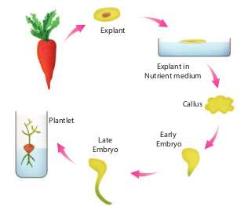

**Redifferentiation** 
The further differentiation of already differentiated cell into another type of cell. For example, when the component cells of callus have the ability to form a whole plant in a nutrient medium, the phenomenon is called redifferentiation.

**Dedifferentiation** 
The phenomenon of the reversion of mature cells to the meristematic state leading to the formation of callus is called dedifferentiation. These two phenomena of redifferentiation and dedifferentiation are the inherent capacities of living plant cells or tissue. This is described as totipotency.

## Plant Tissue Culture (PTC)
Plant tissue culture is used to describe the _in vitro_ and aseptic growth of any plant part on a tissue culture medium. This technology is based on three fundamental principles: 
- The plant part or explant must be selected and isolated from the rest of plant body.
- The explant must be maintained in controlled physically (environmental) and chemically defined (nutrient medium) conditions.
- Aseptic condition must be maintained, which requires high degree of cleanliness in the laboratory.

```
**Explant:** The tissue taken from a selected** plant transferred to a culture medium often to establish a new plant.

```
### Laboratory Facilities for PTC
For PTC, the laboratory must have the following facilities:

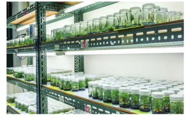

- Washing facility for glassware and ovens for drying glassware.
- Medium preparation room with autoclave,electronic balance and pH meter. 
- Transfer area sterile room with laminar air-flow bench and a positive pressure ventilation unit called High Efficiency Particulate Air (HEPA) filter to maintain aseptic condition.
- Culture facility: Growing the explant inoculated into culture tubes at 22-28° C with illumination of light 2400 lux, with a photoperiod of 8-16 hours and a relative humidity of about 60%.

### Technique Involved in PTC

#### 1. Sterilization
Sterilization is the technique employed to get rid of microbes such as bacteria and fungi in the culture medium, vessels and explants. 

i. **Maintenance of Aseptic Environment:** During in vitro tissue culture maintenance of aseptic environmental condition should be followed, i.e., sterilization of glassware, forceps, scalpels, and all accessories in wet steam sterilization by autoclaving at 15 psi (121°C) for 15 to 30 minutes or dipping in 70% ethanol followed by flaming and cooling. 

ii. **Sterilization of culture room:** Floor and walls are washed first with detergent and then with 2% sodium hypochlorite or 95% ethanol. The cabinet of laminar airflow is sterilized by clearing the work surface with 95% ethanol and then exposure of UV radiation for 15 minutes. 

iii. **Sterilization of Nutrient Media:** Culture media are dispensed in glass containers, plugged with non-absorbent cotton or sealed with plastic closures and then sterilized using autoclave at 15 psi (121°C) for 15 to 30 minutes. The plant extracts, vitamins, amino acids and hormones are sterilized by passing through Millipore filter with 0.2 mm pore diameter and then added to sterilized culture medium inside Laminar Airflow Chamber under sterile condition.

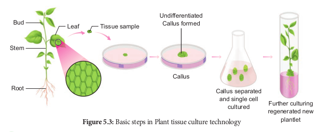

iv. **Sterilization of Explants:** The plant materials to be used for tissue culture should be surface sterilized by first exposing the material in running tap water and then treating it in surface sterilization agents like 0.1% mercuric chloride, 70% ethanol under aseptic condition inside the Laminar Air Flow Chamber.

#### 2. Media Preparation
The success of tissue culture lies in the composition of the growth medium, plant growth regulators and culture conditions such as temperature, pH, light and humidity. No single medium is capable of maintaining optimum growth of all plant tissues. Suitable nutrient medium as per the principle of tissue culture is prepared and used.

MS nutrient medium (Murashige and Skoog 1962) is commonly used. It has carbon sources, with suitable vitamins and hormones. The media formulations available for plant tissue culture other than MS are B5 medium (Gamborg.et.al 1968), White medium (white 1943), Nitsch’s medium (Nitsch & Nitsch 1969). A medium may be solid or semisolid or liquid. For solidification, a gelling agent such as agar is added.

**Agar:** A complex mucilaginous polysaccharide obtained from marine algae (sea weeds) used as solidifying agent in media preparation.


#### 3. Culture condition

**pH** 
The pH of medium is normally adjusted between 5.6 to 6.0 for the best result.

**Temperature** 
The cultures should be incubated normally at constant temperature of 25°C ± 2°C for optimal growth.

**Humidity and Light Intensity** 
The cultures require 50-60% relative humidity and 16 hours of photoperiod by the illumination of cool white fluorescent tubes of approximately 1000 lux.

**Aeration** 
Aeration to the culture can be provided by shaking the flasks or tubes of liquid culture on automatic shaker or aeration of the medium by passing with filter-sterilized air.

#### 4. Induction of Callus


Explant of 1-2 cm sterile segment selected from leaf, stem, tuber or root is inoculated (transferring the explants to sterile glass tube containing nutrient medium) in the MS nutrient medium supplemented with auxins and incubated at 25°C ± 2°C in an alternate light and dark period of 12 hours to induce cell division and soon the upper surface of explant develops into callus. Callus is a mass of unorganized growth of plant cells or tissues in _in vitro_ culture medium.

#### 5. Embryogenesis
The callus cells undergoes differentiation and produces somatic embryos, known as **Embryoids. The embryoids** are sub-cultured to produce plantlets.

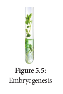

#### 6. Hardening

The plantlets developed in vitro require a hardening period and so are transferred to greenhouse or hardening chamber and then to normal environmental conditions. Hardening is the gradual exposure of _in vitro_ developed plantlets in humid chambers in diffused light for acclimatization so as to enable them to grow under normal field conditions.

### Types of Plant tissue cultures
Based on the type of explant other plant tissue culture types are 
1. Organ culture 
2. Meristem culture 
3. Protoplast culture 
4. Cell suspension culture.

**1. Organ culture**

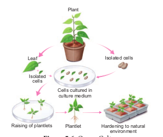

The culture of embryos, anthers, ovaries, roots, shoots or other organs of plants on culture media.

**2. Meristem Culture:** The culture of any plant meristematic tissue on culture media.

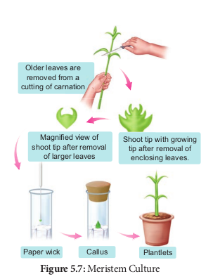

**3. Protoplast Culture:** 
Protoplasts are cells without a cell wall, but bound by a cell membrane or plasma membrane. Using protoplasts, it is possible to regenerate whole plants from single cells and also develop somatic hybrids. The steps involved in protoplast culture. i. **Isolation of protoplast:** Small bits of plant tissue like leaf tissue are used for isolation of protoplast. The leaf tissue is immersed in 0.5% Macrozyme and 2% Onozuka cellulase enzymes dissolved in 13% sorbitol or mannitol at pH 5.4. It is then incubated over-night at 25°C. After a gentle teasing of cells, protoplasts are obtained, and these are then transferred to 20% sucrose solution to retain their viability. They are then centrifuged to get pure protoplasts as different from debris of cell walls.

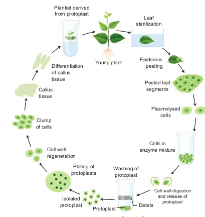

ii. **Fusion of protoplast:** It is done through the use of a suitable fusogen. This is normally PEG (Polyethylene Glycol). The isolated protoplast are incubated in 25 to 30% concentration of PEG with Ca++ ions and the protoplast shows agglutination (the formation of clumps of cells) and fusion. 

iii. **Culture of protoplast:** MS liquid medium is used with some modification in droplet, plating or micro-drop array techniques. Protoplast viability is tested with fluorescein diacetate before the culture. The cultures are incubated in continuous light 1000-2000 lux at 25°C. The cell wall formation occurs within 24-48 hours and the first division of new cells occurs between 2-7 days of culture. 

**iv. Selection of somatic hybrid cells:**
The fusion product of protoplasts without nucleus of different cells is called a cybrid. Following this nuclear fusion takes place. This process is called somatic hybridization.

**4. Cell Suspension Culture** The growing of cells including the culture of single cells or small aggregates of cells _in vitro_ in liquid medium is known as cell suspension culture. The cell suspension is prepared by transferring a portion of callus to the liquid medium and agitated using rotary shaker instrument. The cells are separated from the callus tissue and used for cell suspension culture.

**Production of Secondary Metabolites** Cell suspension culture can be useful for the production of secondary metabolites like alkaloids, flavonoids, terpenoids, phenolic compounds and recombinant proteins. Secondary metabolites are chemical compounds that are not required by the plant for normal growth and development but are produced in the plant as ‘byproducts’ of cell metabolism. For Example: Biosynthesis and isolation of indole alkaloids from _Catharanthus roseus_ plant cell culture.

The process of production of secondary metabolites can be scaled up and automated using bio-reactors for commercial production. Many strategies such as biotransformation, elicitation and immobilization have been used to make cell suspension cultures more efficient in the production of secondary metabolites. Few examples of industrially important plant secondary metabolites are listed below in the table:

| **Secondary metabolites** 	| **Plant source**        	| **Uses**                    	|
|---------------------------	|-------------------------	|-----------------------------	|
| Digoxin                   	| Digitalis<br>purpurea   	| Cardiac tonic               	|
| Codeine                   	| Papaver<br>somniferum   	| Analgesic                   	|
| Capsaicin                 	| Capsicum<br>annuum      	| Rheumatic<br>pain treatment 	|
| Vincristine               	| Catharanthus<br>roseus  	| Anti-<br>carcinogenic       	|
| Quinine                   	| Cinchona<br>officinalis 	| Antimalarial                	|

## Plant Regeneration Pathway

From the explants, plants can be regenerated by somatic embryogenesis or organogenesis.

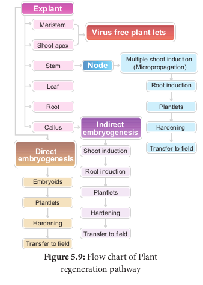

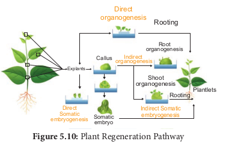 

### Somatic Embryogenesis

Somatic embryogenesis is the formation of embryos from the callus tissue directly and these embryos are called **Embryoids** or from the _in vitro_ cells directly form pre-embryonic cells which differentiate into embryoids.

**Applications** 
- Somatic embryogenesis provides potential plantlets which after hardening period can establish into plants.
- Somatic embryoids can be be used for the production of synthetic seeds.
- Somatic embryogenesis is now reported in many plants such as _Allium sativum_, _Hordeum vulgare, Oryza sativa, Zea mays_ and this possible in any plant.

Synthetic seeds are produced by encapsulation of embryoids in agarose gel or calcium alginate.

### Organogenesis
The morphological changes occur in the callus leading to the formation of shoot and roots is called organogenesis.

Callus Differentiation Plantlets

Shoots (Caulogenesis)

Roots (Rhizogenesis)
- Organogenesis can be induced _in vitro_ by introducing plant growth regulators in the MS medium.
- Auxin and cytokinins induce shoot and root formation.

## Applications of Plant Tissue Culture
Plant tissue culture techniques have several applications such as: 

i. Improved hybrids production through somatic hybridization.

ii. Somatic embryoids can be encapsulated into synthetic seeds (synseeds). These encapsulated seeds or synthetic seeds help in conservation of plant biodiversity.

iii. Production of disease resistant plants through meristem and shoot tip culture.

iv. Production of stress resistant plants like herbicide tolerant, heat tolerant plants.

v. Micropropagation technique to obtain large numbers of plantlets of both crop and tree species useful in forestry within a short span of time and all through the year.

vi. Production of secondary metabolites from cell culture utilized in pharmaceutical, cosmetic and food industries.

### Somaclonal variations:
Somatic variations found in plants regenerated in vitro (i.e. variations found in leaf, stem, root, tuber or propagule) 

### Gametoclonal variations: 
Gametophytic variations found in plants regenerated in vitro gametic origin (i.e. variations found in gametes and gametophytes)

### Micropropagation of Banana
 Micropropagation of plants at industrial level maintains high standards of homogeneity in plants like pineapple, banana, strawberry and potato.

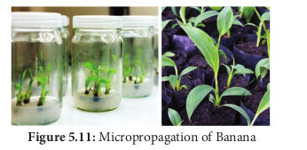

### Artificial Seed

Artificial seeds or synthetic seeds (synseeds) are produced by using embryoids (somatic embryos) obtained through in vitro culture. They may even be derived from single cells from any part of the plant that later divide to form cell mass containing dense cytoplasm, large nuclceus, starch grains, proteins, and oils etc., To prepare the artificial seeds different inert materials are used for coating the somatic embryoids like agrose and sodium alginate.


**Advantages of Artificial seeds** 

Artificial seeds have many advantages over the true seeds 
- Millions of artificial seeds can be produced at any time at low cost. 
- They provide an easy method to produce genetically engineered plants with desirable traits.
- It is easy to test the genotype of plants. 
- They can potentially stored for long time under cryopreservation method. 
- Artificial seeds produce identical plants 
- The period of dormancy of artificial seeds is greatly reduced, hence growth is faster with a shortened life cycle.

### Virus-free plants
The field grown plants like perennial crops, usually are infected by variety of pathogens like fungi, bacteria, mycoplasma, viruses which cause considerable economic losses. Chemical methods can be used to control fungal and bacterial pathogens, but not viruses generally.

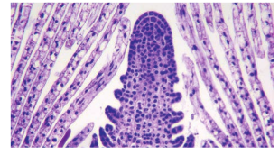

Shoot meristem tip culture is the method to produce virus-free plants, because the shoot meristem tip is always free from viruses.

## Conservation of plant genetic resources

### Germplasm Conservation
Germplasm conservation refers to the conservation of living genetic resources like pollen, seeds or tissue of plant material maintained for the purpose of selective plant breeding, preservation in live condition and used for many research works.

Germplasm conservation resources is a part of collection of seeds and pollen that are stored in seed or pollen banks, so as to maintain their viability and fertility for any later use such as hybridization and crop improvement. Germplasm conservation may also involve a gene bank, DNA bank of elite breeding lines of plant resources for the maintenance of biological diversity and also for food security.

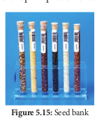


### Cryopreservation (–195.C)
 Cryopreservation, also known as Cryo-conservation, is a process by which protoplasts, cells, tissues, organelles, organs, extracellular matrix, enzymes or any other biological materials are subjected to preservation by cooling to very low temperature of –196°C using liquid nitrogen. At this extreme low temperature any enzymatic or chemical activity of the biological material will be totally stopped and this leads to preservation of material in dormant status. Later these materials can be activated by bringing to room temperature slowly for any experimental work.

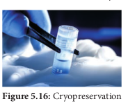

Protective agents like dimethyl sulphoxide, glycerol or sucrose are added before cryopreservation process. These protective agents are called cryoprotectants, since they protect the cells, or tissues from the stress of freezing temperature.

## Intellectual Property Right (IPR)
 Intellectual property right (IPR) is a category of rights that includes intangible creation of the human intellect, and primarily consists of copyrights, patents, and trademarks. It also includes other types of rights, such as trade secrets, publicity rights, moral rights, and rights against unfair competition.

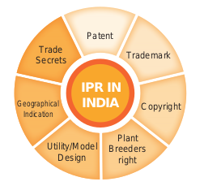

- In biotechnology, the transformed microorganisms and plants and technologies for the production of commercial products are exclusively the property of the discoverer.
- The discoverer has the full rights on his property. It should not be neglected by the others without legal permission.
- The right of discoverer must be protected and it does by certain laws framed by a country.
- The IPR is protected by different ways like patents, copyrights, trade secrets and trademarks, designs and geographical indications.

### Patents
- It is a special right to the discoverer/inventor that has been granted by the government through legislation for trading new articles.
- A patent is a personal property which can be licensed or sold by the person or organisation just like any other property.
- Patent terms give the inventor the rights to exclude others from making, using or selling his invention.

### Biosafety and Bioethics
Advances in biotechnology and their applications deals with genetic manipulation. 

**Biosafety** Biosafety is the prevention of large-scale loss of biological integrity, focusing both on ecology and human health. These prevention mechanisms include conduction of regular reviews of the biosafety in laboratory settings, as well as strict guidelines to follow. Many laboratories handling biohazards employ an ongoing risk management assessment and enforcement process for biosafety. Failures to follow such protocols can lead to increased risk of exposure to biohazards or pathogens.

**Bioethics - Ethical, Legal and Social Implications (ELSI)** 

Bioethics refers to the study of ethical issues emerging from advances in biology and medicine. It is also a moral discernment as it relates to medical policy and practice. Bioethicists are concerned with the ethical questions that arise in the relationships among life sciences, biotechnology and medicine. It includes the study of values relating to primary care and other branches of medicine. The scope of bioethics is directly related to biotechnology, including cloning, gene therapy, life extension, human genetic engineering, astroethics life in space, and manipulation of basic biology through altered DNA, RNA and proteins. These developments in biotechnology will affect future evolution, and may require new principles, such as biotic ethics, that values life and its basic biological characters and structures. The Ethical, Legal, and Social Implications (ELSI) program was founded in 1990 as an integral part of the Human Genome Project. The mission of the ELSI program was to identify and address issues raised by genomic research that would affect individuals, families, and society. A percentage of the Human Genome Project budget at the National Institutes of Health and the U.S. Department of Energy was devoted to ELSI research. 

**Genetic Engineering Appraisal Committee (GEAC)** 

GEAC is an apex body under Ministry of Environment, Forests and Climate change for regulating manufacturing, use, import, export and storage of hazardous microbes or genetically modified organisms (GMOs) and cells in the country. It was established as an apex body to accord approval of activities involving large scale use of hazardous microorganisms and recombinants in research and industrial production. The GEAC is also responsible for approval of proposals relating to release of genetically engineered organisms and products into the environment including experimental field trials.

## Future of Biotechnology
Biotechnology has become a comprehensive scientific venture from the point of academic and commercial angles, within a short time with the sequencing of human genome and genome of some important organisms. The future developments in biotechnology will be exciting. Thus the development in biotechnology will lead to a new scientific revolution that would change the lives and future of people. Like industrial and computer revolution, biotechnological revolution will also promise major changes in many aspects of modern life.

**Summary** 

Tissue culture is the in vitro asceptic culture of cells, tissues or organs into whole plants under controlled nutritional and environmental conditions. A German physiologist Gotllieb Haberlant in 1902 for the first time attempted to culture plant cells in artificial medium, hence he was regarded as father of Tissue culture. Tissue culture mainly based on the concepts totipotency, differentiation, redifferentiation and dedifferentiation. Plant tissue culture technique involves selection of explants, sterilization, media preparation, maintaining culture condition, callus formation, embryogenesis or organgenesis and hardening. Based on the explants chosen the types of tissue culture are organ culture, meristem culture, protoplast culture and cell suspension culture. From the explants, plants can be regenerated by somatic embryogenesis or organgenesis is said to be plant regeneration pathway. Some of the main applications of tissue culture are production of somatic hybrids, artificial seeds, disease resistant and stress resistant plants, germplasm conservation, micropropagation and production of secondary metabolites. Intellectual Property Right (IPR) is primarily aimed at patents, copyrights, trade secret and trademark given to the discoverer / inventor for the commercial production of transformed micro organisms or plants. Biosafety is the prevention mechanism to protect harmful incidents due to biohazards or pathogens. Bioethics dealt with ethical issue emerging from biotechnological advancement. ELSI program addresses issues related to genenomic research. GEAC (Genetic Engineering Appraisal Committee) is a regulatory authority for release of genetically modified products or organisms into the environment.

