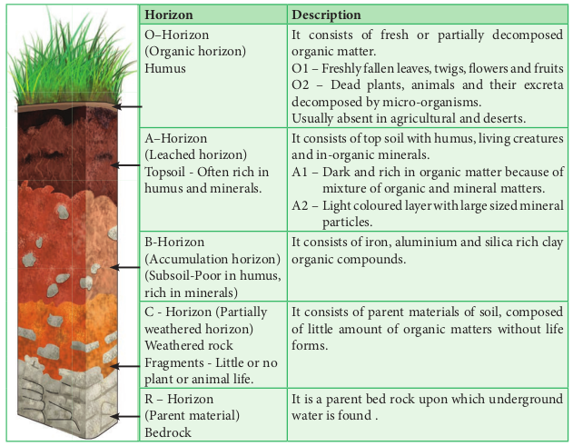
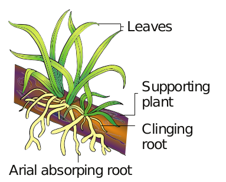
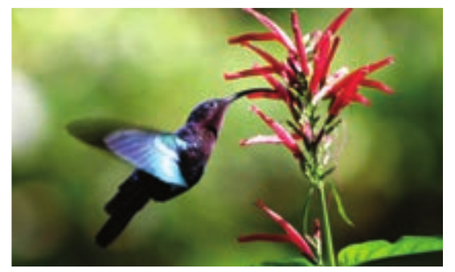

```hint { role="info" }
Learning Objectives 

The learner will be able to 
- Understand the interaction between organisms and their environment.
- Describe biotic and abiotic factors that influence the dynamics of populations.
- Describe how organisms adapt themselves to environmental changes. 
- Learn the structure of various fruits and seeds related to their dispersal mechanism.

```

Ecology is a division of biology which deals with the study of environment in relation to organisms. It can be studied by considering individual organisms, population, community, biome or biosphere and their environment. While observing our different environments, one can ask questions like

- Why do plants or animals vary with places?
- What are the causes for variation in biological diversity of different places?
- How soil, climate and other physical features affect the flora and fauna or vice versa? 

These questions can be better answered with the study of ecology. Ecology is essentially a practical science involving experiments, continuous observations to predict how organisms react to particular environmental circumstances and understanding the principles involved in ecology.

## Ecology

The term “ecology” (oekologie) is derived from two Greek words – oikos (meaning house or dwelling place and logos meaning study) It was first proposed by **R. Misra Reiter** (1868). However, the most widely accepted definition of ecology was given by **Ernest Haeckel**(1869). 


> Alexander von Humbolt - Father of Ecology 

> Eugene P. Odum - Father of modern Ecology 

>R. Misra - Father of Indian Ecology


### Definitions of ecology

“The study of living organisms, both plants and animals, in their natural habitats or homes.”

*Reiter (1885) “Ecology is the study of the reciprocal relationship between living organisms and their environment.” - Earnest Haeckel (1889) 

### Ecological hierarchy

The interaction of Biosphere organisms with their environment results in Biome the establishment of grouping of organisms Landscape which is called ecological hierarchy or ecological Ecosystem levels of organization. The basic unit of Community ecological hierarchy is an individual organism. The Population hierarchy of ecological systems is illustrated below: Individual organism

### Branches of Ecology:

Ecology is mainly divided into two branches, they are autecology and synecology.

1.  Autecology is the ecology of an individual species and is also called species ecology.
    
2.  Synecology is the ecology of a population or community with one or more species and also called as community ecology. Many advances and developments in the field ecology resulted in various new dimensions and branches. Some of the advanced fields are Molecular ecology, Eco technology, Statistical ecology and Environmental toxicology.

### Habitat and Niche

**Habitat**
Habitat is a specific physical place or locality occupied by an organism or any species which has a particular combination of abiotic or environmental factors. But the environment of any community is called **Biotope**. 

**Niche** 
An ecological niche refers to an organism’s place in the biotic environment and its functional role in an ecosystem. The term was coined by the naturalist **Roswell Hill Johnson** but **Grinell** ( 1917. was probably first to use this term. The habitat and niche of any organism is called **Ecotope** 

The differences between habitat and niche are as follows.

|    	| Habitat                                                                 	| Niche                                                                        	|
|----	|-------------------------------------------------------------------------	|------------------------------------------------------------------------------	|
| 1. 	| A specific<br>physical space<br>occupied by<br>an organism<br>(species) 	| A functional space <br>occupied by an <br>organism in the same<br>eco-system 	|
| 2. 	| Same habitat<br>may be shared by<br>many organisms<br>(species)         	| A single niche is<br>occupied by a single<br>species                         	|
| 3. 	| Habitat<br>specificity is<br>exhibited by<br>organism.                  	| Organisms may<br>change their niche<br>with time and season.                 	|

```hint { role="info" }
Do You Know
**Applied ecology or environmental technology :**
Application of the Science of ecology is otherwise called as Applied ecology or Environmental technology. It helps us to manage and conserve natural resources, particularly ecosystems, forest and wild life conservative and management. Environmental management involves Bio-diversity conservation, Ecosystem restoration, Habitat management, Invasive species management, Protected areas management and also help us plan landscapes and environmental impact designing for the futuristic ecology.
```

### Ecological equivalents

Taxonomically different species occupying similar habitats (Niches) in different geographical regions are called **Ecological equivalents.**

Examples:
- Certain species of epiphytic orchids of Western Ghats of India differ from the epiphytic orchids of South America. But they are epiphytes.

- Species of the grass lands of Western Ghats of India differ from the grass species of temperate grass lands of Steppe in North America. But they are all ecologically primary producers and fulfilling similar roles in their respective communities.

## Ecological factors

Many organisms, co-exist in an environment. The environment (surroundin g) includes physical, chemical and biological components. When a component surrounding an organism affects the life of an organism, it becomes a factor. All such factors together are called **environmental factors** or **ecological factors.** These factors can be classified into living **(biotic)** and non-living **(abiotic)** which make the environment of an organism. However the ecological factors are meaningfully grouped into four classes, which are as follows:

i. Climatic factors
ii. Edaphic factors
iii. Topographic factors 
iv. Biotic factors 

We will discuss the above factors in a concise manner.

```hint { role="info" }
Do You Know

Flowers of poppy, chicory, dog rose and many other plants, blossom before the break of dawn (4 – 5 am), evening primrose open up with the onset of dusk (5 – 6 pm) due to diurnal rhythm.

```

### Climatic Factors

Climate is one of the important natural factors controlling the plant life. The climatic factors includes light, temperature, water, wind and fire.


#### a. Light

Light is a well known factor needed for the basic physiological processes of plants, such as photosynthesis, transpiration, seed germination and flowering. The portion of the sunlight which can be resolved by the human eye is called **visible light**. The visible part of light is made- up of wavelength from about 40. nm (**violet**) to 70. nm (re d) . The rate of photosynthesis is maximum at **blue** ( 40. – ## nm) and red (600 –70.  nm). The **green** (## – 600 nm) wave length of spectrum is less strongly absorbed by plants. 

**Effects of light on plants** 


Based on the tolerance to intensities of light, the plants are divided into two types. They are

**1.Heliophytes** - Light loving plants. Example: Angiosperms.
    
**2.Sciophytes** - Shade loving plants. Example: Bryophytes and Pteridophytes. 

In deep sea (>500m), the environment is dark and its inhabitants are not aware of the existence of celestial source of energy called Sun. What, then is their source of energy? 

```hint { role="warm" }
Do You Know

**Palaeoclimatology**– Helps to reconstruct past climates of our planet and flora, fauna and ecosystem in which they lived. Example: Air bubbles trapped in ice for tens of thousands of years with fossilized pollen, coral, plant and animal debris.

```

#### b. Temperature

Temperature is one of the important factors which affect almost all the metabolic activities of an organism. Every physiological process in an organism requires an optimum temperature at which it shows the maximum metabolic rate. Three limits of temperature can be recognized for any organism. They are
    
1.  **Minimum temperature** - Physiological activities are lowest.
    
2.  **Optimum temperature** - Physiological activities are maximum.
    
3.  **Maximum temperature** - Physiological activities will stop. 

Based on the temperature prevailing in an area, **Raunkiaer** classified the world’s vegetation into the following four types. They are megatherms, mesotherms, microtherms and hekistotherms. In thermal springs and deep sea hydrothermal vents the average temperature exceed 100oc.

Based on the range of thermal tolerance, organisms are divided into two types.

**1. Eurythermal**: Organisms which can tolerate a wide range of temperature fluctuations.

*Example: Zostera (A marine Angiosperm)and Artemisia tridentata*

**2. Stenothermal**: Organisms which can tolerate only small range of temperature variations. Example: Mango and Palm (Terrestrial Angiosperms).

Mango plant does not grow in temperate countries like Canada and Germany.
    
#### Thermal Stratification
It is usually found in aquatic habitat. The change in the temperature profile with increasing depth in a water body is called thermal stratification. There are three levels of thermal stratifications


**1.Epilimnion** – The upper layer of warmer water.
    
**2.Metalimnion** – The middle layer with a zone of gradual decrease in temperature.
    
**3.Hypolimnion** - The bottom layer of colder water.
    
### Temperature based zonation

Variations in latitude and altitude do affect the temperature and the vegetation on the earth surface. The latitudinal and altitudinal zonation of vegetation is illustrated below: 

**Latitude:** Latitude is an angle which ranges from 0. at the equator to ## at the poles. 

**Altitude:** How high a place is located above the sea level is called the altitude of the place.


**Timber line / Tree line:** It is an imaginary line in a mountain or higher areas of land that marks the level above which trees do not grow. The altitudinal limit of normal tree growth is about **3000 to 4000m.** 

**Effects of temperature** 

The following physiological processes are influenced by temperature:
- Temperature affects the enzymatic action of all the bio-chemical reactions in a plant body.

- It influences CO2 and O2 solubility in the biological systems. Increases respiration and stimulates growth of seedlings.
- Low temperature with high humidity can cause spread of diseases in plants.
- The varying temperature with moisture determines the distribution of the vegetation types.

#### c. Water 
Water is one of the most important climatic factors. It affects the vital processes of all living organisms. It is believed that even life had originated only in water during the evolution of Earth. Water covers more than 70. of the earth’s surface. In nature, water is available to plants in three ways. They are **atmospheric moisture, precipitation and soil water.**
```hint { role="warm" }
Do You Know

Evergreen forests – Found where heavy rainfall occurs throughout the year. Sclerophyllous forests – Found where heavy rainfall occurs during winter and low rainfall during summer. 
```

The productivity and distribution of plants depend upon the availability of water. Further the quality of water is also important especially for the aquatic organisms. The total amount of water salinity in different water bodies are :i). 5. in inland water (Fresh water) ii). 3. – 35% in sea water and iii). More than 100. in hypersaline water **(Lagoons)** Based on the range of tolerance of salinity, organisms are divided into two types.

**1. Euryhaline:** Organisms which can live in water with wide range of salinity. Examples: Marine algae and marina angiosperms
    
**2.Stenohaline:** Organisms which can withstand only small range of salinity. Example: Plants of estuaries.
    
| Terminology  	|             	| Environmental factor       	|
|--------------	|-------------	|----------------------------	|
| Stenothermal 	| Eurythermal 	| Temperature                	|
| Stenohaline  	| Euryhaline  	| Salinity                   	|
| Stenoecious  	| Euryoecious 	| Habitat selection (niche)  	|
| Stenohydric  	| Euryhydric  	| Water                      	|
| Stenophagic  	| Euryphagic  	| Food                       	|
| Stenobathic  	| Eurybathic  	| Depth of water/habitat     	|


**Examples of tolerance to toxicity**

i. Soyabean and tomato manage to tolerate presence of cadmium poisoning by isolating cadmium and storing into few group of cells and prevent cadmium affecting other cells .

ii. Rice and Eichhornia (water hyacinth ) tolerate cadmium by binding it to their proteins. 

These plants otherwise can also be used to remove cadmium from contaminated soil ,this is known as **Phytoremediation.** 

#### d. Wind 

Air in motion is called wind. It is also a vital ecological factor. The atmospheric air contains a number of gases, particles and other constituents. The composition of gases in atmosphere is as follows: Nitrogen - 78. , Oxygen -21%, Carbon-di-oxide -0.03%, Argon and other gases - 0.93%. The other components of wind are water vapour, gaseous pollutants, dust, smoke particles, microorganisms, pollen grains, spores, etc. **Anemometer** is the instrument used to measure the speed of wind. 

```hint { role="warm" }
Do You Know

**Green House Effect Albedo Effect**

Gases let out to atmosphere causes climatic change. Emission of dust and aerosols (small solids or liquid particles in suspension in the atmospher e) from industries, automobiles, forest fire, So2 and DMS (dimethyl sulphur) play an important role in disturbing the temperature level of any region. Aerosols with small particles is reflecting the solar radiation entering the atmosphere. This is known as Albedo effect. So it reduces the temperature (coolin g)  
limits, photosynthesis and respiration. The sulphur compounds are responsible for acid rain due to acidification of rain water and destroy the ozone.
```

**Effects of wind**

- W ind is an important factor for the formation of rain
- C auses wave formation in lakes and ocean, promotes aeration of water
- S trong wind causes soil erosion and reduces soil fertility
- Increases the rate of transpiration
- H elps in pollination in anemophilous plants
- I t also helps in dispersal of many fruits, seeds, spores, etc.

- Strong wind may cause up-rooting of big trees

- Unidirectional wind stimulates the development of flag Figure 6. 6. Flag forms in trees. form in trees 

#### e. Fire

Fire is an exothermic factor caused due to the chemical process of combustion, releasing heat and light. It is mostly man-made and some- times develops naturally due to the friction between the tree surfaces. Fire is generally divided into

**1.Ground fire** – Which is flameless and subterranean.
    
**2.Surface fire** – Which consumes the herbs and shrubs.
    
**3. Crown fire** – Which burns the forest canopy.

**Effects of fire**
- Fire has a direct lethal effect on plants
- Burning scars are the suitable places for the entry of parasitic fungi and insects
- It brings out the alteration of light, rainfall, nutrient cycle, fertility of soil, pH, soil flora and fauna
- Some fungi which grow in soil of burnt areas called pyrophilous.
    

*Example: Pyronema confluens.*

**Indicators of fire** – Pteris ( fern ) and Pyronema (fungus) indicates the burnt up and fire disturbed areas. So they are called indicators of fire.

**Fire break** – It is a gap made in the vegetation that acts as a barrier to slow down or stop the progress of fire.

**A natural fire break** may occur when there is a lack of vegetation such as River, lake and canyon found in between vegetation may act as a natural fire break.

**Rhytidome:** It is the structural defense by plants against fire .The outer bark of trees which extends to the last formed periderm is called Rhytidome. It is composed of multiple layers of suberized periderm, cortical and phloem tissues. It protects the stem against fire , water loss, invasion of insects and prevents infections by microorganisms.

### Edaphic factors

Edaphic factors, the abiotic factors related to soil, include the physical and chemical composition of the soil formed in a particular area. The study of soils is called Pedology. 

#### The soil
Soil is the weathered superficial layer of the Earth in which plants can grow. It is a complex composite mass consisting of soil constituents, soil water, soil air and soil organisms, etc. 

**Soil formation** 
Soil originates from rocks and develops gradually at different rates, depending upon the ecological and climatic conditions. Soil formation is initiated by the weathering process. Biological weathering takes place when organisms like bacteria, fungi, lichens and plants help in the breakdown of rocks through the production of acids and certain chemical substances.

#### Soil types 
Based on soil formation **(pedogenesis)**, the soils are divided into

**1.Residual soils** –These are soils formed by weathering and pedogenesis of the rock.
    
**2.Transported soils** – These are transported by various agencies. The important edaphic factors which affect vegetation are as follows:
    
**3.Soil moisture:** Plants absorbs rain water and moisture directly from the air
    
**4.Soil water:** Soil water is more important than any other ecological factors affecting the distribution of plants. Rain is the main source of soil water. Capillary water held between pore spaces of soil particles and angles between them is the most important form of water available to the plants.
    
**5.Soil reactions:** Soil may be **acidic** or **alkaline** or **neutral** in their reaction. pH value of the soil solution determines the availability of plant nutrients. The best pH range of the soil for cultivation of crop plants is ## to 6.8.
    
**6.Soil nutrients:** Soil fertility and productivity is the ability of soil to provide all essential plant nutrients such as minerals and organic nutrients in the form of ions.
    
**7.Soil temperature:** Soil temperature of an area plays an important role in determining the geographical distribution of plants. Low temperature reduces use of water and solute absorption by roots.
    
**8.Soil atmosphere:** The spaces left between soil particles are called pore spaces which contains oxygen and **carbon-di-oxide.**
    
**9.Soil organisms:** Many organisms existing in the soil like bacteria, fungi, algae, protozoans, nematodes, insects, earthworms, etc. are called soil organisms. 
    



#### Soil Profile 

Soil is commonly stratified into horizons at different depth. These layers differ in their physical, chemical and biological properties. This succession of super-imposed horizons is called soil profile. 

**Types of soil particles** 
Based on the relative proportion of soil particles, four types of soil are recognized.

|   	| **Soil type** 	| **Size**                 	| **Relative proportion**                             	|
|---	|---------------	|--------------------------	|-----------------------------------------------------	|
| 1 	| Clayey soil   	| Less than<br>0.002<br>mm 	| 50% clay and 50%<br>silt ( cold / heavy<br>soil )   	|
| 2 	| Silt soil     	| 0.002 to<br>0.02mm       	| 90% silt and 10% sand                               	|
| 3 	| Loamy soil    	| 0.002 to 2mm             	| 70% sand and 30 % clay / silt or both (Garden soil) 	|
| 4 	| Sandy soil    	| 0.2 to 2 mm              	| 85% sand and 15% clay ( light soil )                	|


**Loamy soil is ideal soil for cultivation.**
It consists of 70. sand and 30% clay or silt or both. It ensures good retention and proper drainage of water. The porosity of soil provides adequate aeration and allows the penetration of roots. Based on the water retention, aeration and mineral contents of soil, the distribution of vegetation is divided into following types.

**1.Halophytes:** Plants living in saline soils
    
**2.Psammophytes:** Plants living in sandy soils
    
**3.Lithophytes:** Plants living on rocky surface
    
**4.C hasmophytes:** Plants living in rocky crevices
    
**5.Cryptophytes:** Plants living below the soil surface
    
**6.Cryophytes:** Plants living on surface of ice
    
**7.Oxylophytes:** Plants living in acidic soil
    
**8.Calciphytes:** Plants living in calcium rich alkaline soil.
**Holard** – Total soil water content 
**Chresard** –Water available to plants 
**Echard** – Water not available to plants

### Topographic factors

The surface features of earth are called **topography.** Topographic influence on the climate of any area is determined by the interaction of solar radiation, temperature, humidity, rainfall, latitude and altitude. It affects the vegetation through climatic variations in small areas (micro climate ) and even changes the soil conditions. Topographic factors include latitude, altitude, direction of mountain, steepness of mountain etc. 

#### Latitudes and altitudes
Latitudes represent distance from the equator. Temperature values are maximum at the equator and decrease gradually towards poles. Different types of vegetation occur from equator to poles which are illustrated below.


Height above the sea level forms the **altitude.** At high altitudes, the velocity of wind remains high, temperature and air pressure decrease while humidity and intensity of light increases. Due to these factors, vegetation at different altitudes varies, showing distinct zonation.

#### b. Direction of Mountain
North and south faces of mountain or hill possess different types of flora and fauna because they differ in their humidity, rainfall, light intensity, light duration and temperature regions.

**Ecotone**- The transition zone between two ecosystems. Example: The border between forest and grassland. 

**Edge effect** – Species found in ecotone areas are unique due to the effect of the two habitats. Example: Owl in the ecotone area between forest and grassland.

The two faces of the mountain or hill receive different amount of solar radiation, wind action and rain. Of these two faces, the windward region possesses good vegetation due to heavy rains and the leeward region possesses poor vegetation due to rain shadows (rain deficit). 

Similarly in the soil of aquatic bodies like ponds the center and edge possess different depth of water due to soil slope and different wave actions in the water body. Therefore, different parts of the same area may possess different species of organisms. 

#### c. Steepness of the mountain 
The steepness of the mountain or hill allows the rain to run off. As a result the loss of water causes water deficit and quick erosion of the top soil resulting in poor vegetation. On the other hand, the plains and valley are rich in vegetation due to the slow drain of surface water and better retention of water in the soil. 


### Biotic factors

The interactions among living organisms such as plants and animals are called biotic factors, which may cause marked effects upon vegetation. The effects may be direct and indirect and modifies the environment. The plants mostly which lives together in a community and influence one another. Similarly, animals in association with plants also affect the plant life in one or several ways. The different interactions among them can be classified into following two types they are positive interaction and negative interaction 

#### Positive interactions 

When one or both the participating species are benefited, it is positive interaction. Examples; Mutualism and Commensalism.

##### a.Mutualism: 
It is an interaction between two species of organisms in which both are benefitted from the obligate association. The following are common examples of mutualism. 

##### Nitrogen fixation 

Rhizobium (Bacterium) forms nodules in the roots of leguminous plants and lives symbiotically. The Rhizobium obtains food from leguminous plant and in turn fixes atmospheric nitrogen into nitrate, making it available to host plants. 

|                            	| Interaction type 	| Combination 	| Effects                                                                                 	| Examples                          	|
|----------------------------	|------------------	|-------------	|-----------------------------------------------------------------------------------------	|-----------------------------------	|
|   1.Positive interaction   	|                  	|             	|                                                                                         	|                                   	|
| 1. Mutualism               	|        (+)       	| (0)         	| Both species benefitted                                                                 	| Lichen, Mycorrhiza etc.           	|
| 2. Commensalism            	|        (+)       	| (-)         	| One species is benefitted and <br>the other species is neither<br>benefitted nor harmed 	| orchids, Lianas etc.              	|
| **2.Negative interaction** 	|                  	|             	|                                                                                         	|                                   	|
| 4. Predation               	|        (+)       	| (-)         	| One species benefitted, the<br>other species are harmed                                 	| Drosera, Nepenthes etc.           	|
| 5. Parasitism              	|        (+)       	| (-)         	| One species benefitted, the<br>other species are harmed                                 	| Cuscuta, Duranta,<br>Viscum etc.  	|
| 6.Competition              	|        (-)       	| (-)         	| Harmful for both                                                                        	| Grassland species                 	|
| 7.Amensalism               	|        (-)       	| (0)         	| Harmful for one, but the<br>other species are unaffected                                	| Penicillium and<br>Staphylococcus 	|


Other examples: 
- Water fern (*Azolla*) and Root hair Nitrogen fixing Cyanobacterium Bacteria (*Anabaena*).
- *Anabaena* present in coralloid Figure 6. 10. roots of Cycas. A nodulated legume (Gymnosperm) 
- Cyanobacterium (Nosto c) found in the thalloid body of Anthoceros.(Bryophytes)
- Wasps present in fruits of fig.
- Lichen is a mutual association of an alga and a fungus.

- Roots of terrestrial plants and fungal hyphae- Mycorrhiza 

**b. Commensalism:** It is an interaction between two organisms in which one is benefitted and the other is neither benefitted nor harmed. The species that derives benefit is called the **commensal**, while the other species is called the host. The common examples of commensalism are listed below: 

#### Epiphytes 

The plants Leaves which are found growing on Supporting other plants plant without harming Clinging them are called root epiphytes. They Arial absorping root are commonly Figure 6. 11. An epiphytic plant-Vanda found in tropical rain forest.


The epiphytic higher plant (Orchi d) gets its nutrients and water from the atmosphere with the help of the hygroscopic roots which contain special type of spongy tissue called Velamen. It prepares its own food and does not depend on the host. Using the host plant only they support and does not harm it in any way.

- Many orchids, ferns, lianas, hanging mosses, Peperomia, money plant and Usnea (Lichen) are some of the examples of epiphytes.

- Spanish Moss –Tillandsia grows on the bark of Oak and Pine trees. 

```hint { role="info" }

Proto Cooperation An interaction between organisms of different species in which both organisms benefit but neither is dependent on the relationship. Example: Soil bacteria / fungi and plants growing in the soil. 
```

##### Negative interactions

When one of the interacting species is benefitted and the other is harmed, it is called **negative interaction**. Examples: predation, parasitism, competition and amensalism. 

**a. Predation:** It is an interaction between two species, one of which captures, kills and eats up the other. The species which kills is called a **predator** and the species which is killed is called a **prey**. The predator is benefitted while the prey is harmed.


**Examples:**
- A number of plants like Drosera Lamina (Sun dew Plant), Lid Nepenthes (Pitcher Tendril Plant), Dionaea Pitcher (Venus fly trap), Insect Utricularia (Bladder Fluid wort) and Sarracenia are predators which Figure 6. 12. Pitcher consume insects and plant – with insect other small animals for their food as a source of nitrogen. They are also called as insectivorous plants. 


- Many herbivores are **predators.** Cattles, Camels, Goats etc., frequently browse on the tender shoots of herbs, shrubs and trees. Generally annuals suffer more than the perennials. Grazing and browsing may cause remarkable changes in vegetation. Nearly 2. percent of all insects are known as phytophagous(feeds on plant sap and other parts of plant)
- Many **defense mechanisms** are evolved to avoid their predations by plants. Examples: Calotropis produces highly poisonous cardiac glycosides, Tobacco produces nicotine, coffee plants produce caffeine, Cinchona plant produces quinine. Thorns of Bougainvillea, spines of Opuntia, and latex of cacti also protect them from predators. 

**b. Parasitism:** It is an interaction between two different species in which the **smaller partner** (parasit e) obtains food from the **larger partner** (host or plant). So the parasitic species is benefited while the host species is harmed. Based on the host-parasite relationship, parasitism is classified into two types they are holoparasite and hemiparasite.

##### Holoparasites 
The organisms which are dependent upon the host plants for their entire nutrition are called **Holoparasites**. They are also called **total parasites**.


**Examples:**

- Cuscuta is a total stem parasite of the host plant Acacia, Duranta and many other plants. Cuscuta even gets flower inducing hormone from its host plant.

- Balanophora, Orobanche and Rafflesia are the total root parasites found on higher plants

**Hemiparasites** 
The organisms which derive only water and minerals from their host plant while synthesizing their own food by photosynthesis are called **Hemiparasites**. They are also called **partial parasites**.

Examples:
- Viscum and Loranthus are **partial stem parasites.**

- Santalum (Sandal Woo d) is a **partial root parasite.**

The parasitic plants produce the **haustorial roots** inside the host plant to absorb nutrients from the vascular tissues of host plants. 

**c.Competition:** It is an interaction between two organisms or species in which both the organisms or species are harmed. Competition is the severest in population that has irregular distribution. Competition is classified into intraspecific and interspecific.

**1.Intraspecific competition:** 
It is an interaction between individuals of the same species. This competition is very severe because all the members of species have similar requirements of food, habitat, pollination etc. and they also have similar adaptations to fulfill their needs.
    
**2.Interspecific competition:** 
It is an interaction between individuals of different species. In grassland, many species of grasses grow well as there is little competition when enough nutrients and water is available. During drought shortage of water occurs . A life and death competition starts among the different species of grass lands. Survival in both these competitions is determined by the quantity of nutrients, availability of water and migration to new areas. Different species of herbivores, larvae and grass hopper competing for fodder or forage plants. Trees, shrubs and herbs in a forest struggle for sunlight, water and nutrients and also for pollination and dispersal of fruits and seeds. The Utricularia (Bladderwort) competes with tiny fishes for small crustaceans and insects.
    

**d.Amensalism:** 
It is an interspecific interaction in which one species is inhibited while the other species is neither benefitted nor harmed. The inhibition is achieved by the secretion of certain chemicals called **allelopathic** substances. Amensalism is also called **antibiosis.**

- Penicillium notatum produces penicillin to inhibit the growth of a variety of bacteria especially Staphylococcus.
- Trichoderma inhibits the growth of fungus Aspergillus.

- Roots and hulls of Black Walnut Juglans nigra secretes an alkaloid Juglone which inhibits the growth of seedlings of Apple, Tomato and Alfalfa around it.

#### Interspecific interactions/ Co-evolutionary dynamics 
i. Mimicry: It is a phenomenon in which living organism modifies its form, appearance, structure or behavior and looks like another living organism as a self defence and increases the chance of its survival. Floral mimicry is for usually inviting pollinators but animal mimicry is often protective. Mimicry is a result of evolutionary significance due to shape and sudden heritable mutation and preservation by natural selection.


- The plant, Ophrys an orchid, the flower looks like a female insect to attract the male insect to get pollinated by the male insect and it is otherwise called ‘floral mimicry ‘.
- Carausium morosus – stick insect or walking stick. It is a protective mimicry.
- Phyllium frondosum – leaf insect, another example of protective mimicry.

**ii. Myrmecophily:** Sometimes, ants take their shelter on some trees such as Mango, Litchi, Jamun, Acacia etc. These ants act as body guards of the plants against any disturbing agent and the plants in turn provide food and shelter to these ants. This phenomenon is known as Myrmecophily. Example: Acacia and acacia ants.


**iii.Co-evolution:** The interaction between organisms, when continues for generations, involves reciprocal changes in genetic and morphological characters of both organisms. This type of evolution is called Co-evolution. It is a kind of co- adaptation and mutual change among interactive species.



Examples:
- Corolla length and proboscis length of butterflies and moths ( Habenaria and Moth ).
- Bird’s beak shape and flower shape and size.
- More examples: Horn bills and birds of Scrub jungles ,Slit size of pollinia of Apocynaceae members and leg size of insects.

## Ecological adaptations

The modifications in the structure of organisms to survive successfully in an environment are called adaptations of organisms. Adaptations help the organisms to exist under the prevailing ecological habitat. Based on the habitats and the corresponding adaptations of plants, they are classified as hydrophytes, xerophytes, mesophytes, epiphytes and halophytes. 
### Hydrophytes 

The plants which are living in water or wet places are called hydrophytes. According to their relation to water and air, they are sub- divided into following categories: i) Free floating hydrophytes,
ii. Rooted- floating hydrophytes,
iii. Submerged floating hydrophytes, iv) Rooted -submerged hydrophytes, v) Amphibious hydrophytes. 

##### i.Free floating hydrophytes: 
These plants float freely on the surface of water. They remain in contact with water and air, but not with soil. Examples: Eichhornia, Pistia and Wolffia (smallest flowering plant).

##### ii. Rooted floating hydrophytes: 
In these plants, the roots are fixed in mud, but their leaves and flowers are floating on the surface of water. These plants are in contact with soil, water and air. Examples: Nelumbo, Nymphaea, Potomogeton and Marsilea. Lotus seeds show highest longevity in plant kingdom.

##### iii. Submerged floating hydrophytes: 
These plants are completely submerged in water and not in contact with soil and air. Examples: Ceratophyllum and Utricularia. 
##### iv. Rooted- submerged hydrophytes: 
These plants are completely submerged in water and rooted in soil and not in contact with air. Examples: Hydrilla, Vallisneria and Isoetes. 

##### v. Amphibious hydrophytes (Rooted emergent hydrophytes): 
These plants are adapted to both


aquatic and terrestrial modes of life. They grow in shallow water. 
*Examples: Ranunculus, Typha and Sagittaria.*

##### Hygrophytes: 
The plants which can grow in moist damp and shady places are called hygrophytes. Examples: Habenaria (Orchi d) , Mosses (Bryophytes), etc. 

##### Morphological adaptations of Hydrophytes: In root

- Roots are totally absent in Wolffia and Salvinia or poorly developed in Hydrilla or well developed in Ranunculus.
- The root caps are replaced by root pockets. Example: Eichhornia 

##### In stem

- The stem is long, slender, spongy and flexible in submerged forms.

- In free floating forms the stem is thick, short stoloniferous and spongy; and in rooted floating forms, it is a rhizome .
- Vegetative propagation is through runners, stolon, stem and root cuttings , tubers, dormant apices and offsets.

##### In leaves

- The leaves are thin, long and ribbon shaped in Vallisneria or long and linear in Potamogeton or finely dissected in Ceratophyllum
- The floating leaves are large and flat as in Nymphaea and Nelumbo. In Eichhornia and Trapa petioles become swollen and spongy.
- In emergent forms, the leaves show **heterophylly** (Submerged leaves are dissected and aerial leaves are entir e) . Example: Ranunculus, Limnophila heterophylla and Sagittaria

##### Anatomical adaptations

- Cuticle is either completely absent or if present it is thin and poorly developed
- Single layer of epidermis is present

- Cortex is well developed with aerenchyma
- V ascular tissues are poorly developed. In emergent forms vascular elements are well developed.

- M echanical tissues are generally absent except in some emergent forms. Pith cells are sclerenchymatous. Epidermis Hypodermis Air chambers Cortex Endodermis Pericycle Xylem cavity Sieve tubes Parenchyma Phloem T.s of Hydrilla stem


##### Physiological adaptations of Hydrophytes:

- Hydrophytes have the ability to withstand anaerobic conditions .
- They possess special aerating organs. 

##### Xerophytes 

The plants which are living in dry or xeric condition are known as Xerophytes. Xerophytic habitat can be of two different types. They are: 

**a.Physical dryness:** In these habitats, soil has a little amount of water due to the inability of the soil to hold water because of low rainfall. 

**b.Physiological dryness:** In these habitats, water is sufficiently present but plants are unable to absorb it because of the absence of capillary spaces. Example: Plants in salty and acidic soil. 

Based on adaptive characters xerophytes are classified into three categories. They are Ephemerals, Succulents and Non succulent plants.

**i.Ephemerals:** 
These are also called drought escapers or drought evaders. These plants complete their life cycle within   
a short period Argemone mexicana-Ephemerals (single season). These are not true xerophytes. Examples: Argemone, Mollugo, Tribulus and Tephrosia.


**ii.Succulents:** 
These are also called drought **enduring plants**. These plants store water in their plant parts during the dry period. These plants develop certain adaptive characters to resist extreme drought conditions. Examples: Opuntia, Aloe, Bryophyllum and Begonia.

**iii. Non succulents:** These are also called **drought resistant plants ( true xerophytes)**. They face both external and internal dryness. They have many adaptations to resist dry conditions. 
*Examples: Casuarina, Nerium, Zizyphus and Acacia.*


##### Morphological Adaptations 

**In root**
- Root system is well developed and is greater than that of shoot system.
- Root hairs and root caps are also well developed.

In xerophytic plants with the leaves and stem covered with hairs are called 
**trichophyllous plants.**

*Example: Cucurbits (Melothria and Mukia)*

**In stem**

- Stems are mostly hard and woody. They may be aerial or underground

- The stems and leaves are covered with wax coating or covered with dense hairs.

- In some xerophytes all the internodes in the stem are modified into a fleshy leaf structure called **phylloclades** (Opuntia).

- In some of the others single or occasionally two internodes modified into fleshy green structure called cladode (Asparagus). In some the petiole is modified into a fleshy leaf like structure called **phyllode** (Acacia melanoxylon).


a) A succulent xerophyte: Phylloclade – Opuntia

b) Non succulent: Perennial - Capparis

c) Cladode of Asparagus

d) Phyllode – Acacia

##### In leaves

- Leaves are generally leathery and shiny to reflect light and heat.
- In some plants like Euphorbia, Acacia, Ziziphus and Capparis, the stipules are modified into spines.
- The entire leaves are modified into spines (Opuntia ) or reduced to scales (Asparagus).

##### Anatomical adaptations
- Presence of multilayered epidermis with heavy cuticle to prevent water loss due to transpiration.

- Hypodermis is well developed with sclerenchymatous tissues.
- Sunken stomata are present only in the lower epidermis with hairs in the sunken pits.
- Scotoactive type of stomata found in succulent plants .

- Vascular bundles are well developed with several layered bundle sheath.
- Mesophyll is well differentiated into palisade and spongy parenchyma.
- In succulents the stem possesses a water storage region.


(lateral wing portion only)

##### Physiological adaptations

- Most of the physiological processes are designed to reduce transpiration.
- Life cycle is completed within a short period (Ephemerals). 

##### Mesophytes 

The plants which are living in moderate conditions (neither too wet nor too dry) are known as **mesophytes.** These are common land plants. Example: Maize and Hibiscus.

##### Morphological adaptations
- Root system is well developed with root caps and root hairs
- Stems are generally aerial, stout and highly branched.

- Leaves are generally large, broad, thin with different shapes.

##### Anatomical adaptations
- Cuticle in aerial parts are moderately developed.
- Epidermis is well developed and stomata are generally present on both the epidermis.
- Mesophyll is well differentiated into palisade and spongy parenchyma.
- Vascular and mechanical tissues are fairly developed and well differentiated.

##### Physiological adaptations

- All physiological processes are normal.
- Temporary wilting takes place at room temperature when there is water scarcity.

##### Tropophytes
are plants which behave as xerophytes at summer and behave as mesophytes (or) hydrophytes during rainy season.

##### Epiphytes 
Epiphytes are plants which grow perched on other plants (Supporting plants). They use the supporting plants only as shelter and not for water or food supply. These epiphytes 
are commonly seen in tropical rain forests. Examples: Orchids, Lianas, Hanging Mosses and Money plant.

#### Morphological adaptations
- Root system is extensively developed. These roots may be of two types. They are Clinging roots and Aerial roots. 
**Clinging roots** fix the epiphytes firmly on the surface of the supporting objects. 
**Aerial roots** are green coloured roots which may hang downwardly and absorb moisture from the atmosphere with the help of a spongy tissue called **velamen.**
- Stem of some epiphytes are succulent and develop pseudobulb or tuber.
- Generally the leaves are lesser in number and may be fleshy and leathery
- **Myrmecophily** is a common occurrence in the epiphytic vegetation to prevent the predators.

- The fruits and seeds are very small and usually dispersed by wind, insects and birds. 

#### Anatomical adaptations
- Multilayered epidermis is present. Inner to the velamen tissue, the peculiar exodermis layer is present.

- Presence of thick cuticle and sunken stomata greatly reduces transpiration.
- Succulent epiphytes contain well developed parenchymatous cells to store water. 


#### Physiological 

Special adaptations Special absorption processes of water by velamen tissue .

**Halophytes**

There are special type of **Halophytic plants** which grow on soils with high concentration of salts. *Examples: Rhizophora, Sonneratia and Avicennia.*

Halophytes are usually found near the sea- shores and Estuaries. The soils are physically wet but physiologically dry. As plants cannot use salt water directly they require filtration of salt using physiological processes. This vegetation is also known as **mangrove forest** and the plants are called **mangroves.**

#### Morphological adaptations
- The temperate halophytes are herbaceous but the tropical halophytes are mostly bushy
- In addition to the normal roots, many stilt roots are developed
- A special type of negatively geotropic roots called **pneumatophores** with **pneumathodes** to get sufficient aeration are also present. They are called breathing roots. Example: Avicennia 


- Presence of thick cuticle on the aerial parts of the plant body
- Leaves are thick, entire, succulent and glossy. Some species Figure 6.26b: are aphyllous (without Succulent leaves). halophyte - Salicornia


- Viviparous mode of seed germination is found in halophytes Calyx Leaf Fruit Radicle Hypocotyl Water Mud


##### Anatomical adaptations
- Epidermal cells of stem is heavy cutinized, almost squarish and are filled with oil and tannins.

- **‘Star’shaped** sclereids and **‘H’shaped**heavy thickened spicules that provide mechanical
strength to cortex are present in the stem.

#### Physiological adaptations

- High osmotic pressure exists in some plants .

- Seeds germinate in the fruits while on the mother plant (Vivipary).

## Dispersal of Fruits and Seeds

Both fruits and seeds possess attractive colour, odour, shape and taste needed for the dispersal by birds, mammals, reptiles, fish, ants and insects even earthworms. The seed consists of an embryo, stored food material and a protective covering called **seed coat.** As seeds contain miniature but dormant future plants, their dispersal is an important criterion for distribution and establishment of plants over a wide geographical area. The dissemination of seeds and fruits to various distances from the parent plant is called seed and fruit dispersal. It takes place with the help of ecological factors such as wind, water and animals. 

Seed dispersal is a regeneration process of plant populations and a common means of colonizing new areas to avoid seedling level competition and from natural enemies like herbivores, frugivores and pathogens. 

Fruit maturation and seed dispersal is influenced by many ecologically favourable conditions such as Season (Example: Summer), suitable environment, and seasonal availability of dispersal agents like birds, insects etc. 

Seeds require agents for dispersal which are crucial in plant community dynamics in many ecosystems around the globe. They offer many benefits to communities such as food and nutrients, migration of seeds across habitats and helps spreading plant genetic diversity.

### Dispersal by Wind (Anemochory)

The individual seeds or the whole fruit may be modified to help for the dispersal by wind. Wind dispersal of fruits and seeds is quite common in tall trees. The adaptation of the wind dispersed plants are 


- Minute seeds: Seeds are minute, very
small, light and with inflated covering.
Example: Orchids.


- Wings: Seeds or whole fruits are flattened to
form a wing. Examples: Maple, Gyrocarpus,
**Dipterocarpus and Terminalia**


- **Feathery Appendages:**
Seeds or fruits may have feathery appendages which greatly increase their buoyancy to disperse to high altitudes. Examples: Vernonia and Asclepias. 

- **Censor mechanisms:** 
The fruits of many plants open in such a way that the seeds can escape only when the fruit is violently shaken by a strong wind. Examples: Aristolochia and Poppy. Guess!! Who am I…….? I am dispersed by ant and I have caruncle.

### Dispersal by Water (Hydrochory)

Dispersal of seeds and fruits by water usually occurs in those plants which grow in or near water bodies . Adaptation of hydrochory are
- Obconical receptacle with prominent air spaces. Example: Nelumbo.
- Presence of fibrous mesocarp and light pericarp. Example: Coconut.
- Seeds are light, small, provided with aril which encloses air.Example: Nymphaea.
- The fruit may be inflated. Examples: Heritiera littoralis.
- Seeds by themselves would not float may be carried by water current. Example: Coconut.


### Dispersal by Animals (Zoochory)

Birds and mammals, including human beings play an efficient and important role in the dispersal of fruit and seeds. They have the following devices.

**i. Hooked fruit:** The surface of the fruit or seeds have hooks,(Xanthium), barbs (Andropogon), spines (Aristid a) by means of which they adhere to the body of animals or clothes of human beings and get dispersed.

**ii. Sticky fruits and seeds:**
a. Some fruits have sticky glandular hairs by which they adhere to the fur of grazing animals. Example: Boerhaavia and Cleome. 
b. Some fruits have viscid layer which adhere to the beak of the bird which eat them and when they rub them on to the branch of the tree, they disperse and germinate. Example: Cordia and Alangium

**iii. Fleshy fruits:** Some fleshy fruits with conspicuous colours are dispersed by human beings to distant places after consumption.*Example: Mango and Diplocyclos*


### Dispersal by Explosive Mechanism

(Autochory) Some fruits burst suddenly with a force enabling to throw seeds to a little distance away from the plant. Autochory shows the following adaptations.

- Mere touch of some plants causes the ripened fruit to explode suddenly and seeds are thrown out with great force. Example: Impatiens (Balsam), Hura.
- Some fruits when they come in contact with water particularly after a shower of rain, burst suddenly with a noise and scatter the seeds.Examples: Ruellia and Crossandra.
- Certain long pods explode with a loud noise like cracker, scattering the seeds in all directions. Example: Bauhinia vahlii (Camel’s foot climber)
- As the fruit matures, tissues around seeds are converted into a mucilaginous fluid, due to which a high turgor pressure develops inside the fruit which leads to the dispersal of seeds. Example: Ecballium elatrium (Squirting cucumber) Gyrocarpus and Dipterocarpus.


### Human aided seed dispersal 
Seed Ball : Seed ball is an ancient Japanese technique of encasing seeds in a mixture of clay and soil humus (also in cow dun g)  
and scattering them on to suitable ground, not planting of trees manually. This method Figure 6. 36. Seed ball is suitable for barren and degraded lands for tree regeneration and vegetation before monsoon period where the suitable dispersal agents become rare.


Guess? what is atelochory or Achory?

| Ecologically important days            	|
|----------------------------------------	|
| March 21 - World forest day            	|
| April 22 - Earth day                   	|
| May 22 - World bio diversity day       	|
| June 05 - World environment day        	|
| July 07 - Van Mohostav day             	|
| September 16 - International Ozone day 	|

### Advantages of seed dispersal:
- Seeds escape from mortality near the parent plants due to predation by animals or getting diseases and also avoiding competition.

- Dispersal also gives a chance to occupy favourable sites for growth.
- It is an important process in the movement of plant genes particularly this is the only method available for self-fertilized flowers and maternally transmitted genes in outcrossing plants.

- Seed dispersal by animals help in conservation of many species even in human altered ecosystems.
- Understanding of fruits and seed dispersal acts as a key for proper functioning and establishment of many ecosystems from deserts to evergreen forests and also for the maintenance of biodiversity conservation and restoration of ecosystems. 

### Summary 

Ecology is a division of biology and deals with the study of environment in relation to organisms. Ecology is mainly divided into two branches Autecology and Synecology. The environment (surroundin g) includes physical, chemical and biological components. These factors can be classified into living (bioti c)  and non-living (abioti c) , which make the environment of an organism. The ecological factors are meaningfully grouped into four classes, which are as follows:

1. Climatic factors
2. Edaphic factors 
3. Topographic factors 
4. Biotic factors.
    

Climate is one of the important natural factors controlling the plant life. The climatic factors includes light, temperature, water, wind, fire, etc. Edaphic factors, the abiotic factors related to soil, include the physical and chemical composition of the soil formed in a particular area. The surface features of earth are called topography. Topographic influence on the climate of any area is determined by the interaction of solar radiation, temperature, humidity ,rainfall, latitude and altitude. The interactions among living organisms, the plants and animals are called biotic factors, which may cause marked effects upon vegetation. 

The modifications in the structure of organisms to survive successfully in an environment are called adaptations of organisms. Based on the habitats and the corresponding adaptations of plants, they are classified into
1.  Hydrophytes 2) Xerophytes 
2.  Mesophytes 4) Epiphytes and 5) Halophytes. The dissemination of seeds and fruits to various distances from the parent plant is called **seed and fruit dispersal.** It takes place with the help of ecological factors such as wind, water and animals.
