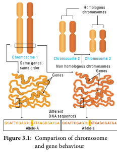
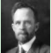

G. J. Mendel (1865) studied the inheritance of well-defined characters of pea plant but for several reasons it was unrecognized till 1900. Three scientists (de Vries, Correns and Tschermak) independently rediscovered Mendel’s results on the inheritance of characters. Various cytologists also observed cell division due to advancements in microscopy. This led to the discovery of structures inside nucleus. In eukaryotic cells, worm-shaped structures formed during cell division are called **chromosomes** (colored bodies, visualized by staining). An organism which possesses two complete basic sets of chromosomes are known as diploid. A chromosome consists of long, continuous coiled piece of DNA in which genes are arranged in linear order. Each gene has a definite position (locus) on a chromosome. These genes are hereditary units. Chromosomal theory of inheritance states that Mendelian factors (genes) have specific locus (position) on chromosomes and they carry information from one generation to the next generation.

### Historical development of chromosome theory

The important cytological findings related to the chromosome theory of inheritance are given below.  

**Wilhelm Roux (1883)** postulated that the chromosomes of a cell are responsible for transferring heredity.

**Montgomery (1901)** was first to suggest occurrence of distinct pairs of chromosomes and he also concluded that maternal chromosomes pair with paternal chromosomes only during meiosis.

- **T. Boveri (1902)** supported the idea that the chromosomes contain genetic determiners, and he was largely responsible for developing the chromosomal theory of inheritance.

- **W.S. Sutton (1902),** a young American student independently recognized a parallelism (similarity) between the behaviour of chromosomes and Mendelian factors during gamete formation. 

**Sutton** and **Boveri (1903)** independently proposed the chromosome theory of inheritance. Sutton united the knowledge of chromosomal segregation with Mendelian principles and called it chromosomal theory of inheritance.

### Salient features of the Chromosomal theory of inheritance

- Somatic cells of organisms are derived from the zygote by repeated cell division (mitosis). These consist of two identical sets of chromosomes. One set is received from female parent (maternal) and the other from male parent (paternal). These two chromosomes constitute the homologous pair.

- Chromosomes retain their structural uniqueness and individuality throughout the life cycle of an organism.

- Each chromosome carries specific determiners or Mendelian factors which are now termed as genes.

- The behaviour of chromosomes during the gamete formation (meiosis) provides evidence to the fact that genes or factors are located on chromosomes.

### Comparison between gene and chromosome behaviour

Around twentieth century cytologists established that, generally the total number of chromosomes is constant in all cells of a species.

A diploid eukaryotic cell has two haploid sets of chromosomes, one set from each parent. All somatic cells of an organism carry the same genetic complement. The behaviour of chromosomes during meiosis not only explains Mendel’s principles but leads to new and different approaches to study about heredity.

**Table 3.1:** Parallelism between Mendelian factors and chromosomal behaviour

| Mendelian factors                                                                                       | Chromosomes behaviour                                                                                                                                                  |
|---------------------------------------------------------------------------------------------------------|----------------------------------------------------------------------------------------------------------------------------------------------------------------------------|
| 1.  Alleles of a factor     occur in pair                                                            | Chromosomes occur in pairs                                                                                                                                              |
| 2.  Similar or dissimilar     alleles of a factor     separate during the     gamete formation | The homologous chromosomes separate during meiosis                                                                                                                   |
| 3.  Mendelian     factors can assort     independently                                            | The paired chromosomes can separate independently during meiosis but the linked genes in the same chromosome normally do not assort independently. |

**Table 3.1:** Parallelism between Mendelian factors and chromosomal behaviour.

| Organism                                | Number of chromosomes (2n) |
|-----------------------------------------|-------------------------------|
| Adder’s tongue fern (Ophioglossum) |              1262             |
| Horsetail (Equisetum)                 |              216              |
| Giant sequoia                           |               22              |
| Arabidopsis                           |               10              |
| Sugarcane                               |               80              |
| Apple                                   |               34              |
| Rice                                    |               24              |
| Potato                                  |               48              |
| Maize                                   |               20              |
| Onion                                   |               16              |
| Haplopappus gracilis                  |               4               |

**Table 3.2 :** Number of Chromosomes

**Thomas Hunt Morgan (1933)** received Nobel Prize in Physiology or Medicine for his discoveries concerning the role played by chromosomes in heredity.

