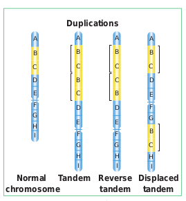
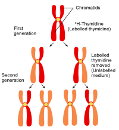

As the repository of genetic information, DNA occupies a unique and central place among biological macromolecules. The structure of DNA is a marvelous device for the storage of genetic information. The term “DNA Metabolism” can be used to describe process by which copies of DNA molecules are made (replication) along with repair and recombination.

In this chapter we briefly discuss about the DNA metabolism in plants

**DNA Replication:** In the double helix the two parental strands of DNA separate and each parental strand synthesizes a new complementary strand. DNA replication is semiconservative, i.e each new DNA molecule conserves one original strand.

**DNA Repair:** How is genomic stability maintained in all living organisms? How do organisms on earth survive? What is essential for their survival? DNA is unique because it is the only macromolecule where the repair system exists, which recognises and removes mutations. DNA is subjected to various types of damaging reactions such as spontaneous or environmental agents or natural endogenous threats. Such damages are corrected by repair enzymes and proteins, immediately after the damage has taken place. DNA repair system plays a major role in maintaining the genomic / genetic integrity of the organism. DNA repair systems protect the integrity of genomes from genotoxic stresses.

---

Plants are sessile. How do they protect themselves from the exposure of sunlight throughout the day?

Plants have effective DNA repair mechanism to prevent UV damage from sunlight. They produce an enzyme called photolyase, which can repair the thymine dimers and restore the structure of DNA.

---

**Recombination:** In cells the genetic information within and among DNA molecule are re-arranged by a process called genetic recombination. Recombination is the result of crossing over between the pairs of homologous chromosomes during meiosis. In earlier classes you have learnt chromosomal recombination. In molecular level it involves breakage and reunion of polynucleotides.

### Eukaryotic DNA replication
Replication starts at a specific site on a DNA sequence known as the Origin of replication. There are more than one origin of replication in eukaryotes. **_Saccharomyces cerevisiae_** (yeast) has approximately 400 origins of replication. DNA replication in eukaryotes starts with the assembly of a prereplication complex (preRC) consisting of 14 different proteins. Part of a preRC is a group of 6 proteins called the origin recognition complex (ORC) which acts as initiator in eukaryotic DNA replication. The origin of replication in **yeast** is called as **ARS** **sites (Autonomously Replicating Sequences).** In yeast, ORC was identified as a protein complex which binds directly to ARS elements.

Replication fork is the site (point of unwinding) of separation of parental DNA strands where new daughter strands are formed. Multiple replication forks are found in eukaryotes. The enzyme helicases are involved in unwinding of DNA by breaking hydrogen bonds holding the two strands of DNA and replication protein A (RPA) prevents the separated polynucleotide strand from getting reattached.

**Topoisomerase** is an enzyme which breaks DNAs covalent bonds and removes positive supercoiling ahead of replication fork. It eliminates the torsional stress caused by unwinding of DNA double helix.

DNA replication is initiated by an enzyme **DNA polymerase α** / primase which synthesizes short stretch of RNA primers on both leading strand (continuous DNA strand) and lagging strands (discontinuous DNA strand). Primers are needed because DNA polymerase requires a free 3’ OH to initiate synthesis. DNA polymerase covalently connects the nucleotides at the growing end of the new DNA strand. DNA Pol α (alpha), DNA Pol δ (delta) and DNA Pol ε (Epsilon) are the 3 enzymes involved in nuclear DNA replication. **DNA Pol α –** Synthesizes short primers of RNA 
**DNA Pol δ –** Main Replicating enzyme of cell nucleus 
**DNA Pol ε –** Extend the DNA Strands in replication fork

---

DNA Polymerase β does not play any role in the replication of normal DNA. Function - Removing incorrect bases from damaged DNA. It is involved in Base excision repair.

---

DNA Synthesis takes place in 5’->  3’ direction and it is semidiscontinuous. When DNA is synthesized in 5’ -> 3’ direction, only in the free 3’ end (OH end) DNA is elongated. In 1960s Reiji Okazaki and his colleagues found out that one of the new DNA strands is synthesized in short pieces called **Okazaki fragments**. In discontinuous  strand where the Okazakifragments are united by ligase is called Lagging strand where the replication direction is 5’-> 3’ which is opposite to the direction of fork movement. . The continuous strand is called Leading strand where the replication direction is 5’-> 3’ which is same to the direction to that of the replication fork movement. DNA ligase joins any nicks in the DNA by forming a phosphodiester bond between 3’ hydroxyl and 5’ phosphate group.

**Arabidopsis telomere sequence - TTTAGGG**

**Plants Lacks Telomere Clock** 

Plant meristematic cells produces telomerase so the meristematic cells has an unlimited ability to divide. You have already studied about the telomeres in Chapter 6 and 8 of Class XI. In plants telomeres do not shrink as in somatic cells of vertebrates. Telomerase levels are higher in root tips and seedlings (renewable tissue) which has a higher amount of meristematic cells than proliferative structures like leaves.

**What is the special mechanism which replicates chromosomal ends?** 

After the replication of the chromosomes, the enzyme **telomerase** adds several more repeats of DNA sequences to the telomeres. Telomerase use short RNA molecules as a template and add repeat sequences on to telomeres (DNA nucleotide polymerisation).

**The Energetics of DNA Replication -** Deoxyribonucleotides such as deoxyadenosine triphosphate dATP, dGTP, dCTP and dTTP provide energy for the synthesis of DNA. Purpose of Deoxyribonucelotides (1) acts as a substrate (2) provide energy for polymerisation.

### Experimental evidence of DNA replication: Taylors Experiment 

**J. Herbert Taylor, Philip Woods and Walter Hughes demonstrated the semiconservative replication of DNA in the root cells of _Vicia faba_.** 

They labelled DNA with 3H Thymidine,_
a radioactive precursor of DNA and performed autoradiography. They grew root tips in a medium in the presence of radioactive labelled thymidine, so that the radioactivity was incorporated into the DNA of these cells. The outline of this labelled chromosomes appears in the form of scattered black dots of silver grains on a photographic film.

The root tips with labelled chromosomes were placed in an unlabelled medium containing colchicine to arrest the culture at the metaphase and examine the chromosome by autoradiography. The observations were,

1. In the chromosome of first generation the **radioactivity** was found to be distributed to **both the chromatids** because in the original strand of DNA double helix was labelled with radioactivitiy and the new strand was unlabelled.

2. In the chromosome of the **second generation only one of the two chromatids** in each chromosome was radioactive (labelled).

The results proved the semiconservative method of DNA replication.

