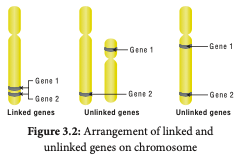
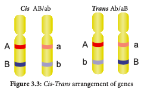
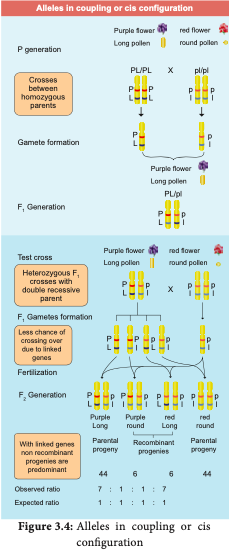
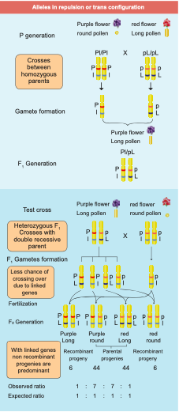

The genes which determine the character of an individual are carried by the chromosomes. The genes for different characters may be present either in the same chromosome or in different chromosomes. When the genes are present in different chromosomes, they assort independently according to Mendel’s Law of Independent Assortment. Biologists came across certain genetic characteristicsthat did not assort out independently in other organisms after Mendel’s work. One such case was reported in Sweet pea **_(Lathyrus odoratus)_** by **William Bateson** and **Reginald C. Punnet** in 1906. They crossed one homozygous strain of sweet peas having **purple flowers** and long **pollen grains** with another homozygous strain having **red flowers** and **round pollen grains**. All the F1 progenies had purple flower and long pollen grains indicating purple flower long pollen **(PL/ PL)** was dominant over red flower round pollen **(pl/pl)**. When they crossed the F1 with double recessive parent (test cross) in results, F2 progenies did not exhibit in 1:1:1:1 ratio as expected with independent assortment. A greater number of F2 plants had purple flowers and long pollen or red flowers and round pollen. So they concluded that genes for purple colour and long pollen grain and the genes for red colour and round pollen grain were found close together in the same homologous pair of chromosomes. These genes do not allow themselves to be separated. So they do not assort independently. This type of tendency of genes to stay together during separation of chromosomes is called **Linkage.**



Genes located close together on the same chromosome and inherited together are called **linked genes.** But the two genes that are sufficiently far apart on the same chromosome are called **unlinked genes or syntenic genes** (Figure 3.4). Such condition is known as **synteny**. It is to be differentiated by the value of recombination frequency. If the recombination frequency value is more than 50 % the two genes show unlinked. when the recombination frequency value is less than 50 %, they show linked. Closely located genes show strong linkage, while genes widely located show weak linkages.

```
**Fossil Genes:** Some of the junk DNA is made up of pseudo genes, the sequences presence in that was once working genes.
They lost their ability to make proteins. They tell the story of evolution through fossilized parts.

```
### Coupling and Repulsion theory

The two dominant alleles or recessive alleles occur in the same homologous chromosomes, tend to inherit together into same gamete are called **coupling or cis configuration** (Figure: 3.5). If dominant or recessive alleles are present on two different, but homologous chromosomes they inherit apart into different gamete are called **repulsion or trans configuration** (Figure: 3.6).








### Kinds of Linkage 

**T.H. Morgan** found two types of linkage. They are complete linkage and incomplete linkage depending upon the absence or presence of new combination of linked genes.

**Complete Linkage** 

If the chances of separation of two linked genes are not possible those genes always remain together as a result, only parental combinations are observed. The linked genes are located very close together on the same chromosome such genes do not exhibit crossing over. This phenomenon is called **complete linkage**. It is rare but has been reported in male **_Drosophila_. C.B Bridges** (1919) discovered that crossing over is completely absent in some species of male **_Drosophila_**.

**Incomplete Linkage** 

If two linked genes are sufficiently apart, the chances of their separation are possible. As a result, parental and non-parental combinations are observed. The linked genes exhibit some crossing over. This phenomenon is called**incomplete linkage**. This was observed in maize. It was reported by Hutchinson.


### Linkage Groups

 The groups of linearly arranged linked genes on a chromosome are called **Linkage groups**. In any species the number of linkage groups corresponds to the number haploid set of chromosomes. Example:

| Name of organism | Linkage groups |
|------------------|----------------|
| Mucor            |        2       |
| Drosophila       |        4       |
| Sweet pea        |        7       |
| Neurospora       |        7       |
| Maize            |       10       |

**Table 3.3 :** Linkage groups in some organisms

Linkage and crossing over are two processes that have opposite effects. Linkage keeps particular genes together but crossing over mixes them. The differences are given below.

| Linkage                                                                        | Crossing over                                                                                             |
|--------------------------------------------------------------------------------|-----------------------------------------------------------------------------------------------------------|
| 1. The genes<br>   present on<br>   chromosome<br>   stay close<br>   together |                                 It leads to separation<br>of linked genes                                 |
| 2. It involves<br>   same chromosome<br>   of homologous<br>   chromosome      |   It involves exchange <br>of segments between<br>non-sister chromatids <br>of homologous<br>chromosome.  |
| 3. It reduces<br>   new gene<br>   combinations                                | It increases variability<br>by forming new gene <br>combinations. lead<br>to formation of new<br>organism |

**Table 3.4:** Differences between linkage and crossing over
