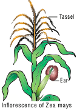

A given phenotypic trait of an individual depends on a single pair of genes, each of which occupies a specific position called the locus on homologous chromosome. When any of the three or more allelic forms of a gene occupy the same locus in a given pair of homologous chromosomes, they are said to be called **Multiple alleles** 

```

**Check your Grasp**

There may be multiple alleles within the population, but individuals have only two of those alleles. Why?

```

### Characteristics of multiple alleles
 
-  Multiple alleles of a series always occupy the same locus in the homologous chromosome. Therefore, no crossing over occurs within the alleles of a series.

- Multiple alleles are always responsible for the same character.

- The wild type alleles of a series exhibit dominant character whereas mutant type will influence dominance or an intermediate phenotypic effect.

- When any two of the mutant multiple alleles are crossed the phenotype is always mutant type and not the wild type

### Self-sterility in _Nicotiana_

In plants, multiple alleles have been reported in association with self-sterility or self- incompatibility. Self-sterility means that the pollen from a plant is unable to germinate on its own stigma and will not be able to bring about fertilization in the ovules of the same plant. **East (1925)** observed multiple alleles in **_Nicotiana_** which are responsible for self-incompatibility or self-sterility. The gene for self-incompatibility can be designated as S, which has allelic series S1, S2, S3, S4 and S5 (Figure 3.8).


The cross-fertilizing tobacco plants were not always homozygous as S_1S_1 or S_2S_2, but all plants were heterozygous as S<sub>1</sub>S<sub>2</sub> 	| , S<sub>3</sub>S<sub>4</sub> 	| , S_5S_6. When crosses were made between different S<sub>1</sub>S<sub>2</sub> 	|  plants, the pollen tube did not develop normally. But effective pollen tube development was observed when crossing was made with other than S<sub>1</sub>S<sub>2</sub> 	  for example S<sub>3</sub>S<sub>4</sub>.

| Female<br>parent 	| Male parent <br> 	| (Pollen 	| source) 	|
|---	|---	|---	|---	|
| **Stigma spot** 	| S<sub>1</sub>S<sub>2</sub> 	| S<sub>2</sub>S<sub>3</sub> 	| S<sub>3</sub>S<sub>4</sub> 	|
| S<sub>1</sub>S<sub>2</sub> 	| Self<br>Sterile 	| S<sub>3</sub>S<sub>2</sub><br>S<sub>3</sub>S<sub>1</sub> 	| S<sub>3</sub>S<sub>1</sub><br>S<sub>3</sub>S<sub>2</sub><br>S<sub>4</sub>S<sub>1</sub><br>S<sub>4</sub>S<sub>2</sub> 	|
| S<sub>2</sub>S<sub>3</sub> 	| S<sub>1</sub>S<sub>2</sub><br>S<sub>1</sub>S<sub>3</sub> 	| Self<br>Sterile 	| S<sub>4</sub>S<sub>2</sub><br>S<sub>4</sub>S<sub>3</sub> 	|
| S<sub>3</sub>S<sub>4</sub> 	| S<sub>1</sub>S<sub>3</sub><br>S<sub>1</sub>S<sub>4</sub><br>S<sub>2</sub>S<sub>3</sub><br>S<sub>2</sub>S<sub>4</sub> 	| S<sub>2</sub>S<sub>3</sub><br>S<sub>2</sub>S<sub>4</sub> 	| Self<br>Sterile 	|

When crosses were made between seed parents with S<sub>1</sub>S<sub>2</sub>  and pollen parents with S<sub>2</sub>S<sub>3</sub> , two kinds of pollen tubes were distinguished. Pollen grains carrying S<sub>2</sub> were not effective, but the pollen grains carrying S<sub>3</sub> were capable of fertilization. Thus, from the cross S<sub>1</sub>S<sub>2</sub>XS<sub>3</sub>S<sub>4</sub>, all the pollens were effective and four kinds of progeny resulted: S1S3, S<sub>1</sub>S<sub>4</sub>, S2S3 and S<sub>2S</sub>4. Some combinations are showed in the table

### Sex determination in maize 

Zea mays (maize) is an example for monoecious, which means male and female flowers are present on the same plant. There are two types of i n f l o r e s c e n c e . The terminal i n f l o r e s c e n c e which bears staminate florets develops from shoot apical meristem called tassel. The lateral inflorescence which develop pistillate florets from axillary bud is called ear or cob. Unisexuality in maize occurs through the selective abortion of stamens in ear florets and pistils in tassel florets. A substitution of two single gene pairs '**ba**' for barren plant and '**ts**' for tassel seed makes the difference between monoecious and dioecious (rare) maize plants. The allele for barren plant (ba) when homozygous makes the stalk staminate by eliminating silk and ears. The allele for tassel seed (ts) transforms tassel into a pistillate structure that produce no pollen. The table-3.6 is the resultant sex expression based on the combination of these alleles. Most of these mutations are shown to be defects in gibberellin biosynthesis. Gibberellins play an important role in the suppression of stamens in florets on the ears.

 
 
| **Genotype**           | **Dominant/<br>recessive**   | **Modification**                                                      | **Sex**               |
|------------------------|------------------------------|-----------------------------------------------------------------------|-----------------------|
| ba/ba<br>ts/ts         |      Double<br>recessive     | Lacks silk on<br>the stalk, but<br>transformed<br>tassel to<br>pistil | Rudimentary<br>female |
| ba/ba<br>ts^+/ts^+     | Recessive<br>and<br>dominant | Lacks silk<br>and have<br>tassel                                      | Male                  |
| ba^+/ba^+<br>ts^+/ts^+ |      Double<br>dominant      | Have both<br>tassel and cob                                           | Monoecious            |
| ba^+/ba^+<br>ts/ts     | Dominant<br>and<br>recessive | Bears cob<br>and lacks<br>tassel                                      | Normal<br>female      |

**Table 3.6:** Sex determination in Maize (Superscript (+) denotes dominant character)