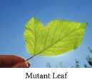
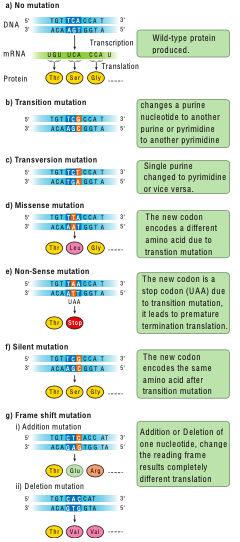

Genetic variation among individuals provides the raw material for the ultimate source of evolutionary changes. Mutation and recombination are the two major processes responsible for genetic variation. A sudden change in the genetic material of an organisms is called **mutation**. The term mutation was introduced by **Hugo de Vries** (1901) while he has studying on the plant, evening primrose **(Oenothera lamarkiana)** and proposed **‘Mutation theory’**. There are two broad types of changes in genetic material. They are point mutation and chromosomal mutations. Mutational events that take place within individual genes are called gene mutations or point mutation, whereas the changes occur in structure and number of chromosomes is called chromosomal mutation. Agents which are responsible for mutation are called **mutagens,** that increase the rate of mutation. Mutations can occur either spontaneously or induced. The production of mutants through exposure of mutagens is called mutagenesis, and the organism is said to be **mutagenized.**

