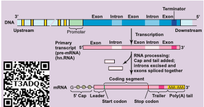
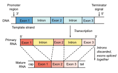
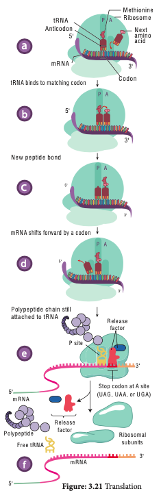
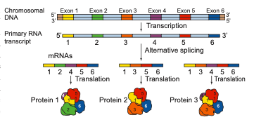
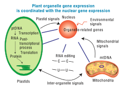
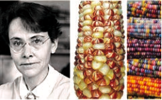
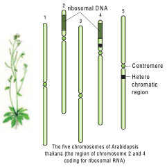

 
 Transcription is the process in which one strand of DNA acts as a template to generate mRNA with the bases complementary to the template strand. It is catalyzed by the enzymes called RNA polymerases.

**Transcription** and processing of RNA takes place in the **nucleus**, whereas the **translation** occurs in the ribosomes found in **cytoplasm**. In Eukaryotes, mRNA molecules are **monocistronic** with only one protein being derived from each mRNA.

The transcription begins with unwinding of DNA double helix and the hydrogen bonds are broken at the site of the gene being transcribed. **Template Strand / Non-Coding Strand / Antisense Strand** The strand of DNA which is oriented in 3’-> 5’ direction that serves as a template for the synthesis of mRNA is called template strand.



**Coding strand / Non-template strand / Sense Strand**

The other strand of DNA which is not transcribed is called the Coding Strand.

A specific sequence of DNA nucleotides called the **Promoter** is necessary for transcription to takes place. It consists of TATA box and transcription start site where transcription begins.

**Termination sequences** are the DNA sequences which tells when the RNA polymerase should stop producing RNA molecule.

Eukaryotic structural gene has 3 features in promoter 
1. Regulatory elements 
2. TATA box 
3. A transcriptional start site 

The transcription start site contains about 25 bp (basepairs) upstream, the sequence is TATAAT known as **TATA or Hogness box** which is present in core promoter. **General transcriptional factors** are the proteins which recognise base sequences of DNA and controls transcription. Some transcription factors bind directly to the promoter.

Some transcription factors recognize the regulatory elements and bind to them to increase the rate of transcription, others inhibits transcription.

To start the process of transcription the Regulatory elements help the RNA polymerase

to recognize core promoter. The two categories of regulatory elements are

**1. Enhancer sequences** – they are DNA sequences (activating sequences) which help to influence transcription.

**2. Silencer sequence** – DNA sequences that inhibit transcription or decrease transcription.

```
**Consensus sequence** – An ideal sequence in which each position represents the base which is found most often.

```

In addition to General transcription factors (GTF) and **RNA Pol II, a mediator** is required for transcription. The interactions between RNA polymerase II and regulatory TF that bind to enhancers or silencers are mediated by a mediator.

RNA Polymerases cannot bind directly to the DNA, first it binds to the transcription factor which recognizes the promoter sequences which helps to find the protein coding regions of DNA.

RNA Polymerase with the promoter sequence will transcribe the gene. Transcription factor plays an important role in guiding RNA Polymerases to the promoter sequence. RNA Polymerases bind RNA nucleotides together forming a growing strand in the 5’-> 3’ direction. Transcription occurs in 5’-> 3’ direction, RNA Polymerase catalyses the addition of nucleotides at the 3’ end of the growing chain of RNA.

In Eukaryotes, 3 different RNA Polymerases called RNA Polymerases I, II and III are found.

| **Enzyme**            | **Synthesis**                                             |
|-----------------------|-----------------------------------------------------------|
| RNA<br>Polymerase I   | Large Ribosome RNAs<br>except 5S rRNA                     |
| RNA<br>Polymerase II  | Precursors of mRNAs<br>(hnRNAs)                           |
| RNA<br>Polymerase III | tRNAs, 5S ribosomal RNA,<br>snRNAs (small nuclear<br>RNA) |

**The processing of pre-mRNA to mature mRNA / Molecular mechanism of RNA modification**

In eukaryotes three major types of RNA, mRNA, tRNA and rRNA are produced from a precursor RNA molecule termed as the primary transcript or preRNA. The RNA polymerase II transcribes the precursor of mRNA, which are also called the **heterogenous nuclear RNA** or hnRNA which are processed in the nucleus before they are transported into the cytoplasm.

**Capping**

Modification at the 5’ end of the primary RNA transcript (hn RNA) with methylguanosine triphosphate is called capping.

```

**Internal methylation** Apart from capping, the internal nucleotides in mRNA are also methylated.

Methylated sites are present in translated, untranslated regions, introns and exons.

```

**Purpose of Capping** 

1. Protects RNA from degradation. 
2. Capping plays an important role in
removal of first intron in pre mRNA. 
3. It regulates the mRNA export from the
nucleus into the cytoplasm. 
4. It helps in binding of mRNA to the ribosome.

**Tailing / Polyadenylation**

The 3’ end of hnRNA is cleaved by an endonuclease and a string of adenine nucleotides is added to the 3’ end of hnRNA (pre mRNA) is known as Poly (A) tail - Polyadenylation. This process is called tailing or polyadenylation.

**Purpose of Tailing**

1. Translation of RNA transcript is facilitated.

2. Helps in the synthesis of Polypeptides.
3. It enhances the mRNA stability in the cytoplasm. 

The protein coding regions are not continuous in eukaryotes. Split genes were independently discovered by Richard J Roberts and Phillip A. Sharp in 1977 and was awarded Nobel Prize in 1993. **Exons** are the coding sequences or expressed sequences contain biological informations in the matured processed mRNA. **Introns** are intervening sequences, which are non-coding sequences (non-amino acid- coding sequences) that should be removed from a gene before the mRNA product is made. Introns do not code for any enzyme or structural protein or polypeptides. These exons and introns are known as Split Genes.

### RNA Splicing in plants

RNA Splicing is a process which involves the cutting or removing out of introns and knitting of exons. This process takes place in spherical particles which is a multiprotein complex called **SPLICISOMES.** It is approximately 40 – 60 nm in diameter. The spliceosomes have many small nuclear ribonucleic acids (snRNAs) and small nuclear ribonuclear protein particles (snRNPs) which identify and helps in the removal of introns.



A spliceosome removes the introns with an enzyme ribozyme. Now the mature mRNA comes away from the spliceosomes through the nuclear pore and is transported out from the nucleus into cytoplasm, and gets attached to ribosome to carry out translation. The RNA and many proteins are transported through a nuclear pore complex by an energy dependent process.

### Translation
 The genetic information in the DNA code is copied onto mRNA bound in ribosomes for making polypeptides. The mRNA nucleotide sequence is decoded into amino acid sequence of the protein which is catalyzed by the ribosome. This process is called translation.

**Terminology in Protein synthesis**

**Codon** – DNA codes are referred to as triplet codes and those in mRNA is called as Codons. Each triplet specifies a particular amino acid. Codons present in mRNA are read in 5’-> 3’ direction. There are 64 codons of which 61 codons codes for amino acids.

**Start codon** – AUG specified methionine

**Stop or Termination codon** – UAA – Ochre UAG – amber and UGA – Opal.

**Anticodons** – The triplet of bases in a tRNA molecule is known as anticodon. In tRNA sequence of three bases which is complementary to codons of mRNA are called anticodon. The codons of mRNA are recognized by the anticodons of tRNA which are oriented in 3’-> 5’ direction.

**Process of translation** 

The following are major steps in translation process

**1. Initiation** The translation begins with the AUG codon (start codon) of mRNA. Translation occurs on the surface of the macromolecular arena called the ribosome. It is a nonmembranous organelle. During the process of translation the two subunits of ribosomes unite (combine) together and hold mRNA between them. The protein synthesis begins with the reading of codons of mRNA. The tRNA brings amino acid to the ribosome, a molecular machine which unites amino acids into a chain according to the information given by mRNA. rRNA plays the structural and catalytic role during translation.

A ribosome has one binding site for mRNA and two for tRNA. The two binding sites of tRNA are

**i. P-Site – The peptidyl – tRNA binding site** is one of the tRNA binding site. At this site tRNA is held and linked to the growing end of the polypeptide chain.

**ii. A-Site – The Aminoacyl – tRNA binding site.** This is another tRNA binding site which holds the incoming amino acids called aminoacyl tRNA. The anticodons of tRNA pair with the codons of the mRNA in these sites.

**2. Elongation of polypeptide chain** The P and A sites are nearby, so that two tRNA form base pairs with adjacent codon. The polypeptide chain is formed by the pairing of codons and anticodons according to the nucleotide sequence of the mRNA.



**Translators of the genetic code - tRNA** 

The tRNA translates the genetic code from the nucleic acid sequence to the amino acid sequence i.e from gene – Polypeptide. When an amino acid is attached to tRNA it is called **aminoacylated or charged**. This is an energy requiring process which uses the ATP for its energy requirement. Protein synthesis takes place as the next aminoacyl tRNA binds to the A-Site.

The translation begins with the AUG codon (start codon) of mRNA. The tRNA which carries first amino acid **methionine** attach itself to P-site of ribosome. The ribosome adds new amino acids to the growing polypeptides. The second tRNA molecules has anticodons which carries amino acid **alanine** pairs with the mRNA codon in the A-site of the ribosome. The aminoacids **methionine** and **alanine** are close enough so that a peptide bond is formed between them.

The bond between the first tRNA and **methionine** now breaks. The first tRNA leaves the ribosome and the P-site is vacant. The ribosome now moves one codon along the mRNA strand. The second t-RNA molecule now occupies the P-site. The third t-RNA comes and fills the A site (serine). Now a peptide bond is formed between **alanine** and **serine.** The mRNA then moves through the
ribosome by three bases. This expels deacylated / uncharged tRNA from P-site and moves peptidyl tRNA into the P-site and empties the A-site.This movement of tRNA from A-site to P-site is said to be translocation. The translocation requires the hydrolysis of GTP.

**The ribosome (ribozyme - peptidyl transferase)** catalyses the formation of peptide bond by adding amino acid to the growing polypeptide chain.

The ribosome moves from codon to codon along the mRNA in the 5’ to 3’ direction. Amino acids are added one by one translated into polypeptide as dictated by the mRNA. Translation is an energy intensive process. A cluster of ribosomes are linked together by a molecule of mRNA and forming the site of protein synthesis is called as **polysomes** or **polyribosomes.**

**3. Termination of polypeptide synthesis**

Eukaryotes have cytosolic proteins called **release factors** which recognize the termination codon, UAA, UAG, or UGA when it is in the A site. When the ribosome reaches a stop codon the protein synthesis comes to an end. So ribosomes are the protein making factories of a cell. When the polypeptide is completed the ribosome releases the polypeptide and detaches from the mRNA molecule. Now the ribosome splits into small and large subunits after the release of mRNA.

### Alternative Splicing in plants
 It is very useful in regulating gene expression to overcome the environmental stress in plants.

 

Alternative splicing is an important mechanism / process by which multiple mRNA’s and multiple proteins products can be generated from a single gene. The different proteins generated are called isoforms. There are various modes of alternative splicing. When multiple introns are present in a gene, they are removed separately or as a unit. In certain cases one or more exons which is present between the introns are also removed.

**Significance of alternative splicing**

1. The proteins transcribed from alternatively spliced mRNA containing different amino acid sequence lead to the generation of protein diversity and biological functions.

2. Multiple protein isoforms are formed. 

3. It creates multiple mRNA transcripts from a single gene. A process of producing related proteins from a single gene thereby the number of gene products are increased.

4. It plays an important role in plant functions such as stress response and trait selection. The plant adapts or regulates itself to the changing environment.

### RNA Editing – Post Transcriptional RNA Processing in plants

Transcriptional RNA Processing in plants

Chemical modification such as base modification, nucleotide insertion or deletions and nucleotide replacements of
mRNA results in the alteration of amino acid sequence of protein that is specified is called RNA editing. This results in the change in the protein coding sequence of RNA following transcription. The coding properties of the RNA transcript is changed. The genetic information encoded in the chloroplast genome is altered by post transcriptional phenomenon which is site – specific (C -> U) in chloroplast of higher plants – RNA editing occurs in plant mitochondria and chloroplast.

In plant cells RNA editing by pyrimidine transitions occurs in mitochondria and plastids (chloroplast). There are two main types of RNA editing. (1) Substitution editing – Alteration of individual nucleotide bases. Mitochondria and chloroplast RNA in plants. (2) Insertion / Deletion editing – Nucleotides are added or deleted from the total number of bases.

**Plant organelle gene expression is coordinated with the nuclear gene expression**



**Significance of RNA Editing**

1. In higher plant chloroplast, it helps to restore the codons for conserved amino
acids which include initiation and termination codon.

2. It regulates Organellar gene expression in plants.

3. RNA editing results in the restoration of codons for phylogenetically conserved amino acid residues.

**RNA Editing types**

| **Year** | **Editing type** | **Organelle in Plant cell** | **Target** | **Inference / Result**                                              |
|----------|------------------|-----------------------------|------------|---------------------------------------------------------------------|
| 1989     | C -> U           | **Plant mitochondria**      | mRNA       | For conserved amino acids, multiple<br>changes in codon takes place |
| 1990     | U -> C           | **Plant mitochondria**      | mRNA       | First report on editing (U -> C)                                    |
| 1991     | C -> U           | **Pllant chloroplast**      | mRNA       | First report in **chloroplast**                                     |

### Jumping Genes



 **Have you heard of Jumping Genes or Hopping Genes?**

This is the nick name of transposable genetic elements. Transposons are the DNA sequences which can move from one position to another position in a genome. This was first reported in 1948 by American Geneticist Barbara McClintock as “mobile controlling element” in Maize. One of the most significant scientists of 20th century was Barbara McClintock because she gave a shift in gene organization. McClintock was awarded Nobel prize in 1983 for her work on transposons. Barbara McClintock when studying aleurone of single maize kernels, noted the unstable inheritance of the mosaic pattern of blue, brown and red spots due to the differential production of vacuolar anthocyanins. 

In maize plant genome has AC / Ds transposon (AC = Activator, Ds = Dissociation). The activity of AC element is very distinct in maize plant. The transposition in somatic cells results in the changes in gene expression such as variegated pigmentation in maize kernels. Maize genome has transposable elements which regulated the different colour pattern of kernels. 

McClintock’s findings concluded that Ds and AC genes were mobile controlling elements. We now call it as transposable elements, a term coined by maize geneticist, Alexander Brink. McClintock gave the first direct experimental evidence that genomes are not static but are highly plastic entities.

**Significance of transposons** 

1. They contribute to many visible mutations and mutation rate in an Organism. 
2. In evolution, they contribute to genetic diversity. 
3. In genetic research transposons are
valuable tools which are used as mutagens, as cloning tags, vehicles for inserting foreign DNA into model organism.

**Plant genome –** The word genome is defined as the full complement of DNA (including all the genes and the intergenic regions) present in an organism It specifies the entire biological information of an organism. There are three distinct genomes in eukaryotic cells and they are (1) The nuclear genome (2) The mitochondrial genome and (3) The chloroplast genome present only in plants.

_Arabidopsis thaliana_ – Thale cress, Mouse- ear cress

1. It is a model plant for the study of genetic and molecular aspects of plant development.

2. It belongs to mustard family and it is the first flowering plant, where its entire genome is sequenced.

3. The two regions of the nucleolar organiser ribosomal DNA which codes for the ribosomal RNA are present at the extremity of chromosomes 2 and 4

4. It is Diploid plant having small genome with 2n = 10 chromosomes. Several generations can be produced in one year. So it facilitates rapid genetic analysis. The genome has low repetitive DNA, over 60% of the nuclear DNA have protein coding functions.

5. The plant is small, self fertilizes, annual long-day plant with short-life cycle (only 6 weeks), large numbers of seeds are produced and they are easy to be grown in laboratory. It is easy to induce mutations. It has many genomic resources and the transformation can be done easily.

6. In 1982, Arabidopsis has successfully completed its life cycle in Microgravity i.e. space. This shows that Human Space Missions with plant companions may be possible.


