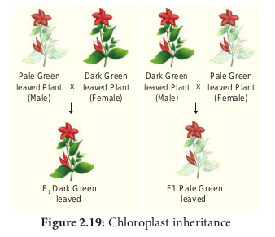
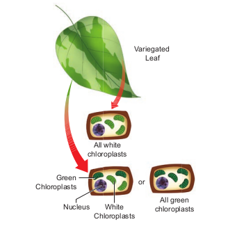

DNA is the universal genetic material. Genes located in nuclear chromosomes follow Mendelian inheritance. But certain traits are governed either by the chloroplast or mitochondrial genes. This phenomenon is known as extra nuclear inheritance. It is a kind of Non-Mendelian inheritance. Since it involves cytoplasmic organelles such as chloroplast and mitochondrion that act as inheritance vectors, it is also called Cytoplasmic inheritance. It is based on independent, self-replicating extra chromosomal unit called plasmogene located in the cytoplasmic organelles, chloroplast and mitochondrion.

**Chloroplast Inheritance** 

It is found in 4 O’ Clock plant (_Mirabilis jalapa_). In this, there are two types of variegated leaves namely dark green leaved plants and pale green leaved plants. When the pollen of dark green leaved plant (male) is transferred to the stigma of pale green leaved plant (female) and pollen of pale green leaved plant is transferred to the stigma of dark green leaved plant, the F1 generation of both the crosses must be identical as per Mendelian inheritance. But in the reciprocal cross the F1 plant differs from each other. In each cross, the F1 plant reveals the character of the plant which is used as female plant.

This inheritance is not through nuclear gene. It is due to the chloroplast gene found in the ovum of the female plant which contributes the cytoplasm during fertilization since the male gamete contribute only the nucleus but not cytoplasm.

Recently it has been discovered that cytoplasmic genetic male sterility is common in many plant species. This sterility is maintained by the influence of both nuclear and cytoplasmic genes. There are commonly two types of cytoplasm N (normal) and S (sterile). The genes for these are found in mitochondrion. There are also restores of fertility (Rf) genes. Even though these genes are nuclear genes, they are distinct from genetic male sterility genes of other plants. Because the Rf genes do not have any expression of their own, unless the sterile cytoplasm is present. Rf genes are required to restore fertility in S cytoplasm which is responsible for sterility.

So the combination of N cytoplasm with rfrf and S cytoplasm with RfRf produces plants with fertile pollens, while S cytoplasm with rfrf produces only male sterile plants.

**Atavism** 

Atavism is a modification of a biological structure whereby an ancestral trait reappears after having been lost through reemergence of sexual reproduction in the flowering plant _Hieracium pilosella_ is the best example for Atavism in plants. 

**Summary** 

Gregor Johann Mendel, father of Genetics unraveled the mystery of heredity through his experiments on garden peas. Mendel’s laws, analytical and empirical reasoning endure till now guiding geneticists to study variation. The monohybrid cross of Mendel proved his particulate theory of inheritance. In F2 the alternative traits were expressed in the ratio of 3 dominant and 1 recessive. The characteristic 3 : 1 segregation is referred to as Mendelian ratio. Parents transmit discrete information about the traits to their offspring which Mendel called it as “factors”. To test his experimental results Mendel devised a powerful procedure called the test cross. Test cross is used to determine the genotype of an individual when two genes are involved. In Mendel’s dihyrbid cross, the two pairs of factors were inherited independently. From the results of dihybrid cross Mendel gave the Law of Independent Assortment. Mendel’s dihybrid ratio of 9 : 3 : 3 : 1 with the representation of two new recombinations appeared in the progeny, i.e. round green peas or wrinkled yellow peas. Molecular explanation of Mendel’s gene for monohybrid cross, dihybrid cross were explained. Extension of Mendelian Genetics was dealt with examples for interaction among genes. Incomplete dominance is not an example for blending inheritance. Incomplete dominance exhibits a phenotypic heterozygote intermediate between the two homozygous. In plants codominance can be demonstrated by the methods of electrophoresis or chromatography for protein or flavonoid substances. Lethal genes with an example are explained. Pleiotropy a single gene which affects multiple traits was explained with an example of Pisum sativum. Dominant epistatis in summer squash with 12 : 3 : 1 ratio was discussed. Polygenic inheritance is an example for inheritance of continuous traits which is compatible with Mendel’s laws. The inheritance of mitochondrial and chloroplast genes were explained with examples which does not follow the rules of nuclear genes.
