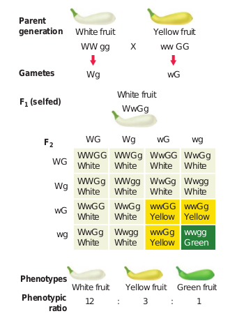

 Interlocus interactions take place between the alleles at different loci i.e between alleles of different genes.It includes the following:

**Dominant Epistasis –** It is a gene interaction in which two alleles of a gene at one locus interfere and suppress or mask the phenotypic expression of a different pair of alleles of another gene at another locus. The gene that suppresses or masks the phenotypic expression of a gene at another locus is known as **epistatic**. The gene whose expression is interfered by non- allelic genes and prevents from exhibiting its character is known as **hypostatic**. When both the genes are present together, the phenotype is determined by the epistatic gene and not by the hypostatic gene.

In the summer squash the fruit colour locus has a dominant allele ‘W’ for whitecolour and a recessive allele ‘w’ for coloured fruit. ‘W’ allele is dominant that masks the expression of any colour. In another locus hypostatic allele ‘G’ is for yellow fruit and its recessive allele ‘g’ for green fruit. In the first locus the white is dominant to colour where as in the second locus yellow is dominant to green. When the white fruit with genotype WWgg is crossed with yellow fruit with genotype wwGG, the F1 plants have white fruit and are heterozygous (WwGg). When F1 heterozygous plants are crossed they give rise to F2 with the phenotypic ratio of 12 white : 3 yellow : 1 green.

Since W is epistatic to the alleles ‘G’ and ‘g’, the white which is dominant, masks the effect of yellow or green. Homozygous recessive ww genotypes only can give the coloured fruits (4/16). Double recessive ‘wwgg’ will give green fruit (1/16). The Plants having only ‘G’ in its genotype (wwGg or wwGG) will give the yellow fruit(3/16).

**Table 2.1:** 

**Intra-genic or non-allelic interaction**

|    S. No. 	|      Gene  interaction 	|  Example                                                                           	|     F2  Phenotypic    ratio 	|
|-----------	|------------------------	|------------------------------------------------------------------------------------	|-----------------------------	|
|  1        	| Incomplete Dominance   	| Flower colour in Mirabilis jalapa.  Flower colour in snapdragon (Antirrhinum spp.) 	| 1 : 2 : 1    1 : 2 : 1      	|
|  2        	| Codominance            	| ABO Blood group system in humans                                                   	| 1 : 2 : 1                   	|

**Table 2.2:** 

**Inter-genic or non-allelic interaction**

| S. No. |   Epistatic interaction                   | Example                                                                                  | F2  Phenotypic    ratio |
|-----------|----------------------------------------------|------------------------------------------------------------------------------------------|----------------------------------|
| 1         | Dominant epistasis                        | Fruit colour in summer squash                                                      | 12 : 3 : 1                       |
| 2         | Recessive epistasis                       | Flower colour of Antirrhinum spp.                                                  | 9 : 3 : 4                        |
| 3         | Duplicate genes with cumulative effect | Fruit shape in summer squash                                                       | 9 : 6 : 1                        |
| 4         | Complementary genes                       | Flower colour  in sweet peas                                                       | 9 : 7                            |
| 5         | Supplementary genes                       | Grain colour in Maize                                                                 | 9 : 3 : 4                        |
| 6         | Inhibitor genes                              | Leaf colour in rice plants                                                            | 13 : 3                           |
| 7         | Duplicate genes                              | Seed capsule shape (fruit shape) in shepherd’s purse Bursa bursa-pastoris | 15 : 1                           |
