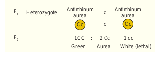

Interactions take place between the alleles of the same gene i.e., alleles at the same locus is called intragenic or intralocus gene interaction. It includes the following: 
1) Incomplete dominance 
(2) Codominance 
(3) Multiple alleles 
(4) Pleiotropic genes are common examples for intragenic interaction. 

### Incomplete dominance – No blending of genes

**The German Botanist Carl Correns’s (1905) Experiment -** In 4 O’ clock plant, _Mirabilis jalapa_ when the pure breeding homozygous red (R1R1) parent is crossed with homozygous white (R2R2), the phenotype of the F1 hybrid is heterozygous pink (R1R2). The F1 heterozygous phenotype differs from both the parental homozygous phenotype. This cross did not exhibit the character of the dominant parent but an intermediate colour pink. When one allele is not completely dominant to another allele it shows incomplete dominance. Such allelic interaction is known as incomplete dominance. F1 generation produces intermediate phenotype pink coloured flower. When pink coloured plants of F1 generation were interbred in F2 both phenotypic and genotypic ratios were found to be identical as 1 : 2 : 1(1 red : 2 pink : 1 white). Genotypic ratio is 1 R1R1 : 2 R1R2 : 1 R2R2.From this we conclude that the alleles themselves remain discrete and unaltered proving the Mendel’s Law of Segregation. The phenotypic and genotypic ratios are the same. There is no blending of genes. In the F2 generation R1 and R2 genes segregate and recombine to produce red, pink and white in the ratio of 1 : 2 : 1. R1 allele codes for an enzyme responsible for the formation of red pigment. R2 allele codes for defective enzyme. R1 and R2 genotypes produce only enough red pigments to make the flower pink. Two R1R1 are needed for producing red flowers. Two R2R2 genes are needed for white flowers. If blending had taken place, the original pure traits would not have appeared and all F2 plants would have pink flowers. It is very clear that Mendel’s particulate inheritance takes place in this cross which is confirmed by the reappearance of original phenotype in F2.


```

**How are we going to interpret the lack of dominance and give explanation to the intermediate heterozygote phenotype? How will you explain incomplete dominance at the molecular level?** Gene expression is explained in a quantitative way. Wild-type allele which is a functional allele when present in two copies (R1 R1) produces an functional enzyme which synthesizes red pigments. The mutant allele which is a defective allele in two copies (R2 R2) produces an enzyme which cannot synthesize necessary red pigments. The white flower is due to the mutation causing complete loss of function. The F1 intermediate phenotype heterozygote (R1R2) has one copy of the allele R1. R1 produces 50% of the functional protein resulting in half of the pigment of red flowered plant and so it is pink. The intermediate phenotype pink heterogyzote with 50% of functional protein is not enough to create the red phenotype homozygous, which makes 100% of the functional protein.

```

### Codominance (1 : 2 : 1) 

**This pattern occurs due to simultaneous (joint) expression of both alleles in the heterozygote** - The phenomenon in which two** alleles are both expressed in the heterozygous individual is known as codominance. Example: Red and white flowers of Camellia, inheritance of sickle cell haemoglobin, ABO blood group system in humanbeings. In humanbeings, IA and IB alleles of I gene are codominant which follows Mendels law of segregation. The codominance was demonstrated in plants with the help of electrophoresis or chromatography for protein or flavonoid substance. Example: Gossypium _hirsutum_ and _Gossypium sturtianum_, their F1 hybrid (amphiploid) was tested for seed proteins by electrophoresis.Both the parents have different banding patterns for their seed proteins. In hybrids, additive banding pattern was noticed. Their hybrid shows the presence of both the types of proteins similar to their parents.

The heterozygote genotype gives rise to a phenotype distinctly different from either of the homozygous genotypes. The F1 heterozygotes produce a F2 progeny in a phenotypic and genotypic ratios of 1 : 2 : 1. 

### Lethal genes 
 
**An allele which has the potential to cause the death of an organism is called a “Lethal Allele”.** In 1907, E. Baur reported a lethal gene in snapdragon (_Antirrhinum sp._). It is an example for recessive lethality. In snapdragon there are three kinds of plants.

1. Green plants with chlorophyll. (CC)
 
2. Yellowish green plants with carotenoids are referred to as pale green, golden or aurea plants (Cc)

3. White plants without any chlorophyll. (cc) 
The genotype of the homozygous green plants is CC. The genotype of the homozygous white plant is cc.

The aurea plants have the genotype Cc because they are heterozygous of green and white plants. When two such aurea plants are crossed the F1 progeny has identical phenotypic and genotypic ratio of 1 : 2 : 1 (viz. 1 Green (CC) : 2 Aurea (Cc) : 1 White (cc))

Since the white plants lack chlorophyll pigment, they will not survive. So the F2 ratio is modified into 1 : 2. In this case the homozygous recessive genotype (cc) is lethal.




The term “lethal” is applied to those changes in the genome of an organism which produces effects severe enough to cause death. Lethality is a condition in which the death of certain genotype occurs prematurely. The fully dominant or fully recessive lethal allele kills the carrier individual only in its homozygous condition. So the F2 genotypic ratio will be 2 : 1 or 1 : 2 respectively.

### Pleiotropy – A single gene affects multiple traits

In Pleiotropy, the single gene affects multiple traits and alter the phenotype of the organism. The Pleiotropic gene influences a number of characters simultaneously and such genes are called pleiotropic gene. These were crossed with a variety of peas having white flowers, light coloured seeds and no spot on the axils of the leaves, the three traits for flower colour, seed colour and a leaf axil spot all were inherited together as a single unit. Another example is sickle cell anemia.
