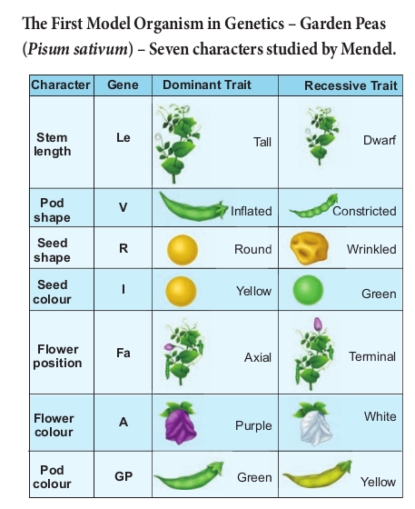

 The contribution of Mendel to Genetics is called Mendelism. It includes all concepts brought out by Mendel through his original research on plant hybridization. Mendelian genetic concepts are basic to modern genetics. Therefore, Mendel is called as **Father of Genetics.**

### Father of Genetics – Gregor Johann Mendel (1822 – 1884)

The first Geneticist, Gregor Johann Mendel unraveled the mystery of heredity. He was born on 22nd July 1822 in Heinzendorf Silesia (now Hyncice, C z e c h o s l o v a k i a ) , Austria. After school education, later he studied botany, physics and mathematics at the University of Vienna. He then entered a monastery of St.Thomas at Brunn in Austria and continued his interest in plant hybridization. In 1849 Mendel got a temporary position in a school as a teacher and he performed a series of elegant experiments with pea plants in his garden. In 1856, he started his historic studies on pea plants. 1856 to 1863 was the period of Mendel’s hybridization experiments on pea plants. Mendel discovered the principles of heredity by studying the inheritance of seven pairs of contrasting traits of pea plant in his garden. Mendel crossed and catalogued 24,034 plants through many generations. His paper entitled **“Experiments on Plant Hybrids”** was presented and published in The Proceedings of the Brunn Society of Natural History in 1866. Mendel was the first systematic researcher in the field of genetics.

**Mendel was successful because:** 

- He applied mathematics and statistical methods to biology and laws of probability to his breeding experiments.

- He followed scientific methods and kept accurate and detailed records that include quantitative data of the outcome of his crosses.

- His experiments were carefully planned and he used large samples.

- The pairs of contrasting characters which were controlled by factor (genes)were present on separate chromosomes.(Figure 2.4)

- The parents selected by Mendel were pure breed lines and the purity was tested by self crossing the progeny for many generations.

**Mendel’s Experimental System – The Garden pea.**

He chose pea plant because,

- It is an annual plant and has clear contrasting characters that are controlled by a single gene separately.

- Self-fertilization occurred under normal conditions in garden pea plants. Mendel used both self-fertilization and cross- fertilization.

- The flowers are large hence emasculation and pollination are very easy for hybridization.

### Mendel’s experiments on pea plant

Mendel’s theory of inheritance, known as the Particulate theory, establishes the existence of minute particles or hereditary units or factors, which are now called as **genes**. He performed artificial pollination or cross pollination experiments with several true-breeding lines of pea plants. A true breeding lines (Pure-breeding strains) means it has undergone continuous self pollination having stable trait inheritance from parent to offspring. Matings within pure breeding lines produce offsprings having specific parental traits that are constant in inheritance and expression for many generations. Pure line breed refers to homozygosity only. Fusion of male and female gametes produced by the same individual i.e pollen and egg are

derived from the same plant is known as self- fertilization. Self pollination takes place in Mendel’s peas. The experimenter can remove the anthers (Emasculation) before fertilization and transfer the pollen from another variety of pea to the stigma of flowers where the anthers are removed. This results in cross-fertilization, which leads to the creation of hybrid varieties with different traits. Mendel’s work on the study of the pattern of inheritance and the principles or laws formulated, now constitute the Mendelian Genetics.

**The First Model Organism in Genetics – Garden Peas (_Pisum sativum_) – Seven characters studied by Mendel.**

Mendel worked at the rules of inheritance and arrived at the correct mechanism before any knowledge of cellular mechanism, DNA, genes, chromosomes became available. Mendel insights and meticulous work into the mechanism of inheritance played an important role which led to the development of improved crop varieties and a revolution in crop hybridization.

Mendel died in 1884. In 1900 the work of Mendel’s experiments were rediscovered by three biologists, **Hugo de Vries** of Holland, **Carl Correns** of Germany and **Erich von Tschermak** of Austria.

Can you identify Mendel’s gene for **regulating white colour in peas? Let us find** the **molecular answer** to understand the gene function. Now the **genetic mystery of Mendel’s white flowers is solved.** It is quite fascinating to trace the Mendel’s genes. In 2010, the gene responsible for regulating flower colour in peas were identified by an international team of researchers. It was called **Pea Gene A** which encodes a **protein** that functions as a transcription factor which is responsible for the production of **anthocyanin pigment. So the flowers are** purple. Pea plants with white flowers do not have anthocyanin, even though they have the gene that encodes the enzyme involved in anthocyanin synthesis. Researchers delivered normal copies of gene A into the cells of the petals of white flowers by the gene gun method. When Gene A entered in a small percentage of cells of white flowers it is expressed in those particular cells, accumulated anthocyanin pigments and became purple. In white flowers the gene A sequence showed a single-nucleotide change that makes the transcription factor inactive. So the mutant form of gene A do not accumulate anthocyanin and hence they are white.

### Terminology related to Mendelism

Mendel noticed two different expressions of a trait – Example: Tall and dwarf. Traits are expressed in different ways due to the fact that a gene can exist in alternate forms (versions) for the same trait is called **alleles.**

If an individual has two identical alleles of a gene, it is called as **homozygous(TT)**. An individual with two different alleles is called **heterozygous(Tt)**. Mendels non-true breeding plants are heterozygous, called as **hybrids**.

When the gene has two alleles the dominant allele is symbolized with capital letter and the recessive with small letter. When both alleles are recessive the individual is called **homozygous recessive** (tt) dwarf pea plants. An individual with two dominant alleles is called **homozygous dominant** (TT) tall pea plants. One dominant allele and one recessive allele (Tt) denotes non- true breeding tall pea plants **heterozygous tall.**
