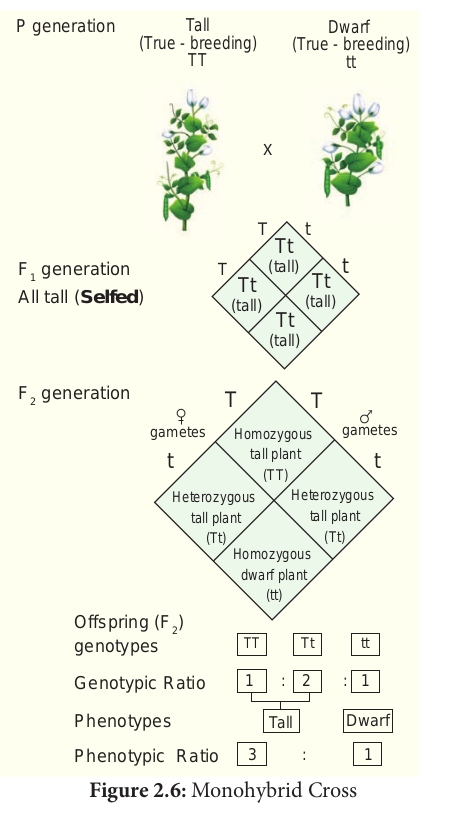

Monohybrid inheritance is the inheritance of a single character i.e. plant height.It involves the inheritance of two alleles of a single gene. When the F1 generation was selfed Mendel noticed that 787 of 1064 F2 plants were tall, while 277 of 1064 were dwarf. The dwarf trait disappeared in the F1 generation only to reappear in the F2 generation. The term **genotype** is the genetic constitution of an individual. The term **phenotype** refers to the observable characteristic of an organism. In a genetic cross the genotypes and phenotypes of offspring, resulting from combining gametes during fertilization can be easily understood with the help of a diagram called Punnett’s Square named after a British Geneticist Reginald C.Punnett. It is a graphical representation to calculate the probability of all possible genotypes of offsprings in a genetic cross.The Law of Dominance and the Law of Segregation give suitable explanation to Mendel’s monohybrid cross.

Reciprocal cross – In one experiment, the tall pea plants were pollinated with the pollens from a true-breeding dwarf plants, the result was all tall plants. When the parental types were reversed, the pollen from a tall plant was used to pollinate a dwarf pea plant which gave only tall plants. The result was the same - All tall plants. Tall ( ) x Dwarf ( ) and Tall ( ) x Dwarf ( ) matings are done in both ways which are called reciprocal crosses.The results of the reciprocal crosses are the same. So it was concluded that the trait is not sex dependent. The results of Mendel’s monohybrid crosses were not sex dependent. 

The gene for plant height has two alleles: Tall (T) x Dwarf (t). The phenotypic and genotypic analysis of the crosses has been shown by Checker board method or by Forkline method.

 