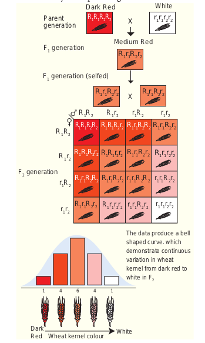

Polygenic Inheritance in Wheat (Kernel colour)

## Polygenic Inheritance in Wheat (Kernel colour)

Polygenic inheritance - Several genes combine to affect a single trait.

A group of genes that together determine (contribute) a characteristic of an organism is called polygenic inheritance. It gives explanations to the inheritance of continuous traits which are compatible with Mendel’s Law.

The first experiment on polygenic inheritance was demonstrated by Swedish Geneticist H. Nilsson - Ehle (1909) in wheat kernels. Kernel colour is controlled by two genes each with two alleles, one with red kernel colour was dominant to white. He crossed the two pure breeding wheat varieties dark red and a white. Dark red genotypes R1R1R2R2 and white genotypes are r1r1r2r2. In the F1 generation medium red were obtained with the genotype R1r1R2r2. F1 wheat plant produces four types of gametes R1R2, R1r2, r1R2, r1r2. The intensity of the red colour is determined by the number of R genes in the F2 generation.

**Four R genes:** A dark red kernel colour is obtained.**Three R genes:** Medium - dark red kernel colour is obtained.**Two R genes:** Medium-red kernel colour is obtained.**One R gene:** Light red kernel colour is obtained. **Absence of R gene:**Results in White kernel colour.

The R gene in an additive manner produces the red kernel colour. The number of each phenotype is plotted against the intensity of red kernel colour which produces a bell shaped curve. This represents the distribution of phenotype. Other example: Height and skin colour in humans are controlled by three pairs of genes.

**Conclusion:**

Finally the loci that was studied by Nilsson – Ehle were not linked and the genes assorted independently.

Later, researchers discovered the third gene that also affect the kernel colour of wheat. The three independent pairs of alleles were involved in wheat kernel colour. Nilsson – Ehle found the ratio of 63 red : 1 white in F2 generation – 1 : 6 : 15 : 20 : 15 : 6 : 1 in F2 generation.

From the above results Nilsson – Ehle showed that the blending inheritance was not taking place in the kernel of wheat. In F2 generation plants have kernels with wide range of colour variation. This is due to the fact that the genes are segregating and recombination takes place. Another evidence for the absence of blending inheritance is that the parental phenotypes dark red and white appear again in F2. There is no blending of genes, only the phenotype. The cumulative effect of several pairs of gene interaction gives rise to many shades of kernel colour. He hypothesized that the two loci must contribute additively to the kernel colour of wheat. The contribution of each red allele to the kernel colour of wheat is additive.
