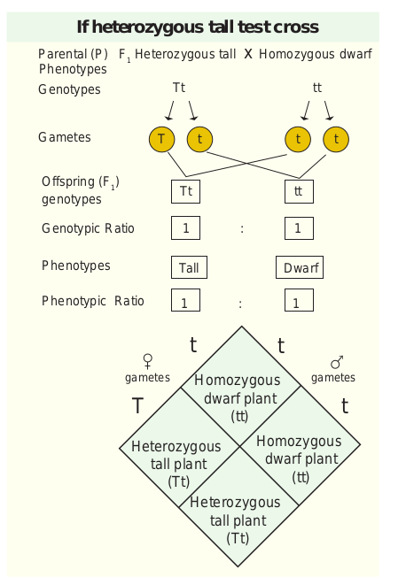
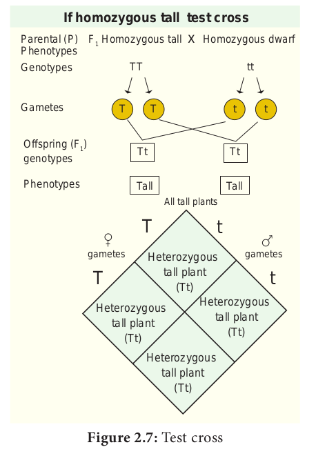
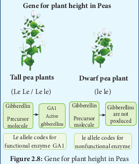
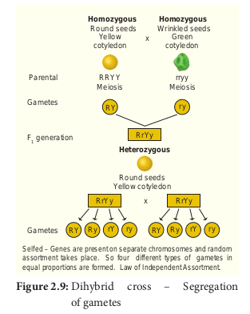

Test cross is crossing an individual of unknown genotype with a homozygous recessive.
 
In Mendel’s monohybrid cross all the plants are tall in F1 generation. In F2 tall and dwarf plants were in the ratio of 3:1. Mendel self pollinated dwarf F2 plants and got dwarf plants in F3 and F4 generations. So he concluded that the genotype of dwarf was homozygous (tt). The genotypes of tall plants TT or Tt from F1and F2 cannot be predicted. But how we can tell if a tall plant is homozygous or heterozygous? To determine the genotype of a tall plant Mendel crossed the plants from F2 with the homozygous recessive dwarf plant. This he called a test cross. The progenies of the test cross can be easily analysed to predict the genotype of the plant or the test organism. Thus in a typical test cross an organism (pea plants) showing dominant phenotype (whose genotype is to be determined) is crossed with the recessive parent instead of self crossing. Test cross is used to identify whether an individual is homozygous or heterozygous for dominant character.

**Why Mendel’s pea plants are tall and dwarf? Find out the molecular explanation.**

Molecular characterization of Mendel’s gene for plant height. 

The plant height is controlled by a single gene with two alleles. The reason for this difference in plant height is due to the following facts: (i) the cells of the pea plant have the ability to convert a precursor molecule of gibberellins into an active form (GA1) (ii) Tall pea plants have one allele (Le) that codes for a protein (functional enzyme) which functions normally in the gibberellin-synthesis pathway and catalyzes the formation of gibberellins (GA1). The allele is dominant even if it is two (Le Le) or single (Le le), it produces gibberellins and the pea plants are tall. Dwarf pea plants have two recessive alleles (le le) which code for non-functional protein, hence they are dwarf. 

**Gene for plant height in Peas**

### Back cross

- Back cross is a cross of F1 hybrid with any one of the parental genotypes. The back cross is of two types; they are dominant back cross and recessive back cross.

- It involves the cross between the F1 offspring with either of the two parents.

- When the F1offsprings are crossed with the dominant parents all the F2 develop dominant character and no recessive individuals are obtained in the progeny.

- If the F1 hybrid is crossed with the recessive parent individuals of both the phenotypes appear in equal proportion and this cross is specified as test cross.

- The recessive back cross helps to identify the heterozygosity of the hybrid.

### Dihybrid cross

It is a genetic cross which involves individuals differing in two characters. Dihybrid inheritance is the inheritance of two separate genes each with two alleles.

**Law of Independent Assortment** – When two pairs of traits are combined in a hybrid, segregation of one pair of characters is independent to the other pair of characters. Genes that are located in different chromosomes assort independently during meiosis. Many possible combinations of factors can occur in the gametes.

Independent assortment leads to genetic diversity. If an individual produces genetically dissimilar gametes it is the consequence of independent assortment. Through independent assortment, the maternal and paternal members of all pairs were distributed to gametes, so all possible chromosomal combinations were produced leading to genetic variation. In sexually reproducing plants / organisms, due to independent assortment, genetic variation takes place which is important in the process of evolution. The Law of Segregation is concerned with alleles of one gene but the Law of Independent Assortment deals with the relationship between genes.

The crossing of two plants differing in two pairs of contrasting traits is called dihybrid cross. In dihybrid cross, two characters (colour and shape) are considered at a time. Mendel considered the seed shape (round and wrinkled) and cotyledon colour (yellow & green) as the two characters. In seed shape round (R) is dominant over wrinkled (r) ; in cotyledon colour yellow (Y) is dominant over green (y). Hence the pure breeding round yellow parent is represented by the genotype RRYY and the pure breeding green wrinkled parent is represented by the genotype rryy. During gamete formation the paired genes of a character assort out independently of the other pair. During the F1 x F1 fertilization each zygote with an equal probability receives one of the four combinations from each parent. The resultant gametes thus will be genetically different and they are of the following four types:

1) Yellow round (YR)  - 9/16

2) Yellow wrinkled (Yr) - 3/16

3) Green round (yR)     -3/16

4) Green wrinkled (yr)   -1/16

These four types of gametes of F1 dihybrids unite randomly in the process of fertilization and produce sixteen types of individuals in F2 in the ratio of 9:3:3:1 as shown in the figure. Mendel’s 9:3:3:1 dihybrid ratio is an ideal ratio based on the probability including segregation, independent assortment and random

fertilization. In sexually reproducing organism / plants from the garden peas to human beings, Mendel’s findings laid the foundation for understanding inheritance and revolutionized the field of biology. The dihybrid cross and its result led Mendel to propose a second set of generalisations that we called Mendel's Law of independent assortment.

