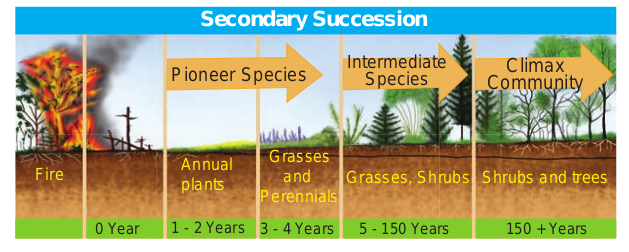
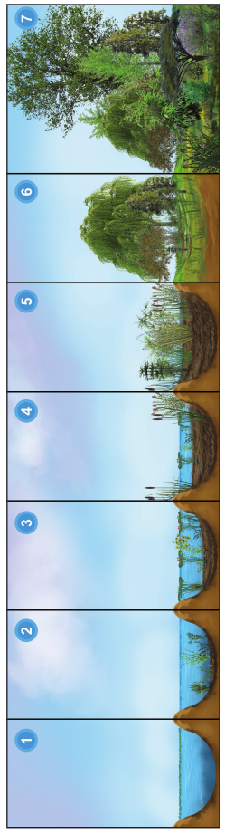
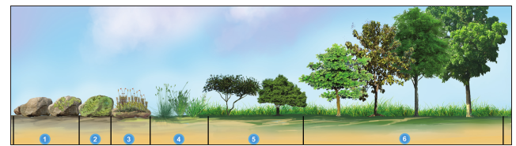

We very often see that forests and lands in our areas are drastically affected by natural calamities (Flood, earthquake) and anthropogenic activities (Fire, over grazing, cutting of trees). Due to these reasons all plants of an area are destroyed and the areas become nude. When we observe this area, over a period of a time we can see that it will be gradually covered by plant community again and become fertile. Such successive replacement of one type of plant community by the other of the same area/ place is known as plant succession. The first invaded plants in a barren area are called **pioneers**. On the other hand, a series of transitional developments of plant communities one after another in a given area are called **seral communities**. At the end a final stage and a final plant community gets established which are called as climax and climax community respectively.

### Causes of Succession

Ever since the onset of origin of life, organic evolution and ecological succession are taking place parallelly. Ecological succession is a complex process. There are three types of causes for any ecological succession. They are

**a. Initiating causes** - Activity of abiotic (light, temperature, water, fire, soil erosion and wind) and biotic factors (competition among organisms) leads to formation of a barren area or destruction of the existing community of an area, initiating primary or secondary succession respectively.

**b. Continuing causes** - The processes of migration, aggregation, competition, reaction etc, are the continuing causes which lead to change the plant communities and nature of the soil in an area.

**c. Stabilizing causes** - The stabilization of the plant community in an area is primarly controlled by climatic factors rather than other factors.

### Characteristics of ecological succession
- It is a systematic process which

causes changes in specific structure of plant community.
- It is resultant of changes of abiotic and biotic factors.
- It transforms unstable community

into a stable community. - Gradual progression in species diversity,

total biomass, niche specialisation, and humus content of soil takes place.
- It progresses from simple food chain to complex food web.
- It modifies the lower and simple life form to the higher life forms.
- It creates inter-dependence of plants and animals.

### Types of succession
The various types of succession have been classified in different ways on the basis of different aspects. These are as follows:

#### 1. Primary succession - 
The development of plant community in a barren area where no community existed before is called primary succession. The plants which colonize first in a barren area is called **pioneer species** or **primary community** or **primary colonies**. Generally, Primary succession takes a very long time for the occurrence in any region.

**Example:** Microbes, Lichen, Mosses.

#### 2. Secondary succession - 
The development of** a plant community in an area where an already developed community has been destroyed by some natural disturbance (Fire, flood, human activity) is known as **secondary succession**. Generally, This succession takes less time than the time taken for primary succession.

  

|         	|                       **Primary succession**                      	|               **Secondary succession**                  	|
|:-------:	|:-----------------------------------------------------------------:	|:-------------------------------------------------------:	|
| 1       	| Developing in an <br>barren area                                  	| Developing in<br>disturbed area                         	|
|    2    	| Initiated due to a<br>biological or any<br>other external factors 	| Starts due to external<br>factors only                  	|
|    3    	| No soil, while<br>primary succession<br>starts                    	| t starts where soil<br>covers is already<br>present     	|
|    4    	| Pioneer species<br>come from outside<br>environment               	| Pioneer species<br>develop from existing<br>environment 	|
|    5    	| It takes more time to<br>complete                                 	| It takes comparatively<br>less time to complete         	|


**Example:** The forest destroyed by fire and excessive lumbering may be re-occupied by herbs over a period of time.

**3. Allogenic succession**
```goat


                                                                       ┌──────────────────────────────────────────────────────────┐
                                                                       │                                                          │
                                                                       │                                                          │
                                                                       │              Types of succession                         │
                                                                       │                                                          │
                                                                       └──────────────────────────────┬───────────────────────────┘
                                                                                                      │                                                                                 │
                ┌────────────────────────────┬──────────────────────────────┬─────────────────────────┴──────────────────┬─────────────────────────────────────┬────────────────────────┤
                │                            │                              │                                            │                                     │                        │
                │                            │                              │                                            │                                     │                        │
                │                            │                                                                           │                                     │                  Heterotrophic
                │                            │                                 ┼                                     Allogenic                           Autotrophic              Succession
                                                                     Autogenic                                       Succession                          Succession              It occurs in the
                                      Ssuccession                    Succession                                    Controlled                                                    medium that is
    Primaryy Succession               Succession                     Controlled                                    by abiotic                           It occurs in the         rich in organic
    Succession                        Development                    by biotic                                     components                           medium that is           substances.
    Development                       of plant                       components of                                 of ecosystem.                        rich in inorganic
    of plant                          community on                   ecosystem.                                                                         substances .
    community on                      disturbed area
    barren area.
```


**Allogeneic succession**

Allogeneic succession occurs as a result of abiotic factors. The replacement of existing community is caused by other external factors (soil erosion, leaching, etc.,) and not by existing organisms.

Example: In a forest ecosystem soil erosion and leaching alter the nutrient value of the soil leading to the change of vegetation in that area.


**4. Autotrophic succession**

If the autotrophic organisms like green plants are dominant during the early stages of succession it is called **autotrophic succession**, this occurs in the habitat which is rich in inorganic substances. Since, green plants dominate in the beginning of this succession, there is a gradual increase in organic matter and subsequently the energy flow in the ecosystem.


### Process of succession

There are a number of sequential processes in
primary autotrophic succession. They are 
(1)Nudation, 
(2) Invasion (migration) 
(3) Ecesis,
(4) Aggregation, 
(5) Competition, 
(6) Reaction
(7) Stabilization (climax).


**1. Nudation**- This is the development of a barren area without any form of life. The barren area may be developed due to topographic (soil erosion, wind action), climatic (hails, storm, fire), and biotic (human activities, epidemics, etc.,) factors.


**2. Invasion**- If species invade or reach a barren area from any other area it is called invasion. When the seeds, spores or other propagules of plant species reach the barren area, by air, water and various other agent, it is known as migration.

**3. Ecesis (Establishment)**- After reaching a new area (invasion), the successful establishment of the species, as a result of adjustment with the conditions prevailing in the area, is known as ecesis. If the establishment is complete, the plant will be able to reproduce sexually in that particular area.

**4. Aggregation**- The successful establishment of species, as a result of reproduction and increase in population of the species than the earlier stage is called aggregation.

**5. Competition** - It refers to the aggregation of a particular species in an area which leads to inter specific and intraspecific competition among the individuals for water, nutrient,radiant energy, CO2, O2 and space, etc.


**6. Reaction**- The species occupying a habitat gradually modify the environmental condition, where the existing species community is displaced or replaced by another. This is called reaction. The community which is replaced by another community is called seral community.


**7. Stabilization (Climax stage)** - The final establishment of plant community is called stabilization. This establishment of a plant community which maintains itself in equilibrium with climax of the area and not replaced by others is known as climax community and the stage is climax stage.

### Classification of plant succession

Detailed study of Hydrosere and Lithosere are discussed below:

  
``` goat


                                                  ┌────────────────────┐
                                                  │                    │
                                                  │ Plantsucecession   │
                                                  │                    │
                                                  └────────┬───────────┘
                                                           │
                                                           │
                                                           │
                  ┌────────────────────────────────────────┼───────────────────────────────────┐
                  │                                        │                                   │
      ┌───────────┴──────────────┐           ┌─────────────┴─────────────┐       ┌─────────────┴───────────┐
      │    Hydrosere             │           │                           │       │                         │
      │                          │           │       Mesosere            │       │        Xerosere         │
      │ (Succession starts       │           │                           │       │                         │
      │  in regions where        │           │  (Succession starts       │       │  ( Succession starts    │
      │  water is plenty)        │           │  in regions where         │       │     in regions where    │
      │                          │           │  moisture condition       │       │     moisture is present │
      │                          │           │  is adequate)             │       │     in minimal amount   │
      │  Examples : Ponds, Lakes │           │                           │       │    with water)          │
      │  Stream, swaps           │           │                           │       │                         │
      │                          │           │                           │       │                         │
      │                          │           │        Halosere           │       │        Psammosere       │
    Plant Succession             │           │                           │       │                         │
      │                          │           │  ( Initiating saline      │       │   (Initiating on        │
      │ ( Initiating on a        │           │          water)           │       │     a sand )            │
      │   barren rock)           │           │                           │       │                         │
      │                          │           │                           │       │                          │
      │                         │           │                           │       │                         │
      │                         │           │                           │       │                         │
      │                         │           │                           │       └─────────────────────────┘
      └──────────────────────────┘           └───────────────────────────┘

```


#### Hydrosere

The succession in a freshwater ecosystem is also referred to as hydrosere. Succession in a pond, begins with colonization of the pioneers like phytoplankton and finally ends with the formation of climax community like forest stage. It includes the following stages Fig 7.21. 

**1.Phytoplankton stage** 

It is the first stage of succession consisting of the pioneer community like blue green algae, green algae, diatoms, bacteria, etc., The colonization of these organisms enrich the amount of organic matter and nutrients of pond due to their life activities and death. This favors the development of the next seral stages.

**2. Submerged plant stage**

As the result of death and decomposition of planktons, silt brought from land by rain water, lead to a loose mud formation at the bottom of the pond. Hence, the rooted submerged hydrophytes begin to appear on the new substratum. Example: Chara, Utricularia, Vallisneria and Hydrilla etc. The death and decay of these plants will build up the substratum of pond to become shallow. Therefore, this habitat now replaces another group of plants which are of floating type. 

**3. Submerged free floating stage** 

During this stage, the depth of the pond will become almost 2-5 feet. Hence, the rooted hydrophytic plants and with floating large leaves start colonising the pond. Example: Rooted floating plants like Nelumbo, Nymphaea and Trapa. Some free floating species like Azolla, Lemna, Wolffia and Pistia are also present in this stage. By death and decomposition of these plants, further the pond becomes more shallow. Due to this reason, floating plant species is


    

**4. Reed-swamp stage** 

It is also called an amphibious stage. During this stage, rooted floating plants are replaced by plants which can live successfully in aquatic as well as aerial environment. Example: Typha, Phragmites, Sagittaria and Scirpus etc. At the end of this stage, water level is very much reduced, making it unsuitable for the continuous growth of amphibious plants.

**5. Marsh meadow stage** 
When the pond becomes swallowed due to decreasing water level, species of Cyperaceae and Poaceae such as Carex, Juncus, Cyperus and Eleocharis colonise the area. They form a mat-like vegetation with the help of their much branched root system. This leads to an absorption and loss of large quantity of water. At the end of this stage, the soil becomes dry and the marshy vegetation disappears gradually and leads to shurb stage

 

**6.Shrub stage**
As the disappearance of marshy vegetation continues, soil becomes dry. Hence, these areas are now invaded by terrestrial plants like shrubs (Salix and Cornus) and trees (Populus and Alnus). These plants absorb large quantity of water and make the habitat dry. Further, the accumulation of humus with a rich flora of microorganisms produce minerals in the soil, ultimately favouring the arrival of new tree species in the area. 

**7.Forest stage**

It is the climax community of hydrosere. A variety of trees invade the area and develop any one of the diverse type of vegetation. Example:Temperate mixed forest (Ulmus,Acer and Quercus), Tropical rain forest (Artocarpus and Cinnamomum ) and Tropical deciduous forest (Bamboo and Tectona). 

In the 7 stages of hydrosere succession, stage1 is occupied by pioneer community, while the stage 7 is occupied by the climax community. The stages 2 to 6 are occupied by seral communities.

**Lithosere**

Lithosere is a type of xerosere initiating on a barren rock surface. The barren rock is devoid of water and organic matter. A barren rock surface gets mineral deposits due to weathering. This results in the colonization of pioneer organisms like crustose lichens. Through a series of successive seral stages, forest stage (Climax community) is achieved finally. These series of stages are given below Fig 7.21. 

### Significance of Plant Succession
-  Succession is a dynamic process. Hence
an ecologist can access and study the seral stages of a plant community found in a particular area.
- The knowledge of ecological succession helps to understand the controlled growth of one or more species in a forest.
- Utilizing the knowledge of succession, even dams can be protected by preventing siltation.
- It gives information about the techniques to be used during reforestation and afforestation.
- It helps in the maintenance of pastures.
- Plant succession helps to maintain species diversity in an ecosystem.
- Patterns of diversity during succession are influenced by resource availability and disturbance by various factors.
- Primary succession involves the colonization of habitat of an area devoid of life.
- Secondary succession involves the reestablishment of a plant community in disturbed area or habitat.
- Forests and vegetation that we come across all over the world are the result of plant succession.
