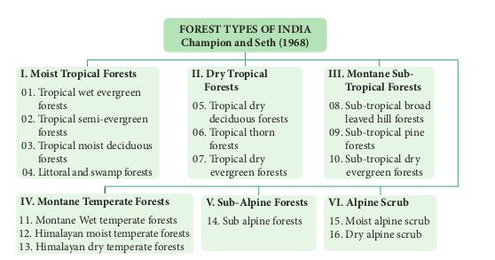
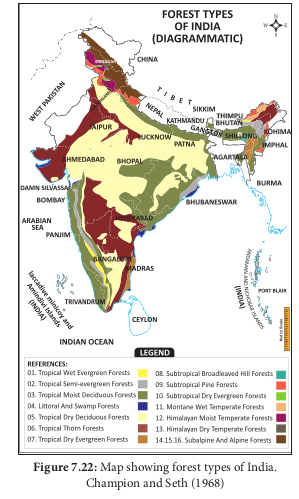
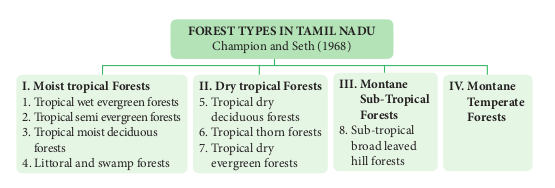
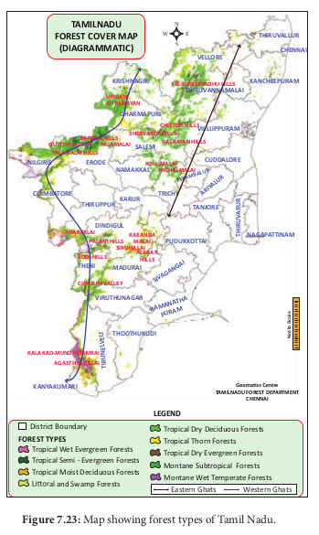

## 7.4 Vegetation

Vegetation refers to the plant cover of an area. Geographically, India is a tropical country and also has strong monsoon climate and differs from other tropical regions of the World. India has four major climatic regions such as wet zone, intermediate zone, dry zone and arid zone, These regions are characterized by different types of natural vegetation. Nature of vegetation is also determined by several factors like altitude, types of plants, animals, climate, soil type, etc. Vegetation in Indian sub-continent is influenced by biotic factors and the existing human culture for a long time. The influence of man on plant formation and distribution is called anthropogenic effect on vegetation. Tamil Nadu has a rich biodiversity right from the Gulf of Mannar to Western Ghats. Tamil Nadu shares the Western Ghats with states of Kerala, Karnataka, Goa, Maharashtra, Gujarat while Eastern Ghats is shared with the State of Andhra Pradesh. Of the 10 geographic zones in India, Coramandel (or) East Coast and Western Ghats are from Tamil Nadu.

### 7.4.1 Vegetation types of India and Tamil Nadu

Vegetation of India and Tamil Nadu consists of variety of plant communities and also possesses rich bio-diversity. It is classified in to the following four types, Which are explained with reference to their unique characteristics and distribution in India and Tamil Nadu:

Forest vegetation
Grassland vegetation
Riparian vegetation
Aquatic and semi aquatic vegetation

### Forest Vegetation
**I) Moist Tropical Forests**
It is in the warmer plains. It is characterised by very dense, multi-storeyed diverse trees, shrubs, lianas and scrub jungles. These areas experience a high rainfall and dry climate. These are further classified into the following types on the basis of wetness.

#### 1. Tropical wet evergreen forests
This type is found at an altitude of nearly 1500 m on the slopes of hills and mountains .These are also called tropical rain forests or tropical wet evergreen forests, where annual rainfall is more than 250 cm.. Vegetation consists of luxuriantly growing huge trees of more than 45 m in height, shrubs, lianas and abundant epiphytes. The common plants are Dipterocarpus, Artocarpus, Mangifera, Emblica and Ixora. These forests occur in Andaman and Nicobar Islands, Western Coasts, Anamalai hills and Assam. This type is also found in western ghats of Thirunelveli, Kanyakumari, Anamalai Hills of Tamil Nadu

#### 2. Tropical semi-evergreen forestsb. Tidal or mangrove forests

This type occurs on the slopes of hills and mountain usually up to 1000 m altitude.The annual rainfall in these forests is between 200 to 250 cm. Vegetation consists of luxuriantly growing evergreen species of giant trees and shrubs. The common tree species are Terminalia, Bambusa, Ixora, Artocarpus, Michelia, Eugenia, and Shorea. Orchids, ferns, some grasses,and herbs are also dominant. These forest are found in Western Coasts, Eastern Orissa and Upper Assam. This type is also present in Coimbatore, Thirunvelveli and Kanyakumar District of Tamil Nadu

#### 3. Tropical moist deciduous forests

The annual rainfall of these forests is 100 to 200 cm with short dry periods. These are spread over an extensive part of the country. Many of the plants shed their leaves in hot summer. Some are ever green and semi-evergreen. The common plant species are Terminalia, Grewia, Adina, Melia, Albizzia, Dalbergia and Shorea. The most dominant plants are Tectona and Sal. These are found in Kerala, Karnataka, South Madhya Pradesh, northern parts of Uttar Pradesh, Bihar, Bengal, Orissa and Assam. This type is also present in Kanyakumari, Theni, Gudalur, Dindigul, Madurai and Nilgiris of Tamil Nadu.

#### 4. Littoral and swamp forests

These include beach forests, tidal forests,
mangrove forests and fresh water swamp forests.


#### a. Beach forests

These are found all along the sea coasts and
river deltas. These areas have sandy soil which
consists of large amount of lime and salts but
poor in nitrogen and other mineral nutrients.
The rainfall varies from 75 cm to 500 cm with
moderate temperature. The common tree
species are Casuarina, Borassus, Phoenix,
Pandanus , Morinda and Thespesia with many
twiners and climbers.

#### b. Tidal or mangrove forests
Tidal forests grow near the estuaries, swampy margins of islands and along sea coasts. The plants are halophytes characterized by the presence of stilt roots, pneumatophores and viviparous germinations of seed. The common plants are Rhizophora, Avicennia, and Sonneratia. These are found near sea coast,Gujarat, Ganges, delta regions of Mahanadhi, Godavari, Krishna, Sundarbans and Pulicat, Pichavaram, Ramanathapuram of Tamil Nadu.

 




#### c. Fresh water swamp forests

These forests grow in low lying land areas where rain or river water gets collected for some time. So the water table is closer to the earth surface. The common plants are Salix, Acer, Ficus and all varieties of grasses and sedges. These forests are found in wetlands of Kanchipuram, Kanniyakumari of Tamil Nadu.

#### II. Dry Tropical Forests

These are classified into three types: Tropical dry deciduous forests, tropical thorn forests and tropical dry evergreen forests

#### 5. Tropical dry deciduous forests

These forests are found at about 400 to 800 m MSL .These forests are found in the areas where annual rainfall is usually low, ranging between 70 and 100 cm. The largest forest area of the country is occupied by tropical dry deciduous forest. The dry season is long and most of the trees remain leafless during this season. The forest trees are not dense, and grow up to 10 to 15 m in height. The common plant species are Dalbergia, Diospyros, Terminalia, Acacia, Chloroxylon,





Bauhinia and Zizyphus. Some common Climbers are Combretum, Hiptage: herbs like Abutilon, Achyranthes and Tribulus.These are found in Andhra Pradesh, Punjab, Uttar Pradesh, Bihar, Orissa, Madhya Pradesh and also found in all districts of Tamil Nadu at lower elevations

#### 6. Tropical thorn forests

These forests extend from plains upto 400 M . Occur in the areas where annual rainfall is between 20 and 70 cm. The dry season is hot and very long. The vegetation is of open type consisting of small trees (8 to 10 m length) and thorny or spiny shrubs with a stunted growth. The plants remain leafless for most of the year and many species have latex.. In rainy season, there is a luxuriant growth of ephemeral herbs and grass. The most common plant species are Acacia, Cassia, Calotropis, Albizzia, Zizyphus, Dichrostachys, Euphorbia, Capparis, and including unpalatable species. They are found in Karnataka, Andhra Pradesh, Maharashtra, South Punjab, most parts of Rajasthan and part of Gujarat and Thirunelveli in Tamil Nadu.

#### 7. Tropical dry evergreen forests
This type of vegetation is found in areas
where annual rainfall is in plenty but the dry
season is comparatively longer. The trees are
dense, evergreen, short and about 10 to 15
meter height. The common plant species are
Manilkara , Walsura, Diospyros and Memexylon
These types of forests are found in the eastern
parts of Tamil Nadu, East coat of Andhra
pradesh. They are also found in all coastal
districts in Tamil Nadu from Thiruvallur to
Nagapatinum districts.

#### III. Montane Subtropical Forests
This type of vegetation occurs in the areas with fairly high rainfall but where the climate is cooler than the tropical and warmer than the temperate forests. They are found in the altitude between 1000 m and 2000 m. The common plants are Eugenia, Syzygium and Toona are mostly evergreens. Many epiphytes including orchids and ferns are present. These are found in Nilgiri, Mahabaleswar, Assam and Manipur. In Eastern Ghats,it is found in the upper slopes and plateau of shervaroys, Kollimalai and Pachamalai of Tamil Nadu These are further classified into
**8. Sub-tropical broad leaved hill forests** (Tamil
Nadu,Kerala,Karnataka and Assam).
**9. Sub-tropical pine forests** (Punjab, U.P and a
part of Sikkim)
**10. Sub-tropical dry evergreen forests**
(Shivaliks and foot hills of western Himalayas).
IV. Montane Temperate Forests
This type of vegetation occurs where
humidity and temperature are comparatively
low. These forests are very dense with an
extensive growth of grass and evergreen trees
of 15 – 45 meters tall. The common plants
are Artocarpus, Balanocarpus, Pterocarpus,
Myristica and woody climbers besides ferns
and epiphytes. It is also called mountain
wet temperate forests. They are found in
mountains of Himalayas. These are further
classified into
**11. Montane wet temperate forests.**
**12. Himalayan moist temperate forests.**
**13. Himalayan dry temperate forests.**

In Tamil Nadu montane forest is mostly confined to moist and sheltered valleys, glens and hollows as in the Anamalis, Nilgiri and Palani hills tops at above 1000 m. They are known in Tamil as ‘Sholas’. The common vegetation of sholas are Ilex, Syzygium, Michelia, Eurya and Rhododendron.

#### V Sub-Alpine Forests
**14 Sub-Alpine Forests**

This type of vegetation is found in the altitude ranging between 2900 m to 3500 m, where snow fall occurs for several weeks in a year with less than 65 cm annual rainfall. Hence, strong winds and below 00 C temperature prevail for greater part of the year. The common tree species are Abies, Pinus, Betula, Quercus, Salix, Rhododendron with plenty of epiphytic orchids ,mosses and lichens. They occur in Himalayas from Ladakh in the West to Arunachal in the East Bengal, Uttar Pradesh, Assam, Jammu and Kashmir.'

#### VI Alpine - Scrub

This type of vegetation is found in the Himalayas at an altitude ranging from 3600 m to 4900 m. The height of the trees decreases with increasing altitudes. The common plants are small sized plants such as Sedum, Primula, Saxifraga, Rhododendron , Juniperus and with many types of lichens. These are further classified into
**15. Moist alpine scrubs**
**16. Dry alpine scrubs.**
```
Grasslands created and maintained by human are called anthropogenic grasslands.
```

**2. Grass land vegetation**
Grassland refer to the vegetation community predominated by graminoids (i.e. grass and grass like plants). These are found in the altitude ranging from 150 to 2000 m and above mean sea level. The major plant families of the plants are Poaceae, Cyperaceae, Fabaceae , Gentianaceae and Asteraceae are common in this type of vegetation. The grass land not only comprises plants but also serves as habitats to a variety of micro and macro fauna. Based on the range of altitude, grasslands are categorized into: low altitude grasslands and high altitude grasslands.

**a. Low altitude grasslands**

This type of grasslands are found at an altitude upto 1000 m. The common plant species are Halopyrum, Wild Saccharum, Arundinella, Heteropogon and Chrysopogon. These types of grasslands are spread over coastal areas, riverline and alluvial areas of Deccan plateau, Chota Nagpur plateau, Gangetic, Brahmaputra valley and Eastern Ghats. In Tamil Nadu, these are found in the Eastern Ghats .These are scattered and intermixed with local forests. They are exposed to considerable biotic interference. Fire is common during dry months.

b. Higher altitude grasslands This type of grasslands are found in altitude above 1000 m.The common plants species are Chrysopogon, altitude grassland Arundinella, Andropogon, Heteropogon, Cymbopogon, Imperata, Festuca, and Agrostis.. It is spread over the southern slopes of Himalayas, subHimalayan ranges, Nagaland, Pradesh and Western ghats. Himachal In Tamil Nadu ,these grasslands are found in higher regions of western ghats and are found between the sholas forest patches that occur in the depressions and furrows created by water courses flowing in these rolling downs are called as rolling grassland and also called shola grassland. It shows different types of vegetation like grasses, herbs, few shrubs and stunted trees.

```
Existence of two climax communities under the influence of same climatic conditions are found in higher mountain hill tops, above 7000 feet MSL (Mean sea level) of Nilgiris. Example: Sholas and grasslands.
```

#### 3. Riparian Vegetation
This type of vegetation is located along streams
and rivers. The most common species are,
Terminalia, Diospyros,Salix,Ficus and grasses.
They are found on the banks of Godavari,
Krishna, Ganga, Brahmaputria, Narmadha
Yamuna and riverbeds of Cauvery and
Thamirabharani in Tamil Nadu.

```
Visit nearby forest and water bodies,
observe the species found, describe
and then identify the various types of
vegetation
```

**4. Aquatic And Semi-Aquatic Vegetation** This type of vegetation is found in lakes, ponds, puddles and marshy places. The common plant species are Nelumbo, Nymphaea, Bacopa, Typha, Pandanus, Cyperus, Aeschynomene, Hydrilla, Aponogeton and Potomogeton. It is found in various parts of Tamil Nadu.


**Summary** The interaction between biotic and abiotic components in an environment is called ecosystem. Autotrophs and heterotrophs are the producers and consumers respectively. The function of ecosystem refers to creation of energy, flow of energy and cycling of nutrients. The amount of light available for photosynthesis is called Photo synthetically Active Radiation . It is essential for increase in the productivity of ecosystem. The rate of biomass production per unit area /time is called productivity. It is classified as primary productivity, secondary productivity and community productivity. The transfer of energy in an ecosystem can be termed as energy flow. It is explained through the food chain, food web , ecological pyramids ( pyramid of number, biomass and energy ) and biogeochemical cycle. Cycling of nutrients between abiotic and biotic components is evident in the pond ecosystem, making itself self sufficient and self regulating Ecosystem protected for the welfare of posterity is called ecosystem management.

Successive replacement of one type of plant community by the other of the same area/ place is known as plant succession. The first invaded plants in a barren (nude) area are called pioneers (pioneers communities). On the other hand, a series of transitional developments of plant communities one after another in a given area are called seral communities. Succession is classified as primary succession, secondary succession, allogeneic succession and autotrophic succession. Plant succession is classified in to hydrosere (Initiating on a water bodies) ,Mesosere and xerosere. Further xerosere is subdivided in to Lithosere ( Initiating on a barren rock), Halosere and Pasmmosere.

Vegetation refers to the plant cover of an area. Geographically, India and Tamil Nadu show tropical climate. Hence it has rich vegetation (Forest vegetation, Grassland vegetation, Riparian vegetation, Aquatic and semi aquatic vegetation). According to Champion and Seth (1968), forest vegetation of India and Tamil Nadu has been classified in to 16 and 9 types respectively.
