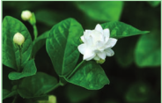

The ability to perceive colour is a wonderful aspect of human eyes and dyes add colour to the goods we use. They have been in use since the ancient times.

The earliest authentic records of dyeing were found in the tomb painting of ancient Egypt. Colourings on mummy cements (wrapping) included saffron and indigo. They can also be seen in rock paintings in India.

**Indigo** 
Botanical name : _Indigofera_ 
Family : Fabaceae 

**Origin and Area of cultivation:** 
Indigofera tinctoria is native to India. It was grown in many states in India. Now it is grown limited states mainly in Tamil Nadu and Andhra Pradesh. 

**Uses** 
A brilliant dark blue dye ‘indigo’ was extracted from the leaves of several species of Indigofera. The people of Asia, especially India have known the dye for over 4,000 years. It is also used in painting of murals. Indigofera have long been used in Southern India in temple arts and folk arts, popularly known as Kalamkari. Indigo used for dyeing and printing cotton, rayon and wool.

**Henna** 
Botanical name : _Lawsonia inermis_ 
Family : Lythraceae 

**Origin and Area of cultivation:** 
It is indigenous to North Africa and South-west Asia. It is grown mostly throughout India, especially in Gujarat, Madya Pradesh and Rajasthan.

**Uses** 

An orange dye ‘Henna’ is obtained from the leaves and young shoots of Lawsonia inermis. The principal colouring matter of leaves ‘lacosone” is harmless and causes no irritation to the skin. This dye has long been used to dye skin, hair and finger nails. It is used for colouring leather, for the tails of horses and in hair-dyes.

**Champaran Satyagraha** _Indigofera_ is a very important cash crop among plants cultivated in India during the British regime. Farmers were forced to cultivate _Indigofera_ instead of food crops. Gandhi started satyagraha at Champaran, a village in Bihar in support of farmers. This was the first satyagraha in India by Gandhi. Government accepted ‘champaran farmers bill’. Gandhi’s first satyagraha in India achieved a great success.
