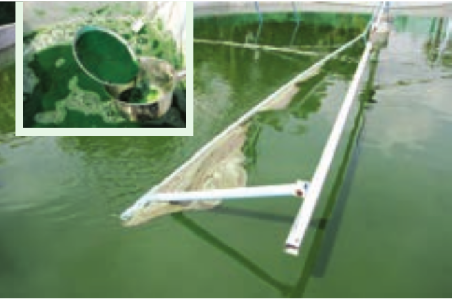
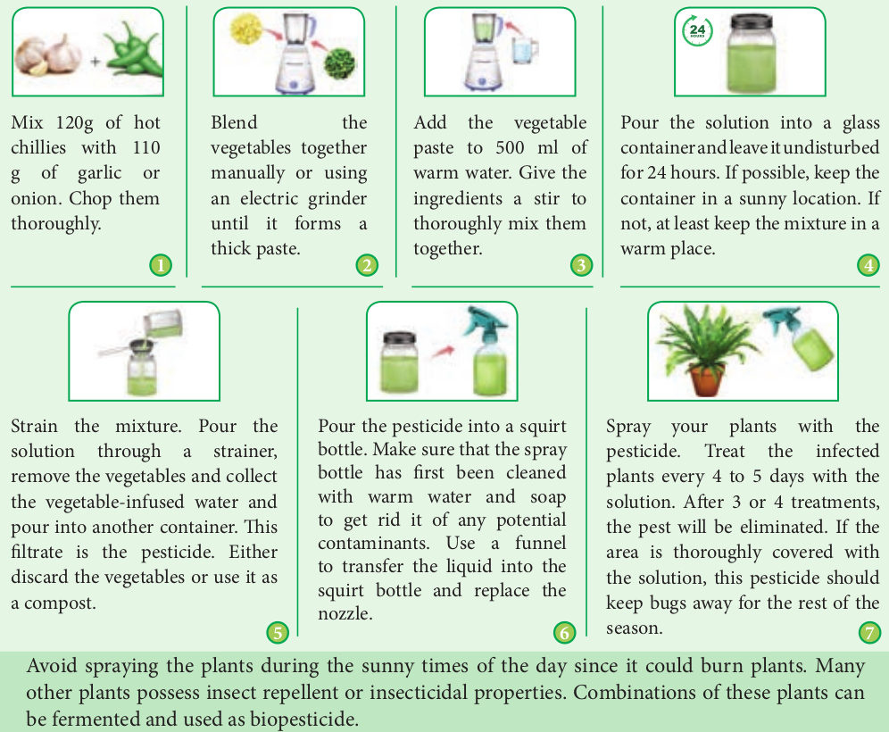
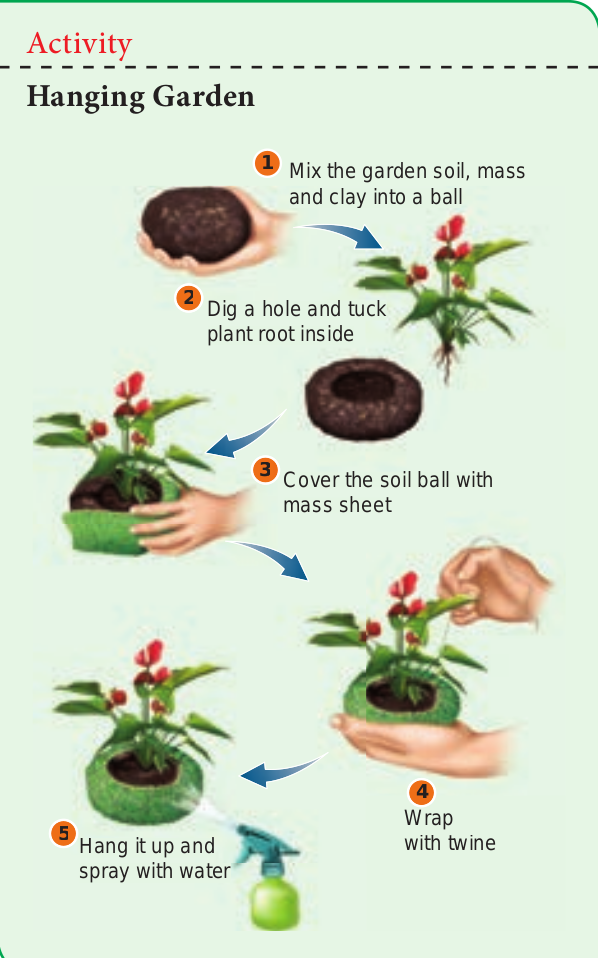
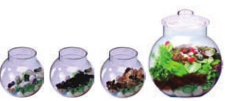
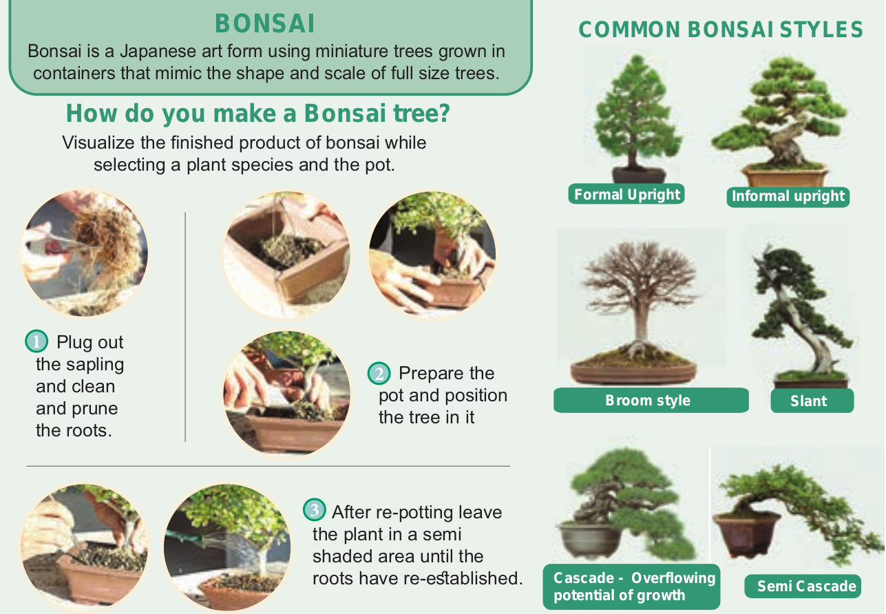

## Entrepreneurial Botany 
Entrepreneurial Botany is the study of how new businesses are created using plant resources as well as the actual process of starting a new business. An **entrepreneur** is someone who has an idea and who works to create a product or service that people will buy, by building an organization to support the sales. **Entrepreneurship
is now a popular topic for higher secondary students, with a focus on developing ideas to create new ventures among the young people. Vast opportunities are there for the students of Botany. In the present scenario students should acquire ability to merge skills and knowledge in a meaningful way. Converting botanical knowledge into a business idea that can be put into practice for earning a livelihood is the  

much-needed training for the students. This part of chapter is aimed to help the students to acquire such skills with practical knowledge to start a few activities of entrepreneurship.

### Mushroom cultivation
Malnutrition caused by the lack of adequate protein and other nutrients in daily diet of people is becoming a major health hazard in developing countries. Under such circumstances, mushroom being a rich source of protein and other nutrients can be a part and parcel of every day’s food. Mushrooms are the **fruiting body** of edible fungi and is the most priced commodity among vegetables, not only because of its nutritive value but also for its characteristic aroma and flavor. M u s h r o o m s are also called **white vegetable**. M u s h r o o m cultivation has great scope in India and in other developing c o u n t r i e s . M u s h r o o m c u l t i v a t i o n activities can play an important role in supporting the local economy. Selling mushroom in a local market form a source of additional income to the family.


 **Steps involved in mushroom cultivation**
- The straw used for composting should be ripe and golden-yellow in colour. It should be cut into 2-4 inches and properly sterilized.
- The culture space should be clean and the ventilators and windows should be covered with fine wire mesh to prevent the entry of flies and birds.
- The culture space should be sprayed with 0.1% Nuvan and 5% Formalin, two days prior to spawning and transferring to bags to cropping rooms.
- The spawn used for mushroom should be free from contaminations. Bags should be filled with 8 kg of wet straw.
- During spawning running temperature and relative humidity should be maintained 200C to 300C, 75 to 85% respectively.
- Proper watering should be done when the growth coverings are removed. There should not be dry patches on blocks. Excess watering must be avoided.
- About 20 cm gap should be maintained in between two bags or blocks.
- Picking must be done as their caps become 10 – 12 cm by twisting.

Two kinds of mushrooms are cultivated namely **button** and **oyster**.

### Single Cell Protein (SCP) Production

Single-cell proteins are the dried cells of microorganism, which are used as protein supplement in human foods or animal feeds. Microorganisms that can be used for the production of SCP have the capacity to synthesize proteins rapidly than higher living organisms. Microorganisms like algae, fungi, yeast and bacteria are used for this purpose. Here you will learn about the production of SCP from an algae, _Spirulina_.




**Small scale biomass production of _Spirulina_.**

It requires an aquarium, air pump, nutrients and _Spirulina_ mother culture.

- Take a 30 litre capacity aquarium and fill half of it with water.
- Check if any heavy metal concentration or fluorine or calcium carbonate in water.
- Fill the tank with water and add nutrients preferably **zarrouk medium**. (Add half of the required nutrients first and add another half later).
- To aerate the culture, fix the air pump (avoid centrifugal pump) after adding nutrients.
- Add the mother culture to the aquarium. For every 1 liter of water add 4 gm. mother culture.
- Place it in sunlight for 10-12 hrs. every day. - After a week check the culture and add more
water leave it for one more week, till the biomass becomes dark green.
- Use a very fine cloth and harvest the algae. - Water can be reused in aquarium. 
- Dry the algae for later use.

Single cell protein has a high nutritive value due to higher protein, vitamin, essential amino acids and lipid content. Hence it can form a good protein supplement. However it cannot completely replace the conventional protein sources due to their high nucleic acid content and slower in digestibility. They may result in allergic reactions.

### Seaweed Liquid Fertilizer
Seaweed is rich in trace elements and potassium, which makes it ideal to add to compost in its raw state, to work in as a mulch, or to create a liquid fertilizer. This is easy to do. Seaweed fertilizer releases about 60 nutrients from which plants can benefit.

- Collect the seaweed that is not too stinky.
- Rinse the seaweed to remove the excess salt.
- Fill a bucket to three quarters way with water. Add as much seaweed as will fit and leave to soak.
- Stir the seaweed mix every two to four days. 
- Allow to soak for several weeks to months.
So that the fertilizer grows stronger and stronger over time. (Make sure to keep the brew somewhere so that its odour will not affect the daily household.)
- It is ready for use once it no longer carries a smell of ammonium.
- When it is ready, use as a fertilizer for plants and garden beds (soil). (It should be diluted with water at a minimum of three parts to one).



Liquid seaweed extract enhances healthy growth of plants, flowers and vegetables. Regular use will help plants to withstand environmental stress, pests and disease attack. It can be used as a foliar spray for fruit, flower, vegetable crops as well as for shrubs and trees. It stimulates healthy growth for all plants.

### Organic farming
Organic farming is an alternative agricultural system in which plants/crops are cultivated in natural ways by using biological inputs to maintain soil fertility and ecological balance thereby minimizing pollution and wastage. Indians were organic farmers by default until the green revolution came into practice.

Use of biofertilizers is one of the important components of integrated organic farm management, as they are cost effective and renewable source of plant nutrients to supplement the chemical fertilizers for sustainable agriculture. Several microorganisms and their association with crop plants are being exploited in the production of biofertilizers. Organic farming is thus considered as the movement directed towards the philosophy of **Back to Nature.**

**I. Organic Pesticide** Pest like aphids, spider and mites can cause serious damage to flowers, fruits, and vegetables. These creatures attack the garden in swarms, and drain the life of the crop and often invite disease in the process. Many chemical pesticides prove unsafe for human and the environment. It turns fruits and vegetables unsafe for consumption. Thankfully, there are many homemade, organic options to turn to war against pests.

**Preparation of Organic Pesticide**

Refer figure: 10.24

**II. Bio-pest repellent** Botanical pest repellent and insecticide made with the dried leaves of _Azadirachta indica_

**Preparation of Bio-pest repellent** - Pluck leaves from the neem tree and chop

the leaves finely. - The chopped up leaves were put in a 50-liter

container and fill to half with water; put the lid on and leave it for 3 days to brew.

- Using another container, strain the mixture which has brewed for 3 days to remove the leaves, through fine mesh sieve. The filtrate can be sprayed on the plants to repel pests.
- To make sure that the pest repellent sticks to the plants, add 100 ml of cooking oil and the same amount of soap water. (The role of  
the soap water is to break down the oil, and the role of the oil is to make it stick to the leaves).
- The stewed leaves from the mixture can be used in the compost heap or around the base of the plants.

**Activity**




### Terrarium 
Can portable miniature indoor greenery be commercially sold?
A terrarium is a collection of small plants growing in a transparent, sealed container. Terrariums are easy to make, low maintenance gardens, and it can survie indefinitely with minimal water. **How to make a terrarium? Prepare the Container**: Collect whatever interesting glassware you have or source your container from a store and clean it thoroughly. Plan how to arrange the plants inside the glassware.



**Add Drainage Layers**: To create a false drainage layer, fill the bottom with pebbles so that water can settle and does not flood. The depth of the pebbles depends on the size of the container. 
**Add the Activated Charcoal**: Cover the pebbles with charcoal to improve the quality of the terraria by reducing bacteria, fungi and odors. 
**Add Soil**: Add enough soil so that the plant roots will have enough space to fit and grow. 
**Plant**: Select the desired plant such as_, Caralluma spp, Asperagus spp, Portulaca spp, Begonia spp,_ and _Chlorophytum spp_; trim the roots if they are too long. Dig a pit using a stick, and place the plants’ roots in it. Add more soil around the top and compact the soil down around the base of the plant. Place little plants in the container and try to keep them away from the edges of the container, so that the leaves do not touch the sides. After planting add accessories like a layer of moss (dried or living), little figurines (old toys, glass beads, stones) or a layer of miniature rocks. This is the little green world 
**Cleaning and Watering**: Wipe if there is any dirt along the sides of the container. Give the terrarium a little bit of water and enjoy the beautiful miniature living world on your table or in your living room. Ready made terrariums can fetch a good price as indoor garden objects or as gift articles.




### Cultivation of Medicinal and Aromatic Plants
Globalization has brought opportunities and challenges in all business sectors. Government of India has identified medicinal and aromatic plants as one of the sectors that can make India a global leader in the 21st century owing to the treasure of about **8,000** medicinal and **2,500 aromatic plants that can provide large number of consumer products with national and international demand. Medicinal plants synthesize a number of secondary metabolites with pharmacological properties through secondary metabolism. The chemicals isolated from medicinal plants are used in traditional and biomedicine systems to treat diseases of both humans and animals. But most of the medicinal and aromatic plants are still wild collecting.

Central Institute of Medicinal and Aromatic Plants (CIMAP) has developed a number of high yielding varieties and processing technologies to promote cultivation of medicinal and aromatic plants. Profitable cultivation of medicinal plants can be practiced by the entrepreneurs along with traditional agriculture horticulture crops. They can be profitably intercropped in plantations. Cultivation of medicinal/aromatic plants offers following advantages:

- Generate employment through development of ancillary industries.
- Foreign exchange earnings through exports.
- Crops are not damaged by domestic animals or by birds.
- Technologies are farmer and eco-friendly.

**I. Cultivation of Medicinal Plant - _Gloriosa superba_**

**Economically useful part** – Seed, Rhizome. **Major constituents -** Colchicine (0.5-0.7%) and Colchicoside **Uses - Cures gout, anti-inflammatory,** anticancer.  


[_Gloriosa ](10.26.png "")

superba_ **Soil and Climate:** Red loamy soils are well suited for cultivation. Glory lily is cultivated in Tamil Nadu mainly in the parts of Tirupur, Dindigul, Karur and Salem districts covering an area of 2000 hectare. **Planting**: Planting is distributed from June – July. Plough the field 2 -3 times and add 10 tons of Farmyard Manure during last ploughing. Trenches of 30 cm depth are formed and tubers are planted at 30 – 45 cm spacing. The vines are trained over support. **Irrigation:** Irrigation should be given immediately after planting. Subsequent irrigation is given at 5 days intervals of time. **Harvest:** Pods are harvested at 160 – 180 days.

```hint {role="warn"}
**National Medicinal Plants Board (NMPB)**

Government of India has set up National Medicinal Plants Board (NMPB) on 24th November 2000. Currently this board is working under AYUSH Government of India. Developing an apt mechanism for coordination of various ministries and implementation of policies for overall growth of medicinal plant sector both at central / state and international level is the primary mandate of NMPB. It focusses on in-situ and ex-situ conservation and enhancing local medicinal plants and aromatic species of medicinal significance to meet the growing demand.
```

**II. Cultivation of Aromatic plant - _Cymbopogon citratus_(Lemongrass)**

Lemongrass is a tropical herb packed with strong citrus flavor. The lemon taste is prized in Asian cooking, as well as in tea, sauces, and soups.
**Economic part:** Stem base and leaves. **Major constituents:** Citronella, geraniol and citronellol. Uses: The aromatic oil has flavouring properties and is used in perfumery, cosmetics, confectionary, beverages, mosquito repellents and toilet cleaners. **Soil and Climate:** Lemongrass grow well in full sun, with plenty of water, in a rich, well- draining soil. 
**Planting: This plant can thrive well all through** the year. Fill planting holes with composted manure to improve fertility and enhance the soil’s ability to hold water. If you’re adding several lemongrass plants to planting beds, space plants 60 cm apart. 
[Lemon grass](10.27.png "")

**Irrigation:** Water requirements for this plant will vary dependent upon the type of soil they grow. Sandy, loose soils require more frequent watering than silty loam. 
**Harvest:** Start harvesting as soon as plants are 30 cm tall and stem bases are at least 1.5 cm thick. Cut stalks at ground level.


```hint {role="class"}
**CSIR Aroma Mission of India** 
The Council of Scientific and Industrial Research (CSIR) has Catalyzing Rural Empowerment through Cultivation, Processing, Value Addition and Marketing of Aromatic Plants”. This program has contributed significantly in the development, nurturing and positioning of essential oil-based aroma industry in the country. This has led to creation of an ecosystem benefitting the industry, farmers and next generation entrepreneurs. The activities are pursued in a synergistic mode with the organization in public and private set ups. This program has also paved way for developing entrepreneurship in different parts of the country through cultivation and commercial utilization of aromatic crops.  
```

**Summary** 
Early civilization in different parts of the world has domesticated different species of plants for various purposes. Based on their utility, the economically useful plants are classified into food plants, fodder plants, fibre plants, timber plants, medicinal plants, and plants used in paper industries, dyes and cosmetics.

However, food base of majority of the population depends on very few Cereals, Millets, Pulses, Vegetables, Fruits, Nuts, Sugars, Oil seeds, Beverages, Spices and Condiments.

Oils can be classified into two types namely, essential oils and vegetable oils. Fatty acids in oil may be saturated or unsaturated. The oil yielding plants are groundnut, sesame, sunflower, coconut and mustard. The oils are used in cooking, making soaps and other purposes. Beverages contain alkaloids that stimulate central nervous system. Non alcoholic beverages are coffee, tea and cocoa. Spices were used throughout the world for several years. Cardamom is ‘Queen of Spices’ used for flavouring confectionaries and beverages. Black pepper is King of Spices.

Botanically a fibre is a long, narrow, thick walled cell. It is classified based on uses: textile fibres, brush fibres, plaiting fibres and

filling fibres. Cotton, Jute and Coconut are fibre yielding plants. Teak, Rosewood, and Ebony are woods used for making furniture. Rubber is produced from the latex of Hevea brasiliensis. Paper production is a Chinese invention. Dyes have been used since ancient times. Indigo was extracted from the leaves of Indigofera. The orange dye henna is from the leaves of Lawsonia. Cosmetics have a high commercial value and have become chemical based industrial products. Perfumes are volatile and aromatic in nature, manufactured from essential oils which are found at different parts of the plant. Medicinal plants serve as therapeutic agents. Medicinally useful molecules obtained from these plants are marketed as drugs are called Biomedicines. Whereas phytochemicals from some of the plants which alter an individual’s perceptions of mind by producing hallucination are known as psychoactive drugs. Thus plantsplay a vital role in the lives of people throughout the world. Entrepreneurial Botany is the study of how new businesses are created using plant resources as well as the actual process of starting a new business. Mushrooms are the fruiting body of edible fungi and is the most priced commodity among vegetables.

Single-cell proteins are the dried cells of microorganism, which are used as protein supplement in human foods or animal feeds. Microorganisms like algae, fungi, yeast and bacteria are used for this purpose.

A terrarium is a collection of small plants growing in a transparent, sealed container. Bonsai is the art and science of dwarfing and shaping of a tree. Specialty materials like essential oils and pharmaceuticals, are obtained from plants. Many species of medicinal and aromatic plants (MAPs) are cultivated for such industrial uses, but most are still wild collected.  

**Glossary**

**Term**: Description

**Lubricant**: Oily substance reduces friction.

**Odour**: Smell (pleasant or unpleasant).

**Diuretic**: Substance that promote urine production

**Cirrhosis**: A chronic liver disease typically caused by alcoholism or hepatitis.

**Antioxidant**: A substance that scavenges free radicals.

**Carminative**: A drug causing expulsion of gas from the stomach or bowel.

**Malnutrition: Deficiencies, excesses or** imbalances in a person’s intake of energy and / or nutrients

**Spawn**: Mycelium especially prepared for propagating mushrooms

**Aromatic crops**: Plants that produce aromatic oils.  

**Perfumery: The art or process of making** perfume

**Cosmetics:** substances or products used foe personal grooming.

**confectionary**: a place where confections/ sweets are kept or made

**Anti-inflammatory: the property of a substance** or treatment that reduces swelling.

**Alzheimer’s disease**: A type of dementia that causes problems with memory, thinking and behavior

**Ethnobiology**: Ethnobiology is the study of relationships between peoples and plants.

**Pharmacopoeia**: Is a book containing directions for the identification of compound medicines, and published by the authority of a government or a medical or pharmaceutical society.

**Fixative**: A substance used to reduce the evaporation rate and improve stability when added to more volatile components.

**Antiperspirant**: Products whose primary function is to inhibit perspiration / sweat

**Seasoning: The processing of food with spices** and condiments to enhance the flavour.