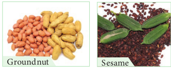
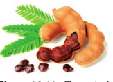

Food plants
## Food plants

Currently about 10,000 food plants are being used of which only around 1,500 species were brought under cultivation. However, food base of majority of the population depends only on three grass species namely rice, wheat and maize.

### Cereals
The word cereal is derived from Ceres, which according to the Roman mythology denotes “Goddess of agriculture”. All cereals are members of grass family (Poaceae) that are grown for their edible starchy seeds. The prominence of cereals as food plants is due to the following attributes:

- Greater adaptability and successful colonisation on every type of habitat.
- The relative ease of cultivation
- Tillering property that produce more branches which results in higher yield per unit area.
- Compact and dry grains that they can be easily handled, transported and stored without undergoing spoilage.
- High caloric value that provides energy. 
  
The nutrients provided by cereals include carbohydrates, proteins, fibres and a wide range of vitamins and minerals. Cereals can be classified into two different types based on their size namely Major Cereals and Minor Cereals.

#### Major Cereals 


**Rice / Paddy** 
Botanical name : _Oryza sativa_

Paddy is a semi-aquatic crop and is grown in standing water. It is an important food crop of the world, occupying the second position in terms of area under cultivation and production, next to wheat. Rice is the chief source of carbohydrate. 
**Origin and Area of cultivation**
South East Asia is considered as the center of origin of rice. Earliest evidences of rice cultivation have been found in China, India and Thailand. It is mainly cultivated in Delta and irrigated regions of Tamil Nadu. 
**Uses** 
Rice is the easily digestible calorie rich cereal food which is used as a staple food in Southern and North East India. Various rice products such as **Flaked rice** (Aval), **Puffed rice** / **parched rice** (Pori) are used as breakfast cereal or as snack food in different parts of India. 

**Rice bran oil** obtained from the rice bran is used in culinary and industrial purposes. 

**Husks** are used as fuel, and in the manufacture of packing material and fertilizer.

```hint { role="warn"}
**International Rice Research Institute (IRRI)** 

International Rice Research Institute (IRRI) is located in Los Banos, Manila the capital city of Philippines. This is the only institute in the world which exclusively carries out research as on rice. IRRI aims to improve livelihoods and nutrition, abolishing poverty, hunger, and malnutrition. Whatever IR rice varieties available in the world are developed through rice breeding programme and released by IRRI. Till date IRRI has produced 843 rice varieties that have been released in 77 countries. IR8 is a high-yielding semi-dwarf rice variety developed by IRRI in the early 1960s and it is called as miracle rice, much celebrated for fighting famine. Another variety to mention is IR36 which is a semi-dwarf variety that proved highly resistant to a number of insect pests and diseases that raised farmers’ rice yields and brought down the prices of the staple food in Asian families. The International Rice Gene bank of IRRI has a collection of more than 117 000 types of rice, comprising of modern and traditional varieties including wild relatives of Paddy.
```

**Wheat** 
Botanical name : _Triticum aestivum_

**Origin and Area of cultivation**
Earliest evidence for wheat cultivation comes from Fertile Crescent region. The common cultivated wheat, _Triticum aestivum_ is cultivated for about 7,500 years. Wheat is mostly cultivated in the North Indian states such as Uttar Pradesh, Punjab, Haryana, Rajasthan, Madhya Pradesh and Bihar.

**Uses** 
Wheat is the staple food in Northern India. Wheat flour is suitable to make bread and other bakery products. Processed wheat flour, that has little fibre, is called Maida which is used extensively in making parota, naan and bakery products. Malted wheat is a major raw material for producing alcoholic beverages and nutritive drinks.

**Maize / Corn** 
Botanical name : _Zea mays_

**Origin and Area of cultivation**
Maize is the only cereal that has originated and domesticated from the New World. Madhya Pradesh, Himachal Pradesh and Punjab are the major maize producing states of India.Whereas Perambalur, Ariyalur, Cuddalore, Dindigul and Tirupur are the major maize growing belts in Tamil Nadu.

```hint { role="warn"}

**Why do popcorn pops?** 


Endosperm in corn consists of two type namely soft and hard. In popcorn soft endosperm constitutes most part of the grain surrounded by thin layer of hard endosperm. When heated, the internal starch and protein are converted into gelatinous substances and when pressure mount further, the soft endosperm expands and explodes reversing the grain and the gelatinous starch are converted into foam, which readily solidifies outside and convert into crispy, tasty popcorn.  
```

**Uses** Most of the corn produced is used as fodder than food. Corn syrup is used in the manufacture of infant foods. Corn is a raw material in the industrial production of alcohol and alcoholic beverages.

```hint { role="warn"}
**PSEUDO-CEREAL** 


The term pseudo-cereal is used to describe foods that are prepared and eaten as a whole grain, but are botanical outliers from grasses. Example: **quinoa**. It is actually a seed from the _Chenopodium quinoa_ plant belongs to the family Amaranthaceae. It is a gluten-free, whole-grain carbohydrate, as well as a whole protein (meaning it contains all nine essential amino acids) and have been eaten for 6,000 years in Andes hill region.
```

### Millets (Siru Thaniyangal)
The term millet is applied to a variety of very small seeds originally cultivated by ancient people in Africa and Asia. They are gluten free and have less glycemic index.


**Pearl Millet** 
Botanical name: _Pennisetum americanum_

It is one of the millets introduced in India and Africa. Pearl Millet is rich in fibre, iron and minerals, stable food grain in many parts of India, especially in Gujarat and Rajasthan.

**Uses** It is commonly used to make flat bread, gluten free cereal based products, porridge (Kambang koozh), biscuits, pasta and non- dairy probiotic beverages.

**Finger Millet – Ragi** 
Botanical name : _Eleusine coracana_ Finger millet is the crop of early introduction from East Africa into India. Ragi is rich in calcium. **Uses** It is used as a staple food in many southern hilly regions of India. Ragi grains are made into porridge and gruel. Ragi malt is the popular nutrient drink. It is used as a source of fermented beverages.

**Sorghum** 
Botanical name : _Sorghum vulgare_ Sorghum is native to Africa. It is one of the major millets in the world and is rich in calcium and iron.

**Uses** It is fed to poultry, birds, pigs and cattle and a source of fermented alcoholic beverage

### Minor Millets 


**Little Millet** 
Botanical name- _Panicum sumatrense_ 

This is one of the oldest millets and is native to India. The species name is based on a specimen collected from Sumatra. It is rich in iron and fibre than rice that makes it best for diabetes. 

**Uses**
It is cooked like rice and also milled and baked. It cures anaemic condition, constipation and other gastrological problems.

**Foxtail Millet**
Botanical name : _Setaria italica_ 

This is one of the oldest millet used traditionally in India. Which is domesticated first in China about 6000 years. Rich in protein, carbohydrate, vitamin B and C, Potassium and Calcium. 

**Uses**
It supports in strengthening of heart and improves eye sight. Thinai porridge is given to lactating mother.

**Kodo Millet** 
Botanical name : _Paspalum scrobiculatum_ 

Kodo millet is originated from West Africa, which is rich in fibre, protein and minerals. 

**Uses** 

Kodo millet is ground into flour and used to make pudding. Good diuretic and cures constipation. Helps to reduce obesity, blood sugar and blood pressure.

### Pulses
The word Pulse is derived from the Latin words ‘puls’ or ‘pultis’ meaning “thick soup”. Pulses are the edible seeds that are harvested from the fruits of Fabaceae. They provide vital source of plant-based protein, vitamins and minerals for people around the globe.


**Black gram** 
Botanical name : _Vigna mungo_ 

**Origin and Area of cultivation**
Black gram is native to India. Earliest archeobotanical evidences record the presence of black gram about 3,500 years ago. It is cultivated as a rain fed crop in drier parts of India. India contributes to 80% of the global production of black gram. Important states growing black gram in India are Uttar Pradesh, Chattisgarh and Karnataka.

**Uses** 

Black gram is eaten whole or split, boiled or roasted or ground into flour. Black gram batter is a major ingredients for the preparation of popular Southern Indian breakfast dishes. Split pulse is used in seasoning Indian curries.

**Red gram / Pigeon pea** 
Botanical name : _Cajanus cajan_ 

**Origin and Area of cultivation:** 
It is the only pulse native to Southern India. It is mainly grown in the states of Maharashtra, Andhra Pradesh, Madhya Pradesh, Karnataka and Gujarat.

**Uses** 

Red gram is a major ingredient of sambar, a characteristic dish of Southern India. Roasted seeds are consumed either salted or unsalted as a popular snack. Young pods are cooked and consumed.

**Green gram** 
Botanical name : _Vigna radiata_ 

**Origin and Area of cultivation**
Green gram is a native of India and the earliest archaeological evidences are found in the state of Maharashtra. It is cultivated in the states of Madhya Pradesh, Karnataka and Tamil Nadu. 

**Uses** 

It can be used as roasted cooked and sprouted pulse. Green gram is one of the ingredients of pongal, a popular breakfast dish in Tamil Nadu. Fried dehulled and broken or whole green gram is used as popular snack. The flour is traditionally used as a cosmetic, especially for the skin.

**Chick pea / Bengal gram** 
Botanical name : _Cicer arietinum_ 

**Origin and Area of cultivation:** 
It has originated in West Asia and was known in cultivation for more than 4,000 years in India. It is mainly grown in the states of Madhya Pradesh, Uttar Pradesh and Rajasthan. 

**Uses** 
Chick pea protein is rated high in terms of amino acid content and digestibility. Infant food formulae uses malted chick pea as an ingredient. Chick pea seed flour is a prime constituent of many forms of Indian confectionary. Roasted and salted, whole or split gram forms the popular snacks of middle class.

### Vegetables
While walking through a market filled with fresh vegetables like stacks of lady’s finger, mountains of potatoes, pyramids of brinjal, tomatoes, cucurbits, we learn to choose the vegetables that is fresh, tender, ripe and those suit the family taste through experience and cultural practices. Why do we need to eat vegetables and what do they provide us?

Vegetables are the important part of healthy eating and provide many nutrients, including potassium, fiber, folic acid and vitamins A, E and C. The nutrients in vegetables are vital for maintenance of our health.


**Potato** 
Botanical name : _Solanum tuberosum_ 
Family: Solanaceae


**Origin and Area of cultivation**
Potato has originated from the highlands of Peru and Bolivia. It is cultivated in Uttar Pradesh, West Bengal and Bihar are the major potato cultivating states of India. Nilgiri and Palani hills also contribute to the potato cultivation in Southern Indian hills.

**Uses** 
Potato tubers are used in a variety of ways like boiled, steamed, fried, baked, roasted or as an ingredient in soup, stews, pies and other dishes. It is the major raw material for the chips industry, brewing industry and in the manufacture of products used for microbiological and clinical applications.

**Lady’s finger / Okra** 
Botanical name : _Abelmoschus esculentus_ 
Family: Malvaceae 

**Origin and Area of cultivation**
Lady’s finger is a native of the Tropical Africa. Assam, Maharashtra and Gujarat are the important states where Lady’s finger is grown in abundance. Coimbatore, Dharmapuri and Vellore are the major cultivating regions of Tamil Nadu.

**Uses** 

The fresh and green tender fruits are used as a vegetable. Often they are sliced and dehydrated to conserve them for later use. It has most important nutrients.

**Cucumber** 
Botanical name : _Cucumis sativus_ 
**Family: Cucurbitaceae** 

The cucurbits are the vining plants of the family Cucurbitaceae, which include cucumbers, squash, pumpkins, melons and gourds.

**Origin and Area of cultivation**
The cucumber is an important summer vegetable in all parts of India. It is originated in India. It has been cultivated for at least three thousand years. Cucumber is commonly cultivated throughout India.

**Uses** 
Depending on the species immature or mature fruit are consumed as fresh or cooked vegetables. It is used in the preparation of salad and pickle. Oil obtained from cucumber seed is good for the brain and the body and the kernels are used in confectionaries.

### Fruits
Edible fruits are fleshy structures with a pleasant aroma and flavours. Fruits are sources of many nutrients including potassium, dietary fiber, folic acid and vitamins.Depending on the climatic region in which fruit crops grow, they can be classified into temperate(apple, pear, plum) and tropical fruits (mango, jack, banana). In this chapter we will study some examples of tropical fruits.

**Mango** (National fruit of India) 

Botanical name : _Mangifera indica_ 
Family: Anacardiaceae


**Origin and Area of cultivation**
The mango is the native to Southern Asia, especially Burma and Eastern India. It is the National fruit of India. Major mango producing States are Andhra Pradesh, Bihar, Gujarat and Karnataka. Salem, Krishnagiri, Dharmapuri are the major mango producing districts of Tamil Nadu. Some of the major cultivars of mango in India are Alphonsa, Banganapalli, neelam and malgova.

**Uses** 
Mango is the major table fruit of India, which is rich in beta carotenes. It is utilized in many ways, as dessert, canned, dried and preserves in Indian cuisine. Sour, unripe mangoes are used in chutneys, pickles, side dishes, or may be eaten raw with salt and chili. Mango pulp is made into jelly. Aerated and non-aerated fruit juice is a popular soft drink.


**Banana** 
Botanical name : _Musa_ x _paradisiaca_ 
Family: Musaceae 


**Origin and Area of cultivation**
Bananas were domesticated in South East Asia. Tamil Nadu is the world’s No. 1 banana producer. Theni, Trichy, Erode, Thoothukudi, Coimbatore, Kanyakumari, Thanjavur and Dindigul are the prominent regions in Tamil Nadu where the crop is being cultivated. Major cultivars of banana are Chevazhai, Nentheran, Karpooravalli, Poovan and Peyan.

**Uses** 
The banana fruit is loaded with potassium and essential vitamins, which can be eaten raw or cooked (deep fried, dehydrated, baked or steamed). The fruit can be processed into flour and can be fermented for the production of beverages such as banana juice, beer, vinegar and vine.

**Jack fruit** (State fruit of Tamil Nadu) 

Botanical name : _Artocarpus heterophyllus_ 
Family: Moraceae


**Origin and Area of cultivation**
The jackfruit has originated in the Western Ghats of India and it is the state fruit of Tamil Nadu. The major Jack fruit cultivating areas of Tamil Nadu are Cuddalore, Kanyakumari, Dindigul, Pudukottai, Namakkal, Tirunelveli and Nilgiris. Panruti and Coimbatore districts are the major marketing centres.

**Uses** The fruit can be eaten raw or cooked. Unripe flake slices are deep-fried to make crispy chips. The seeds are either boiled or roasted and eaten. Unripe fruits are used as vegetables.

|CommonName |Tamil Name |Botanical name |Family |Edible part |
|------|------|------|------|------|
|Guava |கொய்யா |Psidium guajava |Myrtaceae |Mesocarp and Endocarp |
|Papaya |பப்பாளி |Carica papaya |Caricaceae |Mesocarp |
|Pomegranate | மாதுளை |Punica granatum |Punicaceae |Aril |
|Fig | அத்தி |Ficus carica |Moraceae |Fleshy receptacle |
|Date Palm | பேரிச்சம் |Phoenix dactylifera |Arecaceae |Pericarp |


### Nuts
Nuts are simple dry fruits composed of a hard shell and an edible kernel. They are packed with a good source of healthy fats, fibre, protein, vitamins, minerals and antioxidants. Some of the important nuts are discussed below.



**Cashew nut** 
Botanical name : _Anacardium occidentale_ 
Family: Anacardiaceae

**Origin and Area of cultivation**
Cashew has originated in Brazil and made its way to India in the 16th century through Portuguese sailors. Cashew is grown in Kerala, Karnataka, Goa, Maharashtra, Tamil Nadu, and Orissa.

**Uses** Cashews are commonly used for garnishing sweets or curries, or ground into a paste that forms a base of sauces for curries or some sweets. Roasted and raw kernels are used as snacks.

**Almond** 
Botanical name : _Prunus dulcis_ 
Family: Rosaceae 

**Origin and Area of cultivation**
Almond is a tree native to Mediterranean regions of the Middle East. Almond is cultivated in Kashmir, Himachal Pradesh and Uttar Pradesh. 

**Uses** 
Almonds are often eaten raw or roasted and are available as whole, sliced (flaked), and as flour. Almond oil is made into almond butter or almond milk, which are used in sweet and savoury dishes. Almond helps in promoting HDL (High Density Lipids)

### Sugars


We experienced sweetness while eating the stems of sugarcane, roots of sugar beet, fruits of apple and while drinking palmyra sap. This is due to the different proportions of sugars found in it. Sugar is the generic name for sweet tasting soluble carbohydrate, which are used in foods and beverages. Sugars found in sugarcane and palmyra make them ideal for efficient extraction to make commercial sugar.

**Sugarcane** 
Botanical name : Saccharum officinarum
Family : Poaceae

**Origin and Area of cultivation**
The cultivated Saccharum officinarum has evolved by repeated back crossing of _S.officinarum of New Guinea with wild S.spontaneum_ of India to improve the quality. All districts except Kanyakumari and Nilgiris of Tamil Nadu cultivate Sugarcane. 

**Uses** 
Sugar cane is the raw material for extracting white sugar. Sugarcane supports large number of industries like sugar mills producing refined sugars, distilleries producing liquor grade ethanol and millions of jaggery manufacturing units. Fresh sugarcane juice is a refreshing drink. Molasses is the raw material for the production of ethyl alcohol.

**Stevia /Sweet leaf** 
Botanical name : _Stevia rebaudiana_ Family: Asteraceae Stevia is a sweetener and a sugar substitute, extracted from the leaves of _Stevia rebaudiana._ It has no calories and is 200 times sweeter than sugar. The Steveocide is the chemical that is responsible for sweetness in Stevia.


**Origin and Area of cultivation**
Stevia is a native to Brazil and Paraguay. It is cultivated in the states of Himachal Pradesh, Gujarat and Tamil Nadu.

**Uses** 
This is the most popular natural sweetener and is a substitute for white sugar, hence it is extensively used by diabetic patients and health conscious people.

Palmyra tree and Palm Jaggery


**Palmyra** (State tree of Tamil Nadu) 

Botanical name : Borassus flabellifer 
Family: Arecaceae

**Origin and Area of cultivation**
Palmyra is native to tropical regions of Africa, Asia and New Guinea. Palmyra grows all over Tamil Nadu, especially in coastal districts. 

**Uses** 
Exudate from inflorescence axis is collected for preparing palm sugar. Inflorescence is tapped for its sap which is used as health drink. Sap is processed to get palm jaggery or fermented to give **toddy**. Endosperm is used as a refreshing summer food. Germinated seeds have an elongated embryo surrounded by fleshy scale leaf which is edible.

### Oil Seeds
Why fried foods are tastier than boiled foods? There are two kinds of oils namely, essential oils and vegetable oils or fatty oils. The essential oils or volatile oils which possess aroma evaporate or volatilize in contact with air. Any organ of a plant may be the source of essential oil. For example, flowers of Jasmine, fruits of orange and roots of ginger. The vegetable oils or non-volatile oils or fixed oils that do not evaporate. Whole seeds or endosperm form the sources of vegetable oils.


```goat
                           ┌──────────────────────┐
                           │                      │
                           │  Fatty Acids in Oil  │
                           │                      │
            ┌──────────────┴──────────────────────┴────────────┐
            │                                                  │
            │                                                  │
            │                                                  │
            │                                                  │
 ┌──────────▼────────┐                              ┌──────────▼─────────┐
 │  Saturated Fatty  │                              │ Unsaturated Fatty  │
 │  Acid (SFA)       │                              │ Acid (UFA)         │
 │                   │                              └──────────┬─────────┘
 └───────────────────┘                                         │
                                                               │
                                                               │
                                                               │
        ┌──────────────────────────────────────────────────────┤
        │                                                      │
        │                                                      │
        │                                                      │
        │                                                      │
┌───────▼───────────────┐                            ┌─────────▼───────────┐
│                       │                            │ Poly Unsaturated    │
│ Mono Unsaturated      │                            │ Fatty Acid          │
│ Fatty Acid            │                            │ (PUFA)              │
│ (MUFA)                │                            │ Liquid form in room │
│ Liquid form in        │                            │ temperature and     │
│ room temperature      │                            │ stay in liquid form │
│ but get solidified in │                            │ even when chilled.  │
│ low temperature.      │                            │ Example: Sunflower  │
│ Example: Coconut      │                            │ oil and Soybean oil │
│ oil                   │                            └─────────────────────┘
└───────────────────────┘
```
Gingelly oil and Rice bran oil are mixture of MUFA and PUFA  

Let us know about few oil seeds 
**Groundnut / Peanut** 

Botanical name : _Arachis hypogaea_ 
Family : Fabaceae 

**Origin and Area of Cultivation:** 

Groundnut is native of Brazil. Portuguese introduced groundnut into Africa. The Spanish took it to the South East Asia and India via Philippines. In India Gujarat, Andhra Pradesh and Rajasthan are top producers. 

**Uses** 
Nuts contain about 45% oil. The kernels are also rich sources of phosphorous and vitamins, particularly thiamine, riboflavin and niacin. It is premium cooking oil because it does not smoke. Lower grade oil is used in manufacture of soaps and lubricants.

**Sesame / Gingelly** 
Botanical name : _Sesamum indicum_ 
Family : Pedaliaceae 

**Origin and Area of cultivation:** 
_Sesamum_ _indicum_ has originated from Africa.. Sesame is cultivated as a dry land crop. West Bengal and Madhya Pradesh are the top producers in India during 2017-18. It is considered as a healthy oil in Southern Indian culture. 

**Uses** 
Sesame oil is used for mostly culinary purposes in India. Lower grades are used in manufacture of soaps, in paint industries, as a lubricant and as an illuminant. In India, the oil is the basis of most of the scented oils used in perfumes. Sesame seed snacks are popular throughout India.

**Coconut** 
Botanical name : _Cocos nucifera_ 
Family : Arecaceae

**Origin and Area of cultivation:**

The origin of coconut is Pacific island region. Kerala and Tamil Nadu are the leading producers in India.

**Uses** 
Coconut oil is classified as edible-industrial oil. Soaps obtained from coconut oil lathers well in soft and hard water. It is used in manufacture of rubber, synthetic resins, lubricants, brake fluids for aeroplanes and detergents. It is used as major hair oil and a base for applying medicinal powders.

### Beverages 
How about a cup of coffee or tea? We always entertain our guests with this offer. Children exchange chocolates during their birthdays.** All non-alcoholic beverages contain alkaloids that stimulate central nervous system and also possess mild diuretic properties. In this part of chapter, we learn about three popular non- alcoholic beverages namely tea, coffee and cocoa. 



**Tea** 
Botanical name : _Camellia sinensis_ 
Family : Theaceae 

**Origin and Area of cultivation:** 

Tea is native of China.Assam is the top tea producer in India, followed by Kerala and Tamil Nadu. 

**Uses**
Tea is the most popular beverage among all sections of people in India. Regular consumption of green tea is believed to lowers the bad cholesterol and increases the good cholesterol.

**Coffee** 
Botanical name : Coffea arabica 
Family : Rubiaceae

Why does a student or a driver prefer tea or coffee during night work? **Origin and Area of cultivation:**
Coffea arabica is the prime source of commercial coffee which is native to the tropical Ethiopia An Indian Muslim saint, Baba Budan introduced coffee from Yemen to Mysore.Karnataka is the largest coffee producing state in India followed by Tamil Nadu and Kerala. Tamil Nadu is the largest consumer of coffee in India. 

**Uses** 

Drinking coffee in moderation provides the following health benefits:

Caffeine enhances release of acetylcholine in brain, which in turn enhances efficiency. It can lower the incidence of fatty liver diseases, cirrhosis and cancer. It may reduce the risk of type 2 diabetes.

**Cocoa** 
Botanical name: Theobroma cacao Family : Malvaceae 

**Origin and Area of cultivation:** 
Cocoa is native of Tropical American region. The word Theobroma (Theos means god, broma means food) means ‘food of the Gods’. Kerala is the largest producer of Cocoa in India followed by Karnataka. 

**Uses** 
Cocoa is mainly used in confectionaries and forms an important ingredient in nutritive drinks. Cocoa products are rich in fibres, minerals and antioxidants, thus preventing cancer, cardiovascular diseases, premature ageing.
