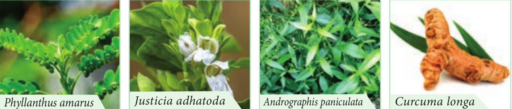

Medicinal Plants

## Medicinal Plants

India is a treasure house of medicinal plants. They are linked to local heritage as well as to global-trade. All institutional systems in India primarily use medicinal plants as drug sources. At present, 90% collection of medicinal plants is from the non-cultivated sources. Growing demand for herbal products has led to quantum jump in volume of plant materials traded within and across the countries. Increasing demand exerts a heavy strain on the existing resources. Now efforts are being made to introduce cultivation techniques of medicinal plants to the farmers.

Medicinal plants play a significant role in providing primary health care services to rural and tribal people. They serve as therapeutic agents as well as important raw materials for the manufacture of traditional and modern medicines. Medicinally useful molecules obtained from plants that are marketed as drugs are called Biomedicines. Medicinal plants which are marketed as powders or in other modified forms are known as Botanical medicines. In this chapter you will be learning about a few medicinal plants that are commonly used in Tamil Nadu. All these plants are commonly available in and around dwelling places and can be easily cultivated in home gardens.

**Keezhanelli** 
Botanical name : _Phyllanthus amarus_ 
Family : Euphorbiaceae (Now in Phyllanthaceae)



**Origin and Area of cultivation:** 
The plant is a native of Tropical American region and is naturalised in India and other tropical countries. It is not cultivated and is collected from moist 
places in plains. _Phyllanthus maderspatensis_ is also commonly sold in the medicinal plant markets collected from non-forest are as keezhanelli. 

**Active principle:** Phyllanthin is the major chemical component. 

**Medicinal importance** _Phyllanthus_ is a well-known hepato-protective plant generally used in Tamil Nadu for the treatment of Jaundice. Research carried out by Dr. S P Thyagarajan and his team from University of Madras has scientifically proved that the extract of P. amarus is effective against hepatitis B virus.

**Adathodai** 
Botanical name : _Justicia adhatoda_ 
Family: Acanthaceae 

**Origin and Area of cultivation:** 

It is native to India and Srilanka. This species is not known in wild in Tamil Nadu but widely cultivated as a live fence and around temples. **Active principle:** Vascin 

**Uses** 

Adhatoda possess **broncho dilating** property. The decoction is used in treating many bronchial disorders such as cough,cold and asthma. It is also used in treating fevers. The extract forms an ingredient of cough syrups.

| S. No |Common Name |Tamil Name |Botanical Name |Family |Plantpart used |Medicinal Uses |
|------|------|------|------|------|------|------|
| 1 |Holy basil |துளசி |Ocimumsanctum |Lamiaceae |Leaves and Roots |The leaves a restimulant,  a ntiseptic, anti-hypertensive and anti-bacterial and expectorant used in bronchitis. Decoction of roots is given as a diaphoretic in malarial fevel. |
| 2 |Indian gooseberry |நெல்லி |Phyllanthusemblica |Phyllanthaceae |Fruit |It is a potent rejuvenator and imm une modulator. It has a anti-ageing properties. It helps to promote longevity, enhance digestion, treat constipation and reduce fever and cough. |
| 3 |Indian Acalypha |குப்பைமேனி |Acalyphaindica |Euphorbiaceae |Leaves |Used to cure skin diseases caused by ringworms. Powdered leaves are used to cure bedsores and infected wounds. |
| 4 |Vilvam |வில்வம் |Aegle marmelos |Rutaceae |Fruit |The unripe fruit is used to treat problems of stomach indigestion.  It kills intestinal parasites. |
| 5 |Veldt grape |பிரண்டை |Cissusquadrangularis |Vitaceae |Stem and root |Paste obtained from t he  powdered s tem a nd r oot of this plant is used in bone fractures. Whole plant is useful to treat asthma and stomach troubles. |

**Nilavembu** 
Botanical name : _Andrographis paniculata_ Family : Acanthaceae _Andrographis paniculata,_ known as the **King of Bitters** is traditionally used in Indian systems of medicines. 
**Active principle:** Andrographolides. 
**Medicinal importance:** Andrographis is a **potent hepatoprotective** and is widely used to treat liver disorders.

Concoction of _Andrographis paniculata_ and eight other herbs (Nilavembu Kudineer) is effectively used to treat malaria and dengue.

**Turmeric** 
Botanical name : _Curcuma longa_ 
Family: Zingiberaceae 

**Origin and Area of Cultivation:** 
You have already studied the details under the spices. 
**Active principle:** Curcumin. 
**Medicinal importance:** Curcumin (the yellow colouring principle is the major pharmacologically active compound of turmeric) is well known for its medicinal properties.

It is used to treat **Alzheimer’s** disease due to its property to cross over blood brain barrier. It has a very powerful anti-oxidant, anti-cancerous, anti-inflammatory, anti- diabetic, anti-bacterial, anti-fungal and anti-

```hint {role="hint"}
**Patenting Of Turmeric** 
University of Mississippi medical center, USA was granted a patent for wound healing property of Turmeric in 1995. The patent was granted both for oral and topical applications and provides an exclusive right to sell and distribute. Since the use of turmeric to heal wounds is a common domain knowledge in India, the Government of India has decided to fight against the patent through the Indian Council for Scientific and Industrial Research (CSIR). CSIR collected documentary evidences from various literature to prove that the knowledge on wound healing property of turmeric existed in India for a long time and provided the evidences to the United States Patent and Trade mark Office (USPTO). Based on the evidences the patent was revoked by USPTO. Hence the traditional knowledge (TK) on turmeric was safeguarded from Bio piracy. viral properties. It is one of the traditional medicines used for wound healing.
```

**Psychoactive Drugs** In the above chapter you have learnt about plants that are used medicinally to treat various diseases. Phytochemicals / drugs from some of the plants alter an individual’s perceptions of mind by producing hallucination are known as psychoactive drugs. These drugs are used in all ancient culture especially by Shamans and by traditional healers. Here we focus on two such plants namely Poppy and Marijuana.

**Opium poppy** 
Botanical name : _Papaver somniferum_ 
Family: Papaveraceae 

**Origin and Area of cultivation:** 
_Opium poppy_ is native to South Eastern Europe and Western Asia. Madhya Pradesh, Rajasthan and Uttar Pradesh are the licenced states to cultivate opium poppy.

Opium is derived from the exudates of fruits of poppy plants. It was traditionally used to induce sleep and for relieving pain. Opium yields **Morphine**, a strong analgesic which is used in surgery. However, opium is an addiction forming drug.

**Cannabis / Marijuana** 
Botanical name : _Cannabis sativa_ 
Family: Cannabiaceae 

**Origin and Area of Cultivation:** 

Marijuana is native to China. States such as Gujarat, Himachal Pradesh, Uttarkand, Uttarpradesh and Madhaya Pradesh have legally permitted to cultivate industrial hemp/Marijuana

The active principle in Marijuana is **trans-tetrahydrocanabinal** (THC). It possess a number of medicinal properties. It is an effective pain reliever and reduces hypertension. THC is used in treating **Glaucoma** a condition in which pressure develops in the eyes. THC is also used in reducing nausea of cancer patients undergoing radiation and chemotherapy. THC provides relief to bronchial disorders, especially asthma as it dilates bronchial vessels. Because of these medicinal properties, cultivation of cannabis is legalized in some countries. However, prolonged use causes addiction and has an effect on individual’s health and society. Hence most of the countries have banned its cultivation and use.

```hint {role="warn"}
**Narcotics Control Bureau (NCB)** 
Drugs come in various forms and can be taken in numerous ways. Some are legal and others are not. Drug abuse and misuse can cause numerous health problems and in serious cases death can occur. The Narcotics Control Bureau (NCB) is the nodal drug law enforcement and intelligence agency of India and is responsible for fighting drug trafficking and the abuse of illegal substances.
```
