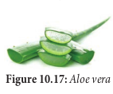

The term paper is derived from the word ‘papyrus’ a plant (_Cyperus papyrus_) that was used by Egyptians to make paper-like materials. Paper production is a Chinese invention. The Chinese discovered the paper that was prepared from the inner bark of paper mulberry in 105 A.D. For a long time, the art of paper making remained a monopoly of the Chinese until Arabs learned the technique and improved it around 750 A.D. Invention of printing increased the demand for paper. 

**Manufacture of Wood pulp:**
Wood is converted into pulp by mechanical, and chemical processes. Wood of Melia azadirachta, _Neolamarkia_ _chinensis_, _Casuarina_ spp, _Eucalyptus_ spp are used for making paper pulp.

```hint {role="warn"}
Purified dissolving pulp is used as a basic material in the manufacture of rayon or artificial silk, fabrics,transparent films (cellophane, cellulose acetate films), plastics. The viscose process of making rayon is the most common process.
```
