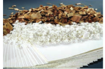

Timber

The basic need of shelter is obtained from the timber trees. In this lesson we learn about few timber plants.

**Teak** 
Botanical name : _Tectona grandis_ 
Family: Lamiaceae

RosewoodTeak wood carving

Cotton plant Jute products **Figure 10.1**  

**Origin and Area of cultivation: This is native** to South east Asia. It is observed wild in Assam. But cultivated in Bengal, Assam, Kerala, Tamil Nadu and North-West India. **Uses** It is one of best timbers of the world. The heartwood is golden yellow to golden brown when freshly sawn, turning darker when exposed to light. Known for its durability as it is immune to the attack of termites and fungi.

The wood does not split or crack and is a carpenter friendly wood. It was the chief railway carriage and wagon wood in India. Ship building and bridge-building depends on teakwood. It is also used in making boats, toys, plywood, door frames and doors.

**Rosewood** 
Botanical name : _Dalbergia latifolia_ 
Family: Fabaceae 

**Origin and Area of cultivation:** 
Rose wood is native to India It is cultivated in Uttar Pradesh, Bihar, Odisha, Central, Western and Southern India. 

**Uses** 
Indian rosewood has yellowish sapwood and dull brown to almost purple coloured heartwood. The wood is characterised by fragrant, heavy, narrowly interlocked grained and medium coarse textured. It is a durable and heavy wood and is suitable for under water use. Wood is used for making furniture, army wagons, temple chariots, cabinets, railway sleepers, musical instruments, hammer handles, shoe heels and tobacco pipes.

**Ebony** 
Botanical name : _Diospyros ebenum_ 
Family: Ebenaceae 

**Origin and Area of cultivation:** 
It is commonly found in tropical forests Southern India and Srilanka. Ebony is distributed in forests of Karnataka, Kerala and Tamil Nadu. 

**Uses** 
The heartwood is jet black with a metallic lustre when smoothened and is resistant to attack by insects and fungi. The wood is difficult to season and hence cut into small pieces before seasoning It is used mainly for making piano keys, handles of cutlery, musical instruments, making sticks, umbrella handles, whips and furniture.
