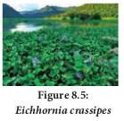
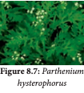
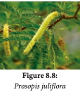

Alien invasive species

## Alien invasive species

Invasion of alien or introduced species disrupts ecosystem processes, threaten biodiversity,

reduce native herbs, thus reducing the ecosystem services (benefits). During eradication of these species, the chemicals used increases greenhouse gases. Slowly they alter ecosystem, micro climate and nature of soil and make it unsuitable for native species and create human health problems like allergy, thus resulting in local environmental degradation and loss of important local species.

According to World Conservation Union invasive alien species are the second most significant threat to bio-diversity after habitat loss. 

**What is invasive species?** 

A non-native species to the ecosystem or country under consideration that spreads naturally, interferes with the biology and existence of native species, poses a serious threat to the ecosystem and causes economic loss.

It is established that a number of invasive species are accidental introduction through ports via air or sea. Some research organisations import germplasm of wild varieties through which also it gets introduced. Alien species with edible fruits are usually spread by birds.

Invasive species are fast growing and are more adapted. They alter the soil system by changing litter quality thereby affecting the soil community, soil fauna and the ecosystem processes.

It has a negative impact on decomposition in the soils by causing stress to the neighbouring native species. Some of the alien species which cause environmental issues are discussed below

**_Eichhornia crassipes_** It is an invasive weed native to South America. It was introduced as aquatic ornamental plant, which grows faster throughout the year. Its widespread growth is
a major cause of biodiversity loss worldwide. It affects the growth of phytoplanktons and finally changing the aquatic ecosystem.

It also decreases the oxygen content of the waterbodies which leads to eutrophication. It poses a threat to human health because it creates a breeding habitat for disease causing mosquitoes (particularly _Anopheles_) and snails with its free floating dense roots and semi submerged leaves. It also blocks sunlight entering deep and the waterways hampering agriculture, fisheries, recreation and hydropower.

**_Lantana camara_** Identified as one of the worst invasive species by Global Invasive Species Database. It is also an invasive weed native to South America introduced as ornamental plant. It occupies a widely adaptable range of habitats.

This species is spread by birds It exerts allelopathic effect, which reduces the growth of surrounding plants by inhibiting germination and root elongation. Root removal and bio- control are the best methods to control. Now tribes are trained to use the stem as fibre for making household materials like baskets, furniture and even cots.

**_Parthenium hysterophorus_** _Parthenium hysterophorus_ native to South America introduced accidently into many regions of the world along with imported food grains. It is a harmful weed in the forest which suppresses the growth of native species and reduces the availability of fodder for animals

It infests pastures and farmland causing often loss of yield. The plant produces allelopathic chemicals that suppress crop and native plants and its pollen causes allergic rhinitis and asthma, dermatitis in humanbeing.

**_Prosopis juliflora_** _Prosopis juliflora_ is an invasive species native to Mexico and South America. It was first introduced in Gujarat to counter d e s e r t i f i c a t i o n and later on in Andhra Pradesh, Tamil Nadu as a source of firewood. It is an aggressive coloniser and as a consequence the habitats are rapidly covered by this species. Its invasion reduced the cover of native medicinal herbaceous species. It is used to arrest wind erosion and stabilize sand dunes on coastal and desert areas. It can absorb hazardous chemicals from soil and it is the main source of charcoal.

