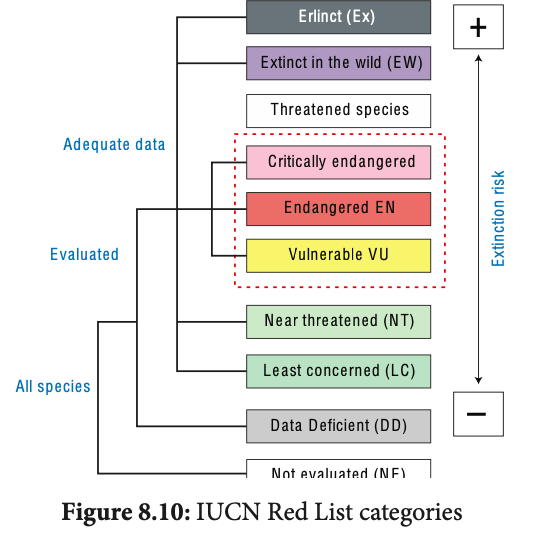
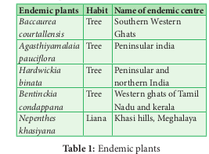
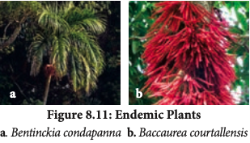

 India due to its topography, geology and climate patterns has diverse life forms. Now this huge diversity is under threat due to many environmental issues for this conservation becomes an important tool by which we can reduce many species getting lost from our native land. By employing conservation management strategies like germplasm conservation, in situ, ex-situ, in-vitro methods, the endemic as well as threatened species can be protected

**In-situ conservation** It means conservation and management of genetic resources in their natural habitats. Here the plant or animal species are protected within the existing habitat. Forest trees, medicinal and aromatic plants under threat are conserved by this method. This is carried out by the

community or by the State conservation which
include wildlife, National park and Biosphere
reserve. The ecologically unique and biodiversity
rich regions are legally protected as wildlife
sanctuaries, National parks and Biosphere
reserves. Megamalai, Sathyamangalam wildlife,
Guindy and Periyar National park, and Western
ghats, Nilgiris, Agasthyamalai and Gulf of
Mannar are the biosphere reserves of Tamil
Nadu.

**Sacred groves** These are the patches or grove of cultivated trees which are community protected and are based on strong religious belief systems which usually have a significant religious connotation for protecting community. Each grove is an abode of a deity mostly village God Or Goddesses like Aiyanar or Amman. 448 grooves were documented throughout Tamil Nadu, of which 6 groves (Banagudi shola, Thirukurungudi and Udaiyankudikadu, Sittannnavasal, Puthupet and Devadanam) were taken up for detailed floristic and faunistic studies. These groves provide a number of ecosystem services to the neighbourhood like protecting watershed, fodder, medicinal plants and micro climate control.

**Ex-situ conservation** It is a method of conservation where species are protected outside their natural environment. This includes establishment of botanical gardens, zoological parks, conservation strategies such as gene, pollen, seed, in-vitro conservation, cryo preservation, seedling, tissue culture and DNA banks. These facilities not only provide housing and care for endangered species, but also have educational and recreational values for the society

### International Union for Conservation of Nature (IUCN)
 Founded in 1948, the International Union for Conservation of Nature (IUCN) is the world’s oldest environmental organisation with its headquarters at Gland, Switzerland. It is a neutral forum for Governments, NGO’s, Scientists, business and local communities with the aim of developing solution and implementing policies related to the conservation of environment and sustainable development.

**IUCN Red List** IUCN Red List categories help us to evaluate the degree of threat and conservation priorities to the flora and fauna It is also a powerful tool for

**Conservation movement** A community level participation can help in preservation and conservation of our environment. Our environment is a common treasure for all the living organisms on earth. Every individual should be aware of this and participate actively in the programs meant for the conservation of the local environment. Indian history has witnessed many people movements for the protection of environment.

**Chipko Movement** 
The tribal women of Himalayas protested against the exploitation of forests in 1972. Later on it transformed into Chipko Movement by Sundarlal Bahuguna in Mandal village of Chamoli district in 1974. People protested by hugging trees together which were felled by a sports goods company. Main features of Chipko movement were,

- This movement remained non political
	
- It was a voluntary movement based on
Gandhian thought.

- It was concerned with the ecological balance
of nature

- Main aim of Chipko movement was to give a
slogan of five F’s – Food, Fodder, Fuel, Fibre
and Fertilizer, to make the communities self
sufficient in all their basic needs.

**Appiko Movement** The famous Chipko Andolen of Uttarakhand in the Himalayas inspired the villagers of Uttara Karnataka to launch a similar movement to save their forests. This movement started in Gubbi Gadde a small village near Sirsi in Karnataka by Panduranga Hegde. This movement started to protest against felling of trees, monoculture, forest policy and deforestation.

persuading governments to protect threatened species and for most of the plant and animal species world-wide. IUCN has developed protected areas and developed criteria for threatened species. The criteria are as follows .

**IUCN Red List categories Extint (EX)** A taxon is Extinct when there is no reasonable doubt on the death of the last individual. A taxon is presumed Extinct when exhaustive surveys in known and/or expected habitat, at appropriate times (diurnal, seasonal, annual), throughout its historic range have failed to record an individual. Example: _Neuracanthus neesianus_.

**Extinct in the wild (EW)** A taxon is Extinct in the Wild when it is known only to survive in cultivation, in captivity or as a naturalised population (or populations) well outside the past range. Example: _Ginkgo biloba_

**Critically endangered (CR)** A taxon is Critically Endangered when the best available evidence indicates that it meets any of the criteria A to E for Critically Endangered, and it is therefore considered to be facing an extremely high risk of extinctions in the wild. Example: _Euphorbia santapaui, Piper barberi, Syzygium gambelianum._

**Endangered (EN)**

A taxon is Endangered when the best available evidence indicates that it meets any of the criteria A to E for Endangered, and it is therefore considered to be facing a very high risk of extinction in the wild. Example: Elaeocarpus venustus, Pogostemon nilagricus, Eugenia singampattiana.

**Vulnerable (VU)**

A taxon is Vulnerable when the best available evidence indicates that it meets any other criteria A to E for Vulnerable, and it is therefore considered to be facing a high risk of extinction in the wild. Example: Dalbergia latifolia, Santalum album, Chloroxylon sweitenia

**Near threatened (NT)**

A taxon is Near Threatened when it has been
evaluated against the criteria but does not
qualify for Critically Endangered, Endangered
or Vulnerable now, but is close to qualifying for
or is likely to qualify for threatened category in
the near future.

**Least concerned (LC)**

A taxon is Least Concerned when it has been
evaluated against the criteria and does not
qualify for Critically Endangered, Endangered,
Vulnerable or Near Threatened, Widespread
and abundant taxa are included in this category.

**Data deficient (DD)**

A taxon is Data Deficient when there is inadequate
information to make a direct, or indirect,
assessment of the risk of extinction based on its
distribution and/or population status.

**Not evaluated (NE)**
A taxon is Not Evaluated when it has not yet
been evaluated against the criteria

### Endemic Centres and Endemic Plants
 Endemic species are plants and animals that exist only in one geographic region. Species can be endemic to large or small areas of the earth. Some are endemic to a particular continent, some to a part of a continent and others to a single island.

Any species found restricted to a specified geographical area is referred to as ENDEMIC.. It may be due to various reasons such as isolation, interspecific interactions, seeds dispersal problems, site specificity and many other environmental and ecological problems. There are 3 Megacentres of endemism and 27 microendemic centres in India. Approximately one third of Indian flora have been identified as endemic and found restricted and distributed in three major phytogeographical regions of india, that is Indian Himalayas, Peninsular India and Andaman nicobar islands. Peninsular India, especially Western Ghats has high concentration of endemic plants. _Hardwickia_ _binata_ and _Bentinckia condapanna_ are good examples for endemic plants. A large percentage of Endemic species are herbs and belong to families such as Poaceae. Apiaceae, Asteraceae and Orchidaceae. 

Majority of endemic species are threatened due to their narrow specific habitat, reduced seed production, low dispersal rate, less viable nature and human intereferences.. Serious efforts need to be undertaken for their conservation, otherwise these species may become globally extinct.

