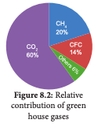
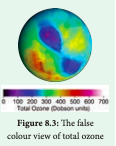

Green House Effect is a process by which radiant heat from the sun is captured by gases in the atmosphere that increase the temperature of the earth ultimately. The gases that capture heat are called **Green House Gases** which include carbon dioxide (CO_2), methane (CH_4), Nitrous Oxide (N_2O) and a variety of manufactured chemicals like chlorofluorocarbon (CFC). Increase in greenhouse gases lead to irreversible changes



in major ecosystems and climate patterns. For example, coral ecosystem is affected by increase in temperature, especially **coral bleaching** observed in Gulf of Mannar, Tamil Nadu. 

**Human activities lead to produce the green house effect by**

- Burning fossil fuels, which releases CO_2 and CH_4

- Way of Agriculture and animal husbandry practices

- Electrical gadgets like refrigerator and air conditioners release chloro fluoro carbons

- The fertilizers used in Agriculture which release N<sub>2</sub>o

- The emissions from automobiles. The increase in mean global temperature (highest in 4000 years) due to increased concentration of green house gases is called **global warming.** One of the reasons for this is over population which creates growing need for food, fibre and fuel and considered to be the major cause of global warming.

```

Clouds and Dust particles can also produce Green House effect. That is why clouds, dusts and humid nights are warmer than clear dust free dry nights.


```

### Effects of Global Warming

- Rise in global temperature which causes sea levels to rise as polar ice caps and glaciers begin to melt causing submergence of many coastal cities in many parts of the world.

- There will be a drastic change in weather patterns bringing more floods or droughts in some areas.

- Biological diversity may get modified, some species ranges get redefined. Tropics and sub-tropics may face the problem of decreased food production.

### Sources of Green House Gases Emission (Natural and Anthropogenic)

**CO_2 (Carbon dioxide)** 

- Coal based power plants, by the burning of fossil fuels for electricity generation. 

- Combustion of fuels in the engines of automobiles, commercial vehicles and air planes contribute the most of global warming.

- Agricultural practices like stubble burning result in emission of CO_2.

- Natural from organic matter, volcanoes, warm oceans and sediments.

**Methane** 

Methane is 20 times as effective as CO_2 at trapping heat in the atomosphere. Its sources are attributed paddy cultivation, cattle rearing, bacteria in water bodies, fossil fuel production, ocean, non-wetland soils and forest / wild fires. 

**N_2O (Nitrous oxide)** 

It is naturally produced in Oceans from biological sources of soil and water due to microbial actions and rainforests. Man-made sources include nylon and nitric acid production, use of fertilizers in agriculture, manures cars with catalytic converter and burning of organic matter.

```

**Global Warming Effects on Plants** 

- Low agricultural productivity in tropics

- Frequent heat waves (Weeds, pests, fungi need warmer temperature)

- Increase of vectors and epidemics 

- Strong storms and intense flood damage

- Water crisis and decreased irrigation 

- Change in flowering seasons and pollinators 

- Change in Species distributional ranges 

- Species extinction

```

### Strategies to deal with Global Warming

- Increasing the vegetation cover, grow more trees 

- Reducing the use of fossil fuels and green house gases

- Developing alternate renewable sources of energy

- Minimising uses of nitrogeneous fertilizers, and aerosols.

###  Ozone depletion

Ozone layer is a region of Earth’s stratosphere that absorbs most of the Sun’s ultra violet radiation. The ozone layer is also called as the ozone shield and it acts as a protective shield, cutting the ultra- violet radiation emitted by the sun.

Just above the atmosphere there are two layers namely troposphere (the lower layer) and stratosphere (the upper layer). The ozone layer of the troposphere is called **bad ozone** and the ozone layer of stratosphere is known as **good ozone** because this layer acts as a shield for absorbing the UV radiations coming from the sun which is harmful for living organisms causing DNA damage. The thickness of the ozone column of air from the ground to the top of the atmosphere is measured in terms of **Dobson Units**.


Ozone is a colourless gas, reacts readily with air pollutants and cause rubber to crack, hurt plant life, damages lung tissues. But ozone absorbs harmful ultra violet β (uv-β) and UV – α radiation from sunlight. What is Dobson Unit? DU is the unit of measurement for total ozone. One DU (0.001 atm. cm) is the number of molecules of ozone that would be required to create a layer of pure ozone 0.01 millimetre thick at a temperature of 0° C and a pressure of 1 atmosphere (atm = the air pressure at the surface of earth). Total ozone layer over the earth surface is 0.3 centrimetres (3 mm) thick and is written as 300 DU. The false colour view of total ozone - The purple and blue colours are where there is the least ozone, and the yellows and reds are where there is more ozone.



The ozone shield is being damaged by chemicals released on the Earth’s surface notably the chlorofluorocarbons widely used in refrigeration, aerosols, chemicals used as cleaners in many industries. The decline in the thickness of the ozone layer over restricted area is called **Ozone hole.**

```

September 16 is WORLD OZONE DAY

```

Ozone depletion in the stratosphere results in more UV radiations especially UV B radiations (shortwaves). UV B radiation destroys biomolecules (skin ageing) and damages living tissues. UV – C is the most damaging type of UV radiation, but it is completely filtered by the atmosphere (ozone layer). UV – a contribute 95% of UV radiation which causes tanning burning of skin and enhancing skin cancer. Hence the uniform ozone layer is critical for the wellbeing of life on earth.

During 1970’s research findings indicated that man-made chlorofluorocarbons (CFC) reduce and convert ozone molecules in the atmosphere. The threats associated with reduced ozone pushed the issue to the forefront of global climate issues and gained promotion through organisation such as World Meterological Organisation and the United Nations. The Vienna Convention was agreed upon at the Vienna conference of 1985 but entered into force in 1988 provided the frameworks necessary to create regulative measures in the form of the Montreal protocol. The International treaty called the **Montreal Protocol** (1987) was held in Canada on **substances that deplete ozone layer** and the main goal of it is gradually eliminating the production and consumption of ozone depleting substances and to limit their damage on the Earth’s ozone layer.

**Clean Development Mechanism** (CDM) is defined in the Kyoto protocol (2007) which provides project based mechanisms with two objectives to prevent dangerous climate change and to reduce green house gas emissions. CDM projects helps the countries to reduce or limit emission and stimulate sustainable development.

An example for CDM project activity, is replacement of conventional electrification projects with solar panels or other energy efficient boilers. Such projects can earn Certified Emission Reduction (CER) with credits / scores, each equivalent to one tonne of CO2, which can be counted towards meeting Kyoto targets.

**Plant indicators** 

The presence or absence of certain plants indicate the state of environment by their response. The plant species or plant community acts as a measure of environmental conditions, it is referred as biological indicators or phytoindicators or plant indicators.
Examples

|    | Plants                                      | Indicator for                                |
|----|---------------------------------------------|----------------------------------------------|
| 1. | Lichens, Ficus, Pinus,   <br>Rose<br>       | SO2 pollution                                |
| 2. | Petunia,<br>Chrysanthemum                   | Nitrate                                      |
| 3. | Gladiolus                                   | Flouride<br>pollution                        |
| 4. | Robinia pseudoacacia<br>(Black locust tree) | Indicator of<br>heavy metal<br>contamination |

### Effects of Ozone depletion

The main ozone depletion effects are: 

- Increases the incidence of cataract, throat and lung irritation and aggravation of asthma or emphysema, skin cancer and diminishing the functioning of immune system in human beings.

- Juvenile mortality of animals. - Increased incidence of mutations.

- In plants, photosynthetic chemicals will be affected and therefore photosynthesis will be inhibited. Decreased photosynthesis will result in increased atmospheric CO_2 resulting in global warming and also shortage of food leading to food crisis.

- Increase in temperature changes the climate and rainfall pattern which may result in flood / drought, sea water rise, imbalance in ecosystems affecting flora and fauna.
