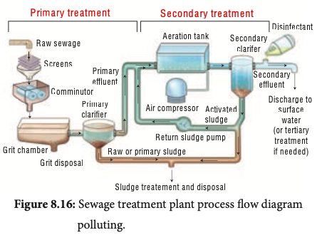
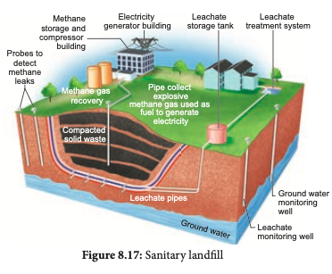

 Sewage disposal treatment helps to transform raw sewage into an easier manageable waste and to retrieve and reuse treated residual sewage materials. Greenhouse gases like carbon-dioxide, methane, nitrous oxide are produced during sewage treatment which apart from causing the impact on the atmosphere, it also affect the urban ecosystem, aquatic ecosystems. By making use of advanced disposal treatment plants, climate change and pollution can be minimised.

 

Sewage is waste matter such as faeces or used dirty water from homes and factories, which flows away through sewers. Sewage treatment is the process of removing contaminants from waste water, primarily from household sewage. Physical, chemical and biological processes are used to remove contaminants and produce treated waste water, that is safer for the environment. Sewage contains large amounts of organic matter and microbes. This cannot be discharged into natural water bodies like rivers and streams directly. Hence sewage is treated in sewage treatment plants (STPs) to make it less polluting. Sewage treatment generally involves three stages, called primary, secondary and tertiary treatment. 

**Solid waste management** 

Solid waste refers to all non liquid wastes which causes health problems and unpleasant living environment leading to pollution. Solid waste management is a term that is used to refer to the process of collecting and treating solid wastes. It is all about how it can be changed and recycled as a valuable resource.

Methods of solid waste management includes Landfill, incineration, recovery, recycling, composting, and pyrolysis.

- T e c h n o l o g i c a l advancement for processing treatment and disposal of solid waste helps in converting it into renewable energy and organic manure. 
- Electronic waste contains toxic materials and are found to be non-biodegradable which causes threat to human health and the smoke during recycling and leaching causes great threat to water bodies. Agricultural landfills method stands a good method to reduce these problems.

**Liquid Waste Management** Liquid waste includes point source and non- point source discharges such as storm water and waste water. Examples of liquid waste include wash water from homes, liquids, used for cleaning in industries and waste detergents.

Grey water is the one from municipal waste which contains harmful pathogens. Water coming from domestic equipments other than toilets (bathtub, showers, sinks, and washing machine) is also referred as grey water. Municipal wastes can be detoxified biologically and then recycled. Domestic waste water can be recycled and used for gardening.
