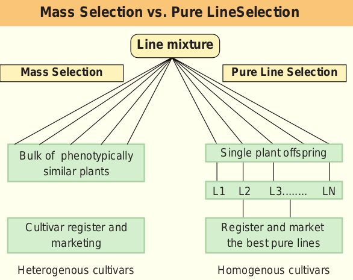
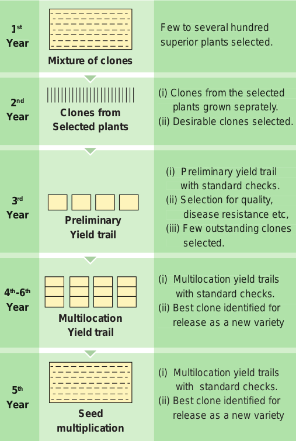
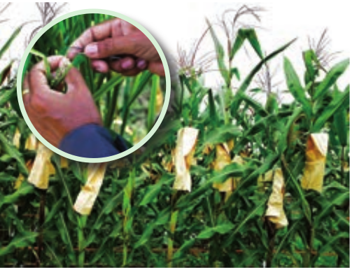

Conventional plant breeding methods resulting in hybrid varieties had a tremendous impact on agricultural productivity over the last decades. It develops new plant varieties by the process of selection and seeks to achieve expression of genetic material which is already present within the species. In this chapter we will discuss about some of the conventional methods of plant breeding.

### Plant Introduction
Plant introduction may be defined as the introduction of genotypes from a place where it is normally grown to a new place or environment. Rice variety of IR8 introduced from Philippines and Wheat varieties of Sonora 63, Sonora 64 from Mexico.

The newly introduced plant has to adapt itself to the new environment. This adjustment or adaptation of the introduced plant in the changed environment is called **acclimatization.** All the introductions must be free from presence of weeds, insects and disease causing organisms. This has to be carefully examined by the process called **quarantine**, a strict isolation imposed to prevent the spread of disease.

Introduction may be classified as Primary introduction and Secondary introduction 

1. **Primary introduction** - When the introduced variety is well adapted to the new environment without any alternation to the original genotype. 

2. **Secondary introduction** - When the introduced variety is subjected to selection to isolate a superior variety and hybridized with a local variety to transfer one or a few characters to them. The botanical gardens in different parts of the world also played a significant role in plant introduction. 
   **Example :** Tea varieties collected from China and North East India initially grown in Botanical Garden of Kolkata from which appropriate clones have selected and introduced to different parts of India. 

### Selection
Selection is the choice of certain individuals from a mixed population for a one or more desirable traits. Selection is the oldest and basic method of plant breeding. There are two main types of Selection.

**i. Natural Selection:**
This is a rule in nature and results in evolution reflected in the Darwinian principle “survival of the fittest”. It takes longer time in bringing about desired variation.

```hint {role="warn"}
National Bureau of plant Genetic Resources (NBPGR) 
The Bureau is responsible for introduction and maintenance of germ plasm of various agricultural and horticultural station in our country. It is also responsible for maintenance of plant materials of botanical and medicinal interest. It is located at Rangpuri, New Delhi and has four regional plant quarantine stations at Amristsar, Kolkata, Mumbai and Chennai at Meenambakkam  
```

**ii. Artificial Selection:** It is a human involved process in having better crop from a mixed population where the individuals differ in character. The following are the three main types of artificial selection.

**a. Mass Selection:** In mass selection a large number of plants of similar phenotype or morphological characters are selected and their seeds are mixed together to constitute a new variety. The population obtained from the selected plants would be more uniform than the original population and are not individually tested. After repeated selection for about five to six years, selected seeds are multiplied and distributed to the farmers. The only disadvantage of mass selection is that it is difficult to distinguish the hereditary variation from environmental variation.



**b. Pureline selection:** Johannsen in 1903 coined the word pureline. It is a collection of plants obtained as a result of repeated self-pollination from a single homozygous individual. Hence, a variety formed by this method shows more homozygosity with respect to all genes. The disadvantage of this type is that the new genotypes are never created and they are less adaptable and less stable to the environmental fluctuations.

**c. Clonal Selection:** In asexually propagated crop, progenies derived from a plant resemble in genetic constitution with the parent plant as they are mitotically divided. Based on their phenotypic appearance, clonal selection is employed to select improved variety from a mixed population (clones). The selected plants are multiplied through vegetative propagation to give rise to a clone. The genotype of a clone remains unchanged for a long period of time.



### Hybridization
Hybridization is the method of producing new crop varieties in which two or more plants of unlike genetically constitution all crossed together that result in a progeny called hybrid. Hybridization offers improvement in crop and is the only effective means of combining together the desirable characters of two or more varieties or species. The first natural hybridization was observed by Cotton Mather in maize.

**Steps in Hybridization** 

Steps involved in hybridization are as follows. 

1. **Selection of Parents:** Male and female plants of the desired characters are selected. It should be tested for their homozygosity.
2. **Emasculation:** It is a process of removal of anthers to prevent self pollination before dehiscence of anther.
3. **Bagging:** The stigma of the flower is protected against any undesirable pollen grains, by covering it with a bag .
4. **Crossing:** Transfer of pollen grains from selected male flower to the stigma of the female emasculated flower.
5. Harvesting seeds and raising plants: The pollination leads to fertilization and finally seed formation takes place. The seeds are grown into new generation which are called hybrids.



**Types of Hybridization** According to the relationship between plants, the hybridization is divided into. 

i. Intravarietal hybridization - The cross between the plants of same variety. Such crosses are useful only in self-pollinated crops.

ii. Intervarietal hybridization - The cross between the plants belonging to two different varieties of the same species and is also known as intraspecific hybridization. This technique has been the basis of improving self-pollinated as well as cross pollinated crops

iii. Interspecific hybridization - The cross between the plants belonging to different species belonging to the same genus is also called intragenic hybridization. It is commonly used for transferring the genes of disease, insect, pest and drought resistance from one species to another. 
**Example:** Gossypium hirsutum x Gossypium arboreum – Deviraj.


**iv. Intergeneric hybridization – The crosses** are made between the plants belonging to two different genera. The disadvantages are hybrid sterility, time consuming and expensive procedure. 
**Example:** _Raphanobrassica, Triticale._ (Refer chapter 4 for detailed illustration)

### Heterosis
Heterosis (hetero- different; sis - condition) G.H. Shull was the first scientist to use the term heterosis in 1912. The superiority of the F1 hybrid in performance over its parents is called heterosis or hybrid vigour. Vigour refers to increase in growth, yield, greater adaptability of resistance to diseases, pest and drought. Vegetative propagation is the best suited measure for maintaining hybrid vigour, since the desired characters are not lost and can persist over a period of time. Many breeders believe that the magnitude of heterosis is directly related to the degree of genetic diversity between the two parents. Depending on the nature, origin, adaptability and reproducing ability heterosis can be classified as: 

**i. Euheterosis-**
This is the true heterosis which is inherited and is further classified as: 

**a. Mutational Euheterosis** - Simplest type of euheterosis and results from the sheltering or eliminating of the deleterious, unfavourable often lethal, recessive, mutant genes by their adaptively superior dominant alleles in cross pollinated crops.

**b. Balanced Euheterosis** – Well balanced gene combination which is more adaptive to environmental conditions and agricultural usefulness.

**ii.Pseudoheterosis** – Also termed as luxuriance. Progeny possess superiority over parents in vegetative growth but not in yield and adaptation, usually sterile or poorly fertile.

### Mutation Breeding
Muller and Stadler (1927- 1928) coined the term mutation breeding. It represents a new method of conventional breeding procedures as they have the advantage of improving the defect without losing agronomic and quality character in agriculture and crop improvement. Mutation means the sudden heritable changes in the genotype or phenotype of an organism. Gene mutations are of considerable importance in plant breeding as they provide essential inputs for evolution as well as for re-combination and selection. It is the only method for improving seedless crops.

Radiation such as UV short wave, X-ray, Alpha (α), Beta (β), Gamma waves and many chemicals such as cesium, EMS (ethyl methane sulfonate), nitromethylurea induce mutation to develop new varieties of crops. 

**Example:** Triple gene dwarf wheat with increase in yield and height. Atomita 2 - rice with salinity tolerance and pest resistance. ### Polyploid Breeding Majority of flowering plants are diploid (2n). The plants which possess more than two sets of chromosome are called polyploids. Polyploidy is a major force in the evolution of both wild and cultivated plants. Polyploidy often exhibits increased hybrid vigour, increased heterozygosity, increase tolerance to both biotic and abiotic stresses, buffering of deleterious mutations. In addition, polyploidy often results in reduced fertility due to meiotic error allowing the production of seedless varieties. When chromosome number is doubled by itself in the same plant, is called autopolyploidy. Example: A triploid condition in sugarbeets, apples and pear has resulted in the increase in vigour and fruit size, large root size, large leaves, flower, more seeds and sugar content in them. It also resulted in seedless tomato, apple, watermelon and orange. Polyploidy can be induced by the use of colchicine to double the chromosome number. Allopolyploids are produced by multiplication of chromosome sets that are initially derived from two different species. Example: _Triticale (Triticum durum x secale cereale) Raphanobrassica (Brassica oleraceae x Raphanus sativus)_.

### Green Revolution
Green revolution the term was coined by William

**Gamma Garden or Atomic Garden**: 
Is a form of mutation breeding where plants are exposed to radioactive sources typically cobalt-60 or caesium-137 in order to generate desirable mutation in crop plants. The first Gamma garden in India is Bose Research Institute at Calcutta in 1959 and the second is IARI in 1960 which produced large variation in short type.
  
S.Gaud in (1968). It is defined as the cumulative result of a series of research, development, innovation and technology transfer initiatives. Agricultural production (especially wheat and rice) manifolds worldwide particularly in the developing countries between the 1940’s and the late 1960’s.

The Green revolution or third Agricultural Revolution is the intensive plan of 1960’s to increase crop yield in developing countries by introducing the high yielding, resistant varieties, increased irrigation facilities, fertilizer application and better agricultural management.

In 1963 semi-dwarf wheat of Mexico was introduced from which India got five prolonged strategies for breeding a wide range of high varieties like Sonora 64, Sonalika and Kalyansona possessing a broad spectrum of resistance to major biotic and abiotic condition. Same as wheat M.S.Swaminathan produced the first semi-dwarf fertiliser responsive hybrid variety of rice TNI (Taichung Native-1) in 1956 from Taiwan. The derivatives were introduced in 1966. Later better yielding semi dwarf varieties of rice Jaya and Ratna developed in India.

```hint {role="warn"}
NORIN 10 – The cultivars found that Norin 10 dwarfing genes have high photosynthetic rate per unit leaf area and increase respiratory activity. Gonjiro Inazuka selected the semi-dwarf wheat variety that became Norin 10. He would have never thought that the semi dwarf genes would not only revolutionize the world of wheat but also helped to save more than one billion lives from hunger and starvation.
```

**Plant Breeding for Developing Resistance to diseases**

Some crop varieties bred by hybridization and selection, for disease resistance to fungi, bacteria and viral diseases are released (Table 9.1).  

| Crop | Variety | Resistance to diseases |
|------|------|------|
| Wheat | Himgiri | Leaf and Stripe rust, hill bunt |
| Brassica | Pusa swarnim ( Kara rai) | White rust |
|   Cauliflower |Pusa Shubhra,Pusa snowball K-1 | Black rot and curl blight black rot |
| Cowpea | Pusa Komal | Bacterial blight |
| Chilli | Pusa Sadabahar | Chilly mosaic virus, Tobacco mosaic virus and Leaf curl. |


**Plant Breeding for Developing Resistance to Insect Pests**

Insect resistance in host crop plants may be due to morphological, biochemical or physiological characteristics. Hairy leaves in several plants are associated with resistance to insect pests. Example: resistance to jassids in cotton and cereal leaf beetle in wheat. In wheat, solid stems lead to non-preference by the stem sawfly and smooth leaves and nectar-less cotton varieties do not attract bollworms. High aspartic acid, low nitrogen and sugar content in maize leads to resistance to maize stem borers.


| Crop |Variety |Insect pests |
|------|------|------|
| Brassica (rapeseed mustard) | Pusa Gaurav | Aphids |
| Flat been | Pusa Sem 2 Pusa Sem 3 | Jassids, aphids and fruit borer |
| Okra (Bhindi) |Pusa Sawani Pusa A-4 | Shoot and Fruit borer |

  
```hint {role="warn"}
**Norman E. Borlaug: The plant pathologist** plant breeder devoted his life at the International Maize and Wheat improvement centre at Sonord in Mexico. He developed a new high yielding, rust resistant, non-lodging dwarf wheat varieties like Norin-10, Sonora-64, Lerma rojo-64, etc. which are now being cultivated in many countries. This formed the base for ‘green revolution’. He was awarded a Nobel prize for Peace in 1970.

**Dr. M. S. Swaminathan:** He is a pioneer mutation breeder. He has produced Sharbati Sonora, is the amber grain coloured variety of wheat by mutation, which is responsible for green revolution in India. Dr. Swaminathan is called “Father of green revolution in India”.

**Nel Jayaraman:** Mr. Jayaraman, hails from Adirangam village in Tiruvarur district. He was a disciple of Dr.Nammalvar and state co- ordinator of ‘Save our rice campaign, Tamil Nadu. He strived hard for conservation of traditional rice varieties. He had trained a team of farmers and regularly update them on the current issues that affect them.
In 2005, he organized a first ever traditional paddy seed festival in his farm as an individual. The seed festival in May 2016 at Adhirangam was 10th in a row and in which 156 different traditional varieties were distributed to more than 7000 farmers across Tamil Nadu. He was invited by the Philippines Government to give a talk at the International Rice Research Institute (IRRI) on his work and mission. In 2011, he received the State Award for best organic farmer for his contribution to organic farming, and in the year 2015, he received the National Award for best Genome Savior.  
```
