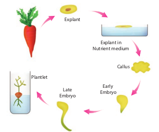

Basic concepts of plant tissue culture are totipotency, differentiation, dedifferentiation and redifferentiation.

### Totipotency 
The property of live plant cells that they have the genetic potential when cultured in nutrient medium to give rise to a complete individual plant.

### Differentiation 
The process of biochemical and structural changes by which cells become specialized in form and function.

**Redifferentiation** 
The further differentiation of already differentiated cell into another type of cell. For example, when the component cells of callus have the ability to form a whole plant in a nutrient medium, the phenomenon is called redifferentiation.

**Dedifferentiation** 
The phenomenon of the reversion of mature cells to the meristematic state leading to the formation of callus is called dedifferentiation. These two phenomena of redifferentiation and dedifferentiation are the inherent capacities of living plant cells or tissue. This is described as totipotency.
