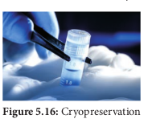

### Germplasm Conservation
Germplasm conservation refers to the conservation of living genetic resources like pollen, seeds or tissue of plant material maintained for the purpose of selective plant breeding, preservation in live condition and used for many research works.

Germplasm conservation resources is a part of collection of seeds and pollen that are stored in seed or pollen banks, so as to maintain their viability and fertility for any later use such as hybridization and crop improvement. Germplasm conservation may also involve a gene bank, DNA bank of elite breeding lines of plant resources for the maintenance of biological diversity and also for food security.

### Cryopreservation (–195.C)

Cryopreservation, also known as Cryo-conservation, is a process by which protoplasts, cells, tissues, organelles, organs, extracellular matrix, enzymes or any other biological materials are subjected to preservation by cooling to very low temperature of –196°C using liquid nitrogen. At this extreme low temperature any enzymatic or chemical activity of the biological material will be totally stopped and this leads to preservation of material in dormant status. Later these materials can be activated by bringing to room temperature slowly for any experimental work.

Protective agents like dimethyl sulphoxide, glycerol or sucrose are added before cryopreservation process. These protective agents are called cryoprotectants, since they protect the cells, or tissues from the stress of freezing temperature.
