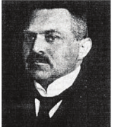

  

```hint { role ="info" }
hint { role="info" }
**Learning Objectives**

- The learner will be able to Apply the knowledge of traditional

and modern biotechnology in day to day life.

- Appreciate the uses of fermentation process.

- Acquire the knowledge on the process of genetic engineering

- Analyse the uses and limitations of genetically modified plants

- Cognize the terms of bio prospecting and bio piracy.
```

Biotechnology is the science of applied biological processes. In other words it is science of development and utilization of biological processes, forms and systems for the benefit of mankind and other life forms. The term biotechnology was coined by Karl Ereky, a Hungarian Engineer in 1919 and has been extended to include any process in which organisms, tissues, cells, organelles or isolated molecules such as enzymes are used to convert biological or other raw materials to products of greater value.


