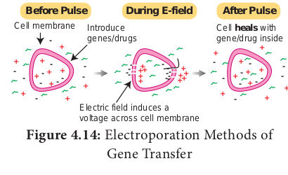
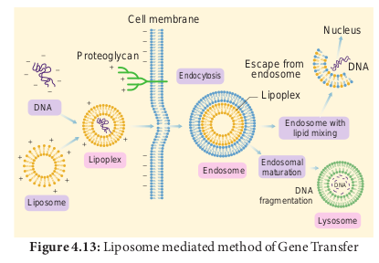
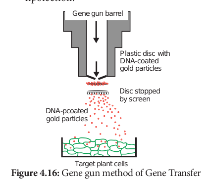
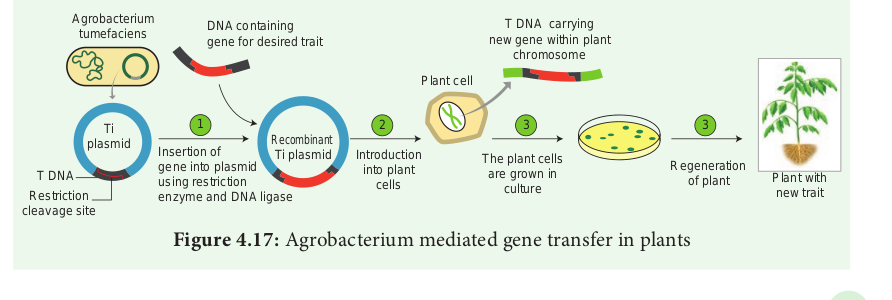

Methods of Gene Transfer

The next step after a recombinant DNA molecule has been generated is to introduce it into a suitable host cell. There are many methods to introduce recombinant vectors and these are dependent on several factors such as the vector type and host cell.

For achieving genetic transformation in plants, the basic pre-requisite is the construction of a vector which carries the gene of interest flanked by the necessary controlling sequences, i.e., the promoter and terminator, and deliver the genes into the host plant. There are two kinds of gene transfer methods in plants. It includes: 
-  Direct or vectorless gene transfer 
-  Indirect or vector – mediated gene transfer

### Direct or Vectorless Gene Transfer

In the direct gene transfer methods, the foreign gene of interest is delivered into the host plant without the help of a vector. The following are some of the common methods of direct gene transfer in plants. a. 
 
#### Chemical mediated gene transfer:

Certain chemicals like polyethylene glycol plant genome, upon infection of cells at the wound site, it is also known as the natural genetic engineer of plants.

#### b. Microinjection: 

The DNA is directly injected into the nucleus using fine tipped glass needle or micro pipette to transform plant cells. The protoplasts are immobilised on a solid support (agarose on a microscopic slide) or held with a holding pipette under suction.

#### c.Electroporation Methods of Gene Transfer: 
A pulse of high voltage is applied to protoplasts, cells or tissues which makes transient pores in the plasma membrane through which uptake of foreign DNA occurs.

#### d.Liposome mediated method of Gene Transfer:

Liposomes the artificial phospholipid vesicles are useful in gene transfer. The gene or DNA is transferred from liposome into vacuole of plant cells. It is carried out by encapsulated DNA into the vacuole. This technique is advantageous because the liposome protects the introduced DNA from being damaged by the acidic pH and protease enzymes present in the vacuole. Liposome and tonoplast of vacuole fusion resulted in gene transfer. This process is called lipofection.

e. **Biolistics:** The foreign DNA is coated onto the surface of minute gold or tungsten particles (1-3 µm) and bombarded onto the target tissue or cells using a particle gun (also called as **gene gun/micro projectile gun/shotgun**). Then the bombarded cells or tissues are cultured on selected medium to regenerate plants from the transformed cells.(Figure 4.16)

### Indirect or Vector-Mediated Gene Transfer

Gene transfer is mediated with the help of a plasmid vector is known as indirect or vector mediated gene transfer. Among the various vectors used for plant transformation, the Ti-plasmid from _Agrobacterium tumefaciens_ has been used extensively. This bacterium has a large size plasmid, known as Ti plasmid (Tumor inducing) and a portion of it referred as T-DNA (transfer DNA) is transferred to plant genome in the infected cells and cause plant tumors (crown gall). Since this bacterium has the natural ability to transfer T-DNA region of its plasmid into
plant genome, upon infection of cells at the wound site, it is also known as the natural genetic engineer of plants.

The foreign gene (e.g. Bt gene for insect resistance) and plant selection marker gene, usually an antibiotic gene like npt II which confers resistance to antibiotic kanamycin are cloned in the T DNA region of Ti-plasmid in place of unwanted DNA sequences.(Figure 4.17)

