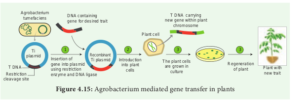
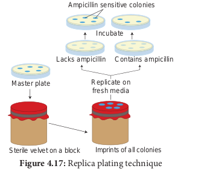
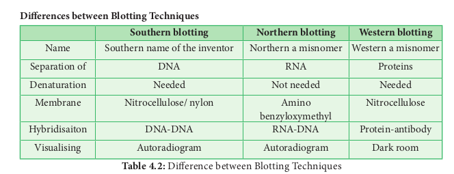

Screening for Recombinants


After the introduction of r-DNA into a suitable host cell, it is essential to identify those cells which have received the r-DNA molecule. This process is called screening. The vector or foreign DNA present in recombinant cells expresses the characters, while the non-recombinants do not express the characters or traits. For this some of the methods are used and one such method is Blue-White Colony Selection method.



### Insertional Inactivation - Blue- White Colony Selection Method
It is a powerful method used for screening of recombinant plasmid. In this method, a reporter gene **lacZ** is inserted in the vector. The lacZ encodes the enzyme β-galactosidase and contains several recognition sites for restriction enzyme.

β-galactosidase breaks a synthetic substrate called X-gal (5-bromo-4-chloro-indolyl-β- D-galacto-pyranoside) into an insoluble blue coloured product. If a foreign gene is inserted into lacZ, this gene will be inactivated. Therefore, no-blue colour will develop (white) because β-galactosidase is not synthesized due to inactivation of lacZ. Therefore, the host cell containing r-DNA form white coloured colonies on the medium contain X-gal, whereas the other cells containing non-recombinant DNA will develop the blue coloured colonies. On the basis of colony colour, the recombinants can be selected.

### Antibiotic resistant markers

An antibiotic resistance marker is a gene that produces a protein that provides cells with resistance to an antibiotic. Bacteria with transformed DNA can be identified by growing on a medium containing an antibiotic. Recombinants will grow on these media as they contain genes encoding resistance to antibiotics such as ampicillin, chloro amphenicol, tetracycline or kanamycin, etc., while others may not be able to grow in these media, hence it is considered useful selectable marker.


#### Replica plating technique

A technique in which the pattern of colonies growing on a culture plate is copied. A sterile filter plate is pressed against the culture plate and then lifted. Then the filter is pressed against a second sterile culture plate. This results in the new plate being infected with cell in the same relative positions as the colonies in the original plate. Usually, the medium used in the second plate will differ from that used in the first. It may include an antibiotic or exclude a growth factor. In this way, transformed cells can be selected. 

### Molecular Techniques - Isolation of Genetic Material and Gel Electrophoresis

Electrophoresis is a separating technique used to separate different biomolecules with positive and negative charges. **Principle** By applying electricity (DC) the molecules migrate according to the type of charges they have. The electrical charges on different molecules are variable.

### Principle

By applying electricity (DC) the molecules
migrate according to the type of charges
they have. The electrical charges on different
molecules are variable.

#### Agarose GEL Electrophoresis

It is used mainly for the purification of specific
DNA fragments. Agarose is convenient for
separating DNA fragments ranging in size
from a few hundred to about 20000 base
pairs. Polyacrylamide is preferred for the
purification of smaller DNA fragments. The gel
is complex network of polymeric molecules.




DNA molecule is negatively charged molecule
- under an electric field DNA molecule
migrates through the gel. The electrophoresis
is frequently performed with marker DNA
fragments of known size which allow accurate
size determination of an unknown DNA
molecule by interpolation. The advantages of
agarose gel electrophoresis are that the DNA
bands can be readily detected at high sensitivity.
The bands of DNA in the gel are stained with
the dye Ethidium Bromide and DNA can be
detected as visible fluorescence illuminated in
UV light will give orange fluorescence, which
can be photographed


### Nucleic Acid Hybridization - Blotting Techniques
Blotting techniques are widely used analytical tools for the specific identification of desired DNA or RNA fragments from larger number of molecules. Blotting refers to the process of immobilization of sample nucleic acids or solid support (nitrocellulose or nylon membranes.) The blotted nucleic acids are then used as target in the hybridization experiments for their specific detection.

#### Types of Blotting Techniques 

##### Southern Blotting: 
The transfer of DNA from** agarose gels to nitrocellulose membrane. 

##### Northern Blotting: 
The transfer of RNA to** nitrocellulose membrane. 

##### Western Blotting: 
Electrophoretic transfer of Proteins to nitrocellulose membrane.

Agricultural diagnostics refers to a variety of tests
that are used for detection of pathogens in plant
tissues. Two of the most efficient methods are

##### 1. ELISA (Enzyme Linked Immumo Sorbent Assay)

Elisa is a diagnostic tool for identification of
pathogen species by using antibodies and
diagnostic agents. Use of ELISA in plant pathology
especially for weeding out virus infected plants
from large scale planting is well known.

##### 2. DNA Probes

DNA Probes, isotopic and non-isotopic (Northern
and Southern blotting) are popular tools for
identification of viruses and other pathogens

**Southern Blotting Techniques - DNA** The transfer of denatured DNA from Agarose gel to Nitrocellulose Blotting or Filter Paper technique was introduced by Southern in 1975 and this technique is called Southern Blotting Technique. 

**Steps** The transfer of DNA from agarose gel to nitrocellulose filter paper is achieved by Capillary Action.

A buffer Sodium Saline Citrate (SSC) is used, in which DNA is highly soluble, it can be drawn up through the gel into the Nitrocellulose membrane.

By this process ss-DNA becomes ‘**Trapped**’ in the membrane matrix.

This DNA is hybridized with a nucleic acid and can be detected by autoradiography.

Autoradiography - A technique that captures the image formed in a photographic emulsion due to emission of light or radioactivity from a labelled component placed together with unexposed film.


**Northern Blot** It was found that RNA is not binding to cellulose nitrate. Therefore, Alwin et al. (1979) devised a procedure in which RNA bands are transferred from the agarose gel into nitrocellulose filter paper. This transfer of RNA from gel to special filter paper is called Northern Blot hybridization. The filter paper used for Northern blot is Amino Benzyloxymethyl Paper which can be prepared from Whatman 540 paper.

**Western Blot** Refers to the electrophoretic transfer of proteins to blotting papers. Nitrocellulose filter paper can be used for western blot technique. A particular protein is then identified by probing the blot with a radio-labelled antibody which binds on the specific protein to which the antibody was prepared.


### Bioassay for Target Gene Effect

Target gene is target DNA, foreign DNA, passenger DNA, exogenous DNA, gene of interest or insert DNA that is to be either cloned or specifically mutated. Gene targeting experiments have been targeting the nuclei and this leads to ‘gene knock-out’. For this purpose, two types of targeting vectors are used. They are insertion vectors and replacement or transplacement vectors. 
 
1. Insertion vectors are entirely inserted into targeted locus as the vectors are linearized within the homology region. Initially, these vectors are circular but during insertion, become linear. It leads to duplication of sequences adjacent to selectable markers.

2. The replacement vector has the homology region and it is co-linear with target. This vector is linearized prior to transfection outside the homology region and then consequently a crossing over occurs to replace the endogenous DNA with the incoming DNA.



**Transfection**: Introduction of foreign nucleic acids into cells by non-viral methods.

###  Genome Sequencing and Plant Genome Projects

The whole complement of gene that determine all characteristic of an organism is called genome. The genome may be nuclear genome, mitochondrial genome or plastid genome. Genome of many plants contain both functional and non-expressive DNA proteins. Genome project refers to a project in which the whole genome of plant is analysed using sequence analysis and sequence homology with other plants. Such genome projects have so far been undertaken in _Chlamydomonas_(algae), _Arabidopsis thaliana_, rice and maize plants. Genome content of an organism is expressed in terms of number of base pairs or in terms of the content of DNA which is expressed as c-value.

### Evolutionary pattern assessed using DNA.
In recent years the evolutionary relationship between different plant taxa is assessed using DNA content as well as the similarities and differences in the DNA sequence (sequence homology). Based on such analysis the taxa and their relationship are indicated in a cladogram which will show the genetic distance between two taxa. It also shows antiquity or modernity of any taxon with respect to one another (See also Unit-2, Chapter-5 of XI Std.) 

```hint { role ="info" }
**Do You Know??**

Barcode: You might have seen in all books barcoding and also in items you buy in supermarket. This will reveal the identity of the book or item as well the details like prize. Similarily, Barcode in genetic term refer to the identify of the taxon based on its genetic makeup. In practice, it is an optical, machine- readable representation of data which describes about the characters of any plants or any objects.


```
### Genome editing and CRISPR - Cas9 
Genome editing or gene editing is a group of technologies that has the ability to change an organism’s DNA. These technologies allow genetic material to be added, removed, or altered at particular locations in the genome. Several approaches to genome editing have been developed. A recent one is known as CRISPR-Cas9, which is short form of Clustered Regularly Interspaced Short Palindromic Repeats and CRISPR-associated protein 9. The CRISPR-Cas9 system has generated a lot of excitement in the scientific community because it is faster, cheaper, more accurate, and more efficient than other existing genome editing methods.

Rice, was among the first plants to be used to demonstrate the feasibility of CRISPR- mediated targeted mutagenesis and gene replacement. The gene editing tool CRISPR can be used to make hybrid rice plants that can clone their seed. Imtiyaz Khand and Venkatesan Sundaresan and colleagues reported in a new study which clearly shows one can re-engineer rice to switch it from a sexual to an asexual mode.

### RNA Interference (RNAi)

All characters of organism are the result of expression of different genes which are regions of nuclear DNA. This expression involves transcription and translation. Transcription refers to the copying of genetic information from one strand of the DNA (called sense strand) by RNA. This RNA, as soon as it formed cannot be straight away sent to the cytoplasm to undertake the process of translation. It has to be edited and made suitable for translation which brings about protein synthesis. One of the main items removed from the RNA strand are the introns. All these changes before translation normally take place whereby certain regions of DNA are silence. However, there is an (RNAi) pathway. RNA interference is a biological process in which RNA molecules inhibit gene expression or translation. This is done by neutralising targetd mRNA molecules.

A simplified model for the RNAi pathway is based on two steps, each involving ribonuclease enzyme. In the first step, the trigger RNA (either dsRNA or miRNA primary transcript) is processed into a short interfering RNA (siRNA) by the RNase II enzymes called Dicer and Drosha. In the second step, siRNAs are loaded into the effector complex RNA-induced silencing complex (RISC). The siRNA is unwound during RISC assembly and the single-stranded RNA hybridizes with mRNA target. This RNAi is seen in plant feeding nematodes.

