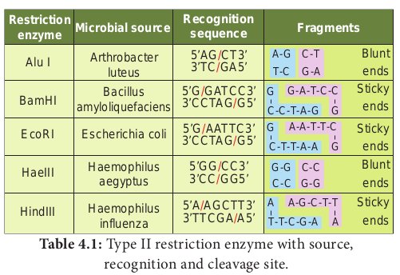
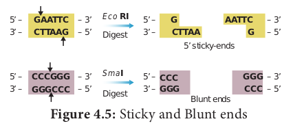
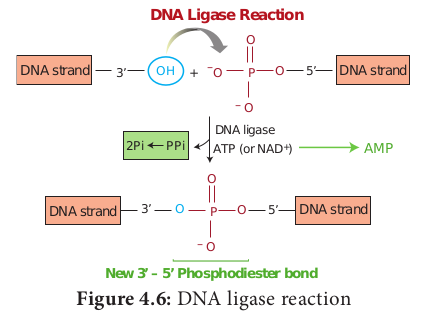
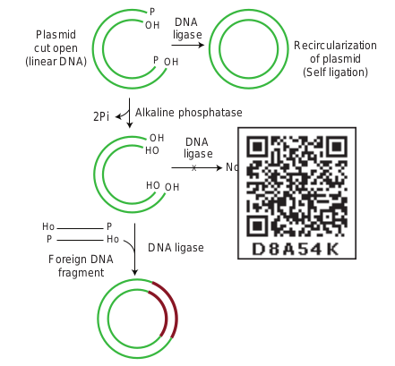
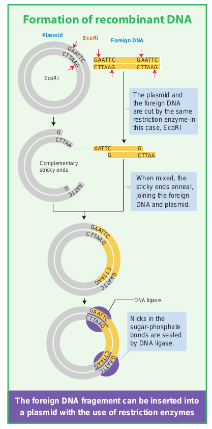
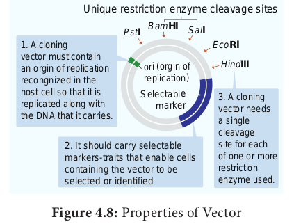
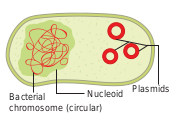
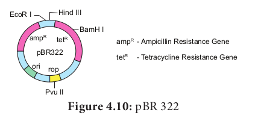
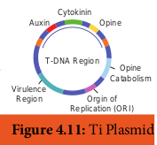
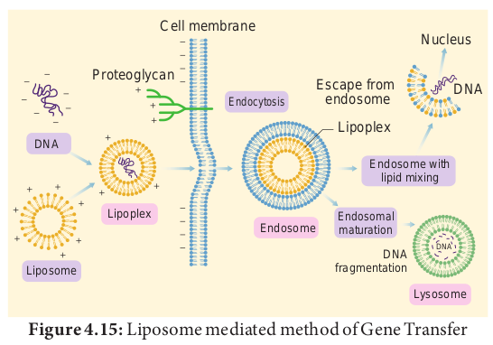

In order to generate recombinant DNA molecule, certain basic tools are necessary. The basic tools are enzymes, vectors and host organisms. The most important enzymes required for genetic engineering are the restriction enzymes, DNA ligase and alkaline phosphatase.
 
### 4.4.1 Restriction Enzymes
The two enzymes responsible for restricting the growth of bacteriophage in Escherichia coli were isolated in the year 1963. One was the enzyme which added methyl groups to DNA, while the other cut DNA. The latter was called restriction endonuclease. A **restriction** enzyme or **restriction endonuclease** is an enzyme that cleaves DNA into fragments at or near specific recognition sites within the molecule known as **restriction** sites. Based on their mode of action restriction enzymes are classified into Exonucleases and Endonucleases. 

a. Exonucleases are enzymes which remove nucleotides one at a time from the end of a DNA molecule. e.g. Bal 31, Exonuclease III.

b. Endonucleases are enzymes which break the internal phosphodiester bonds within a DNA molecule. e.g. Hind II, EcoRI, Pvul, BamHI, TaqI.

**Restriction endonucleases: Molecular scissors** 

The restriction enzymes are called as molecular scissors. These act as foundation of recombinant DNA technology. These enzymes exist in many bacteria where they function as a part of their defence mechanism called restriction- modification system.

There are three main classes of restriction endonucleases : Type I, Type II and Type III, which differ slightly by their mode of action. Only type II enzyme is preferred for use in recombinant DNA technology as they recognise and cut DNA within a specific sequence typically consisting of 4-8 bp. Examples of certain enzymes are given in table 5.1.

The restriction enzyme **Hind II**always cut DNA molecules at a point of recognising a specific sequence of six base pairs. This sequence is known as recognition sequence. Today more than 900 restriction enzymes have been isolated from over 230 strains of bacteria with different recognition sequences.

This sequence is referred to as a restriction site and is generally –palindromic which means that the sequence in both DNA strands at this site read same in 5’ – 3’ direction and in the 3’-5’ direction

Example: MALAYALAM: This phrase is read the same in either of the directions.

**Palindromic repeats**: A symmetrical repeated sequence in DNA strands 
5’ ... CATTATATAATG ... 3’ 
3’ ... GTAATATATTAC ... 5’ 
Note: That the sequence of the base pairs in the reverse direction when compare to the first sequence.

Restriction endonucleases are named by a standard procedure. The first letter of the enzymes indicates the genus name, followed by the first two letters of the species, then comes the strain of the organism and finally a roman numeral indicating the order of discovery. For example, **_EcoRI_** is from Escherichia (**E**) coli (**co)**, strain RY 13 (R) and first endonuclease (I) to be discovered.

The exact kind of cleavage produced by a restriction enzyme is important in the design of a gene cloning experiment. Some cleave both strands of DNA through the centre resulting in blunt or flush end. These are known as symmetric cuts. Some enzymes cut in a way producing protruding and recessed ends known as **sticky** or **cohesive** **end**. Such cut are called staggered or asymmetric cuts.

Two other enzymes that play an important role in recombinant DNA technology are DNA ligase and alkaline phosphatase

### DNA Ligase
 DNA ligase enzyme joins the sugar and phosphate molecules of double stranded DNA (dsDNA) with 5’-PO4 and a 3’-OH in an Adenosine Triphosphate (ATP) dependent reaction. This is isolated from T4 phage.

### Alkaline Phosphatase
 It is a DNA modifying enzyme and adds or removes specific phosphate group at 5’ terminus of double stranded DNA (dsDNA) or single stranded DNA (ssDNA) or RNA. Thus it prevents self ligation. This enzyme is purified from bacteria and calf intestine.

### Vectors

Another major component of a gene cloning experiment is a vector such as a plasmid. A Vector is a small DNA molecule capable of self-replication and is used as a carrier and transporter of DNA fragment which is inserted into it for cloning experiments. Vector is also called **cloning vehicle** or **cloning DNA**. Vectors are of two types: i) Cloning Vector, and ii) Expression Vector. Cloning vector is used for the cloning of DNA insert inside the suitable host cell. Expression vector is used to express the DNA insert for producing specific protein inside the host.
 
#### Properties of Vectors** 
Vectors are able to replicate autonomously to produce multiple copies of them along with their DNA insert in the host cell. 
-  It should be small in size and of low molecular weight, less than 10 Kb (kilo base pair) in size so that entry/transfer into host cell is easy.
- Vector must contain an origin of replication so that it can independetly replicate within the host.
- It should contain a suitable marker such as antibiotic resistance, to permit its detection in transformed host cell.
- Vector should have unique target sites for integration with DNA insert and should have the ability to integrate with DNA insert it carries into the genome of the host cell. Most of the commonly used cloning vectors have more than one restriction site. These are Multiple Cloning Site (MCS) or polylinker. Presence of MCS facilitates the use of restriction enzyme of choice.

The following are the features that are required to facilitate cloning into a vector. 

1. Origin of replication (ori): This is a sequence from where replication starts and piece of DNA when linked to this sequence can be made to replicate within the host cells.

#### 2.Selectable marker: 

In addition to **ori** the vector requires a selectable marker, which helps in identifying and eliminating non transformants and selectively permitting the growth of the transformants.

#### 3.Cloning sites: 
In order to link the alien DNA, the vector needs to have very few, preferably single, recognition sites for the commonly used restriction enzymes.

#### Types of vector 
Few types of vectors are discussed in detail below:

##### Plasmid 
Plasmids are extra c h r o m o s o m a l , self replicating ds circular DNA molecules, found in the bacterial cells in addition to the bacterial chromosome. Plasmids contain Genetic information for their own replication.

##### pBR 322 Plasmid
pBR 322 plasmid is a reconstructed plasmid and most widely used as cloning vector; it contains 4361 base pairs. In pBR, **_p_** denotes plasmid, **_B_**and **_R_** respectively the names of scientist **B**oliver and **R**odriguez who developed this plasmid. The number 322 is the number of plasmid developed from their laboratory. It contains ampR and tetR two different antibiotic resistance genes and recognition sites for several restriction enzymes. (_Hind III, EcoRI, BamH I, Sal I, Pvu II, Pst I, Cla I_), ori and antibiotic resistance genes. Rop codes for the proteins involved in the replication of the plasmid.

**Ti Plasmid** 

Ti plasmid is found in _Agrobacterium tumefaciens,_ a bacterium responsible for inducing tumours in several dicot plants. The plasmid carries transfer (tra) gene which help to transfer T- DNA from one bacterium to other bacterial or plant cell. It has Onc gene for oncogenecity, ori gene for origin for replication and inc gene for incompatibility. T-DNA of Ti-Plasmid is stably integrated with plant DNA. Agrobacterium plasmids have been used for introduction of genes of desirable traits into plants. 

### 4.4.5 Competent Host (For Transformation with Recombinant DNA)

The propagation of the recombinant DNA molecules must occur inside a living system or host. Many types of host cells are available for gene cloning which includes _E.coli,_ yeast, animal or plant cells. The type of host cell depends upon the cloning experiment. _E.coli_ is the most widely used organism as its genetic make-up has been extensively studied, it is easy to handle and grow, can accept a range of vectors and has also been studied for safety. One more important feature of _E.coli_ to be preferred as a host cell is that under optimal growing conditions the cells divide every 20 minutes.

Since the DNA is a hydrophilic molecule,it cannot pass through cell membranes, In order to force bac teria to take up the plasmid, the bacterial cells must first be made competent to take up DNA. This is done by treating them with a specific concentration of a divalent cation such as calcium. Recombinant DNA can then be forced into such cells by incubating the cells with recombinant DNA on ice, followed by placing them briefly at 420C (heatshock) and then putting them back on ice. This enables bacteria to take up the Recombinant DNA.

For the expression of eukaryotic proteins, eukaryotic cells are preferred because to produce a functionally active protein it should fold properly and post translational modifications should also occur, which is not possible by prokaryotic cell _(E.coli)_.
