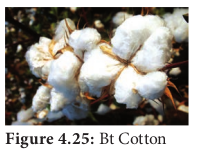
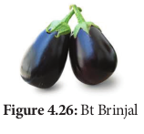
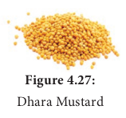
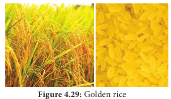
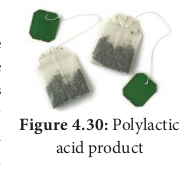
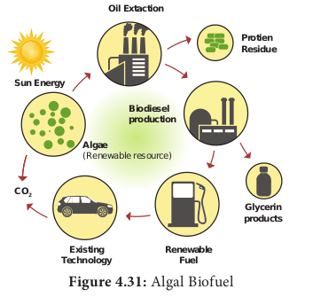
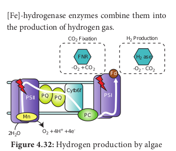

### Herbicide Tolerant – Glyphosate

 Weeds are a constant problem in crop fields. Weeds not only compete with crops for sunlight, water, nutrients and space but also acts as a carrier for insects and diseases. If left uncontrolled, weeds can reduce crop yields significantly.

**Transgenic plants** contain a novel DNA introduced into the genome.

**Glyphosate herbicide** produced by Monsanto, USA company under the trade name ‘Round up’ kills plants by blocking the 5-enopyruvate shikimate-3 phosphate synthase (EPSPS) enzyme, an enzyme involved in the biosynthesis of aromatic amino acids, vitamins and many secondary plant metabolites. There are several ways by which crops can be modified to be glyphosate-tolerant.

One strategy is to incorporate a soil bacterium gene that produces a glyphosate tolerant form of EPSPS. Another way is to incorporate a different soil bacterium gene that produces a glyphosate degrading enzyme.

**Advantages of Herbicide Tolerant Crops** 
-  Weed control improves higher crop yields; -  Reduces spray of herbicide; 
-  Reduces competition between crop plant and weed; 
-  Use of low toxicity compounds which do not remain active in the soil; and 
-  The ability to conserve soil structure and microbes.

##  Herbicide Tolerant - Basta
Trade name ‘Basta’ refers to a non-selective herbicide containing the chemical compound phosphinothricin. Basta herbicide tolerant gene PPT (L-phosphinothricin) was isolated from Medicago sativa plant. It inhibits the enzyme glutamine synthase which is involved in ammonia assimilation. The PPT gene was introduced into tobacco and transgenic tobacco produced was resistant to PPT. Similar enzyme was also isolated from Streptomyces hygroscopicus with bar gene encodes for PAT (Phosphinothricin acetyl transferase) and was introduced into crop plants like potato and sugar-beet and transgenic crops have been developed

### Insect resistance - Bt Crops:
**i. Bt Cotton**

Bt cotton is a genetically modified organism (GMO) or genetically modified pest resistant plant cotton variety, which produces an insecticide activity to bollworm. Strains of the bacterium Bacillus thuringiensis produce over 200 different Bt toxins, each harmful to different insects. Most Bt toxins are insecticidal to the larvae of moths and butterflies, beetles, cotton bollworms and gatflies but are harmless to other forms of life.

The genes are encoded for toxic crystals in the Cry group of endotoxin. When insects attack and eat the cotton plant the Cry toxins are dissolved in the insect’s stomach.

The epithelial membranes of the gut block certain vital nutrients thereby sufficient regulation of potassium ions are lost in the insects and results in the death of epithelial cells in the intestine membrane which leads to the death of the larvae.

**Advantages**

The advantages of
Bt cotton are:

- Yield of cotton is increased Figure 4.22: Bt Cotton due to effective control of bollworms.

- Reduction in insecticide use in the cultivation of Bt cotton

- Potential reduction in the cost of cultivation.

**Disadvantages**

Bt cotton has some limitations:

- Cost of Bt cotton seed is high.
- Effectiveness up to 120 days after that efficiency is reduced

- Ineffective against sucking pests like jassids, aphids and whitefly.

- Affects pollinating insects and thus yield.

**Disadvantages**

**ii. Bt Brinjal** The Bt brinjal is another transgenic plant created by inserting a crystal protein gene (Cry1Ac) from the soil bacterium _Bacillus thuringiensis_ into the genome of various brinjal cultivars. The insertion of the gene, along with other genetic elements such as promoters, terminators and an antibiotic resistance marker gene into the brinjal plant is accomplished using _Agrobacterium_\- mediated genetic transformation. The Bt brinjal has been developed to give resistance against _Lepidopteran_ insects, in particular the Brinjal Fruit and Shoot Borer (_Leucinodes orbonalis_).

**iii. Dhara Mustard Hybrid (DMH)** 

DMH -11 is transgenic mustard developed by a team of scientists at the Centre for Genetic Manipulation of Crop Plants Delhi University under Government sponsored project. It is genetically modified variety of Herbicide Tolerant (HT) mustard. It was created by using “barnase/barstar” technology for genetic modification by adding genes from soil bacterium that makes mustard, a self-pollinating plant. DMH -11 contains three genes viz. Bar gene, Barnase and Barstar sourced from soil bacterium. The bar gene had made plant resistant to herbicide named Basta.

### Virus Resistance

Many plants are affected by virus attack resulting in series loss in yield and even death. Biotechnological intervention is used to introduce viral resistant genes into the host plant so that they can resist the attack by virus. This is by introducing genes that produce resistant enzymes which can deactivate viral DNA.

### FlavrSavr Tomato
_Agrobacterium_ mediated genetic engineering technique was followed to produce Flavr-Savr tomato, i.e., retaining the natural colour and flavor of tomato. 

Through genetic engineering, the ripening process of the tomato is slowed down and thus prevent it from softening and to increase the shelf life. The tomato was made more resistant to rotting by _Agrobacterium_ mediated gene transfer mechanism of introducing an antisense gene which interferes with the production of the enzyme polygalacturonase, which help in delaying the ripening process of tomato during long storage and transportation.

### Golden rice - Biofortification
Golden rice is a variety of _Oryza sativa_ (rice) produced through genetic engineering of biosynthesized beta-carotene, a precursor of Vitamin-A in the edible parts of rice developed by Ingo Potrykus and his group. The aim is to produce a fortified food to be grown and consumed in areas with a shortage of dietary Vitamin-A, Golden rice differs from its parental strain by the addition of three beta-carotene biosynthesis genes namely ‘psy’ (phytoene synthase) from daffodil plant Narcissus _pseudonarcissus_ and ‘crt-1’ gene from the soil bacterium _Erwinia auredorora_ and ‘lyc’ (lycopene cyclase) gene from wild-type rice endosperm. 

The endosperm of normal rice, does not contain beta-carotene. Golden-rice has been genetically altered so that the endosperm now accumulates Beta-carotene. This has been done using Recombinant DNA technology. Golden rice can control childhood blindness - Xerophthalmia.

**GM Food - Benefits**

- High yield without pest
- 70% reduction of pesticide usage
- Reduce soil pollution problem
- Conserve microbial population in soil

Risks - believed to
-  Affect liver, kidney function and cancer
-  Hormonal imbalance and physical disorder
-  Anaphylactic shock (sudden hypersensitive
reaction) and allergies
- Adverse effect in immune system because of bacterial protein.
- Loss of viability of seeds seen in terminator seed technology of GM crops.

### Polyhydroxybutyrate (PHB)
Synthetic polymers are non-degradable and pollute the soil and when burnt add dioxin in the environment which cause cancer. So, efforts were taken to provide an alternative eco-friendly biopolymers. Polyhydroxyalkanoates (PHAs) and polyhydroxybutyrate (PHB) are group of degradable biopolymers which have several medical applications such as drug delivery, scaffold and heart valves. PHAs are biological macromolecules and thermoplastics which are biodegradable and biocompatible. Several microorganisms have been utilized to produce different types of PHAs including Gram-positive like _Bacillus megaterium_, _Bacillussubtilis_ and _Corynebacterium glutamicum_, Gram-negative bacteria like group of _Pseudomonas_ sp. and _Alcaligenes eutrophus_.

### Polylactic acid (PLA)
Polylactic acid or polylactide (PLA) is a biodegradable and bioactive thermoplastic. It is an aliphatic polyester derived from renewable resources, such as corn starch, cassava root, chips or starch or sugarcane. For the production of PLA, two main monomers are used: lactic acid, and the cyclic diester, lactide. The most common route is the ring-opening polymerization of lactide with metal catalysts like tin octoate in solution. The metal-catalyzed reaction results in equal amount of _d_ and polylactic acid.

### Green Fluorescent Protein (GFP)
The green fluorescent protein (GFP) is a protein containing 238 amino acid residues of 26.9 kDa that exhibits bright green fluorescence when exposed to blue to ultraviolet range (395nm). GFP refers to the protein first isolated from the jellyfish Aequorea victoria. GFP is an excellent tool in biology due to its ability to form internal chromophore without requiring any accessory cofactors, gene products, enzymes or substrates other than molecular oxygen. In cell and molecular biology, the GFP gene is frequently used as a reporter of expression. It has been used in
 modified forms to make biosensors.

### Biopharming
 Biopharming also known as molecular pharming is the production and use of transgenic plants genetically engineered to produce pharmaceutical substances for use of human beings. This is also called “molecular **farming or pharming”. These plants are** different from medicinal plants which are naturally available. The use of plant systems as bioreactors is gaining more significance in modern biotechnology. Many pharmaceutical substances can be produced using transgenic plants. Example: Golden rice

### Bioremediation
 It is defined as the use of microorganisms or plants to manage environmental pollution. It is an approach used to treat wastes including wastewater, industrial waste and solid waste. Bioremediation process is applied to the removal of oil, petrochemical residues, pesticides or heavy metals from soil or ground water. In many cases, bioremediation is less expensive and more sustainable than other physical and chemical methods of remediation.Bioremediation an eco-friendly approach and can deal with lower concentrations of contaminants more effectively. The strategies for bioremediation in soil and water can be as follows: 
 -  Use of indigenous microbial population as indicator species for bioremediation process.
- Bioremediation with the addition of adapted or designed microbial inoculants.
- Use of plants for bioremediation - green technology.

Some examples of bioremediation technologies are: -  **Phytoremediation** - use of plants to bring
about remediation of environmental pollutants.
- **Mycoremediation** - use of fungi to bring about remediation of environmental pollutants.
- **Bioventing** - a process that increases the oxygen or air flow to accelerate the degradation of environmental pollutants.
- **Bioleaching** - a use of microorganisms in solution to recover metal pollutants from contaminated sites.
- **Bioaugmentation** - a addition of selected microbes to speed up degradation process.
- **Composting** - a process by which the solid waste is composted by the use of microbes into manure which acts as a nutrient for plant growth.
- Rhizofiltration - uptake of metals or degradation of organic compounds by rhizosphere microorganisms.
- **Rhizostimulation** - stimulation of plant growth by the rhizosphere by providing better growth condition or reduction in toxic materials.

**Limitations** 
-  Only biodegradable contaminants can be transformed using bioremediation processes.
- Bioremediation processes must be specifically made in accordance to the conditions at the contaminated site.
- Small-scale tests on a pilot scale must be performed before carrying out the procedure at the contaminated site.
- The use of genetic engineering technology to create genetically modified microorganism or a consortium of microbes for bioremediation process has great potential.

### Biofuel: Algal Biofuel
 Algal fuel, also known as algal biofuel, or algal oil is an alternative to liquid fossil fuel, the petroleum products. This is also used as a source of energy-rich oils. Also, algal fuels are an alternative to commonly known biofuel sources obtained from corn and sugarcane. The energy crisis and the world food crisis have initiated interest in algal culture (farming algae) for making biodiesel and other biofuels on lands unsuitable for agriculture. _Botryococcus braunii_ is normally used to produce algal biofuel.

Biological hydrogen production by algae The biological hydrogen production with algae is a method of photo biological water splitting. In normal photosynthesis the alga, Chlamydomonas reinhardtii releases oxygen. When it is deprived of sulfur, it switches to the production of hydrogen during photosynthesis and the electrons are transported to ferredoxins.[Fe]-hydrogenase enzymes combine them into the production of hydrogen gas.

### Bioprospecting 
Bioprospecting is the process of discovery and commercialization of new products obtained from biological resources. Bioprospecting may involve biopiracy, in which indigenous knowledge of nature, originating with indigenous people, is used by others for profit, without authorization or compensation to the indigenous people themselves.

**Biopiracy** 
Biopiracy can be defined as the manipulation of intellectual property rights laws by corporations to gain exclusive control over national genetic resources, without giving adequate recognition or remuneration to the original possessors of those resources. Examples of biopiracy include recent patents granted by the U.S. Patent and Trademarks Office to American companies on turmeric, ‘neem’ and, most notably, ‘basmati’ rice. All three products are indigenous to the Indo-Pak subcontinent.

**Biopiracy of Neem** 
The people of India used neem and its oil in many ways to controlling fungal and bacterial skin infections. Indian’s have shared the knowledge of the properties of the neem with the entire world. Pirating this knowledge, the United States Department of Agriculture (USDA) and an American MNC (Multi Nation Corporation) W.R.Grace in the early 90’s sought a patent from the European Patent Office (EPO) on the “method for controlling of diseases on plants by the aid of extracted hydrophobic neem oil”. The patenting of the fungicidal and antibacterial properties of Neem was an example of biopiracy but the traditional knowledge of the Indians was protected in the end.

**Biopiracy of Turmeric** 
The United States Patent and Trademark Office, in the year 1995 granted patent to the method of use of turmeric as an antiseptic agent. Turmeric has been used by the Indians as a home remedy for the quick healing of the wounds and also for purpose of healing rashes. The journal article published by the Indian Medical Association, in the year 1953 wherein this remedy was mentioned. Therefore, in this way it was proved that the use of turmeric as an antiseptic is not new to the world and is not a new invention, but formed a part of the traditional knowledge of the Indians. The objection in this case US patent and trademark office was upheld and traditional knowledge of the Indians was protected. It is another example of Biopiracy.

**Biopiracy of Basmati** 
On September 2, 1997, the U.S. Patent and Trademarks Office granted Patent on “basmati rice lines and grains” to the Texas-based company RiceTec. This broad patent gives the company several rights, including exclusive use of the term 'basmati', as well proprietary rights on the seeds and grains from any crosses. The patent also covers the process of breeding RiceTec’s novel rice lines and the method to determine the cooking properties and starch content of the rice grains. India had periled the United States to take the matter to the WTO as an infringement of the TRIPS agreement, which could have resulted in major embarrassment for the US. Hence voluntarily and due to few decisions take by the US patent office, Rice Tec had no choice but to lose most of the claims and most importantly the right to call the rice “Basmati”. In the year 2002, the final decision was taken. Rice Tec dropped down 15 claims, resulting in clearing the path of Indian Basmati rice exports to the foreign countries. The Patent Office ordered the patent name to be changed to ‘Rice lines 867’.
