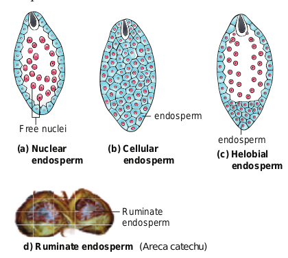
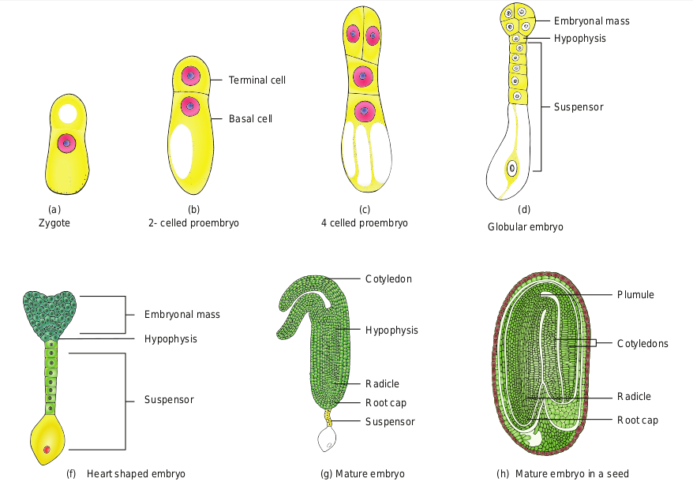
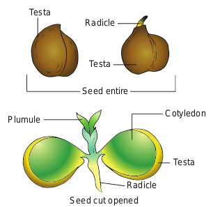
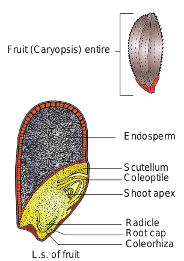
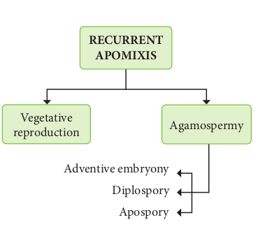
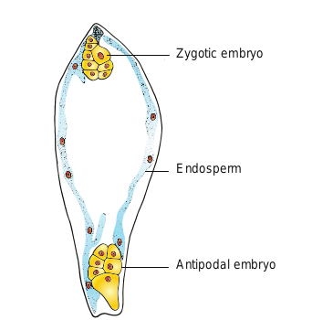

```hint { role ="info" }
**Learning Objectives**

The learner will be able to

- Recall various types of reproduction in lower and higher organisms. 
- Discuss different methods of vegetative reproduction in plants. 
- Recognise modern methods of reproduction. 
- Recall the parts of a flower. Describe the steps involved in microsporogenesis. 
- Recognise the structure of mature anther. 
- Describe the structure and types of ovules. 
- Explain the stages in megasporogenesis. 
- Discuss the structure of embryo sac. 
- Recognise different types of pollination. 
- Identify the types of endosperms. 
- Describe the development of Dicot embryo. 
- Differentiate the structure of Dicot and Monocot seed.

```

One of the essential features of all living things on the earth is reproduction. Reproduction is a vital process for the existence of a species and it also brings suitable changes through variation in the offsprings for their survival on earth. Plant reproduction is important not only for its own survival but also for the continuation and existence of all other organisms since the latter directly or indirectly depend on plants. Reproduction also plays an important role in evolution.

In this unit let us learn in detail about reproduction in plants.
Basically reproduction occurring in organisms fall under two major categories 

1. Asexual reproduction 
2. Sexual reproduction.


```hint { role ="warn" }


**Panchanan Maheswari (1904-1966)** Professor P. Maheswari was an eminent Botanist who specialised in plant embryology, morphology and anatomy. In 1934, he became the Fellow of Indian Academy of Science. He published the book titled “An introduction to the Embryology of Angiosperms”in 1950. He established the International Society for Plant Morphologists, in 1951.

```


## Post Fertilization: structures and events
 After fertilization, several changes take place in the floral parts up to the formation of the seed (Figure 1.20).

 The events after fertilization (endosperm, embryo development, formation of seed, fruits) are called post fertilization changes.

<table style="border-collapse:collapse;border-spacing:0" class="tg"><thead><tr><th style="border-color:black;border-style:solid;border-width:1px;font-family:Arial, sans-serif;font-size:14px;font-weight:bold;overflow:hidden;padding:10px 5px;text-align:left;vertical-align:top;word-break:normal">Parts before fertilization</th><th style="border-color:black;border-style:solid;border-width:1px;font-family:Arial, sans-serif;font-size:14px;font-weight:bold;overflow:hidden;padding:10px 5px;text-align:left;vertical-align:top;word-break:normal">Transformation after&nbsp;&nbsp;fertilization</th></tr></thead><tbody><tr><td style="border-color:black;border-style:solid;border-width:1px;font-family:Arial, sans-serif;font-size:14px;overflow:hidden;padding:10px 5px;text-align:left;vertical-align:top;word-break:normal">Sepals, petals, stamens,<br>style and stigma<br></td><td style="border-color:black;border-style:solid;border-width:1px;font-family:Arial, sans-serif;font-size:14px;overflow:hidden;padding:10px 5px;text-align:left;vertical-align:top;word-break:normal">Usually wither and fall off</td></tr><tr><td style="border-color:black;border-style:solid;border-width:1px;font-family:Arial, sans-serif;font-size:14px;overflow:hidden;padding:10px 5px;text-align:left;vertical-align:top;word-break:normal">Ovary</td><td style="border-color:black;border-style:solid;border-width:1px;font-family:Arial, sans-serif;font-size:14px;overflow:hidden;padding:10px 5px;text-align:left;vertical-align:top;word-break:normal">Fruit</td></tr><tr><td style="border-color:black;border-style:solid;border-width:1px;font-family:Arial, sans-serif;font-size:14px;overflow:hidden;padding:10px 5px;text-align:left;vertical-align:top;word-break:normal">Ovule</td><td style="border-color:black;border-style:solid;border-width:1px;font-family:Arial, sans-serif;font-size:14px;overflow:hidden;padding:10px 5px;text-align:left;vertical-align:top;word-break:normal">Seed</td></tr><tr><td style="border-color:black;border-style:solid;border-width:1px;font-family:Arial, sans-serif;font-size:14px;overflow:hidden;padding:10px 5px;text-align:left;vertical-align:top;word-break:normal">Egg</td><td style="border-color:black;border-style:solid;border-width:1px;font-family:Arial, sans-serif;font-size:14px;overflow:hidden;padding:10px 5px;text-align:left;vertical-align:top;word-break:normal">Zygote</td></tr><tr><td style="border-color:black;border-style:solid;border-width:1px;font-family:Arial, sans-serif;font-size:14px;overflow:hidden;padding:10px 5px;text-align:left;vertical-align:top;word-break:normal">Funicle</td><td style="border-color:black;border-style:solid;border-width:1px;font-family:Arial, sans-serif;font-size:14px;overflow:hidden;padding:10px 5px;text-align:left;vertical-align:top;word-break:normal">Stalk of the seed</td></tr><tr><td style="border-color:black;border-style:solid;border-width:1px;font-family:Arial, sans-serif;font-size:14px;overflow:hidden;padding:10px 5px;text-align:left;vertical-align:top;word-break:normal">Micropyle (ovule)</td><td style="border-color:black;border-style:solid;border-width:1px;font-family:Arial, sans-serif;font-size:14px;overflow:hidden;padding:10px 5px;text-align:left;vertical-align:top;word-break:normal">Micropyle of the<br>seed(facilitates O2 and<br>water uptake)</td></tr><tr><td style="border-color:black;border-style:solid;border-width:1px;font-family:Arial, sans-serif;font-size:14px;overflow:hidden;padding:10px 5px;text-align:left;vertical-align:top;word-break:normal">Nucellus</td><td style="border-color:black;border-style:solid;border-width:1px;font-family:Arial, sans-serif;font-size:14px;overflow:hidden;padding:10px 5px;text-align:left;vertical-align:top;word-break:normal">Perisperm</td></tr><tr><td style="border-color:black;border-style:solid;border-width:1px;font-family:Arial, sans-serif;font-size:14px;overflow:hidden;padding:10px 5px;text-align:left;vertical-align:top;word-break:normal">Outer integument of<br>ovule</td><td style="border-color:black;border-style:solid;border-width:1px;font-family:Arial, sans-serif;font-size:14px;overflow:hidden;padding:10px 5px;text-align:left;vertical-align:top;word-break:normal">Testa (outer seed coat)</td></tr><tr><td style="border-color:black;border-style:solid;border-width:1px;font-family:Arial, sans-serif;font-size:14px;overflow:hidden;padding:10px 5px;text-align:left;vertical-align:top;word-break:normal">Inner integument</td><td style="border-color:black;border-style:solid;border-width:1px;font-family:Arial, sans-serif;font-size:14px;overflow:hidden;padding:10px 5px;text-align:left;vertical-align:top;word-break:normal">Tegmen (inner seed coat)</td></tr><tr><td style="border-color:black;border-style:solid;border-width:1px;font-family:Arial, sans-serif;font-size:14px;overflow:hidden;padding:10px 5px;text-align:left;vertical-align:top;word-break:normal">Synergid cells</td><td style="border-color:black;border-style:solid;border-width:1px;font-family:Arial, sans-serif;font-size:14px;overflow:hidden;padding:10px 5px;text-align:left;vertical-align:top;word-break:normal">Degenerate</td></tr><tr><td style="border-color:black;border-style:solid;border-width:1px;font-family:Arial, sans-serif;font-size:14px;overflow:hidden;padding:10px 5px;text-align:left;vertical-align:top;word-break:normal">Secondary nucleus</td><td style="border-color:black;border-style:solid;border-width:1px;font-family:Arial, sans-serif;font-size:14px;overflow:hidden;padding:10px 5px;text-align:left;vertical-align:top;word-break:normal">Endosperm</td></tr><tr><td style="border-color:black;border-style:solid;border-width:1px;font-family:Arial, sans-serif;font-size:14px;overflow:hidden;padding:10px 5px;text-align:left;vertical-align:top;word-break:normal">Antipodal cells</td><td style="border-color:black;border-style:solid;border-width:1px;font-family:Arial, sans-serif;font-size:14px;overflow:hidden;padding:10px 5px;text-align:left;vertical-align:top;word-break:normal">Degenerate</td></tr></tbody></table>


### Endosperm 

The primary endosperm nucleus (PEN) divides immediately after fertilization but before the zygote starts to divide, to form the endosperm. The primary endosperm nucleus is the result of triple fusion (two polar nuclei and one sperm nucleus) and thus has 3n number of chromosomes. It is a nutritive tissue and regulatory structure that nourishes the developing embryo. Depending upon the mode of development three types of endosperm are recognized in angiosperms. They are nuclear endosperm, cellular endosperm and helobial endosperm (Figure 1.21).

### Nuclear endosperm: 

Primary Endosperm Nucleus undergoes several mitotic divisions without cell wall formation thus a free nuclear condition exists in the endosperm. *Examples: Coccinia, Capsella and Arachis*

```hint { role ="warn" }
**Do You Know **
Aleurone tissue consists of highly specialised cells of one or few layers which are found around the endosperm of cereals (barley and maize). Aleurone grain contains sphaerosomes. During seed germination cells secrete certain hydrolytic enzymes like amylases, proteases which digest reserved food material present in the endosperm cells.

```

### Cellular endosperm: 
Primary endosperm nucleus divides into 2 nuclei and it is immediately followed by wall formation. Subsequent divisions also follow cell wall formation. *Examples: Adoxa, Helianthus and Scoparia*



### Helobial endosperm: 
Primary Endosperm Nucleus moves towards base of embryo sac and divides into two nuclei. Cell wall formation takes place leading to the formation of a large micropylar and small chalazal chamber. The nucleus of the micropylar chamber undergoes several free nuclear division whereas that of chalazal chamber may or may not divide. 
*Examples : Hydrilla and Vallisneria.*

The endosperms may either be completely consumed by the developing embryo or it may persist in the mature seeds. Those seeds without endosperms are called non- endospermous or ex- albuminous seeds. Examples: Pea, Groundnut and Beans. Those seeds with endosperms are called endospermous or albuminous seeds. The endosperms in these seeds supply nutrition to the embryo during seed germination. Examples: Paddy, Coconut and Castor.

### Ruminate endosperm: 
The endosperm with irregularity and unevenness in its surface forms ruminate endosperm (Example: Areca catechu). The activity of the seed coat or the endosperm itself results in this type of endosperm. The unequal radial elongation of the layer of seedcoat results in the rumination of endosperm in Passiflora. In Annonaceae and Aristolochiaceae definite ingrowth or infolding of the seed coat produces ruminate endosperm. The irregular surface of the seed coat makes endosperm ruminate in Myristica.

### Functions of endosperm:
- It is the nutritive tissue for the developing embryo.

- In majority of angiosperms, the zygote divides only after the development of endosperm.

- Endosperm regulates the precise mode of embryo development.

### Endosperm haustoria
Another interesting feature of the
endosperm is the presence of haustoria. In
the case of helobial endosperm the chalazal
chamber itself acts as a haustorial structure.
In cellular and nuclear endosperm special
structures are produced towards the micropylar,
chalazal, both micropylar and chalazal which
may be in lateral direction depending on the
species. These absorb nutrients from other outer
tissue or from ovary tissue and supply them to
the growing embryo

```hint { role ="warn" }
**Do You Know**
Coconut milk is a basic nutrient medium which induces the differentiation of embryo (embryoids) and plantlets from various plant tissues. Coconut water from tender coconut is free- nuclear endosperm and white kernel part is cellular.
```
**Development of Dicot embryo**

The development of Dicot embryo (Capsella bursa-pastoris) is of Onagrad or crucifer type. The embryo develops at micropylar end of embryo sac. 

The Zygote divides by a transverse division forming upper or **terminal cell and lower or basal cell.** The basal cell divides transversely and the terminal cell divides vertically to form a four celled proembryo. A second verticaldivision right angle to the first one takes place in terminal cell forming a four celled stage called **quadrant.** A transverse division in the quadrant results in eight cells arranged in two tiers of four each called **octant stage.**

 The upper tier of four cells of the octant is called **epibasal** or anterior octant and the lower tier of four cells constitute **hypobasal** or posterior octants. A periclinal division in the octants results in the formation of 16 celled stage with eight cells in the outer and eight in the inner.
 
  The outer eight cells represent the **dermatogen** and undergoes anticlinal division to produce epidermis. The inner eight cells divide by vertical and transverse division to form outer layer of **periblem**which give rise to cortex and a central region of **pleurome** which forms stele.
  
  During the development, the two cells of the basal cell undergoes several transverse division to form a six to ten celled **suspensor.** The embryo at this stage become globular and the suspensor helps to push the embryo deep into the endosperm. The uppermost cell of the suspensor enlarge to form a **haustorium.** The lowermost cell of the suspensor is called hypophysis. A transverse division and two vertical division right angle to each other of **hypophysis** results in the formation of eight cells. The eight cells are arranged in two tiers of four cells each The upper tier give rise to root cap and epidermis. At this stage embryo proper appears heart shaped, cell divisions in the hypocotyl and cotyledon regions of the embryo proper results in elongation. Further development results in curved horse shoe shaped embryo in the embryo sac. The mature embryo has a **radicle**, two **cotyledons** and a **plumule**(Figure 1.22).

```hint { role ="warn" }
Activity
Collect the fruits of Tridax (Cypsella). Using a needle dissect out the content, separate the embryo and observe different stages of dicot embryo – globular, torpedo, heart shaped under a dissection microscope.
```


**Seed**
The fertilized ovule is called seed and possesses an embryo, endosperm and a protective coat. Seeds may be endospermous (wheat, maize, barley and sunflower) or non endospermous. (Bean, Mango, Orchids and cucurbits).

```hint { role ="warn" }
Do You Know??
Fresh weight of an orchid seed may be 20.33 microgram and that of double coconut (Lodoicea maldivica) is about 6 kg
```

**Cicer seed (example for Dicot seed)** 
The mature seeds are attached to the fruit wall by a stalk called **funiculus.** The funiculus disappears leaving a scar called hilum. Below the hilum a small pore called **micropyle** is present. It facilitates entry of oxygen and water into the seeds during germination. 

Each seed has a thick outer covering called seed coat. The seed coat is developed from integuments of the ovule. The outer coat is called testa and is hard whereas the inner coat is thin, membranous and is called tegmen. In Pea plant the tegmen and testa are fused. Two cotyledons laterally attached to the embryonic axis and store the food materials in pea whereas in other seeds like castor the endosperm contains reserve food and the




endosperm contains reserve food and the cotyledons are thin. The portion of embryonal Fruit (Caryopsis) entire axis projecting beyond the cotyledons is called **radicle** or embryonic root. The other end of the axis called embryonic shoot is the**plumule**Embryonal axis above the Endosperm level of cotyledon is called **epicotyl** whereas Scutellum the level of the cylindrical region between Coleoptile cotyledon is called **hypocotyl**(Figure 1.23 a)

**Oryza seed (example for Monocot seed)**

The seed of paddy is one seeded and is called **Caryopsis**. Each seed remains enclosed by a brownish husk which consists of glumes arranged in two rows. The seed coat is a brownish, membranous layer closely adhered to the grain. Endosperm forms the bulk of the grain and is the storage tissue. It is separated from embryo by a definite layer called **epithelium.** The embryo is small and consists of one shield- shaped cotyledon known as **scutellum** present towards lateral side of embryonal axis.

A short axis with plumule and radicle protected by the **root cap**is present. The plumule is surrounded by a protective sheath called **coleoptile.** The radicle including root cap is also covered by a protective sheath called **coleorhiza.** The scutellum supplies the growing embryo with food material absorbed from the endosperm with the help of the epithelium (Figure 1.23 b).



```hint { role ="warn" }
**Activity**

Soak seeds of green gram for three hours. Drain the water and place few seeds in a clean tray containing moist cotton or filter paper. Allow the seeds to sprout. Collect the sprouted seeds, cut open and observe the parts. Record your observation.

```
## Apomixis

Reproduction involving fertilization in flowering plants is called amphimixis and wherever reproduction does not involve union of male and female gametes is called apomixis.

The term Apomixis was introduced by Winkler in the year 1908. It is defined as the substitution of the usual sexual system (Amphimixis) by a form of reproduction which does not involve meiosis and syngamy.

Maheswari (1950) classified Apomixis into two types - Recurrent and Non recurrent

**Recurrent apomixis:** It includes vegetative reproduction and agamospermy

**Non recurrent apomixis:** Haploid embryo sac developed after meiosis, develops into a embryo without fertilization.

The outline classification of Recurrent apomixis is given below.



**Vegetative reproduction:** Plants propagate by any part other than seeds

Bulbils – _Fritillaria imperialis_; Bulbs – _Allium_; Runner – _Mentha arvensis_; Sucker - _Chrysanthemum_ 

**Agamospermy:** It refers to processes by which Embryos are formed by eliminating meiosis and syngamy. 

**Adventive embryony** An Embryo arises directly from the diploid sporophytic cells either from nucellus or integument. It is also called 

**sporophytic budding** because gametophytic phase is completely absent. Adventive embryos are found in _Citrus_ and _Mangifera_ 

**Diplospory (Generative apospory):** A diploid embryo sac is formed from megaspore mother cell without a regular meiotic division Examples. _Eupatorium_ and _Aerva._ 

**Apospory:** Megaspore mother cell (MMC) undergoes the normal meiosis and four megaspores formed gradually disappear. A nucellar cell becomes activated and develops into a diploid embryo sac. This type of apospory is also called somatic apospory. Examples _Hieracium_ and _Parthenium._

## Polyembryony

Occurrence of more than one embryo in a seed is called polyembryony (Figure 1.24). The first case of polyembryony was reported in certain oranges by Anton von Leeuwenhoek in the year 1719. Polyembryony is divided into four categories based on its origin. 

 
 
 
**a.Cleavage polyembryony** (Example: Orchids) 
**b.Formation of embryo by cells of the Embryo sac other than egg** (Synergids _– Aristolochia_; antipodals _– Ulmus_ and endosperm _– Balanophora_)

c. **Development of more than one Embryo sac within the same ovule.** (Derivatives of same MMC, derivatives of two or more MMC _– Casuarina_)

d. **Activation of some sporophytic cells of the ovule** (Nucellus/ integuments-_Citrus and Syzygium_).

**Practical applications** The seedlings formed from the nucellar tissue in _Citrus_ are found better clones for Orchards. Embryos derived through polyembryony are found virus free.

## Parthenocarpy
As mentioned earlier, the ovary becomes the fruit and the ovule becomes the seed after fertilization. However in a number of cases, fruit like structures may develop from the ovary without the act of fertilization. Such fruits are called **parthenocarpic fruits**. Invariably they will not have true seeds. Many commercial fruits are made seedless. Examples: Banana, Grapes and Papaya. 

**Significance** 

- The seedless fruits have great significance in horticulture.
- The seedless fruits have great commercial importance.
- Seedless fruits are useful for the preparation of jams, jellies, sauces, fruit drinks etc. 
- High proportion of edible part is available in parthenocarpic fruits due to the absence of seeds.

**Summary** 

Reproduction is one of the attributes of living things. Lower plants, microbes and animals reproduce by different methods (fragmentation, gemma, binary fission, budding, regeneration). Organisms reproduce through asexual and sexual methods. Asexual methods in angiosperms occur through natural or artificial methods. The natural methods take place through vegetative propagules or diaspores. Artificial method of reproduction involves cutting, layering and grafting. Micropropagation is a modern method used to raise new plants.

Sexual reproduction includes gametogenesis and fertilization. External fertilization occurs in lower plants like algae but in higher plants internal fertilization takes place. A flower is a modified shoot meant for reproduction. Stamen is the male reproductive part and produces pollen grains. The development of microspore is called microsporogenesis. The microspore mother cell undergoes meiotic division to produce four haploid microspores. In majority of Angiosperms the anther is dithecous and are tetrasporangiate. It possesses epidermis, endothecium, middle layers and tapetum. The hygroscopic nature of endothecial cell along with thin walled stomium helps in the dehiscence of anther. Tapetum nourishes the microspores and also contributes to the wall materials of the pollen grain. Pollen grain is derived from the microspore and possesses thin inner intine and thick outer exine. Sporopollenin is present in exine and is resistant to physiological and biological decomposition. Microspore is the first cell of male gametophyte. The nucleus of the microspore divides to form a vegetative nucleus and a generative nucleus. The generative nucleus divides to form two male nuclei. Gynoecium is the female reproductive part of a flower and it represents one or more pistils. The ovary bears ovules

which are attached to the placenta. There are six major types of ovules. The development of megaspore from megaspore mother cell is called megasporogenesis. A monosporic embryo sac (_Polygonum_ type) possesses three antipodals in chalazal end, Three cells in the micropylar end constituting egg apparatus(1 egg and 2 Synergids) and two polar nucleus fused to form secondary nucleus. Thus, a 7 celled 8 nucleated Embryo sac is present.

The transfer of pollen grains to the stigma of a flower is called pollination. Self- pollination and cross-pollination are two types of pollination. Double fertilization and triple fusion are characteristic features of angiosperms. After fertilization the ovary transforms into a fruit and the ovule becomes a seed. Endosperm is triploid in angiosperms and is of three types – Nuclear, cellular, helobial. Reproduction which doesn’t involve meiosis and syngamy is called apomixis. Occurrence of more than one embryo in a seed is called polyembryony. Formation of fruit without the act of fertilization is called parthenocarpy.

