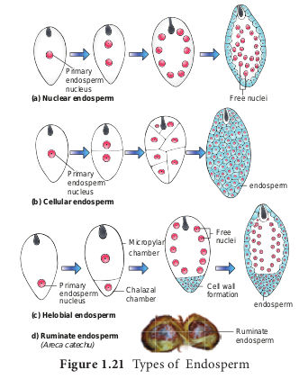
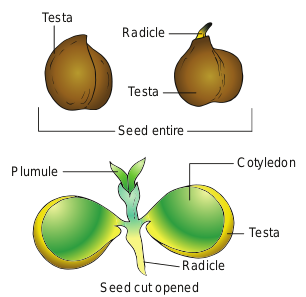
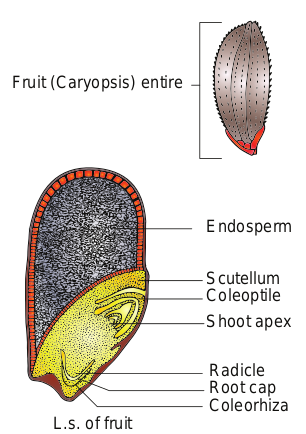

 After fertilization, several changes take place in the floral parts up to the formation of the seed (Figure 1.20).

 The events after fertilization (endosperm, embryo development, formation of seed, fruits) are called post fertilization changes.

<table style="border-collapse:collapse;border-spacing:0" class="tg"><thead><tr><th style="border-color:black;border-style:solid;border-width:1px;font-family:Arial, sans-serif;font-size:14px;font-weight:bold;overflow:hidden;padding:10px 5px;text-align:left;vertical-align:top;word-break:normal">Parts before fertilization</th><th style="border-color:black;border-style:solid;border-width:1px;font-family:Arial, sans-serif;font-size:14px;font-weight:bold;overflow:hidden;padding:10px 5px;text-align:left;vertical-align:top;word-break:normal">Transformation after&nbsp;&nbsp;fertilization</th></tr></thead><tbody><tr><td style="border-color:black;border-style:solid;border-width:1px;font-family:Arial, sans-serif;font-size:14px;overflow:hidden;padding:10px 5px;text-align:left;vertical-align:top;word-break:normal">Sepals, petals, stamens,<br>style and stigma<br></td><td style="border-color:black;border-style:solid;border-width:1px;font-family:Arial, sans-serif;font-size:14px;overflow:hidden;padding:10px 5px;text-align:left;vertical-align:top;word-break:normal">Usually wither and fall off</td></tr><tr><td style="border-color:black;border-style:solid;border-width:1px;font-family:Arial, sans-serif;font-size:14px;overflow:hidden;padding:10px 5px;text-align:left;vertical-align:top;word-break:normal">Ovary</td><td style="border-color:black;border-style:solid;border-width:1px;font-family:Arial, sans-serif;font-size:14px;overflow:hidden;padding:10px 5px;text-align:left;vertical-align:top;word-break:normal">Fruit</td></tr><tr><td style="border-color:black;border-style:solid;border-width:1px;font-family:Arial, sans-serif;font-size:14px;overflow:hidden;padding:10px 5px;text-align:left;vertical-align:top;word-break:normal">Ovule</td><td style="border-color:black;border-style:solid;border-width:1px;font-family:Arial, sans-serif;font-size:14px;overflow:hidden;padding:10px 5px;text-align:left;vertical-align:top;word-break:normal">Seed</td></tr><tr><td style="border-color:black;border-style:solid;border-width:1px;font-family:Arial, sans-serif;font-size:14px;overflow:hidden;padding:10px 5px;text-align:left;vertical-align:top;word-break:normal">Egg</td><td style="border-color:black;border-style:solid;border-width:1px;font-family:Arial, sans-serif;font-size:14px;overflow:hidden;padding:10px 5px;text-align:left;vertical-align:top;word-break:normal">Zygote</td></tr><tr><td style="border-color:black;border-style:solid;border-width:1px;font-family:Arial, sans-serif;font-size:14px;overflow:hidden;padding:10px 5px;text-align:left;vertical-align:top;word-break:normal">Funicle</td><td style="border-color:black;border-style:solid;border-width:1px;font-family:Arial, sans-serif;font-size:14px;overflow:hidden;padding:10px 5px;text-align:left;vertical-align:top;word-break:normal">Stalk of the seed</td></tr><tr><td style="border-color:black;border-style:solid;border-width:1px;font-family:Arial, sans-serif;font-size:14px;overflow:hidden;padding:10px 5px;text-align:left;vertical-align:top;word-break:normal">Micropyle (ovule)</td><td style="border-color:black;border-style:solid;border-width:1px;font-family:Arial, sans-serif;font-size:14px;overflow:hidden;padding:10px 5px;text-align:left;vertical-align:top;word-break:normal">Micropyle of the<br>seed(facilitates O2 and<br>water uptake)</td></tr><tr><td style="border-color:black;border-style:solid;border-width:1px;font-family:Arial, sans-serif;font-size:14px;overflow:hidden;padding:10px 5px;text-align:left;vertical-align:top;word-break:normal">Nucellus</td><td style="border-color:black;border-style:solid;border-width:1px;font-family:Arial, sans-serif;font-size:14px;overflow:hidden;padding:10px 5px;text-align:left;vertical-align:top;word-break:normal">Perisperm</td></tr><tr><td style="border-color:black;border-style:solid;border-width:1px;font-family:Arial, sans-serif;font-size:14px;overflow:hidden;padding:10px 5px;text-align:left;vertical-align:top;word-break:normal">Outer integument of<br>ovule</td><td style="border-color:black;border-style:solid;border-width:1px;font-family:Arial, sans-serif;font-size:14px;overflow:hidden;padding:10px 5px;text-align:left;vertical-align:top;word-break:normal">Testa (outer seed coat)</td></tr><tr><td style="border-color:black;border-style:solid;border-width:1px;font-family:Arial, sans-serif;font-size:14px;overflow:hidden;padding:10px 5px;text-align:left;vertical-align:top;word-break:normal">Inner integument</td><td style="border-color:black;border-style:solid;border-width:1px;font-family:Arial, sans-serif;font-size:14px;overflow:hidden;padding:10px 5px;text-align:left;vertical-align:top;word-break:normal">Tegmen (inner seed coat)</td></tr><tr><td style="border-color:black;border-style:solid;border-width:1px;font-family:Arial, sans-serif;font-size:14px;overflow:hidden;padding:10px 5px;text-align:left;vertical-align:top;word-break:normal">Synergid cells</td><td style="border-color:black;border-style:solid;border-width:1px;font-family:Arial, sans-serif;font-size:14px;overflow:hidden;padding:10px 5px;text-align:left;vertical-align:top;word-break:normal">Degenerate</td></tr><tr><td style="border-color:black;border-style:solid;border-width:1px;font-family:Arial, sans-serif;font-size:14px;overflow:hidden;padding:10px 5px;text-align:left;vertical-align:top;word-break:normal">Secondary nucleus</td><td style="border-color:black;border-style:solid;border-width:1px;font-family:Arial, sans-serif;font-size:14px;overflow:hidden;padding:10px 5px;text-align:left;vertical-align:top;word-break:normal">Endosperm</td></tr><tr><td style="border-color:black;border-style:solid;border-width:1px;font-family:Arial, sans-serif;font-size:14px;overflow:hidden;padding:10px 5px;text-align:left;vertical-align:top;word-break:normal">Antipodal cells</td><td style="border-color:black;border-style:solid;border-width:1px;font-family:Arial, sans-serif;font-size:14px;overflow:hidden;padding:10px 5px;text-align:left;vertical-align:top;word-break:normal">Degenerate</td></tr></tbody></table>


### Endosperm 

The primary endosperm nucleus (PEN) divides immediately after fertilization but before the zygote starts to divide, to form the endosperm. The primary endosperm nucleus is the result of triple fusion (two polar nuclei and one sperm nucleus) and thus has 3n number of chromosomes. It is a nutritive tissue and regulatory structure that nourishes the developing embryo. Depending upon the mode of development three types of endosperm are recognized in angiosperms. They are nuclear endosperm, cellular endosperm and helobial endosperm (Figure 1.21).


### Nuclear endosperm: 

Primary Endosperm Nucleus undergoes several mitotic divisions without cell wall formation thus a free nuclear condition exists in the endosperm. *Examples: Coccinia, Capsella and Arachis*

```hint { role ="warn" }
**Do You Know **
Aleurone tissue consists of highly specialised cells of one or few layers which are found around the endosperm of cereals (barley and maize). Aleurone grain contains sphaerosomes. During seed germination cells secrete certain hydrolytic enzymes like amylases, proteases which digest reserved food material present in the endosperm cells.

```

### Cellular endosperm: 
Primary endosperm nucleus divides into 2 nuclei and it is immediately followed by wall formation. Subsequent divisions also follow cell wall formation. *Examples: Adoxa, Helianthus and Scoparia*


### Helobial endosperm: 
Primary Endosperm Nucleus moves towards base of embryo sac and divides into two nuclei. Cell wall formation takes place leading to the formation of a large micropylar and small chalazal chamber. The nucleus of the micropylar chamber undergoes several free nuclear division whereas that of chalazal chamber may or may not divide. 
*Examples : Hydrilla and Vallisneria.*

The endosperms may either be completely consumed by the developing embryo or it may persist in the mature seeds. Those seeds without endosperms are called non- endospermous or ex- albuminous seeds. Examples: Pea, Groundnut and Beans. Those seeds with endosperms are called endospermous or albuminous seeds. The endosperms in these seeds supply nutrition to the embryo during seed germination. Examples: Paddy, Coconut and Castor.

### Ruminate endosperm: 
The endosperm with irregularity and unevenness in its surface forms ruminate endosperm (Example: Areca catechu). The activity of the seed coat or the endosperm itself results in this type of endosperm. The unequal radial elongation of the layer of seedcoat results in the rumination of endosperm in Passiflora. In Annonaceae and Aristolochiaceae definite ingrowth or infolding of the seed coat produces ruminate endosperm. The irregular surface of the seed coat makes endosperm ruminate in Myristica.

### Functions of endosperm:
- It is the nutritive tissue for the developing embryo.

- In majority of angiosperms, the zygote divides only after the development of endosperm.

- Endosperm regulates the precise mode of embryo development.

### Endosperm haustoria
Another interesting feature of the
endosperm is the presence of haustoria. In
the case of helobial endosperm the chalazal
chamber itself acts as a haustorial structure.
In cellular and nuclear endosperm special
structures are produced towards the micropylar,
chalazal, both micropylar and chalazal which
may be in lateral direction depending on the
species. These absorb nutrients from other outer
tissue or from ovary tissue and supply them to
the growing embryo

```hint { role ="warn" }
**Do You Know**
Coconut milk is a basic nutrient medium which induces the differentiation of embryo (embryoids) and plantlets from various plant tissues. Coconut water from tender coconut is free- nuclear endosperm and white kernel part is cellular.
```

**Embryogenesis**

**Development of Dicot embryo**

The development of Dicot embryo (Capsella bursa-pastoris) is of Onagrad or crucifer type. The embryo develops at micropylar end of embryo sac. 

The Zygote divides by a transverse division forming upper or **terminal cell and lower or basal cell.** The basal cell divides transversely and the terminal cell divides vertically to form a four celled proembryo. A second verticaldivision right angle to the first one takes place in terminal cell forming a four celled stage called **quadrant.** A transverse division in the quadrant results in eight cells arranged in two tiers of four each called **octant stage.**

The upper tier of four cells of the octant is called **epibasal** or anterior octant and the lower tier of four cells constitute **hypobasal** or posterior octants. A periclinal division in the octants results in the formation of 16 celled stage with eight cells in the outer and eight in the inner.
 
The outer eight cells represent the **dermatogen** and undergoes anticlinal division to produce epidermis. The inner eight cells divide by vertical and transverse division to form outer layer of **periblem**which give rise to cortex and a central region of **pleurome** which forms stele.
  
During the development, the two cells of the basal cell undergoes several transverse division to form a six to ten celled **suspensor.** The embryo at this stage become globular and the suspensor helps to push the embryo deep into the endosperm. The uppermost cell of the suspensor enlarge to form a **haustorium.** The lowermost cell of the suspensor is called hypophysis. A transverse division and two vertical division right angle to each other of **hypophysis** results in the formation of eight cells. The eight cells are arranged in two tiers of four cells each The upper tier give rise to root cap and epidermis. At this stage embryo proper appears heart shaped, cell divisions in the hypocotyl and cotyledon regions of the embryo proper results in elongation. Further development results in curved horse shoe shaped embryo in the embryo sac. The mature embryo has a **radicle**, two **cotyledons** and a **plumule**(Figure 1.22).

```hint { role ="warn" }
Activity
Collect the fruits of Tridax (Cypsella). Using a needle dissect out the content, separate the embryo and observe different stages of dicot embryo – globular, torpedo, heart shaped under a dissection microscope.
```


**Seed**
The fertilized ovule is called seed and possesses an embryo, endosperm and a protective coat. Seeds may be endospermous (wheat, maize, barley and sunflower) or non endospermous. (Bean, Mango, Orchids and cucurbits).

```hint { role ="warn" }
Do You Know??
Fresh weight of an orchid seed may be 20.33 microgram and that of double coconut (Lodoicea maldivica) is about 6 kg
```

**Cicer seed (example for Dicot seed)** 
The mature seeds are attached to the fruit wall by a stalk called **funiculus.** The funiculus disappears leaving a scar called hilum. Below the hilum a small pore called **micropyle** is present. It facilitates entry of oxygen and water into the seeds during germination. 

Each seed has a thick outer covering called seed coat. The seed coat is developed from integuments of the ovule. The outer coat is called testa and is hard whereas the inner coat is thin, membranous and is called tegmen. In Pea plant the tegmen and testa are fused. Two cotyledons laterally attached to the embryonic axis and store the food materials in pea whereas in other seeds like castor the endosperm contains reserve food and the




endosperm contains reserve food and the cotyledons are thin. The portion of embryonal Fruit (Caryopsis) entire axis projecting beyond the cotyledons is called **radicle** or embryonic root. The other end of the axis called embryonic shoot is the**plumule**Embryonal axis above the Endosperm level of cotyledon is called **epicotyl** whereas Scutellum the level of the cylindrical region between Coleoptile cotyledon is called **hypocotyl**(Figure 1.23 a)

**Oryza seed (example for Monocot seed)**

The seed of paddy is one seeded and is called **Caryopsis**. Each seed remains enclosed by a brownish husk which consists of glumes arranged in two rows. The seed coat is a brownish, membranous layer closely adhered to the grain. Endosperm forms the bulk of the grain and is the storage tissue. It is separated from embryo by a definite layer called **epithelium.** The embryo is small and consists of one shield- shaped cotyledon known as **scutellum** present towards lateral side of embryonal axis.

A short axis with plumule and radicle protected by the **root cap**is present. The plumule is surrounded by a protective sheath called **coleoptile.** The radicle including root cap is also covered by a protective sheath called **coleorhiza.** The scutellum supplies the growing embryo with food material absorbed from the endosperm with the help of the epithelium (Figure 1.23 b).



```hint { role ="warn" }
**Activity**

Soak seeds of green gram for three hours. Drain the water and place few seeds in a clean tray containing moist cotton or filter paper. Allow the seeds to sprout. Collect the sprouted seeds, cut open and observe the parts. Record your observation.

```