  

112

The World Health Organization \[WHO\] defines health as ‘a state of complete

physical, mental and social wellbeing and not merely absence of diseases’. We can also say “HEALTH IS WEALTH”, when people are healthy they are more efficient at work. Health increases longevity of people and reduces infant and adult mortality. Personal hygiene, regular exercise and balanced diet are very important to maintain good health.

**7.1 Common diseases in human beings**

Disease can be defined as a disorder or malfunction of the mind or body. It involves morphological, physiological and psychological disturbances which may be due to environmental factors or pathogens or genetic anomalies or life style changes. Diseases can be broadly grouped into infectious and non infectious types.

Diseases which are transmitted from one person to another are called infectious diseases or **communicable diseases**. Such disease causing organisms are called **pathogens** and are transmitted through air, water, food, physical contact and vectors. The disease causing pathogen may be virus, bacteria, fungi, protozoan parasites, helminthic parasites, etc., Infectious diseases are common and everyone

UNIT - III

**Human Health and Diseases**

CHAPTER

7 _Sneezing spreads diseases through the droplets_

_of mucus_

7.1 Common diseases in human beings 7.2 Maintenance of personal and public

hygiene 7.3 Adolescence – Drug and alcohol

abuse 7.4 Mental health – Depression 7.5 Lifestyle disorders in human beings

**Chapter outline**

**Learning Objectives**

➢ _Learns about various bacterial, viral, fungal, protozoan and helminth diseases._

➢ _Understands the life cycle of malarial parasite._

➢ _Learns the ill effects of drugs and alcohol._

➢ _Realizes the responsibility for their behaviour, health care and life styles._

➢ _Understands the importance of mental health and life style modifications to be followed for their well being._

XII Std Zoology Chapter 7 EM.indd 112 18/12/2021 14:53:38

  

113 Human Health and Diseases

suffers from such diseases at some time or the other. Most of the bacterial diseases are curable but all viral diseases are not. Some infectious disease like AIDS may be fatal.

**Non-infectious diseases** are not transmitted from an infected person to a healthy person. In origin they may be genetic (cystic fibrosis), nutritional (vitamin deficiency diseases) and degenerative (arthritis, heart attack, stroke). Among non - infectious diseases, cancer is one of the major causes of death.

**7.1.1 Bacterial and viral diseases Bacterial diseases** Though the number of bacterial species is very high, only a few bacteria are associated with human diseases and are called **pathogenic bacteria**. Such pathogens may emit toxins and affects the body. Common pathogenic bacteria and the bacterial diseases are given in **table 7.1**.

Bacteria spread through air, water or by inhaling the droplets/aerosols or even by sharing utensils, dresses with an infected person. Typhoid fever can be confirmed by **Widal test**.

**Viral diseases** Viruses are the smallest intracellular obligate parasites, which multiply within

**Common human diseases**

**Bacterial diseases** • Dysentery • Plague • Diphtheria • Cholera • Typhoid • Pneumonia

**Viral diseases** • Common cold • Mumps • Measles • Viral hepatitis • Dengue fever • Chikungunya • Chicken pox • Poliomyelitis

**Fungal diseases** • Candidiasis • Athlete’s foot

**Protozoan diseases** • Malaria • Amoebiasis • African

sleeping sickness

• Kala-azar

**Helminthic diseases** • Ascariasis • Filariasis

**Bacterial resistance** If an antibiotic is used too often to

fight a specific bacterial infection, the bacteria may become resistant to the specific antibiotic. Hence the specific antibiotic can no longer be used to treat the bacterial infection. Some bacteria have developed resistance to many antibiotics. Therefore, infections caused by these bacteria are difficult to be cured.

**Risk of bacterial resistance can be reduced by observing the following steps** • Avoid using antibiotics to treat minor

infections that can be taken care by our immune system.

• Do not use an antibiotic to treat viral infections such as common cold or flu.

• Always follow the prescription. Skipping doses or failing to complete the prescription may allow antibiotic resistance to develop.

living cells. Outside the living cells they cannot carry out the characteristics of a living organism. Viruses invade living cells, forcing the cells to create new viruses. The new viruses break out of the cell, killing it and invade other cells in the body, causing

XII Std Zoology Chapter 7 EM.indd 113 18/12/2021 14:53:38

  

114Human Health and Diseases

**S. No**

**Diseases Causative agent Site of infection**

**Mode of transmission**

**Symptoms**

1 Shigellosis (Bacillary dysentery)

_Shigella sp._ Intestine Food and water contaminated by faeces / faecal oral route

Abdominal pain, dehydration, blood and mucus in the stools

2 Bubonic plague ( Black death)

_Yersinia pestis_ Lymph nodes

Rat flea vector- _Xenopsylla cheopis_

Fever, headache, and swollen lymph nodes

3 Diphtheria _Corynebacterium diphtheriae_

Larynx, skin, nasal and genital passage

Droplet infection

Fever, sore throat, hoarseness and difficulty in breathing

4 Cholera _Vibrio cholerae_ Intestine Contaminated food and water/ faecal oral route

Severe diarrhoea and dehydration

5 Tetanus ( Lock jaw)

_Clostridium tetani_

Spasm of muscles

Through wound infection

Rigidity of jaw muscle, increased heart beat rate and spasm of the muscles of the jaw and face

6 Typhoid ( Enteric fever)

_Salmonella typhi_ Intestine Through contaminated food and water

Headache, abdominal discomfort, fever and diarrhoea

7 Pneumonia _Streptococcus pneumoniae_

Lungs Droplet infection

Fever, cough, painful breathing and brown sputum

8 Tuberculosis _Mycobacterium tuberculosis_

Lungs Droplet infection

Thick mucopurulant nasal discharge

**Table 7.1. Bacterial diseases in human beings**

diseases in human beings. _Rhino viruses_ cause one of the most infectious human ailment called the “**Common cold**”.

Viral diseases are generally grouped into four types on the basis of the symptoms produced in the body organs.

Common cold is caused by more than 150 different strains of Rhino viruses. More over their RNA genome keeps changing due to mutation. Hence it is very difficult to prepare a common vaccine for the disease.

XII Std Zoology Chapter 7 EM.indd 114 18/12/2021 14:53:38

  

115 Human Health and Diseases

**S. No**

**Diseases Causative agent**

**Site of infection**

**Mode of transmission**

**Symptoms**

1 Common cold _Rhino viruses_ Respiratory tract

Droplet infection

Nasal congestion and discharge, sore throat, cough and headache

2 Mumps _Mumps virus (RNA virus), Paramyxo virus_

Salivary glands Saliva and droplet infection

Enlargement of the parotid glands

3 Measles _Rubella virus (RNA virus), Paramyxo virus_

Skin and respiratory tract

Droplet infection

Sore throat, running nose, cough and fever, reddish rashes on the skin, neck and ears

4 Viral hepatitis _Hepatitis - B virus_

Liver Parenteral route, blood transfusion

Liver damage, jaundice, nausea, yellowish eyes, fever and pain in the abdomen

5 Chicken pox _Varicella -Zoster virus (DNA Virus )_

Respiratory tract, skin and nervous system

Droplet infection and direct contact

Mild fever with itchy skin, rash and blisters

6 Poliomyelitis _Polio virus (RNA virus)_

Intestine, brain, spinal cord

Droplet infection through faecal oral route

Fever, muscular stiffness and weakness, paralysis and respiratory failure

7 Dengue fever (Break bone fever)

_Dengue virus or Flavi virus (DENV 1-4 virus)_

Skin and blood Mosquito vector _Aedes aegypti_

Severe flu like illness with a sudden onset of fever and painful headache, muscle and joint pain

8 Chikungunya _Alpha virus (Toga virus)_

Nervous system

Mosquito vector _Aedes aegypti_

Fever and joint pain, headache and joint swelling

**Table: 7.2 Viral diseases in human beings**

XII Std Zoology Chapter 7 EM.indd 115 18/12/2021 14:53:38

  

116Human Health and Diseases

**Amoebiasis** also called amoebic dysentery or amoebic colitis is caused by _Entamoeba histolytica,_ which lives in the human large intestine and feeds on mucus and bacteria **(Fig. 7.1)**. Infective stage of this parasite is the **trophozoite**, which penetrates the walls of the host intestine (colon) and secretes histolytic enzymes causing ulceration, bleeding, abdominal pain and stools with excess mucus. Symptoms of amoebiasis can range from diarrhoea to dysentery with blood and mucus in the stool. House flies (Musca domestica) acts as a carrier for transmitting the parasite from contaminated faeces and water.

Food vacuole

Plasmalemma

Ectoplasm

Endoplasm

Endosome

Nucleus

**Fig. 7.1** _**Entamoeba histolytica**_

**African sleeping sickness** is caused by _Trypanosoma species**.** Trypanosoma_ is generally transmitted by the blood sucking **Tsetse** flies. Three species of _Trypanosoma_ cause sleeping sickness in man. 1. _T. gambiense_ is transmitted by _Glossina_

_palpalis (Tsetse fly) and causes Gambian or_ Central African sleeping sickness **(Fig. 7.2).**

2\. _T. rhodesiense_ is transmitted by _Glossina morsitans_ causing **Rhodesian or East African sleeping sickness.**

3\. _T. cruzi_ is transmitted by a bug called _Triatoma megista_ and causes **Chagas disease or American trypanosomiasis.**

**Kala – azar** or visceral leishmaniasis is caused by _Leishmania donovani,_ which is transmitted by the vector _Phlebotomus_ **(sand fly). Infection may occur in the endothelial** cells, bone marrow, liver, lymph glands and

i. Pneumotropic diseases (respiratory tract infected by influenza)

ii. Dermotropic diseases (skin and subcutaneous tissues affected by chicken pox and measles)

iii. Viscerotropic diseases (blood and visceral organs affected by yellow fever and dengue fever)

iv. Neurotropic diseases (central nervous system affected by rabies and polio). Some common viral diseases of human beings are given in **table 7.2**.

Swine flu was first recognised in the 1919 pandemic and still circulates as a seasonal flu virus. Swine flu is caused by the H1N1

virus strain. Symptoms include fever, cough, sore throat, chills, weakness and body aches. Children, pregnant women and the elderly are at risk from severe infection.

**7.1.2 Protozoan diseases** About 15 genera of protozoans live as parasites within the human body and cause diseases.

**Nipah virus** is a zoonotic virus (transmitted from animals to humans) and also transmitted through contaminated food. In infected people, it causes a range of illness from asymptomatic infection to acute respiratory illness and fatal encephalitis.

XII Std Zoology Chapter 7 EM.indd 116 18/12/2021 14:53:39

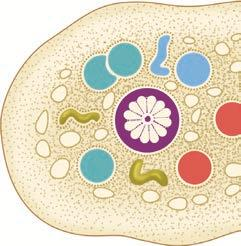

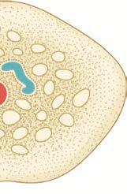

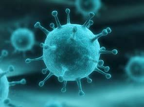
  

117 Human Health and Diseases

the liver they undergo multiple asexual fission **(schizogony) and produce merozoites. After** being released from liver cells, the merozoites penetrate the RBC’s.

Inside the RBC, the merozoite begins to develop as unicellular trophozoites. The trophozoite grows in size and a central vacuole develops pushing them to one side of cytoplasm and becomes the signet ring stage. The trophozoite nucleus then divides asexually to produce the schizont. The large schizont shows yellowish - brown pigmented granules called **Schuffners granules. The schizont divides** and produces mononucleated merozoites. Eventually the erythrocyte lyses, releasing the merozoites and haemozoin toxin into the blood stream to infect other erythrocytes. Lysis of red blood cells results in cycles of fever and other symptoms. This erythrocytic stage is cyclic and repeats itself approximately every **48 to 72 hours** or longer depending on the species of Plasmodium involved. The sudden release of merozoites triggers an attack on the RBCs. Occasionally, merozoites differentiate into macrogametocytes and **microgametocytes**. When these are ingested by a mosquito, they develop into male and female gametes respectively.

In the mosquito's gut, the infected erythrocytes lyse and male and female gametes fertilize to form a diploid zygote called ookinete. The ookinete migrates to the mosquito's gut wall and develop into an **oocyte**. The oocyte undergoes meiosis by a process called sporogony to form sporozoites. These sporozoites migrate to the salivary glands of the mosquito. The cycle is now completed and when the mosquito bites another human host, the sporozoites are injected and the cycle begins a new.

The pathological changes caused by malaria, affects not only the erythrocytes but also the spleen and other visceral organs. Incubation period of **malaria** is about 12 days. The early symptoms of malaria are headache,

Free flagellum

Attached flagellum

Pellicle

Basal granule

Nucleus

Reserve food

granules

Kinetoplast

Undulating membrane

**Fig. 7.2. _Trypanosoma gambiense_** blood vessels of the spleen. Symptoms of Kala azar are weight loss, anaemia, fever, enlargement of spleen and liver.

**Malaria is caused by different types of** _Plasmodium_ species such as _P. vivax, P. ovale, P. malariae and P. falciparum_ **(Table 7.3).** _Plasmodium_ lives in the RBC of human in its mature condition it is called as **trophozoite**. It is transmited from one person to another by the bite of the infected female _Anopheles_ mosquito.

**Life cycle of _Plasmodium_** _Plasmodium vivax_ is a digenic parasite, involving two hosts, man as the secondary host and female _Anopheles_ mosquito as the primary host. The life cycle of Plasmodium involves three phases namely **schizogony, gamogony** and **sporogony (Fig. 7.3)**.

The parasite first enters the human blood stream through the bite of an infected **female _Anopheles_** mosquito. As it feeds, the mosquito injects the saliva containing the sporozoites. The sporozoite within the blood stream immediately enters the hepatic cells of the liver. Further in

XII Std Zoology Chapter 7 EM.indd 117 18/12/2021 14:53:39

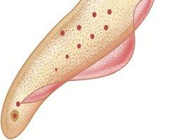

  

118Human Health and Diseases

**Prevention** It is possible to break the transmission cycle by killing the insect vector. Mosquitoes lay their eggs in water. Larvae hatch and develop in water but breathe air by moving to the surface. Oil can be sprayed over the water surface, to make it impossible for mosquito larvae and pupae to breathe.

Ponds, drainage ditches and other permanent bodies of water can be stocked

nausea and muscular pain. The classic symptoms first develop with the synchronized release of merozoites, **haemozoin** toxin and erythrocyte debris into the blood stream resulting in malarial paroxysms – shivering chills, high fever followed by sweating. Fever and chills are caused partly by malarial toxins that induce macrophages to release tumour necrosis factor (TNF-α) and interleukin.

**Sl. No Types of Malaria Causative agent Duration of Erythrocytic cycle**

1 Tertian, benign tertian or vivax malaria _P. vivax_ 48 hours

2 Quartan malaria _P. malariae_ 72 hours

3 Mild tertian malaria _P. ovale_ 48 hours

4 Malignant tertian or quotidian malaria _P. falciparum_ 36 – 48 hours

**Table 7.3 Types of malaria**

**Fig. 7.3 Life cycle of _Plasmodium_**

XII Std Zoology Chapter 7 EM.indd 118 18/12/2021 14:53:40

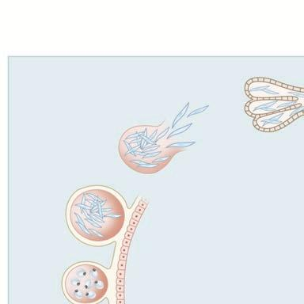

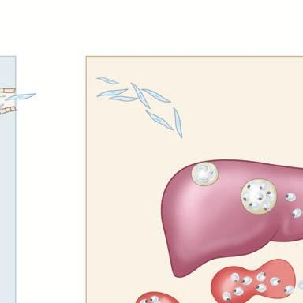

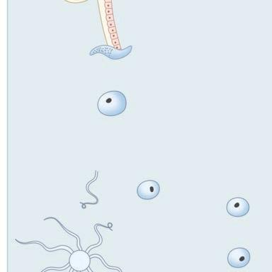

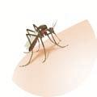

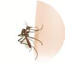
  

119 Human Health and Diseases

the toes. Ringworms of the feet is known as **Athlete’s foot** caused by _Tinea pedis_ **(Fig. 7.5)**. Ringworms are generally acquired from soil or by using clothes, towels and comb used by infected persons.

**Fig. 7.4 Symptoms of ringworm**

**Fig. 7.5 Symptoms of Athlete’s foot**

**7.1.4 Helminthic diseases** Helminthes are mostly endoparasitic in the gut and blood of human beings and cause diseases called helminthiasis. The two most prevalent helminthic diseases are Ascariasis and Filariasis.

_Ascaris_ is a monogenic parasite and exhibits sexual dimorphism. **Ascariasis** is a disease caused by the intestinal endoparasite _Ascaris lumbricoides_ commonly called the **round worms (Fig. 7.6)**. It is transmitted through ingestion of embryonated eggs through contaminated food and water. Children playing in contaminated soils are also prone to have a chance of transfer of eggs from hand to mouth. The symptoms of the disease are abdominal pain, vomiting, headache, anaemia, irritability

with fishes such as _Gambusia_ which feed on mosquito larvae. Preparations containing _Bacillus thuringiensis_ can be sprayed to kill the mosquito larvae since it is not toxic to other forms of life. The best protection against malaria is to avoid being bitten by mosquito. People are advised to use mosquito nets, wire gauging of windows and doors to prevent mosquito bites.

In the 1950’s the World Health Organisation (WHO) introduced the Malaria eradication programme. This programme was not successful due to the resistance of _Plasmodium_ to the drugs used to treat it and resistance of mosquitoes to DDT and other insecticides.

**Malaria vaccine** is used to prevent malaria. The only approved vaccine as of 2015 is RTS,S(Mosquirix). It

requires four injections and has relatively low efficacy (26–50%). Due to this low efficacy, WHO does not recommend the use of RTS,S vaccine in babies between 6 and 12 weeks of age.

**7.1.3 Fungal diseases** Fungi was recognized as a causative agent of human diseases much earlier than bacteria. Dermatomycosis is a cutaneous infection caused by fungi belonging to the genera _Trichophyton_, _Microsporum_ and _Epidermophyton_.

Ringworm is one of the most common fungal disease in humans **(Fig. 7.4)**. Appearance of dry, scaly lesions on the skin, nails and scalp are the main symptoms of the disease. Heat and moisture help these fungi to grow and makes them to thrive in skin folds such as those in the groin or between

XII Std Zoology Chapter 7 EM.indd 119 18/12/2021 14:53:40

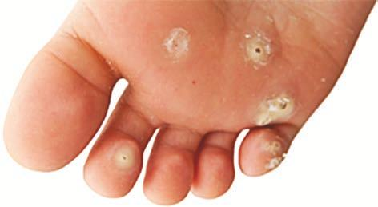
  

120Human Health and Diseases

and diarrhoea. A heavy infection can cause nutritional deficiency and severe abdominal pain and causes stunted growth in children. It may also cause enteritis, hepatitis and bronchitis.

**Filariasis** is caused by _Wuchereria bancrofti, commonly_ called filarial worm. It is found in the **lymph**

**vessels** and **lymph nodes** of man **(Fig. 7.7)**. _Wuchereria bancrofti is sexually dimorphic,_ viviparous and digenic. The life cycle is completed in two hosts, man and the female _Culex mosquito The female filarial worm gives_ rise to juveniles called microfilariae larvae. In the lymph glands, the juveniles develop into adults. The accumulation of the worms block the lymphatic system resulting in inflammation of the lymph nodes. In some cases, the obstruction of lymph vessels causes elephantiasis or filariasis of the **limbs**, **scrotum** and **mammary glands (Fig. 7.8)**.

**7.2 Maintenance of personal and public hygiene**

**Hygiene** is a set of practices performed to conserve good health. According to the World Health Organization (WHO), hygiene refers to “conditions and practices that help to maintain health and prevent the spread of diseases." **Personal hygiene** refers to maintaining one’s body clean by bathing, washing hands, trimming fingernails, wearing clean clothes and also includes attention to keeping surfaces in the home and workplace, including toilets, bathroom facilities, clean and pathogen-free.

Our public places teem with infection, contamination and germs. It seems that every surface we touch and the air we breathe are with pollutants and microbes. It’s not just the public places that are unclean, but we might be amazed at the number of people who do not wash their hands before taking food, after visiting the restroom, or who sneeze without covering their faces. Many infectious diseases such as **typhoid,** **amoebiasis** and **ascariasis** are transmitted through contaminated food and water.

Advancement in science and technology provide effective controlling measures for many infectious and non-infectious diseases. The use of vaccines and adopted immunization programmes have helped to eradicate **small pox** in India. Moreover a large number of infectious diseases like **polio, diphtheria, pneumonia** and **tetanus** have been controlled by the use of vaccines and by creating awareness among the people.

**7.3 Adolescence – drug and alcohol abuse**

Adolescence begins with a period of rapid physical and sexual development called **puberty** to maturity at 12 to 19 years of age. Adolescence is also a highly dynamic period of psychological and social changes in individuals. Adolescents are vulnerable to group (peer) pressure and many youngsters are pushed into experimenting with drugs and alcohol. Proper

Triradiate mouth with lips

Excretory pore

Lateral line

Penial setae

Ventrally curved tail

Cloacal aperture

Anus

**Fig. 7.6 _Ascaris_**

**male and female worm**

**Fig. 7.7 _Wuchereria bancrofti_**

**Fig. 7.8 Chronic inflammation of the**

**lower limbs**

XII Std Zoology Chapter 7 EM.indd 120 18/12/2021 14:53:41

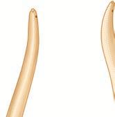

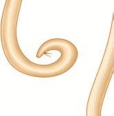

  

121 Human Health and Diseases

pain killer and is used during surgery. It is the most widely abused narcotic drug which acts as a depressant and slows down body functions.

**Cannobinoids** are a group of chemicals obtained from _Cannabis sativa_, the Indian **hemp plant (Fig. 7.10).** Natural cannabinoids are the main source of **marijuana, ganja, hashish** and **charas.** It interferes in the transport of the neurotransmitter, dopamine and has a potent stimulating action on the CNS, producing increased energy and a sense of euphoria.

**Fig. 7.10 _Cannabis sativa_ (Hemp plant)**

**Cocaine** is a white powder that is obtained from the leaves of the coca plant, _Erythroxylum coca_. It is commonly called coke or crack. Cocaine causes serious physical and psychological problems including **hallucinations** and **paranoia. The other plants with hallucinogenic** properties are _Atropa belladonna_ and _Datura_ **(Fig. 7.11 and Fig. 7.12)_._**

education and guidance would enable youth to say no to drugs and alcohol and to follow a healthy life style.

Alcohol is a psychoactive drug, which acts on the brain, affecting a person’s mind and behaviour. It is a depressant, which slows down the activity of the nervous system. The intake of certain drugs for a purpose other than their normal clinical use in an amount and frequency that impair one’s physical, physiological and psychological functions is called **drug abuse**.

The drugs which are commonly abused include **opioids, cannabinoids, coca-alkaloids, barbiturates, amphetamines and LSD**.

**Opioids are drugs which bind to specific** opioid receptors present in the **central nervous system** and **intestinal tract**. Heroin (smack) is chemically diacetyl morphine, which is white, odourless and bitter crystalline compound. It is obtained by acetylation of morphine, which is extracted from flowers of the poppy plant **(Fig. 7.9)**. **Morphine** is one of the strongest

**Group Drugs Effects**

Stimulants Amphetamines, cocaine, nicotine and tobacco Accelerates the activity of the brain

Depressants Alcohol, Barbiturates, Tranquilizers

Slows down the activity of the brain

Narcotic/ Analgesics

Opium, Morphine Act as depressants on the Central Nervous System

Hallucinogens Lysergic acid diethylamide (LSD), Phencyclidine

Distorts the way one sees, hears and feels

Stimulants, Depressants, Hallucinogens

Bhang (Marijuana), Ganja, Charas Stimulating action on the CNS and affects the cardiovascular system

**Table 7.4 Classification of drugs**

**Fig. 7.9 Opium plant (poppy plant)**

XII Std Zoology Chapter 7 EM.indd 121 18/12/2021 14:53:42

  

122Human Health and Diseases

respond only to highest doses of drugs and alcohol leading to greater intake and addiction. Excessive use of drug and alcohol leads to physical and psychological dependence. When psychological dependence develops, the drug user gets mentally **‘hooked on’** to the drug. The drug user constantly thinks only about the drug and has continuous uncontrollable craving for it. This state called “**euphoria**” is characterized by mental and emotional preoccupation with the drug.

Physical dependence is a state in which the user’s body requires a continuous presence of the drug. If the intake of the drug or alcohol is abruptly stopped, he or she would develop **withdrawal symptoms**. In a sense, the body becomes confused and protests against the absence of the drug. The withdrawal symptoms may range from mild tremors to convulsions, severe agitation and fits, depressed mood, anxiety, nervousness, restlessness, irritability, insomnia, dryness of throat, etc, depending on the type of drug abuse.

**7.3.2 Effects of drugs and alcohol** Short-term effect appears only for a few

minutes after the intake of drugs and alcohol. The abuser feels a false sense of well being and a pleasant drowsiness. Some short term effects are euphoria, pain, dullness of senses, alteration in behaviour, blood pressure, narcosis (deep sleep), nausea and vomiting.

Drugs and alcohol have long-term effect that lead to serious damages, because of the

**Fig. 7.11 _Atropa belladonna_**

**Fig. 7.12 _Datura_**

Drugs like **methamphetamine, amphetamines, barbiturates, tranquilizers,** **Lysergic acid diethylamide (LSD)** are normally used as medicine to treat patients with mental illness like **depression** and **insomnia** and are often abused.

Tobacco is smoked, chewed and used as snuff. It increases the carbon monoxide content of blood and reduces the concentration of haem bound oxygen, thus causing oxygen deficiency in the body. Tobacco contains **nicotine, carbon monoxide** and **tars,** which cause problems in the heart, lung and nervous system. Adrenal glands are stimulated by nicotine to release adrenaline and nor adrenaline which increases blood pressure and heart beat.

**7.3.1 Addiction and dependence** Addiction is a physical or psychological

need to do or take or use certain substance such as alcohol, to the point where it could be harmful to the individual. This addictive behaviour can be personally destructive to a person. Overtime addicts start to lose not only their jobs, homes and money, but also friendship, family relationships and contact with the normal world. Addiction to drugs and alcohol can lead to a psychological attachment to certain effects such as **euphoria** and temporary feeling of well being.

Repeated use of drugs and alcohol may affect the tolerance level of the receptors present in the body. These receptors then

**Alcoholism** is the inability to control drinking due to physical and emotional dependence on alcohol. Treatment involves counselling by a healthcare professional. Detoxification programme in a hospital or medical facility is an option for those who need additional assistance. Medications are available to reduce the desire to drink and smoke.

XII Std Zoology Chapter 7 EM.indd 122 18/12/2021 14:53:42

  

123 Human Health and Diseases

sought from close and trusted friends. Getting proper advice to sort out their problems would help the young to vent their feelings of anxiety and guilt.

**3\. Education and counselling** Education and counselling create positive attitude to deal with many problems and to accept disappointments in life.

**4\. Looking for danger signs** Teachers and parents need to look for sign that indicate tendency to go in for addiction.

**5\. Seeking professional and medical assistance** Assistance is available in the form of highly qualified psychologists, psychiatrists and de-addiction and rehabilitation programmes to help individuals to overcome their problems.

**7.4 Mental health – Depression** Mental health is a state of well being of the mind, with self esteem. Self esteem means liking yourself and being able to stand up for what you believe is right. Positive mental health is an important part of wellness. A mentally healthy person reflects a good personality. Activities of mentally healthy people are always appreciated and rewarded by the society as these persons are creative as well as cooperative with others. Mental health improves the quality of life.

Depression is a common mental disorder that causes people to experience depressed mood, loss of interest or pleasure, feelings of guilt or low self-worth, disturbed sleep poor appetite, low energy and poor concentration.

constant and excessive use. The physical and mental disturbance makes the life of the user unbearable and torturous. For example heavy drinking permanently damages the liver and brain.

The use of alcohol during adolescence may have long-term effects. Alcohol interferes with the ability of the liver to break down fat. Over time fat accumulation and high levels of alcohol destroy the liver cells and a scar tissue grows in the place of dead cells. This scarring of the liver is called **“Liver cirrhosis**”. Alcohol irritates the stomach lining due to the production of excess acid leading to ulcers. Excessive alcohol use weakens the heart muscle, causing scar tissue to build up in the cardiac muscle fibers. As a result, heavy drinkers have an increased risk of high blood pressure, stroke, coronary artery disease and heart attack. Korsakoff syndrome, a chronic memory disorder is most commonly caused by alcohol misuse.

**7.3.3 Prevention and control** It is practically possible to prevent some one from using drugs and alcohol. Here are some ways that help to prevent drug and alcohol abuse.

**1\. Effectively dealing with peer pressure** The biggest reason for teens to start on drugs is due to their friends / peer groups imposing pressure on them. Hence, it is important to have a better group of friends to avoid such harmful drugs and alcohol.

**2\. Seeking help from parents and peers** Help from parents and peer group should be sought immediately so that they can be guided appropriately. Help may even be

**Alcoholic Anonymous** Alcoholic anonymous was started in 1935 by a businessman and a doctor who had been a “hopeless drunk” for many years. After the men helped each other to stop drinking and to stay sober, they then founded the alcoholic anonymous to help other alcoholics. Since that time alcoholic anonymous has spread throughout the world.

XII Std Zoology Chapter 7 EM.indd 123 18/12/2021 14:53:42

  

124Human Health and Diseases

of thirty to sixty due to life style related disorders.

The following facts will help in better understanding of life style disorders.

• Life style disorder causes **cardiovascular diseases** resulting in 31 percent of global deaths.

• The sedentary life style also causes deficiency of vitamins such as **vitamin D** resulting in fatigue, tiredness, back pain, depression, bone loss, muscle pain, etc,

• Life style disorder also includes **social isolation** resulting in age related problems.

• **Eating junk** foods that have high caloric values, rich in carbohydrates and fat can lead to obesity and early health issues.

• Consumption of processed and packaged food, which lacks in fiber may result in constipation.

• Several people today complain of irritable bowel syndrome with stomach discomfort or pain and trouble with bowel movements, causing diarrhoea. The main cause of irritable bowel syndrome is stress and other illnesses.

**Life style modifications** • Avoid eating junk food and foods that have

preservatives and colouring agents.

• Physical exercises such as brisk walking and yoga can be done regularly.

• Following medical advice, if any health problems in addition to life style disorders.

• To avoid smoking drugs and drinking alcohol.

• To follow a healthy balanced diet rich in vitamins and proteins.

• 7 – 8 hours of sleep every day is required.

**Signs and symptoms of mental depression** yy Loss of self confidence and self esteem

yy Anxiety

yy Not being able to enjoy things that are usually pleasurable or interesting

Lifestyle changes like exercise, meditation, yoga and healthy food habits can help to be relieved from depression. Exercise stimulates the body to produce **serotonin** and **endorphins**, which are neurotransmitters that suppress depression. Practicing exercise in daily life creates a positive attitude . Participating in an exercise programme can: yy Increase self-esteem yy Boost self-confidence yy Create a sense of empowerment

yy Enhance social connections and relationships

Brain is one of the most metabolically active part of the body and needs a steady stream of nutrients to function. A poor diet may not provide the nutrients for a healthy body and may provoke symptoms of anxiety and depression.

**7.5 Lifestyle disorders in human beings**

The old saying that **“health is wealth”** is truly applicable to human beings. With the changes in life style, there are many emerging medical conditions and diseases that are reducing human longevity. Life style disorder result due to activities involving smoking, alcohol and drug abuse, consuming high fat diet, lack of exercise or living a latent life.

The World Health Organization (WHO) in its report cautions a slow moving public health disaster due to life style disorders in the form of non-communicable diseases like diabetes, cardiovascular and lung diseases. WHO believes that not thousands but millions of people die every year within the age group

XII Std Zoology Chapter 7 EM.indd 124 18/12/2021 14:53:42

  

125 Human Health and Diseases125

**Summary** Health is a state of complete physical and psychological well being. Many other extended factors like microbes may cause illness to human body. Protozoans like _Entamoeba_, _Plasmodium_ and _Leishmania_ cause diseases such as amoebic dysentery, malaria and kala-azar repectively. Personal cleanliness and hygiene, proper disposal of waste, safe drinking water and immunization are very useful in preventing diseases. Drug and alcohol abuse of young and adolescent is another cause of concern. Addiction to drugs and alcohol is happening due to peer pressure, examination–related and competition–related stresses. The addicted person should receive proper counselling, education and professional medical help to liberate themselves from all forms of addiction.

**Activities**

**Activity 1**: Students examine the impact of microorganisms in our daily life and consider their applied potential. They can also conduct independent research and communicate their findings. **Activity 2:** Students prepare wet mounts to observe the microbes found in curd. **Activity 3**: The leader will blow bubbles at the group of students to demonstrate how some diseases can be air borne? **Activity 4**: Which parasite acts as a transporter host for other parasites? Discuss **Activity 5**: Your friends call you a “sissy boy” because you do not smoke or chew tobacco. What answer will you give? How will you prove your strength?

1\. Freezing does not kill bacteria; it only arrests their growth.

2\. Antibiotics not only kill harmful bacteria, but also kill beneficial bacteria of our body.

3\. UTI- Urinary Tract Infection is one of the most common bacterial infections affecting 150 million people each year worldwide.

4\. World malaria day is on 25th April .

5\. Iceland and the Faroe islands are the only countries in the world, where there are “No mosquitoes” (Mosquito free countries).

6\. VCRC- Vector Control Research Center is situated in Puduchery. WHO is collaborating with the Centre for Research and Training in Lymphatic Filariasis and

Integrated Methods of Vector Control.

7\. Sterile insect technique (SIT)

The screw-worm fly was the first pest successfully eliminated from an area through the sterile insect technique, by the use of an integrated area-wide approach.

_8\. Zika virus_ could become a surgical weapon against brain cancer.

**INTERESTING FACTS**

XII Std Zoology Chapter 7 EM.indd 125 18/12/2021 14:53:42

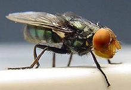
  

126Human Health and Diseases

8\. Marijuana is extracted from a) **Dried leaves and flowers of**

**hemp plant** b) Ergot fungus c) Roots of hemp plant d) Cocoa plant

9\. Choose the correctly match pair. **a) Amphetamines - Stimulant** b) LSD - Narcotic c) Heroin - Psychotropic d) Benzodiazepine - Pain killer

10\. The Athlete’s foot disease in human is caused by-------

a) Bacteria **b) Fungi** c) Virus d) Protozoan

11\. Cirrhosis of liver is caused by chronic intake of ------

a) Opium **b) Alcohol** c) Tobacco d) Cocaine

12\. The sporozoite of the malarial parasite is present in ----

**a) saliva of infected female** _Anopheles_ **mosquito.**

b) RBC of human suffering from malaria.

c) Spleen of infected humans. d) Gut of female _Anopheles_ mosquito.

13\. Haemozoin is a) A precursor of haemoglobin. b)A toxin from _Streptococcus_. **c) A toxin from _Plasmodium_ species.** d) A toxin from _Haemophilus_ species.

14\. The drug synthesised from _Datura_ is **a) Hallucinogen** b) Depressant c) Stimulant d) Pain killer

**Evaluation** 1\. Malaria caused

by _Plasmodium_ is transmitted through-------- a) Air b) Contact c) Fleas on food **d) Mosquito bites**

2\. A 30 year old woman has bleedy diarrhoea for the past 14 hours, which one of the following organisms is likely to cause this illness?

a) _Streptococcus pyogens_ b) Clostridium difficile c) **Shigella dysenteriae** d) _Salmonella enteritidis_

3\. Which of the following disease is spread through droplet nuclei?

a) Tularemia b) Listeriosis **c) Chicken pox** d) Mumps

4\. Exo-erythrocytic schizogony of _Plasmodium_ takes place in -------

a) RBC b) Leucocytes c) Stomach **d) Liver**

5\. The sporozoites of _Plasmodium_ _vivax_ are formed from ------------

a) Gametocytes b) Sporoblasts **c) Oocysts** d) Spores

6\. _Poliomyelitis_ which causes infantile paralysis enters the body through……….

a) Skin b) Mouth and nose c) Ears **d) Eyes**

7\. Amphetamines are stimulants of the CNS, whereas barbiturates are ----

a) CNS stimulant b) both a and b c) hallucinogenic **d) CNS depressants**

XII Std Zoology Chapter 7 EM.indd 126 18/12/2021 14:53:42

  

127 Human Health and Diseases

15\. Match the pathogens with respective diseases caused by them and select the correct match using the codes given below.

_A. Leishmania donavani_ - i. Amoebiasis _B. Wuchereria bancrofti_ - ii. Kala – azar _C. Trypanosoma gambiense_ - iii. Sleeping sickness _D. Entamoeba histolytica_ - iv. Filariasis

**a) A-ii, B-iv, C-iii, D-i** b) A-ii, B-iv, C-i, D-iii c) A-iii, B-i, C-ii, D-iv d) A-i, B-iv, C-iii, D-ii

16\. Complete the following table:

**Diseases Causative agent Site of infection**

Mumps

Chicken pox

Dengue fever

17\. List the causative agent, mode of transmission and symptoms for Diphtheria and Typhoid.

18\. Compare and contrast bacillary dysentery and amoebic dysentery.

19\. A patient was hospitalized with fever and chills. Merozoites were observed in her blood. What is your diagnosis?

20\. (i) Write the scientific name of the filarial worm that causes filariasis. (ii) Write the symptoms of filariasis. (iii) How is this disease transmitted?

21\. List the common withdrawal symptoms of drugs and alcohol abuse.

22\. What is Kala-azar?

23\. Why do you think it is not possible to produce vaccine against 'common cold'?

24\. Tabulate the causative agent, mode of transmission and symptoms of the viral diseases in man.

25\. Write a note on the Protozoan diseases.

26\. Explain the life-cycle of Plasmodium in man.

27\. Suggest some ways to prevent drug and alcohol abuse.

XII Std Zoology Chapter 7 EM.indd 127 18/12/2021 14:53:42

  

128Human Health and Diseases

**C on**

**ce pt**

**M ap**

XII Std Zoology Chapter 7 EM.indd 128 18/12/2021 14:53:42

