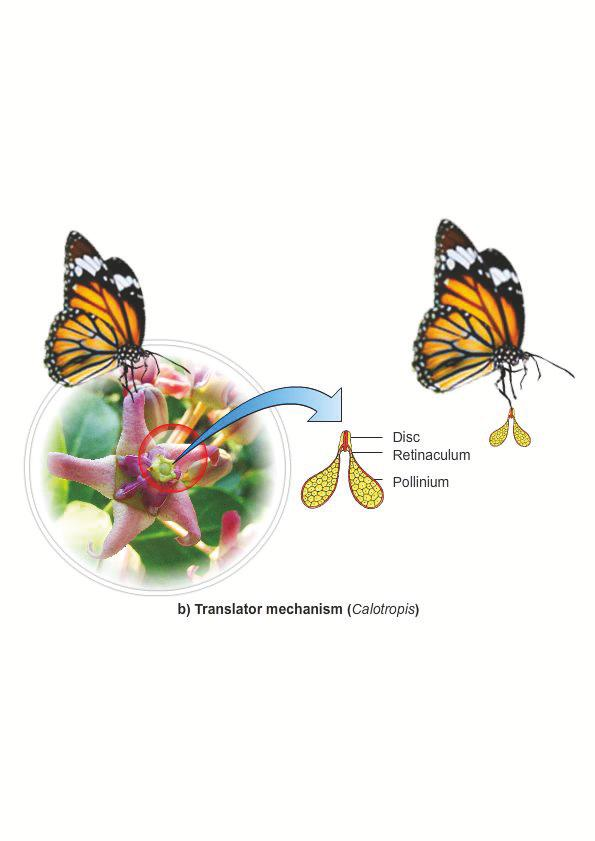
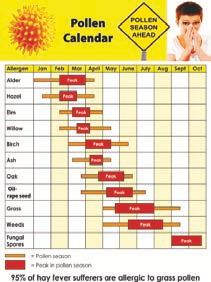

. & அலகு 14: தாவரங்களில்‌ இனப்பெருக்கம்‌. பாடம்‌ தாவரங்களில்‌ 1 பாலிலா இனப்பெருக்கம்‌ மற்றும்‌ பாலினப்பெருக்கம்‌.

கற்றல்‌ நோக்கங்கள்‌:

௫. கீழநிலை உயர்நிலை உயிரினங்களின்‌ பல்ேறு இனப்பரக்கமுறைகளை கறிய

உலகில்‌ வாழும்‌ உயிரினங்களின்‌ அத்தியாவசியமான: பண்புகளில்‌ ஒன்று இனப்பெருக்கம்‌ ஆகும்‌. உலகில்‌ சிற்றினங்கள்‌ நிலைத்திருப்பதற்கம்‌, வேறுபாட்ட்‌ மூலம்‌ தகுந்த மாற்றங்களுடன்‌ சந்ததிகள்‌ ஜொடர்்து வாழ்வதற்கும்‌ இனங்வருக்கம்‌. ஒரு முக்கியமான. \[நிகழ்வாக உள்ளது. தாவர இனப்பெருக்கம்‌ தாவரங்கள்‌ 'இலைத்து வாழ்வதற்கு மட்டுமல்லாமல்‌, தாவரங்களை “நேரடியாகவோ அல்லது மறைமுகமாகவோ சார்ந்து வாழும்‌ மற்ற எல்லா உயிரினங்களும்‌ தொடர்ந்து நிலைத்து வாழ்வதற்கு முக்கியமானதாக உள்ளது.

கேழீட்கள்‌.. ஈடுபடாமல்‌ தன்னுடைய ந்த சசிற்றினங்களை . பெருக்குவதற்கு உதவம்‌ "இனப்பெருக்க முறை பாலிலா இனப்வருக்கம்‌ என்று அழைக்கப்படுகிறது. பதினோராம்‌ வகுப்பில்‌ அதை

ஹவராடுஞ்௦9ட/

(லிருந்து இனப்பெருக்கம்‌ உயிரினங்களின்‌ ஒர. முக்கிய பண்பு என்பதை தெரித்துக்‌ கொண்டோம்‌. மெலும்‌ இங்கு பல்வகை இனப்வருக்க்‌ பறற விவரிததள்ளோம்‌.... பரிணாமத்தில்‌. கழ்றிலைத்‌ தாவரங்கள்‌, பூஞ்சைகள்‌, விலங்குகளில்‌ பல்வகை. பாலில்‌... இனப்பெருக்க முறை காணப்படுகிறது. வொணிடியங்கள்‌. சோற்றுவிக்கல்‌. (ஆஸ்பரிஜில்லஸ்‌, வனிகியயேம்‌, வாட்ட விடல்‌ (ஈஸ்ட்‌, ஹைப்ர்‌ துண்பாகுதல்‌ (ஸ்பைறோகைரர்‌, சம்பா உருவாதல்‌. (மார்கன்வியா மீளுருவாக்கம்‌ பிரனேரியா மற்றும்‌ “இரு பிளவருகல்‌ (பாக்கியங்கள்‌) போன்றவை சில. மாலிலா இனப்பெருக்க முறைகளாகும்‌. பதினோராம்‌. வகுப்பில்‌ அக (டல்‌ உள்ள படம்‌ ஒன்றைக்‌ காண்க. இநத. இனப்வருக்க. முறையில்‌ தோன்றும்‌ உயிரினங்கள்‌ புற அமைப்பிலும்‌, மரியலிலம்‌ ஒத்திருப்பதால்‌... நகல்கள்‌. மோஷ. என்று, மறியப்பரகின்றண உயற்தாவரங்களும்‌ பாலிகா.

1மீதழைவழி பெருக்கம்‌ (469910 ார£0வப0),

ற்‌ ள்‌ (144பாவி ற ௪௦09).

தழைவழி இனப்பெருக்கத்தில் தாஷங்களைக்‌.

இயற்கையாக மொட்டுகள்‌ வளர்ந்து புதிய தருகின்றன. மொட்டுகள்‌ வேர்‌, தண்டி, இலை: போன்ற உறுப்புகளில்‌ தோன்றலாம்‌. ஒரு குறிப்பட்ட நிலையில்‌ புது தாவரம்‌ பெற்றோர்‌ தாவரத்திலிருந்து மிிக்க்பட்டி புதிய தாவரமாக உருவாகிறது. சில:

தழைவழி இனப்பருக்கந்தில்‌ ஈடுபடும்‌ தாவர. உறுயுகள்‌ சேமிப்பு மற்றும்‌ பல ஆண்டு வாழும்‌: தன்மை உடையதாகும்‌, தாவர இனப்பேருக்கதகிற்கு மயன்படும்‌. அலகு... இனப்பெருக்க... உறுப்புகள்‌ ((ஜாமவ்வ்ட ராரக(ப28) அல்லது பரவல்‌ உறுப்புகள்‌ (0௭௯௮) என்று அறியப்படுகின்றன. தழைவழி. இனப்வருக்கத்திற்கு உதவுகின்ற சில உறுப்புகளின்‌: படம்‌ ப-ல்‌ கொடுக்கப்ப ்டுள்ளது.

அ) வேரில்‌ தழைவழி இனப்பருக்கம்‌:

(சப ளுப்பபிரா 1௦009)

சில தாவரங்களின்‌ வெர்களில்‌ தழைவரி கல்லது. மாற்றிட... ஷாட்டுகள்‌. தோன்றுகின்றன. ுத்துக்காட்டகள்‌. முறையா, பாவ்பர்ஜியா மற்றம்‌ மில்வில்போண்யாசிலகிழங்கு ஷவமாற்றிடவேர்கள்‌. வொட்டுகளை தோம்றுவிபபதைத்‌ தன்ர உணவையும்‌.

ஆ! தண்டில்‌ தழைவழி இனப்பெருக்கம்‌ (69221௨ ரறமஸ்பிளா ராடு,

பதினோராம்‌ வகுப்பில்‌ அலகு -லிருந்து பல்வகை 'தரைகிழ்‌ தண்டு மற்றும்‌ தரை ஒப்டிய தண்டின்‌

நீர்றிலைகளை பாரிக்கும்‌ நீ்‌ ்‌ ஹையாசிந்த்‌ (க்க்னியா\] கராகிபஸ்‌).. என்ற தாவரம்‌ நீர \[இலைகளான குனம்‌, எர மறறும்‌ நீர தேக்கங்களில்‌ மருவும்‌. களையாகும்‌... இது பொதுவாக £வங்கத்தின்‌ சச்சறுக்தல்‌" என்று சறியம்படுகிறது. இது வேகமாக வி நூல்‌. கஷந்தள்ள ஆக்கஜனை குறைத்து மற்ற \[நீர்வாழ்‌ உமிரினங்கள்‌ மடய காரணமா

உருமாற்றங்களை பறி... நீங்கள்‌. நன்கு அறிந்தரபர்கள்‌. இலைகளில்‌ மட்பறிலத்‌ தண்ட. (மியூசா. பரடிசியாக்கா.. மற்றம்‌. தின்னிஃவர்‌ பபிசினாமே, ுர்சமா மாங்கா) தரையடக்கிழங்க. (கமோரிபொபாலஸ்மற்றும்‌ கொலகேகனியா கிழங்க. (சொலானம்‌ டயூபரோசம்‌) குமழத்தண்டு (சல்வியம்‌ சப்பா மற்றும்‌ வில்லியம்‌, ஓம தண்டி (சன்படல்லா ஏசியாட்டிகர்‌ வேற்வடம்‌ ஓதண்டி(மென்தாமற்றம்‌

ஒபிரகேரியர்‌, நீர்‌. ஒடு தண்டி புஸ்டியா, க்கார்னியா).. தரைகீழ்‌. உந்து... தண்டி \[(கிரைசான்திமம்‌),.. சிறு. குமிழ்‌ மொட்டுக்கள்‌

(மயாஸ்காரியா, . அகேஸ்‌)... மட்டநிலத்தண்டீன்‌: குணுவின்‌ கோணோட்ட மற்றும்‌ கிழங்கின்‌ கண்‌ அமைப்பிலிரந்தம்‌.. புதிய தாவரங்கள்‌ தோன்றுகின்றன.

"இ இலையில்‌ தழைவழி இனப்பெருக்கம்‌ (16921. ரஸல்லிளா பஸ்‌,

சில தாவரங்களில்‌. இலைகளில்‌ மாற்றிடத்து மொட்டுகள்‌ தோன்றுகின்றன. இவை வற்றோர்‌. தாலரத்திலிர்து பிரித்து புதிய தனி தாவரங்களாக. வனர்கின்றன.எடுக்தக்காட்ுகள்‌.பிரையயோஃபி்லம, கில்லா... வெகொணியா... பிரைபயாஃபில்லத்தில்‌ “சதைப்பற்றுள்ள மற்றும்‌ விளம்பல்‌ பள்ங்களுடைய இலைகள்‌ உள்ளன... இப்பள்ளங்களில்‌ வேற்றி. மொட்டிகள்‌ தோன்றுகின்றன. இவை இலைவளர்‌ காட்டுகள்‌... (ஒரு. பேர. என்று, அறியப்பருகின்றன...... தலை. கழகியதும்‌ "இவ்வமைப்பில்‌ வேர்‌ தொகுப்பு உருவாகி தனி. காவறங்களாக மாறுகின்றன. சில்லா ஆற்று மணலில்‌. கும்‌ ஒரு கமிழ்தண்ட தாவரமாகும்‌. இதன்‌ தழை

உ. இஷங்களில்‌ பாவிவ இனம்வருக்கம்‌ மற்றும்‌ பாலினப்வரக்க்‌
ணா 1) ட அரை) வ்வறடிம்விக நகை கவ்‌ வன்‌ க்ப்‌ து கணும்கப்பதறி வெ ்‌ லண (ஸு வழஷன்‌ட - சி்தில்‌ அப்சன்‌ ப ப்ப ம ட்‌ (இ ஹணவுவவ்கு - சொவிகனிமா கண்ணிகி்து சொப்டு ஜோன்ஸ்‌ (இக்க - வாலான்‌ மயம்‌ பதையற்ுபை மெம்‌ இலை. ோனனெப் நுரகய நண்‌ கே்ற்பவோகள்‌ (| உறையை கமிழநண்டு - அுலஸிம சியா. இக. (வ கர்ன்‌ர' கலி ட்ட மெறில்‌ இக்‌ ஸ்ஸ்‌ ர்‌ ஜஹி (ம உற மட ்ண்ட - சிலிம்‌ \* இம ஷி வம மன்க்‌்‌

படம்‌ அ- ஓ தாவரங்களின்‌ இயற்கை தழைவழி இனப்பெருக்க முறைகள்‌

ாஷங்களில்‌ பாலிய இனப்வருக்க்‌ மற்றும்‌ பாலினப்வருக்க்‌

ஹவராடுஞ்௦9ட/

"இலைகள்‌ நீண்டம்‌, மறுகியம்‌ உள்ளன. இவற்றின்‌:

நுணியில்‌ இலைவளர்‌ ஷாட்டுகள்‌ தோன்றி அவை.

தரையை தொட்டவுடன்‌ புது தணி தாஷரங்களாக.

மாறுகின்றன.

"இயல்பு தழைவழி இனப்வெருக்கத்தின்‌ நன்மைகள்‌

(மினா ராரசபவ 6ஷமப்க க்கி)

\*- இனப்வருக்கத்திற்கு ஒரு வற்றோர்‌ மட்ம்‌ போதுமானது.

தோன்றிய புதிய மரபணுகன்மையுடையவை.

ட சில தாவரங்களில்‌ இது எளிதில்‌ பரவுதலக்கு உதவுகிறது. எடுத்துக்காட்ட ஸ்பைன$ஃவக்ஸ்‌

*   தோப்பக்கலை வல்லுமர்களும்‌, விவசாயிகளும்‌ இயல்பான தழைவழி இனப்பெருக்கம்‌ மய்ய, உதவும்‌ இந்த உறுப்புகளை பமிழாக்க்தற்க மயன்படத்துகின்றனர்‌ மற்றும்‌ பெறிய சனவில்‌

தாவரம்‌. ஒத்த.

தாவரங்களை. அறுவடை செய்யவும்‌. மயன்பருத்துகின்றனர்‌. "இயல்பு தழைவழி இனப்பெருக்கத்தின்‌ தீமை:

'(டுஷம்ளா(0௦ 0! ஈயா 99620 (ஷம்‌ 0ர, “புதிதாக உருவாகும்‌ தாவரங்களில்‌ மரபணுசார்‌. "வேறுபாடு காணப்பருவதில்லை.. 12.2 செயற்கை முறைகள்‌ (88106 1/61௦09) மேல... குறிப்ிட்டள்ள இயல்பு தழைவழி இனப்பெருக்க முறைகளைத்‌ தவிர 'வேளான்மையிலும்‌, தோட்டக்கலையிலும்‌ அவற்றின்‌ உறுப்புகளிலிருந்து தாவரங்களை பெருக்குவதற்கு மல. வழிமுறைகள்‌ பயன்படுத்துகின்றன.. இவை. செயற்கை இனப்பெருக்க முறைகளாகும்‌. சில: செயற்கை இனப்பெருக்க முறைகள்‌ மனிதர்களால்‌. நீண்ட காலமாக பயன்பருத்தப்படுகின்றன. இவை பாரம்பரிய முறைகளாகும்‌ (200பசாய்ராகி ஈாச1௦09). அன்மைக்காலங்களில்‌ . குறைந்த. நேரத்தில்‌ கூடுதலான... எண்ணிக்கையில்‌ தாவரங்களை உருவாக்க தொழில்நுட்பம்‌ பயன்படுத்தப்புகிறது. 'இம்முறைகளை நவீன முறைகள்‌ (ஈ௦ப்ஸா ஈன்‌) என்று அழைக்கலாம்‌, பாரம்பரிய முறைகள்‌ (ோளார்மாவி ஈ21௦09. பொதுவான பாரம்பரிய முறைகளில்‌ போத்துநல்‌, ஒட்டுதல்‌, பதியம்‌ போருதல்‌ போன்றவை சடங்கும்‌. ௯) போத்துகள்‌ (பரி: இம்முறையில்‌ பெற்றோர்‌ தாவரக்கிலிருந்து வேர்‌, தண்டி இலை போன்ற. பாகங்களை. போத்துகளாக பயன்படுத்தலாம்‌. வெட்டிய பகுதிகள்‌ குந்த ஊடகத்தில்‌ வைத்தபின்‌ புதிய தாவரம்‌ உருவாகிறது. இது வேர்களை உருவாக்கி புதிய தாவரமாக வளர்கிறது. மயன்மருத்தப்படும்‌ பாகத்தின்‌ அடிப்படையில்‌ வேர்‌

போத்துகள்‌. (மம்கானியா, . பிரைபியாஃபில்லம்‌. தண்டி... போத்துகளே வரும்பாலும்‌ 'இனப்பெருக்கத்திற்கு பயன்படக்கபபடகின்றன.

ஆ) ஒட்டுதல்‌ (ஸனாயு: இம்முறையில்‌ இரண்ட, வெவ்வேறு... தாவரங்களின்‌. பாகங்கள்‌: "இணைக்கப்பட்டு அவை தொடர்ந்து ஒரே தாவரமாக. வளர்கின்றன... இந்த. இரண்டு. தாவரங்களில்‌ தரையுடன்‌. தொடர்புடைய தாவரம்‌ வேர்கட்டை: (மஸ) என்றும்‌. ஒப்ருதலுக்கு பயன்பரத்தப்பும்‌ தாவரம்‌. இட்டத்தண்டி.. (2௯௦)... என்றும்‌ 'ஜியப்புகின்றன (டம்‌ 42 அ). எு்துக்காட்ுக்‌: எலுமிச்சை, மா மறறும்‌ ஆப்பிள்‌. வேர்கப்டை மற்றும்‌ ஒட்டத்தண்டு இடையே எற்படம்‌ இணைப்பைச்‌ சார்ந்துபல்வகை ஒட்டுதல்‌ உள்என.அவை( மாட்டி ஒட்டல்‌ (9 அணுகு ஒட்டுதல்‌ () நா ஒப்ல்‌ (1) நனி. ஒட்டக (4 ஆப்ப ஒட்டுதல்‌ என்பனவாகும்‌.

4.  மாட்ட ஒட்டதல்‌ (94 ரான: வேர்கட்டையில்‌: ஒரு ர-வடிவ கீறல்‌ ஏற்படத்தப்புகறது. பின்பு மரப்பப்டை தூக்கப்புகிறது. சிறிது கட்டையன்‌: சேர்ந்த ஒட்டத்தண்டு மொட்டு கீறலில்‌ பட்டைக்கு கீழே வைக்கப்படுகிறது. பிறகு இது சரியாக ஒரு டேப்‌

பயன்படுத்தி சுற்றப்படகிறது. அணுகு ஒப்டுதல்‌(4291௦எள்‌ எனி: இம்முறையில்‌ வேர்கட்டை, . ஒப்டுந்தண்டு.. இரண்டுமே

'வேருன்றியுள்ளன. வேர்கட்டை ஒரு தொட்டியில்‌. வளர்க்கப்படகிறது..... இது. ஒட்டுத்தண்டுடன்‌ கருக்கமாக கொண்டு வரப்படுகிறது. இரண்டும்‌. ஒரே அளவு கடிப்புபையதாக இருத்தல்‌ அவசியம்‌, இரண்டிலும்‌ ஒரு சிறிய சீவல்‌ வெட்டப்பட்ட நீக்கப்படுகிறது. இரண்டின்‌ வெட்டப்பட்ட பரப்புகும்‌ ஒன்றையயான்று நெருக்கமாக கொண்டு வரப்பட்டு கப்டப்பட்டு ஒரு டேப்பினால்‌ சற்றப்படகின்றன. 1-4 வாரங்களுக்கு பிறகு வேர்கட்டையின்‌ நுனியும்‌ ஒட்டந்தண்டின்‌ அடும்‌. நீக்கப்பட்டு தணிச்தனி. கொட்டியில்‌ வளர்க்கப்பரகின்றன.

இ நா ஒட்டுதல்‌ ("ரப எவ்‌: ஒரே பருமனுடைய ஒட்டக்தண்டு மற்றும்‌ வேர்‌ கட்டையை சாய்வாக. வட்டி ஒட்டித்தண்டை வேர்கட்டையுடன்‌ டேப்‌ பயன்பருத்தி ஒட்ட வேண்டும்‌,

௫0) நுனி ஒட்டுதல்‌ (ஸே ஏன: வேர்கட்டை அளவில்வரியதாக இருக்கம்போது ஒட்டுக்கட்டைகள்‌ ஆப்பு வடிவத்தில்‌ வெட்டப்பட்டு, வேர்கட்டையில்‌, உண்டாக்கப்பப்ட பிளவில்‌ அல்லது பள்ளத்தில்‌ வருகப்பருகின்றன. பின்பு இவை நிலையான: ஒட்டல்‌... ஷழுகு பயண்படுக்தி நிலை: நிறு்கப்பகறது.

9.  ஆப்பு ஒட்டுதல்‌ (14660௦ னினது; இம்முறையில்‌. வேர்‌ கட்டையில்‌ துளை அல்லது மரப்பட்டையில்‌, “வட்டு ஏற்படத்தப்பருகிறது. ஒட்டக்கண்டின்‌ கச்சு கிளையை இதில்‌ சொருகர்‌ செய்து உறுதியாக,

போத்துகள்‌ (மால்‌, தண்டு போத்துகள்‌ இணைத்து, இரண்டன்‌ கேம்பியமும்‌: (ஹையிஸ்கஸ்‌, பொகன்வில்லா, மாறிங்கா, இலை இணைகக்கப்படுகின்றன. உ. இஷங்களில்‌ பாலிவ இனம்வருக்கம்‌ மற்றும்‌ பாலினப்வரக்க்‌ஹவராடுஞ்௦9ட/

வ ன்‌ ணம ன்‌ ஆஸ கடை கோய்‌ ஒரே வேவாட வட எஸ... பி சதை ஸடுஹ்‌ 0 நட்‌ பரன்‌ என. கடிடமுஸ்‌.

அ) ஒட்டதலின்‌ வகைகள்‌: படம்‌ 12 ௯ தாவரங்களின்‌ சயற்கை தழைவழி இனப்வருக்க முறைகள்‌

செயல்பாடு

பண்டிடு மம.

இடபம்‌ போல்‌ படல்‌ கபமும்‌. இட ட்‌ வேணா. காக்கின்‌ சண்ட எச்ச இழக்க இலல இர்‌

ஒப்டியிருக்கம்‌. போது. அதிலிருந்து. வேர்கள்‌

தோன்றுவதற்கு... தூண்டப்பரகிறது.... வேர்‌ ிண்றுபதிம்‌ பயிறு 'தோன்றியபின்‌ வேர்‌ பகுதி வட்டி நீக்கப்பட்ட புதிய இபதியமிடதலின்‌ வகைகள்‌: 'தாவரமாகிறது. எுததக்காட்டுகள்‌: இக்சோரா மற்றம்‌ ்‌

ஜாஸ்மினம்‌. மண்முட்டு பதியம்‌ மற்றும்‌ காற்று படம்‌(2ஆ(தாவரங்களின்‌ செயற்கை தழைவழி. மதியம்‌ போன்றவை சில வகை பதியங்களாகம்‌. "இனப்பருக்க முறைகள்‌:

மடம்‌ 12ஆ)

ந முண்முட்டி மதியம்‌ (வாம்‌ (ஷிஸால: பாரம்பரிய முறைகளின்‌ நிறைகள்‌ (சமிகா(௯ 01 நெகிழ்வுத்தன்மையுபைய கிளைகள்‌ பெற்ற 0979ரர்சாகிஈ்ம்ட. . தாவரங்களில்‌ இம்முறை பயன்படத்தப்பறகிறது. . \* பாரம்பரிய முறைகளின்‌ மூலம்‌ உருவாக்கப்படும்‌

'இவைகளுடைய அடிகிளையை வளைத்து தரைப்‌ தாவரங்கள்‌ மரபணு நீதியாக ஒரே பகுதிக்கு எுத்துச்‌ ஊன்று தண்டி மண்ணினுள்‌. மாதிரியானவை.

புதைக்கக்படகிறது. தண்டின்‌ நுனி கரையின்‌ மேல்‌. இம்முறையின்‌ மூலம்‌ சஷிக தாவரங்களை: உள்ளது... புதைக்க... தண்டிலிருந்து... வேர்கள்‌ 'குகிய காலத்தில்‌ உருவாக்கமும்‌. தோன்றிய பின்‌ பெற்றோர்‌. தாவரக்கிலிறந்து.. சல தாவரங்கள்‌: விசைகளை வெட்டப்படிவதால்‌, புதைந்த பகுதி தணி தாவரமாக. உருவாக்குவதில்லை கல்லது மிகக்‌ குறைவான வளர்கிறது. விதைகளை உருவாக்கும்‌, இன்னும்‌ சீல. இ காற்று பதியம்‌ (ம்‌ ஷிவ: இதில்‌ தண்டி தாவரங்களில்‌ உருவாக்கப்படும்‌ விதைகள்‌ கணும்பகுதியில்‌ செதக்கப்புகிறது. இப்பகுதியில்‌, முளைப்பதில்லை.

வளர்ச்சி. ஹார்மோன்கள்‌ சேர்ப்பதால்‌ வேர்‌ எடுத்துக்காட்டிகளில்‌: உருவாதலை தூண்டுகிறது. இப்பகுதி ஈரப்பதமான இம்முறைகளின்‌.. மூலம்‌: மண்ணால்‌ மூடப்பட்டு பாலிதீன்‌ உறையிடம்படகிறத. “குறுகிய காலத்தில்‌ அதிக '2- க மாதத்திற்குள்‌ இக்கிளைகளிலிருந்து வேர்கள்‌ தாவரங்களை உருவாக்‌ தோன்றுகின்றன. இல்வாறு. வேர்கள்‌ தோன்றிய மூவ்‌.

கிளைகள்‌ பெற்றோர்‌ தாவரத்திலிரந்து நீக்கப்பட்ட... நழைவழி இனப்பெருக்கம்‌

'தனிஷாட்டி அல்லது தரையில்‌ வளர்க்கப்படகின்றன. நல்க வலவில்காமல்‌ ஜாஷங்களில்பாலிலா இனப்வரு்கம் பற்றும்‌ பாலினப்வருக்கம்‌... 5

ஹவராடுஞ்௦9ட/

ஒரு. சில. தாவரங்களை வருக்கமபையச்‌ செய்யமுடியும்‌. எடுத்துக்காட்டு: சொலானம்‌: முழூயரோசம்‌

உ நோய்‌ எதிர்ப்பி உயர்‌ விளைச்சல்‌ போன்ற "விரும்பத்தக்க பண்புளை கொண்ட இரண்டு, 'எவெவ்வேறு தாவரங்கள்‌ ஒட்டு செய்யப்பட்ட பதிய. தாவறங்களாக அதேவிரும்பத்தக்க பண்புகளுடன்‌: வளர்க்க முடியம்‌.

பாரம்பறிய முறைகளின்‌ குறைகள்‌ (04க௦்‌௭ா(50%.

என்னய ஈமம்‌

ஈட வைஸ்‌ தொற்று கொண்ட பெற்றோர்‌. தாவரங்களை 'இம்முறைகளில்‌. மயன்மருக்கும்போது வைரஸ்தொற்றுக்‌ கொண்ட புதிய தாவரங்கள்‌ உருவாக்கப்படுகின்றன.

உ. தழைவழிம்‌ பருக்கத்திற்காக பயன்படத்தப்பம்‌: தழை உறுஃ்புகள்‌ (அமைப்புகள்‌) பருத்ததன்மை. கொண்டுள்ளதால்‌ அவைகளை சேமித்து "வைப்பதும்‌, கையாள்வதும்‌ கடினம்‌,

19 பாலினப்‌ பெருக்கம்‌ (9லயபச ஈஷா௦ப்ப௦10)

கீட்றலைத்‌.. தாஷங்களான..... பாரிக்‌, மரையோஃ்பைட்களில்‌ நடைவறும்‌ இனப்பேருக்க. முறைகள்‌ பன்றி முந்தைய வதப்பகளில்‌ விரிவாக, முத்திப்‌, பாலினப்‌ பெருக்கம்‌ ஆண்‌, வண்‌ கெமீப்களின்‌ உற்பத்தி மற்றம்‌ இணைவு ஆகிய நிகழ்ச்சிகளை உள்ளடக்கியது. இதில்‌ முந்தைய: நிகழ்வு கேமீட்‌ உருவாக்கம்‌. (டால்ஸஸ) என்றம்‌, பந்தைய நிகழ்வு கருவறுகல்‌ (ஸ்டலிா, என்றும்‌... அழைக்கப்புகிறது..... பாசிகள்‌, மரையோஃபைட்களில்‌. நடைபெறும்‌... பாலினப்‌ வருக்க முறைகளை நினைவு கூர்வோம்‌. அலை. சிற்றினத்தைம்‌ வறுத்து நகரும்‌ சஸ்லது நகர. இயலா கேமீட்களை உற்பத்தி செய்த இனப்வருக்க்‌ செய்கின்றன. கேமீட்களின்‌. இணைவு மூன்று, வகைப்படும்‌. வமட்களின்‌ இணைவு னர\]. மமமற்ற. சேமீடசளின்‌ இணைவு, (எலா, முப்டைக்‌ கருவும்‌ (மனா). பார்களில்‌ வளக்‌. ரவறுசலும்‌ உயர்‌ தாவரங்களில்‌ உட்கருவறுசலம. நடைவெறுகின்றன.

மலர்‌.

காலங்காலமாக மலர்களைப்‌ பற்றி. பன்பியாண நோக்குகள்‌ நிலவுகின்றன. மலர்கள்‌ கனிகளுக்கு உற்ககளு்டம்‌ கும்ப உள்ளை அனைத்து கக்‌ விரைக்களிலும்‌சஸங்கரப்பொருளாய்‌ விளங்குகின்றது தமிழ்‌ இலக்கியத்தில்‌ ஐவகை நிலங்கள்‌, பல வகை: மர்கனால்‌ கறபிபப்ட்டள்ன.. சில நாளின்‌ கொஙகளிலம்‌ மலர்கள்‌ இபம்‌ பற்றுள்ள. இலை. வானை தரன்‌ தவறியும்‌.

'இனப்வருக்கத்திற்காக... மிகவும்‌. சருக்கமபைந்த "தண்டுத்‌ தொகுதியாகும்‌, பதினோராம்‌ வகுப்பில்‌ அலகு டல்‌ மலர்களின்‌ பாகங்களைப்‌ பற்ி நீவீர்‌ படித்ததை. நினைவு கூர்வோம்‌. ஒரு மலர்‌ நான்கு வட்டங்களைக்‌ கொண்டுள்ளது... புல்லிவட்டம்‌, கல்லிவட்டம்‌ முகரந்தக்காள்வட்டம்‌, கூலைவப்டம்‌. இவற்றில்‌ “இன்றியமையாத உறுப்பகளாகும்‌ (பூம்‌ 15) உயர்‌ தாவரங்களில்‌ பாலினப்‌ பெருக்கத்தில்‌ நடையபறும்‌ நிகழ்வு மற்றும்‌ மாற்றங்கள்‌ மூன்று படிநிலைகளில்‌ கருவுறுகலுக்கு பின்‌ நடைபெறும்‌ மாற்றங்களாகு்‌. 'இந்றிகழ்வுகளை விரிவாக விவாதிப்போம்‌.

படம்‌ (அ; மலறின்‌ பாகங்கள்‌.

௩4 கருவுறுதலுக்கு முந்தைய அமைப்புகள்‌

மற்றும்‌ நிகழ்வுகள்‌: தாவரங்களில்‌ ஏற்படல்‌ ஹார்மோன்‌ மற்றும்‌ வளர்ச்சி மாற்றங்கள்‌. மலர்‌ தோற்றுவியின்‌: 'வேறுபாமறுகலக்கம்‌: வளர்ச்சிக்கும்‌. வழிவகுக்கின்றன... கருவறுகலுக்கு முந்தைய அமைப்புகள்‌. மற்றும்‌... நிகழ்வுகள்‌ கீழே. கொருக்கபட்டள்ளன.

௩47ஆண்‌ இனப்பெருக்க பகுதி -மகரந்தத்தாள்‌ மகரந்தத்தாள்‌. வப்பம்‌ மகரந்தத்தாள்களால்‌ ஆனது. “இவ்வாரு மகரந்தத்தாளும்‌ ஒரு மகரந்தப்பையையம்‌ இரு மகரந்தத்தாள்‌ கம்பியையும்‌ கொண்டது. மரந்க்‌ 'பையிலுன்ள மகரந்தத்‌ துகள்கள்‌ ஆண்‌: கேமீட்டக தாவரத்தைக்‌ குறிக்கின்றன... இப்பாடத்தில்‌ மகரந்தப்பையின்‌ அமைப்பு மற்றும்‌ வளர்ச்சி பற்றி விரிவாகக்‌ காண்போம்‌.

ல்‌ திரள்களால்‌ ஆனது. இதன்‌ வளர்ச்சியின்‌ போது, மகரந்தப்பை. நான்கு. மடல்களைக்‌ கொண்ட 'அமைப்பாகிறது. ஒல்‌லொரு மடலிலும்‌ ஒன்று கல்லதுஹவராடுஞ்௦9ட/

ச வமுபதன்‌ பனக படம்‌1ச;மகரந்தப்பையின்‌ வளர்ச்சிப்‌ படிநிலைகள்‌.

அளவில்‌ வரிதாகின்றன. இவைமுன்ஸித்து சல்களாக செயல்படுகின்றன... இந்த முன்வித்து. மால்கள்‌ பரிதிக்கணையான தளத்தில்‌ பகுப்படைந்து ராண்டி சன) புறத்தோலை நோக்கி முதல்நிலை புறக்க (மனஸி செல்களையும்‌, மகரந்தப்பையின்‌ உட்புறம்‌ நோக்கி முதல்நிலை வித்துருவாக்க (ரூயமஜனல) செல்களையும்‌. தோற்றுவிக்கின்றன... முதல்நிலை. புறக்க செல்கள்‌ தொடர்ச்சியாக பிதிக்கிணையான. தள மற்றும்‌ ஆரத்திற்த இணையான பகப்படைந்து 2 2 த அடுக்குகள்‌ கொண்ட மகரந்தப்பைச்‌ சுவரை உருவாக்குகின்றன... இவை புறத்தோலிலிருந்து உட்புறம்‌ நோக்கி எண்டோதீசியம்‌, இடை கரக்குகள்‌: மற்றும்‌ பட்டம்‌ என்ற பகுதிகளை கொண்டுள்ளன. நுண்வித்துருவாக்கம்‌. (ிரஷஹராமசாகக்‌): 'இருமயநுண்வித்துதாய்‌ சல்‌ குன்றல்பகுப்படைந்து ஒருமடிய. துண்வித்துள்‌.. உருவாகும்‌ மடநிலைகளுக்கு நுண்வித்துருவாக்கம்‌: (ரஸஷஸ௦லாமக) என்று பயர்‌. முதல்நிலை வித்து செல்கள்‌ நேரடியாகவோ அல்லது சில குன்றலிலா மெப்புகளுக்கு உப்பட்டோ வித்துருவாக்க திசுவைத்‌ (ஞஸஜாவக.. ச)... தோற்றுவிக்கின்றன. 'வத்துருவாக்க திசவின்‌ கடைசி செல்கள்‌ நுண்வித்து 'தாய்‌ செல்களாகச்‌ செயல்படுகின்றன. ஒவ்வொரு நுண்வித்து தாய்‌ சல்லும்‌ குன்றல்‌ பகப்பற்று நான்கு

ணர்ச்சி நிலைகளை உற்று நோக்கி பதிவு, ர

ஒருவைய நுண்வித்துகளைத்‌ நோற்றுவிக்கின்றன நான்சமை நுண்வித்து இந்த நான்கமை வித்துகள்‌ நான்முக்பு குறுக்கு மறுக்கு,நேர்கோட்டு இருமுகபபு 7. வடிவ. அமைப்பில்‌ உள்ளது. நுண்வவித்துகள்‌ விரைவில்‌ ஒன்றிலிருந்து மற்ஷான்று பிரிந்து ணித்தனியாக.. மகரந்த்மை.. அறையில்‌. காணப்படுகின்றன. மற்றும்‌. மகரந்த்துகள்களாக. "வளர்கின்றன. நுண்வித்ககங்களின்‌ வளரச்சிிலுள்ள படிநிலைகள்‌ படம்‌ (4-ல்‌ கொடுக்க்பட்டள்ளன. சில தாவரங்களில்‌. ஒரு. நுண்வித்தகத்திலுள்ள நுண்வித்துகள்‌ அனைத்தும்‌ ஒன்றாக இணைந்து வபொலினியம்‌ (னியா) என்ற அமைப்பை. பெற்றுள்ளது... எடுத்துக்காட்டி எருக்கு... கூட்டு மகரந்தத்துகள்கள்‌. மீோசிரா, டிரைமிஸ்‌ ஆகிய தாவரங்களில்‌ காணப்படுகின்றன.

முதிர்ந்த மகரந்தப்பையின்‌ குறுக்கு வட்டம்‌ தோற்றம்‌.

முதிர்ந்த மகரந்கப்பையின்‌ குறுக்கு வெட்டத்‌ தோற்றம்‌... மகரந்த. அறை. மகரந்க்சுவரால்‌. ழபபட்டள்ளதைக்‌ காட்டகிறது. இது இருமபலுடைய "இரு பை அமைப்பு (44௦௦௦09) கொண்டுள்ளது. ஒர வகைமாதிறி (99௦௧) மகரந்தப்பை நான்கு (விந்தகங்களைக்‌ கொண்டது... முதிர்ந்த

சாஷங்களில்பாலிலா இனப்வரு்கம் பற்றும்‌ பாலினப்வருக்கம்‌..ஹவராடுஞ்௦9ட/

மகரந்தம்பையின்‌ கறு! ௧-ல்‌ கொருக்கப்ப்டள்ளது. பமகரந்தப்பை சுவர்‌

ஒரு முதிர்ந்த மகரந்தப்பையின்‌ சவர்‌ (அ) புறத்தோல்‌. (௫). எண்போதீசியம்‌ (இ) இடை அடுக்குகள்‌. (ஈ) பீப்டம்‌ என்ற அடுக்குகளைக்‌ கொண்டுள்ளது. அ) புறத்தோல்‌: இது ஏரடுக்கு செங்களால்‌ ஆன. பாதுகாப்பு. அருக்காகும்‌... வேகமாக. வரிகாகம்‌ உப்புக்‌ இசக்களுக்கு ஈடுகொடுக்கும்‌ பொருட்டி 'இரஷல்கள்‌ ஷொடர்ச்சியாக ஆரத்திற்கு இணையான முப்படைகின்றன.

ஆ) சண்டோதீசியம்‌: இது வொதுவாகபுறந்கோக்கு்‌ கீழாக ஆரம்போக்கில்‌ நீண்ட ஏரமுக்கு ஊல்களால்‌. ஆனது. உப்ப கிடைமட்ட? சவர்‌ (சல சமயங்களில்‌. ஆரச்சவரும்‌) - ஷல்லுலோளால்‌ ஆன (ல. சமயங்களில்‌ விக்னினாலும்‌ ஆன) பப்டைகளைக்‌, தோற்றுவிக்கிறது. இர்வல்கள்‌ நீர்‌ உறிக்சம்‌ தன்மை. (ரம்ப) கொண்டவை. நீரவாழ்த்‌ தாவரங்கள்‌, சாற்றுண்ணித்‌ தாவரங்கள்‌, மூல பூக்களைக்‌, கரண்ட தாவரங்கள்‌ மற்றம்‌ தீன இப்டண்ணி்‌ தாவரங்களில்‌ மகரந்தப்பைகளில்‌ எண்டோத்சயம்‌ வேறுபாடடைவதில்லை. இரண்டு வீக்கங்களை: "இணைக்கும்‌ ஒரு மகரந்த மடல்‌ பகுதியில்‌ அமைக. ல்களில்‌... இத்தடி... காணப்பருவதில்லை. "இப்பகுதிக்கு ஸ்டோமியம்‌ (ஸார்ா\] என்று பயர்‌. எண்போதீசியத்தின்‌... நர்‌. உறிக்சதன்மையம்‌, ஸ்போமியமும்‌ முதிர்ந்த மகரந்தம்பை வெடிப்பிற்கு. உதவுகின்றன. இ;இடைசடுக்ககள்‌:எண்டோத்சியத்தை அடுத்துள்ள. இரண்டு அல்லது மூன்று அடக்கு சல்கள்‌ இடை இடுக்குகளை: குறிப்பிடுகின்றன. இவை குறுகிய வாழ்தன்மை (சளினானவ) உடையது. மகரந்கப்பை. முதிர்சசியடையும்‌ போது இவை நசக்கப்படுகின்றன. அல்லது சிதைவடைந்து வருகின்றன.

௫) பீப்டம்‌ப இது மகரந்தப்மை சுவரின்‌ உப்ப. அடுக்காகும்‌. நுண்னித்து உருவாக்கத்தின்‌ நான்மய. நுண்வித்துகள்‌ நிலையில்‌ இது தன்‌ முழு வளர்ச்சி நிலையை அடைகிறது.

எட்டுத்‌ தோற்றம்‌ படம்‌

படீட்டத்தின்‌ ஒரு பகுதி மகரந்த குறையைச்‌: சூழ்ந்துள்ள இணைப்புக்‌ திகவிலிரு்தும்‌ மற்றொரு பகுதிவெளிப்பும சவர்‌ அருக்கிலிருந்தும்‌ உருவாகிறது. எனவே டடீட்டம்‌ இரட்டை தோற்றமுடையது. இது "வளரும்‌ வித்துருவாக்க திசுக்கள்‌, நுண்வித்து தாய்‌ சங்கள்‌. மற்றும்‌ நுண்‌ வித்துகளுக்கு ஊட்டமளிக்கிறது. பீட்டத்தின்‌ ல்கள்‌ ஒரு உட்கரு அல்லது ஒன்றுக்கு மேற்பட்ட உட்கரு அல்லது, தன்மையுடைய உட்கரு. கொண்டி, காணப்பரம்‌... மகரந்தப்பை. சுவர்‌ பொருப்‌ .ஸ்போரோவாலனின்‌, போலன்கிட்‌, டிரைஃபைன்‌: மற்றும்‌ ஒவ்வாத்தன்மை வினையை \[ஈ6௦௱ண௰ா

முண்ணாக்கிமின்னி காணும்‌ சோ்ம்‌ படம்‌ (க. முதிர்ந்த மகரந்தப்பையின்‌ குறுக்கு கட்டத்‌ தோம்றம்‌ கபடம்படத்தம்‌ ஏராளமான புரதங்கள்‌ உற்பத்தியிலும்‌. பரபடம்‌ பங்கு கொள்கிறது. மேலும்‌ நுண்வித்து அல்லது மகரந்கத்துகள்களின்‌ வளத்தன்மை அல்லது. மலட்டுத்தன்மையை இது க்டப்பு்ுகறது. செயல்பாப்டின்‌ அடிப்படையில்‌ பரட்டம்‌ சரபு பச்டம்‌ ஊருவம்‌ பட்டம்‌ என இரு வகைப்படும்‌. சுரப்பு பரப்ப (ுறமபக்க / சரபு / 8ல்‌ வகை) (ேஸரு. மூஜயா!. இல்வகை... டர்ப்டம்‌ 'தோற்றறிலை, செல்லமைப்பை தக்கவைத்து, சல்‌. ஒருங்கமைவுடன்‌ இருந்து. நுண்வித்துகளுக்கு செட்டமளிக்கின்றன. சடருவும்‌ பரீப்டம்‌ (பரிமிளாஸ்மோடிய வலை) (க்க மஜா): இவ்வகை டடட்டத்தின்‌ ல்கள்‌. உப்ற. கிபைமப்ட சுவர்களையும்‌, ஆரச்‌ குவர்களையம்‌ இழந்து அனைத்து பரோட்போமிளாஸ்ட்களும்‌ ஒன்றிணைந்து, வெரியினாஸ்மோடியத்தை உருவாக்குகின்றன. பரப்டத்தின்‌ பணிகள்‌ வளரும்‌ நுண்வித்துகளுக்கு ஊட்டமளிக்கிறத. /ஸ்‌ உடலத்தின்‌ (மிக்‌ ம௦ர்)மூஸம்‌. ஸ்போரோவாலனின்‌ உற்பத்திக்கு உதவுவதால்‌.

மகரந்தச்சுவர்‌.. உருவாக்கத்தில்‌. முக்கிய. பங்காற்றுகிறது.

உட போலன்கிட்டக்கு தேவையான. வேதிப்பொருட்களை. தந்து. அவை.

மகரந்தத்துகளின்‌ பரப்புக்கு கடத்தப்படுகிறது.

உட லக. முடியின்‌. ஒதுக்குதல்‌ வினைக்கான: (16961ர0 (ச20100) எக்சைன்‌ புரதங்கள்‌ (ஒப. ஐிமாவிஎக்சைன்‌ குழிகளில்‌ காணப்படுகின்றன. “இவ்வகைப்‌ புரதங்கள்‌ பட்ட செல்களிலிருந்து, பெறப்படுகின்றன.

௩... எஷங்களில்‌ பாவிவ இனம்வருக்கம்‌ மற்றும பாலினப்வரக்க்‌
ஹவராடுஞ்௦9ட/

வரும்பாலான தாவரவியல்‌. \[2 வல்லுநர்கள்‌ அமீபா வகை என்ற மூன்றாவது வகை படீட்டம்‌ பற்றி

ட ட்‌

ரஷல்சவர்‌ இழக்கப்பபாமல்‌ மகரந்த அறையினுள்‌

௨ மகரந்த அறை: மகரந்த அறை இளம்‌ நிலையில்‌ நுண்வித்துகளாலும்‌, முதிர்ந்த... நிலையில்‌. மகரந்தத்துகள்களாலும்‌. நிறைந்திருக்கும்‌. நுண்வித்து தாய்மெல்கள்‌ குன்றல்‌ பகுப்படைந்து ஒரு. மடிய. நிலையிலுள்ள நுண்ணித்துகளைக்‌ தருகின்றன.

௨. இணைப்புத்‌ திசு: இது மகரந்த மடல்களுக்கு “இடையில்‌ காணப்படும்‌ வளமற்ற திசப்‌ பகுதியாகம்‌. “இது வாஸ்குலத்‌ திசக்களைக்‌ கொண்டுள்ளது. இது

உள்பக்க... பரட்டத்தின்‌ உருவாக்கத்திற்கப்‌ பங்களிக்கிறது. நுண்‌ வித்துகள்‌ மற்றும்‌ மகரந்தத்‌ துகள்கள்‌

நுண்வித்து நாய்‌ ல்கள்‌ குன்றல்‌ பகுப்படைதலின்‌ விளைவாக. பறப்பது... நுண்வித்துகளாகம்‌ மகரந்கக்‌ நுகள்‌ நுண்வித்திலிருந்து பெறப்படுகின்றது. நுண்னித்துகள்‌ புரோப்போமினாசம்‌.... பற்று முழுமையாக... வளர்ச்சியடையாத... சுற்றினால்‌. ஷ்பட்டுள்ளது. மரந்தத்துகளில்‌ புரோட்டோபினாசம்‌. அடர்ந்த சைட்போயிளாசக்தையம்‌, மையத்திலமைந்க. உட்கருவையும்‌ கொண்டுள்ளது. இதன்‌ சுவர்‌ உப்ப. 'இன்டைன்‌ (ஈமு மற்றம்‌ வெளிப்புற எக்சைன்‌ (ல்‌) என இரு அடக்குகளைக்‌ கொண்டது. இன்டைன்‌: வவக்மன்‌,... ஹெமில்லுலோஸ்‌,... செல்லுலோஸ்‌, காலோஸ்மற்றம்‌ பங்கள்‌ கொண்டுசீரான மல்லை. தப்படன்‌ காணப்பம்‌. எல்சைன்‌ செல்லுலோஸ்‌, ஸ்போரோபோலினின்‌, போலன்கிட்‌ கொண்டு கடத்து, காணப்படம்‌. எக்சைன்‌ சீற்ற தப்புகளுடன்‌ சில. மகடிகளில்‌ மல்லியதாக காணப்படும்‌. இபபகுகிகள்‌. சிறிய வப்பவடிவில்‌ இருந்தால்‌. வளழ்துளைகள்‌: என்றும்‌ சற்றுரீண்டுகாணப்பப்டால்பளவப்பள்ளங்கள்‌. என்றும்‌... சழைக்கப்படகின்றன.... இவை. மரந்தத்துகளின்‌ முளைக்கலுடன்‌ தொடர்புடையவை. வனர்துளைம்‌ பகுதியில்‌ ஸ்போரோய்பொல்லனின்‌. வொதுவாகக்‌. காணப்படுவதில்லை... க்சைனின்‌: புப்பரப்ு மென்மையாகவோ அல்லது பலவகை: லக்கா பாங்குகளுடனும்‌ உள்ளது. (௨ வடிவம்‌, சிறு குழியுபைய, கரணை போன்ற. சிறு பள்ளி போன்று, அலங்கார பாங்குகள்‌ தாவரங்களை: அபையானம்‌.. கண்டறியவும்‌ வகைப்பரக்கவம்‌ மயன்பரு்தப்புிறத.

ஃ. மீகரந்தனியல்(ஸ்௦்‌ு/\]

பற்றிய படப்பிற்கமரந்தவியல்‌\[ ஸாம்‌\] என்று வயர்‌. இது நிலக்கரி மற்றும்‌ எண்டன்‌ புலங்களின்‌ பரவலைக்‌ கண்டறிய உதவுகிறது. ஒரு. பகுதியின்‌ தாவ கூட்டத்தை மகரந்த்துகள்கள்‌ பீரதிபலிக்கின்றன. உமர்பபுத்தன்மையுடன்‌ பாதுகாக்க. திரவ. ணக பமக க ன்‌ இருப்ப உறைகளிர்பாதுகாப்ப (ஞுண்னைனளை.. என. அறியப்படுகிறது இுப்பம்‌ வாருளாகார. முக்கியத்துவழுள்ள தத அகி செயல்நிட்டங்களுக்காக சேமித்து. வைக்க

தேனி மகரந்தம்‌ இவ்ள) தேனீ மகரந்தம்‌ ஒரு இயற்கை பொருளாகும்‌, இதில்‌ அதிக அளவு பதம்‌, கார்போஹைட்ரேட்‌. மிக

குறைவான. நாதம்‌. பொருள்கள்‌. மற்றம்‌

வைட்டமின்கள்‌ உள்ளன. எனவே. இது கூரல்‌

கப்பம்‌. பொருளாகப்‌

பயன்படுக்தபேுகிறது:

டி மருந்த

மாக்கிரைகளாகவும்‌,

மாகுநீமாகவும்‌

விற்கப்படுகிறது. மேலும்‌

சடகள ஸ்ர்கள்‌ மற்றும்‌

பந்தயக்‌ குதிரைகளின்‌ செயல்பாட்டை அதிகரக்க|

உதவுகிறது. தக்காயத்தினால்‌ ஏற்பட்‌ புண்கள்‌

ஆறுவகற்க இது உகவகிறது

பூந்தேன்‌ மகரந்தம்‌ பற்றிய சலிவியலுக்கு பூந்தேன்‌

(மரந்தவியல்‌ (ஈாளிஷஸா௦்௦\] என்று வயர்‌

மகரந்தத்துகளின்‌ வடிவம்‌ சிறறினத்திற்கு சிந்றினம்‌. மாறுபடுகிறது. கோளம்‌, நீன்கோணம்‌, கதிர்கோல்‌, மடல்‌, கோண அல்லது பிறை வடிவம்‌ என. பல்வேறு வடிவங்களில்‌ காணப்பருகிறது. மகரந்தத்துகள்களின்‌ அனவு 1௦ மைக்ரோ மீட்டர்‌ (மயோசடிஸ்‌) முதல்‌ 20௦ மைக்ரோ மீட்டர்‌ (கக்கர்பிட்டேசி மற்றும்‌ ஐிக்பாஜினேசி கட்பத்‌ தாவரங்கள்‌) வரை வேறுபடுகின்றன. சுவர்ப்வாருளான .. ஸ்போரோவொாலினின்‌ உருவாக மகரந்த்துகளின்‌ சைட்டோபிளாசம்‌ மற்றும்‌ ப்பம்‌ பங்களிக்கிறது. இது கரோட்டினாய்டிகிருந்து பெறப்புகிறது. இது இயற்பியல்‌ மற்றும்‌ உயிரிய சிதைவைத்‌. தாங்கும்‌ தன்மையுடையது. அதிக இப்பத்தைக்‌ தாங்கும்தன்மை, வீரியமிக்க அமிலம்‌,

ாஷங்களில்பாலிலா இனப்வருக்கம் பற்றும்‌ பலினம்வருக்க்‌.. 9.
ஹவராடுஞ்௦9ட/

காரம்‌ மற்றும்‌ ஷாதிகளின்‌ செயல்களிலிரந்தம்‌ மாதுகக்கிறது எனவே தொல்லுமிர்‌ புதைபடவுகளில்‌. முகரந்தத்நுகள்‌ நீண்ட காலம்‌ பாதுகாப்பாக இருக்க. “இதுவே காரணமாகும்‌ மேலும்‌ மகரந்தம்பையிலிரககு கலக முல. வரையிலான மகரந்தத்துகள்களின்‌. மணத்தை இது பாதுகாப்பானதாக்குகிறது. பொலன்கிட்‌ உருவாக்கத்தில்‌ பீடம்‌: பங்களிக்கிறது... கரோட்டனாய்டு.. கல்லது, ப்ளேவோனாய்ட்‌ இற்கு மஞ்சள்‌ சுஸ்லது ஆஞ்ச. நிறத்தைக்‌ தருகிறது. இது மகரந்க்துகள்களின்‌: புறப்புப்ில்‌ காணப்படும்‌ பசபசப்பான பச்ச கொண்ட எண்ஷனய்‌ அுக்காக்‌.இதபர்சிகளைக்கவர்வதுடன்‌' பற ஊதாக்‌ திர்களிலிரந்ும்‌ பாதுகாக்கிறது. ஆண்‌ கேமீட்டகத்‌ தாவரத்தின்‌ வளர்ச்சி ஆண்‌ கேமீட்டகத்‌ தாவரத்தின்‌ முதல்‌ மல்‌. நுண்விககாகம்‌...... இது... ஒருமடியமானது நூண்விக்ககத்திற்கு உள்ளிருக்கும்‌ போதே. ஆண்‌: கெழட்டகத்‌ தாவரத்தின்‌ வளர்ச்சி தொட்கிலிடகிறது நுண்வித்தின்‌ உட்கரு பகப்பபைந்து ஒரு தழைவழி. (சம உப்கருவையு்‌, ஒரு. உருவாக்க. (ஜோனான்கு.. உட்கருவையும்‌.. தோற்றுவிக்கிறது. உருவாக்க உப்கருவைச்சூழந்துசஷஷ்‌ தோன்றுவதால்‌. “இரண்டு சமமற்ற ல்கள்‌ உருவாகின்றன - ஒரு வெறிய, ஒழுங்கற்ற உட்கரு கொண்ட, அதிக சேமிப்பு உணவைக்‌ கொண்ட தழைவழி சேல்‌ மற்றும்‌ ஒரு சிறிய உருவாக்கு சல்‌. பொதுவாக இரண்டு 6ல்‌. இலையில்‌ மகரந்த்துகள்கள்‌ மகரந்கப்பைபிலிரந்து வெளியேற்றப்படின்றன.

ஒருசில தாவரங்களில்‌ உருவாக்க வல்‌ மீண்ட. பகுப்படைந்து இரு ஆண்‌ கேமிட்டுகளைக்‌ தோற்றுவிக்கிறது... இத்தாவரங்களில்‌ மகரந்தம்‌ குகள்கள்‌..... மூன்று. சல்‌. நிலையம்‌ வெளியேற்றப்படுகின்றன... 60% மூருவிதை்‌ தாவரங்களில்‌. மகரந்தத்துகள்கள்‌. இரண்டு. மல்‌. நிலையிலேயே வளியேற்றப்படகின்றன. முகரந்தத்துகள்‌ சரியான கலைமுடயினை அடைந்த மின்னரே ஆண்‌: கேமீட்டகத்‌ தாஷம்‌ மேற்கொண்ட வளரும்‌

ஆலகமுமயை.. அடைந்த. மகரந்தத்துகள்‌ ஈரப்பசையை. உறிக்சி உப்புதலடைகிறது. 'இன்டைன்‌ வளர்துளையின்‌ வழியாக மகரந்த 'குழாயாக வளர்கிறது. இரண்டு சல்‌ நிலையில்‌ முகரந்தத்துகள்‌ வெளியேற்றப்ப்டுப்பன்‌ லக. முடியை அடைந்த பிண்‌ அவ்லது மகரந்தக்கழாய்‌ கருப்பையை அடையும்‌ முன்னர்‌ உருவாக்க சல்‌. பகப்படைந்து இரு ஆண்‌ ஊல்களைக்‌ (விந்துக்கள்‌) தருகிறது. ஆண்‌: கேம்ட்டகத்‌ தாவரத்தின்‌ வளர்ச்சி நிலைகள்‌ படம்‌ (6-ல்‌ கொடுக்கப்ப்டன்னன.

௩௧௮. பண்‌ இனப்பெருக்கம்‌ பகுதி - ஆகைவட்டம்‌ கலகவப்டம்‌. மலரின்‌ வண்‌ இனப்பெருக்க.

உறுப்பாகும்‌. கூலகவட்டம்‌ என்ற சொல்‌ மலரின்‌: ஒன்று அல்லது அதற்கு மேற்பட்ட லக அலகுகளைக்‌, குறிக்கிறது. கலக அலகு கைப்பை, கூகைத்‌ கண்ட, ஆலகமுடி ஆகிய பகுதிகளைக்‌ கொண்டது. லக அலகு (9) கலக இலையிலிருந்து பெறப்பரகிறது. லகம்‌ என்ற சொல்‌ ஆல்கள்‌ கொண்ட பகுதியைக்‌ குறிக்கிறது. கூலகைமுடி மகரந்தத்துகளை: ஏற்கும்‌ புரப்பாகச்‌ செயல்படுகிறது. கூலகமுடக்கக்‌ கீழாகக்‌. காணப்படும்‌ நீண்ட மெல்லிய பகுதி சூலத்‌ 'தண்பாகும்‌. கலக அலகின்‌ பருத்த அடிப்பகுதி லகமாகும்‌.ஆஸொட்டுக்திகவால்‌ இணைகக்கப்படள்ள ல்கள்‌ கலை. அறையினுள்‌ அமைந்துள்ளன. மலர்தோற்றுவியின்‌ (மாவி ஜள்ணாமியா) நுனியில்‌

ல ன்‌ ரப. மிட ககக கையு சரய வங்க தா ஆன இண போன்ற வளர்சமிலிருக்து ஐலக அதை தோன்றுகிறது. இறு கரிமமாக வார்ந்து ஒலகம்‌, கு. ஒல்கி. களம்‌ உப. சூலகத்தண்டு. மற்றும்‌. சூலகமுடியாக: வடி 'வேறுபாடடைகிறது. கஸலொட்டுத்‌ திசுவிலிருந்து ங்கள்‌ கல்ல பெரு வககங்கள்‌ தோன்றுகின்றன. ்‌ இரு கலகம்‌ ஒன்று (நல்‌, மா) முதல்‌ மல பாளி, ரீ தரியாகைரர்க்கட்களகக்களைக்கொண்டருக்கம்‌. வெவல்வ லன்‌ அலைபபு(பருலத்த்‌) கவல இன்று அல்லு இரண்டிருமுமைகளால்‌ பாதகப்பாக வச்‌ 0. ஆழப்பட்ட சூல்‌ பெருவித்தகம்‌ என்று அறியப்படுகிறது. க இனி முதிர்ந்த ஆல்‌ இரு காம்பையும்‌, உடலைக்‌ கவ 0. கவ்வி கொண்டிருக்கும்‌. சூகைக்காம்பு அடிப்பகுதியில்‌. மடம்‌. ஆண்‌ கேமீ்டகத்‌ தாஷத்தின்‌ வளர்ச்சி சமைந்து... ங்களை... ஐொப்டுக்திசவடன்‌. ப) அரைய மலிவ கலவரம்‌ வறம்‌ மணக்கும்‌ஹவராடுஞ்௦9ட/

காளாமுனை ப ஒல்கி. ஏங்கும்‌ ஒல்நுளை ஒல்கா

னை

ஒல்‌ அமைய்புபவினக்கப்பட்‌

நுண்ணோக்கிவழி காணும்‌ தோற்றம்‌. பயம்‌ (7: லின்‌ அமைப்பு

இணைக்கிறது. மலகக்காம்பு. கூலின்‌ உடலோ இணையும்‌ பகுதி ூல்தழம்பு \[பா\] எனப்படும்‌. தலைகீழாக அமைந்த நூலுடன்‌ ஐலசக்காம்ு ஒட்ட. இடத்தில்‌ உருவாகும்‌ விளம்பு பகதி சங்காம்பு. (18 எனப்பகம்‌. லின்‌ மையத்தில்‌ காணப்பமம்‌ பாரங்கைமாவாலான திசப்பகதி ஆல்திக (மானிட) என்று, அழைக்கப்படுகிறது. ரங்திசுவைர்‌ ழ்நது. காணப்படும்‌ பாதுகாப்பு உறை கலுறை (ரஃபானா\], எனப்படும்‌. ஒரு கலுறை ட்டம்‌ காணப்படன்‌ ஒற்றை. ஆலுறைச்‌ சூல்‌ (எரா) என்றும்‌, இரு கலுறைகள்‌: காணப்படின்‌ இரு கலுறைச்‌ ரூல்‌ (91௦0%) என்றும்‌. அழைக்கப்படும்‌... கலுறையால்‌.... கழப்பபாத கல்திசப்பததி கல்துளை (ர) /4) எனப்படம ூல்திசு, சூலுறை மற்றும்‌ சூல்‌ காம்பு ஆகியவை. சந்திக்கும்‌ அல்லது. இணையும்‌ பகுதிக்கு சலா. (மலிவு என்று வயர்‌. கல்துளைக்கு அருகில்‌: ர்திசுவில்‌ காணப்படும்‌ பெறிய முட்டை வவ மை: போன்ற அமைப்பு கரும்பை (சமர) ௯௦) அல்லது. வெண்‌ கேமீட்டகத்‌ தாவரம்‌ என்று அழைக்கப்படுகிறது. "இது கூல்‌ திசுவிலுள்ள செயல்பரும்‌ பெருவித்திலிருந்ு. தோன்றுகிறது. ஒருசில சிற்றினங்களில்‌ (ஒர. கலறையுடைய மேன்‌ சல்திசு கொண்ட) கலுறையின்‌'

உள்ளுக்கு சிறப்பு வற்று கருப்பையின்‌ ஊட்டத்தற்கு உதவுகிறது... இந்த. அடக்கு... எண்போதீகியம்‌ (ளம்மமியா) சஸ்லது ஐலுறை ட்டம்‌ ((டயாளாவு. ரன) என்று அழைக்கப்புகிறு (எரக்துக்காட்ட: ஆஸ்பரேசி)... வித்துருவாக்க.... செல்லின்‌. அமைவிடத்தைப்‌ பொறுத்து ல்கள்‌ இரு வகைப்படும்‌ வவித்துருவாக்க செல்கள்‌ புறந்தோலஷயில்‌ ஒரே ஒரு. அடுக்காக ஆல்‌. திசுவால்‌ கூழப்ப்ிரந்தால்‌ அது, ன்கூல்தச ல்‌ \[எாாபாளிய்‌ வகை எனப்பமம்‌.

வாதுவாக இவ்வகை ல்கள்‌ மிகச்‌ சிறிய ரூல்‌ 'இகுவைக்‌ ஷாண்டிருக்கம்‌. வத்துரவாக்க மால்கள்‌: பறத்தோலடியின்‌ கீழப்பகுதியிலிரந்து தோன்றினால்‌. அந்த வகை ல்கள்‌ தடிரங்ிச ல்‌ (ரஸா) வகை எனப்படம்‌. இத்தகைய ல்கள்‌ பொதுவாக அதிக கல்திசு கொண்டவையாக இருக்கும்‌. சலாசா. மற்றம்‌ கரும்பையின்‌ இடையே சூலின்‌ அடிப்பதில்‌. காணப்படும்‌. செல்‌. தொகுப்‌) ஹைப்போஸ்டேஸ்‌. (9௦௦) என்றும்‌, ூல்துளைக்கும்‌ கரும்பைக்கும்‌ "இடையே காணப்படும்‌ தடித்த சுவருடைய ல்கள்‌: ப்பிஸ்டேல்‌ (6002 என்றும்‌ அழைக்கப்படுகிறது. னின்‌ அமைப்பு படம்‌ (7-ல்‌ கொருக்கப்பட்டுள்ளு. லின்‌ வகைகள்‌

திசையமைவு. ஷம்‌, ச்காம்பு.. மற்றும்‌ 'சலாசாவிற்கு தாடர்பாக ல்துளையின்‌ அமைவிடம்‌. ஆகியவற்றின்‌ சஷப்படையில்‌ ல்கள்‌ ஆறு முக்கிய வகைகளாக வகைப்புக்கப்பப்ூள்ளன. இவற்றில்‌ மிக. முக்கியமானவை. நேற்ல்‌ (எரிமபமலப6, தலைக்கும்‌... (ாமாஷலபல,.. கிடைமட்டகல்‌ (ளாமாமட909).. மற்றும்‌. கம்பைலோப்ராபஸ்‌. (சோறுமமா௦9வக) வகைகளாகும்‌... கூல்களின்‌: வகைகள்‌ படம்‌ (8-ல்‌ கொருக்கப்பட்டள்ளது. நேர்சூல்‌ (டார்ஸஷவல்‌.. இவ்வகைச்‌ கலில்‌. ஆங்துளை இணைப்புப்பகதியிலிரந்து நாலைவில்‌. அமைந்திருக்கும்‌. ரூங்காம்பு. கல்நுளை மற்றம்‌: சலாசா.. ஆகியவை... ஒரே. நேர்க்கோட்டில்‌ அமைந்திருக்கும்‌. எரத்துக்கட்டுகள்‌: பைப்பரேசி, பாலிகோனேச்‌.

தலைகற்ூல்‌ (பாயா வவ) இவ்வகைச்‌ கலில்‌ க்‌. முழுமையாக தலைகீழாகத்‌ திரும்ியிருக்கம்‌. எனவே. ஆல்துளையும்‌ கூல்காம்பும்‌ கருகருகே. அமைந்திருக்கும்‌. வரும்பாலான ஒருவிதையிலை,

0 26ஓ0

(| நகுல்‌ (ப்‌ நகைக்கும்‌. |” கிபபாப்பதல்‌. ர) கம்பைனோப்ரயள்‌, (வ) ஆழ்பி்ோயஸ்‌ (ஸு சர்சீசபேபல்‌. படம்‌ 19; லின்‌ வகைகள்‌

ஜாஷங்களில்பாலிலா இனப்வரக்க் பற்றும்‌ பலினம்வருக்க்‌. 1ஹவராடுஞ்௦9ட/

௨௨௦௧௫0

முனமிந்த 0. ல்‌ மட ட... கக பண வறக இம்‌ வடக்க ப பப நஷ 1 வஷர்ஸ

படம்‌ (9; சூல்‌ மற்றும்‌ கருப்பையின்‌ வர்‌

இருவிதையிலை. தாவரங்களில்‌ இவ்வகை கல்‌. காணப்படுகிறது. 'கிபைமப்பல்‌ (ராமாய: இவ்வகையில்‌. லின்‌. உடல்‌ குறக்குவட்டில்‌ கல்காம்ி்க்‌ செங்குத்தாக அமைந்து காணப்படும்‌, எடுத்துக்காட்டு: பிரைமுலேச்‌ சம்பைலோட்ராயஸ்‌ (மோலு/மொஷபல்‌, கல்நுளைம்‌. மகதியில்‌ ஆலின்‌ உடல்‌ வளைந்து ஊத்தாழ அவரை: விதை வடிவில்‌ காணப்படும்‌. கருப்பையும்‌ சற்று. 'வளைந்கிருக்கம்‌.விதைக்தழும்ப ஆல்துளை, சலான. ஆகியவை... ஒன்றுக்கொன்று... அருகமைந்து குங்துளை, கல்‌ ஒட்டிதிசுவை நோக்கிய நிலையில்‌. அமைத்திருக்கும்‌. எடுத்துக்காட்ட லகுமினோசே. மேற்கூறிய முக்கிய வகைகளைக்‌ தவிர மேலும்‌ இரு வகைகள்‌ உள்ளன. அவை. ஆம்பிட்ரோயஸ்‌ (ாளனஜவலு இல்வகை கல்‌. ஏறத்தாழ தலைகீழ்‌ ூலிற்கும்‌, கிடைமட்ட சூவிற்கும்‌ இடைப்ப்டநாும்‌. இங்கு ஆல்திசவம்‌, கருப்பையும்‌ கதிரை லாபம்‌ போன்று வளைந்கிரக்கம்‌ கங்துளை, கல்காம்பு, சலாசா. ஆகிய மூன்றும்‌. அருகாமையில்‌ அமைந்திருக்கும்‌. எரத்துக்காட்ட இரு சில அலிஸ்மட்டேசி கட்பத்‌ தாவரங்கள்‌. சிசிசீாட்ரோயஸ்‌ (ோஷ்மாவபய்‌ கலினைச்‌ சூழ்ந்து மிக நீளமான சூல்காம்பு காணப்படுகிறது. மிது லை. முழுவநமாகர்‌ ஆழ்ந்துள்ளது. எடுத்துக்காட்டு: காக்டேசி வருவித்துருவாக்கம்‌ (/26-ஷ௭ரளனஸு)

பெருவித்து தாய்‌. செல்லிலிருந்து. பெருவித்து. உருவாகும்‌. நிகஷ்வு வெறு க (ரகமாக)... எனப்படும்‌. \[

(யாலிசோணம்‌ வகை) வளர்ச்சியபையும்‌..... போது... சங்திசவின்‌ முறத்தோலடித்தோல்‌ கீழ்‌ அமைந்துள்ள ஒரு கூல்கச சம்‌. வரிதாகி முன்னித்தாக (மார்ஷறரர்பா. செயல்பருகிறது.சில தாவரங்களில்‌ முன்னித்து மல்‌ நேரடியாக வருவித்து (ரஷ) தாய்‌ சல்லாகச்‌ செயல்பருகிறது... பிற. தாவரங்களில்‌ இவை கறுக்குவாப்டல்‌ பகுப்படைந்து வெளிப்புறத்தில்‌ முதல்நிலை புறப்பக்க செல்லையும்‌ (பள ஜர்னரு: 1காஎ௦2) உப்புறத்தில்‌ முதல்நிலை வித்துருவாக்க செல்லையும்‌ (ரான ன்ன ஜராம௦சாம ேன) தருகிறது. இந்த புறப்பக்க சல்‌ பகப்படையாமலோ' அல்லது பரிதி மற்றும்‌ ஆரத்திற்கு இணையாக சில. பகுப்புகளை அடைந்து முதல்நிலை வித்துருவாக்க ல்‌ சல்நிசவில்‌ ஆழமாகப்‌ பதியச்‌ சய்கிறது. இந்த முதல்நிலை வித்துருவாக்கர்‌ ௦ல்‌ பெருவித்து தாய்‌ செல்லாகச்‌ செயல்படுகிறது. வருவித்து தாய்‌ சல்‌ குன்றல்‌ பகபற்கப்பட்டு நான்கு... ஒருமய: வெருவித்துகளைக்‌ தருகிறது. கரும்பை வளர்ச்சியில்‌ பங்கு றும்‌ பருவித்துகளின்‌ எண்ணிக்கையைப்‌ வருத்து ஒருபருித்தசார்‌ கருப்பை \[ஈஸ 010) இருவருித்துளர்‌ கருப்பை (ஸல), நான்கு. வெருவித்தசார்‌ கரும்பை \[2ாஷரப) என மூன்று கடிப்படை வகையான வர்ச்சி. முறைகள்‌: காணப்படுகின்றன... பொதுவாக. நான்கு இெருவித்துகள்‌ நேர்கோட்டில்‌ அமைத்திருக்கும்‌ “இந்த நான்கு பெருவித்துகளில்‌ பொதுவாக சலாசா. பக்கமுள்ள வருவித்து சயல்படிம்‌ பருவிக்தாகிறது. மற்ற மூன்றும்‌ அழிந்துவிருகின்றன. ஊயல்படம்‌: இருவித்து பெண்‌ கேமீட்டகத்‌ தாவரம்‌ அல்லது, குரும்பையை உருவாக்குகிறது. இந்த வகை: கருப்பை. வளர்ச்சி ஒருபருவித்துசார்‌ கருப்பை (ட்தக்காட்ட: மானிகோனம்‌) என அழைக்கப்படுகிறது... நான்கு பெருவித்துகளில்‌

(ட. கஷங்களில்‌ பில தினப்வரக்க்‌ பற்றல்‌ பாலின்வருக்க்‌

ஹவராடுஞ்௦9ட/

'இருவித்துகள்‌ கருப்பை உருவாக்கத்தில்‌ ஈடுபட்டால்‌ 'இருவருவத்துசார்‌கருப்பைவளர்ச்ி(ரத்துக்காட்ட;: அல்லியம்‌) எனப்படுகிறது. நான்கு பெருவித்துகளும்‌:

கருப்பை... உருவாக்கத்தில்‌ ஈடுபட்டால்‌. அது நான்குவருவித்துசாம்‌ கரும்மை. (ருத்துக்காட்டி: வப்பரோமியா) எனப்படும்‌... ஒருபெருவித்தசார்‌

கருப்பையின்‌ வளர்ச்சி (பாலிகோனம்‌ வகை) படம்‌: 1௧ல்‌ வாடுக்க்பட்டள்ளது. இரு வருவித்துசார்‌ கருப்பையின்‌ வளர்ச்சி கருப்பையின்‌ வளர்ச்சியலுள்ள படறிலைகள்‌ மற்றம. வமைப்பை.. வளக்க. எளிய ஒருமருவித்தசார்‌ கருப்பையின்‌ வளரசசி கீழே வாடுக்கப்பட்டு்ளது. செயல்படும்‌ வருவித்து கருப்பை கல்லது பண்‌: கேமீட்டகத்‌ தாவரத்தின்‌ முதல்‌ ஊல்லாகம்‌. குல்துளை-சலாசாசச்சிற்க இணையாக வருவித்து, நீட்சியடைகிறது. இதன்‌ உட்கரு குன்றலில்லா. மகம்படைகிறது. உட்கரு பகுப்மினைத்‌ தொடர்்ு கெல்சுவர்‌ தோன்றுவதில்லை. மையத்தில்‌ ஒரு. வறிய. நண்குமிழ்ம்பை.. (வ). நர. உட்கருக்களுக்கு. இடையே தோன்றுகிறது. நுண்குமிழ்ப்மை.. விரிவடைந்து. உட்கருவை ரம்பையின்‌ இரு குருவங்களுக்கும்‌ தள்ளுகிறது. இரு உட்கருவம்‌ இரண்டு முறை குன்றலில்லா. மகப்படைந்து நான்கு உட்கருக்களை ஒவ்கவாரு. நருவத்திலும்‌ உருவாக்குகிறது. இந்நிலையில்‌ எட்ட உட்கருக்களும்‌ பொதுவான சைட்போபினாசக்கல்‌, (னி உட்கரு பகுப்பு காணப்படுகின்றன. கடைசி, உட்கரு பகு்பிற்கு. பின்‌ மல்‌ குறிப்பிடத்தக்க. நீட்சியடைந்து பை போன்ற அமைப்பைத்‌ தருகிறது. “இதன்‌ வதாடர்ச்சியாக கரும்பை ௦ல்‌ அமைப்பை: ஏற்படுத்திக்‌ கொள்கிறது. டல்நுளைப்‌ பகுதியிலுள்ள. நான்கு உட்கருக்களில்‌ மூன்று முட்டைசாதனமாக. மாறுகின்றன. நான்காவது உட்கரு மைய ஊல்லின்‌: (ட. விசைப்போமிளாசத்தில்‌.. தனித்து, காணப்பட்ட மேல்‌ துருவ உட்கருவாகிறது. சகானா. பகுதியிலுள்ள. நான்கு. உட்கருக்களில்‌ மூன்று, கதிரடி செல்களாகவும்‌ (மாடவ 0௦) ஒன்று, க்ழ்து௫.வ

உட்கலிவி ஸை ப்ல்னி ட கமகாண்ம தரவ ஞ்ரஸ கணைகள்‌

இணையாமல்‌ ண்ண ககக கலக

பென்பம்‌ கல

்லடலாக

க்காக வன்ம

கலவி ரி மாறுகிறது. முட்டை பட 410: கருப்பையின்‌. எதில்‌ வ பச

ஜனவ மையத்தில்‌ ஒரு முட்டை சசல்லும்‌, அதன்‌:

மகரந்தக்குழாயை ஈர்க்க உதவுகின்றன. சினர்ஜிட்களில்‌ உள்ள நூலிழை: சாதனம்‌. ஆல்திசுவிலுள்ள ஊட்டம்‌ கருப்பைக்கு உறிஞ்சிக்‌ கடத்துவதற்கு உதவுகிறது. மேலும்‌: மகரந்தக்குழாய்‌ முட்டையை நோக்கிச்‌ செல்வதற்கு வழிகாட்டுகிறது. இவ்வாறு 7 செல்கள்‌ கொண்ட 6. உட்கரு பற்ற கரும்பை உருவாகிறது. கருப்பையின்‌. "அமைப்பு படம்‌ 10-ல்‌ மகாருக்கபபட்டுள்ளது.

1௧௧ மகரந்தச்‌ சேர்க்கை:

மகரந்தச்‌ சேர்க்கை ஒரு: அற்புதமான நிகழ்வாகம்‌. இது மகரந்கச்சேர்க்கையில்‌ ஈடுபடும்‌ உயிரினங்களுக்கு |. உண்டை வயம்‌.

வாழ்விடத்தையும்‌. கரு கிறது பெரும்பான்மையான: மகரந்கச்சேர்க்கை:

தாவரங்களில்‌. விலங்கின சிற்றினங்களின்‌ மூலம்‌ நடைபெறுகிறது. மகரந்தச்‌

குறிப்பட்ட

“கைக்கு ஏற்றவாறு மலர்கள்‌ மாறுபாடு அடைந்துள்ளன... எனவே... தாவரங்களுக்கும்‌ 'விலங்கினங்களுக்கும்‌ இடையே கூட்டப்பரிணாமம்‌ (ஜஷமியிள) காணப்பரகிறது. மகரந்தச்சேர்க்கை

நடைவறவில்லை. என்று கற்பனை செய்து பாருங்கள்‌. மகரந்தச்சேர்க்கை 'நடைவறவில்லைலயனில்‌ கனிகளும்‌, விதைகளும்‌ உருவாகும்‌... என... எண்ணுகிறீர்களா? 'நடைவபறாவிட்டால்‌ மகரந்தச்சேர்க்கையில்‌ ஈரும்‌ உமிரினங்களின்‌.. நிலை. என்னவாகும்‌? உணவிற்காக. மகரந்தச்சேர்க்கை நடத்தும்‌:

உமிரிகளை நாடயுள்ளவையின்‌ நிலை என்னா. “இதுவே. மகரந்தச்சேர்க்கை எனும்‌ நிகழ்வின்‌ முக்கியத்துவமாகிறது.

மகரந்தப்பையில்‌ உருவாகும்‌ மகரந்தத்துகள்கள்‌. கலகமலகில்‌.. உள்ள ககைமுடியினை சென்றடைந்தபின்‌ மட்டுமே முளைக்கின்றன. ஒரு மலரின்‌ மகரந்தத்தாள்களும்‌ லகழும்‌ உருவாக்கும்‌ இனப்பெருக்க... உறுப்புகள்‌ இடத்தால்‌ மிரக்கப்படுகின்றன. இச்செயல்பாரு கூகைமுடியை மகரந்தத்துகள்கள்‌.... அடைவதற்கு... மிக அவசியமானதாகும்‌. இவ்வாறுமகரந்தம்பையிலிரு்து மகரந்தந்துகள்கள்‌ கூலகமுலயை ஏன்றபைபும்‌ நிகழ்வு மகரந்தச்‌ சேர்க்கை (மா) எனப்படம.

மகரந்தச்சேர்க்கை. மூடுவிதை (ராஸ) மற்றும்‌ திறந்தவிதைத்‌(ஜரா௦ஷளாக) தாவரங்களின்‌ ஒரு சிறப்பு பண்பாகும்‌. திறந்தவிதைத்‌ தாவரங்களில்‌. மகரந்தச்சேர்க்கை நேரடி முறையில்‌, சுதாவது

ஜாஷங்களில்பாலிலா இனப்வருக்கம்பற்றும்‌ பாலினப்வருக்கம்‌. 1.
ஹவராடுஞ்௦9ட/

மகரந்தத்துகள்கள்‌ திறந்த நிலையில்‌ உள்ள ல்களை நேரடியாகச்‌ சென்றடைகின்றன. மாறாக மூருவிதை தாவரங்களில்‌ மகரந்தத்துகள்கள்‌ கலக. அலகின்‌ சூலைமுடயில்‌ படிவதால்‌ இது மறைமுக நிகழ்வாகம்‌. பெரும்பான்மையான மூருவிதைக்தாவரங்களில்‌ மலர்‌ மலர்ந்து, அதன்‌: முதிர்ந்த மகரந்தப்பைகளையும்‌, ரூலகைமுடயையும்‌

கில. தாவரங்களில்‌.

(கலம0னாபல) மூடியமலர்‌ மகரந்தச்சேர்க்கை (பச 4௦ஜாடு) எனவும்‌. அழைக்கப்பருகின்றன.

எனவும்‌, இத்தகைய நிகழ்வு

மலர்களில்‌ உள்ள மகரந்தத்துகள்கள்‌ கலகத்தில்‌, உள்ள. கூலைமுடிினை மென்றடைவதன்‌: அடிப்படையில்‌. மகரந்தச்சேர்க்கை .. இரண்டு 'வகைப்படம்‌;தன்‌-மகரந்தச்சேர்க்கை (ஊ.வ 1 கியிமஷனாட\] மற்றும்‌ அயல்‌-மகரந்தச்சேர்க்கை (எமைக்‌ கர௦னாு

௬. தன்‌மகரந்தச்சேர்க்கை.... (கிரேக்கத்தில்‌

சிய -தன்‌, ொம - சேர்க்கை) பெரும்பான்மையான தாவரவியல்‌ வல்லுநர்களின்‌ கருத்துப்படி ஒரு மலறில்‌ உள்ள மகரந்தத்துகள்கள்‌ அதே மலரில்‌ உள்ள லை முடியை சென்றடையும்‌ நிகழ்வு தன்‌-மகரந்தச்சேர்க்கை அல்லது சுயகலப்ு எனப்படம்‌... இருபால்‌ மலர்களை கொண்ட தாவறங்களில்‌ மட்டுமே தன்‌ மகரந்தச்சேர்க்கை

நடைவறுகிறது. தாவரங்களில்‌ தன்‌ மகரந்தச்சேர்க்கையை ஊக்குவிக்க மலர்களில்‌. கீழ்க்கண்ட பல. தகவமைப்புகள்‌. அஸ்லது,

இயங்குமுறைகள்‌. காணப்படுகின்றன

௧௯ த. முடியமலர்‌ மகரந்தச்‌ (000௨0௦ 9க௱டு) (கிரேக்கத்தில்‌ 0௦. முட, கொல ப மேரக்கை மலர்கள்‌. மகரந்கச்சேர்்கைக்காக, நிறக்காமலும்‌ அல்லது, இனப்வபருக்க. உறுப்புகளை பயம்பாமூடிய . ஒவளிக்காட்டாமலும்‌. மற்றும்‌ திறந்த... மூடிய நிலையில்‌ மலரில்‌:

புக்களுபையகாமிலினா மகரந்தச்சேற்க்கை.

நடைவெறும்‌... காமிலினா, வயோலா, ஆக்சாலிஸ்‌: ஆகியவைவூடியமலர்களுக்குஎருக்துக்காட்டுகளாகும்‌. காமிலினர வங்காலன்ஸிஸ்‌ தாவரத்தில்‌ இரண்டு, வகை மலர்கள்‌ உண்டாக்கப்படுகின்றன. அவை. தரைமேல்‌ மற்றும்‌ தரைகீழ்‌ மலர்களாகும்‌. தரைக்கு "மேல்‌ காணப்படும்‌ மலர்கள்‌ பிரகாசமான நிறத்துடன்‌, 'திறந்கவகை (சிலளாமலாலப6) மலர்களைக்‌ கொண்டு,

முச்சிகள்‌.. மூலம்‌. அயல்‌-மகரந்தச்சேர்க்கையில்‌ படுகின்றன... தரைகீற்க்‌ மலர்கள்‌ தரைசிழ்‌ மட்டலிலத்தண்டின்‌: கிளைகளிலிருந்து,

உருவாகின்றன. இவை மந்தமான நிறத்துடன்‌, மூடிய மலர்களைக்‌ கொண்டு. (செகமறவாமபக) தன்‌- முகரந்தச்சேர்க்கையில்‌ ஈடுபுகின்றன. இவை. மகரந்கச்சேர்க்கை நடத்தும்‌ முகவர்களைச்‌ சார்்திரப்பதில்லை (டம்‌ 11)

௨ இத்த முதிர்வு \[1மளமஜலார;. ஒரு மலரில்‌ முகரந்தத்தாள்‌, ஆகை மு இரண்டும்‌ ஒரே சமயத்தில்‌ முதிர்ச்சி அடைந்தால்‌ இதற்கு ஒத்த முதிர்வு என்று பெயர்‌, இது தன்‌-மகரந்தச்சேர்க்கை நடைபெற சாதகமான. குழ்திலையை உருவாக்குகிறது. எடுத்துக்காட்டகள்‌: மிராயலிஸ்‌ ஐலாபா, கேக்சராச்கஸ்‌ ரொனியஸ்‌.

௩. முழுமையற்ற இருகால: முதிற்வு (ஸா. கரு; இருகால முதிர்வு மலர்களில்‌ ஒரு மணன்‌: மரந்கக்காளும்‌கலைமுடியம்‌ வெவ்வேறு காலங்களில்‌. முதிர்ச்சியடைகின்றன.. சில. நேரங்களில்‌ இந்த. "இன்றியமையா உறுப்புகளின்‌ முதிர்வடையும்‌ நரம்‌ ஒன்றுடன்‌ ஒன்று மேற்வாருந்தும்போது தன்‌. மர்க்சேரக்கைக்க சககமாகிறத. ஆ.அயல்‌;மகரந்தச்சேர்்கை (ர௦௯-ரண்ச0) இருமலரில்‌ உள்ள மகரந்தத்துகள்‌ வேஷோரு மலரில்‌: உள்ள கலக முடியைச்‌ சென்றடையும்‌ நிகழ்வு அயல்‌- முகரந்தச்சேர்க்கை....... எனப்படும்‌... அயல்‌. முகரந்கச்சேர்க்கை கீழ்கண்ட இரண்டி வகைகளில்‌. நடைவறுகிறது. ட கேய்ட்டினோகேமி (லாமா: ஒரு மலரில்‌ உள்ள மகரந்தத்துகள்கள்‌ அதே தாவரத்தில்‌ உள்ள மற்றோரு மலரின்‌ ஆல முடிக்கு மாற்றப்படும்‌ நிகழ்வு சேய்ப்னோகேமி எனப்படும்‌... இவ்வகை: முகரந்தச்சேர்க்கை பெரும்பாலும்‌ ஒருபால்‌ மர்‌ (ரஸ௦ஸ்0) தாவரங்களில்‌ நடையேறுகிறது. ம வளி மகரந்தச்சேர்க்கை (9௦; ஒரு மலரில்‌. உள்ள மமரந்க்துகள்கள்‌ (மாபணுசாம்‌ வேறுபாடு கொண்ட) கதே சிற்றினத்தைச்‌ சார்ந்த வேரு. தாவரத்தில்‌ உள்ள மலரின்‌ கலக முடக்கு மாற்றப்‌ நிகழ்வு வெளிகரந்தச்சேர்க்கை எனப்பம்‌. அயல்‌ மகரந்தச்சேர்க்கைகான உத்திகள்‌

"அயல்‌ மகரந்தச்சேர்க்கையை..... ஊக்கவிக்‌ தாவரங்களின்மலர்களில்பல்வேறுஇயக்கமுறைகள்‌: உள்ளன... இவை அயல்‌ மகரந்தச்சர்க்கைக்கான:

(ட. கவங்களில்‌பாவில இனப்வரக்க்‌ மற்றம்‌ பாலினப்வருக்க்‌
ஹவராடுஞ்௦9ட/

"உத்திகள்‌ (ஜா/ஸாவ%0( ௭௦௯1) சல்லத, வவளிக்கலப்பு.. மறக்க). உத்திகள்‌ என: அழைக்கப்படிகின்றன. அவைகளாவன: உாரிபபரிதல்‌ சஸ்லது இரபாங்தன்மை (யு ௭. மைனி!) இருபால்‌ தன்மையுபைய மலர்கள்‌ இருப்பின்‌ அவல்‌. மேரந்தச்சேர்க்கை: மட்டுமே நடையறும்‌. இது, மிரண்டு வகைப்பம்‌. டஆண்‌ வண்‌ மலர்த்‌ தாவரங்கள்‌ (/9)௦2௦௦௦௦: ஆண்‌ மற்றும்‌ பேண்‌ மலர்கள்‌ ஒரே தாவரக்கல்‌. காணப்படல்‌. எரக்தக்கப்ட தென்னை, பாகற்காய்‌. ஆமணக்கு, சோளம்‌ போன்ற தாவரங்களில்‌ தன்‌: மரந்தச்சேர்க்கை... தடக்கப்படுகிறது.... ஆனால்‌. அவற்றில்‌ கேய்ட்டனோகேமி நடைபெறுகிறது. ஒருபால்‌ மலர்க்தாவரங்கள்‌ (0௦௦௦௯: ஆண்‌: மற்றும்‌ பெண்‌ மலர்கள்‌ வெல்வேறு தாவரங்களில்‌. காணப்படுதல்‌... எடுத்தக்கட்டகள்‌; பொராசஸ்‌, கரிக்க பேரிச்சை மரம்‌... இங்கு... ன்‌ மரந்கச்சேர்க்கை மற்றும்‌ கேய்ட்டினோகேமி ஆகிய. இரண்டுமே தடக்கப்படகின்றன. ௨. ஹிடஃடைதல்‌. அல்லது, (ுளாசிறு எ கேயன்‌) மலர்கள்‌. இருபால்தன்மை: எனவே தன்‌ மகரந்தச்சேர்க்கையைத்‌ தடுக்க சிறப்பான தகவமைப்புகளைப்‌ வற்றுள்ளன. | இருகால முதிர்வு ரூபி: இருபால்‌ மலரிலு்ள. மரந்கப்யை்‌ கலகமும்‌ வெவ்வேறு காலங்களில்‌: கக்கப்படகிறறு இது இரு வகைப்பம்‌. அ.ஆண்‌ முன்‌ முதிர்வு (\*்மான்ட))மரந்கக்காள்கள்‌. குலுக்கு முன்னரே முதி்சசியடைகின்றன. ஈட்டகள்‌ ஹீலியாந்கஸ்‌,கிளிரோஷன்டரம்‌

௯: ஆண்‌ முன்முதிர்வு -கிளிரோடன்பம்‌

பகலா மந்தன்‌ பஸ்ஸு நுமது

ஆவண்முன்‌ முதிர்வு ஸ்க்ரோப்பூகேரியா படம்‌ 112: இருகால முதிர்வு:

ஆட வண்‌: முன்‌ முதிர்வு ((ூரோடோகைனி - ௫ம்றூற:... கலகமும்‌... மகரந்தத்தாள்களுக்கு முன்னரே முதிர்ச்சியடைகிறது. எருத்துக்காட்டகள்‌: ஸஸ்க்ரோப்புலேறியா நோடோசா, அறிஸ்டலோகியா. மிராக்ட்டியேட்டா (படம்‌ 12 ௯).

ப பாலுறுப்பு தனிப்பத்கம்‌ நலனா... இருமல்‌ மலர்களில்‌ உள்ள இன்றியமையாத 80 உறும்ம்க என 4, மரந்தததாள்களும்‌,... கூகை முலம்‌ மவிம்‌ அமைந்திருக்கும்‌ விதம்‌ சன்‌... மகறந்தச்சேர்க்கை படம நடையெறுவதைத்‌ தடுக்கிறது.

எதிர்திசையில்‌. 'விலகியள்ளது. ஹைபிஸ்கஸ்தாவரத்தில்‌கலகமுடிகள்‌. முகரந்தத்தா்களுக்கு. மேலாக நீ்ிக்காண்டி காணப்பரகின்றன (படம்‌).

தாவரங்கள்‌ இரண்டு அல்லது மூன்று வெவ்வேறு, வகையான மலர்களைக்‌ தோற்றுவிக்கின்றன. “இவற்றில்‌ மகரந்தத்தாள்களும்‌ மலகத்தண்டும்‌. “வேறுபட்ட நீளத்தைப்‌ பெற்றுள்ளன. எனவே இவள்பல்‌. முரந்தச்சேர்க்கைசமநீனமுபைய இன உறுப்புகளுக்கு "இடையே மட்டம்‌ நடைவறுகிறது (டம்‌ (4)

பட இரு கலகத்தண்ருத்தன்மை (00/1: தாவரம்‌ “இரண்டு வகை மலர்களைக்‌ தோற்றுவிக்கிறது. அவற்றில்‌ ஒன்று ஊசி மலர்‌ (9௦4 7௦௯) அல்லது. நீண்டநுலகத்‌ தண்டிதீண்ட கலகமுட காம்ுுக்கள்‌, (கட்டையான மகரந்தத்தாள்கள்‌. மற்றும்‌ சிறிய முகரந்தந்துகள்களைப்‌ பெற்றுள்ள மலர்‌. மற்நொன்று கெசிக்கண் (யாட ஷாம்‌ ௦) போன்ற அல்லது. (கப்டையான ஐலகத்தண்டு, சிறிய சூலக முடி, காம்பருக்கள்‌, நீண்ட மகரந்தத்தாள்கள்‌ மற்றும்‌ பெறிய மகரந்தத்துகள்களைப்‌ பெற்ற மலர்‌. எடுத்துக்காட்டு: பிரைமூலா (படம்‌ (14 அ). ஊசிக்கண்‌ மலர்களின்‌. நலக... முடியும்‌... ஊசிமலரின்‌: முகரந்தப்பையு்‌ ஒரே மட்டத்தில்‌ அமைந்து, முகரந்தச்சேர்க்கை அடைகின்றன. இதே போன்று செசிக்கண்‌. வகை மலரின்‌ மகரந்தப்பையும்‌ செசிப்பிவின்‌ நலக. முமயும்‌. சம உயரத்தில்‌ காணப்படுகின்றன... இது மகரந்க்சேர்க்கை: நடைவேற உதவுகிறது

ஆ. ன்று கலைத்தண்டுத்தன்மை. (ராவு: ஆலகத்தண்டு. மற்றும்‌ மகரந்தத்தாள்களின்‌. நீளத்தினைப்‌ வறுத்து தாவரம்‌ மூன்று வகையான மலர்களைத்‌ தோற்றுவிக்கிறது. இங்கு ஒரு வகை:

ஜாஷங்களில்பாலிலா இனப்வருக்கம் பற்றும்‌ பாலினப்வருக்கம்‌. 1.ஹவராடுஞ்௦9ட/

மலரின்‌ மகரந்தத்துகள்கள்‌ மற்ற இரண்டு வகை. மலர்களில்‌. மட்டுமே மகரந்கச்சேர்க்கை: நிகழ்த்தவல்லது.... அதே. வகை... மலர்களில்‌ மகரந்தச்சேர்க்கை நிகழத்கமுடியாது. எடுத்துக்காட்ட: லைச்ரம்‌(படம்‌ 04 ஆ)

்‌ நக்கா

௮1 இரு கலகத்தண்டி தன்மை - பினைமுலா

1

ஆ) மூன்று ூலகத்தண்டி தன்மை -லைத்ரம்‌ பம்‌ (12 பாலுறுப்பு தனிப்பத்தம்‌ - குளோரியோசா

பட தன்‌-மலட்ரத்தன்மை... அல்லது. தன்‌-

ஒவ்வாத்தன்மை (5ளிவனாடு. ர. 8

ஜ௦ராரனிலா): சில தாஷங்களில்‌ ஒரு மலரின்‌:

முகரந்தத்துகள்‌ அதே மலரின்‌. கூகைழுடியை:

அடைந்தால்‌ அதனால்‌ முளைக்க இயலாது அல்லது.

முளைப்பது தடுக்கப்படுகிறது. எருத்துக்காட்டுகள்‌:

அப்டலான்‌.. பேசிஃபுளோரா... இது மரபணுசார்‌

செயல்பாடாகம்‌.

மகரந்தச்சேர்க்கைக்கான முகவர்கள்‌ (806

ஒளல்ஸு,

மகரந்தச்சேர்க்கை காற்று, நீ்‌, பரசிகள்‌ போன்ற பல.

முகவர்களால்‌ நடைபெறுகிறது. மகரந்கச்சேர்க்கை:

நடையேற உதவும்‌ முகவர்களின்‌ அடிப்படையில்‌

உமரின்‌ மற்றும்‌ உயிரி வகைகள்‌ என:

'வகைப்பருக்தப்புகிறது. இதில்‌ இரண்டாவது வகை.

மூலமாகவே. பெரும்பாலான... தாவரங்களில்‌

மகரந்தச்சேர்க்கை நடைவறுகிறது

உமிரிலி முகவர்கள்‌ (8௦0௦ சன)

பு காற்று. மகரந்தச்சேர்க்கை (காணஷஸ்‌) - காற்றின்‌ மூலம்‌ மகரந்தச்சேர்க்கை

௮) நீர்‌ மகரந்தச்சேர்க்கை: (சஹல்‌) -. நீர்‌: மூலம்‌ மகரந்கச்சேர்க்கை:

உமரி முகவர்கள்‌ (901௦ சரடு.

விலங்கு மகரந்தச்சேர்க்கை (2௦௦1) விலங்குகளின்‌. மூலம்‌ நடைவறும்‌: மகரந்தச்சேர்க்கை. விலங்கு. மகரந்தச்சேர்க்கை (சேரு). என்றும்‌ பூச்சிகள்‌ மூலம்‌ நடையும்‌ மகரந்தச்சேர்க்கை பூச்சி... மகரந்தச்சேர்க்கை (ளாமாஷரு\] என்றும்‌ அழைக்கப்பருகிறது. உ காற்று மகரந்தச்சேர்க்கை: காற்றின்‌ மூலம்‌ மகரந்தச்சேர்க்கை நடைபெறும்‌ மலர்கள்‌ காற்று மகரந்தச்‌ சேர்க்கை மலர்கள்‌ (ஸானாமரிர௦பக\] என: அழைக்கப்பருகின்றன.... காற்று. அதிக களவு வீசக்கூடிய. பகுதிகளில்‌ காற்றின்‌ மூலம்‌ மகரந்தச்சேர்க்கை... நடையும்‌. தாவரங்கள்‌ காணப்படுகின்றன. எனவே இம்முறையில்‌ இது ஒரு வாய்ப்பு நிகழ்வாகும்‌. இந்நிகழ்வில்‌ ஒரு மலரிலிருந்து

மற்றாரு.. மலருக்கு முகரந்தத்துகள்கள்‌ பத்தப்படும்போது குறிப்பிட்ட ஒரு மலரை சென்றடையாமல்‌: அதிக கனவில்‌,

'வீணடிக்கப்படகின்றன. புற்கள்‌, கரும்பூ மூங்கில்‌, தெண்ணை, பனை, சோனம்‌ போன்றவை காற்று

மகரந்தச்சர்க்கைக்க வாதவான எுத்தக்கட்டகளாகம்‌.

காற்று மகரந்தச்சேர்க்கை. மலர்களில்‌ பின்வரும்‌ மண்பகள்‌ காணப்பகன்றன.

மலர்கள்‌ தொங்கு (ராம்ப்‌), தொங்கு கதிர்‌ (2ம்‌) அல்லது கதிர்‌ (ஒர) வகை மஞ்சரிகளில்‌. காணப்படுகின்றன.

“- மஞ்சரிகச்ு நீட்சியற்று, மலர்கள்‌ இலைகளுக்கு மேல்‌ நீண்டு காணப்படும்‌,

2 பூவிதழ்கள்‌ இன்றியோசல்லதுமிகவும்குன்றியோ. காணப்படும்‌.

உட மலர்கள்‌... சிறியவை, நெளிவற்றவை, 'இிறமற்றவை, மணமற்றவை மற்றும்‌ பூத்தேன்‌.

“- மகரந்தத்தாள்கள்‌. எண்ணற்றவை, மகரந்தக்கம்பிகள்‌. நீண்டவை, வெளிநோக்கி 'வளைந்தவை, மகரந்தப்பை சுழலக்கூடியவை.

\-- மகரந்தச்சேர்க்கைக்காக காத்திருக்கும்‌ ஆல்களின்‌ எண்ணிக்கையை ஒப்பிடும்‌ போது, மகரந்தப்பைகள்‌ மிக. திக களவு மகரந்தத்துகள்களை உண்டாக்குகின்றன. "இவை மிகச்‌ சிறியவை, உலர்ந்தவை எடை குறைவானவை. எனவே காற்றின்‌ மூலம்‌ நீண்ட தொலைவிற்கு. இவற்றை எடுத்துச்‌ மல்ல: இயலும்‌.

“சில தாவரங்களில்‌ மகரந்தப்பைகள்‌ பலமாக. வெடித்து... மகரந்தத்துகள்களை காற்றில்‌ 'கெளியேற்றுகின்றன. எடுத்துக்காட்ட: அர்டிா.

உ மலர்களின்‌. கலகமுடி கனவில்‌. மிகப்பெரியதாகவும்‌, துருக்திக்கொண்டும்‌, சில. நேரங்களில்‌ கிளைத்தும்‌, இறக போன்றும்‌. "அமைந்து மகரந்தத்துகள்களைப்‌ பிடிப்பதற்கேற்ப

(ம. கங்கள்‌ பாவிய இனப்வரக்க்‌ பற்றல்‌ பாலின்வருக்க்‌ஹவராடுஞ்௦9ட/

'தகவமைப்பைப்‌ பெற்றுள்ளன. பொதுவாக ஒரே.

இருகும்‌ காணப்புகிறது. உட சில தாவரங்களில்‌ புதிய இலைகள்‌. தோன்றுவதற்கு. முன்னரே. மலர்கள்‌.

உருவாகின்றன. இதனால்‌ மகரந்தத்ுகள்கள்‌ இலைகளின்‌ இடையூறின்றி எளிதாக எ௦த்த்‌ மெல்லப்படகன்றன. மக்காச்சோளத்தில்‌ மகரந்த்சேர்க்கை (2௦௦ ஈல: இத்தாவரம்‌. ஆண்டண்‌.. (ராமல) மலர்களுபைய ஒருபால்‌ (பைல) மலர்கள்‌. கொண்டது. ஆண்‌ மஞ்சரி (கதி்கஞ்சம்‌ - ௩௦௯௦) தாவரக்கின்‌ நுனிப்‌ பகுதியிலும்‌, பெண் மஞ்சரி (கதிர்‌ 2009 கீழ்மட்டத்தில்‌ பக்கவாட்டிலும்‌ காணப்பம்‌. முக்காச்சோனத்தில்‌ மகரந்தத்தகள்கள்‌ வரியவை, பதிக. எபையுள்ளவை, மெல்லிய காற்றினால்‌. ஏுந்துச்சல்ல முடயாதவை. எனினும்‌ கற்றால்‌ ஆண்‌ மஞ்சரி அசைக்கம்படும்போது மலறிலுள்ள. முகரந்தத்துகள்கள்‌ கீழ்நோக்கி விழுகின்றன. பெண்‌ மஞ்சரியின்‌ மலர்களில்‌ கமார்‌ 2௦ செமீ. நீனமுன்ள. கலகமுடி. (ஸர) காணப்படுகிறது... மேலும்‌. இது: "இலைகளை தாண்டி அவற்றிற்கு மேல்‌ நீண்டுள்ளத. கதிர்கு்சத்தில்‌ இரந்து விழும்‌ மகரந்தததுகள்களை, ஆகை முமகள்பற்றிக்‌ கொள்கின்றன (ட்‌ 1.

உ. ஆண்‌ மஜ்சரி (கதிர்க்‌ குஞ்சம்‌). சரி (கதிர. 1 ய்‌

படம்‌ ப மக்காச்சோளத்தில்‌ மகரந்தச்சேர்க்கை

௨ நீழமகரந்தச்சேர்க்கை... (புன்ருஸு- மகரந்தத்துகள்கள்‌ நீரின்‌ மூலம்‌ நூகைமுடியை. சென்றடையும்‌ நிகழ்வு... நீர்மகரந்தச்சேர்க்கை: “எனப்படும்‌, ரின்‌ மூலம்‌ மகரந்தச்சேர்க்கை அடையும்‌ மலர்கள்‌... நீர்மகரந்தச்சேர்க்கையுறம்‌. மலர்கள்‌ நன்றி). என. சழைக்கப்படுகின்றன. எடுததக்காட்டுகள்‌: வாவிஸ்நேரியா, ஹைப்ரில்லா. எண்ணற்ற நீர்வாழ்த்தாவரங்கள்‌ இருப்பினும்‌ அதில்‌ சில தாவரங்களில்‌ மட்டமே. நீர்‌ மூலம்‌: முகரந்தச்சேர்க்கை நடையெறுகிறது... நர்வாழ்த்‌ தாவரங்களின்‌ மகரந்தச்சேர்க்கைக்காக மலர்களை: கழ்ந்துள்ள. உறைகள்‌ குறைக்கப்பட்ட அல்லது. காணப்பாமலோ இருக்கின்றது. ஐக்கரர்னியா. மற்றும்‌ நீரசஸ்வி போன்ற நீர்வாழ்த்‌ தாவரங்களின்‌ மகரந்தச்சேர்க்கை காற்று மூலமோ அல்லது,

முச்சிகளின்‌ மூலமோ நடைபெறுகின்றன. நீர்‌ மூலம்‌ நடையறும்‌மகரந்தச்சேர்க்கை இரண்டு வகைப்பம்‌, நீர்மேல்‌ மகரந்தச்சேர்க்கை (£ஜிடும்பப) மற்றும்‌ நீருள்‌. மகரந்தச்சேர்க்கை (19றர்டஸ்ிர பெரும்பாலான நீர்‌ மகரந்தச்சேர்க்கை மலர்கள்‌ மியுசிலேல்‌... உறை கொண்டுள்ளதால்‌: மகரந்தத்துகள்கள்‌. ஈரமாவதிலிருந்து பாதுகாக்கப்‌ படுகின்றன.

நீர்‌ மேல்‌ மகரந்தச்சேர்க்கை (ஸ்டா

"இல்வகைமகரந்கச்சேர்க்கையானதுீர்பபரபபிற்க “மேல்‌ பகுதியில்‌ நடையெறுகிறது. எடு்துக்காட்டுக்‌: வாலிஸ்நேரிபா ஸ்டைலில்‌, எலோடியா. 'வாலிஸ்நேரியா ஸ்பைராலிஸில்‌ மகரந்தர்சேர்க்கை. வாலிஸ்நேரியா ஸ்லபைாலிஸ்‌ மூழ்கி வேருன்றி வளரும்நன்னிர்‌வாழ்‌ஒருபல்‌(10௦00ப9 தாவரமாகம்‌ பெண்‌... தாவரங்கள்‌. தனி மலர்களை: முகரந்கச்ேர்க்கைக்கு ஏதுவாக நீரின்‌ மேற்பரப்பு வரை கொண்டு மல்ல. நீண்ட சுருள்‌ போன்ற காம்பைப்‌ பெற்றுள்ளன... நீரின்‌ மேற்பரப்பில்‌ 'வண்மலவரைச்‌ சற்றி கழிந்க கோப்பை வவ பள்ளம்‌. உருவாகிறது. ஆண்‌: தாவரத்திலிருந்து உருவாகும்‌ ஆண்‌ மலர்கள்‌ நாவரத்ிலிருநது பரந்து நீர்ப்பரப்பில்‌ மிதக்கின்றன. இவ்வாறு மிதக்கின்ற ஆண்‌ மலர்கள்‌. பெண்‌ மலர்களைச்‌ கழ்்த குழிந்த கோப்பை வடிவ. மர்பில்‌ படிந்து பண்‌ மா கலகமுமயுடன்‌ தொடர்பு கொண்டு மகரந்தச்சேர்க்கை நிகழ்கிறது. முகரந்கச்சேர்க்கை அடைந்த பெண்மலரின்‌ காம்பு சுருண்டு... மலர்கள்‌ நீரின்மேற்பரப்ிலிறந்து நீருக்கடியில்‌. கொண்டு. வரப்பட்டு. கனிகள்‌: உருவாகின்றன (படம்‌ (6).

படம்‌ (16: வாலிஸ்நேரியாவில்‌ மகரந்தச்சேர்க்கை

ஜாஷங்களில்பாலிலா இனப்பருக்கம்பற்றும்‌ பாலினப்வருக்க்‌ 1

ஹவராடுஞ்௦9ட/

ஆ. நீருள்‌ மகரந்தச்சேர்க்கை (0௦1) ஸ்ப) இது நீருக்குள்‌ நடையறும்‌ மகரந்தர்சேர்க்கை ஆகம்‌. எடுததக்காட்டகள்‌; . ஏஜாஸ்டிரா.. மரைனா, வட்டோஃபில்லம்‌

ஈஹாஸ்டிரா மரைனா கடல்நீறல்‌ மூழ்கி வாழும்‌. பல்‌ புல்‌ (602 லல) வகைத்‌ தாவரமாகும்‌. இதன்‌: மகரந்தச்சேர்க்கை நீருள்‌ நடைவறுகின்றது. இதன்‌ மகரந்தத்ததுகள்கள்‌. நீண்டு. ஊசி. போன்ற அமைப்பைப்‌ பெற்றுள்ளன. இவை. நீருக்குள்‌ 'ஓவளியேற்றப்படுகின்றன. இவை கடல்நீரையாத்த ஒப்படர்த்தி (ஷஃபி ரல) கொண்டிருப்பதால்‌ எந்த ஆழத்திலும்‌ எளிதாக மிதக்கின்றன. இம்மலரின்‌ லக முடி பருத்து நீண்ட அமைப்பைப்‌ சயற்றுள்ளது. முகரந்தத்துகள்‌, ூகைமுமி இடையே தொடர்பு ஏற்பப்டவுடன்‌ மகரந்தத்தாள்‌ ககைமுடியினை சுருள்‌

போன்று சற்றிகொண்டு மகரந்தச்சேர்க்கை நடைவறுகிறது. ௨. மங்கு... மகரந்தச்சேர்க்கை (சமரம்‌.

விலங்கினங்களின்‌... மூலம்‌ முகரந்தச்சேர்க்கை.. விலங்கு எனப்படும்‌... விலங்கினந்தின்‌..... மூலம்‌ முகரந்தச்சேர்க்கை உடையும்‌ மலர்கள்‌ விலங்கு. மேரந்தச்சேர்க்கையுும்‌ மலர்கள்‌ (201000) என: அழைக்கப்படகின்றன. இத்தகைய மரந்தச்சேர்க்கை... பறவைகள்‌, வெளவால்கள்‌, நத்தைகள்‌... மற்றும்‌... பூச்சிகள்‌... போன்ற. விலங்கினங்களின்‌ மூலம்‌ நடைபெறுகின்றன. "இதல்‌ பூச்சிகள்‌ மகரந்தச்சேர்க்கைக்காக சிறப்பான:

மற்றும்‌ ஓணான்‌) போன்றவையும்‌ மகரந்கச்சேர்்கை:

முகவர்களாகம்‌.

கூட றவை... கரந்தச்சேர்க்கை (ராரா:

பறவைகளின்‌ மூலம்‌ நடைபெறும்‌ மகரந்தச்சேர்க்கை

பறவை மகரக்க்சேர்க்கை என அழைக்கப்படுகிறது. சறிச்ரைனா,... பாம்பாக்ஸ்‌,..... சைதைகிபம்‌, மிக்னோனியா, ஸ்டடர்வி்சியா போன்ற தாவரங்கள்‌ எுத்தக்காட்டகளாகம்‌, ஓசனிச்சட்ு (பார்டி,

மூஞ்சிட்ட (போட மாடு, தேனுண்ணி ௫லாஷு ௨௮௭௦)

போன்ற பறவைகள்‌ தினந்தோலும்‌ தேனிற்காக.

மலர்களை. நாடிச்‌. செல்வதன்‌... மூலம்‌ மகரந்தச்சேர்க்கை நடையபறுகிறது

பறவை மகரந்தச்சேர்க்கை நடைபெறும்‌ மலர்களின்‌:

சிறப்பு பண்புகள்‌

“மலர்கள்‌ பொதுவாக பெரிய களவுடையவை.

2 மலர்கள்‌. குழல்‌, கோப்பை அல்லது. தாழி

மலர்கள்‌ சிவப்ப ஆரஞ்சு சிவப்பு இளஞ்சிவப்பு, ஆரக்சு, நீலம்‌ மற்றும்‌ மஞ்சள்‌ என பல்வேறு பிரகாசமான. நிறங்களில்‌ காணப்படுவதால்‌. அவை பறவைகளைர்க்கின்றன.

“மலர்கள்‌ மணமற்றவை, அதிக அளவுபூந்தேனைச்‌ சரக்கும்‌ தன்மையுடையன. மலர்களுக்கு வருகை: தரும்‌ பறவைகளுக்கு. மசரந்தத்துகள்களும்‌ முந்தேனும்‌ மலர்‌ சார்ந்த வெகுமதியாகிறது.

மலரின்‌ பாகங்கள்‌ தடித்தும்‌, தோல்‌ போன்று உறுதியாகவும்‌ காணப்படுவதால்‌ மலரினை

தகவமைப்புகளைப்‌ பெற்றுள்ளன... பரிய நாடிவரும்‌. வலிமைமிக்க விறந்தாளிகளின்‌. விலங்கினங்களான. பிரைமேட்கள்‌ (லவர்‌) மறவைகளின்‌) தாக்குகலை எதிர்கொள்ள. மரப்வோந்துவாழிகள்‌, ஊர்வன (ஜஜக்கோ பல்லிகள்‌ உதவுகிறது. (ட. கஷங்களில்‌ பிலா இனப்வரக்க்‌ மற்றம்‌ பாலின்வருக்க்‌

ஹவராடுஞ்௦9ட/

ஆஃ வவளவால்‌ மகரந்தச்சேர்க்கை (ரனயவவவர))

வெளவால்கள்‌... மூலம்‌. நடையும்‌ முகரந்தச்சேர்க்கை வெளவால்‌ மகரந்தகச்சேர்க்கை: “எனப்படுகிறது. வெளவால்‌ மகரந்தச்சேர்க்கையறும்‌. இரு சில சாகாரண தாஷங்கள்‌ சைத்சியா ஆப்பிரிக்கானா,... கடன்சோனியா.. முனிடேட்பா போன்றவையாகும்‌, வெளவால்கள்‌ இரவு வாழ்‌: உமிரிகள்‌ (ஈ௦னிமால8) ஆகும்‌. பொதுவாக பூக்கள்‌ ந்தி. நேரத்தில்‌ மலரும்‌. வெளவால்‌. முகரந்த்சேர்க்கையுறும்‌ தாவரங்களில்‌ மலர்கள்‌. பொதுவாக தணிந்தோ அல்லது கொத்தாகவோ. இலைகள்‌ மற்றும்‌. கிளைகளிலிருந்து விலகி. காணப்படுகின்றன. இவைநீண்டமக்சரிக்தண்டைப்‌ பெற்றிருக்கும்‌. மலர்கள்‌ மிகுதியான பூந்தேனை: உற்பத்தி ஊய்கின்றன.

அடன்சோனியா டிஜிடேட்டாவில்‌ மகரந்தச்சேர்்கை: (இந்த தாவரத்தில்‌ மகரந்தத்தாளும்‌ கூகைமுமயம்‌: மலர்‌. உறைகளைக்‌ தாண்டி நபம்‌ கொண்டிருக்கின்றன. மகரந்தத்தாள்கள்‌ கொண்ட மலர்களை வெளவால்கள்‌ மார்புடன்‌ இறுக்கமாக. பற்றிக்‌. ஷொண்டி.. மலரிலிருந்து பூந்தேனை: எடுக்கின்றன. இச்ஷயல்‌ காரணமாக 9வளவாலின்‌ மார்பில்‌ ஒட்டிக்‌ கொண்டுள்ள. எண்ணற்ற. மகரந்தத்துகள்கள்‌ அவை பூந்தேனிற்காக மற்றொரு, மலரினை நாடிச்‌ சல்லும்‌ போது அம்மலரின்‌ லக. முவியினை மான்றடைகின்றன.

நத்தை மகரந்தச்சேர்க்கை (கலா): இலைசட்டைகள்‌ (வெரு) மற்றும்‌. நத்தைகளின்‌: (சனிலு மூலம்‌ நடைவறும்‌ மகரந்தச்சேர்க்கை: நத்தை மகரந்தர்சேர்க்கை எனப்படும்‌. ஏசி (வலவ. கும்பத்தின்‌ சில தாவரங்களில்‌. நநத்தைகளின்‌.. மூலம்‌... மரரந்கச்சேர்க்கை: நடையபறுகிறது. நீர்‌ நத்தைகள்‌ (மனிசா ஊணி6, ஓலம்னா. | ாம) தாவரத்தின்‌ மேல்‌ ஊர்ந்து செல்லும்போது மகரந்தச்சேர்க்கை நடையறுகிறது. கழூச்சிமரந்தச்சேர்க்கை (நாடாளு; பூச்சிகளின்‌ மூலம்‌. நடையேறும்‌.. மகரந்தச்சே்க்கை: பூச்சி முகரந்தச்சேர்க்கை: என்றும்‌, எறும்புகளின்‌ மூலம்‌: நடையறும்‌... மகரந்தச்சேர்க்கை எறும்பு மகரந்தச்சேர்க்கை . (மரமிக்கோபில்லி - ரரலவிரயு).. என்றும்‌... அழைக்கப்படுகிறது. தேனிக்கள்‌, அ்துபபூசசிகள்‌, ப்டம்ூசசிகள்‌, ஈக்கள்‌, குளவிகள்‌, வண்டிகள்‌... போன்றவை. மகரந்தச்சேர்க்கைக்கு உதவும்‌ வகையில்‌ சிறந்த 'தகவமைப்பைப்‌ பெற்றுள்ளன. மலர்களை நார்‌ சன்று மகரந்த்சேர்க்கையில்‌ ஈடுபம்‌ பூரசிகளில்‌ முக்கியமானவை தேனிக்களாகும்‌. பெரும்பாலான: மூடுவிதைக்தாவரங்களில்‌ பூச்சிகளின்‌ மூலமே முகரந்தச்சேர்க்கை நடைபெறுகிறது. அதற்காக. அவை சிறப்பான தகவமைப்புகளைப்‌ பற்றுள்ளன.

முச்சி. மகரந்தச்சேர்க்கை அடையும்‌ மலர்களின்‌:

க்கயப்மண்டுக்‌. பொதுவாக மலர்கள்‌ வேறியதாகக்‌ காண்டம்‌ மலர்கள்‌. சிறியதாக இருப்பின்‌ நெருக்கமாக அமைந்து. கடர்த்தியான... மஞ்சறியாகிறது எடுத்துக்காட்ட ஆஸ்ட்ரேசி மலர்கள்‌

2 மலர்கள்‌... பிரகாசமான... வண்ணங்களில்‌, காணப்படும்‌. பூச்சிகளைக்‌ கவர்ந்து ஈர்ப்பதற்காக மலறினைச்‌ சுற்றியுள்ள பாகங்கள்‌ அடர்ந்த நிறத்துடன்‌ காணப்படம்‌. எடத்துக்காட்டுகளாக பாய்ன்னப்டியா.. (னக)... மற்றும்‌ பொகன்வில்லா தாவரங்களில்‌ பூவடச்‌ செதில்கள்‌ (1௧00 நிறமுற்று காணப்படும்‌

“மலர்கள்‌ மணமுடையவை மற்றம்‌ பூந்தேன்‌ உண்டாக்குபவை.

பழுந்தேனை.. ஒக்காத... மலர்களின்‌ மகரந்தத்துகள்களை கேனிக்கள்‌ உணவிற்காகவோ அல்லது தேன்‌ கூட்டினை உருவாக்கவோ பயன்பருத்துகின்றன.

“- மகரந்தத்துகள்களும்‌,.. பூந்தேனும்‌.. மலரை நாஷிவரும்‌ விருந்தாளிகளுக்கு வவகுமதியாகம்‌.

\-ஈக்கன்‌. மற்றும்‌. வண்டுகள்வழி நடைவறும்‌ மகரந்தச்சேர்க்கையறும்‌ மலர்கள்‌ மகரந்தக்காரணிகளை ஈர்க்க குர்நாற்றத்தைப்‌ பரப்புகின்றன.

“சாறு ஊல்களைக்‌ ப்பஷு ஊனி) கொண்ட சில மலர்களிலிருந்து பூச்சிகள்‌ துளையிட்ட சாற்றை. உறிக்ககின்றன.

சால்வியானில்‌ மகரந்தச்‌ சேர்க்கை (ரநம்புகோல்‌.

இயங்குமுறை)

“இதன்‌ மலர்‌ ஆண்‌ முன்முதிர்வுதன்மை கொண்டது.

ஈரதடு வடிவமுடைய அல்லி வட்டத்தையும்‌, இரு

முகரந்தக்காள்களையும்‌ கொண்டது. சால்வியாவில்‌ முகரந்தச்சேர்க்கை நடைபெற. நம்புகோல்‌. இயங்குமுறை... உதவுகிறது... ஒவ்வொரு. மகரந்தப்பையும்‌ மேற்புறத்தில்‌ வளமான மகரந்த மடலையும்‌. கீழ்ப்பறத்தில்‌ வளமற்ற மகரந்த மடலையும்‌ கொண்டுள்ளது. மகரந்த மடல்களுக்கு இடையே காணப்பமம்‌ நீண்ட இணைப்புக்கிக மகரந்தப்மை... இங்குமங்கும்‌ நன்கு அசைந்தாட உகவுகிறது. தேணீ நுழையும்போது மலரின்‌ கீழ்பபு உத௦்‌ தேனி அமர்வதற்குரிய தளமாகிறது. தேனீ முத்தேன்‌ உறிஞ்ச தலையை உள்ளே நுழைக்கும்‌: பொழுது தேனியின்‌ உடல்‌ இணைப்புககிசவில்‌ புகிறது. இதனால்‌ மகரந்தப்பையின்‌ வளமான பருகி கீழிறங்க (சார்ந்து) தேனீயின்‌ முதுகில்‌ மோதுகிறது. எனவே தேனியின்‌ உடலில்‌ மகரந்தத்துகள்கள்‌ மடிகின்றன... தேனீ. மற்றோரு மலரினுள்‌ நுழையும்வொழுது மகரந்தத்துகள்கள்‌ அம்மலரின்‌ ஆலகமுடியில்‌ விழுவதன்‌ மூலம்‌ சால்வியாவில்‌

ஜாஷங்களில்பாலிலா இனப்வருக்கம் பற்றும்‌ பாலினப்வருக்கம்‌.ஹவராடுஞ்௦9ட/

மகரந்தச்‌ சேர்க்கை நிறைவடைகிறது (படம்‌ 17 ௮. "இதுதவிர வாறி இயங்குமுறை (அரிஸ்டலோக்கியா. விழுகுழி இயங்குமுறை (ஆரம்‌, கவ்வி அல்லது,

மறுவாக்கி. இயங்குமுறை (அஸ்கிஎபியடேசி, உந்துகண்டி இயங்குமுறை (பாப்பிலியோனேசி) என சில. சுவாரசியமான மகரந்தச்சேரக்கை. முறைகள்‌. மல்வேறு. தாவரங்களில்‌ காணப்படுகின்றன.

ட ..

பம்‌ ஈர (அ சால்வியாவில்‌ மகரந்தச்சேர்க்கை: (நெம்புகோல்‌ இயங்குமுறை)

'கேலோரூராபிசில்‌ மகரந்தச்‌ சேர்க்கை (ஏதுவாக்கி இயங்குமுறை)

அஸ்கினமியடேசி (870 வகைப்பாட்டன்படி அப்போசைனேசி) குடம்பத்‌ தாவரங்களில்‌ இந்த இயங்கு முறை காணப்படுகிறது. மலர்கள்‌

'இருபால்தன்மை கொண்டவை, & மகரந்தத்தாள்கள்‌ கூலகமுடியுடன்‌ இனைந்து கைனோஸ்மதியம்‌: (ஜாமபா) உருவாகிறது. கலகமுடி பெரியது.

\] படும்‌

பட்பர(ஸ: கேலாவராயி்சில்‌ மர்கச்சே்க்கை (எுவக்கிஹான்ஸ்ேட்ட்‌ இங்கமுறை! கந்த பக்கங்களுடன்‌ (ரங்கோண வஷனில்‌) ஜற்கம்‌ பரப்பை. அடிப்பக்கம்‌. கொண்டது... ஒங்கலாரு மரந்தக்காணம்‌. அதன்‌: மின்பறத்தி்‌ பகப்பான: இறமுபைய முகடு போன்ற ஸரவளரியடன்‌ காம்பு வவ நென்சரம்பியைச்‌ ஆழ்ந்துள்ளது. ஒங்கலாரு மகரந்த. மபலிலுமுன்ள... மரந்த்துகள்க்‌ இணைத்தல்‌. இணைந்து... வாலினியத்தை. உருவாக்குகின்றன. இந்த பொலினியங்கள்‌ கொக்கி அல்லது கவ்வி வஃவிலுன்ள ஒப்டல்தன்மையுபைய கார்பஸ்குலம்‌ என்ற அமைப்புடன்‌ திணைந்துள்ளன. ஒல்கா... வொலினியத்திலிந்தும.. தோன்றும்‌ இழை க்லதுநூல் போன்ற அமைப்‌ ட்டளாகலம்‌. எனப்படும்‌ ஆங்கில்‌ எழுத்த /-ன்‌ தலைகீழ்‌ ஷஷவல்‌, ருக்கும்‌ இந்த மாத்த அமைப்பிற்கு ஏதவாக்கி ராஸ்கேப்பர்‌) என்று. வயர்‌. பூர்ச்கள்‌

முந்தேவனருக்க மலரை நாடும்பொழுது ஏதுவாக்கி

தேன்‌ ஆர்கட்களின்‌ (ஒிரஸ்‌) மலர்கள்‌ பண்குளவியை (கால்ப ஒத்து காணப்படுகின்றன. ஆண்குளவி மலரை பண்டினவி எனக்‌ கருதி அதனுடன்‌ புணர முற்பருகிறது. இக்தகைய போலி. பணர்சசச ஊயல்‌ டுவைஸ்ஷைபை மரரநதச்சேர்க்கை நடைப உதவுகிறது அத்தயில்‌ (4பைசஸ்‌. \[காரிகள்‌ குளவியால்‌ (பினாஸ்டோப்ேச சீன்ஸ்‌) நடைபெறும்‌ மரரந்த\*்சேர்க்கையும்‌ தாவ - பூச்சி தேனி ஆர்கிட்‌

'இடைனினைக்கு எரத்தக்காட்டாகம்‌.

நம. கரங்களில்‌ பாவிவா இவம்வருககம்‌மற்று்‌ பாலினப்வருக்கம்‌

ஹவராடுஞ்௦9ட/

பூச்சிகளின்‌ உறித்சுகுழல்‌ அல்லது கால்களில்‌ ஒப்‌ கொள்கிறது.ூச்சிகள்‌ அரக்க மலரை நாடும்‌ பொழுது, பொலினியங்கள்‌ சம்மலரின்‌ லகமுடியின்‌ ஏற்கம்பறப்புடன்‌ தொடற்பு கொள்வதால்‌ மகரந்தச்‌ சேர்க்கை நடைபெறுகிறது.

'அறிஸ்டலோக்கியாவில்‌ மகரந்தச்‌ சேர்க்கை (பொழி இயங்குமுறை)

அறிஸ்பலோக்கியாவில்‌ பொறி இயங்குமுறை என்ற. சிறப்புமுறையில்மகரந்தச்சேர்க்கைநடையேறுகிறது.

'இலைக்கோணத்திலமைந்த குழல்‌ போன்ற முனிதழ்களைக்‌. காண்ட மலர்கள்‌. காணப்படுகின்றன... இதன்‌. அடிப்பகுதி 'கைனோஸ்மீதியம்‌... கொண்டு... பருத்து

காணப்பருகிறது. கைனோஸ்மஜியத்தில்‌ ஆறு மகரந்தத்‌ தாள்கள்‌ காணப்படுகின்றன. குழல்போன்ற முனிதழின்‌ உட்புறச்சவர்‌ வழுக்கும்தன்மையுடனும்‌. கீழ்ப்புறம்‌... நோக்கி தீட்டியுள்ள. விறைப்பான: மமிறிகளைக்‌ கொண்டும்‌ காணப்படுகிறது.

இளம்‌ மலர்கள்‌ நிமி்ந்தவை. இந்நிலையில்‌.

தம்பமுடியாமல்‌ மிிக்கப்படகின்றன. மகரந்தப்பைகள்‌ முதிரந்தவுடன்‌. மலர்கள்‌ கீழ்புறம்‌ நோக்கி வளைவநடன்‌: முறைகள்‌ உஜிர்ந்துவிடுகின்றன. இதிலிருந்து. தம்பிச்சல்லும்‌ ஈக்கள்‌ மற்றொரு மலரில்‌ நுழையும்‌: பொழுது மகரந்தத்‌ துகள்கள்‌ சம்மலறின்‌ கலமுடி மீது விழுந்து மசரந்த்‌ சேர்க்கை நடைபெறுகிறது.

வன்‌ யன்‌

படம :இ;: அரிஸ்பொமிவக்கியாவில முரந்கச்சேர்க்கை (பொறி இயங்குமுறை

மகரந்த்சேர்க்கையின்‌ முக்கியத்துவம்‌

4 மகரந்கச்சேர்க்கை. கருவறுகலுக்கு முக்கிய முன்தேலையாகம்‌,

4: கருவறுகல்‌ கனிகள்‌ மற்றும்‌ விதைகள்‌ உருவாக உதவுகிறது

*   கருவறுதலுக்காக ஆண்‌ மற்றும்‌ வண்‌ கெமீட்களை நெருக்கமாக கொண்டு மல்ல. உண்கிறது.

வேறுபட்ட மரபணுக்கள்‌ ஒன்றாக. கலந்து. தோஷங்களில்‌ வேறுபாடுகளை அறிமுகப்படக்க அயல்‌-மகரந்தச்சேர்க்கை உதவகிறது.

'இவ்வேறுபாருகள்‌. தாவரங்களை ஆழ்நிலைக்கேற்ப தகவமைத்துக்‌ கொள்ளவும்‌, சிற்றினமாக்கத்திற்கம்‌ உதவுகின்றன.

\*க கருவுறுதல்‌:

ஆண்‌ கேமீட்டடன்‌ பெண்‌ கேமீட்‌ கருவுறுதல்‌ (1எர௯ச) எனப்படும்‌.

முடுவிகைக்‌ தாவரங்களில்‌,

கருவுறுகல்‌ இரட்டைக்‌ கருவுறுகல்‌.

(ஸேயிட எம்மசிள) வகையைச்‌:

எர்ந்தகாகம்‌.

குருவறுகலின்‌ நிகழ்வுகள்‌: இரட்டை கருவறுகல்‌.

கூலகமுடியில்‌... மகரந்தத்துகள்‌.

முளைத்து மகரந்கக்குழல்‌ உருவாகல்‌, ுலகத்தண்டில்‌ மகரந்தக்குழாய்‌ வளர்தல்‌, கல்துளை நோக்கி மகரந்தக்குழாய்‌ வளர்தல்‌, கருப்பையில்‌ காணப்படம்‌ ஒரு சினர்ஜிட்டனுள்‌ மகரந்தக்குழாய்‌ நுழைதல்‌. ஆண்‌ கேமீட்கள்‌ வெளியேற்றம்‌, கேமீட்கள்‌ இணைதல்‌ மற்றும்‌ மூவிணைதல்‌ (௬0% 1ம4ிா) என பல்வேறு நிலைகளில்‌ நடைவறுகிறது. முகரந்தததுகள்‌ கலகுி மீதுபட்துமரரந்தக்கழாய்‌ கினுள்‌ நுழையும்‌ வரையுள்ள... நிகழ்வுகள்‌ முகரந்தத்துகள்‌ - லக கை இடைவினை (ரள. நிவி ஸிளகச) என அழைக்கப்படுகிறது. இது ஒரு இயங்கு... நிகழ்வாகதம்‌. . மகரந்தத்தகள்‌ ஏ்றுக்ககாள்ளப்பட்டு அதன்‌ முளைப்பு மற்றம்‌ வளர்ச்சி ஊக்குனிக்கப்படகிறது. தல்லது. தடை செய்யப்படுகிறது.

லகமுடியில்‌ மகரந்தத்தகள்‌: இயற்கையில்‌... பல்வேறு. வகையான மகரந்கத்துகள்கள்‌. ஏற்கும்‌ இயல்புடைய

ஆலகமுமயின்‌ ஏற்கும்‌ பரப்பில்‌ விழுகின்றன. ஆனால்‌ அவை அனைக்கும்‌ முளைப்பதில்லை, கருவறுகலும்‌ நடையறுவதில்லை. லக முஷயின்‌ ஏற்புபபர்ு மகரந்தத்துகளை:... ஏற்கிறது... கலகமுடியோடு இணக்கமான மகரந்தத்துகளாக இருப்பின்‌ அவை முளைத்து மகரந்தக்கழாயை உருவாக்குகின்றன. இதற்கு ஈர கூலகமுடமில்‌ (௬௪ \[ராம\] காணப்படும்‌ ஆலகமுமி பாய்மழும்‌ (கிராமி ரயி, வறண்ட ஆலகமுமயில்‌ காணப்படும்‌ ஷல்லிய உறையும்‌ முன்பு காரணமாகவுள்ளன. இவை இரண்டும்‌ ஆலகமுமக்கும்‌ மகரந்தத்துகள்களுக்கும்‌ இடையே நிகழும்‌ பாக வினைகளை சங்கீகரிக்கோ, நிராகரித்தோ இணையோக்த மற்றும்‌ இணை ஒவ்வாத மகரந்கத்துகள்களை முடிவு செய்கின்றன. வெவ்வேறு சிற்றினங்களுக்கிடையே (11௭500010) அல்லது ஒரே சற்றினத்தில்‌ (ரஷ) காணப்படும்‌ தாவரங்களுக்கிடையேபால்சார்ந்த. ஒவ்வாமை (வயல்‌. ளாக) காணப்படுகிறது... ஒரே சிற்றினக்கில்‌ உள்ள தாவரங்களுக்கிடையே காணப்படும்‌ பால்சார்ந் ஒவ்வாமை தன்‌ -ஒவ்வாமை

ஜாஷங்களில்பாலிலா இனப்வரக்க் பற்றும்‌ பலினம்வருக்க்‌.. 31
ஹவராடுஞ்௦9ட/

(௪. ஷனாழவினாடு).. எனப்படும்‌... மகரந்தத்ுகள்‌ கூலகமுடியில்‌.. விழுந்தவுடன்‌. கண்களுக்கு புலப்படக்க்ஷய முதல்‌ மாற்றம்‌ மகரந்தத்றுகள்‌

நீரேற்றமடைவதாகும்‌... மகரந்தச்சர்‌ பரதங்கள்‌. மெற்ுக்கிலிரந்ு வெளியேறுகின்றன. மகரந்தத்துகள்முளைத்தலின்போதுமகரந்கக்துகளில, காணப்படும்‌ அனைத்து உள்ளடக்கப்‌ பொருட்களும்‌ மகரந்க்கழாயினுள்‌ நுகருகின்றன. முகரந்தக்குராயின்‌ வளர்ச்சி அதன்‌ நுனியில்‌ மடம்‌ காணப்படும்‌. அணைத்து சைட்டோபிளாச உள்ளடக்கம்‌ பொருட்களும்‌ நுனியை போக்கி நகருகின்றன. மகரந்கக்குராமின்‌ இதர பகதி நுனியிலிருந்து, தோன்றும்‌ நுண்குமிழ்ப்பையால்‌ ஆக்கரமக்கப்படுகிறது. இது குழாய்‌ நுனியிலருக்கு. இரு கேடிலாஸ்‌ அடைப்பால்‌ பிிக்கப்புகிறது. நுண்ணோக்கியினால்‌..... பரக்கும்‌... போது, மகரந்த்கழியின்‌ புறக்கோடி நுனிப்பகுதி அரைவட்ட 'வஷவில்‌ ஒளி ஊடுருவும்‌ பகுதியாக காணப்பரகிறது. இப்பகுதி கேம்‌. பிளாக்‌ (ஸு. 9000. என்று, அழைக்கப்படுகிறது கே௦்பினாம்‌ பகுதி மறைந்தவடன்‌: முகரந்தக்குழாயின்‌ வளர்ச்சி நின்று விடுகிற கூலகந்தண்டில்‌ மகரந்த்கழல்‌ மகரந்தத்துகள்முளைத்கலுக்குபபின்‌ மகரந்தக்கமாய்‌, கூலைமுடிிலிருந்து ஆகைத்தண்டினுன்‌ நுழைகிறது.

மகரந்தத்துகளின்‌.. வளர்ச்சி கூலகத்தண்டின்‌: "வகையைப்‌ வாறுத்து அமைகிறது. இலகந்கண்டன்‌ த

மூன்று... வகையான. ஐலகத்தண்டுகள்‌:

காணப்படுகின்றன. (௧) திறந்த அல்லது உள்ளீடற்ற லகத்தண்டு (ஆ) கிட அல்லது மூடிய கூலகத்தண்டு (பாதி திட அல்லது பாதி மூடிய கலகத்தண்டு.. உள்ளீடற்ற அல்லது திறந்த கூலத்தண்டி (19௦௭ ௭: னா 2019 வாதுவாக இவ்வகை ககைத்தண்டு ஒரு 'விதையிலைத்‌ தாவரங்களில்‌ காணப்படுகிறது. "இதில்‌ ஒரு உள்ளீடற்ற கால்வாய்‌ கலகமுடியிலிருந்து கலகத்தண்டின்‌ அடிவரை காணப்படுகிறது. அக்கால்வாய்‌ ஒருவரிசை சுரப்பு செல்களால்‌ (ஊடு 'ுடத்துதிசு ரானி (வ) கூட்பட்டுள்ளது. இர்வல்கள்‌... வழுவழுப்பான. மியூசிலேற்‌ பொருட்களைச்‌ சுரக்கின்றன. மகரந்தக்குழாய்‌ ரூலகத்தண்டு கால்வாயை ஒட்டிய செல்களின்‌ பரப்பில்‌ வளர்ந்து செல்கிறது. கால்வாயினுள்‌ நிரப்பப்பட்ட சரப்பு்‌ வாருட்கள்‌ வளரும்‌ மகரந்தக்‌ குழாய்க்கு உணவாகவும்‌, ஆலகத்தண்ருக்கும்‌ மகரந்தக்கழாய்க்கும்‌ இடையே ஏற்படும்‌ ஒவ்வாமை: வினைகளை கட்டப்புத்தம்‌ காரணியாகவும்‌ செயல்படுகின்றன... இச்சரப்புப்‌ பொருட்கள்‌ கார்போஹைட்ரேட்‌, கொழுப்பு மற்றும்‌ எஸ்டரேஸ்‌, அமில பாஸ்படேஸ்‌ போன்ற ஏநாதிகளையம்‌, ஓல்வும்தன்மையைக்‌ கட்டப்பட்தம்‌ தங்களையும்‌ கொண்டுள்ளன.

நட அல்லது மூடிய ஆலகத்தண்ு (கம: 00௦௦2 ஸல. வொதுவாக இவ்வகை கூலகத்கண்டி 'இருவிதையிலைத்‌ தாவரங்களில்‌ காணப்பருகிறது. “இதில்‌ கூகைக்கண்டின்‌ மையப்‌ பகுதியில்‌ நீண்ட சிறப்பு வாய்ந்த செல்கள்‌ கற்றையாக அமைந்துள்ளன. "இதற்கு ஊடுகடத்தும்‌ திக (ரஸாலாரினாற 42௦௦) என்று பெயர்‌. இத்தி திறந்த கலத்தண்டில்‌ காணப்படும்‌ கழ்ந்தமைந்த சுரப்பு செ்களுக்கு சமமானவை மற்றும்‌சதேசயலைச்‌ செய்கின்றன. மகரந்தக்கழாய்‌ “இந்த ஊடுகடத்து செல்களுக்கு இடையேயுள்ள எல்‌ 'இடை௦வளிகளின்‌ வழியே வளர்கிறது.

பாதி திட அல்லது பாதி மூடிய ஆலகத்தண்டு (2ார்‌- ஏவிய 996 2௦520 504: இவ்வகை கூலகத்தண்மு, திறந்த மற்றும்‌ மூடிய வகை ஆலகத்தண்டற்கு. "இடைப்பட்ட ஒரு வகையாகும்‌. ஊருகடத்து திசுவின்‌ “இயல்பு பற்றி வேறுபட்ட கருத்துகள்‌ உள்ளன. ஒரு 'சில ஆய்வாளர்கள்‌ இது திடவகை ககைத்தண்டீல்‌ மட்டும்‌ காணப்படுகிறது. என்றும்‌ கருதுகிறார்கள்‌. 'வேறு சிலர்‌ உள்ளீடற்ற கலகத்தண்டில்‌ காணப்பட: சிறப்புவகை அடுக்கு செல்களையும்‌ ஊருகடத்து திசு என்று கருதுகின்றனர்‌.

மகரந்தக்குழாய்‌ சலினுள்‌ நுழைதல்‌: மகரந்தக்‌ குழாய்‌ மூன்று வகைகளில்‌ சூலினுள்‌ நுழைகிறது (படம்‌ 118) ஆல்துளைவழிநுழைதல்‌(”௦௦0யார):மகரந்தக்கழாய்‌ ஆல்துளை (ாறஸ௦ற/0) வழியாக கலினுள்‌ நுழைதல்‌.

999

மழட முகி. மழலை

பர கலனுள்‌ மந்த்ரா நுழைகல்வி சலாசாவழிநுழைதல்‌(01452௦02ட)மகரந்தக்குழாய்‌ சலாசா வழியாக லினுள்‌ நுழைதல்‌.

ஆலுறைவழி நுழைதல்‌ \[ஈ௦ஈ௦0௯ர\]: மகரந்தக்குழாய்‌ லக உறை வழியாக சூலினுள்‌ நுழைதல்‌.

மகரந்தக்கழாய்‌... கருப்பையினுள்‌ நுழைதல்‌: முகரந்தக்குழாய்‌.. கூலினுள்‌. நுழையும்‌. பகுதி எதுவாயினும்‌, கருப்பையினுள்‌. கல்நுளை: வழியாகவே நுழைகிறது. இம்மகரந்தக்குழாய்‌:

குருப்பையிலுள்ள ஒரு சினர்ஜிப்ஷானமிக்குள்‌ நேரடியாக நுழைகிறது.

மகரந்தத்‌ குழாய்‌, சூலகம்‌, சூல்‌ மற்றும்‌: கருப்பையை நோக்கி வளர்வதற்கு வேதிநாட்டப்‌

ஜெ... கவர்களில்‌ பாவிவா இவம்வருககம்‌மற்று்‌ பாலினப்வருக்கம்‌
ஹவராடுஞ்௦9ட/

பொருட்களே காரணமாகும்‌... மகரந்தக்கழாய்‌ குலகத்தண்டின்‌ முழு. நீளத்திற்கும்‌ பயணித்து ௫லகஅறையை அடைகிறது. அங்கிருந்து நூலிலுள்ள. ஆங்துளை வழியாக நுழைவதற்கு ஒரு அமைப்பு (வழிகாட்டியாக. செயல்படுகிறது. அவ்வமைப்பு "வழிநடத்தி (ஸம்யாலன) என்று அழைக்கப்படுகிறது. (உங்களுக்குத்‌ தெரியுமா? பகுதியைக்‌ காண்க). கரம்பையை அடைந்தபின்‌, மகரந்தக்‌ குழாயின்‌: நுனியில்‌. சுல்லது. நுனிப்பகுதியை ஒட்ட மேல்பகுதியில்‌ ஒரு துளை உருவாகிறது. சினர்கிட்‌ வழியாக மகரந்தக்குழாயில்‌ நுழைந்து. சதன்‌: 'சைப்டோமிளாச உள்ளடக்கப்‌ பொருட்கள்‌ (இரண்ட, ஆண்‌: கேமீட்களும்‌, தழைவழி உட்கரு மற்றம்‌.

'சைட்டோபினாசம்‌| வெளியேற்றப்படுகின்றன. இதன்பின்‌. கருப்பையில்‌ மகரந்தக்குழாய்‌ வளர்வதில்லை... மகரந்தக்குழாய்‌ உட்கரு அழிந்துவிடகிறது.

௧1 இரட்டைக்‌ கருவுறுதலும்‌ மூவிணைகலும்‌: ௧6 நவாஸின்‌ மற்றும்‌ ட கினார்ட 1696 மற்றும்‌ 10௦ ஆம்‌. ஆண்டு. வல்னியம்‌ மற்றும்‌ பிரப்டிலரியா தாவரங்களில்‌ ஆண்‌ கேமீட்டகத்திலிரந்துவளியேறும்‌ இரண்டு ஆண்‌. கேமீப்களும்‌ கருவுறுதலில்‌ "ஈடுபடுகின்றன என்பதைக்‌ கண்டறிந்தனர்‌. சந ஆண்‌: கேமீட்கள்‌ கரும்பையிலுள்ள இரண்டு வேறுபட்ட கூறுகளை கருவச்‌ செய்கின்றன. இல்வாறு இரண்ட ஆண்‌ கேமீட்களும்‌. கருவறுகலில்‌ ஈடுபடுவதால்‌, இந்திகழ்வு இரட்டைக்‌ கருவறுல்‌ (0௦3௨ (எலிகளில்‌) என்று சழைக்கப்பகிறது.... இறு மூடனிகைக்‌ தாவரங்களின்‌ சிற்ப பண்பாகும்‌. இரண்டி ஆண்‌. கீட்களில்‌ ஒன்று முட்டை உட்கருவடன்‌ (பாஜ) "இணைந்து கருமுட்டை(௮ஸ0)-யை உருவாக்குகிறது (ம்ப.

ர தத்‌ ௦ வல ்‌ பட்டி னம்‌ ட்டது ட வஷனிரு

ரிஸ்‌ எஷ்க்டு ஸ்‌

படம்‌ 119: மூருவிதைக்‌ தாவரங்களில்‌ கருவறுகல்‌.

மற்றொரு ஆண்‌ கேமீட்‌ மைய செல்லை நோக்கி ர்ந்த, அங்குள்ள துருவ உட்கருக்கள்‌ (2௦2 1ய35\] அல்லது துருவ உட்கருக்கள்‌ இணைந்து உருவான இரண்டாம்நிலை உட்கருவுடன்‌ இணைந்து, முதல்நிலை கருண்‌ உட்கரு (எளவு மாம்ஷளா- ரலிலி - 8610 வை உருவாக்குகிறது. இந்நிகழ்வில்‌ மூன்று உட்கருக்கள்‌. இணைவதால்‌ இதற்கு. மூவிணைதல்‌ (9௨.04) என்று வயர்‌. இந்நிகழ்வின்‌ முடிவில்‌ கருஷண்‌ உருவாக்கம்‌ நடைவறுகிறது. கருஷண்‌ வளரும்‌ கருவிற்கு உணவாக உள்ளது.

1௫ கருவறுதலுக்குப்‌ பின்னுள்ள அமைப்புகள்‌: மற்றும்‌ நிகழ்வுகள்‌

கருவறுகலக்கம்‌ பின்‌ விதை உருவாகும்‌ வரை மலரின்‌ பாகங்களில்‌ பல மாற்றங்கள்‌ நிகற்கின்றன. (டம்‌120)

கருவறுகலுக்குமுன்‌ கருவறுமலுக்கப்பின்‌ பாகங்கள்‌. நிகழும்‌ மாற்றங்கள்‌. புல்லி இதழ்கள்‌, அல்லி | பொதுவாக உதிர்ந்து இதழ்கள்‌, ரந்த. விடுகின்றன.

தாள்கள்‌, ககைத்தண்டி

மற்றும்‌ நலகமும

கலம்‌. கனி

குல்‌ ட\]

முட்டை

விதைத்தளை (0, மற்றும்‌ நீர்‌ கடத்த)

விஸ்வம்‌

குங்துளை: ல்திக. சலக எவளியுறை,

கலக உள்ளுறை.

சினர்ஜிட்மல்கள்‌. இரண்டாம்‌ நிலை. உட்கரு

எதிரடி செல்கள்‌.

கருஷண்‌ திசு. கருவறுகலுக்கும்‌ பின்‌ கரு பகப்படைவதற்கு முன்‌ முதல்நிலை. கருஷண்‌ உட்கரு (961 - ஈராவரு சேஸ்ஷனாட ரிய௦ப்பச) உடனடியாக பகுப்படைந்து உருவாகும்திசுகருஷண்‌ திசஎன்றழைக்கப்புகிறத.

ஜாஷங்களில்பாலிலா இனப்வருக்கம் பற்றும்‌ பாலினப்வருக்கம்‌.. 2.ஹவராடுஞ்௦9ட/

மூவிணைதல்‌ மூலம்‌ உருவாகும்‌ முதல்நிலை. கருஷண்‌ திச உட்கரு(2 துருவ உட்கருக்கள் மற்றம்‌ 1 ந்து உட்கரு மும்மடிய குரோமோசோம்களைக்‌. (0) ஷொண்டுள்ளது. இது ஊட்டமளிக்கும்‌, சரியக்கி அமைப்புத்திசவாகம்‌. மேலும்‌ இது வளரும்‌ கருவிற்கு செட்பமளிக்கிறது

வளர்ச்சி முறையைப்‌ பொறுத்து மூடுவிதைக்‌ தாவரங்களில்‌ 3. வகையான கருஷண்‌ சிசு. அறியப்படுகிறது. அவை உட்கருசார்‌ கருஷண்‌ திச: (௩0 எஸ்லளார்‌ ச்சர்‌ கருஷண்‌ திச (பள:

எஸ்ஷனா), ஹிலோமிய ளம்ஷனார) ஆகும்‌ (டம்‌ 121)

உட்கருசார்‌ கருஷண்‌ திச.

(இந்த வகை கருஷண்‌ திச உருவாக்கத்தில்‌, முதல்நிலை. கருஷண்‌ உட்கரு (9619. சவர்‌ உருவாக்கம்‌ இன்றி இரண்டாகப்‌ பகுப்படைகிறது. இந்த இரண்டி உட்கருக்கள்‌ தொடர்ந்து பரப்படைந்து சைப்போமினாசத்துடன்‌.. க்ஷய. தணித்த உட்கருக்களைக்‌ கொண்ட கருண்‌ திசவாக

ஷண: திச (ல

ஆ ௨௮/ஆ ்‌ ட ன\] மலி கட்னை ஷ்்ல ப்ர மண்லமை வர்ற நலமாக நிறுத்‌ ஆம மலக்‌

படம்‌ (2 கருஷண்‌ திசுவின்‌ வகைகள்‌: அமைகிறது. முதிர்ந்த நிலையில்‌ இந்த உட்கருக்கள்‌ கல்‌ சுவரற்றோ அல்லது பின்னர்‌ சல்‌ சுவரின்‌: உருவாக்கத்தால்‌ 'தனிமைப்பரத்தப்பட்டோ காணப்படலாம்‌. எடத்துக்காட்டுகள்‌: காக்ஸினியா,

நட. கரங்களில்‌ பாவிவா இவம்வருககம்‌மற்று்‌ பாலினப்வருக்கம்‌

ஹவராடுஞ்௦9ட/

... அலிரோன்திச(ச/ வமாக)

மிகவம்‌. சிறப்படைந்த. சல்களால்‌| ஆனது. இது ஒன்று கல்லது ஒரு சில அடுக்ககளால்‌.. ஆனது.

'கானியங்களின்‌ (பார்லிமக்காச்சோளம்‌) குஷ்‌ |

(முளைக்கலின்‌ போது இச்சல்கள்‌ அமைலேஸ்கள்‌\] ப பரோட்டியேஸ்கள்‌ போன்ற ஒரு சில நீாற்பகப்ப ரஷாதிகளைச்‌ சரக்கின்றன.. இந்நாதிகள்‌ கருண்‌ திக சல்களிலுள்ள சேமிப்பு உணவுப்‌ (வொருட்களைச்‌ ரிக்க உதவுகின்றன.

செல்சார்‌ கருஷண்‌ திசு: இந்த வகை கருஷண்‌ கி: உருவாக்கத்தில்‌ முதல்நிலை கருஷண்‌ திச உட்கரு. (லட). பகப்படைந்து. இரண்டு உட்கருக்களை: உருவாக்கி அதைத்‌ ஷடர்நது சவர்‌ உருவாக்கமும்‌ நடையவறுகிறது.... அடுத்தடுத்து. நடையறும்‌ மகப்புகளைத்‌ தொடர்நது சுவர்‌. உருவாக்கம்‌ நடையவறுகிறது. எு்தக்காட்டகள்‌: அடாக்னா, 'வர்சயாச்சஸ்‌, ஸ்கோயாரியா.

'ஹீலோபிய கருண்‌ திசு: ஹீலோபிய கருஷண்‌: 'திச வகையில்‌ முதல்நிலை கருஷண்‌ உட்கரு (501) கருப்பையின்‌ அடப்பகதக்க நகர்ந்து அங்கு இரண்ட, உட்கருக்களாக பகுப்படைகிறது... இந்த இரண்ட. உட்கருக்களுக்கிடையே சுவர்‌ உருவாக்கம்‌ நடைவற்று பரிய கூல்துளை அறையையும்‌ சீறிய லாகா அறையையும்‌ தோற்றுவிக்கிறது. ரல்துளை: அறையிலுள்ள உட்கரு பல பகுப்புகள்‌ அடைந்து பல. தனித்த உட்கருக்களை உருவாக்குகிறது. சலாசா. அறையிலுள்ள உட்கரு பகுப்படையலாம்‌ அல்லது, மப்படையாமல்‌ இருக்கலாம்‌. எரத்துக்காட்டுகள்‌: ஹைப்ரில்லா, வாலிஸ்நெரியா.

முதிர்ந்த விதைகளில்‌, கருஷண்‌ திச வளரும்‌ குருவினால்‌ முழுவதுமாக பயன்படத்தப்படலாம்‌. அல்லது முழுவதும்‌ பயன்பருத்தப்படாமல்‌ நிலைத்துக்‌ காணப்படலாம்‌. கருஷண்‌: திச இல்லாத விதைகள்‌ கருஷணற்ற விதைகள்‌ / அல்புமினற்ற விதைகள்‌: (லா சாஸ்சனாறறபக 6௯ம்‌. ஐயா 6௪௦3) என்று. சறியப்படுகின்றன.. எடுத்தக்காட்ுகள்‌: பட்டாணி, நிலக்கடலை, பீன்ஸ்‌. விதைகள்‌ கருவண்‌: "திசு கொண்டிருந்தால்‌ அவை கருஷண்‌ விதைகள்‌ / அல்புமினுடைய விதைகள்‌ (சாம்6னாபே 5௦௦௦ / க்பாராப்‌௨ ௧௦2௮) எனப்படம்‌. இந்த விதைகளில்‌. உள்ள கருஷண்திச விதை முளைத்தலின்போது: கருவிற்கு உணவை அளிக்கிறது. எடுததக்காட்டுகள்‌: ௭ல்‌, தென்னை, ஆமணக்‌

தொபர்விிம்பற்ற. கரஷண்திக (யாம.

ஏம்ஷளாரு: ஒழுங்கற்ற, சமமற்ற மேற்பரப்பைக்‌

கொண்ட. கருஷண்திக,. தொடர்விளிம்பற்ற

'கருஷண்திக எனப்படம. (எடுத்துக்காட்ட: அரிக்க.

சப்ச - பாக்கு, விதையுறையினாலோ சல்லது

கருஷண்திக.. செயலினாலோ இவ்வகை. கருஷண்திச... உருவாகிறது... பாசிஃபளோமா தாவரத்தில்‌ விதையறை அடுக்கு ஆரப்போக்கில்‌. கீள்வதால்‌ ஒழுங்கற்ற. மேற்பரப்பு. கொண்ட கருஷண்திக உருவாகிறது. விதையுறையின்‌: உள்றோக்கிய வளர்ச்சி. மற்றும்‌. உள்மட்புகள்‌ காரணமாக அன்னோனேசி அரிஸ்போலோக்கியேசி கடம்பத்‌ தாவரங்களில்‌. ஷொடர்விளிம்பற். கருஷண்திக உருவாகிறது. மிரிஸ்டிகா தாவரத்தில்‌ விதையறையின்‌. ஒழுங்கற்ற மேறபரப்பினால்‌ கதொடர்விளிம்பற்ற கருவண்திக்‌ உருவாகிறது. கரஷண்‌ நிவின்‌ பரிகள்‌

'ருஷண்‌ திச வளரும்‌ கருவிற்கு உணவாகப்‌

பயன்படுகிறது.

உ வரும்பாலான. மூருவிதைத்‌ தாவரங்களில்‌ கருஷண்திச உருவான மின்புான்‌ கருமுட்டை பகம்படைகிறது

உ கருஷண்திக.. கருவின்‌ வணர்ச்சியை ஒழுங்குபத்துகிறது

கரஷண்‌ திசு உறிஞ்சறுப்பு(சாம்ஷனா (வ)

கருவூண்திசவில்‌.. காணப்படும்‌... மற்ாரு, சுவாரசியமான பண்பு அதன்‌ உறிஞ்சறுப்பு ஆகும்‌. 'ஹிலோயிய வகை கருஷண்‌ திசு சலாச அறையே உறித்சறுப்பாக செயல்படுகிறது. செல்சார்‌ மற்றும்‌ உட்கருசார்‌ வகை கருஷண்‌. திசுக்களில்‌, சிறப்பு உறிக்க... உறுப்கள்‌ உருவாக்கப்பகின்றன. சிற்றினங்களைப்‌ பொறுத்து... இந்த. சிறப்ப உறிக்சறுப்புகள்‌ ஆல்துளை பகுதியை நோக்கியோ, சலாசாபகுதியைநோக்கியோ, இரண்டுபகுதிகளையும்‌ 'நோக்கியோ,,பக்கவாட்டு திசையிலோ அமையலாம்‌. “இந்த அமைப்புகள்‌ மற்ற வெளிப்புற திசுக்களிலிருந்தோ அல்லது சூலை திசுக்களிலிருந்தோ ஊட்டச்சத்துக்களை உறிஞ்சி வளரும்‌ கருவிற்கு அளிக்கின்றன.

நுல்லியமான:

இளநீர்‌ ஒரு அடிப்படை ஊட்ட ஊடகமாகும்‌. இது பல்வேறு தாவர இசக்களிலிரந்து

கர.

கருஷண்திகவாகம்‌,.. இதனைச்‌. சற்றியள்ள

ம்‌ ராமர ௦0ளனு,

'இருவிதையிலைத்‌ தாவர கருவளர்ச்சி (9ய//௦9ால! எீச்னளாம்0)

ஜாஷங்களில்பாலிலா இனப்வருக்கம் பற்றும்‌ பாலினப்வருக்கம்‌.. 2ஹவராடுஞ்௦9ட/

கடலின்‌ தைப்பாகபரில்‌ நண்வல்‌ கவற ட ௬ இ ர ்‌ எப்பாவரில்‌ கல்ப்‌ \] ஸு நு ய்‌ கரட்‌ 2சவழஸ்டு.. ம ளல்மஸ்ர. முணடர்தத. டன ஹைப்போகபரில்‌ ணை கிகமிலைக?்‌. ட வைனை வம மணல்‌ கண்வர்‌ கே (ன இவல கற நில. ம்‌... (ப ண்ஷ்லுள்‌ உண முறிந்த 8.

மடம்‌ 122: இருவிதையிலை தாவரக்‌ கருவளர்ச்சி (கேப்௦சல்லா பர்ஸாபாஸ்டோரில்‌)

இருவிதையிலைத்‌ தாவர கருவளர்ச்சியிலுள்ள. நிலைகள்‌ விளக்க ஒனகிராட்‌ அல்லது குருசிஃபபர்‌ வகை கொடுக்கப்பட்டுள்ளது/படம்‌122) கருப்பையின்‌: ங்துளைப்‌ பகுதியல்‌ கருவளர்‌ச்சி நடைபெறுகிறது.

கருமுப்டை கறுக்குவாக்கு பதப்புற்று மேல்ல. அல்லது நுணி சல்மற்றும்‌ கீழ்‌ அல்லது கடி சல்லைக்‌. தருகிறது அல ஊல்லில்‌ குக்குவக்கு ப்பம்‌ நுணி. செல்லில்‌ ஊங்குத்து்‌ பகுப்பும்‌ நடைபெற்று நான்கு (சல்‌ முன்கரு மாமரம்‌\] உருவாகிறது. நுனி. செல்லில்‌ ஏற்படம்‌ இரண்டாவது செங்குக்தப்‌ பகுப்பு முதல்‌ செங்கத்தம்‌ பகுப்பிற்க. நேர்கோணக்தில்‌ நடைவறுகிறது. இதனால்‌ நான்கு சல்‌ நிலையான. 'ுவாப்ரண்டு (2?) உருவாகிறது. குவ்ரண்ட்‌. அல்லது நான்மய கருவில்‌ ஒரு குறுக்குவக்கு பகுப்பு நடந்து நான்கு சல்‌ வீசம்‌ இரண்டு அடுக்கில்‌ அமைந்‌ எட்ட ல்‌ கருறிலை (௦௦21) உண்டாகிறது.

எட்ட ஈசல்‌ கர. நிலையின்‌ மேலரக்கிலுள்ள. நான்கு செல்கள்‌ மேலடச்செல்கள்‌ (சரவ) அல்லது, முற்பக்க எட்ட சல்‌ (ரான! ௦௦௦) நிலை என்றும்‌, கீழுள்ள நான்கு மால்கள்‌ கீழடர்‌ செல்கள்‌ \[0௦02௦௮\] அல்லது பிற்பக்க எட்ட சல்‌ (ட௦௭ச/ர£ கா) நிலை. என்றும்‌ அறியப்படுகிறது. எட்டி மல்‌ கரு. நிலை: பணிதிக்கிணையாக பகுப்படைந்து16 சல்‌ நிலையை. எட்டுகிறது இதில்‌ புற அரக்கி எட்ட செங்களும்‌,௮௧. க்கல்‌ எட்ட செல்களும்‌ அமைந்துள்ளன.

பறைருக்கில்‌ அமைந்த. எட்டு... சங்கள்‌. இடர்மட்போஜனைக்‌ (மளான/௦ள) குறிக்கின்றன. (இது ஆரக்கிற்கு. இணையாக பகப்படைந்து புறத்தோலைத்‌ தருகிறது. அக அடுக்கில்‌ உள்ள எட்ட, வல்கள்‌. செங்குத்து. மற்றும்‌. குறுக்குவாக்கு பகுப்படைந்து வளி அடுக்கு பெரிபிளம்மையும்‌ மையத்தில்‌. சமைந்து... மிளியுரோமையு்‌ உருவாக்குகின்றன... பறிபிஎம்‌ புறணியையம்‌ மினியுரோம்‌ ஸ்மலையும்‌ உண்டாக்குகின்றன.

(கரு. வளர்ச்சிமின்போது அடிசெல்லிலுள்ள. இரண்டு செல்கள்‌ பலமுறை குறுக்குவாக்கு பகம்பபைந்து ஆறு. முதல்‌. பத்து செல்களுபைய சஸ்பென்ஸ்‌. (பாஹளானர).. உருவாகிறது. “இந்நிலையில்‌ கரு கோள வடிவமடைகிறது. 'சஸ்வன்ஸர்‌. கருவை கருஷண்திசவினுள்‌. உந்துவதற்கு... உதவுகிறது. சஸ்பென்ஸரின்‌ 'மேலேயன்ள சல்‌ பரிகாகி உறிஞ்சு உறுப்பாகிறது. 'சஸ்வன்ஸுரின்‌ கீழேயுள்ள செல்ஹைப்போபைஸிஸ்‌. (ரஜஸ்‌) என்று அறியப்பரகிறது. இச்சல்லில்‌. இரு கறுக்குவாக்கு பகுப்பு, இரண்டு செங்குத்து புபபுகளும்‌ (ஒன்றிற்கு ஒன்று நேர்கோணத்தல்‌) நடைவற்று எட்டி. மால்கள்‌. கொண்ட ஹைப்போபைஸிஸ்‌ உருவாகிறது... இந்த எட்டி ங்களும்‌. நான்கு. செல்கள்‌ வீதம்‌ இரண்டை அடுக்குகளில்‌ அமைந்துள்ளது. மேல்‌ டுக்கு வேர்மூடி

88.  கரங்களில்‌ பாவிவா இவம்வரு்கம்‌மற்று்‌ பாலினப்வருக்கம்‌ஹவராடுஞ்௦9ட/

மற்றும்‌ புறத்தோலைத்‌ தருகிறது. இந்நிலையில்‌ கர. இதபவடிவைப்பறுகிறது.விதையிலை அடத்தண்டி (09௦000) பகுதியிலும்‌ விதையிலையிலும்‌ எற்படும்‌: பருப்புகள்‌ கருவை நீட்சியடையச்‌ செய்கின்றன. மேேகுருடைவறும்‌ வளர்ச்சி காரணமாக கருப்பையில்‌ ௧௫ வளைந்து குதிரைலாட வடிவைப்‌ பெறுகிறது. முதிர்ந்த கருவில்‌ முளைவேர்‌, விதையிலை. அடித்தண்டி,. இரண்டு விதையிலைகள்‌ மற்றம்‌ முளைக்குரத்து காணம்பு்‌ (டம்‌ (22)

கூறாக்குகல்‌.

மிறித்தருக்கவம்‌.... ஒரு நுண்ணொக்கியில்‌ உருண்டை, பாழ்பிபோ, இய வடிவ கரு நிலைகளைக்‌ காணவும்‌.

விசை. கருவுற்ற கூல்‌ விதை என்று அழைக்கப்படுகிறது. இது, கர, கருவண்திசு மற்றும்‌ பாதுகாப்பு உறை: கொண்டுள்ளது. விதைகள்‌ கருஷண்திக கொண்ட விதைகளாகவோ (மக்காச்சோளம்‌, கோதுமை,

பார்லி, சூரியகாந்தி) அல்லது கருஷண்திச்‌ அற்ற. விதைகளாகவோ

(சீன்ஸ்‌, மா, ஆர்கட்கள்‌

'இருவிதையிலைத்‌ தாவர விதைக்கு சைசர்‌ விதை: எடுத்தக்காப்ு

முதிர்ந்த விதைகள்‌ ஒரு காம்பினால்‌ களிச்சவரோம: 'இணைகக்கப்ப்டிுக்கும்‌.அக்கம்பற்க விதைக்காம்ப என்று வயர்‌... இங்விதைக்காம்பு... மறைத்து விதைகளில்‌ ஒரு கழும்யை ஏற்படுத்தும்‌. இக்கழமப விதைத்தமும்பு. (ரா). என்று. அழைக்கப்பம்‌. வதைத்தமும்விற்கு. கீழாக ஒரு சிறிய தளை காணப்படும்‌... தற்கு விதைந்துளை (௭0௦/9) என்று வயர்‌. இது விதை முளைத்தலின்‌ போது ஆக்ஸிஜன்‌ மற்றும்‌ நீரை உள்ளெருக்க உதவுகிறது ஒல்லாகு... விதையும்‌. விதையுறையைக்‌ கொண்டிருக்கும்‌ இந்த உறைஞல்‌உறைகளிலிருத்து தோன்றுகிறது. விதை உறை தடித்த வெளியுறை (ல) மற்றும்‌ ஹெல்லிய சவ்வுபோன்ற உள்ளுறை (ரான)னைக்‌ கொண்டுள்ளது... பட்டாணி! தாவரத்தில்‌ விதை வெளியுறை. விதை உள்ளுறை: இரண்டும்‌ இணைந்தே காணப்படும்‌. ௧௫ அச்சின்‌ பக்கவாப்டல்‌ இரண்டு விதையிலைகள்‌ ஒட்கக்‌

காணப்படும்‌. பட்டாணி விதையில்‌ இது உணவுப்‌ பொருட்களை சேமித்து. வைக்கிறது. மாறாக ஆமணக்கு போன்ற இதர விதைகளில்‌ மெல்லிய 'விதையிலைகளும்‌. சேமிப்புப்‌ பொருட்களைக்‌ கொண்ட. கருஷண்திசவும்‌ காணங்பரும்‌ 'விதையிலையைத்‌ தாண்டி நீண்டு காணப்படம்‌ கரு. அச்சுப்பகுதி முளைவேர்‌ (௦) அல்லது கருவேர்‌ (மருள 091. என்றும்‌, அச்சின்‌ மற்றாரு முனைப்பகுகி முளைக்குருத்து (நாய) என்றும்‌ "அழைக்கப்படும்‌. கரு௫ச்சின்‌ விதையிலையின்‌ மேல்‌. பகுதி விதையிலை மேற்தண்டு (க9௦0/) எனவும்‌, 'விதையிலையின்‌ இடைப்பட்ட பகுதி விதையிலை. அடித்தண்டு (௫/௦) எனவும்‌ கறியப்பரகிறது (டம்‌123௮

்‌ \_்‌ டன்‌\] முக.

வருவ மஸ

படம்‌ 129 ௯: இருவிதையிலை விதை: சைச்‌ அளினேட்டம்‌

இருவிதையிலை தாவர விதைக்கு எடுத்துக்காட்டி இழைசாவிகை.

ஒரு விதையிலையைக்‌ கொண்ட ரல்‌ விதை: 'கேரியாங்சிஸ்‌ (2ாரமரஸ்‌) என்று அழைக்கப்படும்‌. ல்லவாரு விதையும்‌. பழுப்பு நிற உமியால்‌. மூயப்ப்ுக்கும்‌. அதில்‌ இரண்டு வரிசைகளில்‌ உமியடிச்‌ செதில்கள்‌ அமைந்திருக்கும்‌. விதையுறை பழுப்பு நிறத்தில்‌, சவ்வு போன்று விதையை மிக கெருக்கமாக ஒட்டி அமைந்துள்ளது... சேமிப்புத்‌ 'திசுவான கருஷண்திச விதையின்‌ பெரும்பகுதியாக,

உள்ளது... கருஷண்திசு. கருவிலிருந்து. ஒரு வரையறுக்கபட்ட.. சடக்கினாம்‌... தனிமைப்‌ படுத்தப்பட்டள்ளது.. இவ்வடக்கிற்கு மேலடுக்கு

(ஞா) என்று, வயர்‌, கரு சிறியது. இதில்‌. ஸ்குடெல்லம்‌ (வம்பா) என்ற கவச வடிவ. விதையிலை காணப்படுகிறது. இந்த ஸ்குடல்லம்‌. கருசம்சின்‌ மக்கவாட்டை நோக்கி அமைந்துள்ளது. வேற்மூஷயால்‌ பாதக்கக்கப்பப்ட முளைவேரும்‌. முளைக்கருக்கும்‌ கொண்டு ஒரு குட்டையான கச்ச. காணப்படுகிறது. முளைக்கருக்து முளைக்குரு்து உறை (0009பஷ) என்று அழைக்கப்படும்‌ ஒரு பாதுகாப்பு உறையால்‌ கழபபட்டள்ளது.வேர்மூடியை உள்ளடக்கிய முளைவேர்‌ முளைவேர்‌ உறை

ஜாஷங்களில்பாலிலா இனப்வருக்கம் பற்றும்‌ பாலினப்வருக்கம்‌.. 39ஹவராடுஞ்௦9ட/

(ரிய) என்ற ஒரு பாதுகாப்பு உறையால்‌. குழப்பட்டுள்ளது. ஸ்குஷல்லம்‌ மேலருக்கின்‌ உதனியால்‌ கருஷண்திசவிலிறுந்து. உணவுப்‌ பொருட்களை உறிக்சி வளரும்‌ கருவிற்கு வழங்குகிறது (படம்‌ (23 ஆ,

இழ கன்‌ (வியில்‌!

வடின்றை டிப்‌. முசைகதது கா கணட நன்‌ மைம்‌ ட்ட முன்‌ யார. கனிம ரகவ பற. படம்‌ (25 ஆ: ஒருவிதையிலை விதை: ஒரைசா சட்டைவா

பச்சைப்பயறு விதைகளை மூன்று மணி. நேரம்‌ ஊற வைக்கவும்‌. நீரை வடித்தமின்‌ சில. "விதைகளை எத்து தாயதப்ல்வைக்கப்பட்டள்ள. (ரர பஞ்சு அல்லது வடிதாளில்‌ வைக்கவும்‌. இந்த விதைகளை முளைக்க விடவும்‌. முளைத்த விதைகள்‌: எடித்து பிளந்து. அதன்‌ பகுதிகளை: "உற்று நோக்கவும்‌. உற்று நோக்கியதை பதிவு செய்யவும்‌.

17 கருவுறா இனப்பெருக்கம்‌ (டராம்ப)

மக்கம்‌ தாவரங்களில்‌ கருவறுகல்‌ மூலம்‌ நடையும்‌. இனப்வருக்கம்‌.... கருவுறு. இனப்வருக்கம்‌ (ளானினப) எனப்படும்‌. ஆனால்‌. எந்நிலையிலும்‌: ஆண்‌, பண்‌ கேமீட்கள்‌ இணைவின்றி நடைபெறும்‌. "இனப்பெருக்கம்‌ கருவுறா இனப்வருக்கம்‌ (ஸாம) என்று அழைக்கப்படுகிற.

"ம்போமிக்னுஸ்‌" என்ற சோல்‌, 90-ஆம்‌. ஆண்டுவிங்களர்‌என்பவரால்கிமுகப்பககப்பட்டு “இது வழக்கமாக நடையயறும்‌ பால்‌ இனப்பருக்க. முறைக்கும்‌... பதிலாக. நடையறும்‌.. ஒருவித. இனப்பெருக்கம்‌ ஆகம்‌. இதில்‌ கன்றல்‌ பதப்பம்‌, கெமீட்களின்‌ இணைவும்‌ நடைவறுவதில்லை.

மகேஸ்வரி (950) கருவுறா இனப்பெருக்கத்தை. இரண்டு வகைகளாக வகைப்படததயள்ளார்‌. அவை. மீன்வகை கருவுற. இனப்பெருக்கம்‌ மற்றம்‌

மோவகை கருவறா இனப்வருக்க்‌ மீள்வகை கருவுறா இனப்வருக்கம்‌ (மவ னால இது தழைவழி இனப்பெருக்கத்தையும்‌, மாலிணைவில்லா விதைத்தன்மையையும்‌ ஜலா) உள்ளடக்கியது.

மீனாவகை கருவா இனப்வருக்கம்‌ (மா. வாள னால குன்றல்‌ பதப்பி்கப்பின்‌ ஒருமடிய கருப்பை... இது உருவாக்கப்பட்ட. கருவறுகல்‌. நடையறாமல்‌ கருவாக மாற்‌ நிகழ்வாகும்‌. மீன்வகை... கருவறா. இனப்பெருக்கத்தின்‌. உருகோு கழ கொடுக்கப்ப்டள்ளு.

நக்க கரவ.

'தழைவழி இனப்வருக்கம்‌: தாவரங்கள்‌ விதை தவிர: மற்ற பாகங்கள்‌ மூலம்‌ பெருக்கமடைதல்‌ தழைவழி. இனப்வருக்கம்‌ எனப்பமம்‌. குமிழ்மாட்டிகள்‌ - பிரட்டிலேரியா தஇம்சீரியாலிஸ்‌; 'ுமிழ்தண்டுகள்‌ - அல்லியம்‌; ஓடு தண்டு - மன்தா. அர்லவன்சிஸ்‌ (புதினா), தரைகீழ்‌ உந்து தண்டி - கிரைளந்திமம்‌ (சாமந்தி, மாகிணைவில்லா விதைத்தன்மை

(இது குன்றல்‌ பகுப்பு மற்றும்‌ கேமீட்டகளின்‌: 'இணைவின்றி உருவாகம்‌ கருக்கள்‌ ஆகம்‌. 'வேற்றிட கருநிலை (44௦௯ ஊால்ருரு). இருமடிய... வித்தகத்தாவா. செங்களாகிய ரூல்திசவிலிருந்தோ அல்லது கல்‌உறையிலிருந்தோ. நேரடியாக கரு. உருவானால்‌ சது. வேற்றிட கருநிலை எனப்படும்‌. இது வித்தகத்தாவர மொட்ட உருவாதல்‌ என்றும்‌ அழைக்கப்படும்‌. ஏனனில்‌. கேமீட்டக தாவர நிலை முழுவதுமாக இதில்‌: காணப்படுவதில்லை. சிரஸ்‌, மாஞ்கிவரா போன்ற. தாவரங்களில்‌ வேற்றிட கருக்கள்‌ காணப்படகின்றன. உருவாக்க கருவறாவித்து (கோளாளபபக கர). பெருவித்து.. தாய்மெல்‌ நேரடியாக இருமடிய கருப்பையாக மாறுகிறது. இங்கு. வழக்கமாக. 'நடையேறும்‌ குன்றல்‌ மதப்பு நடைபெறுவதில்லை. எழுத்துக்காட்டகள்‌: பூபடோரியம்‌, எர்லா. 'கருவறாவித்து (890590ட); பருவித்து தாய்‌ சல்லல்‌. வழக்கமாக நடைஃேறும்‌. குன்றல்‌ பகுப்பு நடந்து நான்கு பெரு வித்துக்களைத்‌ தருகிறது. பின்னர்‌ இந்த. நான்கு. பெருவித்துகளும்‌ படிப்படியாக, மடிகின்றன. சலதி செல்‌ ஒன்று தூண்டப்பட்ட ஒரு

88.  கரங்களில்‌ பாவிவா இவம்வருக்கம்‌மற்று்‌ பாினப்வருக்கம்‌ஹவராடுஞ்௦9ட/

"இருமடிய கருப்பையாக மாறுகிறது. இந்த வகை. கருவா வித்து தழைவழி வெற்றிட வித்து (மால: ஜலா\]... என்றும்‌... அழைக்கப்பம்‌. எுத்தக்காட்டுகள்‌: ஹாசியம்‌, பர்ககனியம.

18 பல்கருநிலை (9ஷ்சாம்ப/0))

ஒரு விதையில்‌ ஒன்றுக்கு மேற்பட்ட கற. காணங்பப்பால்‌.. அது பல்கருநிலை... என்று, அழைக்கப்படும்‌. (பயம்‌ (28). 1ரம-ஆம்‌. ஆண்ட,

ஆண்டன்‌ ஃபான்‌ வியூவன்ஹாக்‌ சில ஆரக்சுக்‌ தாவரங்களில்‌ பல்கருநிலைபற்றியமுதல்‌ தகவலைப்‌ பதிவு ஊய்தார்‌. பல்கருநிலை அதன்‌ தோற்றத்தின்‌ அடிப்படையில்‌ நான்கு... வகைகளாக மிறிககப்பட்டுள்ளது.

அ) பிளவு பல்கரு நிலை (எருத்ுக்காட்ு:ஆர்கிடகள்‌) ஆ| கருப்பை முட்டை தவிர மற்ற செல்களிலிருந்து தோன்றும்‌ கரு(சினர்ஜிட்கள்‌ அளிஸ்டோலோக்கியா, எதிர்ச்‌ செல்கள்‌. -. அல்மஸ்‌, கருஷண்கிச. பலனோபேரா!.

இ) ஒரே கலற்கள்‌ ஒன்றிற்கு மேற்பட்ட குப்பைகள்‌ ெளர்ச்சியடைதல்‌..... (ஒரேயரு... பெருவித்து 'தாய்‌செல்லிலிருந்து தோன்றிய வழித்தோன்றல்கள்‌ அல்லது. இரண்டு கல்லது. அதற்கு மேற்பட்ட பெருவித்து தாய்‌ செல்லிலிருந்து தோன்றிய "வழித்தோன்றல்கள்‌ - சசரைனா..

௭) கலிலுள்ள சில வித்தகத்‌ தாவரச்‌ செல்களின்‌: செயல்பாடுகள்‌ தாண்டப்படதல்‌ (ல்திச | ஐலுறைகள்‌ “கரஸ்‌, சைணிதியம்‌)

நடைமுறைப்‌ பயன்பாடுகள்‌:

சிட்ரஸ்‌, தாவரத்தில்‌ ஆல்திசவிலிரந்து பெறப்படும்‌ நாற்றுக்கள்‌ பழப்பண்ணைசக்கு நல்ல. நகல்களாக

உள்ளன. பங்கருநிலையின்‌ வழியாக தோன்றும்‌. பதக அவறன பாக பகம்‌ காணப்படுகின்றன.

௬ கரவாம்களிகள்‌. இ டம்ளரை)

கருவுறாக்‌ கணியாதல்‌: ஏற்கனவே. குறிப்பிட்டது போன்று கருவறுகலுக்குப்‌ மின்‌ கலகம்‌ கணியாகவும்‌, கூல்‌. விதையாகும்‌ மாறுகின்றன. எனினும்‌ பல. எடத்தக்காட்டகளில்‌: கருவறுகல்‌ நடைபெறாமல்‌ கணி போன்ற அமைப்புகள்‌ குலகத்திலிருந்து தோன்றலாம்‌. இத்தகைய

மயம்‌ (2:பல்கரு. நிலை-கருவழிமற்றம்‌.

எதிரடி ஊல்வழி கருவைக்‌ காண்பிக்கும்‌ அல்மஸ்‌: கிளாயராவின்‌ கருப்பை

கனிகள்‌ ண அழைக்கப்படுகின்றன. அவை. வரும்பாலும்‌ உண்மையான விதைகளைக்‌. ஷொண்டிருப்பதில்லை. வணிக. முக்கியத்துவம்‌ வாய்ந்த பல கனிகள்‌ விதைகளற்றவைகளாக. ஆக்கப்படுகின்றன. எடத்தக்காட்டகள்‌: வாழைப்பழம்‌, திராட்சை, பப்பாளி.

முக்கியத்துவம்‌:

4: தோட்டக்கலைத்துறையில்‌.... விதையிலாக்‌. கனிகள்‌ அதிக முக்கியத்துவம்‌ பெறுகின்றன.

உ விதையிலாக்கனிகள்‌ வணிகரிதியாக அதிக. மக்கியத்துவம்‌ வாய்ந்தவை.

உ தாம்கள்‌, ஹெல்லிகள்‌, சாஸ்கள்‌, பழபானங்கள்‌: தயாரிப்பில்‌ விதையிலாக்கனிகள்‌. பயன்பரத்தப்படுகின்றன.

உட கருவுறாக்‌. கனிகளில்‌ விதைகள்‌ இல்லாத: காரணத்தால்‌... கனியின்‌ பெரும்பகுதி. உண்ணக்கூடிய பகுதியாக உள்ளது.

பாடச்சருக்கம்‌. இனப்பருக்சம்‌... உயிரினங்களின்‌. பண்புகளில்‌ முக்கியமான ஒன்று. நுண்ணுயிரிகள்‌, கீழநிலைத்‌ தாவரங்கள்‌, மற்றும்‌. விலங்குகள்‌ வெவ்வேறு, முறைகளில்‌... இனப்வருக்கம்‌.. ஊய்கின்றன. 'பண்டாதல்‌ சம்மா இருிளவறுகல்‌, மொட்டவிகல்‌, மீளுருவாக்கம்‌... . உயிரினங்கள்‌. பாலிலா, பாலினப்வருக்க முறைகளில்‌ இனப்வருக்கம்‌ கெய்கின்றன... விதைக்‌ தாஷரங்களில்‌ பாலிலா. 'இனப்பெருக்கமுறைகள்‌ இயற்கை சஸ்லது செயற்கை: முறைகளில்‌ நடைவறுகிறது. இயற்கை முறையில்‌. 'தழைவழி பரவல்‌ உறுப்புகள்‌ (ஷலா) வழியே. நடையறுகிறது. செயற்கை முறை இனப்பெருக்கம்‌ போத்துகள்‌.... பதியமிடல்‌, . ஒப்ரதல்‌.... மூலம்‌ நடையறுகிறது.. புதிய தாவர. உற்த்தியல்‌ நுண்வருக்கம்‌. என்னும்‌ ஒரு நவீன முறை பயன்பரக்தம்புகிறது.

மாலினப்வருக்கம்‌. கேமீட்‌ உற்பத்தியையும்‌, 'கருவறுகலையும்‌ உள்ளடக்கியது. பாசிகள்‌ போன்ற. கீழ்றிலைத்‌ தாவரங்களில்‌ வெளிக்‌ கருவறுகலும்‌, உயர்தாவரங்களில்‌. உட்கருவறுகலம்‌ நடைபெறுகிறது மலர்‌ என்பது இனப்வருக்கத்திற்காக மாற்றுந. கடைந்த. தண்டுத்‌. தொகுதியாகும்‌ முரந்தததாள்மகரந்தத்துகள்களை உருவாக்கக்கூடிய, ஒரு ஆண்‌ இனப்பெருக்கப்‌ பகதியாகம்‌, நுண்வித்து வளர்ச்சிநுண்வித்துரவாக்கம்‌என்றழைக்கப்புகறது. நுண்விதது தாய்வல்‌ குன்றல்‌ பகப்படைந்து நான்கு இருமய. நண்னித்துக்களை, உருவாக்குகிறது பெரும்பாலான... மருஷ்தைத்‌ தாவரங்களில்‌, மகரந்தப்பை இரு பை அமைப்பையும்‌, நான்கு வித்த அமைப்பையும்‌. கொண்டது. இது புறத்தோல்‌,

ஜாஷங்களில்பாலிலா இனப்வருக்கம்பற்றும்‌ பாலினப்வருக்கம்‌. 29ஹவராடுஞ்௦9ட/

எண்போதீசிய, மைய அடுக்குகள்‌ மற்றும்‌ பட்டம்‌ கொண்டவை. நீர்‌ உறிஞ்சும்‌ தன்மைக்கொண்ட எண்டோதீசிய செல்களும்‌ சேர்த்து மெல்லிய உறை கொண்ட ஸ்போமிய செல்களும்‌ ஒன்று சேர்ந்து முகரந்தப்பை வெடிப்பில்‌ உதவுகின்றன. டடீட்டம்‌ நுண்வித்துக்களுக்கு ஊட்டமளிப்பதுடன்‌ மகரந்கக்‌ நுகள்களின்‌ சுவர்ப்‌ பொருட்களையும்‌ தருகின்றது. மகரந்தத்துகள்‌ நுண்வித்திலிருந்து பெறப்படுகிறது அது ஷல்லிய உள்‌ இன்டைனையும்‌,தடப்பான ளி எக்ஸைனையும்‌ பெற்றுள்ளது. மகரந்தத்துகளின்‌ வெளியுறையில்‌ காணப்படம்‌ ஸ்போரோயொலினின்‌ உயிரியல்‌ மற்றும்‌ செயலியல்‌ சிதைவிற்கு உட்படாமல்‌, தடுக்கிறது. நுண்வித்து ஆண்வித்தகத்‌ தாகத்தின்‌ முதல்‌. கல்லாகும்‌... நுண்வித்தின்‌ உட்கரு பகுப்படைந்று, ஒரு தழைவழி உட்கருவையும்‌, ஒரு உருவாக்க. உட்கருவையும்‌ உண்டாக்குகிறது. "உருவாக்க உட்கரு மீண்டும்‌ பகுப்படைந்து இரண்டை ஆண்‌: உட்கருக்களைத்‌ தருகிறது. கை வட்டம்‌ மலரின்‌ வண்‌ இனப்பெருக்க பகுதியாக உள்ளது. (இது ஒன்று அல்லது. பல கலக அதைகளைக்‌ கொண்டுள்ளது. நகைப்பை. கல்ஒட்டுத்‌ நிசவடன்‌ இணைந்த நூல்களைக்‌ கொண்டது. ஆறு முக்கிய வகை ரங்கள்‌ காணப்படுகின்றன. வருவித்து நாய்‌

மதிப்பீடு

உ கொருக்கப்ப்படள்ளவற்றில்‌ \[இ\] சரியான கூற்றினை தேர்வ, செய்யம்‌ டட னப்வருக்க்்‌ கெம்்கள்‌ஈவபடுகின்றன.

ஒமாக்டரியங்கள்‌ ஷாட்டில்‌ வழிபாலிலா இனப்வருக்கம்‌ செய்கின்றன.

இ) கொனிடியங்களைத்‌ தோற்றுவித்தல்‌ ஒரு. பாலினப்வரக்க முறையாகம்‌

ரரஷ்ட்‌ ஷாப்டுனிதல்‌ வழி இனப்வருக்கம்‌ வய்கின்றன.

உட புழ்வேத்ற இந்திய கருவியல்‌ வல்லுனர்‌ ௫) 88 காஸ்யம்‌ ஆ 8.மகேஸ்வரி ஐ சவாமிறாகன்‌ ௭6. மேத்தா

இணையைத்‌ தேர்வு

௬ சரியாக வருந்திய வய அ கழங்கு- அல்லயம் சிபா ஆ) தரைக்‌ உந்துகண்டி- பிஸ்டயா இமப்டிலத்‌ தண்டு - மிழசா ர வேர்விடம்‌ ஒழதண்டி - திக்கிஃவர்‌ ௩ மகரந்தக்குராயை கண்டுபிடித்தவர்‌ ௮000 கோல்ுட்டர்‌ ஆ) 00.சமசி இ உஸ்டாஸ்பர்கர்‌ ஈ) 8 ஹேன்னிங்‌

சல்லிலிருந்து..... வருவித்து... உருவாதல்‌ பெருவித்துருவாக்கம்‌ என அழைக்கப்படுகிறது. மூன்று வகையான கறுப்பை வர்ச்சி காணப்படுகிறது. “இவற்றில்‌ மிகவும்‌ வதுவான வகை ஒரு பெருவித்தசா்‌ கருப்பையாகம்‌. ஒரு முதிர்ந்த கருப்பை பொதுவாக ஏழுசெல்களையும்‌,எட்ட உட்கருக்களையும்‌ கொண்டது... ஒரு மலரின்‌ நகை முடிக்கு மகரந்தத்துகள்கள்‌. எடுத்துச்‌ செல்லப்படுவது, முகரந்தச்சேர்க்கை எனப்படும்‌. மகரந்தச்சேர்க்கை 'தன்‌.மகரந்தச்சேர்க்கை, அயல்‌-மகரந்தச்சேர்க்கை என. இருவகைப்படம்‌... இரட்டைக்‌ கருவறுமல்‌, மூவிணைகல்‌ ஆகியவை மூருவிதைக்‌ தாவரங்களில்‌, காணப்படும்‌ முக்கிய பண்புகளாகும்‌. கருவறுகலுக்க்‌ மின்‌ கூகைப்பைகனியாகவும்‌, ல்கள்‌ விதைகளாகவும்‌ மாற்றமடைகின்றன... மூடுவிதைத்‌ தாவரங்களில்‌: கருஷண்திக மும்மடயத்தன்மை வாய்ந்தது. இது உட்கருசர்‌, சல்சா மற்றும்‌ ஹீலோபிய வகை என: மூன்று வகைப்படும்‌... குன்றல்‌ பதப்பம்‌ கேமீட்‌ 'இணைவுமின்றி நடைபெறும்‌ இனப்வருக்கம்‌ பாலிலா “இனப்பெருக்கம்‌ எனப்படும்‌. ஒரு விதையில்‌ ஒன்றிற்க மேற்பட்ட. கருக்கள்‌. இருப்பது. பல்கருநிலை. 'எனப்பரகிறது. கருவுறாமல்‌ கணி உண்டானால்‌ அது கருவறாக்‌ கனியாதல்‌ என்று அழைக்கப்படுகிறது.

&. மயோசோட்டிஸின்‌ மகரந்தத்துகளின்‌ அளவு. அ முமைக்றோமீட்டர்‌ ஆ) 20 மைக்ரோமீட்ட்‌ :இ)200 மைக்ரோமீட்டரர\] 2000 மைக்ரோமீட்டர.

௩. மூருவிதைக்‌ தாவரங்களில்‌ ஆண்‌ கேமிட்டகத்‌ தாவரக்கின்‌ முதல்‌ ௦ல்‌ அ) நுண்வித்து ஆ) வருவித்து:

இஉட்கரு ஈ)முதல்நிலை கருஷண்கிசு ௫ பொருத்துக 9 வளி கருவஜுகல்‌. பமகரந்தத்துகள்‌. (9 மகரந்தத்தள்‌ வட்டம்‌ டு மகரந்தப்பைகள்‌ ஐ) ஆண்‌ கேமீட்டகத்தாவரம்‌ 9) பாசிகள்‌: 11) முதல்நிலை ுறப்பக்க அரக்கு 4) மகரந்தக்தாள்கள்‌. ்‌ ர்‌ டு அற்‌ ்‌ மரி ஆ ம ணா த) ய்‌ பாணா ர ம ந ௬ | ட மகரந்தப்பைசுவர்‌. கரக்குளை.. மகரந்த அறையிலிருந்து, வெளிப்புறமாக. வரிசைப்படுத்தும்‌. அரபுறத்தோல்‌, மைய அருக்கு, பரிப்ப்‌ எண்டோதீசியம்‌. ஆயபரீப்டம்‌, மைய அதுக்கு, புறத்தோல்‌, 'எண்போகீசியம்‌.

இ) எண்டோதீசியம்‌ புறத்தோல்‌, மைய அரக்கு,

பம. சவரங்களில்பாவிவா இவம்வருக்கம்‌மற்று்‌ பாலினப்வருக்கம்‌
ஹவராடுஞ்௦9ட/

பம்‌ ரீப்பம்‌, மைய அடுக்கு, எண்டோதிசியம்‌, மறத்தோல்‌

தவறான இணையைக்‌ கண்டுபிடிக்கவும்‌.

ஸ்போரோவாலினின்‌ - மகரந்தத்துகளின்‌:

ஆ) பட்டம்‌ -நண்வித்துகளின்‌ வளர்ச்சிக்கான:

ஊட்டத்திக.

இகல்‌ திச“ வளரும்‌ கருவிற்கான ஊட்டத்திக

ர வழிநடத்தி -ஆல்துளை நோக்கி முகரந்க்கழாய்‌ வழி நடத்தகல்‌.

உறுகச்வால்‌. -. தொல்லுயிர்‌ படிவுகளில்‌,

ஸ்போரோவாலினன்‌ மகரந்கத்துகளை நீண்ட

நாட்களுக்குப்‌ பாதுகாக்கிறது.

காரணம்‌: ஸ்போரோவாலினின்‌ இயற்பியல்‌

மற்றும்‌ உயிரியல்‌ சிதைவிலிருந்து தாங்குகிறது.

௫) உறுகிச்வால்‌ சி, காரணம்‌ தவறு

ஆ) உறுகிச்சால்‌ தவறு, காரணம்‌ சரி

இ) உறுமச்வால்‌ , காரணம்‌ - இரண்டும்‌ தவறு

ர உறுகிச்கால்‌ காரணம்‌ - இரண்டும்‌ சி

வல்லிய கல்தச சூல பற்றி சரியான கூற்றினை:

கண்டுபிடிக்கும்‌.

அ சடித்தோல்‌ நிலையிலுள்ள வித்துருவ்கச்‌ ஊம்‌.

அ ல்களில்‌ அதிக ூல்ிச பற்றள்ளது.

'இபுறத்தோல்‌ நிலையிலுள்ள வித்துரவாக்கச்‌ ல்‌.

ல்களில்‌ ஒருக்கு ல்திச காணப்பரகிறது

கருவுற்ற கருப்பையில்‌ ஒருமடிய, இருமடிய,

மும்மடய அமைப்புகளின்‌ சரியான வரிசை எது?

அர ினர்ஜட்‌ கருமுட்டை முதல்நிலை கருஷண்‌' உட்கரு.

ஆ) சினர்ஜட்‌ எதிறடச்சல்‌, துருவ உட்களுக்கள்‌

இர எதிரடச்‌ சல்‌, சினர்விட்‌. முதல்நிலை. கருஷண்‌ உட்கரு

() சினர்விட்‌ தருவ உட்கருக்கள்‌, கருமுட்டை

ககொருக்கப்பட்டள்ளவற்றில்‌ எது பெரு கேமட்டகத்‌.

தாவரக்தைக்‌ குறிக்கிறது.

அகும்‌ ஆ) கரும்பை

இகுல்கிக. ருகருவண் சிக.

ஹாய்லேபாப்பஸ்‌ கிராசிலிஸ்‌ தாவரத்தில்‌ கல்‌

நிச... எல்லிலுள்ள குரோமோசோம்‌.

எண்ணிக்கை 4 ஆகும்‌, இதன்‌ முதல்நிலை.

கருஷண்‌. திசுவிலுள்ள குரோமோசோம்‌. எண்ணிக்கை யாது? அக. இடி இக ற2

ஊடு கடத்தும்‌ திச காணப்படுவது 2௮ லின்‌ சல்துளைப்பகுதி

ஆ) மகரந்தச்சவர்‌

இ) கலகத்தின்‌ கலகத்தண்டி பகுதி

2

2௯

ருமை விதையில்‌ சல்காம்பினால்‌ ஏற்படும்‌ தழும்பு எற. அவிதை உள்ளுறை ஆமுளைவேர்‌ 'இவ்தையிலை மேல்தண்டு ஈ) விதைக்கழு்ப 1! எனும்‌ தாவரம்‌ சறிய மலர்‌, கன்றிய பூனம்‌, சுழல்‌. இணைய்புடைய மகரந்தப்பை கொண்டுள்ளது... இம்மலரின்‌ மகரந்தச்‌ மெர்க்கைக்க சா்நியமான முகவர்‌ எத. அதிர. ஆகாற்று

இபட்ப்டிச்சி வண்டுகள்‌ கொருக்கப்ப்டள்ள கூற்றுகளைக்‌ கருத்தில்‌ கொள்க

9 ஆண்முன்முதிர்வு மலர்களில்‌ சல்‌ அலகு முண்‌: முதிரச்சியடையம்‌

வண்‌: முன்முதிர்வ மலர்களில்‌ கல்லு: முன்‌ முதிரச்சியடையும்‌

ஒருபால்‌. மலர்களில்‌ காணப்படுகிறது.

(4) மிரைமுலா இரு கூலகக்கண்டு நீளமுடையது. அப்றம்‌ சரியானவை. ஆரமற்றும்‌ பு சரியானவை.

இரமற்றும்‌ ம்‌ சரியானவை.

ஸமற்றும்‌ சரியானவை

ஹர்கோகேமி.

தொடர்விளிம்பற்ற கருஷண்‌ திச காணப்படுவது,

அ) கோக்கஸ்‌. ஆ)ரக்கா இ) வாலிஸ்மேரியா ஈ) அராக்கிஸ்‌ முளைவேர்‌ உறை காணப்படம்‌ தாவரம்‌ அஸல்‌. ஆமீன்ஸ்‌. இபபட்டாணி. ஈ)மரையாக்ஸ்‌. விதைத்துளை மூடி இதிலிருந்து தோன்றும்‌ அ) ல்காம்ப ஆருல்கிக. இரகல்உறை, கருப்பை.

கருவா கனிகளில்‌ இது காணப்படுவதில்லை.

அ) எண்டோகார்ப்‌ ஆ எப்ிகார்்‌ இம்சேகார்ப்‌.. விதை பெரும்பாலான தாவரங்களில்‌ மகரந்தத்தகள்‌. வெளியேறும்‌ நிலை:

அரசல்நிலை.. ஆ) 2கல்நிலை இரகவல்நிலை எ) 4வல்நிலை: 'இனப்பருக்கம்‌ என்றால்‌ என்ன?

கருவியலுக்கு ஹாப்மீஸ்டுறின்‌ பங்களிப்பை: குறிப்பி.

கக்க எரத்தக்காட்டுடன்‌ இரண்டு தரைஒட்டிய. தண்டின்‌ மாற்றுருக்களைப்‌ பப்டியலிரக. பதியமிடல்‌ என்றால்‌ என்ன?

நகல்கள்‌ என்றால்‌ என்ன?

ஜாஷங்களில்பாலிலா இனப்வரக்க் பற்றும்‌ பலினம்வருக்க்‌. 31ஹவராடுஞ்௦9ட/

2, டயாஸ்கோரியா.. எவ்வாறு. தழைவழி 49, மெல்லிட்டோஃபில்லி என்றால்‌ என்ன? இனப்வருக்கம்‌ அடைகிறது? 5௦. ஹீலோபிய கருஷண்திசவிற்க.

9, பிறித்தெருக்கப்பட்ட. ஒரு பிரையோஃபில்ல. எடுத்துக்கட்டள்‌ தருக, இலை புதிய தாவரங்களை தோற்றுவிக்கிறது... ஐ, ஏண்போதீசியம்‌ மகரந்தப்பை வெடிக்கலுடன்‌:

எங்வாறு?

கொபர்புடையது'. இக்கூற்றை நியாயப்புகதுக.

௫1. இட்தல்‌ மற்றும்‌ பதியமிடல்‌ வேறுபடுத்த, ௨ பம்டத்தின்‌ பணிகளை பட்டியலிரக்‌.

3௨. அணுகு ஒட்ட பற்றி சறு குறிப்பு வரைக. ன போகன்‌ பரி சிறுகறபு வரைக

க. 'கயாய நிலை. மற்றம்‌. சறிான தாவர. மண்டலக்‌ க்‌ ச்றினங்கள்‌ பருதவதற்க திச வளர்ப்ப சிறந்த “5 “4 லகி மன்றும்கவ கல்கி வேறுபடுத்த, முறையாகும்‌. விவாதி ௧, நூல்களின்‌ வகைகள்‌ மறி ிறுகலபபு தர.

மண்முட்டி பதியம்‌ மற்றும்‌ காற்று பதியம்‌: வேறுபடுத்த

௧௬௬. 'திறந்த விதைத்தாவரங்களிலும்‌, மூருவிதைத்‌: தாவரங்களிலும்‌ நடைபெறும்‌ மரந்தச்சேரக்கை: வேறுபட்டது. காரணங்களைக்‌ கூறுக.

9௯ பாரம்பரிய முறைகளின்‌ நன்மைகளைப்‌ பட்டியலிட, ர. மாற்று குகைத்தண்டு நீளம்‌ பற்றி சறுகலிபப

௦. உயர்‌... தாஷங்களில்‌.. தழைவழி எக த 'இனப்வருக்கத்திற்கு கையாளப்படும்‌ பாரம்பரிய 58, பச்சிமகரந்தச்சேர்க்கைமலர்களில்‌ காணப்படும்‌: முறைகளை விவரி. சஜப்மியல்பகளைக்‌ குறிப்புக.

3.  தாவர... கருவியலின்‌ மைல்கற்களை 59. சால்வியாவின்‌. மகரந்கச்சேர்க்கை: வெளிக்கொணர்க, இயங்குமுறை பற்றி விவரி.

தாவர இனப்பெருக்கத்தில்‌ நவீன முறைகளின்‌: முக்கியத்துவம்‌ பற்றி விவரி.

சுரப்பு மற்றும்‌ ஊ௫ரவு வகை பமீட்டத்தை: வேறுபருத்துக.

85.  நுண்வித்துருவாக்கத்திலுள்ள. படிநிலைகளை விவாத.

"ச தகுந்த படத்துடன்‌ ூலின்‌ அமைப்பை விவரி.

கெ மூலிகைக்‌. தாவரத்தில்‌. நடைவறும்‌. 40 கான்தரோகபில்லி என்றால்‌ என்னா. ருவறுதல்‌ நிகழ்விலுள்ள படறிலைகளின்‌: ட தன்‌-மகரந்தச்சேர்க்கையைத்‌ தக்க இருபால்‌, ஞக்கமான ொதய்பைக்‌ கக, மலர்கள்‌ மேற்கொள்ளும்‌ ஏதேனும்‌ இரண்டு 85. கருஷண்திக என்றால்‌ என்ன? அகன்‌: உத்திகளைப்பட்டபிலிக வகைகளை விவர. 4௨ எண்டோதிலியம்‌ என்றால்‌ சன்ன? ௩, இருவிதையிலை கரு வளர்ச்சி பற்றி விவர.

ஆண்‌ உட்கரு உருவாக பகுப்படையும்‌ செல்லின்‌: பெயரைக்‌ குறிப்பி

௪௧, இருவிதையிலை.. மற்றும்‌. ஒருவிதையிலை: விதைகளின்‌ அமைப்பை வேறுபடத்தக.

4௯ “மூடவிதைத்‌ தாவரங்களின்‌ கருஷண்‌ திச 66. கருவறாக்கனி பற்றி வீரிவான தொகுப்பு ௫௨. முயாவிதைத்‌ தாவரங்களின்‌ கருஷண்‌: தன்‌ முக்கியத்துவம்‌ பற்றி குறிப்பு சரக்க. நிசவிலிருந்து. வேறுபமகிறத... ஏற்றக்‌. ஆ கலைச்சால்‌. கொள்கிறீர்களா? உங்கள்‌ விடையை. £சால்‌ அகராதி நியாயப்புக்கம்‌. 'கருவநாவித்து: குன்றலிலா பதப்பின்‌ விளைவாக,

௮௬.

"இருமடியவித்தாக்கம்‌' என்ற சொல்லை வரையறு. மல்கருறிலை என்றால்‌ என்ன? வணிகரிதியில்‌. இது எவ்வாறு பயன்படுகிறது?

கருவறாக்கனி.. தோன்றல்‌, கருவா. இனப்பெருக்கம்‌ போன்றவை வெவ்வேறு: நிகழ்வுகள்‌ என்று நினைக்கிறீர்களா? உங்கள்‌. விடையை நியாயப்படுக்கவும்‌.

என் முதல்நிலை கருஷண்திசுபகுப்படைதலுக்கு. பின்‌ மட்டுமே கருமுட்டை பகுப்படைகிறது?.

“இருமடிய கல்‌ திசுவிலிருந்து கருப்பை தோன்றும்‌

வெளி வளரி (மொட்டு.

'கேலஸ்‌: திசு வளர்ப்பின்‌ மூலம்‌ பெறப்படும்‌ வேறுபாடு அடையாத செல்களின்‌ திரன்‌.

கன்‌: ஒத்த மரபணுவுடைய உயிரி ட எண்டோத்சியம்‌: மகரந்தம்பையின்‌ புறக்கோலுக்கு

மம. கவர்களில்‌ பாவிவா இவம்வருக்கம்‌மற்று்‌ பாினப்வருக்கம்‌ஹவராடுஞ்௦9ட/

கீழ்‌ மர்‌ உறிஞ்சத்தன்மை யுபைய ஆரப்போக்கில்‌ நீண்ட ஒருக்கு. செல்களாலான மகரந்தப்பை: வெடிப்பதற்கு உதவும்‌ அடக்கு

கருவுறுதல்‌: ஆண்‌ மற்றும்‌ வண்‌ கேமீட்களின்‌. இணைவு,

ஒட்டல்‌: வேர்‌ கட்டை, ஒட்டுக்‌ தண்டு இரண்டையும்‌. இணைத்து ஒரு புதிய தாவரத்தை உருவாக்கும்‌ பாரம்பரிய முறை இனப்பெருக்கம்‌ ஆகம்‌.

தோட்டக்கலை: கனிகள்‌, காய்கறிகள்‌, ம

மலர்கள்‌, பகுத்‌ தாவரங்கள்‌ வளர்க்கும்‌ கலை பற்றிய தாவரவியல்‌ பிரிவு

க்தி ஆலின்‌ உட்புறத்தில்‌ குலுறையை அடுத்த்‌. காணப்படும்‌ இருமடயத்‌ க. ட்ட பொலன்கிட்‌:.. மகரந்தத்துகள்களின்‌.. பரப்ல்‌. காணப்படும்‌ ஒட்டம்தன்மை கொண்ட பூச்சிகளை கவரும்‌ உறை,

றல்‌ 4

தொகு ரரி பதயு,

ம.

கல்லை

மீளுருவாக்கம்‌: உயிரினங்கள்‌ தான்‌ இழந்த பாகங்களை: மீண்டும்‌. பதீலிரு செய்தல்‌ சஸ்லது, மீட்கும்‌ திறன்‌. ட்ட 'ஸ்போரோவோலினின்‌: கரோட்டினாய்டிலிுந்து. 'பெறப்பரம்‌ மகரந்த சுவர்‌ பொருள்‌ இயற்பியல்‌ மறும்‌ உயிரிய சிதைவைத்‌ தாங்கும்‌ தன்மையுடைய மகரந்தச்‌ சவரப் பொருள்‌,

பபீப்டம்‌ப வளரும்‌. வித்துருவாக்க.. திசவிற்கும்‌, நுண்வித்துகளுக்கும்‌ ஊட்டமளிக்கும்‌ திச.

ஸே

து இிகடூல்‌ தண்டன்‌ உட்பகதியிலுள்ள ன்மையுடைய லுக்கு கால்வாய்‌ ல்கள்‌.

கஷன்றிய எரியாய்‌ கந.

௫ \[்‌ கருவூண்திக உட்கரு (31). ர

ஜாஷங்களில்பாலிலா இனப்வருக்கம் பற்றும்‌ பாலினப்வருக்கம்‌.. 0.
ஹவராடுஞ்௦9ட/

ண (விள வஸஸே)

்‌ னாவ .

பருவங்களில்‌ தாவரங்கள்‌ உற்பத்தி செய்ய்‌ மரந்கக்கைக்கறிப்பாகம்‌.இதுஒல்வாமைஉள்ளவர்களுக்கு பயனளிக்கிறது. மர்தத்துகள்‌ ஒவ்வாமை விளைவுகளான: ஈளை நோய்‌ (ரஷ, மூச்சழ்சி (ரஸ, தும்மல்‌ காய்ச்ச (ரஷ (ளு மூச்சற்சி ஒவ்வாமை (அளித போன்றவை தோன்றக்‌ காரணமாகிறது. பர்ீனியம்‌ வாஸ்ட்டிரோபேறஸ்‌. டட ஆஸ்டரேசி) பொதுவாக 'கேரட்‌ கராஸ்‌' என்று அறியப்பமம்‌

"இத்தாவரம்‌ வெப்பமண்டல அமெரிக்காவை பிறப்பிடமாகக்‌ கொண்டது... இத்தாவரம்‌ இந்தியாவில்‌ கோதுமை: தானியத்துடன்‌ கலப்பபமாக அறிமுகப்பத்தப்பட்ட;ு இத்தாவரத்தின்‌... மகரந்தத்துகள்கள்‌ ஒவ்வாமையை, ஏற்பட்கம்‌

மேலும்‌ அறிக.

முத்தளம்‌ சதைப்பற்றுடன்‌. உண்ணக்‌... ததந்த. பகுதியாய்‌ விதையுடைய கனியை குழ்ந்துள்ளது - (பைரஸ்‌ மாலஸ்‌:

ஆமின்‌) அசலில்‌ நிலைத்தபள்ளி உட கத்திரிதாவரக்கில்புல்ல. இதழ்கள்‌... பெரிதாகி, நிலைத்திருக்கக்‌ கூடிய தாகவும்‌. (சாலானம்‌. 4, வலான்ஜினா, கனியை. மடியும்‌. (பைசாலிஸ்‌ 5”

மினிமார) உள்ளது. அணியம்‌ வினய மலர்க்காம்பு... தஸ்து. னன்‌

ஆலக்‌ கீழ்‌ அச்சு பெரிதாகி சதைப்பற்றுள்ள

பேரிக்காய்‌... வடிவில்‌ உண்ணத்தக்கதாக.

மாறுகிறது (அனகார்டியம்‌ ஆக்சிடண்டேல்‌ -

முந்திறி,... பலாப்பழத்தில்‌. பூனைகள்‌

சதைப்பற்றுள்ளதாக மாறுகின்றன.

வெளிச்‌ கலகஉறையின்‌ நுனிப்பகுதியில்‌,

ஆங்துளையைச்‌ சுற்றியுள்ள. செல்கள்‌

பட. கரங்களில்‌ பாவிய இவம்வருககம்‌மற்று்‌ பாலினப்வருக்கம்‌

ம்‌

அஷ வலா ௯ன்ஷைம ட வனை

கா

சைய் பற்றுடன்‌ காணம்படிகின்றன இவ்வ ைமப்பு விகைத்துளைமடி

(பாப) என்று, \_ அழைக்கப்படுகிறது ஒலிக்கக்‌ ்சினஸ்‌ சம்முனில்‌\].

ஆலகக்காம்பு... (பாப்ப) சதைப்பற்றுடன்‌:

வண்ணமயமான விதைஷட்டத்தாளாக (௭1) மாற்றமடைகிறது (சிரிஸ்டிகாபிக்சசிலோயியம்‌)

கஜ அவனப்‌ பரப்‌.

ல்திக ஊரும்‌ கருப்பை, கரு ஆகியவற்றால்‌. முழுவதுமாக உறிஞ்சப்படும்‌ அல்லது குறைந்த. அளவு சேமிப்புத்‌. திகவாக காணப்படும்‌. "விதைகளில்‌ எஞ்சியுள்ள நல்திசு பறிஸ்வர்ம்‌ மமுன்ஷனார) எனப்படும்‌. எடுத்துக்காட்டி மிளகு. மற்றம்‌ பீட்ரூட்‌

ஒக்‌

