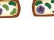

```
கற்றல் நோக்கங்கள்

இப்பாடத்தினைக் கற்போர்

- பாரம்பரிய மற்றும் நவீன மரபியலை வேறுபடுத்தவும்

- பாரம்பரியமாதலின் கருத்துக்கள் மற்றும் கொள்கைகளைப் புரிந்துக்கொள்ளவும்

- மெண்டலின் மரபியல் விரிவாக்கக் கருத்துக்களை விளக்கவும்

- பல்மரபணு பாரம்பரியம் மற்றும்பல்பண்புக்கூறு கடத்து மரபணு பற்றி விவரிக்கவும்

- மரபுசாராப் பாரம்பரியத்தில் சைட்டோபிளாச நுண்ணுறுப்புகளின் பங்கினைப் பகுத்தறியவும் இயலும்.
```

```
பாட உள்ளடக்கம்


2.1 பாரம்பரியம் மற்றும் வேறுபாடு

2.2 மெண்டலியம்

2.3 ஒரு பண்பு, இரு பண்பு, பிற்கலப்பு மற்றும் சோதனைக்கலப்புகள்

2.4 மரபணுக்களின் இடைச்செயல் விளைவுகள் – அல்லீல்களாக உள்ள மரபணுக்களில் நிகழும் மற்றும் அல்லீல்கள் அல்லாத மரபணுக்களுக்கிடையே நிகழும் இடைச்செயல்கள், முழுமைப்பெறா ஓங்குதன்மை, கொல்லி மரபணுக்கள் மற்றும் மறைக்கும் மரபணுக்கள்

2.5 மரபணுக்களுக்கிடையே நிகழும் இடைச்செயல்கள்

2.6 பல்மரபணு பாரம்பரியம் – கோதுமையின் விதையுறை நிறம், பிளியோடிராபி – பைசம் சட்டைவம்

2.7 மரபுசாராப் பாரம்பரியம் – சைட்டோபிளாச பாரம்பரியத்தில் பசுங்கணிகம் 
```

இடப னாக எடு

்‌ க்‌ அலகு 11-மரபியல்‌: பாடம்‌ ்‌ ட்‌ 2) பாரம்பரிய மரபியல்‌, சீ ப % அ

\[டிஜி யல்‌ கனப்பவது உம்னங்களில்‌வொதுான அண்பங்கறள்‌. . எஙலாலு பலாப்‌ இமட்மனைம்கக்பர்‌ நகைழுனைகள்ககது வப என்பலை்‌

*   பாரம்பரிய மற்றும்‌ நவீன மரபியலை: பற்றி படிப்பதாகும்‌. கடந்த ௧௦ ஆண்டுகளில்‌: 'வேறுபருத்தவும்‌. மரபியலைப்‌ போன்று வேஜைந்த அறிவியல்‌ பிரிவும்‌: &: பாரம்பறியமாதலின்‌ கருத்துக்கள்‌ மற்றும்‌. உலகை மாற்றி அமைத்ததில்லை. மரபியல்‌, கள்கைகாவ்பதக்வான்க்‌ சனயம்‌மறறம்‌ காழி வ்ணாகள்ணல்‌ ட வணடகள்க்பமினம்‌ கேளாண்மை.. மகத்துவம்‌. தடமவன்‌ தக அக்‌ பொன்ற இலைகளில்‌ வடம்‌ ம்லந்கை 4 பல்மரபணு பாரம்பறியம்‌ மற்றும்‌. ஏற்படுத்தியுள்ளது. கெண்க்கறுகத்தவணுப் வக்‌ ளெவு பரம்‌ பியத்்‌ கனிய்‌

ம அகன்‌ பண்ணன்‌... ஏங்ிஸ்‌ உ ணமய்மவியத்தம்‌ வல்பேலின.. க்க ந்து வகிக்கக்‌ க்துறத

எனும்‌... ஊயல்முறையை எருத்துரை: நக கங்க்‌ உமிரறிவியலின்‌ ஒரு பிறிவாக மரபியல்‌ திகழ்கிறது.

(ட பேட்சன்‌ 190௧ம்‌ ஆண்டு மறியல்‌ (165) ப்ன்டத்கம்‌ எனும்‌ பதத்தை அறிமுகப்படத்தினார்‌. மரபியலின்‌ பாட உள்ளடக்கம்‌: நான்கு முக்கியத்‌ துணைப்‌ பிரிவுகள்‌ பின்வருமாறு:

1 குகடத்தல்‌ மரபியல்‌ (ராஜல ௦1௦5) பாரம்பரிய மரமியல்‌ (௦4ல்‌ ஜோகர்‌) -

21 பரம்பரியம்மற்றும்‌

வே

பவம்‌ மரயணுக்கள்‌ எல்லறு பற்றோர்களிிருந்து

௦. ன்பு இரு: 'சந்ததிகளுக்குக்‌ கடத்தப்படிகின்றன என்பதை: இருபண்டி இருபண்பு, (விளக்கும்‌ ஒரு பிரிவாகும்‌. பாரம்பரிய மரபியலின்‌ மிற்கலப்(மற்றம்‌. அடிப்படை கிரஹர்‌ மண்டல்‌ தன்‌ ஆய்வில்‌: சோகனைக்கம் கள்‌

பட்ட அடம்‌ பயன்படுத்திய ஏழு மரபணுப்‌ பண்புகளாகும்‌.

\-அஸ்லீல்களாக உள்ள மரபணுக்களில்‌ உமூலக்கூறு மரபியல்‌ (/0பன. ஜொனி, நிகழும்‌ மற்றும்‌ அஸலல்கள்‌ சஸ்லாத மரபணுக்கள்‌ புற அமைப்பு மற்றும்‌ உயிர்ச்‌ மரபணுக்களுக்கிடையே நிகழும்‌ செயல்களை எவ்வாறு மூலக்கூறு நிலையில்‌ 'இடைச்செயல்கள்‌, முழுமைப்பொ. மேற்கொள்கிறது என்பதை விளக்கும்‌ பிரிவாகம்‌.


பவம்‌ மரயணுக்கள்‌ எல்லறு பற்றோர்களிிருந்து

௦. ன்பு இரு: 'சந்ததிகளுக்குக்‌ கடத்தப்படிகின்றன என்பதை: இருபண்டி இருபண்பு, (விளக்கும்‌ ஒரு பிரிவாகும்‌. பாரம்பரிய மரபியலின்‌ மிற்கலப்(மற்றம்‌. அடிப்படை கிரஹர்‌ மண்டல்‌ தன்‌ ஆய்வில்‌: சோகனைக்கம் கள்‌

பட்ட அடம்‌ பயன்படுத்திய ஏழு மரபணுப்‌ பண்புகளாகும்‌.

\-அஸ்லீல்களாக உள்ள மரபணுக்களில்‌ உமூலக்கூறு மரபியல்‌ (/0பன. ஜொனி, நிகழும்‌ மற்றும்‌ அஸலல்கள்‌ சஸ்லாத மரபணுக்கள்‌ புற அமைப்பு மற்றும்‌ உயிர்ச்‌ மரபணுக்களுக்கிடையே நிகழும்‌ செயல்களை எவ்வாறு மூலக்கூறு நிலையில்‌ 'இடைச்செயல்கள்‌, முழுமைப்பொ. மேற்கொள்கிறது என்பதை விளக்கும்‌ பிரிவாகம்‌.


பதக்க கள்‌ அ ளன க கயா 3. உயிறித்தொகை மரபியல்‌ (7௦920௦ சோனி) -

தனி உயிரிகளின்‌ தொகுப்பில்‌ தனிபட்ட பண்புக்கூறு எவ்வாறு குறிப்பிட்ட மரணுக்களால்‌. தீர்மானிக்கப்படுகிறது என்பதை விளக்கும்‌ பிரிவு.

கஎண்ணிக்கைசார்‌.. மரபியல்‌ (பெய்க சொலி) -ஒரு தொகுப்பிலுள்ள தனி உயிரிகளின்‌ பண்டுக்கூறுகள்‌ பல மரபணுக்களால்‌ ஒரே சமயத்தில்‌ தர்மானிக்கப்படம்‌ முறையை விளக்கும்‌ ரவு.

ஹவராடுஞ்௦9ட/

தோற்றத்தில்‌. காணப்படும்‌. ஒற்றுமைகள்‌, வீடபதலுக்கான (ஸபா காரணம்‌ என்ன?

மறமியல்‌ என்பது... மரபணு, மரபார்ந்த வேறுபாடுகள்‌ மற்றும்‌ உயிரினங்களில்‌ நடைபெறும்‌. மரபுசார்ந்த பண்யுக்கடத்தல்‌ ஆகியவற்றைப்‌ பற்றிய படிப்பாகும்‌, ஜனிடிக்ஸ்‌ (னல). என்பதைக்‌. தமிழில்‌ மரமியல்‌ அல்லது மரபணுவியல்‌ என்று, எவ்விதமாகக்‌ குறி்பிருவது சரியாக இருக்கும்‌ என்பதை வரப்பில்‌ விவாதிக்கவும்‌.

மரபணுக்கள்‌. (மொ... பரம்பரியத்தின்‌ செயல்படும்‌. அலகுகள்‌: பெற்றோர்களிடசிரந்து சந்ததிகளுக்கு உயிர்‌ வேதியிய, உள்ளமைப்பிய மற்றும்‌. நடத்தை. பண்புகளைக்‌ கடத்தும்‌ பாரம்பரியத்தின்‌ கடப்படை அவைகள்‌ (உயிரியல்‌ கவல்‌)

2 பாரம்பரியமும்‌ வேறுபாடுகளும்‌.

மரமியல்‌என்பதுபரம்பரியம்மற்றும்வேறுபாுகள்‌ மற்றி அறியும்‌ ஏ. அறிவியல்‌ என்று, 'வரையறுக்கப்பருகிறது.

மரம்பறியம்‌ ண்டு: வற்றோர்களிபசிுந்த சக்திகளுக்கும்‌ பண்புகள்‌ கடந்த்படது பாரம்பரியம்‌. எனப்படுகிறது.

வேறுபாடு. (/ள்ஷடு.. இயல்பான. ஒக்க இனத்நாகையிலுள்ள உயிரினங்களின்‌ அல்லது.

£ததாகையிறுள்ள உமரனங்களின்‌ சல்லது காணப்படும்‌ வித்தியாசமே வேறுபாடு எனப்பரகிறு இவ்வேறுபாரு இருவகைப்படும்‌. அவையாவன. மு ஷர்சசியற்ற வேறுபாரகள்‌ () தொடர்ச்சியான "வேறுபாடுகள்‌. ட தடர்ச்சியற்ற வேறுபாடுகள்‌ பள) “ஜ்‌ உமரினத் தொகையில்‌ சில பண்புகளில்‌ குறிப்பிட்ட வு... வேறுபாடுகள்‌. காணப்படுகின்றன. எடத்றக்காட்டகன்‌: பிரைமுலா தாவரத்தின்‌ கலக்‌. தண்டின்‌ நீளம்‌. தோட்டம்பப்டாணிச கடியின்‌ உயரம்‌ (றப்டை அல்லது குட்பை, இந்தத்‌ கொடர்ச்சியற்ற 'வேலுபாப்டில்‌ பண்புகள்‌ ஒன்று அல்லது இரணம்‌. முக்கியமான மரபணுக்களால்‌ சட்டப்புகக௦்புகிறது. 'இம்மரபணுக்கள்‌ இரண்டு சல்லது அதற்கு மேற்ப்‌ அல்லிக்களை (இணை: மரபணு வடிவங்கள்‌) கொண்டிருக்கும்‌... இவ்வேறுபாடகள்‌ மரபியலில்‌. த்தும்‌ காறாளிகள்‌ மூலம்‌ தீரமானிக்கப்படிறது. இவ்வேறுபாடுகளைப்‌ பெற்ற தனி உயிரிகள்‌ இடைறிலை தோற்றப்பண்யுகளற்ற நிலையைப்‌. வற்ுள்ளன... இல்வகை: புறத்தோற்றப்‌ பண்புகள்‌, \*ழ்நிலைக்‌ காரணிகளால்‌ பாதக்கப்பவதில்லை. இதுபண்புளர்‌ பரம்பரியமாதல்‌ (்ஸ்ஷாரனமால, என்றம்‌ அழைக்கப்படுகிற.

(ம்ப.

்‌ க்‌ அலகு 11-மரபியல்‌: பாடம்‌ ்‌ ட்‌ 2) பாரம்பரிய மரபியல்‌, சீ ப % அ

\[டிஜி யல்‌ கனப்பவது உம்னங்களில்‌வொதுான அண்பங்கறள்‌. . எஙலாலு பலாப்‌ இமட்மனைம்கக்பர்‌ நகைழுனைகள்ககது வப என்பலை்‌

*   பாரம்பரிய மற்றும்‌ நவீன மரபியலை: பற்றி படிப்பதாகும்‌. கடந்த ௧௦ ஆண்டுகளில்‌: 'வேறுபருத்தவும்‌. மரபியலைப்‌ போன்று வேஜைந்த அறிவியல்‌ பிரிவும்‌: &: பாரம்பறியமாதலின்‌ கருத்துக்கள்‌ மற்றும்‌. உலகை மாற்றி அமைத்ததில்லை. மரபியல்‌, கள்கைகாவ்பதக்வான்க்‌ சனயம்‌மறறம்‌ காழி வ்ணாகள்ணல்‌ ட வணடகள்க்பமினம்‌ கேளாண்மை.. மகத்துவம்‌. தடமவன்‌ தக அக்‌ பொன்ற இலைகளில்‌ வடம்‌ ம்லந்கை 4 பல்மரபணு பாரம்பறியம்‌ மற்றும்‌. ஏற்படுத்தியுள்ளது. கெண்க்கறுகத்தவணுப் வக்‌ ளெவு பரம்‌ பியத்்‌ கனிய்‌

ம அகன்‌ பண்ணன்‌... ஏங்ிஸ்‌ உ ணமய்மவியத்தம்‌ வல்பேலின.. க்க ந்து வகிக்கக்‌ க்துறத

எனும்‌... ஊயல்முறையை எருத்துரை: நக கங்க்‌ உமிரறிவியலின்‌ ஒரு பிறிவாக மரபியல்‌ திகழ்கிறது.

(ட பேட்சன்‌ 190௧ம்‌ ஆண்டு மறியல்‌ (165) ப்ன்டத்கம்‌ எனும்‌ பதத்தை அறிமுகப்படத்தினார்‌. மரபியலின்‌ பாட உள்ளடக்கம்‌: நான்கு முக்கியத்‌ துணைப்‌ பிரிவுகள்‌ பின்வருமாறு:

1 குகடத்தல்‌ மரபியல்‌ (ராஜல ௦1௦5) பாரம்பரிய மரமியல்‌ (௦4ல்‌ ஜோகர்‌) -

21 பரம்பரியம்மற்றும்‌

வே

பவம்‌ மரயணுக்கள்‌ எல்லறு பற்றோர்களிிருந்து

௦. ன்பு இரு: 'சந்ததிகளுக்குக்‌ கடத்தப்படிகின்றன என்பதை: இருபண்டி இருபண்பு, (விளக்கும்‌ ஒரு பிரிவாகும்‌. பாரம்பரிய மரபியலின்‌ மிற்கலப்(மற்றம்‌. அடிப்படை கிரஹர்‌ மண்டல்‌ தன்‌ ஆய்வில்‌: சோகனைக்கம் கள்‌

பட்ட அடம்‌ பயன்படுத்திய ஏழு மரபணுப்‌ பண்புகளாகும்‌.

\-அஸ்லீல்களாக உள்ள மரபணுக்களில்‌ உமூலக்கூறு மரபியல்‌ (/0பன. ஜொனி, நிகழும்‌ மற்றும்‌ அஸலல்கள்‌ சஸ்லாத மரபணுக்கள்‌ புற அமைப்பு மற்றும்‌ உயிர்ச்‌ மரபணுக்களுக்கிடையே நிகழும்‌ செயல்களை எவ்வாறு மூலக்கூறு நிலையில்‌ 'இடைச்செயல்கள்‌, முழுமைப்பொ. மேற்கொள்கிறது என்பதை விளக்கும்‌ பிரிவாகம்‌.


பவம்‌ மரயணுக்கள்‌ எல்லறு பற்றோர்களிிருந்து

௦. ன்பு இரு: 'சந்ததிகளுக்குக்‌ கடத்தப்படிகின்றன என்பதை: இருபண்டி இருபண்பு, (விளக்கும்‌ ஒரு பிரிவாகும்‌. பாரம்பரிய மரபியலின்‌ மிற்கலப்(மற்றம்‌. அடிப்படை கிரஹர்‌ மண்டல்‌ தன்‌ ஆய்வில்‌: சோகனைக்கம் கள்‌

பட்ட அடம்‌ பயன்படுத்திய ஏழு மரபணுப்‌ பண்புகளாகும்‌.

\-அஸ்லீல்களாக உள்ள மரபணுக்களில்‌ உமூலக்கூறு மரபியல்‌ (/0பன. ஜொனி, நிகழும்‌ மற்றும்‌ அஸலல்கள்‌ சஸ்லாத மரபணுக்கள்‌ புற அமைப்பு மற்றும்‌ உயிர்ச்‌ மரபணுக்களுக்கிடையே நிகழும்‌ செயல்களை எவ்வாறு மூலக்கூறு நிலையில்‌ 'இடைச்செயல்கள்‌, முழுமைப்பொ. மேற்கொள்கிறது என்பதை விளக்கும்‌ பிரிவாகம்‌.


பதக்க கள்‌ அ ளன க கயா 3. உயிறித்தொகை மரபியல்‌ (7௦920௦ சோனி) -

தனி உயிரிகளின்‌ தொகுப்பில்‌ தனிபட்ட பண்புக்கூறு எவ்வாறு குறிப்பிட்ட மரணுக்களால்‌. தீர்மானிக்கப்படுகிறது என்பதை விளக்கும்‌ பிரிவு.

கஎண்ணிக்கைசார்‌.. மரபியல்‌ (பெய்க சொலி) -ஒரு தொகுப்பிலுள்ள தனி உயிரிகளின்‌ பண்டுக்கூறுகள்‌ பல மரபணுக்களால்‌ ஒரே சமயத்தில்‌ தர்மானிக்கப்படம்‌ முறையை விளக்கும்‌ ரவு.

ஹவராடுஞ்௦9ட/

தோற்றத்தில்‌. காணப்படும்‌. ஒற்றுமைகள்‌, வீடபதலுக்கான (ஸபா காரணம்‌ என்ன?

மறமியல்‌ என்பது... மரபணு, மரபார்ந்த வேறுபாடுகள்‌ மற்றும்‌ உயிரினங்களில்‌ நடைபெறும்‌. மரபுசார்ந்த பண்யுக்கடத்தல்‌ ஆகியவற்றைப்‌ பற்றிய படிப்பாகும்‌, ஜனிடிக்ஸ்‌ (னல). என்பதைக்‌. தமிழில்‌ மரமியல்‌ அல்லது மரபணுவியல்‌ என்று, எவ்விதமாகக்‌ குறி்பிருவது சரியாக இருக்கும்‌ என்பதை வரப்பில்‌ விவாதிக்கவும்‌.

மரபணுக்கள்‌. (மொ... பரம்பரியத்தின்‌ செயல்படும்‌. அலகுகள்‌: பெற்றோர்களிடசிரந்து சந்ததிகளுக்கு உயிர்‌ வேதியிய, உள்ளமைப்பிய மற்றும்‌. நடத்தை. பண்புகளைக்‌ கடத்தும்‌ பாரம்பரியத்தின்‌ கடப்படை அவைகள்‌ (உயிரியல்‌ கவல்‌)

2 பாரம்பரியமும்‌ வேறுபாடுகளும்‌.

மரமியல்‌என்பதுபரம்பரியம்மற்றும்வேறுபாுகள்‌ மற்றி அறியும்‌ ஏ. அறிவியல்‌ என்று, 'வரையறுக்கப்பருகிறது.

மரம்பறியம்‌ ண்டு: வற்றோர்களிபசிுந்த சக்திகளுக்கும்‌ பண்புகள்‌ கடந்த்படது பாரம்பரியம்‌. எனப்படுகிறது.

வேறுபாடு. (/ள்ஷடு.. இயல்பான. ஒக்க இனத்நாகையிலுள்ள உயிரினங்களின்‌ அல்லது.

£ததாகையிறுள்ள உமரனங்களின்‌ சல்லது காணப்படும்‌ வித்தியாசமே வேறுபாடு எனப்பரகிறு இவ்வேறுபாரு இருவகைப்படும்‌. அவையாவன. மு ஷர்சசியற்ற வேறுபாரகள்‌ () தொடர்ச்சியான "வேறுபாடுகள்‌. ட தடர்ச்சியற்ற வேறுபாடுகள்‌ பள) “ஜ்‌ உமரினத் தொகையில்‌ சில பண்புகளில்‌ குறிப்பிட்ட வு... வேறுபாடுகள்‌. காணப்படுகின்றன. எடத்றக்காட்டகன்‌: பிரைமுலா தாவரத்தின்‌ கலக்‌. தண்டின்‌ நீளம்‌. தோட்டம்பப்டாணிச கடியின்‌ உயரம்‌ (றப்டை அல்லது குட்பை, இந்தத்‌ கொடர்ச்சியற்ற 'வேலுபாப்டில்‌ பண்புகள்‌ ஒன்று அல்லது இரணம்‌. முக்கியமான மரபணுக்களால்‌ சட்டப்புகக௦்புகிறது. 'இம்மரபணுக்கள்‌ இரண்டு சல்லது அதற்கு மேற்ப்‌ அல்லிக்களை (இணை: மரபணு வடிவங்கள்‌) கொண்டிருக்கும்‌... இவ்வேறுபாடகள்‌ மரபியலில்‌. த்தும்‌ காறாளிகள்‌ மூலம்‌ தீரமானிக்கப்படிறது. இவ்வேறுபாடுகளைப்‌ பெற்ற தனி உயிரிகள்‌ இடைறிலை தோற்றப்பண்யுகளற்ற நிலையைப்‌. வற்ுள்ளன... இல்வகை: புறத்தோற்றப்‌ பண்புகள்‌, \*ழ்நிலைக்‌ காரணிகளால்‌ பாதக்கப்பவதில்லை. இதுபண்புளர்‌ பரம்பரியமாதல்‌ (்ஸ்ஷாரனமால, என்றம்‌ அழைக்கப்படுகிற.

௧. பர்பதியமலியல்‌.

௨ ஷாடர்ச்சியான வேறுபாடுகள்‌: மளலள?

இவ்வேறுயாடுகள்‌.. கழ்நிலை கறணிகளின்‌... கட்ட தீரிமானிக்கப்பபவைகளாக இருக்கலாம்‌... ஏர்‌ உமிரினந்தொகையில்‌ பெரும்பாலான. பண்புகள்‌ முழுவதுமாகத்தரம்பரிக்க்ப்ட ஒரு நிலையிலிருந்து மற்ஹாரு நிலை வரை எவ்விதம்‌ நபைபுசினறி 'கெளிப்பத்தப்புகிறத. புறத்தோற்றப்‌ பண்புகளின்‌: பாரம்பரியம்‌ பல மரபணுக்கள்‌ மற்றும்‌ கழ்நிலைக்‌ காரணிகளின்‌... கூட்டச்செயல்‌.... விளைவுகளாம்‌. தீர்மானிக்கப்படுகிறது... இது எண்ணிக்கைளர்‌. பாரம்பறியமாதல்‌ (ளாம ளான) என்று அறியப்படுகிறது. எடுத்துக்காட்ட: மனிதனின்‌ உயரம்‌: மற்றும்‌ தோல்நிம்‌. வேறுபாடுகளின்‌ முக்கியத்துவம்‌ சில. உமிரிகளில்‌ காணப்படும்‌ வேறுபாககள்‌ போராடி வழ்தலில்‌ சிறந்த உமிறியாக மாறுவதன்‌:

(சம்ம

டிப்படையில்‌ அமைகின்றன.

உமாறும்‌... கழ்நிலைகளுக்கேற்பத்‌. தம்மைத்‌ தகவமைத்துக்‌ கொள்ள உதவுகிறது.

ரது. இயற்கைத்‌ தேர்வுக்கான... மரபியல்‌. பண்புகளை வழங்குவதாக உள்ளது.

உ மேம்படுத்தபட்ட உற்பத்தி, விரைவான வளர்ச்சி, அதிக நோய்‌ எதிர்ப்புத்தன்மை மற்றும்‌ குறைவான முதனீற கொண்ட தாவரங்களை , பயிர்‌ பெருக்க உற்பத்தியாளர்கள்‌. உருவாக்குவதற்கு வேறுபாடுகள்‌ துணை ஸ்ரகி்றது,

உயரிணாமத்தின்‌ மூலங்களாக அமைகின்றன.

22 வண்டலியம்‌ (மிகா)

முழுவதுமாகத்தரம்பரிக்க்ப்ட ஒரு நிலையிலிருந்து மற்ஹாரு நிலை வரை எவ்விதம்‌ நபைபுசினறி 'கெளிப்பத்தப்புகிறத. புறத்தோற்றப்‌ பண்புகளின்‌: பாரம்பரியம்‌ பல மரபணுக்கள்‌ மற்றும்‌ கழ்நிலைக்‌ காரணிகளின்‌... கூட்டச்செயல்‌.... விளைவுகளாம்‌. தீர்மானிக்கப்படுகிறது... இது எண்ணிக்கைளர்‌. பாரம்பறியமாதல்‌ (ளாம ளான) என்று அறியப்படுகிறது. எடுத்துக்காட்ட: மனிதனின்‌ உயரம்‌: மற்றும்‌ தோல்நிம்‌. வேறுபாடுகளின்‌ முக்கியத்துவம்‌ சில. உமிரிகளில்‌ காணப்படும்‌ வேறுபாககள்‌ போராடி வழ்தலில்‌ சிறந்த உமிறியாக மாறுவதன்‌:

(சம்ம

டிப்படையில்‌ அமைகின்றன.

உமாறும்‌... கழ்நிலைகளுக்கேற்பத்‌. தம்மைத்‌ தகவமைத்துக்‌ கொள்ள உதவுகிறது.

ரது. இயற்கைத்‌ தேர்வுக்கான... மரபியல்‌. பண்புகளை வழங்குவதாக உள்ளது.

உ மேம்படுத்தபட்ட உற்பத்தி, விரைவான வளர்ச்சி, அதிக நோய்‌ எதிர்ப்புத்தன்மை மற்றும்‌ குறைவான முதனீற கொண்ட தாவரங்களை , பயிர்‌ பெருக்க உற்பத்தியாளர்கள்‌. உருவாக்குவதற்கு வேறுபாடுகள்‌ துணை ஸ்ரகி்றது,

உயரிணாமத்தின்‌ மூலங்களாக அமைகின்றன.

மரியலுக்கு மண்டல்‌ ஆற்றிய பங்கு மெண்டலியம்‌. எனப்படுகிறது. பட்டாணித்‌ தாவரத்தில்‌ அவர்‌ செய்த கலப்பறுக்த ஆய்வுகள்‌ மற்றும்‌ தாவரக்‌ கலப்பு முறைகள்‌ உள்ளடக்கிய கருத்துக்கள்‌ அனைத்தம்‌: நலீன மறபியழக்கு சடிப்படையாக அமைந்துள்ளது. எனவே. மெண்டல்‌. மரமியலின்‌ தந்த என்றழைக்கப்பறார.

வேறுபாருகள்‌

22.21 மரபியலின்‌ தந்த - கிரஹர்‌ தோஹன்‌ மெண்டல்‌ (1522-1084)

முகல்‌ மரபியலாான கிரஹர்‌ ஜோஹன்‌ மெண்டல்‌, பாரம்பரியத்தின்‌ அதிசயங்களடங்கிய பாதையில்‌ முதலில்‌ பயாளிக்கவ்‌ ஆவார்‌ இவர்‌ ஜூலை 22-222- ஆம்‌ ஆண்டு ஆஸ்திரியாவின்‌ 9ஹய்சண்டா்‌ஃப்‌ என்ற கவரில்‌, சிலசியன்‌ எனும்‌ கிரமத்தில்‌ (சற்போது ஹைன்சிஸ்‌ சக்கோஸ்லோவாகியா)பிற்கர பள்ளம்‌ பட்ற்க்‌ பிறக, காவரனியல்‌, இயற்பியல்‌ மற்றம்‌ கணிதத்தை. வியன்னா... பல்கலைக்கழகத்தில்‌,ஹவராடுஞ்௦9ட/

மமின்றார்‌.... அதன்பிறகு.

ஆஸ்திரியா... (யன,

நாப்டன்புருன்‌ (பார) என்ற. இடத்திலுள்ளபுனிகக்தாமஸ்‌. முயாலயத்தில்‌.. தனக்கு.

விருப்பான. பட்பாணி தாவரக்‌... கலப்பும்‌. சோதனைகளை மேற்கொண்டார்‌. ௯49-ம்‌... படம்‌ 21கிரஹர்‌: ஆண்டி, தற்காலிகமாக ஜோஹன்‌ மெண்டல்‌. ஆசிறியப்‌.. பணியினை மேற்கொண்டு, ஒய்வு... நேரத்தில்‌, தன்னுடைய தோட்டத்தில்‌ பட்பாணித்‌ தாவரத்தில்‌ கலப்பறுல்‌ சோதனைகளைத்‌ தொடர்ந்து மேற்கொண்டார்‌. 25௨. ஆம்‌ ஆண்டு வரலாற்று சிறப்பு வாய்ந்த பட்டாணித்‌ 'தாவர ஆய்வுகளைத்‌ தொடங்கினார்‌. 54௨ முதல்‌ 95௦ வரை பப்பாணித்‌ தாவரத்தில்‌ கலப்பறுமல்‌ சோதனைகளை இவர்‌ மேற்கொண்டார்‌. அவர்‌ தனது. தோட்டத்திலுள்ள பட்டாணித்‌ தாவரத்தில்‌ மேற்கொண்ட “எழு ஜோடி வேறுபட்ட பண்புக்கூறுகளைக்‌ கொண்டு, பாரம்பரியக்‌... கொள்கைகளைக்‌. கண்டறிந்தார்‌ வண்டல்‌ 2௮004 தாவரங்களின்‌ பல சந்ததிகளில்‌ இனக்கலப்பு எய்து, முயவுகளை: தப்பவணைப்பரத்தினார்‌. ஸ௦௨-ஆம்‌.. ஆண்டி "எக்ஸ்வரிமண்ட்ஸ்‌ ஆன்‌ பிளாண்ட்‌ ஷையிரிட்ஸ்‌" (ழனளாகு 0 ஈனா 64௯) என்ற தலைப்பில்‌ "தி பரசீடக்ஸ்‌ ஆஃம்‌ ப்ரூன்‌ வாசைப்டி ஆஃப்‌ நாச்சரல்‌ ஹிஸ்டரி'-ல்தனதுஆம்வுக்கட்டிரையைவெளியிட்டர்‌. நன்ன மரமியலின்‌ நிறுவனராக இன்றும்‌ கிரஹர்‌ வண்டல்‌ விளங்குகிறார்‌. மேலும்‌. இவர்‌ முதல்‌ முறைப்பாடு... மரிய. ஆராய்ச்சியாளராகவம்‌ கருதப்படுகிறார்‌.

ஷண்டலின்‌ வெற்றிக்கான காரணங்கள்‌:

உ உயிரியலில்‌ கணிதம்‌ மற்றும்‌. புள்ளியியல்‌. முறைகளையும்‌, நிகழ்விரைவு முறைகளையும்‌: தனது... கலப்புமிரி சோதனைகளில்‌ கையாண்டிரும்பது,

உ கையாண்ட அறிவியல்முறைகளின்‌ துல்லியமான, விரிவான. பதிவுகளின்‌. எண்ணிக்கைசார்‌ விவரங்களையும்‌. பு்ளிமியல்‌ முறையில்‌ பதிவிப்டரு்பது,

உ சோதனைகள்‌ அனைத்தம்‌ மிகவும்‌ கவனமாகவும்‌. தஇப்பமிடப்பட்டு, அவற்றில்‌ அதிக மாதிரிகள்‌ பயன்பரத்தப்ப்டரப்பது.

உஷ்த்துக்காண்ட ஏதிரிடைப்‌ பண்புகள்‌ தணப்பட்ட குரோமோசேங்களில்‌ உன்ன காரணிகளால்‌. மரபணுக்களால்‌) கட்ட்பததப்பப்டிுப்பது( பம்‌ 24)

உ ஹண்டலால்‌... தேந்தெரக்கப்பட்ட பெற்றோர்‌. தாவரங்கள்‌ தூயகால்‌ வழி பெற்றோர்களாக. இருந்தது. பெற்றோர்களின்‌ தூய்மையானது பல. தலைமுறைகளில்‌. தற்கலப்பு.. கெய்து, பரிசோதிக்கப்பட்டதாக இருக்கது.

மண்பலின்‌ ஆய்வு முறை- தோட்டப்‌ பட்டாணி ஷண்டல்‌.. தோப்பம்‌.. பப்பாணியைத்‌

தெரந்துக்ததற்கான காரணம்‌:

உ இதுஒருபருவதாவரமாகவும்‌,ஒற்றைமரபணுவால்‌ குப்டப்பர்தக்கூடிய தெளிவான... எதிறிடைப்‌ பண்புகளைக்‌ கொண்டதாகவும்‌ இருப்ப.

இயல்பான நிலைகளில்‌ தோட்டம்‌ பட்டாகணித்‌ தாவரங்களில்‌ தற்கருவறுதல்‌ நடைவறுகல்‌. வண்டல்‌ தற்கருவறுகல்‌(6வி-1எமிவா மற்றும்‌ கயல்‌. கருவுறுதல்‌ (எா௦௦-ளர்்ா) இரண்டையும்‌ ுத்தாவரங்களில்‌பயன்படக்கினார்‌.

உமலற்கள்‌ வெறிய அளவில்‌ காணப்பட்டதால்‌. ஆண்மலடாக்கம்‌, மகரந்தச்சேர்க்கை ஆகியவை குலப்புறுகல்‌ (நரமசலள). சோதனைகளில்‌:

எளிதாக மேற்கொள்ளலாம்‌.

2.2.2. மெண்டலின்‌: ஆய்வுகள்‌

பட்டாணித்‌ தாவர

'ஷண்டலின்‌ பாரம்பரியக்‌ கோப்பாடு துகள்‌ கோப்பாடு

உல்‌ பரம்பர எக அல்லது பாரம்பரிய அலகுகள்‌ அல்லது காரணிகள்‌ (ரனணிமஙு பர ௭ 1249 தற்போது மரபணுக்கள்‌ (சோனு) என அழைக்கப்பருகின்றன. பல தூயகால்வழி பட்பாணித்‌ தாவரங்களைக்‌ கொண்டு செயற்கை: மர்கர்‌ ஜோக்கை | அயல்‌ மரரந்க்‌ சேர்க்கை:

படம்‌ 22: பட்டாணி மலர்களில்‌ அயல்‌-- மகரந்தச்சேர்க்கை படிநிலைகள்‌

எவ்றியணமியல்‌ 1


ஹவராடுஞ்௦9ட/

மரமியலின்‌ முதல்‌ மாதிரி உயிரி - தோட்டம்‌ மட்பாணி, - இத்தாவரத்தில்‌ மண்டலால்‌ ஆய்வு

செய்யப்ப்ட ஏழு மண்புகளின்‌ விவரம்‌: (ண்டு \[ஏக பன்புககறு \] ஏரக்க பண்டக்கு வைத வத வ க்ஷம்‌ அ ண, கஷைஷம்‌ | (இ) உன்ட ஒதி பரும ந்‌ ஓஒ அது\] ம

கமகம்‌ கஸ்‌

றம்‌

கற.

வண்டலின்‌ வெள்ளை மலர்களுக்கான மரபியல்‌. புக்குக்‌ தற்போது விடை காணப்பட்டுள்ளது. மெண்டலின்‌ பட்பாணித்‌ தாவர வெள்ளை நிற மலர்களை ஒழுங்குபரத்தக்கூடிய மரபணுவை உங்களால்‌ இனங்காண முமயுமா?

மரபணுவின்‌ மணிகளைப்‌ பிந்து. கொள்ள

மூலக்கூறு அளவிலான தீர்வை அற்வேம்‌.

முற்மிலும்‌ விந்தையான மெண்டல்‌ கூறிய மரபணுக்களைப்‌ பற்றி அறிவோம்‌. 2010-ஆம்‌ ஆண்டை பட்டாணித்‌ தாவர மலர்களின்‌ நிற்திற்குக்‌ காரணமான. மரபணு. சில உக ஆரா்ச்சியாளர்கள்‌ குழுவினரால்கண்டறியப்ப்டறு பட்டாணியில்‌ இது மரபணு & என்றுழைக்கப்பட்டது. ஓங்குறிலையிலுள்ள இம்மரபணு, படியெடத்தல்‌

செல்களுக்குள்‌ மரபணு துப்பாக்கி முறையில்‌ (9௨. சொறி) ஆராய்சசியாளர்கள்‌ ஊலுக்தினர்‌. இந. மரபணு ச-வைப்‌ பெற்ற குறைந்த அளவிலான. சஷீதத்திலுள்ள வெள்ளை மலர்களின்‌ பூவிதழ்‌

"வரை கொடர்்து தன்மகரந்தச்சேர்க்கை நடைபற்று,

மாற்றம்‌ ஏறபட்டப்படியெருத்தல்‌ காரணி செயலற்றுப்‌. போகிறது. இது திர்‌ மாற்றம்‌ பெற்ற மரபணு,

கீரவாகக்‌.... கருதப்படுகிறது... இம்மரபணு. ஆத்தோசயனினை உற்பத்தி செய்யாததால்‌, வெள்ளை மலர்கள்‌ தோன்றுகிறது.

படம்‌ 25: மரபணு & கொண்ட பட்டாணியின்‌:

கழா மலர்‌ மற்றம்‌ பட்டாணியின்‌: வெள்ளை மலர்‌


ஹவராடுஞ்௦9ட/

இரு பப்பாணித்‌ தாவரத்திலுள்ள மகரந்தப்பைகளை: 'கருவறுகலுக்ு முன்‌ நீககி(ஆண்மலடாக்கி வேஜாரு, ரப்‌. பப்பாணித்‌ தாவரத்திலுள்ள மகரந்தங்களை, முகரந்கப்பை நீக்கப்பட்ட மலர்களின்‌ கை முடக்கு மாற்றுவதன்பது அயல்‌-கருவறுமல்‌ என்பதாகும்‌. இதன்‌: மூலம்‌. வேறுபட்ட பண்புக்கூறுகளைக்‌ கொண்ட கேப்பினங்கள்‌.... உருவாகிறது... மண்டகின்‌' தேோய்ச்சிகளின்‌ அடிப்படையில்‌ அமைக்கப்பட்ட விதிமுறைகள்‌ அனைத்தும்‌ தற்போது. மண்டமிய மரபியல்‌ ரனப்சிய சொலி எனப்படுகிறது.

கல்லில்‌ காணப்படும்‌ பாரம்பரிய நுட்பங்களான "குரோமோசோம்‌, மி, மரடணுக்கள்‌ பற்றிய ஊய்திகள்‌ 'அறியப்படிவதற்கு முன்பே, பாரம்பரியம்‌ பற்றிய இந்க விதிகளின்‌ சரியான நுப்பங்களை மண்டல்‌. (வதக்தார்‌. ஹண்டலின்‌ இந்தப்‌ பாரம்பரிய நுட்பம்‌ முற்றிய உன்னிப்பான நுண்ணறிவு மேம்புக்க்ப்டப்‌ பமிழ்ரசங்கள்‌ உருவாக்குவதிலும்‌, பயர்‌ கலப்புிர்கல்‌ முறையிலும்‌ ஒருபரட்சியை ஏற்ப்துவதில்‌ முக்கியப்‌ மங்கு வகிக்கிறது,

௧554-ஆம்‌ ஆண்டில்‌ மண்டல்‌ மறைந்த பின்னர்‌, 1900-ஆம்‌ ஆண்டு மெண்டலின்‌ ஆய்வுகள்‌ மூன்று உயிரியல்‌ வல்லுனர்களாகிய, ஹாலந்தின்‌ ஹியூகோ உவிறஸ்‌, ஷெர்மனியின்‌ கார்ல்‌ காஷன்ஸ்‌ மற்றம்‌ ஆஸ்திரியாவின்‌ எரி வான்‌ ஷெர்மாக்‌ ஆகியோரால்‌. மீண்டும்‌ கண்டறியப்பட்டது.

228.  ஷண்டலியத்துடன்‌ தொடர்புடைய கலைச்சொற்கள்‌. வண்டல்‌ இரு எதிரிடைப்‌ பண்டுக்கூறுகளின்‌ (14) 'வெளிப்பாருகளைமட்டிமேஒரே சமயத்தில்‌ கவனத்தில்‌ கொண்டார்‌. டு்துக்காட்டு: நட்டை மற்றும்‌ கட்டை. “வேறுபட்ட பண்பு்கூறுகள்‌ வெளிப்பாடடைவதற்கான காரணம்‌. ஒரே பண்புகூறுக்கான. மரபணு, இரு: "வேறுபட்ட வடிவங்களை பெற்றிருப்பது ஆகும்‌. இவை. அல்லல்கள்‌ என்று அழைக்கப்படகின்றன.

ஒரு உலரமில்‌ காணப்படும்‌ மரபணு அதற்கான: இஇந்த... அல்லில்களை கொண்மருந்தால்‌. அது, இத்தமண்பிணைவு (10௦2/09௯-11) எனப்பரகிறது. இரு உமிரியில்‌ காணப்படும்‌ மரபணு அதற்கான. "இருவேறுபட்ட அல்லீல்களைக்‌ கொண்டிருந்தால்‌, அது மாறுபட்பண்பிணைவு.. (வஸு ௪.70 என்றழைக்கப்புகிறது. மண்டலின்‌ கலப்பறுகல்‌. சோதனைக்குப்‌. பின்‌ உருவாம்‌ தாவரங்‌ வேறுபட்ட பண்பிணைவுகளைப்‌ பெற்றிருப்பதால்‌ அவை கலப்புமிிகள்‌ (1/1 எனப்படுகின்றன.

ஒங்குபண்பிற்கான மரபணுவின்‌ இரு அஸ்கில்க்‌ (ன்னாட ௧/4) வரிய எழுத்திலும்‌ (2291ம்‌ ௭௭%. ஏரங்குபண்பிற்கான மரபணுவின்‌ இரு சஸ்லல்கள்‌ (விட 4௮௮) சிறிய எடுத்தலும்‌. (ராமி! (௭௭) 'ுறிபிப்பிறது. ஒரு உயிரியில்‌ இரண்டை ஓரங்க. அல்லில்கள்காணப்பப்பா்கதுடக்தண்பிணைவைம்‌.

வெற்ற ஒடங்குறிலை. (ஸாவர00௨ ௩௯) (1) கட்டைப்‌ பட்பாணித்‌ தாவரங்கள்‌ எனப்பரகின்றன. ஒரு உமிரியில்‌ இரண்டு. ஓங்கு சல்கல்கள்‌ காணப்பட்டால்‌ அது ஒத்தபண்மிணைவைப்‌ வற்ற. ஒங்குறிலை ாமலுமுமு கோயா) (ர) ஷட்டைப்‌ ப்பாணித்‌ தாவரங்கள்‌. எனப்படுகின்றன. இந்த "இரண்ட சஸ்லல்களில்‌ ஒன்று ஒங்கு ஊபணுவாகவம்‌, மற்ஸான்று ஒடுங்கு மாபணுவாகவ்‌ இருப்பின்‌ அது சற்ற நெட்டை \[மம ச 71 பப்பணி்‌, தாவரங்களைக்‌ கரக்கின்றன.

224... ஷண்டலிய மெண்டலிய விதிக

வண்பலின்‌ ஒரு பண்புக்‌ கலப்பினைக்‌ கூர்ந்து ஆராய்ந்ததின்‌ விளைவாக இரு முக்கிய விதிகள்‌ உருவாக்கப்பப்டன.() ஓங்குக்தன்மை வீதி (71௨ (2௭ 910னள்னா௦9)(2) தனித்துப்‌ பரல்‌ வதி (ம பாட ௫௦ரஷகிளர. இந்த அறிவியல்‌ விதிகள்‌ பரிணாமச்‌ சித்தத்தில்‌ முக்கியப்‌ பங்காற்றுகிறது ஒங்குத்தன்மை விதி - பண்புகள்‌, காரணிகள்‌ என்றழைக்கப்படும்‌ தனித்தியங்கும்‌ சலகுகளால்‌. கடடுபபக்தப்புகிறது. எதிறிடைப்‌ பண்புகளுகான 'இணைக்காரணிகளில்‌ஒன்றுடங்குக்கன்மையுடனம்‌. மத்ஷான்று ஒருங்கு தன்மையுடனும்‌ காணப்பம்‌. “இவ்விதி, ஒரு பண்புக்‌ கலப்பினை விளக்குகிறது. (௬) முதல்‌ மகவச்ச்கதிில்‌ (5) ஒரே ஒரு பெற்றோர்‌. பண்பு... வெளிப்படுகிறது... (ஆ) இரண்டாம்‌. மகவச்ச்ததிில்‌ 7) இரு வற்றோர்‌ பண்புகளும்‌ வெளிப்படுகின்றன. இரண்டாம்‌ மகவுரசந்தகிில்‌ (5. பண்புகள்‌ 2 விகிதாச்ளரத்தில்‌ உருவாகின்றன. 'தனத்தப்பிரிதல்‌ விதி கேமீட்களின்‌ தூயத்தன்மை. 'வதி)-முதல்‌ மகவச்ச்கதியில்‌ இரு பண்புகளில்‌ ஒன்று, மட்டுமே காணப்பப்ட போதிலும்‌, இரண்டாம்‌. மகவுச்சகதியில்‌ இரு பண்புகளும்‌ வெளிப்படுகின்றன. “எனவே ஒரு மரபணுவில்‌ காணப்படும்‌ இரண்டு அஸ்லில்களும்‌ ஒன்றோலான்று கலப்பதில்லை. கேமீட்‌ உருவாக்கத்தின்‌ போது இந்த இணை சு்லில்கள்‌ ஒவ்வாரு கேமீட்டலம்‌ ஒன்று என்ற விக்கல்‌ 'தனித்தப்பரிகின்றன. எனவே தாயகால்வழித்தாஷம்‌ ஒரே மாதிரியான கேமீட்களை உருவாக்குகிறது. ஆனால்‌ ஒரு கப்புவிரித்‌ தாவரம்‌ இரண்மு விதமான கேமீட்களை உருவாக்குகின்றன. இது ஒவ்வாரு. கேமீப்மழம்‌. ஒரு கல்லிலை பெற்றுச்‌ சமமான 'விககாச்சரத்தில்‌ உருவாகின்றன. எனவே, கேமட்கள்‌ ப்போழுதம்‌ கலப்ுமர்களாக இருப்பதில்லை. 23 ஒரு பண்புக்‌ கலப்பு (/0ஷ்04 ௭௦௨9) ஒரு பண்புக்‌ குப்பு என்பது, ஒற்றைப்‌ பண்பின்‌: பாறம்பரியமாகும்‌, அதாவது தாவரத்தின்‌ உயரம்‌ பாரம்பரியமடைதல்‌. இது, ஒரு மரபணுவின்‌ இரண்ட அல்லில்களை உள்ளடக்கியது. ஒரு பண்புக்‌ கலப்பு

பாரம்பரியத்தில்‌:

எவ்றியவமியல்‌ 09ஹவராடுஞ்௦9ட/

மஸ தூயகால்வரி பெற்றோர்‌ தாவங்களுக்கிடையே நடையறுவதாகும்‌. ஒவ்வாரு பெற்றோரும்‌ இரு எதிரிடைப்‌ பண்புகளை: வெளிப்படத்துகின்றன... முதலாம்‌... மகவு்‌- உருவாகும்‌ இரண்டாம்‌ மகவச்சந்ததியிலுள்ள 10௦4. தாவரங்களில்‌ 767 தாவரங்கள்‌ நெட்டையாகவம்‌, சச. தாவரங்கள்‌ குட்டையாகவும்‌ இருந்ததை: மண்டல்‌ கண்டறிந்தார்‌. இது 3:1 என்ற விகிதத்தில்‌. "இருப்பது குறிப்பிட்தக்கது முதலாம்‌ மகவச்ச்ககியில்‌, முறைந்தகட்டைப்பண்யு கிரண்டாம்‌ மகவச்ச்தியல்‌. மீண்டும்‌ தோன்றுவது குறிப்பிடதக்கது. ஒரு பண்பு கலப்பின்‌ முதல்‌ மகவச்சந்ததிகளின்‌ மரபணுவாக்கம்‌ மரபணுவகையம்‌ (ளா) எனவும்‌, ஒரு உமரியில்‌. வவெளிப்படக்கூடிய பண்புகள்‌ பறத்தோற்றவகையம்‌. மினாரா) எனவும்‌ அறியப்படுகிறது. ஒரு மரபணுக்‌. கலப்ில்‌.. கேமீப்களின்‌.. கருவறுகலின்போது. சந்ததிகளில்‌ தோன்றும்‌. மரணுவகையக்கையும்‌: முறத்தோற்ற வகையத்தைய்‌, பிட்ஸ்‌ மரமியலாளர்‌ ஜினால்டு 0. புன்னட்‌ அவர்களின்‌ பெயரால்‌. உருவான புன்னெட்‌ சநூரத்தின்‌ (பாக ௨௭௦) உதவியால்‌ எளிதாக அறுந்து கொள்ள முவம்‌. ஒர. புன்னெட்சதுரம்‌ என்பது மரபியல்‌ கலப்பில்‌ தோன்றும்‌ சந்ததிகளின்‌ சாத்தியமுள்ள மரபணு வகைகளைக்‌: கணக்கிட உதவும்‌ வரைபட விளக்கமாரம்‌. ஓங்குப்பண்பு விதி மற்றும்‌ தணித்தப்பிறிதல்‌ விதி மெண்பலின்‌ ஒருபண்புக்‌ கலப்பை சரியாக. விளக்குகிறது.

பரிமாற்ற கப்பு (௦9 ௭௦) - ஒரு பரிசோதனையில்‌. நூயகால்வழி கட்டைக்‌ தாவரங்களை ஆண்‌ தாவரங்களாகவு்‌, நெட்டை மட்பாணித்‌ தாவரங்களைப்‌ வண்‌ தாவரங்களாகவம்‌. கொண்டு கலப்பு சய்ும்‌ போது கிடைக்கக்கூடிய. அனைத்தம்‌. தட்டைக்‌ தாவரங்களாகவே இருந்தன. இதே தாவரங்களை, மாற்றிக்‌ கலப்பு சசய்யும்‌ போது, அதாவது நெட்டைக்‌. தாவரங்களின்‌. மடரந்தத்தைப்‌ பயன்படுத்திக்‌ 'கட்டைத்‌ தாவரங்களுடன்‌ கப்பற்‌ செய்யும்‌ போது, கிடைக்கும்‌. சந்ததிகளனைத்தும்‌ மீண்டும்‌. ஏரட்டைத்தாவரங்களாகவே இருந்தன. நெட்டை (7) ப குட்டை (3) மற்றும்‌ கட்டை (2) உ கட்டை (2) - எனச்‌ செய்யக்கூய கலப்பு பறிமாற்றக்‌ கலப்பு எனப்படுகிறது. பரிமாற்றக்‌ கலப்பின்‌ முடிவானது 90 மாதிரியாக இருந்தது. இகன்‌ மூலம்‌ பண்புக்கூறுகள்‌ பால்தன்மையை சார்ந்ததல்ல என்பது முடிவாகிறது.

தாவர உயரக்கற்குக்‌ காரணமான மரபணு இர. அல்லீல்களைக்‌ கொண்டது: நெட்டை (1) % குட்டை (. ஸ்றத்தோற்ற மற்றும்‌. மரபணுவாக்கப்‌ மதப்பாய்வுகளைச்‌ செக்கர்‌. போர்டு. முறை: (0௨00ம்‌. ஈமு கல்லது. கவைக்கோடு முறை (ளிய ஈர்‌ மூலம்‌ கண்டறியலாம்‌.

மட செய்திய மயல்‌.

ட\] கட பட மண்‌. மவ

பட்டதை பெபனுவக் மாவன்‌ பு \[௩ பனுவல்‌ ஊம்‌ கில்‌ \[1\] :\[2\] :\[7. பினவவைய்ம்‌ பக்‌ \[வட

எண்ண வை ஸ்ல \[5 ா படம்‌ கக ஒருபண்டத்கலப்ப

231 ஷண்டலின்‌ பகுப்பாய்வு மற்றும்‌ அனுபவ

அணுகுமுறை:

'ஷண்டல்‌ ஒவ்வவாரு பண்பற்கம்‌ இரண்டு வேறுபட்ட பண்புக்‌ கூறுகளைக்‌ தேர்ந்தடக்கர்‌. ஆகலால்‌ ஒர. மண்மிற்கு இரு வேறுபட்ட காரணிகள்‌ இருப்பது களிவாகிறது. முதல்‌ மகவச்சநததியில்‌ (5) ஒருங்கிய. பண்டிற்கான காரணி மறைக்கப்புகிறு. இரண்டாம்‌ மகவச்சந்கதியின்‌ ஒரு கால்பகதியாக (1) மீண்டும்‌ அது தோன்றுகிறது. முதலாம்‌ மகவச்ச்தியின்‌: வேறுபட்ட கலப்பினத்தில்‌ உள்ள நெட்டை மற்றும்‌ கட்டை பண்யிற்கரிய அல்லீல்கள்‌ தோராயமாக. கேமீட்களுக்கள்‌ பிந்து மல்கிறது என மண்டல்‌. முலு வய்தார்‌. எனவேதான்‌ 3௭ என்ற வகித்தல்‌ ஓங்கு மற்றும்‌ ஒடுங்கு பண்புக்கூறுகளை இரண்டாம்‌. முகவச்சநததியில்‌ அவர்‌ பெற முமந்தது இங்வாறு ஒர. உமிரியல்‌. ஆய்வில்‌ சனவசார்‌. பதப்பாய்வைப்‌ பயன்படுத்திய முதலாம்‌ சறிவியலறிகுர்‌ ஹண்டலே

ஹவராடுஞ்௦9ட/

'எறுமடபன்பினனயு பெற்ற நேச நந்த. சோகம்‌ கப்ப

பெறின்‌). எற்றபண்பிணவு ஒந்தபண்பினைய மித வம்‌. பொட கடட மனுக்‌, 1 1 வேய்‌ ௫6 66 முதல்‌ மக்ர்தி()

மணுவக்க

கய்கள்‌

மபனுமம்்‌ வை கிம்‌ | ர மரற மன்‌ \[ஏய்ட\] \[கபட முதிர்வை மி்‌ \[1 ர

இ$யண்பிகனமு பெர்‌ நட்ட நாழந்துபச்‌ சோரகளம்‌ ம்பு

வெரளின்‌ 1)... ஒதயண்பிலனவு% ஒத்தபண்பிலைவ, மதத வகைய நெ கட்ட பி ரா ம

ஷண்டலின்‌ பட்டாணித்‌ தாவரங்கள்‌ ஏன்‌ நெட்டை.

மற்றும்‌ கட்டைத்‌ தாவரங்களாகக்‌. காணப்படுகின்றன? இதற்கான. மூலக்கூறு.

மண்டலின்‌ நெட்டைத்‌ தாவர மரபணுக்குரிய ப 4 தாவரத்தின்‌ உயரம்‌ இரண்டு கல்லீல்களைக்‌. கொண்ட ஒரு மரபணுவால்‌ கட்டப்பர்தப்புகிறது. தாவரத்தின்‌ உயரத்தில்‌ காணப்படம்‌ இவ்வேறுபாட மண்யுகளுக்கான உண்மைகள்‌ பின்வருமாறு, (1 பப்பாணி தாவரச்சல்கள்‌ ஜிப்ரலினின்‌ ஊயல்படம்‌. நிலை (ஐ உருவாக்க வல்ல. திறனுடைய முன்னோடி மூலக்கூறாகும்‌ ) ஷப்டை பப்டாணித்‌ தாவரங்களில்‌ ஒரு அல்கில்‌ (2௮) ஜப்ரலின்‌. உருவாக்கத்தில்‌... பங்குகொள்ளும்‌... பரதம்‌ (செயல்திறன்‌ கொண்ட நொதி\] இந்த சல்ில்‌ (௦௨ அல்லது(2௨என்றமரபணுவாக்கத்தில்‌ உள்ளபோது, பட்பாணித்‌ தாவரங்கள்‌ செயல்படும்‌ ஜிப்ரினை: (0) உற்பத்தி செய்து நெட்டைத்‌ தாவரங்களாக. உள்ளன. இரண்டு ஒருங்கு சஸ்லில்கள்‌ (9. கொண்ட தாவரங்கள்‌ செயலற்ற புரத்தை உற்பத்தி ய்வதால்‌அவைகுட்டைத்தாவரங்களாக உள்ளன. பப்பணியில்‌ தாவ உயர்திற்கான மரபணு.

ட்‌

ஷெப்டைபப்பாணித்தாஷம்‌ குப்டைப்பப்பாணித்தாஷம்‌

்‌்‌\] மா119) 1219

"பதற வலதத்‌ | | வைத்தவை அழிக்க பகலில்‌ விப படம்‌ 2 பப்பாணியில் தாவர

உயரத்திற்கான மரபணு,

முதலாம்‌ மற்றும்‌ இரண்டாம்‌ மகவுர்சந்ததிகளில்‌, தோன்றிய ஷெட்டைத் தாவரங்களின்‌ எவை 7 அல்லது. “ட என்ற மரபணுவாக்கத்தை பெற்றவை. எனக்‌ கணிக்கமுடியவில்லை. எனவே நாம்‌ நெட்டைத்‌ தாவரங்களில்‌ எவை ஒத்தபண்பிணைவு பெற்றவை, எவை மாற்றுப்பண்பிணைவு பெற்றவை என்று கூற இயலாது. பட்டைத்‌ தாவரங்களின்‌. மரபணுவாக்கத்தைக்‌ கண்டறிய முதல்‌

மளியணிமயல்‌ 4.ஹவராடுஞ்௦9ட/

மகவச்சந்ததியில்‌ தோன்றிய நெட்டைத்‌ தாவரங்களை, ஒக்தபண்பிணைவை பெற்ற ஒடுங்கு பெற்றோரோ, கலப்பு செய்தார்‌. இதனைச்‌ சோதனைக்‌ கலப்பு (0௦. எஸ) என்று அழைக்கர்‌. ஒரு உயிரினத்தின்‌: சோதனைக்‌ கலப்பில்‌ (ப்டாணிந்‌ தாவரங்கள்‌) ஒங்க. பறக்தோற்றவகையக்தை: (னுடைய மரபணுவகையம்‌ தீர்மானிக்கபட்டதோர) தற்கப்பிற்க பதிலாக ஒருங்கு பெற்றோருடன்‌ கலப்பு செய்தலாகும்‌. 'சொதனைக்கலப்பின்‌ மூலம்‌ தோன்றும்‌ சந்ததிகளைக்‌, கொண்டு சோதனை உயிரியின்‌ மரபணுவாக்கத்தை: எனிதில்‌ கணிக்கலாம்‌. ஒரு தனியரியின்‌ ஒங்க. மண்மின்‌ ஒத்தபண்பிணைவு மற்றும்‌ மாறுபட்ட மண்மிணைவைக்‌ கண்டறியர்‌ சோதனைக்‌ கலப்பு மயன்பரகிறது. 23.9 பிற்கலப்பு (90:௭௦) ஈமிற்கலப்பு. என்பது... முதல்‌ மகவச்சந்ததியை (கலப்பூமரி ஏதேனும்‌ ஒரு மரபணுவாக்கம்‌ பெற்ற. வெற்ஜாருடன்‌ கலப்பு செய்வதாகும்‌. இது இற, வகைப்படும்‌. சுவை ஏங்குக்தன்மை பிற்கலப்ு (மோள்ம. 62ம ௭௦) மற்றும்‌ ஒடங்குத்தன்மை. மீற்கப்பு (௦ல்‌ 6௦0 ௭0) எனப்படுகின்றன. உழுதல்‌ மகவுர்சந்ததியை இரு பெற்றோர்களில்‌ ஏதேனும்‌ ஒரு வற்றோருடன்‌ கலப்பு செய்தல்‌. முதல்மகவுச்சந்ததியை(கலப்புபரிங்குக்தன்மை கொண்ட வற்றோருடன்‌ கலப்பு செய்யம்‌ போது, இரண்டாம்‌... மகவச்சந்ததியில்‌ தோன்றும்‌ "தாவரங்கள்‌ அனைத்தம்‌ ஒங்குபண்புகொண்டதாக உள்ளன. ஒடங்குக்கன்மை பற்ற தாவரங்கள்‌ இதல்‌ தோன்றுவதில்லை. மாறாக முதல்‌ மகவுச்சநததியை ஒடுங்குக்கன்மை கொண்ட வற்றோருடன்‌ கலப்பு செய்யம்‌ போது, இரண்டு புறத்தோற்றப்‌ பண்புகளும்‌ சமலீதக்கல்‌. (1: தோன்றுகிறது. இதற்குச்‌ சோதனைக்‌ கலப்பு என்று வயர்‌. உ டடுங்குத்தன்மை... பிற்கலப்ப, மாறுபட்டபண்பிணைவு (ஏஸி) அறிய உதவுகிறது.

கலப்புமரியின்‌.

தன்மையை

2.8.4 இருபண்புக்‌ கலப்பு (புர 069)

"இரு பண்புக்கலப்பு. என்பது. இரு எதிரிடைப்‌ பண்புகளைப்‌. வற்ற. தாவரங்களுக்கிடையே. நடைவறும்‌. ஒரு. மரபியல்‌ கலப்பாகும்‌. இரு, மண்ுக்கலப்பு பாரம்பரியஹன்பது இரு வேறுபட்ட அல்லிங்களைக்‌ ஷொண்ட மரபணுக்களிடையே. நிகழும்‌ பாரம்பரியம்‌ ஆகம்‌.

சாழ்பன்றி ஒதங்குகல்‌ விதி (பட ௦1 ஈம்ஷனாக்ச்‌ சஷரான- இரு பண்புக்‌ கலப்பை அடப்படையாகக்‌ கொண்டி உருவாக்கப்ப விதி இதுவாகும்‌ ஜண்ட 'இணைப்பண்புகள்‌ கொண்ட தாவரங்களுக்கிடையே.

மட செய்திய வியல்‌.

நிகழும்‌ ஒரு கலப்பில்‌, ஒரு இணைப்‌ பண்புக்கான. காறுணிகள்‌ தனித்துப்‌ பிரிவது மற்கறாரு இணைப்‌ பண்புக்கான. காரணிகள்‌ தனித்துப்‌ பிரிவைச்‌ எர்ந்திரப்பதில்லை. இதற்குச்‌ சார்பின்றி ஒதுங்குதல்‌ என்று பெயர்‌. வெவ்வேறு குரோமோசோம்களில்‌ அமைந்துள்ள மரபணுக்கள்‌ குன்றல்‌ பகுப்பின்போது, சாழ்பின்றிப்‌ பிரிகிறது. இரு பண்யுக்‌ கலப்பின்போது

கேமப்னில்‌. பல. சத்தியமான. காரணிகளின்‌ கை நிகம்‌, இடம்னை பணை சில்க கம்‌ வ்‌ வண்ட பம கஷ்ட அல்ல ஓ ஓ வண்ட ழ்‌

ஜம்பு ஒருசேரக்‌ ஏனும்‌ நயன முலற கபரிய. சர்வ ந ௭ இர்வக்‌ நன வஷ்மா்தி்‌ மனப்பளரள. ிி ஒர்த்‌ வ.

(படம்‌ 29: இருபண்யுக்‌ கலப்பு கேமீட்கள்‌. தணித்தப்ிறிதல.

எழ்பின்றி ஒதுங்குதலின்‌ மூலம்‌ மரபியல்‌.

“வேறுபாடு நிகழ்கிறது. சாற்பின்றி ஒதுங்குகலின்‌:

வினைவால்‌ ஒரு உயிரி, மரபுசார்தன்மையில்‌

வேறுபட கேப்பை உறக்க என்ற

தனித்தபபிகல்‌. விதி. ஒரு மரபணுனின்‌: அல்லில்களோு தொடர்புடையது. ஆனால்‌ சர்பி்றி ஒதுங்குல்‌ விதி மரபணுக்களுக்கிடையே உள்ள. கொட்பினை: வக்ககிறத. கே. தாஷங்களுக்கிடையே நிகழும்‌. இரு ஒணை: "வேறுபட்ட பண்யுக்கூறுகளின்‌ கலப்ிற்ு இருபண்டு்‌ கலய என்று வயர்‌:ஹவராடுஞ்௦9ட/

'விதையிலைக்கு (ஓங்கு பண்பாகவும்‌ உள்ளன. எனவே மஞ்சள்‌ நிற, உருண்டை விதை கொண்ட நாய பெற்றோர்‌ (4510/ - என்ற மரபணுவாக்கத்தால்‌ 'ுறிபபிடப்புகிறது. பச்சை நிற, சுருங்கிய விதை கொண்ட நாய வற்றோர்‌. ஈறு - என்ற மரபணுவாக்கத்தால்‌ கறுப்பிட்புகிறது.. முதல்‌ மகவச்சந்ததியின்‌ கலப்பினத்தில்‌ (ரு) கேம்ட்‌ உருவாக்கத்தின்‌ போது ஒரு பண்பிற்கான மரபணு,

ூலக்கூறு சப்பபைசிலான விளக்கத்தைக்‌ கண்டறிவேம்‌.. "இயற்கையான ஒங்கக்கன்மை கண்ட சல்லல்‌ 9) சர. 'களைத்தல்‌ ொதியை (ன்ன எமாம -|- 886) உர்பத்தி சய்க்கஷயது. விதை முதிர்ச்சியும்‌ போது,

உட உ 114ப நிரரிதக மிரிகத பலம கட கக விமங்கா வட பதத பலத்‌ வைணவக்‌ ண்ட ஈரி கைக்‌ ஒல்லா ரகம பென அமலவளம்‌ ம மஙல வ்‌ உள்றால்‌ ௮

பதக்க திர லம்‌

இன்பம்‌ வணங்கி

திரி \[ அத\] 1 தத\] அத\] “உருண்டை வடிவ (சருக்கமற்று விதைகளைப்‌ பெறுகிறது. சகது\] “மகவை இழ நி கவக்காடு காக ஒடு ஒட 22 சர்ச அசச\]ச௪ வன்மையும்‌ சர \[ரவுடி வு ஹசி சச 22122 க்கிய சத்த றக டை பத்ர்‌ கைய விகிம்‌ 9:3:3:1. ப்‌ வயல்‌ வ்‌ உருண்டைப்‌.

படம்‌ 210: தோட்டம்பட்டாணியில்‌ இருபண்புக்‌ கலப்பு வண்டை ப்‌

'இருபண்புக்‌ கலப்பில்‌ இரண்டு பண்புகள்‌ ஒரே கத்தத்‌ அண ணடைனை ந ம வணக்க வம்‌ வவட அவல்‌ டப (மஞ்சள்‌, பச்சை) ஆகிய இரண்டு பண்புகளைக்‌: கத மல அவ்‌ அடையை அவலக்‌ கன்னா க்‌ அதைத வலவ கடவ பல்‌ஹவராடுஞ்௦9ட/

"இணை (3) மற்ஷாரு பண்பிற்கான மரபணு இணை: (94) தனித்துப்‌ பிறிவதில்‌ சார்நிருப்பதில்லை. இதன்‌: விளைவாக ஒவ்வாரு பெற்றோரும்‌ மரபியல்‌ வேறுபாடு கொண்ட நான்குவிதமான கேமீட்களை: உருவாக்க முடிகிறது அவை

மஞ்சள்‌ உருண்டை (18) ட்‌ மஞ்சள்‌ சுருங்கியது (40) ப்‌ பச்சை உருண்டை (4) ௮. அச்சை கருங்கியது ர) ப

'கருவறுகல்‌ நிகழ்வின்போது இந்த நான்கு வகை. கேமீட்களும்தோராயமாகஒன்றுடன்‌ஒன்று இணைந்து “இரண்டாம்‌ மகவுர்சர்தியில்‌ பதினாறு வகையான: உமிரிகளை எகா. என்ற. விகிதத்தில்‌ ற்ற 9331 என்ற விகிதம்‌ தனிக்தப்பிரிகல்‌, எர்பன்றி ஒதுங்குசல்‌மற்றும்‌ கருவறுகலின்‌ அடிப்படையில்‌ பற்ற ரான விகிமாகம்‌. இதனைப் படம்‌ 210-ல்‌ காணனம்‌. வண்டகின்‌ இந்தக்‌ கண்டுமிடபபகள்‌ பாரம்பறியம்‌ பற்றிய புரிதல்‌ மற்றும்‌ உயிரியல்‌ புழட்சிக்கு ஒரு அழுத்தமாக அமைந்தது. இருபண்யுக்‌. கலப்பில்‌ வண்டல்‌ இரண்பாவதாக முன்மொழிந்த ஆய்வு மமுமவுகளை நாம்‌ இப்பொழுது சார்பின்றி ஒதங்குறல்‌ விதி என்று அழைக்கிறோம்‌.

2.95 இருபண்பு சோதனைக்கலப்பு (ட்ப 124௭௦-9)

படம்‌ 2-2: இருபண்பு சோதனைக்‌ கலப்‌

மட செய்திய மமம்‌.

28.9 ஹண்டலிய மரபியலின்‌ விரிவாக்கம்‌:

வண்டலின்‌.. கொள்கைகளில்‌. ஒரு பண்பு இரு பண்பு மற்றும்‌ முப்பண்டு கலப்புகள்‌ தவச்‌ சில. வறிவிலக்குகள்‌... உள்ளன. தொவது, வேறுபட்ட ஸறத்தோ்ற. விதங்கள்‌... தோன்றும்‌. சிக்கலான பாரம்பரிய முறைகள்‌, மண்டகிய .. மமியலின்‌' விிவாக்கமாகக்‌

கருதப்புகிறத. மரபணுக்களுக்கிடையேயான இடைச்‌ சயல்களின்‌

விளைவாக உயிரிகளில்‌ இந்த வேறுபட்ட

மறந்தோற்றப்‌ பண்புகள்‌ தோன்றுகின்றன.

(மரபணு இடைர்செயல்கள்‌ (ல ஈமா20100௦)- ஒரு ஸ்ரத்தோற்றப்‌ பண்பு ஒன்று அல்லது அதற்க மேற்பட்ட மரபணுக்களால்‌ ஒவ்வான்றும்‌ இரண்டு அல்லது... அதற்கு. மேற்ப்ட அல்லில்களைக்‌ கொண்டிள்ள... மரபணுத்‌. தொகுப்புகளால்‌. கட்ப்படத்தப்படகிறது. இந்நிகழ்வு மரபணு 'இடைச்சயல்‌ என்றழைக்கப்பருகிறது. ஒரு உயிரினத்தின்‌ அமைப்பு மற்றும்‌ வேதிய பண்புகள்‌: உட்படப்‌ பல பண்புகள்‌, இரண்டு அல்லது அதற்கு அதிகமான. மரபணுக்களின்‌ இடைர்சியல்‌: விளைவாக உருவாகின்றன.

ஹண்டலின்‌ சோதனைகள்‌, ஒரு பண்பை ஒரு. மரபணு கட்டப்படுத்தப்படுகிறது. என்ற கருத்தை நிரூபிப்பதாக உள்ளது. ஆனால்‌ எண்டலுக்கு பின்பு... மரபணுக்களுகிடையே பல்வேறு வகையான இடைச்‌ செயல்களின்‌ விளைவால்‌. நிகழும்‌ பல்வேறு விதிவிலக்குகள்‌ அறியப்பட்டது. மரபணுக்களின்‌ இடைச்செயல்‌ பற்றிய கருத்தை அறிமுகப்படுத்தி விவரித்தவர்‌ 14. பேட்சன்‌ ஆவார்‌.

கருத்து காரணி கருதுகோல்‌ (௦01௭. றிட). அல்லது... பேட்சனின்‌ காரணி, 'கருநுகோல்‌ (8௦(௦607% \[601௦7 1) 0002ஸ்) என்று அழைக்கப்படுகிறது... பேட்சனின்‌ காரணிக்‌ 'கருநுகோள்‌ கூற்றுப்படி மரபணு இடைச்செயல்கள்‌

கீழ்கண்ட இட. வகைகளாக, வகைப்படத்தப்படுகிறது. உம்ரபணுக்குள்ளாக..... நிகழும்‌. தல்லது,

அல்லில்களுக்குள்ளே நிகழும்‌ இடைச்யல்கள்‌ விகி ராகிணி ரன்னில்‌

உமரபணுக்களுக்கிடையே நிகழும்‌ கல்லது, அல்லில்களுக்களுக்கிடையே நிகழும்‌ மற்றும்‌ அன்னது. சல்லில்களல்லாத மரபணுக்களுக்‌- கிடையே நிகழும்‌ இடைச்செயல்கள்‌ (எ/னபிஸ6 ௭. பரவல ரலனல
ஹவராடுஞ்௦9ட/

படம்‌ 2:9-மரபணு இடைச்செயல்கள்‌.

2ஈமரபணுக்குள்ளே நிகழும்‌ 'இடைச்சயல்கள்‌ (0௦097௦ (122610)

ஒரே மரயணுவிலுன்ள இரு அல்லிங்களுக்கிடையே. இடைர்மயல்‌ நடையயறுகிறது.. சாவது. ஒரே இடத்தில்‌ அமைந்த ச்லில்களுக்கிடையே நிகழ்கிறது. "இது கழக்கண்டவற்றை உள்ளடக்கியது

(ம) முழுமையற்ற ஒங்குக்தன்மை (2) இணை ஒங்குக்தன்மை (5) பல்கூட்ு கல்லி்கள்‌ (4) பல. மண்புகளை வெளிப்படச்‌ மரபணுக்கள்‌ ஆகியன. மரபணுக்குள்‌ நிகழும்‌. இடைச்செயல்களுக்கான. பொதுவான எடத்ுக்கட்டகளாகம்‌.

'241முழுமையற்ற ஒங்குத்தன்மை-கலப்புறா. மரபணுக்கள்‌ (௦0/66 மொர்கா - 110. நிளஸ்ட ௦( 9975)

கர்மானியத்தாவரவியலாளர்‌ காழ்ல்‌காஷனிஸ்ஸின்‌: (1605 ஆம்வு, இத்தபண்பிணைகவு பற்ற தூய தாவரமாக உள்ள. (ர) சிவப்பு மலர்களையுபைய அந்தி. மந்தாரை (மராவிலிஸ்‌ தலா) - க மணித்தாவரம்‌ ஒன்றை மற்ஹாரு ஒத்தபண்பிணைப்‌ பற்ற (79%) வள்ளை மலர்களையுடைய தாய தாவரத்துடன்‌ கலப்பு செய்த போது முதல்‌ மகவுச்சந்ததியில்‌ இளம்சிவப்பு மலர்கள்‌

பெற்ற கலப்பும்‌. தாவரம்‌ உருவானது. இதில்‌ கலப்பலிறி.. மலர்களின்‌. பண்பில்‌. இர. வற்றோர்களிலிருந்தம்‌ வேறுபட்டருப்து குறிபபிக்கக்கது.... இக்கலப்பு... மங்குக்கன்மை: பெற்றோரின்‌ புறக்தோற்றந்தை. வெளிப்பரக்தாமல்‌. இடைப்பட்ட. நிறமான இளஞ்சிவப்பு நிறத்தை: வெளிப்பததகிறது... எனவே யாநாரு ஒங்க, மல்லிலும்‌.... பிரகார. ஓங்கு. அல்கிலை. கட்டப்பந்தவில்லை... இருவகை... ல்லல்களும்‌ கூப்பாகச்‌.. செயல்படு... இடைப்பட்ட நிறமான இளஞ்சிவப்பு நிறம்‌. தோன்றியுள்ளது. இங்வகை: மல்லீல்களுக்கிடையேயான இபைபிப்டு செயலுக்கு முழுமையற்ற ஒங்குக்தன்மை என்று வயர்‌. முகல்‌. மகவச்சந்கதி 1, தாவரங்களை உட்கப்ு செய்தால்‌, இரண்டாம்‌ மகவச்சந்ததியில்‌ 6, புறத்தோற்ற மற்றும்‌ மயணுவாக்க விகிதங்கள்‌ இரண்டுமே 1: 2:1 என: "இருப்பது குறிப்பிடதக்கது... ஜத்தோற்றம்‌. பண்பு விலகும்‌ மரபணுவாக்க விகிதமும்‌ முறையே ஒரே. மாதிரியாக எர: 20 பார என்றும்‌ உள்ளன) 'லலில்கள்‌ எவ்வித மற்றமுமின்றித்‌ தனித்தியங்கும்‌ தன்மையையும்‌ தொடர்ச்சியற்ற தன்மையையும்‌ கொண்டுள்ளன என்பதை இதிலிருந்து நாம்‌ அறிது, கொள்ளலாம்‌. ஆனால்‌ இதில்‌ ஹண்டலின்‌ தனித்‌ முரிதல்‌. வதி. நிரூபணமாகிறது... இரண்டாம்‌. மவ்சந்ததியில்‌ மற்றும்‌ 61 மரயணுக்கள்‌ தனத்த்‌ மரந்து மறறும்‌ மறுசேரக்கைக்கு உட்பட்ட சிவப்பு 'இனக்சிவப்ு வெள்ளை நிறத்தில்‌ | : 2 : | என்ற. விகிதத்தில்‌ பண்புகள்‌ தோன்றுகின்றன. 11 அல்லல்‌. சிவ நறத்திறகக்‌ காரணமான ஷொதியை உற்பத்தி

நடவட ஐன்ஷேள்ளை!

வெ ர்ஹி ம்‌ ப ட்ட.

வையம்‌ இனத்சியப்பு னறுபட்ட பன்பிணையு,

முல்‌. ட்ட

ல க

ம்ச்தி டவல

ர ம 4. படம்‌ 214: அந்திமந்தாரையில்‌ முழுமையற்ற

ஒங்குத்தன்மை:

எவ்றியணியல்‌


ஹவராடுஞ்௦9ட/

செய்கிறது. 88 கல்லில்‌ வெள்ளை நிறத்திற்கு காரணமாக உள்ளது. 1 மற்றம்‌ \*” மரபணுவாக்கம்‌ சிவப்பு நிக்‌ குறைவடைய ஷாதிக்கக்‌ காரணமாகி, "இளஞ்சிவப்பு நிற மலரைக்‌ தோற்றுவிக்கிறது. எனவே 0 ௬1 இல்லிரு மரபணுக்கள்‌ சேரந்திரக்கும்போது ஷெண்டலின்‌ துகள்‌ பாரம்பரியக்‌ கொள்கை உறுதி செய்யப்பட்டு மீண்டும்‌ தூய நிறங்கள்‌ தோன்றாமல்‌, இரண்டாம்‌. மகவுச்ச்ததியில்‌ இளஞ்சிவப்பு நிற மலர்களைத்‌ தோற்றுவிக்கின்றன.

ஒங்குக்கன்மையின்றி இடைப்பட்ட மாற்றுக்‌- கருவுடைய புறத்தோற்ற வகையம்‌ உருவாவதை எவ்விதம்‌ விளக்குவாய்‌?

மரபணு வெளிப்பாட்டை அளவுளர்‌ நிலையில்‌. விளக்கலாம்‌. இயல்பு நிலையிலுள்ள செயல்படம்‌: 'அல்லில்கள்‌, இறு பிரதிகளாக உள்ள நிலையில்‌. 0). 10) சிவப்பு நிறத்திற்கான செயல்பரும்‌ ொதியைச்‌. சுரக்கிறது. குறைபாடுடைய 'ல்லீல்களின்‌ இரு நகல்கள்‌ (8: 87) சதி மாற்றத்ிற்குட்பட்ட அல்லில்களாகத்‌ திக்நது. சிவப்பு நிறத்திற்கு அவசியமான நொதியை. உண்டாக்குவதில்லை. எனவே வெள்ளை நிற. மலர்கள்‌. தோன்றுகின்றன. இடைப்பட்ட பறந்தோற்றப் பண்பான இளஞ்சிவப்பு ற்ற முகல்‌. மகவச்சந்கதி கலப்ுயறியில்‌ (9! 87) 5௦ சகனீகக்‌ தாவரங்கள்‌. செயல்படும்‌ புரதத்தை உற்பத்தி ய்து இளஞ்சிவப்பு நிறத்தைக்‌ தோற்றுவிக்கிறது. இப்பதம்‌ சிவப்பு நிறத்தைத்‌ தோற்றுவிக்க. பமறக்தோற்றத்தை) போதமானதாக இல்லை. இர. ஓங்கு அல்லீல்களைப்‌ பெற்ற நிலையில்‌ சிவப்பு நிறத்தைத்‌ தோற்றுவிக்க 00% செயஸ்பரம்‌ ரகம்‌ தேவைப்பகிறறு.

242 இணை ஒங்குத்தன்மை(௦00ன்2ா06) (2

மாற்றப்பண்மிணைவு கொண்ட தாவரத்தில்‌ இர: அல்லீல்களும்‌... ஒரே. சமயத்தில்‌ பண்மை வளப்படுத்தும்‌ முறை - ஒரு உயிரியல்‌ மாற்றும்‌. மண்புபைய இரு அல்லில்களும்‌ ஒரே சமயத்தில்‌ பண்புகளை வெளிப்படத்தம்‌ நிகழ்விற்கு இணை: ஒங்குக்கன்மை. என்று வயர்‌. எடுத்துக்காட்ட: குமீலயாவில்‌ சிவப்புமற்றும்‌ வள்ளை மலர்கள்‌, கதிர்‌ அறிவாள்‌ வடிவ ஹீமோகுளோபின்‌, மனிதர்களின்‌: 80. இரத்த வகை. மனிசர்களில்‌ "மற்றும்‌ மலலில்கள்‌ | மரபஹுவின்‌ இணைய ஒங்குக்கன்மை: மண்பலின்‌. தனித்துப்‌ பிரிதல்‌ விதியை

பின்பற்றுகிறது. ... இணை. ஒங்கக்கன்மை: தாஷங்களில்‌ மின்னாஜ்ிர்பு. (4௦ல்‌) கல்லது... நிறப்பிரிகை. வரைப்்தல்‌

(ணாளாளிமஏஸுடு) பரதம்‌ சுல்லது ப்ளேவோனாய்ட்‌ பொருட்களைய்‌ பிரித்கறிவதன்‌ மூலம்‌ இதை

மட செய்திய மலியும்‌.

விளக்கலாம்‌. எடுத்துக்காட்டு: காணிப்பியம்‌ ஹூர்சட்டம்‌ மற்றும்‌ காஸிப்பயம்‌ ஸ்டர்டியானம்‌, இவற்றின்‌ முதல்‌ மகவுச்சந்ததி கலப்பயிரியின்‌ இடைப்பட்ட மடியம்‌ (னாள்றரு. இரு. பெற்றோர்களின்‌. விதைப்‌ புரதங்களை மின்னாற்பிிப்பின்‌ மூல்பிரிக்கும்போது, இரு பெற்றோர்களும்‌, வேறுபட்ட பட்டை அமைப்பினை (ஸாண்ழாிமா)வெளிப்பரத்துகின்றன. 'கடப்புயிரியில்‌ ஒருங்கிணைந்த பட்டை அமைப்பு வெளிப்படுகிறது... அவைகளின்‌ கப்புயிரிகளில்‌ பெற்றோர்களைப்‌ போன்றே இருவிதப்‌ பரங்களும்‌ காணப்படுகின்றன.

வற்ஜோர்களின்‌. ஒத்த. பண்பிணைவிலுள்ள. பண்புகளைப்‌... வற்றிருப்பதுடன்‌, . மாற்றும்‌- பண்மிணைவிலான. புதிய பண்பு. தோன்றுவது, ககுறிப்பித்தக்கது... முதல்‌ மகவுள்ச்ககி. கலப்ுமரி 'இரண்பாம்‌. மகவுச்ச்ததியில்‌ புறந்தோற்ற மற்றும்‌ மரபணுவிகிதமாக 121 பெற்றிருப்பதும்‌ கற்பிடத்தக்கத.

2.49 கொல்லி மரபணுக்கள்‌ (( சர்வ! 0௦௯)

உமறினத்தைக்‌.. ஷால்லும்‌... திறனுடைய அல்லிங்களுக்கு கொல்லும்‌ மரபணுக்கள்‌. என்று பெயர்‌. 6907-ஆம்‌ ஆண்டு, 8. பார்‌ என்பவர்‌ கொல்லி மரபணுவை ஸ்னாப்டிராகன்‌ (ஷன்‌) என்ற. ஆன்டிரைனம்‌ சிற்றினக்தில்‌ கண்டறந்கார்‌. இது ஒர. ஒருங்கு கொல்லி மரபணுஸி்கு எழததக்கட்டாகும்‌ ஆண்டிரைனத்தில்‌. மூன்றுவகை தாவரங்கள்‌ உள்ளன. உயச்சை நிறம்‌ கொண்டபசம்‌ தாவரங்கள்‌ .(00) ஐழஞ்சள்‌..நிறத்துபன்‌ கூஷய பசம்தாவரங்கள்‌ கரோடனாய்ருகளைக்‌ கொண்டிருப்பதால்‌ ளிறியபச்சை அல்லது தங்க நிறம்‌ பற்ற ஆரியா தாஷங்கள்‌ எனப்படுகின்றன. (03) இ.பசசைய நிறமியற்ற வெள்ளை நிறக்‌ தாவரங்கள்‌. (ஸ்‌

ஒத்தபண்பிணைவு பெற்ற பசம்‌ தாவரங்களில்‌, மரபணுவகையம்‌ 0௦ எனவும்‌, ஒத்தபண்பிணைகவு வெற்ற வள்ளைத்‌ தாவரங்களின்‌ மரபணுவகையம்‌ எனவும்‌ உள்ளது.

ஆரியா தாவரங்களின்‌ மரபணுவாக்கம்‌ 0௦ ஆகம்‌. இவை பச்சை மற்றும்‌ வள்ளை நிறம்‌ கொண்ட தாவறங்களாக உள்ளன. இரு ஆரியா தாவரங்கள்‌ உண்டாக்கும்‌... இரண்டாம்‌... மகவச்சந்ததிகளில்‌. முறத்தோற்றவகைய மற்றும்‌ மரபணுவகைய வீகிதங்களாக 1: 2:॥ ஆக (முறையே 1பச்சை (00) 2 ஆரியா (00) :1 ஊள்ளை (20) உள்ளது. ஆனால்‌. வெள்ளை தாவரங்கள்‌ பச்சை நிறமியற்றிரும்பதல்‌, அவைகளால்‌ வாழ இயலாமல்‌ போகிறது. எனவே “இரண்டாம்‌ மகவுச்சந்ததியின்‌ விகிதம்‌ மாற்றமுற்று! 2 எனும்‌ விகிதத்தில்‌ உள்ளது. இவ்வகையில்‌ ஒத்த ஒருங்கு... மரபணுவாக்கம்‌. கொண்ட (60) கொல்லப்பரகிறது.ஹவராடுஞ்௦9ட/

ந டை விம்‌ கின்‌ ஓஒ: ஓ

௩ மவ கிம்‌ வளை மோனி,

படம்‌ ஐ; ஷால்லிமரபணுக்கள்‌: முழுவதும்‌ ஒங்கு அல்லது முழுவதும்‌ ஒடுங்கு. கொல்லி அல்லில்களை வெற்ற உயிரினத்தின்‌ அல்லீல்கள்‌ கொல்லி மரபணுக்களாக இருப்பின்‌ அவை உண்டாக்கும்‌. இரண்டாம்‌. மகவுச்ச்ததியின்‌ மரபணுவாக்க விகிதமானது முறையே 2 : | அல்லது. 1: 2ஆகக்‌ காணப்படுகின்றன. 2.4௧ பல்பண்புக்கூறு தன்மை (9401௦9)/) - ஒரு தனி மரபணு, பல பண்புக்கூறுகளைக்‌ கடத்தும்‌ நிகழ்வு இதுவாகும்‌. பக்யண்டுத்கூறு . தன்மையில்‌, தனியாரு,

மரபணுவானது. பலபண்யுகளைக்‌ ஒரே நேரத்தில்‌ கப்டப்பக்தி உயிரினத்தின்‌ புறதோற்றப்‌ பண்புகளைக்‌

2௧. மரபணுக்களுக்கிடையே நிகழும்‌: 'இடைச்செயல்கள்‌ (1 எட டனசர(எா௰௦1006)

மர ம்ணுக் களின்‌ 5 அல்லில்களுக்கிடையே ஜீ

இடைச்சயல்கள்‌ ஏற்பட்டு மற்‌ பண்புகள்‌ ஷெளப்புவது \[81 க்க அளிப்பது ப

எனப்படும்‌ இது கீழ்கண்டவற்றை உள்ளடக்கியது: ஓங்கத்தன்மை மறைத்தல்‌ பாரம்பரியம்‌ (9௦ர்மாட ஷகமஸ்‌) - ஓர்‌ இலக்கிலுள்ள ஒரு மரபணுவின்‌ இரு அல்லல்கள்‌ வேறாரு இலக்கிலுள்ள மரபணுவின்‌: அல்லில்களுடன்‌ இடைச்னயல்‌ புரந்து, பண்பு, இவளிப்பாடு.. தடக்கப்படுவதற்கு...... கல்லது, மறைக்கப்படவதற்கு மறைத்தல்‌ பாரம்பரியம்‌ என்று, பெய்‌. இவ்வாறு மறைக்கும்‌ மரபணு ஒங்குக்கன்மை.

பெற்ற மரயணுவாக இருப்பின்‌ அது ஒங்குந்தன்மை. மறைத்தல்‌ பாரம்பறியம்‌ எனப்படுகிறது. பண்பு வெளிப்பாடுகளை தக்கம்‌ மரபணு இக்கும்‌ மரபணு. (ஞி என்றும்‌ ஒடுக்கப்படும்‌ பண்பிற்கரிய மரபணு, மறைக்கப்பட்ட மரபணு (ஜலா). என்றும்‌ அழைக்கப்படகின்றன.. இந்க இரு மரபணுக்களில்‌. அல்லில்கள்‌ சேர்ந்திருக்கும்‌ நிலையில்‌ மறைக்கும்‌: மரபணுவின்‌ பண்பே வெளிப்படுகிறது.

முசுணிகனிநிறமானதுஒங்கு கல்லல்‌ )/வள்ளை. ஸ்ட்‌ நான்‌ னா கணிக்கும்‌ காரணமாகிறது. 4 சல்லீலின்‌ வள்ளை நிறம்‌ ஒக்கியம்‌ 42 கல்லின்‌ கணி நிறக்தை எக்கய்‌

பச்மைக்ு ஒங்கயம்‌ உள்ளது. வெள்ளை நிறக்கனியின்‌: மராக்கம்‌ரிஐ-யைமஞ்சன்‌ நிறக்கனியின்‌ மரபாகக்‌ 0௭00-உடன்‌ உடன்‌ கலப்புத்‌ செய்தால்‌. முதல்‌. மகவச்ச்கதி (7) தாவரங்களில்‌ வெள்ளை நிறக்‌ கனி வேறுபட்ட சலப்ுமறி (9/ய0ஜ-யும்‌ தோன்றுகிறது. 4, "வேறுபட்ட கலப்பு தாவரங்களில்‌ கப்ர்‌ செய்யும்போது 1, இறுதியில்‌ ம வெள்ளை : 3 மஞ்சள்‌ :1பச்சை என்ற. ஸரத்தோற்ற விகிதமுபைய கணிகளாகத்‌ தோன்றுகிறது.

பெற்றோர்‌ சந்ததி. வெள்ளைக்‌ கனி மழ்சள்‌ கனி ம்லு1 ஸே

*   $ கேப்ள்‌ மட ட வெள்ளைக்‌ கனி ஈ ப்பு பர்ஸ்‌ ம ரட்ட தட்ட படாம ட. வெள்ளை வேர்களை வேர்களை வேனை: ம த்டப்ப ட்டா ட்ப வெள்ளை வர்கள்‌ வெர்கள வேனை: ஸு

பக படமே பென்னை வெள்ளை: வ்ரே 10

வ வாக ஜல ந்தி

௫ வம ஷண பென்னம்‌ கனி மஞ்‌ கனி பர்ஸக்‌ 12 5 ॥ படம்‌ 276; பூசணித்‌ தாவரத்தில்‌ ஒங்குத்தன்மை. மைக்கல்‌ பாரம்பரியம்‌

எவ்றியவமியல்‌. (ர


ஹவராடுஞ்௦9ட/

மறைக்கும்‌ சஸ்லீல்களாகவுள்ள. ॥\]-வானது. 1. மற்றும்‌ 9, வள்ளைக்கு ஒங்கியும்‌, மஞ்சள்‌ கல்லது. பச்சைக்கு மறைத்தும்‌ காணப்படும்‌, ஒத்த கருவுபைய ஒடுங்கும்‌. ரம. ரரயணுவாக்கங்கள்‌ (416) என்ற எண்ணிக்கையிலான நிறங்களை வழங்கும்‌. இரட்டை ஒருங்கு ஸஜுபச்சை கனியை (98) வழங்கும்‌. தாவரங்களில்‌ ' எனும்‌ மரபாக்கம்‌ கொண்ட (எழ அல்லது 9௭௦0மஞ்சன்‌ கனியை (316 வங்கம்‌.

மரபணுவிற்குள்ளாக. அல்லது.

அல்லில்களுக்கிடையே நிகழும்‌ இடைச்சசயல்கள்‌

டட அமணு. | ஸந்தக்காங்ம. |,

ந கடைசல்‌. மக்னே்ற,

அம்‌.

1 னழுமைவறா... கிரவலிஸ்தலயா.. வ: ஒங்கக்கன்மை. வன்‌ ம்கிபந்காரை

மென்ப க்லை்பபாகன்‌ மலரின்‌ நமம்ஆன்பமலம்‌. ர பதணை. வலன்‌. ன ஒங்கக்கன்மை \[420 இரக்தவகை. சப வணை 23 மபணுவி்கள்ளாக நிகழும்‌ 'தடை்வயல்கள்‌. மரபணுக்களுக்கு இடையே அல்லது சல்லில்கள்‌. 'அல்லாதவற்றிற்கு இடையே நிகழும்‌ இடைச்சயல்‌ வ\] மைக்கல்‌... | எடந்தக்காப் | டில்‌ இடைர்வயல்‌. ஸ்சோற்ற. வல்‌,

1 |ஒங்துமமைக்கல்‌. | வேடையணியின்‌ | 2:௦:1 ளான ஸைஸ்‌) | கன்ஸ்‌.

(க! ஒடங்குமறைக்கல்‌ ஆன்டிரைனம்‌... 9:65 (ஷண வனக) (றின மலரின்‌:

பம்‌

க \[ப்பு பணிகன் கள்‌ வகா. ணுக்களுடன்‌. | வடம்‌ கெப்டவிலைவ, எடகமைராமண்‌, வயன்களிக்‌,

(க |ஜரப்புரயணுக்கள்‌ இனப்பப்பப்பாணி |௦:7. (கோடனனமரு.. | மனின்பிலம்‌ ன

(௧ \[தணையைபணுக்கள்‌ |மக்கானச்ரோன.... 0௧௧. இஷினானை ஜாவ |விதையன்‌ நம்‌

கு டைவமும்‌. ஷல்தார. 0: ஜெயணுக்கள்‌... இலையன்ற்‌. மவ்ப்னல,

7 ஸ்வ, அவைவறைஷவம்‌ (1 மணுக்கள்‌... \[கணிமின்வைவம்‌, எனியோ. வெப்ப்டயஸ்‌.

மசிய. பஸ்பேரின்‌

அட்டவணை 22: மரபணுக்களுக்கிடையே நிகழும்‌

இடைச்யல்கள்‌.

மட செய்திய வியல்‌.

2௨ பல்காரணியப்‌ பாரம்பரியம்‌ - கோதுமையில்‌ பல்மரபணு பாரம்பரியம்‌: (விதையுறை நிறம்‌) - 60/97 ரசிகா 6. 17௧௫1 (6௭௪ 000௧)

மல்மரடணு பாரம்பரியம்‌ - பல்வேறு மரபணுக்கள்‌: கூட்டாகச்‌ சேர்ந்துஒுரு பண்பைக்‌ கட்டப்பட்தமல்‌.

ஒரு உயிரினத்தின்‌ பல மரபணுக்கள்‌ ஒன்று, சேர்ந்து ஒரு பண்பைத்‌ தீர்மானிக்கும்‌ முறைக்குப்‌ மல்மரயணு பாரம்பரியம்‌ என்று பெயர்‌. இங்குக்‌ சொடர்‌ பண்புகளின்‌ பாரம்பரிய விளக்கங்கள்‌ மெண்டளின்‌... விதிகளுடன்‌ ஒப்பிட்ட, விளக்கப்படுகிறது.

ஸ்வீடன்‌ நாட்டிக்‌ தாவரவியலறிகுர்‌ (. நல்சன்‌:

ஹீல்‌ (0909) கோதுமை விதையுறைகளில்‌. ஆய்வை நிகழ்த்தி இப்பாரம்பரியத்தை விளக்கினார்‌. 'விதைநிறம்‌ திரு மரபணுக்களின்‌ இரு அல்லீல்களால்‌. கட்டப்படுத்தப்பருகின்றன. சிவப்பு விதையுறை நிறம்‌ வெள்ளை நிறத்திற்கு ஒங்குத்தன்மை கொண்டது. "இவர்‌ தூய சிவப்பு மற்றும்‌ வெள்ளை நிறங்களைப்‌ பெற்ற இரு தாவரங்களைக்‌ கலப்புறச்‌ செய்தார்‌. கர்‌ 'சிவப்புவிதையுறைக்கான மரபணுவாக்கம்‌ 1,875\_8, எனவும்‌, வெள்ளைநிற விதையுறைக்கான: மரயணுவாக்கம்‌ ஈர, எனவும்‌ இருந்தன. முதல்‌ மகவுச்சந்ததியில்‌ (7) மிதமான சிவப்பு நிற 'விதையுறை ஈரி, என்ற மரபணுவாக்கத்தில்‌ பெறப்பட்டது. முதல்‌... மகவுச்சந்தியின்‌ (1) கோதுமைத்‌ தாவரங்கள்‌ 8.8,, ஈரா. ர என்ற நான்கு. வகை கேமீட்களை தோற்றுவிக்கன. “இரண்டாம்‌ மகவுச்சந்ததியின்‌ (7) தாவரங்களில்‌ உள்ள 8. மரபணுக்களின்‌ எண்ணிக்கையின்‌. அடிப்படையில்‌ சிவப்பு நிறத்தின்‌ தீலிரம்‌ 'ீிமானிக்கப்பருகிறது.

நான்கு! மரபணுக்கள்‌ ஒரு அடர்‌ சிவப்பு விதையுறை "நிறத்தையும்‌, மூன்று 8. மரபணுக்கள்‌ மிதமான -கடர்‌ சிவப்பு விதையுறை நிறத்தையும்‌, இரண்டு 8. மரபணுக்கள்‌ மிதமான சிவப்பு விதையுறை நிறத்தையும்‌, ஒரு 8. மரபணு இலேசான சிவப்பு 'விதையுறை நிறத்தையும்‌ தோற்றுவிக்கின்றன. 1: (மரபணு இல்லாமை வெள்ளை விதையுறையாக உள்ளது.

8.  மரபணு தொகுப்பு. முறையில்‌ சிவப்பு 'விதையுறை நிறம்‌ தோன்ற உதவுகிறது. ஒவ்வொரு வகை புறத்தோற்றத்தையும்‌, சிவப்பு நிறத்தின்‌: ஊறிவுகள்‌ தொடர்புடுத்திக்‌ கிடைக்கும்‌ வரைபடம்‌: மணி வடிவத்தில்‌ அமைந்திருக்கும்‌. புறத்தோற்றப்‌ பண்புகளின்‌ பரவல்‌ முறையை விளக்கும்‌ படமாக.

(இது உள்ளது. பல்மரபணு பாரம்பறியதிதற்கு எடுத்தக்காட்டுகளாக மனிதனின்‌ உயரம்‌, தோல்‌: நிறம்‌... ஆகியவற்றின்‌. பாரம்பரியத்தைக்‌

(குறிப்பிடலாம்‌. இப்பண்புகள்‌ மூன்று வெவ்வேறுஹவராடுஞ்௦9ட/

வகை... மரபணுக்களின்‌. அல்லீல்களால்‌. 'ர்மானிக்கம்பருகின்றன.

முமவு

நிலாசன்‌ - வில்‌ ஆய்வு செய்த மரபணுக்கள்‌: மிணைய்புற்றிருக்கவில்லை... அவை. எார்ின்று இதுக்கமடைகின்றன.

கோதுமை விதையுறை நிறத்தை மூன்றாவது. மரபணுவும்‌ நிர்ணயிக்கிறது. என்பதை பின்னர்‌ ஆராய்ச்சியாளர்கள்‌ கண்டறிந்தனர்‌. மூன்று தனித்த "இணை அல்லல்கள்‌ இந்த விதையுறை நறக்கில்பங்கு கொள்கின்றன... நில்சன்‌-வீல்‌ 8, சந்ததியில்‌ புறத்தோற்ற வகையம்‌ 65 சிவப்பு:1வெள்ளை எனவும்‌, மரபணுவாக்க வகையம்‌ 1:6:15:20:16:6:1 எனவும்‌

உள்ளது என்று கண்டருந்கன்‌. பட்டதை... ரஹி பட்ச

மக்கி

ட\] தல்‌ மாகர்ர்ததி (ற்கு!

பச்‌ ரர டட பசிவ வேரை

நட ப ட சண ஸ்ம

ர வேலுவை எம. முன்று வம்‌

பநர நங்கு ககம

பொரிடஸ்க்‌ ககக 1\] 11 அ தேறு ளை

றக கட அ

கண வ

படம்‌ 217(ஆ): மரபணுக்களால்‌ கட்டப்படத்தப்பும்‌: கோதுமை விதையுறைகளின்‌ நிறங்கள்‌:

வரன்‌. ககம. வலை பச கரை கேழ்மம சிவய. மேதாம கார 1 ௯ ௩ கபய கய ட்‌ பட்ட

மயம்‌ 279: கோதுமை விதையுறையில்‌ பல்மரபணு, பாரம்பரியம்‌

மேற்குறிப்பிட்ட முடவகளிலிருந்து நில்சன்‌ -ஹீல்‌. 'கறிமிட்டிள்ள கலப்பு. பாரம்பரியம்‌ கோதுமை: 'விதையுறையில்‌ (கர்னலில்‌) ென்படனில்லை. “இரண்டாம்‌ மகவுச்சந்ததிில்‌ (5) அதிக அளவில்‌ நிற 'வேறுபாருகன்‌ விதையுறை நிறத்தில்‌ காணப்பட்டது, இதற்கக்‌ காரணம்‌ மரபணுக்களின்‌. தனிக்காதுங்குகல்‌ மற்றும்‌... மறுசேர்க்கை நடைவறுவதேயாகும்‌, மற்ஹாரு சாட்சியாகக்‌ கலத்தல்‌... பாரம்பரியத்தில்‌ பெற்றோருடைய பறத்தோற்றங்களாக அடர்‌ சிவப்பு மற்றும்‌ வள்ளை நிறம்‌ மீண்டும்‌ இரண்டாம்‌. மகவுச்ச்ததிில்‌ "இல்லாமல்‌ போனது. ஆதலால்‌ மரபணுக்களில்‌ எவ்விதக்‌ கலப்பும்‌ ஏற்பபாமல்‌ புறத்தோற்றத்தில்‌ மட்டுமே கென்பப்பது. பல மரபணு இணைகளின்‌ ஒட்டமோத்த விளைவால்‌ கோதுமை விதையுறை நிறத்தில்‌ பல்வேறு நிறச்சாயல்கள்‌ தோன்றுகிறது. அவர்‌ கருநுகோளின்படி இரு அமைவிடங்களும்‌ கூப்பாக இணைந்து கோதுமை விதையுறை. நிறக்தைத்‌ தோற்றுவிக்கின்றன.

எவ்றியவமியல்‌ஹவராடுஞ்௦9ட/

27 குரோமோசோம்‌ தவிர்த்த பாரம்பரியம்‌: (௫௨ ரொரா௦60ாவு! |ர்சரிக௦௪) அல்லது உட்கரு தவிர்த்த பாரம்பறியம்‌ (801௨ பய ரரற்ளரிகா௦6) (சைட்டோபிளாசம்‌ சார்ந்த பாரம்பரியம்‌ - 01092௦ ஈஸ்௪(20)

4.  என்பது உலகளாவிய மரபியல்‌ மூலக்கூறாகம்‌.

உப்கருவிலுள்ள. 'குரோமோசோம்களில்‌. அமைந்துள்ள. மரபணுக்கள்‌. மெண்டலிய பாரம்பரியத்தைய்‌ பின்பற்றுகின்றன. ஆனால்‌ சில பண்புகள்‌: பசுங்கணிகம்‌ அல்லது,

'மைட்டோகாண்ட்ரியாவில்‌ உள்ள மரபணுக்களால்‌. நஇரிவகிக்கப்புகிறது. இந்நிகழ்வு மரபு சாராத பாரம்பரியம்‌ அல்லது உட்கரு தவிர்த்த பாரம்பரியம்‌ (ட்ட ரிய௦ன பறியா) எனப்படுகிறது. இது, மெண்டலிய தத்துவத்திற்கு அப்பாற்பட்ட ஒரு, பாரம்பறிய வகையாகும்‌. இதில்‌ சைட்டோபிளாச. உறுப்புகளான. பசங்கணிகங்கள்‌ மற்றும்‌ 'மைட்டோகாண்டிரியங்கள்‌ ... பாரம்பரியத்தின்‌ தாங்கிக்கடத்திகளாக (ரர்னரிகாலக 4௪௦௯6) செயல்படுகின்றன. எனவே இது சைட்டோபிளாசம்‌:

பாரம்பரியம்‌ (0ெமற்கால்‌ நரன) என்றும்‌ அழைக்கப்படுகிறது. இந்தச்‌ சைட்டோபிளாச. நுண்‌ உள்ளாறுப்புகிலுள்ள பிளாஸ்மோஜீன்களே. (கனமா) இப்பரம்பரியம்‌ நிகழக்‌ காரணமாக

பகங்கணிக பாரம்பரியம்‌ (ரஸ்ரர்பர்கானா) 4 மணித்‌ தாவரம்‌ என்ற அத்தி மந்தாரை தாவரத்தில்‌ இரு வகை வேறுபட்ட நிறமுடைய "இலைகள்‌ காணப்படிகின்றன. அவை அடர்பச்சை இலையுடைய தாவரங்கள்‌, மற்றும்‌ எவளிலிய பச்சை இலையுடைய தாவரங்கள்‌. கர்‌ பச்சை

இலை. கொண்ட (ஆண்‌) தாவரத்தின்‌ மகரந்தங்களை வெளிறிய பச்சை நிற 'இலையுடைய (பெண்‌) தாவரத்தின்‌ லக முடியில்‌ கஸப்புறச்‌ செய்யும்‌ போதும்‌, எெளிர்பச்சை இலைகாண்ட (ஆண்‌). தாவரத்தின்‌

மகரந்தங்களை அடர்‌ பச்சை நிற இலையுடைய (மண்‌|... தாவரத்தின்‌ கை. முடியில்‌ கலப்புறச்‌ செய்யும்‌ போதும்‌, முதல்‌ மகவுச்சந்ககிக்‌ தாவரம்‌, மெண்டலிய மரபியல்‌ தத்துவத்தின்‌: படி. ஒரே வகை பண்பை வெவளிப்படுக்க வேண்டும்‌. ஆனால்‌ இக்கலப்பில்‌. முதல்‌ மகவுச்சந்ததி வேறுபட்ட பண்புகளை வெளிப்படுத்தின. உட்கரு மரபணு சாராது பெண்‌: தாவரத்தின்‌ பசங்கணிக மரபணு சார்ந்து.

பாரம்பரியம்‌ நிகழ்வதே இவ்வேறுபாட்டிற்க்‌. காரணமாக உள்ளது. எனவே தான்‌ இருவகை

கலப்பிலும்‌. பெண்‌. தாவரத்தின்‌ பண்பே வெளிப்படுகின்றன. ட ப்பி மலியல்‌.

தத?

சண்பை அம்பன்‌ தம்பம்‌ கெிபமை இணையும்‌ உ இணவுகப. இணைக உ காப்‌ எமன்‌, எம்‌ வன்‌ சா புஸ்‌ட ஒலர வேன்‌,

ந

நப பக நவி டன ட்‌ காப, படம்‌ உடயசங்கணிக பாரம்பரியம்‌ 'இபபாரம்பரியம்‌ உட்கருவழி மரபணு சார்ந்ததல்ல. பெண்‌ தாவரத்தின்‌ பசங்கணிக மரபணு இதற்குக்‌ காரணமாக உள்ளது. எனில்‌ பண்‌ தாவரம்‌ கருவறுகலின்‌ போது சைட்டோபிளாசத்தையும்‌, ஆண்‌. தாவரங்களில்‌ உட்கருவையும்‌ வழங்குகிறது

பெர்ன்‌ பஸ்கணிஸ்‌.

பன்‌ 9) ட ப்னிய பவ யங்னில்‌ படம்‌ 220: பிரயலில்‌ தவாபாவில்‌பல்நிறமுடைய "இலையின்‌ புறக்தோற்ற வகையத்திற்கான மூலக்கூறு அடிப்படையிலான விளக்கம்‌ தற்காலத்தில்‌. ஆண்மலட்டத்தன்மைக்கான சைப்போயிளாச... மறுவழிம்‌ பல. தாஷங்களில்‌ இருப்பதாகக்‌ கண்டறியப்பட்டள்ளு. இவற்றில்‌ ஆண்‌. மலட்டக்கன்மை, உட்கரு மற்றும்‌ சைட்டேஙினாச. மரபணுக்களின்‌ செயல்பட்டால்‌ தீர்மானிக்கிறது. பொதுவாக கரண்டி வகை சைட்பேமிளாசங்கள்‌ 1. (இயல்பு, மற்றும்‌ 5 (மலட்டு) காணப்படுகின்றன. "இவல்றின்‌ மரபணுக்கள்‌ மைட்டோகாண்டிரியங்களில்‌. காணப்படுகின்றன. இவற்றுடன்‌ ஊளத்தன்மையை.





ஹவராடுஞ்௦9ட/

மீட்வருக்கும்‌. (9) மரபணுக்களும்‌ உட்கருவில்‌ காணப்படுகின்றன. உட்கரு அமைந்த மரபணுவாக “இது உள்ளபோதிலும்‌ தனக்கெனத்‌ தனியாக அமைந்த பண்பு எதையும்‌ வெளிப்படத்துவதில்லை. எனவே \[11 மரபணுக்கள்‌ வளத்தன்மையை மட்டுமேமீட்டட்கும்‌ தன்மை கொண்டவை. ஆனால்‌ மலட்ச்‌ சைப்போமிளாசம்‌.. ௫) எப்போதம்‌ ஆண்‌ மலப்டுத்தன்மைக்குக்‌ காரணமாக உள்ளது.

ஆதலால்‌ இயல்பு (ம) மற்றும்‌ மலட்ட (5) 'சைட்டோயிளாச வகையை, முறையே ஈர மற்றும்‌ (8851 என்ற மரபணு ஆக்கத்தை உட்கருவில்‌ பெற்ற தாஷங்கள்‌ வளமான மகரந்தங்களை உற்பத்தி செய்தபோதிலும்‌, மலட்டு (5) சைப்போஙிளாச "வலையை, ரர" என்ற மரபணு ஆக்கத்துடன்‌ பெற்ற 'தாவரம்‌ ஆண்‌ மலட்டத்‌தாவரங்களாகவே உள்ளன. முதுமுமட்சி(பய0ன)

முதுமரபுமடசி என்பது உயிரிகளின்‌ புற அமைப்பில்‌ ஏற்படும்‌ மாற்றமாகும்‌. ஒரு உயிரியில்‌ பல பரிணாம மாற்றங்களுக்கும்பின்னர்‌, இழக்கப்பட்ட பண்பு ஒன்று, மீண்டும்‌ அவ்வயிரியல்‌ தோன்றும்‌ நிகழ்விற்கு முுமரபு மீட்சி என்று பெயர்‌. தாவரங்களில்‌ நிகழும்‌ முதுமரபு மீட்சக்க ஹரிரேவரியம்‌ பைலோ சல்லாவில்‌. பாலினம்‌. பெருக்கமடையும்‌ பண்பு... திறம்பத்‌ 'தோன்றுகல்‌ ஒரு சிறந்த எடுத்தக்காட்டாகம்‌,

பாடச்சுரு।

தோட்டம்‌ பப்பாணித்‌ தாவரத்தில்‌ கிரஹர்‌: கோஹன்‌ ஷண்டல்‌ மேற்கொண்ட ஆய்வுகள்‌ 'மரசியலின்‌ தந்த" எனப்‌ போற்றுமளவிற்கு அவரை உயர்த்தியது. சுவரின்‌ ஆய்வுகள்‌ "ஹண்டயை விதிகள்‌" என சியப்பட்டது. மேலும்‌ அவரது அனுபவ மற்றும்‌... பகுப்பாய்வு முடிவுக்‌. பல மரபணுவியலாளர்களுக்கு "வேறுபாடுகள்‌" குறித்து “இன்றும்‌ பகுக்கறியப்‌ பெரும்‌ உதவியாக உள்ளது. இவரின்‌. ஒருபண்டுக்‌. கலப்புச்‌ சோதனை: 'பாரம்பரியமாதலில்‌ துகள்‌ கொள்கை" என்ற. 'கொள்கையைநிருபிக்கஉதவியது இச்சோதனையின்‌ இரண்டாம்‌... மகவுச்சந்ததியில்‌ மாறுபட்ட மண்டக்கூறுகளில்‌ 6. ஒங்குத்தன்மையுபனும்‌, ஒருங்குக்கன்மையுடனும்‌ வெளிப்பட்டன. இதன்மூலம்‌ கிடைத்த 3: என்ற விகிதம்‌ ஹண்டலின்‌ விகிதமாகக்‌

கருதப்படுகிறது... வேறுபட்ட பண்யுக்கறுகள்‌:

பெற்றோரிடமிருந்து சர்ககிகளுக்கக்‌ கடத்த உதவும்‌. கூறுகளுக்கு "காரணிகள்‌" எனப்‌ பெயரிட்டார்‌. தனது

பஇகழ்கிறது.. உயிரினத்தின்‌ மரபணுவாக்கத்தல்‌ பங்ஷருக்கம்‌ இரு மரமணுக்களையம்‌ சோதனைக்‌ கலப்பு மூலம்‌ தீர்மானித்தார்‌. மண்டலின்‌ இருபண்புக்‌ கவு. சோதனையில்‌ இரு இணைக்காரணககள்‌ சுயமாகப்‌ பாரம்பறியமாகிறது. இச்சோதனை மூலம்‌: 'ஷண்டலின்‌ தனததிபபிரிதல்‌ விதியின்‌ முவகள்‌ 9 3: 3 :1 என்ற விகிதாச்சரத்தில்‌ இரு புதிய மறுக கூப்கணைவுகள்‌ சந்ததிகளில்‌ தோன்றின. எனவே உருண்டை, பச்சை பட்டாணிகள்‌ | சுருங்கிய, மஞ்ச்‌ பப்பாணிகள்‌ தோன்றின. ஒருபண்பு இருப்புக்‌ (கப்பு சோதனைகள்‌ இவருக்குப்‌ பின்னர்‌ மூலக்கூறு அடிப்படையில்‌ விளக்கப்பட்டன.

பெயணுக்களுக்கள்‌. நகழம்‌ நவயல்‌ விளைவுகளை வணக்க. எட்தக்கப்பாக "மண்பலிய விரிவாக்கக்‌ கருத்துக்கள்‌" இன்றும்‌ இடம்‌ பற்றுள்ள குலத்தலற்ற பாரம்பறியத்தற்ு

எடக்கக்காட்டாகம்‌. பறத்தோற்ற மாறுபட்டண்பிணைவு..... ஒக்தபண்பிணைவுக்கு இடைப்பப்ட நிலையில்‌ இது காணப்புகிறது. பரதங்கள்‌, பிளோவனாய்ட்கள்‌ மின்னாற்பர்கல்‌. மற்றும்‌ நிறப்பிரிகை சோதனைளைக்‌ ஷண்டு. மிரிக்கறிதல்‌... மூலம்‌. தாரவங்களில்‌ நிகழும்‌ முழுமையேறா ஓங்கு தன்மையை விளக்கலாம்‌. கொல்லி மரபணுக்கள்‌ க்க எடத்துக்காட்டகளுடன்‌. 'விளக்கப்பட்டள்ளது. ஒரு மரபணு பல பண்புகளைக்‌: தீரமானிக்கும்‌ "பல்கூட்டப்‌.. பாரம்பரியம்‌" என்ற. காள்கை பட்டாணித்‌ தாவரத்தை எடுத்துக்காட்டாகக்‌ கொண்டு. விளக்க்பப்டள்ளது... ஓங்கு. மறைக்‌. காரணிகளால்‌ பூசணித்‌ தாவரத்தில்‌ வறப்பட்ட ம:3 1 என்ற விகிதம்‌ விவாதிக்க்ப்டள்ளது. பல்காரணிய பாரம்பரியம்‌, பண்புகளின்‌ தொடர்‌ பாரம்பரியத்தை "விளக்க ஒரு சிறந்த எடததக்காட்டாகும்‌, இபபார்பரிய நிகழ்வு மண்பலிய விதிகளுக்கு ஒத்தப்போகக்‌ கூடியதாக உள்ளது. உட்கருவழிப்‌ பாரம்பறியத்தற்கு மாறாக நிகழும்‌ மைட்போகாண்ட்ரிய, பசங்கணரிக, மரபணுக்களின்‌: பாரம்பரியம்‌ கக்க ுத்தக்காட்டுகளுடன்‌ விளக்கப்பட்டள்ளன.

வியணமயல்‌ 51ஹவராடுஞ்௦9ட/

மதிப்பீடு ௩ மரபசராம்‌.. பாரம்பரியம்‌ வரிசையில்‌. காணப்படும்‌ 3 மரமணுக்களை கொண்டது, பெமைட்டோகாண்ட்ரியா. மற்றும்‌ பசங்கணிகங்கள்‌.

ஆ. எண்டோம்ளாச வலைப்பின்னல்‌ மற்றும்‌ 'மைட்டோகாண்ட்றியா.

இ.ர்போசோம்கள்‌ மற்றும்‌ பசங்கணிகம்‌

ர லைசோசேம்கள்‌ மற்றும்‌ நிபோசோம்கள்‌

சம மரபணு வகையம்‌ கொண்ட பட்டாணி:

தாவரத்தின்‌ பல்வேறு வகையான கேமீட்களை:

கண்டறிய, இதனுடன்‌ கலப்புறசெய்ய வேண்டிய

தாவர மரபணு வகையமானது,

கணித ஆகல்‌ இ-பம

மரபணு வகையம்‌ 889000 யைக்‌ கொண்ட

தாவரம்‌ எத்தனை வகையான கேமீட்களை:

உருவாக்கும்‌?

இபமூன்று ஆ நான்கு இ.ஒன்பது ஈ.இரண்டி

பின்வருவனவற்றுள்‌... எது... பக்கூட்ட

பாரம்பரியத்திற்கு உகாரணமாகும்‌?

௬ மிராபிலஸ்‌ கலாபா மலரின்‌ நிறம்‌.

ஆ.ஆண்‌ கேன உற்பக்கி

இ-தோட்டப்‌ பட்பாணியின்‌ விசைக்களியின்‌: வலம்‌

ஈமனிசர்களின்‌ தோல்‌ றம்‌.

தோட்டப்‌ பட்டாணியில்‌ மண்டல்‌ மேற்கொண்ட

ஆய்வில்‌, உருண்டை வடிவ விதை (680)

சருங்கிய விதைகள்‌ ()-க்கு ஒங்கியம்‌, மஞ்சள்‌.

விதையிலையானது... (74) பசுமையான.

விதையிலைக்கு (9) ஒங்கியும்‌ காணப்படீண்‌:

இரண்டாம்தலைமுறைர்‌,வில்‌எதிர்பர்ககப்பம்‌.

ஈர பா புறத்தோற்றம்‌ யாது?

ட\]

பெஉருண்டை . விதைஷன்‌ பச்சை விதையிலைகள்‌ மட்டம்‌

ஆகுருங்கிய விதைகளுடன்‌. மஞ்சன்‌. விதையிலைகள்‌ மட்டம்‌

இ-கருங்கிய விதைகளுடன்‌. பச்சை:

'விதையிலைகள்‌ மட்டம்‌

உருண்டை விதைகளுடன்‌ கூடிய மஞ்சள்‌: விதையிலைமற்றம்‌ சருங்கியவிதைகளுடன்‌ கூடிய மஞ்சள்‌. விதையிலைகளைக்‌: கொண்டிருக்கும்‌,

சோதனைக்‌ கலப்பு உள்ளடக்கியது.

௯. இருமரபணுவாக்கங்கள்‌ ஒடுங்கிய பண்புடன்‌. கலப்புறுகல்‌:

ஆர, கலப்பினங்களிடையே நடைபறும்‌ கலப்பு

இரு குவப்பிரியுடன்‌.. இரு ஓரங்க.

மர்பியமியல்‌

மரபணுவகையம்‌. கொண்டவைகளின்‌: கலப்பு

ர.இரு மரபணுவாக்க வகையங்களுடன்‌ ஓங்கு.

பண்பு கலப்பு

பட்டாணித்‌ தாவரத்தில்‌ மஞ்சன்‌ நிற விதைகள்‌, பச்சை: நிற விதைகளுக்கு. ஒங்குக்தன்மையுடனும்‌, கலப்ுவிரி மஞ்சன்‌ நிற, னிதைக்‌ தாவரம்‌ பச்சை நிற விதை கொண்ட. தாவரத்துடன்‌ கலப்பு மெற்கொள்ளும்பட்சத்கில்‌, மஞ்சள்‌ மற்றும்‌ பச்சை நிற விதைகள்‌ கொண்ட. தாவரங்கள்‌. முதலாம்‌... சந்ததியில்‌ (5)

தோற்றுவிக்குமேயானால்‌ அது

இபமிற்கலப்பு... ஆ. சோதனைக்‌ கலப்பு 'இ.இருபண்பக்‌ கலப்பு ஈ.சந்ககிவழிக்தாடர்‌ ஆவ,

இருபண்புக்‌.. கஷப்பை.. பொறுத்தமட்டில்‌

கீழ்க்காணும்‌ சரியான கூற்றைத்‌ பேர்ந்ஷெ௦.

கிரே. குரோமோசோமில்‌ இறுக்கமாக: பிணைப்பற்றுக்‌ காணப்படும்‌ மரபணுக்களினால்‌ தோன்றும்‌ ஒரு சில இணைப்புகள்‌

ஆ.ஏரே. குரோமோசோமில்‌ இறுக்கமாக பிணைப்பற்றுக்‌ காணப்படும்‌

மயணுக்களினால்‌ தோன்றும்‌ அதிகமான இணைப்பள்‌

இ.ஒரே.. குரரோமோசோயில்‌... சிக தொலைவிலுள்ள மரபணுக்களால்‌ தோன்றும்‌ வகு சில மறுகிணைப்புகள்‌

கடர. குரோமோசோமில்‌ மணைய்பற்றரக்கம்‌ இறக்கமாக மமணுக்களை போன்றே கொண்டிருப்பது.

ஷண்டலின்‌ காலத்தில்‌ சந்த்‌ சோதனையில்‌ 1,

சந்ததியின்‌ இரு பெற்றோரின்‌ பண்டிளையுல்‌

வெளியத்தம்‌?

அ.முழுமைபறா ஒங்கக்கன்மை:

ஆங்க வழி

'இ.டரு மரபணுவின்‌ பாரம்பரியம்‌

ர. திணை ஒங்குந்தன்மை.

வள்ளியின்‌. கனி

உணாரணமாகம்‌?

பெஒடுங்கிய மறைக்க.

ஆ. ஓங்கிய மறைத்தல்‌

“இ. நிரப்பு மரபணுக்கள்‌:

ர. தடை ஏற்படுத்தும்‌ மரபணுக்கள்‌.

கற்வாக மரபணுக்கள்‌ மணைய்ற்ிருக்கம்‌

வுகிணைவ

நிறம்‌. இதற்கு.
ஹவராடுஞ்௦9ட/

பாரம்பரிய பட்டாணித்‌ தாவரச்‌ சோதனைகளில்‌.

ஷெண்டல்‌ எதைப்‌ பயன்படுத்தவில்லை?

பெமலரின்‌ அமைவிடம்‌ ஆ விதையின்‌ நிறம்‌

இனியன்‌ நம்‌ உவிைமின்‌ வம்‌

இரும்புக்‌ கலப்பு ௮:3௭ இடைப்பட்ட 2௯3.

89% என்று மாறுபாடடைந்த ஓங்கிய மறைத்தல்‌.

விளைவானது.

கடர அமைவிடந்திலுள்ள ஒரு அல்லல்‌ மற்ஷொரு அல்லிலை. விட ஒங்குதன்மை. கொண்டதாக உள்ளது.

ஆ.இரு வேறுபட்ட அமைலிடத்தில்‌ அல்லில்களின்‌. இடைச்செயல்கள்‌

இ.ஒரே அமைலிடத்தில்‌ அமைந்துள்ள ஒரு. அல்லீல்‌. மற்றாரு. கல்கிலை விட ஓங்குகன்மை உபையதாக உள்ளது.

ர அல்லீல்களின்‌.... இடைச்செயங்களுக்க. "இடையே ஒரே அமைவிடத்தில்‌ நிகழ்வது,

ட்ப இடையேயான:

சோதனைக்‌ கலப்பின்‌ இரு பண்புக்‌ கலப்பில்‌ ஈடுபடும்‌. முதல்‌ மகவுச்சந்ததிகளில்‌ அதிசம்‌. பெற்றோரிய சந்ததிகள்‌ மறுசேர்க்கையின்‌ மூலம்‌. "உருவாக்கப்படுவது. இது எதைக்‌ குறிக்கிறது?

இரு வேறுபட்டக்‌ குரோமோசோம்களில்‌.

காணப்படும்‌ இரு மரபணுக்கள்‌.

ஆ.குன்றல்பதப்பின்‌ போது மிரிவறாக்‌. குரோமோசோம்கள்‌.

இ.ஒரே. குரோமோசோமில்‌ காணப்படும்‌:

பிணைய்புற்ற இரு மரமணுக்கள்‌: ௩.இரு பண்புகளும்‌ ஒன்றுக்கு மேற்பட்ட முரயணுக்களால்‌ கட்டபப்தப்புவது ஷண்டலின்‌ ஆய்வில்‌ பட்டாணித்‌ தாவரத்தின்‌. ழு பண்புகளைக்‌ கட்டப்படுத்தும்‌ மரபணுக்கள்‌: எந்தனை. குரோமோசோம்களில்‌ காணப்படுகிறது? கூசமு ஆ.ஆறு இரந்து கீழ்காண்பவனவற்றுள்‌ எது பெற்றோரிடம்‌ காணப்பபாத இணைந்த பண்புக்கறுகள்‌: சந்ததியில்‌ காணப்படுவதை விளக்குகிறது. அடதனித்து்‌பறிதல்‌ விதி ஆ. குரோமோசோம்‌ கோட்பாடு இ.சர்பின்றி ஒதுங்கு வீதி ர பல்மரமணுப்‌ பாரம்பரியம்‌: கெமீட்கள்‌. சப்வொழுநும்‌. இருப்பதில்லை" எனும்‌ கூற்று பஒங்குவதி ஆ.சா்பினறி ஒதுங்குகல்‌ வதி. இ.தனத்தப்பிிதல்‌ வீதி ஈ. இயைபிலாக்‌ கருவறுகல்‌ விதி.

கநான்கு.

கலப்புமிர்களாக

ஞு

2௦

2

௯.

2௦

௮

ஒரு மரபணு... மற்றொரு மரபணுக்களை: மறைக்கும்‌ செயல்‌ ஆனால்‌ ஒக்க அமைவிடத்தல்‌. காணப்பபாமைக்கு.

மறைக்கப்பட்ட ஆ.நிரப்ிமட்டம்‌ இ.மறைக்கம்படும்‌. உ. இணைங்கு நூயகால்வழி. ஜட்டைத்தாவரங்கள்‌

தூயகால்வழி குட்டைத்‌ தாவரத்துடன்‌ கலப்பற்ற முதலாம்‌ மகவச்‌ சந்ததியில்‌ (5) அனைத்தும்‌. தாவரங்களும்‌ நெட்டையாகவே காணப்பட்டது. அதே முதல்‌ மகவுச்சந்ததி. தாவரங்களைம்‌. 'ற்கலப்பு செய்யும்‌ போது கிடைக்கும்‌ நெட்டை. மற்றும்‌ கட்டைத்‌ தாவரங்களின்‌ விகிதம்‌ 31. இறு, கடங்குத்தன்மை... ஆ.பாரம்பறியமாதல்‌. இ. இணை ஒங்கத்தன்மை ஈ,மரபுவழித்தன்மை. ஒங்குத்தன்மை மறைத்தலின்‌ விகிதமானது. இஒககா. ஆமினா. இ-மக. ௩௮8. ஸெண்டலின்‌ கலப்பின ஆய்வுகள்‌ மேற்கொண்ட. காலத்தைத்‌ தேர்ந்து?

பெம்கக- 1௧௧௦... ஆ.ர50 170. இரக ௧௧௨... நப2ாம ரர கீழ்க்காணும்‌... பண்புகளுள்‌. எவற்றை. ஸெண்டலின்‌ பட்டாணி ஆய்வுகளில்‌ கருத்தில்‌. கொள்ளவில்லை?

பெதண்டு- நெட்டை அல்லது குட்டை ஆசரக்கும்‌ வளரி அல்லது கரக்க இயலாத வளரி. இ.விதை-பச்சை அல்லது மஞ்சள்‌

ஈ.கணி- உப்பிய அல்லது இறுக்கிய ஸெண்டலின்‌ ஏழு வேறுபட்ட பண்புகளைக்‌: கூறுக,

உண்மை பெருக்கம்‌ கல்லது. நூய்கால்வழிப்‌ ஒபருக்கம்‌ வழி! கூறுகள்‌ என்றால்‌ என்ன? மெண்பலியத்தை மறு ஆய்வு ஊய்து கண்டறிந்த. அறிவியல்‌ சறிகுர்களின்‌ பெயர்களை எழுதுக. மிற்கலப்பு என்றால்‌ என்ன?

மரமியல்‌- வரையறு.

மல்கூட்ட அல்லில்கள்‌ என்றால்‌ என்ன? ஸெண்பலின்‌ பெருக்கச்‌ சோதனை வெற்றிகான காரணங்கள்‌ யாவை?

ஒருபண்புக்‌ கலப்பு அடிப்படையில்‌ ஒங்குதன்மை. விதியை விளக்குக.

முழுமைவறா ஒங்குக்தன்மை மற்றும்‌ இணை: ஒங்குக்தன்மையை வேறுபருத்துக. 'சைட்டோபினாச மரபுவழிப்‌ பாரம்பரியம்‌ என்றால்‌. என்ன.

ஓங்கு மறைத்தலை எருத்துக்காட்டடன்‌ விவரி.

எவ்றியவமியல்‌ 8.ஹவராடுஞ்௦9ட/

௫4 பல்கூட்டு பாரம்பரியத்தை எுத்துக்காட்டடன்‌ விளக்குக.

ஷடர்சசியற்ற வேறுபாடுகளைத்‌ தொடர்சியான வேறுபாடுகளுடன்‌ வேறுபருத்துக.

ஒரு உமிரினத்தில்‌ ஒரு தணி மரபணு. மலபண்டுக்கூறுகள்‌எவ்விதமபுறத்தோல்றத்தைய்‌ பாதிக்கிறது?

பசங்கணிக மரபணு சார்ந்த பாரம்பரியத்தை: எடுத்தக்காட்டடன்‌ வளி கொணர்க,

ட

கலைச்சொற்கள்‌: அல்லீல்கள்‌: மரபணுவின்‌ மாற்றுக்கள்‌

மிற்கலப்பு: முதல்‌ மகஷச்சந்ததிகளில்‌ ஏதேனும்‌ ஒரு லப்பமிர்‌ பற்றோரிடமிருந்து உருவாக்கும்‌ கலப்பு மிற்கலப்பு எனப்படும்‌

௩, ॥ முதல்‌ மகவுர்சந்ததி: மெண்டலின்‌ ஆய்வில்‌ தோன்றிய இரண்டாம்‌ நிலையை முதல்மகவச்ச்ககி மரயணு: உயிரினத்தின்‌ தீர்மானிக்கப்பட்ட பண்யு (ஹண்டலிய காரணி)... மரபணுக்‌ குறியீருகள்‌ அடிக்கோடட்டம்‌ அல்லது சாய்வு அச்சப்படியாகவம்‌ குறிப்பிடல்‌.

மரபுக்குறியன்‌: 64 வகை முச்சருதிக்‌ குறிகளுக்கான காரங்கள்‌ (குறிமீுகள்‌) 20 சுமினோ சமிலங்களின்‌ பரதக்‌ கறிமிடுகளின்‌ துவக்கம்‌ (பாலிப்வப்டைட்‌ உற்பத்தி)

கட ச்தியமியல்‌.

மரபணுவகையம்‌;ஒருகனிஉயிரியின்‌அல்லில்களின்‌ வெளிப்பாடு

மரயணுத்தொகையம்‌; ஒரு செல்லிலுள்ள முழு நிரப்பு மரயணுக்கள்‌

மாறுபட்ட பண்மிணைவு; இரு வேறுபட்ட அல்லீல்களையுடைய இருமடிய உயிரினத்தின்‌ ஒரு

“குறிப்பிட்ட அமைவிடத்திலுள்ள மரபணு, இத்த பண்மிணைவு: இரு ஒத்த அல்லில்களையுடைய இருமடிய உயிரினத்தின்‌ ஒரு குறிப்பட்ட அமைவிடத்திலுள்ள மரபணு:

கலப்புவிர்‌ வீரியம்‌ அல்லது எஹட்டிரோசிஸ்‌: பெற்றோரை விட ஒன்றிற்கு மேற்பட்ட மேம்பட்ட பண்புகள்‌ வெளிப்பாடடைவது கலுப்டிமர்‌ வீரியம்‌ எனப்பமம்‌.

அமைவிடம்‌: ஒரு குரோமோசோமில்‌ உள்ள குறிப்பட்ட மரபணுவின்‌ அமைவிடம்‌.

புறத்தோற்ற வகையம்‌: ஒரு மரபணுவின்‌ புறத்தோற்ற 'வெளிப்பாரு, வளியில்‌ தன்படக்கூடிய உயிரின்‌ மண்புகள்‌.

புன்னட்‌ சதுரம்‌ / செக்கர்‌ பலகை: புன்னெட்‌ சநரம்‌ “என்பது மரபியல்‌ கலப்பில்‌ தோன்றும்‌ சந்ததிகளின்‌ சாத்தியமுள்ள மரபணு வகைகளைக்‌ கணக்கிட உதவும்‌ வரைபட விளக்கமாகும்‌,
