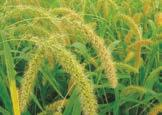
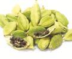
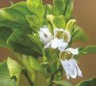
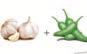

தகட்ட

த சதை வாகுளாசாரத்‌ தாவரவியல்‌ பாடம்‌ பொருளாதாரப்‌ பயனுள்ள \] 0 தாவரங்களும்‌ தொழில்முனைவுத்‌

(தாவரவியலும்‌

ரர ஆ

இப்பாடத்தினை கற்போர்‌.

பல்வேறு உணவுக்‌ தாவரங்களின்‌ தோற்றம்‌, 'விளையமிபம்‌ மற்றும்‌ பயன்பாடு பற்றிய அறிவைப்‌ பெறவும்‌:

4 வெவ்வேறு நறுமணப்வாருட்களையும்‌, 'சவையூப்டிகளையும்‌ மற்றும்‌ அவற்றின்‌ பயன்களையும்‌ விளக்கவும்‌

4.  நார்கள்‌, மரக்கட்டைகள்‌, காகிதம்‌ மற்றம்‌. சாயம்‌ கருக்கும்‌ தாவரங்களின்‌ பலன்களை வெளிப்பக்கம்‌
    
5.  மூலிகைத்‌ தாஷங்களின்‌ செயலாக்க மூல. மருந்து பயன்பாடு பற்றிய கறிவைப்‌ பெறவும்‌
    

4 காளன்‌ சாகுபடி, 500 உற்பத்தி ம்றும்‌ திரவ கற்களை உர உற்பத்தி மய்ய திறனைப்‌ உறவும்‌.

4 இயற்கை வேளாண்மை, உயிரி உரங்கள்‌, உயிரிபூச்சிவிரப்டி பற்றிய சுலிவைப்‌ பெறவும்‌

4 கண்ணாடித்தாவர பேணகம்மற்றும்‌ போன்சாய்‌ செய்யக்‌ கற்றுக்கொள்ளவும்‌, மேலும்‌ மூலிகைத்‌

101 உணவுத்‌ தாங்கள்‌. 10.2 நறுமணப்வாருட்கள்‌, சுவையூட்டிகள்‌ 10௯ நார்கள்‌

10௧ மரக்கட்டை

மக மரப்பால்‌

10௧ மரக்க்ஷ்‌

107 சாயங்கள்‌:

10௦ ஒப்பனைப்‌ பொருட்கள்‌ 109 பாரம்பரிய மருத்துவமுறைகள்‌: 1010 மூலிகைத்‌ தாவரங்கள்‌.

10 ஷாழில்முனைவுத்‌ தாவரவியல்‌.

பட்பட்ட்டப

நிலத்திலும்‌, நீரிலும்‌ பரந்துபட்ட ாவரத்‌ தொகுதிகளை "நேரடியாகவோ மறைமுகமாகவோ சார்ந்து அனைத்து வகையான. உயிரினங்களும்‌ வாழ்கின்றன. வனாற்றுக்கு முந்தைய மனிதர்களின்‌ வாழ்நாள்‌ பழங்கள்‌, கீரைகள்‌, கிழங்குகள்‌ முதலியவற்றைச்‌ சேகரிப்பதிலும்‌, விலங்குகளை வேட்டையாடுவதிலும்‌ கழிந்தது... காவரங்களையும்‌, விலங்குகளையும்‌ வள்ப்பச்‌ சூழலுக்கு உட்படக்தியதன்‌ மூலம்‌ உரி உணவு உற்பத்திக்க வழி வதக்தது. இதுவே நாகரிக

வர்சசிக்கு... அடிப்படையாக. அமைந்தது. ஆரம்பகாலத்தில்‌ உலகின்‌ வெவ்வேறு பகுதிகளில்‌ தோன்றிய நாகரிகங்கள்‌: பல்வேறு

'நோக்கங்களுக்காகம்‌ பலவகையான தாவரங்களை அவற்றின்‌... பயன்பாப்டன்‌.... கடிப்பபையில்‌ வணர்பபுச்மழலுக்கு... உட்டருத்தின.. இவ்வகை: பொருளாதார முக்கியத்துவம்‌ வாய்ந்த தாவரங்கள்‌ அவற்றின்‌ பயன்பாட்டின்‌ கமப்படையில்‌ உணவுக்‌ தாவரங்கள்‌, தீவனத்‌ தாவரங்கள்‌, நார்‌ தாவரங்கள்‌, கட்டை தரும்‌ தாவரங்கள்‌, மூலிகைத்‌ தாவரங்கள்‌, காகிதத்‌. தொழிற்சாலையில்‌ பயன்படுத்தப்பம்‌ தாவரங்கள்‌, சாயத்‌ தாவரங்கள்‌, ஒப்பனைப்‌ பொருட்களில்‌ பயன்பருத்தப்படம்‌ தாவரங்கள்‌ என: வகைப்பரத்கப்பநகின்றன.. ஒவ்வாரு வகையிலும்‌ பொருளாதார... முக்கியத்துவம்‌... வாய்ந்த 'தேர்ந்தெடுக்கப்பட்ட தாவரங்கள்‌ இப்பாடம்‌ பகுதியில்‌ விவாதிக்கப்படுகின்றன.

101 உணவுத்‌ தாவரங்கு

ஏறக்குறைய 10000 உணவுத்‌ தாவரங்கள்‌ தற்போது பயன்பாப்டில்‌ உள்ளன. இவற்றில்‌ ஏறக்குறைய (500. சிற்றினங்கள்‌... மட்டுமே பமிரிடப்பறகின்றன. இருப்பினும்‌ பெரும்பான்மை. மக்களின்‌ உணவு, அப்படை சிசி, கோதுமை, சோனம்‌ ஆகிய மூன்று புல்வகைகளை மட்டுமே அதிகம்‌ சார்ந்துள்ளது.

10.  தானிய தானியம்‌ எனும்‌ சொல்‌ "சிஸ்‌. (ஸு) எனும்‌. வார்த்தையிலிருந்து உருவானது. இது ரோமானியக்‌ கொன்மத்தில்‌ வேளாண்மைக்‌ கடவுளைக்‌ கறக்கும்‌. சரசம்‌ மிதந்த உண்ணக்கூடிய விதைகளுக்காக, வளர்க்கப்படும்‌. எல்லாத்‌ தானிய வகைகளுமே 'போயேசி எனப்படும்‌ புல்‌ கர்பத்‌ தாவரங்களாக்‌.

ஹவராடுஞ்௦9ட/

தானியங்கள்‌ பின்வரும்‌ காரணங்களால்‌ உணவுத்‌

'தாஷங்களில்‌ முக்கியத்துவம்‌ பெறுகின்றன.

ட எல்வகை வளர்‌ சூழலுக்கும்‌ ஏற்ப வெற்றிகரமாகத்‌ தகவமைத்துக்‌ கொள்ளும்‌ தன்மை (ரர்‌)

&. எளிதில்‌ பமிறிபப்படக்கூடியவை.

நட அதிக. அடிகிளைத்தல்‌ (1/௪) ஷய்யம்‌ தன்மையினால்‌ ஒரு குறிப்பட்ட நிலப்பரப்பில்‌ அதிக விளைச்சல்‌ கிடைக்கச்‌ ஷய்தல்‌

ந. ஊறிந்த... உலர்ந்த தானியங்களை: எவ்விதச்‌ சேதமுமின்றி எளிதில்‌ கையாளவும்‌, கொண்டி, செல்லவும்‌, சேமித்து வைக்கவும்‌ முடியம்‌.

மட யயர்‌ கலோரி. மதிப்புள்ள ஆற்றலை. வழங்கக்கூடியவை. காற்போஷைட்ரேட்டுகள்‌, புரதங்கள்‌, நார்கள்‌

மற்றும்‌ பலவகையான வைட்டமின்கள்‌, கனிமங்கள்‌

போன்ற ஊட்‌

வழங்குகின்றன.

தானியங்கள்‌.

வகைப்படுத்தப்பரகின்றன.

வருந்தானியங்கள்‌: நல்‌.

தாஷலியல்‌ வயர்‌: ஒரைசா சட்டைவா

ேங்கம்‌ நிலை நீரில்‌ வளரும்‌ பகதி நீர்வா்த (2! ஜெ) தாவரம்‌ ரல்‌. முக்கியமான உணவப்பயிரான "இதுபிடிடப்பவதிலும்‌ உற்பத்தியிலும்‌ கோதுமைக்கு. "த்தப்டியாக இரண்டாவது இடத்தைப்பெற்றள்ளது. கார்போஹைட்ரேட்டை வங்கம்‌ மக்கிய ஆகாரமாக. ரிசி உள்ளது.

தோற்றம்‌ மற்றும்‌ விளையுமடம்‌

ஓஷல்லின்‌ தோற்ற மையம்‌ தென்கிழக்கு ஆசியா எனக்‌. கரகப்புகிறது. சீனா, இந்தியா, தாய்லாந்து போன்ற. நாடுகளில்‌ நெல்‌ பமிரட்ப£்கான தொன்மைக்கால. சான்றுகள்‌ கண்டறியப்பட்டள்ளன. நல்‌ தமிழகத்தின்‌ ஓடல்பாமற்றும்‌ பாசனப்‌ பகுதிகளில்‌ பிரிடப்பகறது. பயன்கள்‌

அசி கலோரி மிதந்க எளிதில்‌ ஊரிமானமாகக்‌ கடய. உணவு இது ஷற்த மற்றும்‌ வடகிழக்கு இந்தியாவில்‌. முக்கிய உணவாகப்‌ பயண்படுக்கப்புகிறு.

அவல்‌ (ஸ்ம0௦0)/ வாறி(9பல்0௦0) போன்ற சிசி பொருட்கள்‌ காலை உணவாகவும்‌, சிற்றுண்டியாகவம்‌

இந்தியாவின்‌. பல்வேறு: பகுதிகளில்‌. பயன்பரத்தப்படுகின்றன.

அரிசி. தவிட்டலிருந்து. பெறப்பட்ட விட்ட எண்ணெய்‌ (0௨. பன. 2). சமையலிலம்‌,

கொழிற்சாலைகளிலும்‌ பயன்பருக்சப்பரகின்றது. உமி (மலடு எறிவாருளாகவும்‌, வாதி. கட்டுவதற்கும்‌, உரம்‌ போன்றவை தயாரிக்கவும்‌ பயன்படத்தப்புகின்றன.

நிறுவனம்‌ (851)

ன பன்னாட்டு. நல்‌ ஆராய்ச்சி

நிறுவனம்‌ (01) பிலிப்பய்ன்ஸ்‌ தலைநகரமான: மணிலாவின்‌ லாஸ்‌ பனோஸில்‌ அமைந்துள்ளது. உலகிலேயே நெல்‌ ஆராய்ச்சிகளை மட்டுமே மேற்ாள்கின்ற ஒரே நிறுவனம்‌ \[8 ஆகம்‌.

'இந்றிறுவனத்தின்‌ முக்கிய நோக்கம்‌ வறுமை, பசி ஊட்டச்சத்து குறையாபு போன்றவற்றை நீக்க வாழ்வாதாரங்கள்‌ மற்றும்‌ ஊட்டச்‌ சத்துக்களை: மேம்பரக்துவதாகம்‌. உலகிலுள்ள எல்லா 8. 8ல்‌. வகைகளும்‌ நல்‌ கலப்பினம்‌ பயிர்‌ பெருக்கத்‌ திட்டங்கள்‌ மூலம்‌ உற்பத்தி ய்து ரர ெளியிட்டதாகம்‌

இன்றுவரை ஈர ௦4௨ கரசி ரகங்களை: உற்பத்தி ய்து. ரர நாருகளில்‌ வெளியிட்டுள்ளது. “இந்நிறுவனம்‌ 960-களின்‌ துவக்கத்தில்‌: எனும்‌

உயர்விளைச்சல்‌ குட்டை ரக நெல்‌ வகையை.

மன்னாப்ு. நெல்‌ ஆராய்ச்சி

ஹவராடுஞ்௦9ட/

கோதுமை தாவரவியல்‌ வயர்‌: டிிபுக்கம்‌ எஸ்டிவம்‌.

தோற்றம்‌ மற்றும்‌ விளையுமிடம்‌

கோதுமை. பமிற்பதற்கான... தொன்மை ஆதச்சன்றுகள்‌ செழுமை பிறை (௭1௨ ௭௯௦௭) பகுதியில்‌ கிடைத்துள்ளன. பொதுவாகப்‌ பயிரிடப்‌ கோதுமை ரகமான பரிட்டுக்கம்‌ ஹஸ்டிவம்‌ கமழ்‌ 7500 ஆண்டுகளாகப்‌. பமிறிபப்பட்டு.. வருகின்றது. "உத்திரபிரதேசம்‌, பஞ்சாப்‌ ஹரியானா, இராஜஸ்தான்‌, மத்தியப்பிரதேசம்‌, பீகார்‌ போன்ற வட இந்திய மாறிலங்களில்‌ கோதுமை அதிகமாகப்பமிறிடப்புகிறத.

பயன்கள்‌ கோதுமை. வட இந்தியாவில்‌ முக்கிய உணவாக. உள்ளது கோதுமைமாவுளாட்டமற்றும்ம்ற சமனை: வொருப்கள்தயாரக்கஎற்றது மைநாஎன்றழைக்கப்ப்‌ நார்சத்து அற்ற பதபடத்தப்பட்ட கோதுமை மாவு,

மற்றம்‌. கடினமான கருஷண்திசக்கள்‌ உள்ளன. மக்காச்சோளப்பொரியின்‌' வரும்பகுதி ஹன்மையான: கருஷண்திசுவாலானது. இதைத்‌ கழ்்து கம கருவூண்திசு உள்ளது நடக்கும்போது உப்புத்‌ தசம்‌ மற்றும்‌ பதம்‌ ஆகியவை எலட்சனால்‌ ஆன வாருட்களாக மாற்றப்படகின்றன, மேலும்‌, அழுத்தம்‌ அதிகரிக்கும்போது, மென்மையான கருவூண்திச விரிவடைந்து. வெடிக்கும்போது ௭ஜலட்டின்‌ தரசம்‌ நுரையாக மாற்றப்புகிறது 'அவைஉடனேஎளிதாய்க்கனதன்மையடைந்து சுவையான, மொறுமாறுப்பான மக்காச்சோளப்வோரியாக மாறுகின்றது.

வாருளாஷம்பயனுன்ள தாஷங்களும்‌ கொழில்முனைவுத்‌ ாஷவியழம்‌

பயன்கள்‌. உற்பத்தி செய்யப்படும்‌ வரும்பான்மை மக்காச்சோளம்‌: உணவை விடத்‌ தீவனமாகவே பயன்படுகிறது. மக்காச்சோள நீரப்பாகு (வாடு) குழந்தைகளுக்கான: உணவுத்தயாரிப்பில்பயன்படுகின்றது மக்காச்சோளம்‌. மதுபானம்‌: தயாரிக்கும்‌ ஆலைகளில்‌: மூலப்பொருளாக.

காவரங்களிலிருந்து வயறப்பட்டி, உண்ணப்படும்‌. தானியங்களைக்‌. குறிக்கிறது எடுத்துக்காட்டி சீனா மோடியம்‌.

1012 சிறுதானியங்கள்‌ (44/20). ஆப்பிரிக்கா மற்றும்‌ ஆசியாவில்‌ பழங்கால மக்களால்‌. முதலில்‌ பயிரிடப்பட்ட சிறிய விதைகள்‌ பலவற்ிற்க்‌ சிறுதானியங்கள்‌ புரு. பயன்பரத்தப்பருகின்றது. இவை (குட்டன்‌) குறைவான:

சர்க்கரை. அளவுக்‌ 'குறிமீட்டைக்‌ காண்ட தானிய வகையாகம்‌.

கம்பு (ஊரா தாவரவியல்‌ வயர்‌: வணிசிட்டம்‌சுவரிககானம்‌. இது. இந்தியாவிலும்‌, ஆப்பிரிக்காவிலம்‌ 'றிுகப்ப்தப்பட்ட கம்பு வகைகளில்‌ ஒன்றாகும்‌. "இந்தியாவின்‌ பல பகநிகளிலம்‌, குறிப்பாகக்‌ ககரால்‌, ராஜஸ்தான்‌. போன்ற மாநிலங்களில்‌ அதிகமாகப்‌ மலறிபப்படுகின்றத.

(இது பொதுவாகத்‌ தட்டை ரராப்டி நரச பரப பசையமற்ற தானிய அடிப்படையிலான பொருட்கள்‌ “செய்யப்‌ பயன்பரத்தப்பருிறத. கம்மங்கூழ்‌, மஸ்க்‌, மாஸ்தாமற்ும்‌பால்‌தவிரத்தபிரோபயாட்டிக (ர) பானங்கள்‌ தயாரிக்கப்‌ பயன்படுகின்றது

ஹவராடுஞ்௦9ட/

0௩. 1.

கேழ்வரகு.

படம்‌10அ-சிறுநானியங்கள்‌

கேழ்வரகு (119௭ 6) தாவரவியல்‌ வயர்‌: எல்லன்‌ கேரகளா 'கேழ்வரகுகிழக்குஆப்பிரிக்காவிலிருந்த இந்தியாவிற்கு வெகு காலத்திற்கு முன்பே சஸிமுகப்பருக்கப்ப்ட பிர்‌. இது கால்சியம்‌ நிரைந்த.

"இந்தியாவின்‌ பல தற்கு மலைப்பததிகளில்‌ ஒரு முக்கிய உணவாக இறு பயன்பரத்தப்புகிறது. கேழ்வரகு. கஞ்சியாகவோ, கூழாகவோ "உண்ணப்படுகிறது. ராகிமால்ட்‌ (159. ஈன்‌) ஒரு மிரபலமான ஊட்டச்சத்துப்‌ பானமாகும்‌, கேழ்வரகு தாதி பானங்கள்‌ தயாரிப்பில்‌ ("ளான 6௭௨009) மூலப்வொருளாகப்‌ பயன்படுகிறது.

சோளம்‌ (9௦1ரரயார,

தாவரவியல்‌ வயர்‌: வர்கம்‌ வல்சேர்‌

சோளம்‌ ஆப்ிரிக்காவிலிருந்து அறிமுக்படக்கப்ப்டது. உலகின்‌ முக்கிய சிறுதானியங்களில்‌ சோளமும்‌: ஒன்று. கால்சியம்‌ மற்றும்‌ இரும்பு சத்து அதிக அளவில்‌ உள்ளது.

கோழி, பறவைகள்‌, பன்றிகள்‌... மற்றும்‌ கால்நடைகளுக்குச்‌... சோளம்‌. தீவனமாகப்‌

மயன்படகின்றது நொதி சாராயம்‌ பானங்களின்‌ மூலப்‌ வாகுளாக உள்ளத.

1013 மிகச்சிறு தானியங்‌, சாமை (பரக சிஏ) தாஷவியல்‌ வயர்‌: பாணிக்கம்‌ சமத்ன்ஸ்‌. மழமையான மிகச்சிறு தானியங்களில்‌ சாமை 44௭) ஒன்று இது இந்தியாவைப்‌ பிறப்பிடமாகக்‌ கொண்டது. இன்‌ சிற்றினம்‌... பெயர்‌... சமததிராவிலரநது. சேகரிக்கப்பட்ட வகை மாதிரியின்‌ டிப்படையில்‌

(க்ளரளிலு,

சுரப்பட்டுள்ளது. இதில்‌ இரும்பு சத்து. நார்சத்து போன்றவை அரிசியை விட அதிகமாக இருப்பதால்‌ நீரழிவு... நோயாளிகளுக்குச்‌. சிறந்ததாகக்‌ கருதப்படுகிறது.

பயன்கள்‌.

சாமை. சறிசியைப்‌ போன்றே சமைக்கவும்‌, அரைக்கவும்‌, அருமனை பண்டத்‌ தயாரிப்பிலும்‌ பயன்பரகிறது. இது இரக்கச்‌ சோகை, மலச்சிக்கல்‌. மற்றும்‌. இதர. ஊரிமானக்‌ கோளாறுகளைக்‌ ணப்பற்துகிறது.

தினை (808116).

தாவரவியல்‌ வயர்‌: சி்பேரியா இடாலிக்கா “இந்தியாவில்‌ பாரம்பறியமாகப்‌ பயன்படுத்தப்‌ தினை வகைகளில்‌ இதவும்‌ ஒன்று. சமார்‌ 6,00௦. வருடங்களுக்கு முன்பே சீனாவில்‌ வளர்ப்ப்‌ கழலுக்கு உப்படக்ப்பட்டற. தினையில்‌ முழம்‌, கார்போஹைட்ரேட்‌, வைட்டமின்‌ 6, ௦, பொட்டாசியம்‌ மறறும்‌ கால்சியம்‌ போன்றவைமிதந்தள்ளை. "இனை இதயத்தைப்‌ பலப்படுத்தவும்‌, கண்பார்வையை மேம்படுத்தவும்‌. பயன்படுகிறது... தினைக்கக்சி பாலூட்டும்‌ அன்னையருக்குக்‌ கொருக்கப்புகிறது.

வரகு (60001416)) தாவரவியல்‌ வயர்‌: பஸ்பாலம்‌ ஸ்குரோபிதலேட்டம்‌. வகு. மேற்கு ஆப்பிறிக்காவைப்‌ பிறப்பிடமாகக்‌ கொண்டது. நார்சத்து, பரதம்‌ மற்றும்‌ கனிமங்கள்‌ நிறைந்தது.

பயன்கள்‌.

"வரகு மாவாக அரைக்கப்ப்ுக களியாக்கப்படகின்றது (௫ப்டு, சிறுநீர்‌ பெருக்கியாகவும்‌, மலச்சிக்கலைக்‌ 'குணப்படத்தவும்‌, உடல்‌ பருமனைக்‌ குறைக்கவும்‌, தத்தர்‌ சர்க்கரை மற்றும்‌ இரத்த அழுத்தத்தைக்‌

படம்‌ 10: சிறுதானியங்கள்‌

4௨. வருசாவரப்பயனுள்ள தாவரங்களும்‌ ஷொழில்முனைவுத்‌ வவரவியலம்‌

ஹவராடுஞ்௦9ட/

க்ஷ

முளைகப்பய பாசிப்பயறு,

உளுந்து ன்‌

கொண்டை கடலை.

படம்‌ 0அபரப்பு வகைகள்‌:

1014 பருப்பு வகைகள்‌ (9666). “பல்சஸ்‌" என்ற சால்‌"கடர்ந்த ஆப்‌" எனப்பொருள்படும்‌: த்தன்‌ வார்க்தைகளான பல்ஸ்‌ (அல்லது ப்டஸ்‌. முமிவு என்ற சொல்லிலிருந்து வற்பட்டது. பருப்பு “என்பது 3பபேஸி கடம்பங்களிலிருந்து வறப்பம்‌. விதைகள்‌... இவை... உலகிலுள்ள. மக்களுக்கும்‌ தேவையான தாவரசார்‌. (இனாம்‌ 62௦௯4) புரதம்‌, ஸைட்பமின்கள்‌.. மற்றும்‌... கனிமங்களை வழங்குகின்றன. உளுந்து (௨௦்.ரகா)) தாஷலியல்‌ வயம்‌: விக்னாமுங்கோ'

ண கைகள்‌ "இந்தியாவைப்‌ பிறப்பிடமாகக்‌ கொண்டது. தொன்மை: தொல்காவரனியல்‌ சான்றுகள்‌ (பனிமலை சமர்‌ 350௦ ஆண்டிகளுக்கு முன்பே தந்தியாவில்‌ உளுந்து இருந்ததை உறுதி செய்கின்றன. இது வண்ட இடங்களில்‌ மானாவாரி னன). பமிராகம்‌ மவிறிபபபடகிறறு. உலகளாவிய உளுந்து உற்பத்தியில்‌. "இந்தியா 60% பங்களிப்பு செய்கிறது. இந்தியாவில்‌. உத்திரப்‌ மிரதோம்‌, சப்டிஸ்க்‌, க்நாடகா. போன்ற மாநிலங்களில்‌ அதிகமாகப்‌ பயிறடப்படகின்றது. பயன்கள்‌ உளுந்து விதைகள்‌ முழுகாகவோ, உடைத்தோ, வறுக்தோ அல்லது... மாவாக... அரைத்தோ. உண்ணபப்பருகிறது. உளுந்துமாவு. பிரபலமான தென்னிந்தியக்‌ காலை சிற்றுண்டகளில்‌ உணவைத்‌. 'தயாிப்பதந்கான ஒரு முக்கியம்‌ பொருளாக உள்ளது. உடைத்த உளுத்தம்‌ பருப்பு இந்தியக்‌ குழம்பு. வகைகளில்‌ நாளிக்கப்பயன்படுின்றத. துவரை (1௦௦ ரகா), தாஷவியல்‌ வயர்‌: சரானஸ்‌ கஜன்‌ தோற்றம்‌ மற்றும்‌ விளையுமிடம்‌. ஷன்னிந்தியாலில்‌ தோன்றிய ஒரே பரப்பு வகை. துவரை ஆகும்‌. இது மகாராஸ்டிரா, ஆந்திரப்‌ பிரதேசம்‌, மத்தியப்‌ மிரதேசம்‌, கர்நாடகா, குஹாத்‌ போன்ற. மாநிலங்களில்‌ அதிகமாகப்‌ பயிறடப்படகின்றது. பயன்கள்‌ "துவரம்‌ பருப்பு ஹெண்ணிந்தியாவிண்‌ சிறப்பு வகை: 'கழம்பான சாம்பாரின்‌ மிக முக்கிய சங்கமாகம்‌

வறுத்து உப்பிட்ட அல்லது உப்பிடாத பருப்பு ஒரு மரரபரலமான நொறுக்கத்தீனியாகம்‌. இளம்‌ காய்கள்‌ (பாட சமைத்து உண்ணப்பகின்றன. பாசிப்பயறு / பாசிப்பருப்பு (௦ எகா) தாவரவியல்‌ வயர்‌: விக்னா ரேடியேட்டா

தோற்றம்‌ மற்றும்‌ விளையமிடம்‌

பாசியபயறு இந்தியானில்‌ தோன்றியது என்பதற்கான கதொல்லியல்‌ சான்றுகள்‌ மகாராஷ்டிரா மாறிலத்தல்‌. 'கிடைக்கப்பெற்றன. இது மத்தியபிரதேசம்‌, கர்நாடகா, தமிழ்நாடு. போன்ற மாநிலங்களில்‌ அதிகமாகப்‌ பலரிபப்பகிறது.

பயன்கள்‌

"இதை வறுக்கோ, சமைத்தோ, முளைக்க வைத்தோ. பயன்படுத்தலாம்‌... பாசிப்பருப்பு... தமிழ்நாப்ல்‌ பிரபலமான காலை உணவான பொங்கலில்‌ ஒரு. முக்கியம்‌ பொருளாகம்‌ பயன்பரகின்றது. வறுத்தும்‌ தோல்‌ நீக்கப்பட்ட உடைக்க அல்லது முழுப்‌ பயிறு, மிரபலமானசசி்றுண்டியாகப்பயன்பருக்கபபடுகின்றன. “இதன்‌ மாவு பாரம்பரியமாகத்‌ கோல்‌ பராமரிப்புக்கான. ஒப்பனைப்‌ பொருளாகப்‌ பயன்படக்கப்பரகின்றது. கொண்டைக்கடலை (9௦009 ரசா), தாவரவியல்‌ வயர்‌: சச்‌ எரேப்டினம்‌:

தோற்றம்‌ மற்றும்‌ விளையும்‌ கொண்டைக்கடலை மேற்கு ஆசியாவில்‌ தோன்றியது. “மேலும்‌ இந்தியாவில்‌ 4000 ஆண்டுகளுக்கு முன்னரே பயிரிபப்பப்டது.. மத்தியப்‌ பிரதோம்‌, உத்திரப்பிரதேசம்‌, ராதஸ்தான்‌ மாநிலங்களில்‌ அதிகமாகப்‌ பயிறடபபடகின்றது.

பயன்கள்‌ கொண்டைக்கடலையிலுள்ள பரம்‌, அமினோ சமிலம்‌, தன்‌. ஊரிமானக்கன்மை ஆகியவற்றின்‌ கடிப்பபையில்‌ உயர்‌. மதிப்பபையதாகக்‌ கருதப்படுகின்றது. குழந்தைகளுக்கான உணவின்‌: முக்கிய உயப்வாருளாக முளைகப்டிய கடலை. பெரும்பாலும்‌. பயன்படத்தப்பகிறது. கடலை மாவு பலவகையான. இந்திய இனிப்பு வகைகளின்‌ மூலப்வாருளாக உள்ளது. வறுத்து உப்பிட்ட முழு அல்லது. உடைத்த கடலை, நடக்க. மக்களின்‌: மரபலமான திண்மண்டமாக உள்ளது.

வொருளாதரம்பயனுன்ள தாவரங்களும்‌ கொழிக்முனையுக்‌ காவரவியதுல்‌ 213

ஹவராடுஞ்௦9ட/

1015.  காய்கறிகள்‌

காய்கறிகள்‌ நிறைந்த ஒரு சந்தையில்‌ நடந்து செல்லும்போது அடுக்கிய வெண்டைக்காய்கள்‌, மலைபோல்‌ குவிந்திருக்கும்‌ உருளைக்கிழங்குகள்‌, கூம்பாகக்‌ குவித்திருக்கும்‌ கத்தரிக்காய்‌, தக்காளி, வெள்ளரி. போன்றவற்றைக்‌ காண்டிர்கள்‌. பழக்கவழக்கங்கள்‌, கடம்பர்‌ சுவைக்கேற்றவற்றைப்‌ புதிய சத்தான; மென்மையான, பழுக்தவற்றை அனுபவம்‌ மற்றும்‌ பாரம்பரிய பழக்கத்தின்‌ மூலம்‌ தறிவு செய்கின்றோம்‌. நாம்‌ ஏன்‌ காய்கறிகளைச்‌ சாப்பிடவேண்டும்‌?அவைநமக்கு என்னதருகின்றன? காங்கறிகளுக்கு ஆரோக்கியமான உணவில்‌. மங்கு... உள்ளது. வொட்பாசியம்‌,. நூர்ச்துக்கள்‌ போலிக்‌ சுமிலம்‌, வைட்டமின்‌ 4, மற்றும்‌ ௦ போன்ற மல ஊட்டச்சத்துக்களைக்‌ காய்கறிகள்‌ வழங்குகின்றன. “இதிலுள்ள ஊட்டச்சத்துக்கள்‌ நமது ஆரோக்கியத்தைப்‌ பராமரிப்பதற்கு மிகவும்‌ அவசியம்‌,

உருளைக்கிழங்கு (501200) தாவரவியல்‌ பெயர்‌: சொலானம்‌ டியூபரோசம்‌: ம்பம்‌: வலானேசி தோற்றம்‌ மற்றும்‌ விளையுமிடம்‌ வெருமற்றும்வொலிவியாவின்‌உயர்மலைப்பகுதிகளில்‌ உருளைக்கிழங்கு. தோன்றியது, இந்தியாவில்‌ உத்திரப்பிரதேசம்‌, மேற்கு வங்கம்‌, கோர்‌ போன்ற மாறிலங்களில்‌ அதிகமாகப்‌. பயிரிடப்புகி்றது. தென்னிந்திய மலைப்பகுதியில்‌ (9௦பர்னா (4) உள்ள நீலகிரி மற்றும்‌. பழணி மலைத்‌ தொடர்கள்‌ உருளைக்கிழங்கு விளைச்சலில்‌ முக்கியப்‌ பங்கு யன உருளைக்கிழங்கு. வேகவைத்தோ. (ண, "வறுத்தோ, அருமனையிலிட்டோ, ஆப்புகளாகலோ, மசித்தோ அல்லது, 'அப்பமாகவோ. மபயன்படத்தப்படகின்றது. வறுசீவல்கள்‌ (0405 மற்றும்‌ மதுபான இஸ\] தொழிற்சாலைகளில்‌ முக்கிய மூலப்போருளாகம்‌, பயன்பருக்கப்புகின்றது. நுண்ணுயிரியல்‌. மற்றும்‌ மருத்துவப்‌ பயன்பாருகளுக்கான பொருட்களின்‌ உற்பத்தியிலும்‌ முக்கிய இருப்வாருளாக உள்ளது. வெண்டைக்காய்‌ (.ச6்‌/9 99)

தாவரவியல்‌ வயர்‌: எபல்மாஸ்கஸ்‌ எஸ்குஸண்டஸ்‌. ம்பம்‌: மால்வேசி

பம்‌ மறும்‌ விளையுிடம்‌

வெண்டை வெப்பமண்டல ஆப்பரிக்காவை. பூர்வமாகக்‌ கொண்டது. அசாம்‌, மகாமான்டிரா, ககராத்‌ ஆகிய மாறிலங்களில்‌ அஜிகமாகப்‌ முமிழிப்பருகின்றது. தமிழகத்தில்‌ கோயம்பத்தூர்‌,

தர்மபுரி, வேலூர்‌ ஆகிய பகுதிகளில்‌ அதிகமாகப்‌ பமிறிடப்புகின்றது.

பயன்கள்‌.

(முற்றாத பசுமையான இளம்‌ காய்கள்‌ காங்கறிகளாகப்‌ பயன்பரத்தப்படகின்றன. வட்டப்பட்டு உலரவைக்கப்‌ பட்ட (சண்ஸ்ளிமரி வெண்டை பின்பயன்பாட்டிற்காக பாதுகாக்கப்புகிறது.. இது மிக முக்கியமான ஊட்டர்சத்தக்களைக்‌ கொண்டுள்ளது.

வெள்ளரி (பபா)

தாவரவியல்‌ வயர்‌ :க்குமிஸ்‌ சடிவஸ்‌:

"கம்பம்‌; கக்கறபட்டேசி

(க்கட்‌ என்பது கக்கற்பிட்டேசிகுரம்பத்தைச்‌ சந்த கொடயின தாவரங்களான வெள்ளரி, ஸ்குவாஸ்‌. (ஷ்‌, பூசண்‌ முலாம்‌ போன்றவை இல்வினம்‌. சார்ந்த காய்கறிகளைக்‌ கிக்கம்‌ சொல்லாகம்‌,

தோற்றம்‌ மற்றும்‌ விளையுமிடம்‌ "இந்தியா. முழுவதிலும்‌ பரவலாக. வெள்ளரி பமிறிப்பரகிறது.. இந்தியாவின்‌ அனைத்துப்‌

பகுதிகளிலும்‌ வெள்ளரி ஒரு முக்கியக்‌ கோடைக்காலக்‌ 'காய்கறியாகப்‌ பயன்படத்தப்பகின்றது. இந்தியாவில்‌. தோன்றிய இல்ினம்‌, 800௦ ஆண்டிகளாகப்‌ பலிரப்பட்ட வருகின்றது.

மயன்கள்‌.

வகையைப்‌ பொறுச்து இளம்‌ சுல்லநு முதிர்ந்க பழங்களை நேரடியாகவோ அல்லது சமைத்தோ உண்ணப்படுகிறது. சாலட்‌ (கடி மற்றும்‌ ஊறுகாய்‌ தயாரி்கப்படகிறது. வெள்ளரி விதைகளிலிருந்து பெறப்பப்ட எண்ணெய்‌ மூளை மற்றும்‌ உடலக்க்‌ சிறக்க மேலும்‌ தன்‌ விதைப்பரு்பு பல்வேறு. "இனிய தயாரிப்புகளில்‌ பயன்படுகின்றது.

101௧ பழங்கள்‌.

உண்ணக்கூடிய பழங்கள்‌ சதையற்றுடன்‌, இனிய வாசனை மற்றும்‌. சுவையுபையன. பழங்கள்‌ பொட்பாசியம்‌, நார்ச்சத்து. கபோலிக்‌ அமிலம்‌, விட்டமின்கள்‌ போன்ற பல ஊட்டர்ச்தக்களின்‌. மூலமாக உள்ளன. வளரும்‌ தட்பவெப்ப இடத்தைப்‌ பொறுத்துப்‌ பழங்கள்‌ குளிர்மண்டல பழங்கள்‌ (ஆப்பிள்‌, பேரிக்காய்‌, ஊப்டிூப்பிள்‌) வெப்பமண்டலப்‌ பழங்கள்‌. "மா, பலா, வாழை) என வகைப்டுத்கப்பகின்றன.

ந்தம்‌. பாடப்பகுதியில்‌ சில வெப்பமண்டலப்‌ பழங்களைப்பற்றிக்‌ காண்போம்‌. மா (4௭00)

தாவரவியல்‌ வயர்‌: மாஞ்சி.ஃவரா இண்மகா. கும்பம்‌; அனகார்டியேசி

தோற்றம்‌ மற்றும்‌ விளையுமிடம்‌

மா ஷற்காசியாவைக்‌ குறிப்பாகப்‌ பர்மா மற்றும்‌ கிழக்கந்தியாவைப்‌ பிறப்பிடமாகக்‌ கொண்டது. இது

346.  வருசாவரப்பயனுள்ள தாவரங்களும்‌ கொழில்முனைவுத்‌ ாவரவியலம்‌ஹவராடுஞ்௦9ட/

இந்தியாவின்‌... தேசியப்‌

பழமாகம்‌. ஆந்திரப்‌ பிரதேசம்‌, பீகார்‌, குஜராத்‌, கர்நாடகா... ஆகியவை. மாம்பழம்‌. சதிகமாகம்‌

மமிறிடம்படம்‌ மாறிலங்களாகும்‌ கமிழகத்தல்‌... சேலம்‌ கிருஸ்கைகறி,... தர்வி ஆகியவை அதிக மாம்பழ. "உற்பத்தி செய்யம்‌ மாவட்டங்களாகும்‌. சஸ்போன்ஸா, பங்கனபள்ளி, நீலம்‌, மல்கோவா போன்றவை. "இந்தியாவின்‌ முக்கிய மாம்பழ வகைகள்‌,

மாம்பழம்‌ இந்தியாவில்‌ அதிகளவில்‌ உட்கொள்ளப்பும மம்‌. இதில சப்பா கரோட்டின்‌ சறிகமாக உள்ளது.. இது மின்\_ணவுப்‌ பண்டமாகவோ£, பதப்புககப்ப்ி அடைக்கம்பட்டோ, உலர்த்திப்‌ பாதுகக்கப்பட்டோ, இந்திய. உணவில்‌. பல... வழிகளில்‌. மயன்பரத்கம்பகறது. புளித்த, பழுக்காத மாங்காய்‌. சட்னி, ஊறுகாய்‌, கூட்டு தயாரிக்கும்‌ அல்லது உப்ப மிளகாய்‌. சேர்த்து. நேரடியாக உண்ணவும்‌. மயன்பரகிறது..... மாங்காயின்‌... சதைப்பற்று மகுதியிலிருந்து கனிமம்‌ (ல்லி) தயரிக்கப்புகிறத. காற்றேற்றபபட்ட மற்றும்‌... காற்றேற்றப்பபாத. மாம்பழச்சாறு ஒரு பீரபலமான பழச்சாறு பானமாகும்‌. வாழை (ளன,

தாஷவியல்‌ வயர்‌: மிசா, பாடசியாக்‌ கட்பம்‌ியூசேசி

தோற்றம்‌ மற்றும்‌ விளையுமிடம்‌

"வாழை ஷென்கிழக்கு ஆசியாவில்‌ வளர்ப்பர்ூலக்ு உட்படுத்கமமட்டது.

வாழை உற்பத்தியில்‌ கமிழ்நாட.. உலகில்‌ முதலிடத்தில்‌ உள்ளது தேன, தரச்சு ஈரோடு, நாத்துக்குடி, கோயம்புத்தூர்‌ கன்னியாகுமரி: கக்சாவர்‌,. திண்டுக்கல்‌ ஆகிய மாவட்டங்கள்‌ துமழ்நாப்டல்‌. வாழை. பமிரிபப்பம்‌ முக்கியப்‌ மகுகிகளாகும்‌. சல்வாழை, நேக்தரன்‌, கற்பூவல்ி. மூவன்‌, பயன்‌ ஆகியவை அதிகமாகப்‌ பயிரிடப்படும்‌ வாழை தூகங்களாகம்‌

படம்‌ 0தமா.

படம்‌ ச:வாழை

பயன்கள்‌ வாழைப்பழத்தில்‌. வொப்பாசியம்‌.. மற்றும்‌ இன்றியமையாத. வைப்பரின்கள்‌.. அதிகமாக: இறந்துள்ளன. இது நேரடியாக அல்லது சமைத்து: (வறுத்து, உ£ர. வைத்து, வேகவைத்து! உண்ணப்படுகிறது... பழம்‌. ப்ப்தப்ப்ட

வாருளாஷம்பயனுன்ள தாஷங்களும்‌ கொழில்முனைவுத்‌ ாஷவியழம்‌

மாவாக்கப்பரிறது. மேலும்‌ நொதிக்க வைக்கப்பட்ட பானங்களான வாழைப்பழச்சாற, £ர்‌, வினிகர்‌, ஒயின்‌ (ஸ்ட தயாரிக்கப்பயன்படகிறற. பலா (080611) தாவரவியல்‌. வயர்‌ கஹெட்டிரோஃபில்லஸ்‌. ரம்பம்‌ மோரேசி

தோற்றம்‌ மற்றும்‌ விளையும்‌ பலா இந்தியாவின்‌ மேற்குக்‌ தொடர்ச்சி மலையைப்‌ பிறப்பிடமாகக்‌ கொண்டது. இத. தமிழ்நாட்டின்‌ மாறில்‌. தமிழ்‌ நாப்ல்‌: கடலூர்‌, கன்னியாக்குமரி, திண்டிக்கல்‌ முுக்கோட்டை, நாமக்கல்‌, ிருஷல்வேலி, நீலகிரி ஆகிய மாவட்டங்களில்‌ அதிகமாக விளைவிக்கப்படகின்றது... பண்ருப்டி, கோயம்புத்தூர்‌ போன்ற இடங்கள்‌ முக்கியச்‌ சந்தை: மையங்கள்‌.

அப்ரோகறிப்பஸ்‌

படம்‌ 0;பலா

மனாச்சளை.. நேரடியாகவோ, சமைத்தோ. உண்ணப்ப்பரகின்றது. பழுக்காத களைத்‌ துண்டுகள்‌. வரித்து... ஹாறுஷாறுப்பான . வறுரீவலாகத்‌

'தயாரிககப்படகின்றது விதைகள்‌ வறுத்தோ,அவித்தோ. உண்ணப்படுகின்றன... பழுக்காத. பலார்சளை காய்கறியாகப்‌பயன்புகிற;ு.

1017 கொட்டைகள்‌ (109)

கொட்டைகள்‌ கடினமான ஏட்ுக்கள்‌ உண்ணக்கூடிய பரும்பைக்‌ கொண்ட எளிய உலர்‌ கணியாகம்‌ 'வெழ்றில்‌ ஆரோக்கியமான கொழுப்புக்‌, நார்ச்சத்து மதம்‌, வைப்பமின்கள்‌, தாதுக்கள்‌ மற்றும்‌ எதிர்‌ ஆேச்கினனேற்றிகள்‌ (ர்வ). கதிகனவு, நிறைந்துள்ளன. இப்பாடத்தில்‌ சில முக்கியமான: கொட்டைகள்‌ கறத்தக்‌ கீழே விளக்கப்பகின்றன. முந்திரி (கஷாய)

தாவரவியல்‌ வயற்‌: அனகார்ியம்‌ ஆக்ஸிஷண்டேமல்‌. 'டம்பம்‌:அனகார்டியேசி

தோற்றம்‌ மற்றும்‌ விளையும்‌

முந்திரி மரேசிலைப்‌ பிறப்பிடமாகக்‌ கொண்டது. ட ஆம்‌ நூற்றாண்டில்‌ பேரத்துக்கய மாலுமிகள்‌ மூலலாக.

இந்தியாவிற்குள்‌ நுழைந்தது. கேரளா, கர்நாடகா, கோவா, மகாராஸ்வா, தமிழ்நாடு மற்றும்‌ ஒடிசாவில்‌

அதிகமாக வளர்க்கப்புகிறது. பயன்கள்‌. முந்திரி பொதுவாக இனிப்புகள்‌ மற்றும்‌ பிற

பண்டங்களை அலங்கரிக்கபயன்பருகிறது. அரைக்கக்‌.

ஹவராடுஞ்௦9ட/

அட்டவணை 10% பிற பொதுவான பழங்கள்‌. வ.எண்‌ | வாதுப்வயர்‌ \[தமிழ்ப் வயர்‌ | தாவரவியல்‌ வயர்‌: ரம்பம்‌ |\] பயன்படும்‌ பகதி. உ ரஷங்யா சியயம்‌குவாஜலா. ரச \[செடச்ளே்மற்றம்‌ 2 \[பள்‌ கெரிக்காயப்பாயா. கெரிக்கேசி \[கணி நடந்தோல்‌ 2 ்ள்தளை. பபூணில்லாகிறாண்டம்‌ ந்பூணிக்கேசி சல்காம்புத்ிச (ரில்‌, 21௪௧௪ 'பைசஸ்‌ சரிகா மோரேசி | சதைப்பற்றான பூத்தஎம்‌. உ\] வசம்‌. \[ஃகோணிச்ஸ்‌டேசிடைலிஃவரா | சளிகேசி | கணித்தோல்‌:

கிடைக்கப்பெறும்‌. பசை (ஷம). சில. ழம்பு.. காணப்புகின்றார்க்கரைதிறம்படம்பறித்தடப்பதற்கு வகைகளுக்கும்‌... இனிப்பு... வகைகளுக்கும்‌... ஏற்றதாக உள்ளதால்‌ வணிக முக்கியத்துவம்‌ வாய்ந்த மூலப்பொருளாக உள்ளது. வறுத்த முத்திறி்பளப்பு... சர்க்கரை தயறிக்கப்பயன்பரகின்றது.

்‌ன்பண்டனகப பன்ச்‌ ்‌ ண்‌ கரு்பு($ப0ஸ௦காச)

தாவரவியல்‌ பயர்‌: சக்கரம்‌ அஃபிசினாரம்‌. கும்பம்‌: போயேசி தோற்றம்‌ மற்றும்‌ விளையுமிடம்‌

முந்திரி பாதம்‌.

தற்போது... பமிரிடப்டகின்ற.. கருப்பு.

॥ நிழகினியாவிலள்ள காட்டு ரவான (ஸம னானை)

மம டக வாப்டைகள்‌ சக்கரம்‌ ஆஃபிசினாரம்‌ மற்றும்‌ இந்தியாவிலுள்ள.

ர னை சக்கரம்‌. ஸ்யான்டேனியத்துடன்‌ அதன்‌ தரத்தை

மேம்பத்துவதற்காகப்‌ பவமுறை பிற்கலப்பு யக்‌:

தாவரவியல்‌ வயர்‌:ம்ரனஸ்‌டல்சில்‌ மூலம்‌ பரிணமித்தது. தமழ்நாட்டல்‌ கன்னியாகமரி,

்பஸ்ரோசேசி நீலகிரி நீங்கலாக அனைத்து மாவட்டங்களில்‌. தோற்றம்‌ மற்றம்‌ வளையப்‌ கரும்பு விளைவிக்கப்பகின்றது.

பாதாம்‌ மத்தியத்‌ தரைக்கடல்‌ பகுதியின்‌ மத்தியக்‌: மயன்கள்‌ கிக்கமகுதியைப்பறப்மிமாகக்‌ கொண்டது காஸ்ீர்‌... வள்ளை. சர்க்கரை... உற்த்தியில்‌... களு இமாச்சல மரதேகம்‌. மற்றும்‌ உத்திரபபதேசத்தில்‌.. மூவப்பொருளாக. உள்ளது... சுத்திகரக்க்பட்ட பனங்‌ விளையிக்கப்பகில்று ரரக்கரைகளை உற்பத்தி ப்பம்‌ ஆலைகள்‌ மதுபான: பயன்கள்‌ பாம்‌ பரப்ப வரும்பாலுல்‌ நேவமாகலோ . ஆலைகள்‌, ஓப்க்கணக்கான: வெல்லம்‌. உற்பத்தி அல்லது வறுத்தோ உண்ணப்படுகின்றது. மேலும்‌. செய்யும்‌ ஆலைகளின்‌ ஆதாரமாகக்‌ கரும்பு துணை: 'அவைமுழுமையாகவோ,சீவல்களாகவோ,மாவாகவோ. புறிகின்றது. கரும்புச்சாறு ஒரு புத்துணர்ச்சி தரும்‌. “கிடைக்கப்‌ பெறுகின்றன. பாதாம்‌, பாதம்‌ வவண்டணய்‌,. பானமாகும்‌. வெல்லக்கழிவுப்‌ பாகு (702௯௦௦) எத்தில்‌: மாம்‌ பல்மற்றும்‌ பம்‌ எண்ணையாக மறறப்படு, ஆல்கஹால்‌. உற்றத்தக்க... மூலப்பொருளாக இனிப்பு மற்றும்‌ காந்‌ இின்பண்டங்கள்‌ செய்யவ, .. விளங்குகிற.

ஒப்ைப்போருட்கள்‌. தயாரிக்கவும்‌ க்கரைத்‌ பக 54 ்‌ பனம்‌ உயர்‌ கர்வ வட்‌ சர்க்கரைத்‌ துளசி (516/6 / 862(1280) (பு உற்பத்தியை ஊக்குவிக்க உதவுகின்றது. தாவரவியல்‌ வயர்‌: ஸ்மனியா ரியனமியானா.

ர ட்ப அண்டரேி 1018 சர்க்கரைகள்‌ (90929) ஸ்கனியா.. என்பது. ஸ்லனியா. ரிஷணடியானா. கரும்பின்‌ தண்டை சுவைக்கும்போதும்‌, பீட்ரூட்‌, “இலைகளிலிருந்து எருக்கப்பரும்‌, சர்க்கரைக்கு. ஆப்பிள்‌ போன்றவற்றைச்‌ சாப்ிரும்போதும்‌, ப;நீரைப்‌ மாற்றான ஒரு இனிப்பாகும்‌. இது கலோரிகளற்றது. மருகல்பேதும்‌. இனிப்பு. அலையை. எர்ச்சரையைவிட2௦௦ மடங்கு கம்‌ இனிப்பானது, உணர்நகரபர்கள்‌. இது அவற்றில்‌ வெவ்வேறு ஸ்டனியாவின்‌ இனிப்புக்கு ஸ்கனியோசைட்‌ எனும்‌ விஜிங்களில்‌ . காணப்படுகின்ற சரக்கரையைப்‌. வேதி பொருளே காரணமாக்‌

வொறுக்தத. சர்க்கரை என்பது. உணவு மற்றும்‌. தோற்றம்மற்றும்‌விளையுமிடம்‌

உத்சாகப்‌ பானங்களில்‌ பயன்படக்கச்கூடிப இனிப்‌ ப ண ர்‌ கலைய/பைய, கரையக்கடிய கா்போணப்ரேடன்‌.. இணக்க அண்டத்‌ க்கக்‌ வொதுவான வெயராகும்‌, கரும்பு மற்றும்‌ பையில்‌ “டடம ணு

0.  வருசாவரப்பயனுள்ள தாவரங்களும்‌ கொழில்முனைவுத்‌ ாவரவியலம்‌

ஹவராடுஞ்௦9ட/

ரல

பளைமரம்மற்றும்‌

படம்‌ சர்க்கரைகள்‌.

கர்ப்‌ வருக நிய. ஒரைத்தார்‌ கனாக்‌... தமிழ்நாடு. ஆகிய மாநிலங்களில்‌. மனிறிபப்படகின்றது.

பயன்கள்‌

“இது மிகவும்‌ பிரபலமான இயற்கை இனிப்பாகவும்‌, வெள்ளைச்‌ சர்க்கரைக்கு மாற்றாகவும்‌ உள்ளதால்‌. நீரிழிவு... நோயாளிகள்‌ மற்றும்‌ உடல்நலன்‌: 'பேணுபவரால்‌ பரவலாகப்‌ பயன்படத்தப்படகன்றது. பனை (ஸ்ராச)

தாவரவியல்‌ வயர்‌: வாராசஸ்‌ ஃபினாவல்லிஃஅபர. கம்பம்‌ அறிகேசி

(ுிழ்நாட்டன்‌ மாநில மரம்‌)

தோற்றம்‌ மற்றும்‌ விளையுமிடம்‌ பனை ஆப்மிறிக்கா,. ஆசியா... நயூகினியாவின்‌ வெப்பமண்டலப்‌ பகுதிகளைப்‌ பிறப்பிடமாகக்‌

கொண்டது. இம்மரம்‌ தமிழகம்‌ முழுவதும்‌, குறிப்பாகக்‌ 'கபலோர மாவட்டங்களில்‌ அதிமாக வளர்கின்றது. பயன்கள்‌ கருப்ப்டி | கருப்புக்கட்டி தயாரிக்க அதன்‌: மஞ்சரி சர்சிலிரந்து வெளியேறும்‌ பதீர்‌ கரைசல்‌. (இண்டு... சேகரிக்கப்படகிறது.... மஞ்சரியை: இவட்பவதிலிருந்து (18௦0) கிடைக்கப்வறும்‌ பதர்‌ ஆரோக்கியப்‌ பானமாகப்‌ பயன்படுகிறது. பதநீர்‌ ம்ப்ப்தப்ப்டு (ராமச) பனை வெல்லமாகவோ: அங்லது பனிக்க. வைத்துக்‌... கன்ளாகவோ. பெறப்படுகின்றது. இதன்‌ கருஷண்திச (சாம்ஷேளார, (ங்கு புத்துணர்ச்சி தரும்‌ கோடைக்கால உணவா (ரங்கு) பயன்பரகிறது. முளைவிட்ட விதைகளில்‌. உள்ள நீளமான கருவினைச்‌ ுழ்ந்து காணப்படும்‌: சதைப்பற்றான... தில்‌ இலை (பனங்கிழங்கு உண்ணக்கூடயது. 1019 எண்டெய்‌ விதைகள்‌: வறுக்க உணவு ஏன்‌ அவிந்த உணவைவிடர்‌ சுவையாக உள்ளது? ர எண்ணங்கள்‌... இரண்டை. வகைப்படும்‌. இவை. அத்தியாவசியமான எண்ணய்கள்‌ மற்றும்‌ கொழுப்பு எண்டணய்கள்‌ மார

வாருளாஷம்பயனுன்ள தாஷங்களும்‌ கொழில்முனைவுத்‌ ாஷவியழம்‌

எண்ணைய்‌... அத்தியாவசியமான எண்டெணய்கள்‌. மல்லது. எளிதில்‌ ஆவியாகக்கூடிய ஐறுமம்‌: கொண்ட எண்ணங்கள்‌ காற்றுடன்‌ கலக்கும்போது, ஆனியாகின்றன. அத்தியாவசியமான எண்ணெய்க்கு ஒரு தாஷ்தின்‌ எந்கப்‌ பகுதியும்‌ மூல ஆகாரமாக. "இருக்கலாம்‌. தத்காட்டடபூ்கள்‌ (ரோஜா கனிகள்‌: (கோரக்க, தரைசழ்த்தண்டு.... (இத்சி. தாவர. 'எண்ஷனய்கள்‌ அல்லது ஆவியாகாத எண்ணெய்கள்‌. அல்லது நிலைத்த எண்டெணய்கள்‌ ஆவியாவதில்லை. முழுவிதை. சல்லது.. கருஷண்திச.. தார. எண்டணணய்க்கு மூல ஆகாரமாக உள்ளது.

எண்ணங்களில்‌ உள்ள

கொழுப்பு மலங்கள்‌ ப ணை!

நிறைவுற்ற கொழுப்பு... நிறைஷஹாக்‌ கொழுப்பு

கண்னு கிண்டி வ ணன சை!

, மவரிஷா வாஷப்‌| ரமதான்‌ இரக பன்‌ வொழுபசமிகம்‌ அறை த

நிலையில்‌ க்பங்கையில்‌.. தவமக ப்பலம்‌ தவமாகும்‌ குழைத்த இர கப்பம்‌ வெப்பநிலையில்‌: மவாக்க்‌ இபகவம்மறம்‌, “கக்கிய

ந்தி எண்ணம்‌ கதறக்‌ ம்றம்மேயலின்‌

ஒருசில எண்ணெய்‌ விதைகளைப்‌ பற்றி தெரித்து, கொள்வோம்‌.

வேர்க்கடலை.

தாவரவியல்‌ வயர்‌: அராகிஸ்‌ ஹைபோஜியா.

ம்பம்‌: பேபேசி

தோற்றம்‌ மற்றும்‌ விளையுமிடம்‌

வேர்க்கடலையின்‌. பிறப்பிடம்‌. பிரேசில்‌,

ஹவராடுஞ்௦9ட/

க. ணி மி

பப10:0: எண்ணைய்‌ விதைகள்‌

போர்சசுகசியர்கள்‌ ஆப்பிரி்காவிற்கநிலக்கடலையை. அறிழகப்படத்தினர்‌. ஸ்பெயின்‌ நாட்டவர்கள்‌ பிலிப்பைன்ஸ்‌ வழியாகத்‌ தென்கிழக்கு ஆசியாவிற்ும்‌. 'இந்தயாவிற்கம்‌ எடுத்துச்‌ சென்றனர்‌. இந்தியாவில்‌ காக்‌. ஆக்கிராபிரதேமம்‌, ராஜஸ்தான்‌ ஆகியவை. மிந்த உற்பத்தி செய்யம்‌ மாறிலங்களாகம்‌.

பயன்கள்‌

நிலக்கடலை 45% எண்ணெய்யைக்‌ கொண்டுள்ளது. 'நிலக்கடலைப்‌ பரப்பு அதிக அளவில்‌ பாஸ்பரஸ்‌, வைட்டமின்கள்‌... குறிப்பாகத்‌... தயாமின்‌, ரைபோபிளேவின்‌... மற்றும்‌... நயாசின்னைக்‌. கொண்டுள்ளது. இது ஒரு உயர்‌ மதிப்புமிக்க சமையல்‌. எண்ஷய்‌ ஏனனில்‌ இதை உயர்‌ வெப்பச்கிற்க்‌ ூடேற்றும்போது புகையை வெளிவிருவதில்லை. மலைத்த. எண்ணெய்‌ சோம்‌ மற்றம்‌ உயவும்‌ வொரு்கள்‌ தயாரிப்பிலும்‌ பயன்பருக்கப்படகிறு எள்‌ எண்டெெய்‌ (நல்லெண்ணெய்‌) தாவரவியல்‌ வயர்‌: எஸாமம்‌ திண்டிகம்‌

கும்பம்‌. பெடாலியேணி

தோற்றம்‌ மற்றும்‌ விளையுமிடம்‌ வாமம்‌ இண்டிகம்‌ ஆப்ிரிக்காவைம்‌ பர்விகமாகக்‌ கொண்டது.என்‌. ஒரு. வறண்ட நிலப்பமராகப்‌

மமிரிபப்படுகிறது. 207-ஐல்‌ மேற்கு வங்கானம்‌, மத்தியப்பிரதேசம்‌ இந்தியாவின்‌ அதிக உற்பத்தி ௦ப்ய்‌ மாநிலங்கள்‌. தென்னிந்தியக்‌ கலாசாரத்தில்‌ இது ஒரு ஆறோக்கியலான எண்டெய்யாகச்‌ சமையலிலும்‌,

முரத்துவத்துறையில்‌ கறபபப்பட்டள்ளது. பயன்கள்‌. என்‌... எண்டணய்‌... பரும்பாலும்‌... சமையலில்‌

பயன்படுகிறது. குறைந்த தரமுள்ள எண்ணைய்‌ சோப்‌ தயாரிப்பிலும்‌, விண்ட்‌ தொழிற்சாலைகளில்‌ உயவுப்‌ பொருளாகவும்‌, விளக்கரிக்கவும்‌ பயன்பரகிறது. இந்தியாவில்‌. நறுமணப்வாருட்களில்‌. மயன்பரு்தப்படம்‌ நறுமண எண்டணய்களில்‌ இது அடிப்படை எண்ணெயாகப்‌ பயன்படுத்தப்புகிறத. "இந்தியா முழுவதும்‌ என்‌ விதையிலான சிற்றுண்டிகள்‌ பிரபலமாக உள்ளன.

தென்னை

தாவரவியல்‌ வயர்‌: கோரகோஸ்‌ தியசிவரா.

கும்பம்‌: அரிக்கேன்‌

தோற்றம்‌ மற்றும்‌ விளையுமிடம்‌

தென்னையின்‌ பூர்விகம்‌ பசிக்‌ தீவுப்பகுதிகள்‌ ஆகும்‌. கேரளா, தமிழ்நாடு இந்தியாவின்‌ மிருந்த உற்பத்தி ய்யும்‌ மாடிலங்களாகம்‌.

பயன்கள்‌. தேங்காய்‌. எண்ணை உண்ணக்கூஷய மற்றும்‌ தொழில்துறை, எண்ணையாக வகைப்படத்கப்பட்டுள்ளத. தேங்காய்‌

எண்ணையலிருந்து வறப்படம்‌ சோய்கள்‌ மென்‌: நரல்‌ கடன நரல்‌ அதிகநுரை கொடுக்கும்‌ இபப செயற்கை: வசின்கள்‌, உயவுப்பொருட்கள்‌, விமான:

மிறுக்கக்நிரவங்கள்‌, துவைக்கும்‌... சேப்‌ போன்றவைகளின்‌ தயாரிப்பில்‌ பயன்பருகிறது. முக்கியமாகத்‌. தலைம. எண்ணையாகவம,

மூஙிகைப்வொடிகள்‌ கலக்க அடத்தளமாகவும்‌ உள்ளது. 10110 பானங்கள்‌:

நாம்‌ எப்போதும்‌ நமது விருந்தினர்களை "ஒர. கோப்பை தேனீர்‌ அல்லது காஃபி சங்பிுகிரர்களா?' “ன்ற உயரிப்பின்‌ மூலமே வரவேற்கிறோம்‌. அதுபோலக்‌ குழந்தைகள்‌ தம்‌. பிறந்த நாளில்‌. சாக்லேட்களைய்‌ பரிமாறிக்‌ கொள்கின்றனர்‌. ஆம்கலாய்ம உள்ளதால்‌ எல்லா ஆல்கஹால்‌ சற்ற. பானங்களும்‌. மைய நரம்பு. மண்டலத்தைத்‌ நூண்டுயவையாகவும்‌, சிறுநீர்‌ பெருக்கியாகவும்‌ உள்ளன. இந்த அத்தியாயத்தின்‌ பாகத்தில்‌ தேனீர்‌, காம்பிட கோக்கோ என்ற மூன்று பிரபலமான. ஆம்கஹால்‌ அற்ற பானங்களைப்பற்றி கற்கலாம்‌. தேயிலை.

தாவரவியல்‌ வயர்‌: சேவல்லியா சைனன்சில்‌, கடம்பம்‌: தியேசி

தோற்றம்‌ மற்றும்‌ விளையுமிடம்‌

"தேயிலையின்‌ பிறப்பம்‌ சைனா ஆகம்‌ இந்தியாவில்‌, அஸ்ஸாமுக்கு சுத்தக்‌ கேரளாவும்‌, தமிழ்நாடும்‌ மிகுந்த தேயிலை உற்பத்தி செய்ய்‌ மாறிலங்களாகம்‌. "தேயிலை இந்தியாவின்‌ அனைத்தப்பிரிவு மக்களின்‌: மிகச்சிர்த பீரபலமான புத்துணர்வு பானமாகம்‌. பசமைத்தேயிலையை தனமும்‌ குடித்தால்‌ ட்ட கொழுப்பைக்‌ குறைத்து. நல்ல கொழுப்பை அதிகரிப்பதாக நம்பப்படுகிறது.

கம. வருசாவரப்பயனுள்ள தாவரங்களும்‌ கொழில்முனைவுத்‌ ாவரவியலம்‌

ஹவராடுஞ்௦9ட/

\[தேயிலை தோட்டம்‌.

படம்‌ பானங்கள்‌

காமி

தாஷவியல்‌ வயர்‌: காபியா சரிகா

கும்பம்‌. ருமியேசி

இரவில்‌ கண்விழித்துப்‌ படிக்கும்‌ மாணவர்களோ,

"வண்டி ஒட்டம்‌ ஒட்டனர்களோ தேனீர்‌ கல்லது காஃபி

அருந்துவது சன்‌?

தோற்றம்‌ மற்றும்‌ விளையமிடம்‌

கெமியா அரகர வணிகக்‌

மூலப்வோருப்களாகும்‌.... இது:

எத்தியோங்பியாவைய்‌ பூர்வமாகக்‌ கொண்டது. ஒர.

"இந்திய இஸ்லாமியத்‌ தவி பாயா பதான்‌ என்பவர்‌

காமிய... மனிலிருந்து மைகர்‌ கதிக்கு

'றிமுகப்புத்தினார்‌. .. இந்தியாவில்‌... கர்நாடகா. மயன்‌. மிகப்பறிய உற்பத்தி மாறிலமாகம்‌.

'அடத்தம்‌ தமிழ்நாட்‌, கேரளாவும்‌ உள்ளன. கமிழ்நா௦.

இந்தியாவில்‌ காஃமியின்‌ மிகப்வறிய நுகர்வோர்‌

மாறிலமாக உள்ளது. அளவாகக்‌ காஃபி குடிப்பது கீழ்கண்ட ஆரோக்கிய நன்மைகளை. அளிக்கிறது. காஃபயின்‌ அசிட்டைல்கோலைன்‌... எனும்‌, நரம்பிடைக்‌

கடத்தியைர்‌ சரக்க்‌ செய்கிறது. இது செயல்திறனை: அதிகரிக்கிறது. கொழுப்படைத்த கல்லீரல்‌ நோய்‌, சர்ரோசிஸ்‌ (கல்லீரல்‌... இழைநார்‌. நோய்‌, புற்றுநொய்களைக்‌ குறைக்கப்‌. பயன்பருகிறது. இரண்டாம்‌ வகை சர்க்கரை நோய்க்கான ஆபத்தைக்‌. குறைக்கிறது.

கோகோ

தாவரவியல்‌ வயர்‌: சிவாயுரெமா கொண. ரம்பம்‌ மால்வேசி

தோற்றம்‌ மற்றும்‌ விளையுபடம்‌

கோகோ. வெப்பமண்டல... அரிக்கப்பகுதியை: முழ்விகமாகக்‌ கொண்டது. திலயஙூனாமா என்ற சால்‌. (கியாஸ்‌ என்றால்‌ கடவுள்‌,புராமா என்றால்‌ உணவு 'கபவுள்களின்‌ உணவு! எனும்‌ வாரன்‌ தரும்‌. இந்தியாவில்‌ கேரளா. மிகப்பேரிய உற்பத்தி மாஜிலமாகவும்‌, கதை அடுத்துக்‌. கர்நாடகாவும்‌ உள்ளன.

மிட்பாய்‌.. தொழிற்சாலைகளில்‌... முக்கியமாகம்‌ மயன்பருத்தப்புகிறது மற்றம்‌ சத்து பானங்களின்‌:

வாருளாஷம்பயனுன்ள தாஷங்களும்‌ கொழில்முனைவுத்‌ ாஷவியழம்‌

முக்கியமான கலவைப்‌ பொருளாகவும்‌ இருக்கிறது. கோகோ தயாரிப்புகள்‌ நார்சத்து, கனிமங்கள்‌, ஆண்டி ஆக்கிடண்ட்கள்‌ நிறைந்து இருப்பதல்‌ புற்றுநோய்‌, இதயக்தமனி நோய்கள்‌, முன்முதிர்வு வராமலும்‌ கடக்கிறது, 16.2 நறுமணப்வொருட்கள்‌ மற்றும்‌ சுவையூட்டிகள்‌ "நறுமணம்‌ அனைவரையும்‌ கவரும்‌" ஷலாறு: பல்லாயிரம்‌ ஆண்டுகளாக நறுமணப்வொருட்கள்‌ உலகஷங்கும்‌ பரவலாக உபயோகம்படக்கப்பகிறது இஷங்காயமும்‌ பூண்டும்‌ 2500 ஆண்டுகளுக்கு முன்பே உபயோகபரு்கப்பட்டதற்கும்‌. பதிவுகள்‌ உள்ளன வரும்பான்மையான நறுமணப்பொருப்கள்‌ மத்தியத்‌ தரைக்கடல்‌ பகதி, இந்தியா மற்றம்‌ கன்கிழக்கு ஆசிய நாருகளைச்‌ சேர்ந்தவை. ஸ்யானியர்களும்‌, போர்த்தகசியர்களும்‌ வணிகப்‌ பயணங்கள்‌ மேற்கொள்ளவும்‌ நறுமணப்வாருட்கள்‌ குறிப்ப மினகு இந்தியாவிற்குக்‌ கடல்‌ பாதையைத்‌. "தேடவும்‌ தாண்ருதலாக இருக்கு நறுமணப்வோருட்கள்‌ துணை உணவுகளாக உணவு தயாரித்தலில்‌ உணவுக்குர்‌ சுவையூட்ட உதவுகின்றன... ஐறுமணப்பருட்கள்‌ நறுமணக்‌ தாவரப்‌ பொருளாகவும்‌, இனிப்பு அல்லது காப்பசசவை. கொண்டவையாகவும்‌... உள்ளன... சமையல்‌. வெய்முறைகளில்‌.. குறைந்க.. கனவுவிலேயே.

நறுமணப்வோருட்கள்‌ செர்்கப்படகின்றன. எடுத்துக்காட்டு மிளகு. சுவையூப்டிகள்‌ மாறாகக்‌. கூற்மையான. சுவையுடையவை, சுவையூட்டும்‌ பொருட்கள்‌ வழக்கமாகச்‌ சமையல்‌ முடியும்‌ போது, 'சேர்க்கப்படகின்றன. எுததுக்காட்டி கலிவேப்பிலை. க்கட நறுமணப்போருட்களையம்‌

'சுவையூப்டிகளையும்‌ பற்றி விரிவாக விவாதிக்கலாம்‌. நறுமணப்பொருட்கள்‌.

ஹவராடுஞ்௦9ட/

தோற்றம்‌ மற்றும்‌ விளையுிடம்‌ “இது ஷன்னந்தியா ற்றும்‌ ஞீலங்காவைச்‌ சேர்க்க. ஏலக்காய்‌. 'நறுமணம்வொருட்களின்‌. அரசி". என அழைக்கப்படுகிறது. மேற்கு தொடர்ச்சி மலைகளில்‌, வடகிழக்கு... இந்தியாவிலும்‌... முக்கியமாக, 'விளைவக்கப்பம்‌ பண்பயிராகம்‌

பயன்கள்‌

இடன்‌. விதைகள்‌... மகிழ்விக்கும்‌... நறுமணம்‌, வெதுவெதுப்பான பண்புடன்‌, லேசான காரச்சவையும்‌ கொண்டவை மிட்டாய்‌ ஷாழிற்சாலைகள்‌, கடிமனை தயாரப்புகள்‌ மற்றும்‌. புத்துணர்வு பானங்களில்‌. நறுமணப்வோருட்களாகம்‌ பயன்படுகிறது. கழ்பப்பொடி ஊறுகாய்‌, கேக்குகள்‌ தயாரிப்பில்‌ இகன்‌:

விதைகள்‌... பயன்படுகின்றன... மருத்துவத்தில்‌ தூண்டியாகவும்‌, சயானவாயு. நீக்கியாகவும்‌ மயன்படுகிறது. வாய்‌ நறுமணமூட்டியாகலம்‌ பயன்படுகிறது. கருமிளகு.

தாவரவியல்‌ வயர்‌; பைபபர தைக்‌ கடம்பம்‌: பைப்பரேசி

தோற்றம்‌ மற்றும்‌ விளையுமிடம்‌

இது இந்தியாவிலுள்ள மேற்த தொடர்ச்சி மலையைச்‌ ந்தது. மினகு இந்தியாவின்‌ மிக முக்கியமான: நறுமணய்வாருள்‌... இது நறுமணம்பொருட்களின்‌: ரசன்‌, . இந்தியாவின்‌ கருந்தங்கம்‌ என்றும்‌. அழைக்கப்படுகிறது.

மிளகின்‌. பண்பான. காரத்தன்மைக்கு அதிலுள்ள. அங்கலாய்பு பைப்பரின்‌ காரணமாகும்‌. கருமிளகு. மற்றும்‌ வண்மிளகு என இருவகையான மிளகுகள்‌. சந்தையில்‌ கிடைக்கின்றன.

பயன்கள்‌

சாஸ்கள்‌, கங்கள்‌, கழம்பம்வாடி மற்றும்‌ ஊறுகாய்‌ குயாரிப்சில்‌. மணமூப்டம்‌.. பயன்பருச்சப்புிறது மருத்துவத்தில்‌ நறுமணம்‌ தாண்டியாக உமிழறீர, வயிற்றுச்‌ சர்புகளிலும்‌,..செிப்ு. மரந்தாகவம: உபயோகப்படுகிறது... மருந்துகளின்‌ உயி உறிஞ்கதலை அதிகரிக்கிறது

மஞ்சள்‌ தாவரப்வயர்‌: கர்தமாலாங்கா கும்பம்‌: ஜிஞ்ஜிவெரேசி,

தி ட்‌ 81\] மஞ்சள்‌

தோற்றம்‌ மறறும்‌ விளையுமிடம்‌

(இது கற்காசியாவைச்‌ சேர்ந்தது. மஞ்சள்‌ மிக. முக்கியமான நறுமணப்வாருட்களில்‌ ஒன்று இந்தியா மகம்‌ வறிய மஞ்சன்‌ உற்பத்தி, நுகர்வு, ஏற்றுமதி சசய்யும்‌ நாடாகும்‌. தமிழ்நாட்டிலுள்ள ஈரோடு மாவட்டம்‌ சர்வதேச சுனவில்‌ மஞ்சளுக்கான மிகப்வரிய வாக்க 'விற்பனைச்சந்தையாக உள்ளது.

ஷான்மையான இந்திய நறுமணப்வாருளான மஞ்சள்‌... சமையலுக்கும்‌, .. அலங்காரததுக்க்‌, ஆயிரக்கணக்கான வருடங்களாகப்‌ பாரம்பறியமாகப்‌ பயன்படுத்தப்பட்ட வருகின்றது. பயன்கள்‌. குழம்பு்வோடியின்‌ முக்கியப்‌ கலவைப்‌ பொருளாக, உள்ளது. மருந்தக, இனிப்பப்‌ பண்ட உணவகத்‌ கதொழி்சாலைகளில்‌... மஞ்சள்‌. நிறமூப்கயாகப்‌ பயன்பருகிறது. பல விழாக்களில்‌ மஞ்சள்‌ தடவிய கிரி புனிதமாக, மங்களரமானதாகவும்‌ உயியோகிக்கப்பகிறது. இது மேலும்‌, தோல்‌, நூல்‌, பேப்பர்‌ மற்றும்‌ விளையாட்டுப்‌ பொருட்களை: இறமூட்டவுல்‌ பயன்படுகிறது.

"இதன்‌ மஞ்சள்‌ நிற்தற்ுக்‌ காரணம்‌ குர்குமின்‌: என்ற வேதிப்போருளாகம்‌. குர்குமின்‌ ஒரு நல்ல. ஆண்டிஆக்ஸிலண்ட்‌ இது பல. வகையான: புற்றுநோயை எதிர்க்கும்‌. இதுவீக்க எதிர்ப்பி ரர்க்களை. 'நோய்‌ எதிர்ப, பாக்கர்‌ எதிர்ப்பி ூத்சை எதிர்ப, வைரஸ்‌ எதிர்ப்பி செயல்பாடுகளைக்‌ கொண்டது.

'தரக்கக்‌. குழாய்களில்‌ தட்பையர்செல்களில்‌ உறைகலைத்‌ தடப்பதன்‌ மூலம்‌ மாரடைப்பைத்‌ க்கிறது. மிளகாய்‌

ப க்சகம்சன்ணுவம்‌ ப, ்‌ ரம்பம்‌: சொலானேசி தோற்றம்‌ மற்றும்‌ விளையுிடம்‌

ெப்சிகம்‌ தன்‌ அமெரிக்காவைப்‌ பூர்வீகமாகக்‌ கொண்டது. ஆங்கிலத்தில்‌ சில்லீஸ்‌ (ஸர) என்றும்‌, ஷட்‌. வப்பர்‌ என்றும்‌ பிரபலமாக அறியப்பட்டது, இந்தயா உற்பத்தியானராகவும்‌, ஏற்றுசதியாஎராகவ்‌. உள்ளது. கே. அன்னுவம்‌, கே. ஃப்ரட்டிசன்ஸ்‌ மிளகாயின்‌... விளைவிக்கப்படும்‌. முக்கிய சிற்றினங்களாகம்‌.

மிளகாய்‌.

படம்‌ 0:நறுமணப்வாருட்கள்‌

5ம்‌. வருசாவரப்பயனுள்ள தாவரங்களும்‌ ஷொழில்முனைவுத்‌ ாவரவியலம்‌

ஹவராடுஞ்௦9ட/

பயன்கள்‌. ௦. ஃம்ருப்டிசன்சஸை: விடக்‌ கே. அன்னுவம்‌. குறைவான காரத்தன்மை கொண்டது கே.௮ன்னுவம்‌. வெறிய... இனிப்பு குடமிளகாய்‌ வகைகணையும்‌ உள்ளடக்கியது. இதன்‌ நீண்ட கனி கொண்ட சிற்றினங்கள்‌ கேய்னி வப்பர்‌ என்ற வணிகப்‌பெயரில்‌ அறியப்படுபவை. இவ்வகை மிளகாய்கள்‌ நசக்கப்பட்ட பொடியாக்கப்பட்டி, சுவையூட்டியாக உபயோகிக்கப்படும்‌, கங்கள்‌, குழம்பும்‌ பொடிகள்‌, ஊறுகாய்‌ தயாரிப்புகளில்‌ பயன்பருகிறது. கேப்சைசின்‌ மிளகாய்களில்‌ உள்ள செயல்படும்‌ கலவைக்‌ கூறாகும்‌. "இது வலி நீக்கும்‌ பண்பு கொண்டதால்‌ வலி நீக்கக்‌ களிமபுகளில்‌ உபயோகப்படத்தப்புகிறது. மிளகாய்‌ வைட்பமின்‌ ௦, 8 மற்றும்‌ ஈக்கு சிறந்த மூலப்வாருளாசம்‌,

தைகள்‌ (ப-5வ0/ம (6௮ பாவ, ளக்கப்பருகிறது. உலகத்தின்‌ மிகக்காரமான:

மிளகாய்‌ கரோலினா நிபபர்‌ 220000 1. "அளவுகள்‌ கொண்டது இந்தியாவின்‌ மிகக்கறமான. "தாகா வைப்பர்‌ மிளகாய்‌ (349,000 அப அளவுகள்‌. கொண்டது. பொதுவாக உபயோகிக்கும்‌ கேம. ப்பர்‌ மிளகாய்‌ 30,000-லிருந்து ௧0,000 வரை இபப களவுகள்‌ கொண்டது.

சுவையூட்டி, புளி

தாஷரப்வயர்‌: பாவரின்டஸ்‌ இண்டிகா. (கும்பம்‌: அபேபேசி - சீசல்பனியாய்டியே.

தோற்றம்‌ மற்றும்‌ விளையுமிடம்‌ வெப்பமண்டல ஆப்பரக்கப்பகதியை பூர்விகமாகக்‌ கொண்ட புளி. இந்தியாவில்‌ பல்லாயிரம்‌

ஆண்டுகளுக்கு முன்பே சுிமுகப்படத்தப்பட்டது. இது

ஞ்ச்க புளி வகு காலக்கிற்கு ம்‌ முன்பிருந்த மம்0வபள்‌ ஆப்பிறிக்காவிலும்‌. ஜற்காசியாவிலும்‌ பயன்படத்ப்புகிறத.

'பாமறிண்டஸ்‌' என்ற அரேபியச்‌ சொல்‌, 'இந்தியாவின்‌.

பேரீச்சை! (பமர்‌ - பேரீச்சை, இண்டஸ்‌ - இந்தியா\] என்று பொருள்படம்‌.

பயன்கள்‌.

கம்களை .. மணமூப்ட.. அமைரிக்காவிலும்‌

ஷக்ஸிகோவிலும்‌ பயன்படுகிறது. பல சமையல்‌.

தயாரிப்புகளுக்கு இந்தியாவில்‌ இதன்‌ பழக்கூழ்‌

முக்கிய கலவைப்‌ பொருளாக உள்ளது. இனப்பபளி. தாய்லாந்து, மலேசியாவிலிருந்து இறக்குமதி ய்து, இந்தியாலை... உண்ணத்‌. தந்த வி்கப்புகிறத.

பழங்களாக.

சாம்பார்‌- உலகமே உள்ளே. நாம்‌ ஒரு சாம்பார்‌ கிண்ணத்தைப்‌ பார்க்கும்போது உலகமே உள்ளே இருப்பதைக்‌ காணமுடியும்‌. கட்க, கொத்துமல்லி போன்றவை. மத்தியத்‌.

ரகம்‌,

ஷன்‌. 'அமெரிக்காவிலிரந்தம்‌, வெங்காயம்‌. ஆய்கானிஸ்தானிலிருந்தம்‌, புளி வெப்பமண்டல. 'அமெரிக்காவிலிருந்தும்‌, உருளை பெரு மற்றும்‌ பொலிவியாவிலிரந்தும்‌, வெண்டை

இந்தியாவிகிரந்தும்‌ கலந்து உருவாகர்‌ சாம்பாரை: ஜி உலகடங்கிய உணவாக மாற்றியிரக்கிறது.

அட வணை ௨2: கேழும்‌ சில மக்கிய நறுகைப்பொருட்கள்‌ ம்ம்‌ கவையூட்ிள்‌. "வ.எண்‌ | வாதுப்‌ பெயர்‌ \[தமிழப்‌ வயர்‌| தாவரவியல்‌ வயர்‌ கம்பம்‌ 1 \[வத்தல்‌ (கணியாண்பம்‌ சடைக்‌. |'ஏேி உக கனம்‌ சயினம்‌.னி வச்‌ ரிரைகோஷல்லா ்‌

5 ,ஃபீனம்‌ கிரேகம்‌ வி. ்‌ 4

4 ஜஷங்ஸ்‌ கன்னியா சரோனாப்ககம்‌.. | 90ேசி

௧ | வளக்காயம்‌ பனு கலைபோடடா ன. |சம்பல்லிஃவரே (ஏபபேசி

உ \[வக்கம்‌ க்கம்‌ சன அணில்‌

வாருளாகம்பயனுன்ள தாவரங்களும்‌ தொழில்ுனையுத்‌ காஷனியதுல்‌ 26.
ஹவராடுஞ்௦9ட/

10.௮ நார்கள்‌ 'தாவரனியலின்படி நார்‌ என்பது ஒரு நீண்ட, குறுகிய மற்றும்‌ தடத்த சுவருடைய மல்லாகம்‌. தாவர நார்கள்‌ வற்றின்‌... உபயோகத்தின்‌ கடிப்பபையில்‌. 'அப்டவணை 103 நாரின்‌ வகைப்பாடாள்‌.

வ \[ரன்‌ எத்துக்காட்ட

துணிகள்‌,

நவ நார்‌

உ தங்கை நார்‌ மின்னல்‌. நார்‌

4 1தணப்ப

பருத்தி தாவரவியல்‌ வயர்‌: காணிபியம்‌ சிற்னினம்‌ ரம்பம்‌ மால்வேசி மருத்தியானது. உலகத்தின்‌ மிக முக்கியமான. உணைவல்லாத பணப்பமிாகம்‌, தோற்றம்‌ மற்றும்‌ விளையுமிடம்‌ (இது உலகத்தின்‌ மிகப்பழமையான, பயிரிப்ப்ட மயி்களில்‌ ஒன்று, ஏறத்தாழ 6000 ஆண்டுகளாகப்‌ புது உலகிலும்‌, மண்டைய உலகிலும்‌ பமிரடப்ப்டு வந்துள்ளது. வணிகப்‌ பருத்தி. நான்கு பருத்தி சிற்றினங்களில்‌ இருந்து கிடைக்கிறது: இரண்ட பது உலகிலும்‌, இரண்டி பண்டைய உலகிலிரந்தம. தோன்றின. (1 காஹிர்ுட்டம்‌ (2) காபார்படன்ஸ்‌. ஆகியவை புதிய உலகச்‌ சிற்றினங்கள்‌, (3) கா. சமனம்‌ கவுன்சில்‌ மலை கண்க மண்டைய உலகச்‌ சிற்றினங்களாகம்‌. இந்தியாவில்‌ குரனாத்‌, மகாராஸ்ப்ரா, ஆந்திரபிரதேசம்‌ மற்றம்‌: துமிழநாப்ில பருத்தி அதிகம்‌ பயிறிடப்பரகிறது.

மயன்கள்‌ பல வகையான நெசவுத்‌ துணிகள்‌, உள்ளாடைத்‌ தயாரிப்புகள்‌, பொம்மைகள்‌ தயாரிப்புகள்‌ மற்றம்‌ முருத்துவமனைகளிலும்‌ இது பயன்பரகிறது. தாவரவியல்‌ வயற்‌: கார்கோரஸ்‌ சிற்றினம்‌

ரம்பம்‌ மால்வேசி

தோற்றம்‌ மற்றும்‌ விளையும்‌

சணல்‌ (9 காற்கோரஸ்‌ கேப்சலாறிஸ்‌ (2) கா. ஒனிபறியஸ்‌ என்ற இரண்ட சிற்றினங்களிலிருந்து கிடைக்கிறது. காலலிடோரியஸ்‌ ஆப்பிரிக்காவைப்‌ மழ்விமாகக்‌ கொண்டது. ஆனால்‌ காசேப்சலரால்‌. இந்தோயர்மாவைப்‌ பூர்வமாகக்‌ கொண்டதாக, நம்பப்படுகிறது. இந்தியாவின்‌ கங்கைச்‌ சமலவளிகள்‌

மற்றும்‌... பங்களாதேஷில்‌ முக்கியமாக விளைவிக்கப்படும்‌ பணப்பயிராகம்‌.

இந்தியாவின்‌... மிகப்பெரிய ஏற்றுமதியாகும்‌ நார்ப்போருட்களில்‌ ஒன்று... சணல்‌ ஷாழில்‌:

“இந்தியாவின்‌ தேசியப்‌ பொருளாதாரத்தில்‌ ஒரு முக்கிய “இடத்தைப்‌ பிமத்திருக்கிறது. சணல்‌ இயற்கையான, மறுகழற்சி செய்யக்கூடிய, மக்கக்க்ஷய, சற்றுச்மழலுக்கு உசந்த, பாதுகாப்பான வோதிகட்டம்‌. பொருள்‌. துணிகளைப்‌ போர்க்தவும்‌ மூட்டை கட்டவும்‌ பயன்பறகிறறு. சணல்‌ உற்பத்தியில்‌ 75% காலுறை. தயாரிக்கவும்‌, பைகள்‌ செய்யவும்‌ பயன்பருகிறது. 'போர்வைகள்‌,கம்பளிப்போர்வைகள்‌, திரைச்சீலைகள்‌ தயாரிப்பிலும்‌ பயண்பருகிறது. சமீபகாலமாக நெசவு நாராகப்‌ பயன்பருத்சப்பருகிறத.

தேங்காய்‌ நார்‌.

தாவரனியல்‌ வயர்‌: கோகோஸ்‌ தியசிவரா.

(கும்பம்‌: அறிகேசி

வணிகத்‌ தேங்காய்‌ நார்‌ தேங்காயின்‌ கனி நட. உறையிலிருந்து கிடைக்கிறது. இதன்‌ லேசான நிறை, நீன்தன்மை உப்பு நீரைக்‌ தாங்கும்‌ திறன்‌ மற்றும்‌ கடத்தாத்திறன்‌. போன்ற பண்புகள்‌ நன்கு அறியப்பட்டது.

தோற்றம்‌ மற்றும்‌ விளையுமிடம்‌

எண்டணய்‌. விதைக்களில்‌ நாம்‌. ஏற்கனவே தேங்காயின்‌ தோற்றத்தைம்‌ படித்து விட்டோம்‌.

சிஜி. ன்‌ ஜ்ஷூ

படம்‌101லநார்கள்‌

4௨. வருசாவரம்பயனுள்ள தாவரங்களும்‌ ஷொழில்முனைவுத்‌ தாவரவியலம்‌

ஹவராடுஞ்௦9ட/

“இந்தியாவும்‌ ஸ்ரீலங்காவும்‌ மிதந்த நேங்காய்றார்‌ உற்பத்தி செய்யும்‌ நாருகள்‌. கேரளாவும்‌, தமிழ்நாடும்‌ “இந்தியாவின்‌ அதிகத்‌ தெங்காய்நார்‌ உற்பத்தி மய்யம்‌ மாநிலங்களாகம்‌.

பயன்கள்‌.

மிதியடிகள்‌, குஷன்‌ இருக்கைகள்‌, பைகள்‌, பொதி கடும்‌ பொருட்கள்‌, நீர்‌ ஊடுருவாய்‌, ஒலி ஊஎடுருவா பலகைகள்‌, வெப்பக்கா்பப்‌ பொருட்கள்‌ தயாரிக்கப்‌ மயன்படுகிறது. தோட்டக்கலையில்‌ தேங்காய்‌ நார ட்‌ உபயோகிப்பதால்‌ தேங்காய்றாருக்குத்‌ தேவை. கூடியுள்ளது. மக்கக்கூடிய தாவரத்ஷாட்டிகள்‌ போன்ற சற்றுச்கூலுக்கு... உகந்த. தோட்டக்கலைப்‌ பொருட்களைத்‌ தயாரிப்பதிலும்‌ பயன்பருகிறது.

10.5 மரக்கட்டை அஷெப்படைத்‌ தேவையான இருப்பிடம்‌ கட்டை தரும்‌ மரங்களால்‌ கிடைக்கிறது. சில முக்கிய கட்டைத்‌ தாவரங்களை இப்பாடப்பததியில்‌ பயிலலாம்‌.

தேக்கு.

தாவரவியல்‌ வயர்‌: உக்டோனா கிராண்டிஸ்‌: கும்பம்‌: லேமியேசி,

டிம்‌ பகதேக்த தோற்றம்‌ மற்றும்‌ விளையுிடம்‌

(இது ஷன்‌ கிழக்கு ஆசியாவைய்‌ பூ்விசமாகக்‌ கொண்டது... கஸ்ஸாமில்‌.... காட்டப்பமிராக, அறியப்ப்டன்ளது. வங்காளம்‌, சஸ்ஸாம்‌, கேரளா, தமிழ்நாடு. மற்றும்‌. வடமேற்கு இந்தியாவில்‌ மலிறிபப்பகிறு.

பயன்கள்‌

பது உலகத்தின்‌ மிகச்சிறந்த கப்டைகளில்‌ ஒன்று. புதிதாக. அறுக்கப்பட்ட. வன்சட்டைதங்கறிற.

முஞ்சளிலிருந்து தங்கறிறம்‌ பழுப்பாகவும்‌, ஒளியில்‌, இவளிடம்‌ போது டர்‌ நிறமாகவும்‌ மாறும்‌ கரையான்‌. மற்றும்‌ பூஞ்சைகளின்‌ எதிர்ப்பாற்றல்‌. கொண்டதால்‌ இது நீண்ட காலப்‌ பயன்பாட்டு்கு உகந்தது என்பது ஷரிந்ததே.

இந்தக்கட்டையானது உடைதல்மற்றும்‌கீறலுறாததால்‌ கர்சர்களுக்குத்‌ நோழமையானது... இந்தியாவில்‌. முக்கிய ரயில்‌ வெட்டி மற்றும்‌ பாரவண்டி தயாரிக்கப்‌ பயன்படும்‌ கட்பையாகும்‌, கப்பல்‌ கட்டிவதும்‌, பாலம்‌. கட்டுவதும்‌ தேக்கக்கட்டையைர்‌ சார்ந்துள்ளது. படு,

இினைவுட்‌ கதவு நிலைகள்‌ மற்றும்‌ கதவுகள்‌ செய்யப்‌ மயன்பருக்றத.

தோதகத்தி / ஈட்டி / நூக்க மரம்‌

தாவரவியல்‌ வயர்‌: பால்வர்ஜியா வாட்டிபோலியா கடம்பம்‌: பேபேசி

தோற்றம்‌ மற்றும்‌ விளையும்‌

தோககத்தி ஈட்டி இந்தியாவைப்‌ பூர்வீகமாகக்‌ கொண்டது. இது உத்தரப்பிரதேசம்‌, பீர்‌, ஓகஸா, மத்திய, மேற்த மற்றும்‌ ஷன்‌ இந்தியாவில்‌ வளர்க்கப்புகிறு.

"இந்தியத்‌ கோககத்ி மஞ்ச்‌ நிறச்‌ சற்றுக்‌ கட்டையும்‌ மங்கிய பழுபபிலிரந்து. ஏறத்தாழ ஊமா நிற. வன்கட்டையும்‌. கொண்டது... குட்டையானது. நறுமணமுள்ள... கனமான, குறுகிய பிணைந்த மரச்சீராயமுடன்‌, நடக்கக்‌ கரட்டுக்கன்மைப்‌ போன்ற. பண்புகளுடையது.... நீண்ட உழைப்புபையது, கனமானது எனவே நீரடி பயன்பாட்டுக்கு உகக்கது மரச்சாமான்கள்‌, ராணுவ... வேகன்கள்‌, கோயில்‌. தேர்கள்‌, அலமாரிகள்‌, ரயில்‌ தூங்கு கட்டைக்‌, "இசைக்கருவிகள்‌, சுத்தியல்‌ கைப்பிடிகள்‌, காலணி, பெிரறங்கள்‌, புகையிலைக்குழாய்கள்‌ செய்யவும்‌ பயன்படுகிறது.

கருங்காலி

தாவரனியல்‌ வயர்‌: பயாஸ்பைரஸ்‌ எவனம்‌ கடம்பம்‌: எவனேசி

தோற்றம்‌ மற்றும்‌ விளையுமடம்‌

இவை வாதுவாகத்‌ தென்‌ இந்தியா மற்றும்‌ (ஞீலங்காவின்‌... வெப்பமண்டலக்‌ காடுகளில்‌. காணப்படம்‌. கருங்காலி கர்நாடகா, கேரளா மற்றும்‌ தமிழ்நாட்டு காடுகளில்‌ பரவிடிள்ளது.

பயன்கள்‌.

வன்கட்டையானது சீராக்கப்படம்‌ போது பளபளப்பான கருப்பாகவும்‌ உலோகப்‌ பளபளப்பலம்‌ கருக்கும்‌. அது. மூசசிகள்‌, பூஞ்சைகள்‌... தாக்ககலைத்‌.நாங்கம்‌: 'இறனுபையது... இதன்‌ கட்டை பதபபடு்க்‌ கடினமானது. எனவே பதப்பததம்‌. முன்‌ சிறிய குண்டிகளாக கெட்டப்பம்‌, முக்கியமாகப்‌ பியானோ விசைகள்‌, கருவிகளின்‌... கைப்பிடிகள்‌, "இசைக்கருவிகள்‌, கைத்கடிகள்‌, குடைக்‌ கைப்பிடிகள்‌, சாப்பைகள்‌ மற்றம்‌. மரச்சாமான்கள்‌. செய்யம்‌ பயன்பருகிறத.

10 5மரப்பால்‌. இரப்பர்‌:

தாவரவியல்‌ வயர்‌ :ஹீவியா பிரேசிலியன்ஸில்‌. 'ுும்பம்‌;யூஃபோற்பியேசி

வாருளாகம்பயனுன்ள தாவரங்களும்‌ தொழில்முனையுத்‌ காஷனியல்‌ 22.

ஹவராடுஞ்௦9ட/

தோற்றம்‌ மற்றும்‌ விளையுமிடம்‌ மிர சிலைம்‌ முர்விகமாகக்‌ கொண்ட இது காலனிக் காலத்தில்‌ மற நாளில்‌ றிழுகம்பததபட்ட ட முக்கிய மணம்பமிராகவும்‌ ஆனது... ௨௯ உற்பத்தியில்‌ ஆசியாவின்‌ பங்கு 90% ஆகம்‌. இந்தியாவில்‌ கேரளாவிற்கு அருத்துத்‌ தமிழ்நாடு. மிகப்வறிய உற்பத்தி மாநிலமாக உள்ளது

பயர்‌ மற்றும்‌. மற்ற வாகனப்பாகங்கள்‌ உற்பத்தி கதொழிற்சாலைகள்‌ 70%, ரப்பர்‌ உச்பத்தியைப்‌ மயன்பழத்திக்‌ கொள்கின்றன. காலனி, கம்பி மற்றம்‌ மின்‌... சறறியன்ள.... கடத்தாப்வாரன்‌, மழைக்கோட்டுகள்‌, வீர மற்றும்‌ மருத்துமனைப்‌ வாருள்கள்‌,.. கஜிர்வு... தாங்கிகள்‌, பெல்ட்‌ விளையாட்டும்‌ பொருள்கள்‌, சழிப்பான்கள்‌, பசைகள்‌, ப்பர்‌ பட்டைகள்‌ போன்றவற்றின்‌ தயாரிப்பில்‌ உயயோகப்பக்கப்பகிறது. கடன தரப்ப மின்‌ மற்றும்‌ வாணாலி பொஜிமியல்‌ தொழிற்சாலைகளில்‌. மயன்புகிறது. அடர்‌ மரப்பால்‌. கையுறைகள்‌, மதான்கள்மற்ும்களுக்தடைர்‌சாதனத்தயாறிபபகளில்‌, மயன்பரு்கபபகிறது.... நுறையூப்டிய. மர்பல்‌ வத்தைகன்‌, தலையணைகள்‌ மற்றும்‌. உயிர்‌ மதுகாப்பு . பப்டைகள்‌ தயாரிப்பிலும்‌ மன்படு்தப்பகிறு.

படம்‌ 1018: இரப்பர்‌ மரம்‌

10.9 மரக்கூழ்‌:

பேப்பர்‌ என்ற ஷால்‌. பேப்பைரஸ்‌ என்ற வார்த்தையிலிருந்து வந்தது. அது ஒரு தாவரம்‌ (சைவரஸ்‌ பெய்பரைஸ்‌),.எிப்தியற்களால்‌ பேப்பர்‌ மாதிரியான பொருளைத்‌ தயாரிக்கப்‌ பயண்பட்டது.

காகித. உற்பத்தியானது. ஒரு. சீனக்கண்டபிடப்பு சீனர்கள்‌ 05 வா.ஆபில்‌. காகித மல்வரி உள்மரப்பட்டையிலிரந்து: காகிதத்தைக்‌ கண்டுபிடித்தனர்‌. அராபியர்கள்‌... காகிலம்‌ தயாரிக்கும்‌ கலையைக்கற்று 750 வா.ஆ.பி.வக்கில்‌ 'மேம்பருத்தம்‌ வரை நீண்ட காலமாக அது சீனர்களின்‌ பிரத்யேக உரிமையாக இருந்தது. கச்சப்பதத்தல்‌ கண்டறிந்த. பின்பு. காகிதத்திற்கான தேவை அதிகரித்தது.

படம்‌ 1017:மரக்கூழ்‌

மரக்கூழ்‌ தயாரிப்டு கட்டையானது கூழாக எந்திர மற்றும்‌ வேதிமுறைகளால்‌ கூழாக மாற்றப்படுகிறது காகிதக்கூழ்‌ தயாரிக்க மிமியா அரடரச்பா (மலை. வேம்பு... இியாலாமற்கியா.. சைஷன்சிஸ்‌ (இஷண்குடமபு, சேசலரைனா (சவுக்கு) ஆகிவற்ின்‌.

'அசிட்டேட்‌பிலிம்கள்‌) நகிழிகள்‌ தயாரப்பிற்கான.

பொருளாகச்‌. சத்திரக்கப்ப்ட கூழ்‌ உபயோகப்படுகிறது யல்முறையில்‌ ரேயான்‌.

மிகப்போதுவான.

கஷப்படைப்‌ வீஸ்கோஸ்‌. தயாமப்பது,

செயல்முறையாகும்‌..

107.  சாயங்கள்‌.

நிறத்தை உணரக்கூடிய திறமை கண்களுக்கு இருப்பது. ஒரு ஆச்சரியப்பட வைக்கும்‌ நிலை. சாயங்கள்‌ நாம்‌ உபயோகிக்கும்‌ பொருட்களில்‌ நநிறந்தைச்‌.. சேர்க்கின்றன அவை பண்டைய காலங்களிலிருந்து உபயோகத்திலுள்ளன. மண்டைய எகிப்தின்‌ கல்லறை ஒவியங்களில்‌. சாயங்கள்‌ இருப்பதற்கான நம்பக்கூடிய பதிவுகள்‌ கண்டுபிடிக்கப்ப்டிருக்கின்றன... சவி, குங்குமப்பூ போன்றவற்றின்‌ சாயங்கள்‌ மம்மியைச்‌ சுற்றிய

சிஷண்ட்களில்‌ காணப்படுகின்றன... இச்சாயம்‌ 'இந்தியாவில்பாஜை ஒவியங்களிலும்‌ காணப்படுகிறது இண்டிகோ (அவரி) தாவரவியல்‌ வயற்‌; இண்டிகோ களா

ம்பம்‌ பேபேசி

ப. வருசாவரப்பயனுள்ள தாவரங்களும்‌ ஷொழில்முனைவுத்‌ வரவிலும்‌

ஹவராடுஞ்௦9ட/

இண்டிகோ.

நற்‌ மற்றும்‌ வனையடம்‌ அண்டிகோவரா. ஒன்க்பேறியா. இந்தியாவைப்‌ மிப்பிப2ாகக்‌ கொண்டது... இந்தியாவின்‌ பல. மாஜிலங்களில்‌ முன்பு வளர்க்கபபப்பது. தற்போது,

தமிழ்நாடு, ஆந்திரப்‌ பிரதேசம்‌ போன்ற சில. மாறிலங்களில்‌ மட்டம்‌ வளர்க்கப்பகிறது. பயன்கள்‌.

இண்டிகோவராவின்‌.. மல... சிற்றினங்களின்‌. இலைகளிலிருந்து பற்ற சாறுகான்‌ பளபளப்பான ர்‌ நீலச்‌ சாயம்‌ இண்டிகோவாகம்‌. ஆசியாவின்‌: முக்கள்‌... குறிப்பா... இந்தியர்களுக்கு... 4000. ஆண்டிகளுக்கு. மேல்‌. இந்த்‌. சாயம்‌ தெரியம்‌. 'அண்டிோவரா.. ஜென்‌ஜிந்தியாவின்‌ கோவில்‌. கலைகளிலும்‌, கலம்காரி எனப்பரம்‌ நாட்டப்‌ கலைகளிலும்‌ நீண்டகாலமாக உபயோகத்திலுள்ளது. மருத்தி.ரேயான்‌ மற்றும்‌ கம்பளிகளைச்‌ சாயமேற்றவம்‌. \*ச்சேற்றவும்‌ பயன்படுகிறது.

மருதாணி

தாவரவியல்‌ வயர்‌: ாளேனியா திணர்மிஸ்‌. ரம்பம்‌-லைத்ரேசி

தோற்றம்‌ மற்றும்‌ விளையுமிடம்‌

(இது வட ஒப்பரிக்காமற்றும்‌ தென்மேற்கு ஆசியாவைச்‌ செரக்கது. இது வரும்பாலும்‌ இந்தியா முழுவதும்‌. பமிறிப்படுகிறது. குறிப்பாக ராஜஸ்தான்‌, குஹாக்‌, ஆந்திரா மற்றும்‌ தமிழ்நாடி போன்ற மாநிலங்களில்‌.

ஆங்கிலேயர்‌ இந்தியாவில்‌ பயிர்‌: செய்தவற்றில்‌ அவறிதான்‌ மிக. முக்கியமான... பணப்பயிர்‌

உணவுப்‌ பயிர்களுக்கும்‌ பதிலாக சவறியைப்‌

மமிறிட விவசாயிகள்‌ கட்டாயப்‌ படத்தப்ப்டர்க்‌. காந்தி கீகாரைச்‌ சேர்ந்த சம்பாரணில்‌. விவசாயிகளுக்கு ஆதரவாகச்‌ சத்தியாகிரகத்தை

ச

லாசொனியா இணர்மிஸ்‌ இளம்‌ தண்டுத்தகபபு மற்றும்‌ இலைகளிலிருந்து "ஹென்னா! என்கிற ஆரக்சு சாயம்‌ பெறப்படுகிறது. இலைகளின்‌ முக்கிய. ளயப்பொருளான "லாகோசோன்‌ ' தீங்கற்றது, தோலில்‌ எரிச்சல்‌ கொடுக்காதது. இந்தர்‌ சாயம்‌ பல காலமாகத்‌ தோல்‌, முடி மற்றும்‌ நகங்களுக்குச்‌ சாயமிடப்‌ மயன்பருகிறது... தோல்‌, குதிரைவால்களுக்கச்‌ சாயமிடவும்‌, தலைமுடி சாயங்களிலும்‌ பயன்படுகிறது.

10.ஐ ஒப்பனைப்‌ பொருட்கள்‌

கன்னிந்தியானில்‌ பாரம்பரியமாக மக்கள்‌ தங்கள்‌: கோல்‌ மற்றும்‌ முல பராமரிப்பிற்கு மஞ்ச்‌, பாசிப்பயறு,

பொடி, மருதாணி, சிகைக்காய்‌, உசிலைப்‌ கலக த ட ஒப்பனைக்காகப்‌... பயன்பருத்தப்படும்‌.. இவை.

பெரும்பலம்‌ வீட்டில தயாரிக்கப்பட்டவை. ஒப்பனைப்‌. வாருட்கள்‌. இன்று அதிக வணிக மதிப்பைப்‌ வற்றுள்ளதால்‌, இவை வேதிப்வோருள்‌ சார்க ஆலைப்பொருட்களாகிவிட்டன. தனிமனிகப்‌ பராமரிப்பு சேவைகளை வழங்குவது ஒரு முக்கியக்‌ ஜாழிலாக. மாறியுள்ளது. சமீபகாலமாக வேதிப்பொருட்‌ சார்் ஒப்பனைம்‌ வொருப்களின்‌ அயாயங்களை மக்கள்‌ உணர்ந்து இயற்கைப்‌ வொருட்களுக்கு்‌ தரம்ி வருகின்றனர்‌. இகம்‌ பகுதியில்‌ ஒப்பனைக்‌ கதாழில்களில்‌ பயன்பருக்கப்படம்‌ ஒரு முக்கியத்‌

தாவரமான. சோற்றுக்கற்றாழையைப்‌ பற்றி காண்போம்‌. சோற்றுக்கற்றாழை.

தாஷப்வயர்‌:அலோனீரா. "கம்பம்‌: அஸ்‌ஃ3போடலேசி (முன்புலிலியேசி) தோற்றம்‌ மற்றும்‌ விளையுமிடம்‌

(இது நூயானைப்‌ மிறப்பிடமாகக்‌. கொண்டது. ோஜஸ்தான்‌.. குஜராத்‌, மகாராஸ்டிரா, ஆந்திரப்‌

பிரதேசம்‌, தமிழ்நாடு போன்ற மாநிலங்களில்‌: பெருமளவில்‌ பமிரடப்பகிறது. பயன்கள்‌.

'அலாயின்‌' (களுக்கோசையகளின்‌ கலவை மற்றும்‌. “இதன்‌ களிம்புதோலுக்கு ஊட்டமளிக்கக்‌ கூடியது. 'கனிர்ச்சியான மற்றும்‌ ஈரப்பதமூட்டும்‌ பண்புகளைப்‌

வொருளாஷரம்பயனுன்ள தாவரங்களும்‌ கொழிக்முனையுக்‌ காவரவியதுல்‌. 24

ஹவராடுஞ்௦9ட/

வயற்றுள்ளதால்‌ களிம்புகள்‌, பூச்சுகள்‌, ஷாம்பு... முகச்சர களிம்புகள்‌... மற்றும்‌ அதையயத்தவோருட்கள்‌. தயாரிக்கும்‌ முயன்படுத்தப்படுகிறது... மூப்படைந்த. தோலைப்‌. வபொலிவாக்குவதற்தம்‌. இது பயன்புகின்றது. கற்றாழை... இலைகளிலிருந்து... தயாரிக்கப்‌ பொருட்கள்‌ குழைவுத்தன்மை, பாக்கரிய எதிர்ப்பி, ஆக்ஸிஜனேற்ற எதிர்ப்பி பூஞ்சை. எதிர்ப, கிருமிநாசினி போன்ற பண்புகளைக்‌ கொண்டுள்ளன. 1௦.81 நறுமணத்தைலங்கள்‌ (௭1.69) ெர்ஃமியூம்‌ முன்பான) என்ற ஷால்‌ 'வரி (வழி) மற்றும்‌ ஃமியம்ஸ்‌' புகை) எனப்‌ பொருள்படும்‌ இர. "இலத்தீன்‌ வாற்களிலிருந்து உருவானது. இர்வால்‌. பகைவ! எனப்படும்‌. இது சமய விழாக்களில்‌. 'நறுமணக்‌ கட்டைகளை எரிக்கின்ற பழம்பெரும்‌: மரபைக்‌ குறிக்கின்றது. மக்கள்‌ சச்‌ சகாதர்தைம்‌ மற்றக்‌ குறைவாக உணர்ந்திறுந்த ஆரம்ப நாட்களில்‌, உடல்‌ து்நாற்றத்தை மறைக்க மட்டுமன்றி, கிரம, நாசினியாகவும்‌. நறுமண. எண்ண்கள்‌: செயல்பட்டன... குளிப்பதற்கும்‌... உடலைத்‌. நூய்மைப்படக்கவம்‌ நறுமணத்தைலங்கள்‌ யன்படுத்தப்படகின்றன.

மணமுள்ள, எளிதில்‌ ஆவியாகும்‌ தன்மையுள்ள எண்ணைகளிலிருந்து.... நறுமணத்தைலங்கள்‌. தயாரிக்கப்படகின்றன.. நறுமண எண்டெெய்கள்‌ "இலைகள்‌ (கறிவேப்பிலை, புதினா) மலர்கள்‌ (ரோலா, மல்லிகை, பழங்கள்‌ (சிப்ஸ்‌, ஸ்வாவர்ரி மரம்‌ (சந்தனக்கட்டை, யூக்கலிப்டஸ்‌) போன்ற பல்வேறு, தாவரப்பாகங்களில்‌ காணப்பகின்றது. மல்லிகை (ஷா) தாவரவியல்‌ வயர்‌: தாஸ்மினம்‌ கிராண்டிஃபளோரம்‌. ரம்பம்‌ -ஒலியேசி, தோற்றம்‌ மற்றும்‌ விளையுமடம்‌ முரிந்து பற்பம்‌ வாசனைத்‌ திரவியங்களில்‌. ரோகாவிற்ு அடக்க த்தில்‌ மல்லிகை உள்ளது. வணிக நீதியாக. வர்க்கப்‌. தாஸ்மினம்‌

அவ.

படம்‌ 00: கலோன்ரா.

பிறப்பிடமாகக்‌ கொண்டது... தமிழ்நாட்டில்‌ மதுரை, கன்னியாகுமரி மாவட்டத்தின்‌ தோவாளை ஆகியவை அல்லியின்‌ மேல்புறத்தோல்‌,மற்றும்‌கீழறக்தோல்களில்‌ நறுமண எண்டெயய்‌ உள்ளது. ஒரு டன்‌ மல்லிகை. மலரிலிருந்து 25 முதல்‌ 3 வினோ நறுமண எண்ணைய்‌ பெறப்படுகிறது. இது பூவின்‌ ஷாத்த எடையில்‌ 025. முதல்‌ வரை இருக்கும்‌.

பயன்கள்‌. மல்லிகை. மலர்கள்‌. இந்தியாவில்‌ பழங்காலத்திலிருந்தே வழிபாமகள்‌, சடங்குகள்‌:

(சேளாளாவ! நய). தூபங்கள்‌, புகையூப்டகள்‌, வாசனையூப்டப்ப்ட முஷத்‌ தைலங்கள்‌, ஒப்பனைய்‌ பொருட்கள்‌... ரேய்புகள்‌... போன்றவற்றில்‌ பயன்புத்தப்பட்டுவருகின்றன மல்லிகை எண்ணெய்‌ அஜன்‌ சகமான, இதம்‌ தரக்கூடிய, மனச்சோர்வை. நீக்குகின்ற பண்புகளால்‌ மதிய்‌) வாய்ந்த முக்கிய எண்டனயாகல்‌.. கருதப்பகிறது... மல்லிகை:

எண்ணெய்‌ பிற வாசனை திரவியங்களுடன்‌ நன்றாகக்‌ கலக்கின்ற தண்மையுடையதால்‌ நவீன. 'நறுமணக்தைலங்கள்‌, ஒப்பனைப்‌ பொருட்கள்‌, கற்று மணமூட்டி (ஸா ரன்ன, வியற்வை. குறைப்பி, முகப்பவுட்‌, வாம்டி நாற்றமநக்கி (ஸஃபா!) போன்ற வாருட்களில்‌ அதிகமாகப்‌ பயன்படுத்தபரகிறது.

ஹவராடுஞ்௦9ட/

ரோதா (0௦56)

தாஷனியல்‌ வயர்‌ ரோசா ஈபமசீனா.

கம்பம்‌: ரோசேசி

தோற்றம்‌ மற்றும்‌ விளையுமிடம்‌

ரோசா உபாமசீனா மத்தியக்‌ கிழக்குப்‌ பகுதியைப்‌. பிறப்பிடமாகக்‌ கொண்டது... இராஜஸ்தான்‌, டெல்லி, ஹரியானா, மகராஷ்டிரா, மேற்கு வங்கம்‌, கர்நாடகா ஆத்திரப்மரதேசம்‌, தமிழ்நாம ஆகியவை நறுமண ரோலா வர்க்கம்‌ முக்கிய மாறிலங்களாகும்‌. ரோனா: எண்டன்‌... பழமையானதும்‌, அதிக விலை: உயரந்ததுமான நறுமணத்தைலங்களில்‌ ஒன்றாகம்‌. மலர்‌ இதழின்‌ அகப்பகதியிலுள்ள புறந்தோலில்‌. எண்ணய்‌ ல்கள்‌ மறிந்துள்ளன. 1000 கராம்‌ மலர்களிலிருந்து சராசரியாக 0.5 கிராழக்கர்‌ சற்றுக்‌ குறைவாக எண்ணைய்‌ கிடைக்கிறது.

பயன்கள்‌

ரோதா. எண்ணம்‌. வரும்பாலும்‌. வாசனைக்‌: "திரவியங்கள்‌, வாசனை சேய்புகள்‌, மென்பானங்கள்‌, மதுபானம்‌, சில புகையிலை வகைகள்‌, குறிப்பாக ஸல்லும்மற்றும்புசைக்கும்புகையிலை ஆகியவற்றில்‌ அதிகமாகப்‌ பயன்படக்கப்படுகிறது. பினைன்எத்தல்‌. ஆல்கஹால்‌ மற்றும்‌ பிற கலவைகள்‌ சேரந்த பன்னீர்‌ (மஸ ஈன) இன்பு வகைகள்‌, ந்ப்பாகுகள்‌ மற்றம்‌: ஷன்பானங்களில்‌. பயன்புத்தபருகின்றது. இந்தியாவில்‌ பன்னீர்‌ கண்ட திரவங்கள்‌, கண்‌. குழுவிகளில்‌ அதிகமாகப்‌ பயன்படுக்தப்பரகின்றன. மேலும்‌ சபறிகழ்வுகளில்‌ விருந்தினர்களை வரவேற்க. அவர்கள்‌ மீது தளிக்கப்பருகின்றன.

சந்தன மரம்‌ (சாக்கி ௬0௦0)

தாவரவியல்‌ வயர்‌: சான்டலம்‌ ஆல்பம்‌

கடம்பம்‌ சான்டலேசி

தோற்றம்‌ மற்றும்‌ விளையுமிடம்‌

சந்தன மரம்‌ ஷன்கிழக்கு ஆசியாவைப்‌ பிறப்பிடமாகக்‌. கொண்டது... இந்தியாவில்‌. கர்நாடகா மற்றம்‌ குமிழ்நாட்கல்‌ இயற்கைச்‌ குழலில்‌ வளரும்‌ சந்கன மரங்கள்‌ அதிக எண்ணிக்கையில்‌ காணப்படுகின்றன. இதன்‌ வைரக்கட்டையில்‌ சான்பலால்‌ உள்ளதால்‌. மணமுன்ளதாக உள்ளது. இதிலிருந்து எண்ணைய்‌. பிரிகஷெுக்கப்புகிறது... மரச்‌. சீவங்களிலிருநது, பெறப்படும்‌ எண்டனய்‌ 4 - 8% பேறுபருகின்றது. வேர்களிலிருந்து. பிரத்தெட்கப்பம்‌ எண்ணெய்‌, (உலர்‌ எபையில்‌ 103) மரச்சீவல்களிலிரந்து பெறப்படும்‌ எண்ணெயை விட (உலர்‌ எடையில்‌ 4. கப அதிகமாகம்‌

பயன்கள்‌

“ந்தன எண்ஷணயின்‌ சிறப்பாகக்‌ கலக்கம்‌ பண்பால்‌. மற்ற வாசனை திரவியங்களில்‌ மதிப்பு வாய்த்த. நிலைறிறுக்தியாக (௬.4௦) பயன்படுகிறது. சந்தன. எண்ணையை நறுமணச்‌ சோப்புகள்‌, முகப்‌ பவர்‌,

முகப்பச்சுகள்‌,. முடி. எண்டணய்‌,. கைப்ச்சு நறுமணத்தைலங்கள்‌ மற்றும்‌ மருக்கக ஆலைகள்‌ -901டற்கும்‌ அதிகமாகப்‌ பயன்படத்தப்படுகிறன.

10.9. பாரம்பரிய மருத்துவ முறைகள்‌ (சிராக வள ௦11/280௦)

"இந்தியா ஒரு சிறக்க மருத்துவப்‌ பாரம்பரியத்தைக்‌ கொண்டள்ளது. பல பாரம்பரிய மருத்தவ முறைகள்‌: "இந்தியாவில்‌ நடைமுறையில்‌ உள்ளன. இவஜ்ில்‌சீல. “இந்தியாவிற்கு... வெளியிலிருந்து... வந்தவை. “இந்தியாவில்‌ உள்ள பாரம்பரிய மருத்துவ முறைகள்‌: நிறுவன மயமாக்கப்பட்ட கல்லது ஆவணப்படக்கபபட்ட மற்றும்‌ நிறுவனமயமாக்கப்படாத அல்லது வாய்வழி. மரம... என... வகைப்புத்தப்புகின்றன. நிறுவனமயமாக்கப்பப்ட. இந்திய முறைகளில்‌. சிக்காவும்‌.ஆயர்வேதமும்‌ இரண்டாயிரம்‌ ஆண்டுகளாக நடைமுறையில்‌ உள்ளன. இம்மருத்துவ முறையில்‌. அறிதறிகள்‌, நோய்‌ கண்டறிதல்‌, குணப்பதுததம்‌ மருந்துகள்‌, மருந்துகள்‌ தயாரித்தல்‌, அளவு மற்றும்‌ உணவு சிகிச்சை உணவு, தினாரி மற்றும்‌ பருவகால உணவு ஆகியவற்றிற்கான பரிந்துரை்கப்பட ஆவண உரைகள்‌ உள்ளன... நிறுவனமயமாக்கப்பபாத முறையில்‌ இத்தகைய ஆவணங்கள்‌ இல்லாமல்‌, இந்தியாவைள்ள.. கிராமப்புற மற்றும்‌. பழங்குடி முக்கால்‌... நபைழுறைப்படுத்தம்‌... பரகின்றது (இத்தகைய சுஜிவு பெரும்பாலும்‌ வாய்மொழியாகவே. உள்ளது... பரம்பரிய மருத்துவ. முறைகள்‌ ஆரோக்கியமான வாழ்க்கை முறை. ஆரோக்கியமான. உணவு, ஆரோக்கியத்தைய்‌ பராமரித்தல்‌, நோயைக்‌ குணப்படத்நுல்‌.. போன்றஹில்‌ கவனம்‌: செலுத்துகின்றன.

சித்த மருத்துவம்‌ (56006 8/4 ௦1 (464௭௨)

குமிழநாப்கல்‌ சித்த மருத்துவம்‌ மிகவும்‌ பிரபலமாக, மவலாக... நடைமுறை. கலாளாக்கால்‌ ரற்றுக்கொள்ளப்பட்ட மருத்துவமுறையாகம்‌, இது 6. சித்தர்கள்‌. எழுதிய நூல்களை அடிப்படையாகக்‌ கொண்டது. இந்த (5. சித்கர்களின்‌ கூட்பமைவு, குறித்தப்‌ பல்வேறு கருத்துக்கள்‌ நிலவுகின்றன. சித்தர்கள்‌. கிழ்நாப்டிலிருந்து. மட்டுமன்றி மற்ற. நாருகளிலிரந்தும்‌. வந்துள்ளனர்‌. தமிழ்மாழியில்‌. கவிதை. ஷலில்‌. முழு. அவம்‌ ஆவணப்படக்கப்பட்டள்ளது.... சத்த... மருத்துவம்‌ முக்கியமாகப்‌ பஞ்சபூதத்‌ தத்துவத்தை கடப்படையாகக்‌. கொண்டது. இந்த மருத்துவமுறைப்பம, மனிகர்களின்‌: ஆரோக்கியத்திற்கு காரணமானவை வாகம்‌, பத்க்‌, கம்‌ ஆகிய மூன்று உடல்ீர்மங்கள்‌. இந்த உடல்‌. நீரமங்களின்‌ சமறிலையில்‌ ஏற்பம்‌ மாற்றங்கள்‌. உடக்குலத்தைப்‌ பாதிக்கும்‌. சித்த மருத்துவத்தின்‌ மருந்து மூலங்கள்‌ தாவரங்கள்‌, விலங்குகள்‌, பாசிகள்‌, குயற்‌ வொருப்கள்‌, தாதுக்கள்‌ ஆகியவையாகும்‌

வாருளாகம்பயனுன்ள தாவரங்களும்‌ தொழில்முனையுத்‌ காஷனியதுல்‌ 24.ஹவராடுஞ்௦9ட/

இம்மருத்துவ முறையில்‌ கனிமங்களைப்‌ பயன்படுத்தி நீண்ட நாட்கள்‌ இருக்கம்‌ மருந்தப்வாருட்களைத்‌. தயாரிக்கும்‌ நிபுணத்துவம்‌ உள்ளது. இந்த முறையில்‌. மருந்துகளின்‌ ஆகாரமாகச்‌ சுமார்‌ 600 மூலிகைகள்‌: மமன்படுத்தப்படகின்றன.. நோங்தபப்பு. உடல்நல. மேம்பாூ,.. பதுப்பொலிவாக்கும்‌,. குணப்படுத்தும்‌: சிஷ்சைகளில்‌ பரம்‌ கவனம்‌ சலுக்கப்படகன்றது.

ஆயுர்வேத மருத்துவம்‌ (சபாச்சு 5/2) ௦ ட்ட\]

ஆெற்வேதம்‌..மரம்மனிடமிருந்து. தோன்றியதாகக்‌. கருதப்படுகின்றது... சரசா, சுஸ்ருதா,. வாக்பப்டா ஆகியோரால்‌ எழுதப்பட்ட செறிவடக்க ஏருகளில்‌. (ோரளமிபா) ஆயற்வேதத்திற்கான மூல ஆகார அறிவு, ஆவணப்பரக்கப்பப்டள்ளது. இம்முறையிலும்‌ கூட ஆரோக்கியமான. வாழ்க்கை சமறிலையிலுள்ள மூன்று உடல்நீர்மங்களான வா. பித்த. கபத்தை அடிப்படையாகக்‌ ஷொண்டது... இப்மருத்துவமுறை. அதிக மூலிகைகளிலம்‌, சில விலங்குகளிலும்‌ இருந்து மருத்துவ ஆகாரங்களைப்‌ பறுகின்றது. ஆயுர்வேத. மூலிகைகளில்‌ இமாயை மூலிகைகள்ுக்கியப்‌ பங்க (வகிக்கின்றன. இந்திய ஆயுர்வேதக்‌ குணப்பாட நால்‌. (்ஷுஸ்ணியுள்மாமமஜ௰வ் சமார்‌ 500 மூலிகைகளைப்‌ மப்டியிலிருகின்றது.

மக்கள்‌ மருத்துவமுறை (7௦%: வுஸ்ணட எ டட\]

மக்கள்‌ மருத்துவமுறை இந்தியாவின்‌ எண்ணற்ற. கிராமபுற மற்றும்‌ பழங்குடி இன: மக்களின்‌ ஒரு, மறம்பறிய வாய்ஷாழி. மருத்துவமாக இருந்து வருகின்றது. இந்திய அரசு சுற்றுசூழல்‌ மறறும்‌ "வனத்துறை அமைச்சகத்கால்‌ பழங்குடிகள்‌ (ச்ஸ்‌ ஜாயா). பயன்பருத்தப்பம்‌.. மூலிகைகளை: ஆவணப்பருக்க சுகில இந்திய ஒருங்கிணைந்த, மங்கு உயிரியல்‌ ஆய்வத்திப்பம்‌ (61 ௦௯. பேவண்விம்‌ னன்‌. இற்‌ ரா. ஈர்ஸ்ஸ்ஜ) கொபங்கப்பப்டது. இதன்‌ விளைவாக மருத்தவம்‌. மயன்பாடுன்ள . ஏறக்குறைய 6000. தாவரச்‌ சிற்றினங்கள்‌ ஆவணப்படுத்ப்பப்டன. இந்தியாவில்‌. (இன்றும்‌ ஆராயப்படாத மற்றும்‌ குறைவாக ஆவ்வு செய்யப்பட்டபகுதிகளில்‌ ஆவணப்படுத்தும்‌ இம்முயற்சி "இன்னும்‌ ஷொடர்கின்றது. தமிழ்நாப்டலள்ள முக்கிய பழங்குடி இனங்களான இருளர்கள்‌, மலையாளிகள்‌, குரும்பர்கள்‌. பளியன்கள்‌, காணிகள்‌ ஆகியோர்‌ அவர்களது மருத்துவ அறிவால்‌ சறியப்பட்டவர்கள்‌.

10.70 மூலிகைத்‌ தாவரங்கள்‌ (//2ப/0௮ 9௧)

இந்தியா மூலிகைத்‌ தாவரங்கள்‌ ஊறிந்த நாட இம்மூலிகை... தாவரங்கள்‌... உள்நாட்டு பாறம்பறியத்துடனும்‌ உலகளாவிய வர்த்தகத்துடனும்‌ 'இணைக்கப்பட்டள்ளன. இந்தியாவிலுள்ள அனைத்து நிறுவனமயமாக்கப்பட்ட மருத்துவ முறைகளிலும்‌ (ஜில்‌ வலிளாடு மருந்துகள்‌ தயாரிக்க மூலிகைகளே ஆகாரமாக பயன்படுத்துகின்ற. தற்போது ௦0% மூலிகைகள்‌... பமிறிபப்பபாத (பபர்‌) மூலங்களிலிருந்து பெறப்படுகின்றது. மூலிகை. தயாரிப்புகளுக்கான... வளர்ந்துவரும்‌ தேவை. உள்நாட்சலும்‌, நாடிகளுக்கிடையிலும்‌ மூலிகை: வணிகத்தைப்‌ பன்மடங்கு அதிகரித்துள்ளது. பெருகி (வரும்‌ தேவை தற்போதைய மூலிகை வளங்களின்‌: "மேல்‌ வரும்‌ சுமையை ஏற்படுத்தி உள்ளது. எனவே,

மூலிகைத்‌ தாவரங்களைப்‌ பயிரிரதலுக்கான: கொழில்நுட்பங்களை விவசாயிகளுக்கு அறிமுகப்படக்கக்‌..... தற்போது... முயற்சிகள்‌ 'மேற்கொள்ளப்படகின்றன.

கிராமப்புற மற்றும்‌ பழங்குடி மக்களுக்கான: முதல்நிலை சுகாதாரப்‌ பராமறிப்பச்‌ சேவைகளை அளிப்பதில்‌ மூலிகைகள்‌ முக்கியப்‌ பங்காற்றுகன்‌

மட்டுமின்றி பாரம்பரிய மற்றும்‌ நலீன மரந்து தயாரிப்பில்‌. முக்கிய. மூனப்வாருப்களாகவம்‌: பங்காற்றுகின்றன. தாவரங்களிருந்து. பெறப்பம்‌ மருத்துவ மூலக்கூறுகளுள்ள. மருந்துகள்‌ உமி, மருந்து (பாட) என்று அழைக்கப்பரகின்றது. வொஸகள்‌,. கல்லது... வேறு. வகைகளில்‌. சந்தைப்பட்கப்பம்‌ மருக்துவத்‌ தாவரங்கள்‌ தாவர. மருந்துகள்‌. மஸ. ஈஸ்ணஷ). என: அழைக்கப்பகின்றன... தமிழநா்டஸ்‌, பொதுவாகம்‌ பயன்பரத்தம்புகின்ற சிலமருத்துவத்‌ தாவரங்களைம்‌ பற்ற இந்தப்‌ பாடத்தில்‌ நீங்கள்‌ ெரி்து கொள்வீர்கள்‌. "இவ்வகை தாவரங்கள்‌ நாம்‌ வாழும்‌ இடங்களிலும்‌, அவற்றைச்‌ சற்றியும்‌ பரவலாகக்‌ கிடைக்கின்றன. மெலும்‌. விப்டுத தோட்டங்களிலும்‌ இவற்றை.

வர்க்கலாம்‌.

கீழாநெல்லி.

"இத்தாவரம்‌ வெப்பமண்டல ௯மேரிக்கப்‌ பகுதியைப்‌ பிறப்பிடமாகக்‌ கொண்டது. இந்தியாவிலும்‌ பிற. வெப்பமண்டல நாடுகளிலும்‌ இயல்‌ தாவரம்‌ போல்‌. மாவியு்ளது. இது பயிரிப்படுவதில்லை, மாறாகர்‌ சமலளிகளிலுள்ள ஈரமான இடங்களிலிருந்து ரேகரிக்கப்படகிறது. வனமல்லாத பகுதிகளிலிருந்து சேகரிக்கப்படும்‌ மில்லாக்கஸ்‌ மட்ராஸ்வட்டேன்சிஸ்‌

89.. வருசாவரப்பயனுள்ள தாவரங்களும்‌ ஷொழில்முனைவுத்‌ ாவரவியலம்‌ஹவராடுஞ்௦9ட/

இ ஆண்ட்ரோகிறாயிஸ்‌. ்‌ ம்‌ ஐஸ்டிசியா ஆபாதோடா \[பானிகுலேட்பா. குர்குமாலாங்கா.

படம்‌ 1021 மருத்துவத்‌ தாவரங்கள்‌:

மருத்துவத்‌ தாவரசந்தைகளில்‌ கீழாநெல்லி ஈனும்‌ பெயரில்‌ விற்கப்புின்றது.

கசயலாக்க. மூல: மருந்து: பிலாந்ின்‌ முக்கிய வேதியப்‌ வாருளாகம்‌:

மருத்துவமுக்கயத்தவம்‌.

மஞ்சள்‌ காமாலை. பவாய) நோய்க்கும்‌, கலகம்‌. மாதுகாபற்கும்‌ தமிழ்நாட்ல நன்கு அறியப்பட்ட தாஷம்‌ கீழாரெல்லி ஆகம்‌. டாக்டர்‌ 57. தியாகராதன்‌: மறறும்‌ சஷது ஆய்வுக்‌ குழுவினரும்‌ மேற்கொண்ட தேய்ச்சியில்‌-.. அமிலாக்கஸ்‌.... சமாரணிலிரக்ு மரதஷக்கப்பம்‌ சாறு ஹப்படைடஸ்‌ பி வைரஸ்‌. நாக்கதலுக்கு எதிராகச்‌ ஊயல்பரகிறது. எனபதை, ஒறிவியல்பூர்வாக நிுமத்தள்ளனர்‌

ஆடாதோடை (4441:2046) தாவரவியல்‌ வயர்‌: தஸ்டசியா ஆடாதோடா.

'ட்பம்‌ அக்காந்கேி

தோற்றம்‌ மற்றும்‌ விளையுமிடம்‌

ஆபாதோடா... இந்தியா மற்றும்‌. ஸரீலங்காவைப்‌ மிம்பிபமாகக்‌. கொண்டது... இந்தச்‌. சிற்றினம்‌. தமிழ்நாட்டல்‌ இயற்கைச்‌ மலில்‌ வளரும்‌ தாவரமாக. அறியப்படவில்லை. ஆனால்‌ உயிர்‌ வேலியாகவம்‌, 'கோவில்களைச்சற்றியும்பரவலாக வளர்க்கப்புிறது. செயலாக்க மூலைருந்து வாஸ்சின்‌,

பயன்கள்‌

ஆபாதோடா முச்ச்குழலை விரிவபையச்‌ செய்ய்‌ தன்மையுடையது. இருமல்‌, துலதோசம்‌, ஆஸ்துமா. போன்ற மூச்சுக்குழல்‌ சம்மந்தப்பட்ட நோய்களுக்கான சிகிச்சையில்‌ இதன்‌ கஷாயம்‌ பயன்புத்தப்படகிறது. இது காய்ச்சலைக்‌. குணப்படுத்தவும்‌ மயண்பரத்தபரகின்றது. இருமல்‌ மருந்துகளில்‌ இதன்‌: சாறு ுக்கியம்‌ வாருளாக உள்ளது.

நிலவேம்பு தாஷனியல்‌. வயர்‌ பானிதலேப்பா ட்பம்‌:அக்காந்கே?ி 'ெய்களின்‌ அரசன்‌! \[த கிங்‌ ஆம்‌ ம்பர்ஸ்‌) என அழைக்கப்படும்‌ நிலவேம்பு பாரம்பரியமாக இந்திய:

ஆண்ட்றோகிறயிஸ்‌.

மருத்துவ முறைகளில்‌ பயன்படத்தப்பருின்றது. செயலாக்க மூலமருந்து: ஆன்ட்ரோகிறாஃபலையகள்‌. மருத்துவ முக்கியத்துவம்‌.

நிலவேம்பு சக்தி வாய்ந்த கல்லீரல்‌ பாதுகாப்ப என்பதால்‌ கல்லீரல்‌ நோய்களுக்காகப்‌ பரவலாகப்‌ பயன்படத்தப்பகிறது.. நிலவேம்பும்‌ எட்ட. மூலிகைகளும்‌ சேர்ந்து தயாரிக்கப்பரும்‌ வடிநீர்‌ "நிலவேம்பு கடதர்‌) மலேரியா, டெங்கு சிகிச்சையில்‌ 'இறம்படப்பயன்பருத்தப்பரகிறது.

மஞ்சள்‌ (7௭09) தாவரனியல்‌ வயர்‌: க்குமா வாங்கா ம்பம்‌: திக்கிஃவரேசி

மயன்பாமுகளுக்காக விற்பனை சய்ய மறறும்‌ 'விழயோகிபபதற்கான ஒரு பிரத்யேக உரிமையை வழங்குகிறறு... காயங்களைக்‌ மணமாக்கம்‌ மஞ்சளின்‌ பயன்பாடு பற்றிய ஒரு பொதுவான றிவை இந்தியா கொண்டிருப்பதால்‌, இந்திய கறிவியல்‌ மற்றும்‌. தொழிற்துறை ஆராயச்சி

மூலம்‌ இக்காப்பறிமைக்கு

நிறுவனம்‌ (090) எதிராகப்‌ போறாட இந்திய அரசு முடவு செய்தது.

(இதற்காகப்‌ பல இலக்கியங்களிுந்து. 09:

கத்தக்‌. கறிமீட்டி அலுவகத்தில்‌ (19710) கம்பத்து. இந்த ஆகாரங்களின்‌ கமப்படையில்‌ பனா௦ காப்பறிமையைத்‌ திரும்பப்‌ பெற்றது. எனவே. மஞ்சள்‌ பற்றிய பாரம்பரிய அறிவு உமிறிகமாள்ளை... ௫௦ர்கை-யிகிருந்து மாதுகக்கப்ப்டு

வொருளாஷம்பயனுன்ள தாஷங்களும்‌ ழில்முனைவுத்‌ தாவரவியழம்‌ 25.

நீங்கள்‌ ஏ்ஷனவே நறுமணப்‌ வாருட்களில்‌ இதைப்‌ மற்றிபத்துள்ளிககள்‌

செயலாக்க மூல மருந்து: சர்கம்‌: மருத்துவமுக்கியத்துவம்‌:

குர்குமின்‌ (மஞ்சளில்‌ உள்ள மருததுவத்தன்மையள்ள. மஞ்சன்‌. நிறக்‌ கலவை\] அதனுடைய மருத்துவப்‌ மண்புகளால்‌ அதிகம்‌ அறியப்ப்டநு இந இரக்கக்கழாய்‌ “ மூளைத்தடப்புகளை கடந்து ல்லும்‌ பண்புள்ளதால்‌ அல்விமர்‌ நோய்‌ சிகிச்சையில்‌ பயன்படத்தப்புகிறது. “இது ஒரு சக்தி வாய்ந்த எதிர்‌ ஆக்சிதனேற்றியாகவம்‌, புற்றுநோய்‌ எதிர்பபியாகவும, ற்சி எதிர்ப, நீரிழிவு எதிர்ப்பி, பக்வரிய எதிர்ப பூஞ்சை எதிர்ப்பி வைரஸ்‌. கதிர்ப்‌ போன்ற சக்தி வாய்ந்த பண்புகளைப்‌ பெற்றுள்ளது. காயங்களைக்‌ குணப்படத்தவதற்கான பாரம்பரிய மருந்துகளில்‌ இவம்‌ ஒன்றாகும்‌. புலனுணர்வுமாற்ற மருந்துகள்‌: (0௮0்்‌௦௧௦1/ 41098)

மெஷயள்ள.. பாடத்தில்‌. நங்கள்‌... பல்வேறு, நோய்களுக்குச்‌ சிகிச்சையளிக்க மருத்துவ ரீதியாகப்‌ மயன்படம்‌தாவரங்களைப்பற்றிகற்றுக்கொண்டர்கள்‌. சிலதாவரங்களிலிருந்துபெறப்பம்‌வேதிப்வாருட்கள்‌. அல்லது. மருந்துகள்‌ ஒருவருடைய புலனுணர்வக்‌, காட்சிகளில்‌ (னாிமரு மருட்சியை ஏற்படுத்தும்‌

ணா || பாணனை ப பட்டம்‌ அட்டவணை 10-பபிற. மூலிகைத்‌ தாவரங்கள்‌. உ\] வாதம்‌! \] காஷனியல்வவர்‌ | கடஸ்ம்‌ | பயண்பம்‌ எரு்துவ பயன்கள்‌. எண்‌ | சணழ்ம்வயர்‌ தாஷரம்பககி உச்‌ 14ம்‌. கேமியேசி.. | இலைகளும்‌ | இலைகள்‌ தான்டயாக நுண்ணாவி!்‌ ஏயபோக | ன கனம்‌ | உயர்‌ இக்குக்க சதர்பியாக பங்கய நு னு \[தகவபாகு கோழை அகற்தியக பயன்பரகின்று \[ககன்‌ வேரகந்த வட்டம்‌ கணம்‌ மவேரய க்க விய/வையிககியாவ்பயன்படிறு. உரல்‌. | ல்லங்கஸ்‌.. | 2மில்லங்தே்‌ \[கார்‌ \[ஷி ஒர சக்க வங்க பத்தணர்சசியூப்மற்றம்‌ வகா. நேம்‌ எத கக்க. இற்கு மப்பு எதி பண்ட்னது. நீண்ட ஆயுளை பேம்பக்க்‌ப (ணரபானத்தை... அதிகரிக்‌... மக்‌ கல்‌ மற்றம்‌. இருமலை... குறைக்கம்‌ ன்படி. ௫ \[கமவைகேனி \[சக்காஸியா... | பரமம்‌ | இலைகள்‌ | வளையப்‌ பக்கல்‌ ராமா) ஏற்கின்ற சஸகா தோல்‌ தேங்களை: \[தலைப்படி படக்கைப்பண்‌ட மற்றம்‌ செற்ற \[ண்களையம்‌ குணமாக்குகிறது. கவ்‌. ஸமமரமிலாஸ்‌ \[ப்பர்‌ \[கன னங்கள்‌. வமான. தறையமகளை (கணப்பு கடல்வாழ்‌ ஒட்டுண்ணிகளை கிழக்கும்‌ பயன்பட. உ. \[ஷண்டை \[கஸ்தவாய்ரல்‌. | வை£்பேசி. \[தண்டும்‌ |தண்டி. மற்றம்‌... வரகளை.. சரத்து ணில்‌ பேரும்‌ (சவிககப்டம்‌ களப்பு எழும்பு மறிககளுக்கம்‌ (பயன்படகபபடிறது.. ஆஸ்துமா எற்றும்‌ விறு ஷபர்பன. முழக்கம்‌ \[பயன்படிறத இத கால்சிய மிகர்கை. தோற்றம்‌ மற்றும்‌ விளையுமிடம்‌ தன்மையுபையதால்‌ புலனுணர்வுமாற்ற மருந்துகள்‌

என்று. அழைக்கப்படுகின்ற... இம்மருந்துகள்‌ அனைத்தப்‌ பண்டைய கலாசரரங்களிலம்‌ குறிப்பாக வாமன்‌ எனப்படும்‌ மந்திரக்‌ குருமார்கள்‌ மற்றும்‌ இதுபோன்ற பண்புகளைக்‌ கொண்ட தாஷங்களான அபின்‌ மற்றும்‌ கஞ்சா என்ற இரண்டு தாவரங்களைப்‌ ப்ரி இங்குக்‌ காண்போம்‌.

அமின்‌ / கசகசா (00 0000))

தாவரவியல்‌ வயர்‌: பப்பாவர்‌சம்னிவரம்‌ கட்பம:ப்பாவரேசி

தோற்றம்‌ மற்றும்‌ வினையுமிடம்‌

ஓபியம்‌ பா்‌ ஷென்கிழக்கு ஐரோப்பா. மறறும்‌ மேற்கத்திய ஆசியாவை பிறப்பமாகக்‌ கொண்டது. மத்தியப்‌. பிரதேசம்‌... இராஜஸ்தான்‌... மறறும்‌ உத்திரப்பிரதேசம்‌ ஓபியம்‌ பப வளர்்தர்கான உரிமம்‌ வெற்ற மாநிலங்களாக்‌, பாப்சி தாவரத்தின்‌ கனிகளின்‌. கசிவிலிரந்து... ஒபபியம்‌... ப்பி பெறம்படகிறது. இது பாரம்பரியமாகத்‌ தூக்கத்தைத்‌ நாண்டுவதற்கம்‌, வலி. நிவாரணியாகவும்‌ பயன்படுத்தப்பட்ட. ஒப்பியதகிலருந்து, கிடைக்கப்பறும்‌. மார்‌ஃமின்‌ ஒரு. வலுவான. வலிநிவாரணி என்பதால்‌ அறுவைச்‌ சிகிச்சைகளில்‌ பயன்பட்தப்பகிறது.... எனினும்‌ ஒபியம்‌ இடிமைய்பததம்‌ ஒரு மருந்தாகும்‌

வாஞசாதாப்பயனுள்ள தாவரங்களும்‌ ஜொறில்முனைவத்‌ தாஷவிபலும்‌ஹவராடுஞ்௦9ட/

குஞ்சாெடி (சாஸ) தாவரவியல்‌ வயர்‌: கன்னாமிஸ்‌ சட்டைவா. ம்பம்‌: கன்னாயியேசி,

றம்‌ ம்ம விலையமடம்‌

கஞ்சாசேடி சீனாவைப்‌ பிறப்பிடமாகக்‌ கொண்டது. (சதாத்‌... இமாச்சலப்‌. பிரதேசம்‌, உத்தர்காண்ட்‌. உத்திரப்பிரதேசம்‌, மத்தியப்‌ பிரதேசம்‌ போன்ற மாறிலங்கள்‌ ஷொழிற்சாலைகளுக்காக இத்தாவரத்தை வளர்க்க. (வனாக ராடு) சட்டப்பூர்வ. அனுமதி பெற்றுள்ளன. கஞ்சாசெயயின்‌ செயலாக்க மூமைருந்து கரான்ஸ்‌-படட்ராஹைட்றோகனாபினால்‌ (70) “இது பல மருத்துவக்‌ குணங்களைக்‌ கொண்டது. இது ஒரு சிறக்க வலிறிவாரணியாகவும்‌ உயர்‌ இரக்க அழுத்தத்தைக்‌ குறைக்கும்‌ மருந்தாகவும்‌ உள்ளது.

கிளாக்கோமா எனப்படும்‌. கண்களில்‌ ஏற்படும்‌ அழுத்தத்திற்கு... சிகிச்சையளிக்க... 7௦ மயன்பழத்தப்படகிறது. புற்றுநோயாளிகளுக்கு

அளிக்கப்படும்‌ கதிர்வீச்சு... மற்றும்‌. கீமோதெரபி "சிகிச்சையில்‌ நோயாளிகளுக்கு ஏற்பூம்‌ கமட்டலைக்‌ (குறைப்பதில்‌ 7140 பயன்பருத்தப்படகிறது. சுவாசக்‌ கரய்களை விரிவடையச்‌ வய்பம்‌. 'தன்மையுபையதால்‌ சுவாச. நோய்கள்‌, குறிப்பாக ஆஸ்துமாவிற்கு நிவாருணியாகப்‌ பயன்படுகின்றது. 'இம்மருத்துவக்‌ குணங்கள்‌ காரணமாகக்‌ கன்னாபிஸ்‌: 'சில நாடுகளில்‌ சட்பப்பூர்வமாகம்‌ பமிறடப்புகிறது. ஆனால்‌. நீண்ட காலப்‌ பயன்பாடு போதையை ஒற்பருத்துவதோடு, கனி நபரின்‌ ஆரோக்கியத்தற்க்‌, சமுதாயத்திற்கும்‌ கேட விளைவிக்கிறநு. எனவே. பெரும்பாலான நாடகள்‌ இதைப்‌ பயிரிடவத்கும்‌, மயன்படுத்துவதற்கம்‌ தடை விதித்துள்ளது.

போதைய்வாருள்‌ தப்புத்‌ துறை னவ மோர்‌ பவட109, போதைப்‌... வாருப்கள்‌ பல்வேறு... ஷவங்களில்‌ பல்வேறு வகைளில்‌ பயன்பருத்தப்புகின்றன. வற்றில்‌ சில அங்கீகாரம்‌ பெற்றவை, சில சட்ட ஆங்கீகாரம்பறாதாவைபோதைப்போகுட்களைக்‌ தவறாகவும்‌, கேட விளைவிக்கும்‌ வகையிலும்‌ பயன்படுத்துவதால்‌. மலவைகையான: உபல்நலக்கேடுகளையும்‌, சதீதப்‌ பயன்பாடு, இறப்பையும்‌ ஏறபத்தம்‌. இந்தியாவின்‌ போதைப்வாகுள்‌ 12 கம்த்தறை என்பத பேகை (டப குப்பர சப்பந்தை அமல்படுத்தும்‌ 3ஷைன்‌ மற்றும்‌. அஜன்‌... நுண்ணறிவும்‌ வாகம்‌. மேலும்‌ போதை மரந்து: கடத்கல்‌ மற்றும்‌. தவறாகம்‌ பயண்படத்தலலைத்‌ டுக்கும்‌ வாறுப்பம்‌ இத்துறைக்கு உள்ளது.

101.  தொழில்‌ முனைவுத்‌ தாவரவியல்‌ ோஷாளவா 8220))

ஷாழில்‌ முனைவுத்‌ தாவரவியல்‌. என்பது தாவ. வளங்களைப்‌ பயன்படுத்திப்‌ புதிய தொழிலை எவ்வாறு தொடங்குவது என்பதனையும்‌, தற்கான: செயன்முறைகளையும்‌... விக்கும்‌. தாவரலியல்‌. ரவு... தொழிக்முனைவோர்‌. (ளான) என்போர்‌ மக்கள்‌ வாங்குவதற்கான தயாரிப்பையோ மல்லது. சேலையையோ.. உருவாக்குவதற்கான: பொசனையின்‌ சப்படைபில்‌ அதன்‌ தயாரிப்பில்‌, வற்பனைக்கும்‌ துணை நிற்கும்‌ ஓர்‌ நிறுவனக்கைக்‌ நக்கி நடத்துபவராவார்‌. . இளைகர்களிடையே புதிய. துறைகள்‌. உருவாக்குவதற்கான. மோனைகளை வளர்ந்துக்‌. கொள்வதாக, மேல்நிலை மாணவர்களுக்கான இச்ிப்பான கனி நலைப்ில்‌ கவனம்‌ மலுககப்பட்டள்ளு. தாஷலியல்‌ மாணவர்களுக்குப்‌ பரந்த வாய்ப்புகள்‌ உள்ளன... ச்போதைய சூழலில்‌ மாணவர்கள்‌ தங்கள்‌ திறனையும்‌ சறிவையும்‌ பொருக்கமன்ள. முறையில்‌... ஒன்றிணைப்பதற்கான திறமையை, வார்த்துக்‌ கொள்ள வேண்டம்‌. காவரவியல்‌ சலிலை வாழ்வாதாக்திந்கான. வணிகக்‌. குத்தலாக உருவாக்குவதற்கான... பயிற்சி மாணவர்களுக்கு மிகவம்‌ தேவைப்படுகிறது

மாணைர்கள்‌.... இம்மாதிரியான... திறமைகளை: நபைழறை பயிற்சி மூலம்‌ பெற்றுக்‌ கொள்வதற்கு உருவம்‌. வகையில்‌ ஒரு சில ோழில்கர்க்க செயல்பாடுகளை. விளக்குவதே... இபபதியின்‌ நோக்கமாகும்‌

1011 காளான்‌ வளர்ப்பு

வளரும்‌ நாருகளில்‌ மக்களின்‌ தினசரி உணவில்‌, "போதுமான புரதமும்‌ ஊட்டர்சத்துக்களும்‌ இல்லாததால்‌ ஏற்பரும்‌ ஊட்டச்சத்து குறைபாுமிகப்பெரிய உடல்நலச்‌ குழலில்‌ பல்வகைப்‌

சீர்கேடாகம்‌.. இத்தகைய மதங்களும்‌. ஊட்டர்சத்றுக்களும்‌ நிறைந்துள்ள. ஒவ்வவாரு நானும்‌:

நம்‌. உணவின்‌. படிப்படை மற்றம்‌ இன்றியமையாத:

வருனானம்பயனுன்ன தாவரங்களும்‌ கொழிக்முனையுக்‌ காவியும்‌. 26.

ஹவராடுஞ்௦9ட/

மதப்பு மட்டுமல்ல, அதன்‌ தனித்துவமான வாசனை:

மற்றும்‌. சுவையினால்‌ காய்கறிகளில்‌ மிகவம்‌

'விலையயர்ந்ததாக உள்ளது. வெள்ளை காங்கறி(ச்.

9 என்றும்காளான்கள்‌ கழைக்கப்படகின்றன.

“இந்தியா மற்றும்‌ பிற வளரும்‌ நாடுகளில்‌ காளான்‌.

வளர்ப்பு வருமனவில்‌ நடையறுகிறது. காளான்‌:

'வனர்ப்பு செயல்பாடுகள்‌ உள்ளூர்‌ வாருளாஹாக்தைய்‌

பெருக்குவதில்‌ துணையுரிகின்றன.. உள்ளூர்‌

ஏந்தைகளில்‌... காளான்‌... விற்பனை. செய்வதால்‌. கட்பததறகக்‌ கூரதல்‌ வருமானம்‌ கிடைக்கறது. காளான்‌ ஊர்ப்பின்‌ படிநிலைகள்‌:

உ. உரளாகப்பயன்படுத்தப்பும்‌ பழத்த வைக்கோல்‌, தங்க மஞ்சள்‌ நிறத்தில்‌ இருக்க வேண்டும்‌.அதை, 2-4 அங்குல நீளத்தில்‌ வெட்டிக்‌ கிருமி நீக்கம்‌. செய்தல்‌ வேண்டும்‌.

உ வளர்பமிடம்‌ சுத்தமாகவும்‌, காற்றோட்டத்துடனும்‌ இருந்தல்‌. வேண்டம்‌... மெலும்‌... ப்ிகள்‌, மறவைகள்‌ போன்றவைகள்‌ நுழைவதைக்‌ தடக்கும்வண்ணம்‌கன்னல்கள்கம்பிவலையால்‌ முபப்பட வேண்டும.

உ: வண்ப்பு அறையில்‌. வித்து மலரு) இடம்‌ முன்னரும்‌, மிற பைகளுக்கு மாற்றுவதற்கு இரு இனங்களுக்குமுன்னரும்‌ 07%நியூவான்மற்றும்‌ க பார்மலின்‌ கலந்து தெளிக்க வேண்டும்‌.

உட காளான்‌. ஊர்ப்ிற்குப்‌ பயன்பருத்தும்‌ வித்து. கதொ்லுர்கம்‌ செய்யப்பட வேண்டம்‌. வளர்ப்‌ பைகளில்‌ ௪ கிலோ ஈரமான வைக்கோலை. நிரப்ப வேண்டும்‌.

உட வத்தடம்‌. நேரத்தில்‌ நிலவும்‌ வெப்பநிலை 200-501 பம்‌, ஈரப்பதம்‌ 75 - 2௦% வரை: இருக்கும்படியராமரித்தல்‌ வேண்மம்‌.

உட வனம்உறைகளை.. கற்றம்போது.. சரியான முறையில்‌ நீர்‌ களித்து, உலர திட்டுக்கள்‌ ஏற்பா வண்ணம்‌... பரததுக்கோள்ளுதல்‌.. அவசியம்‌ ிகய்படியான நீர்பயன்பாட்டைத்தலிரகதல்நலம்‌

உ இரண்டு பைகள்‌ அல்லது தொகுதிகளுக்கு (9090 இடையே 2௦ செமீ. இடைவெளி இருக்குமாறு பார்த்துக்‌ ஷாள்ள வேண்டும.

உ கான்‌ குடைகள்‌ (லல்ல ம ஷமி.சளவை எட்டும்போது தரக்‌ பறக்க வேண்மு்‌ பண்டி... வகையான... காளான்கள்‌ வளர்க்கம்பகின்றன. அவை. மொட்டு ப) மற்றும்‌ சபி (௪௭) காளான்‌ ஆகம்‌,

10712 ஒற்றைச்சல்‌ புரத (509) உற்பத்தி

ஒற்றைச்சல்‌.. பரதம்‌. (807) என்பது. மனித.

உணவாகவோ, விலங்குத்‌. தீவனமாகவோ பயன்படும்‌ நுண்ணியிறிகளின்‌ உலர்ந்த செல்கள்‌.

508... உற்யத்திக்காகம்‌.... மயன்மருத்தக்கூடய.

நுண்ணியிரிகள்‌, உயர்‌ உயிரினங்களை (6 1௬9. “எழனனா) விடம்‌ பதங்களை விரைவாக உற்பத்தி செய்யம்‌ திறன்‌ வாய்ந்தவை. பாசிகள்‌, பூஞ்சைகள்‌, ஈஸ்ட்கள்‌, பாக்மரியங்கள்‌ போன்ற நுண்ணியிரிகள்‌ (இந்த நோக்கத்திற்காகப்‌ பயன்படக்தப்படகின்றன. "இப்பகுதியில்‌ ஸ்பைருலினா பாசியிலிருந்து 505 உற்பத்தி ஹய்வதை்‌ பற்றி சறியவிருக்கின்றீர்கள்‌.

டூம்‌ ம.2௦- ஸ்பைருலினா உற்பத்த

சிறிய சளவிலான. ஸ்பைருலினா. உயிர்த்தரன்‌

பளாமவு உற்பத்தி

இதற்கு மீன்னாப்டி காற்று உந்தி (மா பா,

ஊட்டச்சத்துகள்‌, ஸ்பைருலினா தாய்‌ மூலம்‌ ராண.

விய போன்றவை தேவைப்பரகின்றன.

உ ௫0 கட்டர்‌ ஷாள்ளளவு காண்டமீன்தோட்டமல்‌ மாதியனவு நீரை நிரப்ப வேண்டும்‌

பந்‌. பரன்‌, கால்சியம்‌, கார்பனேட்‌ பொன்றவைகல்லதுஏதாவதுகன உலோகங்கள்‌ உள்ளனவா என்பதைர்‌ சோதிக்க வேண்டம்‌.

உட ஷாப்யயில்‌ நீரை நிரப்பி ஊட்பசசத்துக்களைச்‌ செரக்கம்வொழுதுட முக்கியமாக. ஒரக்‌ (னோ ஐ. முதில்‌ பாதியையும்‌, பின்னர்‌ மீதியையும்‌ சேர்த்தல்‌ வேண்டம்‌

உ. ஊப்டர்சத்தக்களைச்‌ சேர்த்தபிறகு,ஊடைகத்தைக்‌ காற்றேற்றுவதற்ு காற்று உந்தியைப்‌ பொருக்க “வேண்டும்‌ (மையவிலக்கு விசை உந்தியைத்‌ தனிக்க,

உ ஒருலட்டர்தண்ணீருக்குககிறாம்‌தாய்மூலத்தை (ரமன விய) தொட்டியில்‌ சர்்தல்‌ வேண்டம்‌.

உட.ஒரு. வரக்திற்கம்‌. மின்‌ வளர்ணடகத்தை சியர்க்த, மீண்டும்‌ கூடகலாக நீர்‌ சேர்த்து உமிரத்தரள்‌ புரா) அடர்‌ பர்சை நிறமாக மாறும்‌ வரை வைக்கருக்க வேண்டும.

வல்லிய துணியைப்‌ பயன்படுத்திப்‌ பாசியை அறுவடை ஊப்தல்‌ வேண்டம்‌

உ நீரை மீண்டம்‌ பயன்படுத்தலாம்‌.

உ பசியைப்‌ பின்னப்‌ பயன்படத்தவதற்கு உலர வைக்கஸ்‌.

5௨. வருசாவரப்பயனுள்ள தாவரங்களும்‌ கொழில்முனைவுத்‌ ாவரவியலம்‌

ஹவராடுஞ்௦9ட/

மகம்‌, வைப்பமின்‌, இன்றியமையாத சயினோ அமிலங்கள்‌, லிப்பிரகள்‌ போன்ற ஊட்டச்சத்துக்கள்‌ அதிகமுள்ளநால்‌ஒற்றைச்செல்பாதம்‌அதிக ஊட்ட?்ச்து மதிப்ுன்ளதாகிறது. எனவே இது அதத்திற்கான சிறக்க துணை உணவாகிறது. எனினும்‌, அதிக நிடிக்ளக்‌ அமிலம்‌ உள்ளதாலும்‌ செரிமானம்‌ தாமதிப்பதாலும்‌ 'ஷஷக்கமான பரத மூலங்களுக்கு முற்றிலும்‌ மாறாகக்‌, கருகமுடியாது மேலும்‌ இதுஒவ்வாமைவிளைவுகளை: ஒற்பக்கனம்‌.

10119 திரவக்‌ கடற்களை உரம்‌ (692௦60 | \[எ(12௭0)

"திரவக்‌ குபற்களை உரங்களில்‌ நுண்சத்து

கனிமங்கள்‌ (100௦ விளா) மற்றும்‌ பொட்டாசியம்‌

அதிகம்‌ உள்ளதால்‌ அவற்றை அறுவடை செய்தவுடன்‌

உரத்துக்கான தழைக்கூனமாகவோ அல்லது திரவ

உரம்‌ தயாரிக்கவோ எளிதாகப்‌ பயன்படுத்தலாம்‌.

'திரவக்‌கடற்களை உரங்கள்‌, தாவரங்கள்‌ பயன்பெறும்‌

௧0 ஊட்டச்சத்துக்களைக்‌ கொடுக்கின்றன.

உ அதிக. நாற்றமற்ற. சேகறிக்க வேண்டும்‌

உ. அதிகபடியான... உப்பை... நீக்குவதற்காகக்‌ குபற்களையைச்‌ கழுவ வேண்டும்‌.

உட வாளியில்‌ முக்கால்‌. பகுதி நீர்நரப்பி, அதில்‌ நிரம்பும்‌ அளவுக்குக்‌ கடற்களையைச்‌ சேர்த்து, மூழ்கியிருக்குமாறு ஊற வைக்கவும்‌.

\*- இரண்டிசல்லது நான்கு நாட்களுக்கு ஒருமுறை. குடற்களையைக்‌ கலந்து விடவும்‌.

(ஷு) கடற்களையைச்‌:

உ. பல வாரங்களிலிருந்து பல மாதங்கள்‌ வரை ௯௨ வைக்கவும்‌. காலப்போக்கில்‌ உரம்‌ வலுவான: நிலையபையும்‌. (இச்செய்முறை ௬மைப்பை அன்றாட வாழ்க்கையைப்‌ பாதிக்கா வண்ணம்‌: வைப்பதை உறுதி ய்யும்‌

உ. இது சம்மோனியா வாசனையை இரந்ததம்‌ மயன்பரந்துவதற்கு உக்தநாகிறது.

உ. தயாரானதும்‌, தாவரங்கள்‌ மற்றும்‌ தோட்டப்‌ மடுகைகளில்‌ (ன்ன. ௦௦4) பயன்பஷத்தம்‌ உரமாகிறது... (பயன்படத்துவதற்கு முன்னர்‌ மூன்று பகதி நீருக்கு ஒரு பகி என்ற கனவில்‌ நீர்க்க வேண்டில்‌)

"திரவக்‌ குடற்களைச்‌ சாறு தாவரங்கள்‌, மலர்கள்‌ மற்றும்‌ காய்கறிகளின்‌ ஆரோக்கியமான வளர்ச்சியை. மெம்புக்துகன்றது. தொடர்‌ பயன்பாடு சற்றுச்மூல்‌. அழுத்தம்‌, பச்சி மற்றும்‌ நோய்‌ தாக்குதல்களைக்‌. தாங்கிக்கான்ள உதவுகிறது... இதைப்‌ பழம்‌, மூட காங்கறிம்‌ பயிர்கள்‌, பதர்ச்‌ சிகள்‌, மரங்கள்‌: போன்றவற்றிற்கான. இலை ஷெளிப்பானாகலும்‌ மயன்படத்தலாம்‌. . அனைத்தக்‌ தாவரங்களிலும்‌: ஆரோக்கியமான ஊர்ச்சியை இது தாண்டுகிறது.

வாருளாஷம்பயனுன்ள தாஷங்களும்‌ கொழில்முனைவுத்‌ ாஷவியழம்‌

10114 இயற்கை வேளாண்மை: (0௫ல்‌ \[வார்டு

இயற்கை வேளாண்மை: என்பது. ஒரு மாற்று வேளாண்மை முறையாகும்‌; இதில்‌ உயிரியல்‌. இவாருட்களைம்‌. பயன்பரக்தி இயற்கையாகக்‌ தாவரங்கள்‌... பமரிபப்டுவதால்‌. மண்வாமும்‌. சுற்றக்‌ சமநிலையும்‌.. பராமரிக்கப்பட்டு மாக. மற்றும்‌ இழப்பு ுறைக்கப்பரகிறது.. பசுமைப்‌. நபைழுறைப்படத்துவதற்கு. முன்னர்‌ இந்திய விவளயிகள்‌. இயற்கை. விவளாயம்‌ செய்து வந்தனர்‌... ஒருங்கிணைந்த இயற்கை விவசாய 'மேலாண்மையின்முக்கியக்கூறுகளில்‌ஒன்றாக உமரி உரங்கள்‌ (௦ /னம்மனு, பயன்பரக்கப்படிகின்றன. இவை விலை. குறைந்த, பறிக்கத்‌. கந்த மூலமாக இருப்பதால்‌ வேதி உரத்திற்கு மாற்றாகத்‌ தொயர்பயன்தரு வேளாண்மையில்‌ (யுவ. காவயாடபங்கு வறுகின்றன.

உமரி உரங்கள்‌ தயாறிப்ில்‌ தாவரங்களுன்‌ கொயறுபைய பல... நுண்ணுயிர்கள்‌ பயன்பரக்தம்பரகின்றன. . இவ்வாறு. இயற்கை வேளாண்மை என்பது இயற்கைக்கும்‌ திரும்பல்‌. என்ற. தத்துவத்தை நோக்கி இயங்குவதாக கருகப்பரிறது.

இயற்கையூர்சிக்கால்லி (பஸ்‌)

டப்பேன்‌, சிலந்தி, கரையான்‌ போன்ற பூச்சிகள்‌ மலர்கள்‌, பழங்கள்‌, காய்கறிகள்‌ ஆகியவற்றைச்‌ சேதப்புத்துகின்றன. இந்த உயிரினங்கள்‌ திரளாகத்‌ கொட்டங்களைத்‌ தாக்குகின்றன, மேலும்‌... நோய்த்தாற்றை. உருவாக்கி பயிரின்‌ வாழ்நாளைக்‌ குறைக்கின்றன. பல. இரசாயனம்‌. பூச்சிக்‌ கொல்லிகள்‌ மனிதனுக்கும்‌ சற்று முழலுக்கம்‌, பாதுகாப்பற்றவை. என. இருபணமாகியுள்ளன. பழங்கள்‌, காய்கறிகள்‌, போன்றவை. உண்பதற்கும்‌ பாதுகா்பற்றவையாக உள்ளன. “எனினும்‌ பூ்சிகளுக்கு எதிராகப்‌ போறிடக்கூடிய பல. 'இயற்கையூச்சிக்கால்லிகளை வீட்டுலேயே தயாரிக்க பழம்‌. இற்லை பூச ப மாரக்கவல்‌பபம்‌-02௧ 1 உமிரப்பச்சிவரப்டி(ஈவாஷன, வேம்பின்‌ உலர்ந்த. இலைகளிலிருந்து தாவரப்‌ மூச்சி. ஏப்‌. பர்சிக்கால்லி போன்றவை. தயாரக்கப்புகன்றன.

இத்தகைய
ணா || பாணனை ப ட்ட ஒது ய்‌ ய கவினி... | ஒருகண்ணாரம்பாதகிர்கில்‌ வதவதுபான.. | கரைசலை காற்றி 24மணி நீரை நேரத்திற்கு அப்படியே சூரிய: காய்கறிக்கூழுடன்‌: “ஒளிபடும்‌ இடத்தில்‌ வைக்க.

சேர்க்தமீண்டும்‌ | வேண்டும்‌. இல்லையெனில்‌:

தாவரங்களைக்‌ காக்கலாம்‌, ஒன ஓ

“இது காவரங்களைச்‌ சட்டரிக்கும்‌ தன்மையுபையதால்‌ மயில்‌ நேரத்தில்‌ கெளிப்பதைத்‌ தவர்க்கும்‌. பல. தாவரங்களில்‌ பூச்சி எதிர்பு அல்லது பூசசிக்கொல்லிப்‌ பண்புகள்‌ உள்ளன. இத்தாவரங்களை வேண்டிய "அளவு சேர்த்து நாஜிக்க வைத்து உயிரிப்பூசசிக்கொல்லியாகப்‌ பயன்பரக்கலாம்‌.

படட இயற்கையூர்சிக்கொல்லி தயாரிப்பு

"உமிழப்பூச்சிவிரட்டி தயாரிப்பு

\*- வேப்பமரத்திலிருந்து. இலைகளைப்‌ பறித்துச்‌ சிறிய தண்டிகளாக வவட்டவம்‌,

உட நறுக்கிய இலைகளைச்‌ குமார்‌ ௧௦ லிட்டர்‌ கொள்ளளவு. உள்ள பாத்திரத்தில்‌ பாதியளவு, நீறல்‌ போட்டு மூடி மூன்று நாட்கள்‌ நொதிக்க. விடவும்‌.

உ. மூன்று. நாட்கள்‌. நொதித்த கலவையை. வஷிகப்டியைப்‌ பயன்படுத்தி மற்றொரு. பாத்திரத்தில்‌ வடிகட்டி இலைகளை ீக்கவும்‌.வட. க்டிய நீரைப்பூச்சிகளை விரட்டத்‌ தாவரங்களில்‌. கெளிக்கவம்‌.

உட முச்சிவிரப்டி தாவரத்தில்‌ ஒப்டுவதை உறுதிசெய்ய. 100 மிலி. சமையல்‌ எண்ணெயும்‌ கதே. அளவு சோப்புக்கரைசலும்‌ சேர்க்க வேண்டும்‌.. (சேப்புக்கரைசல்‌.. எண்டணய்ப்‌. பசையை.

நீக்கவும்‌, எண்ணய்‌ பூச்சிவிரட்டி இலைகளில்‌. ஒப்டிக்‌ கொள்ளவும்‌ உதவுகிறது!)

உட கலவையிலிருந்து எடுக்கப்பட்ட நொதித்த இலைகளை உரக்குவியலாகவோ, தாவர. 'வேர்ப்பகுதிகளைச்‌ சுற்றியோ இடலாம்‌.

10115 கண்ணாடித்‌ தாவரப்‌ பேணகம்‌:

(ளன),

கையடக்கச்‌ சிறிய கறை பசந்தாவரங்களை

வணிகரீதியாக விற்க முடியுமா? "கண்ணாடித்‌ தாவரப்‌ பேணகம்‌ என்பது உள்ளிருப்பு வெளியில்‌ தெரியக்கூடிய, ஒளி ஊடுருவும்‌, மூடிய கண்ணாடி கொள்கலனில்‌ வர்க்கும்‌ சிறு சகளின்‌: தொகுப்பாகும்‌. இத்தகைய கண்ணாடி பேணகங்கள்‌: எனிலல்‌ தயரிக்கக்கூடய குறைந்த பராமரிப்பு கொண்ட குறைந்தளவு நரல்‌ நீண்டநாள்‌ வாழக்கூடிய தோட்டங்களாகம்‌.

886.  வருசாவரப்பயனுள்ள தாவரங்களும்‌ ஷொழில்முனைவுத்‌ ாவரவியலம்‌

ஹவராடுஞ்௦9ட/

போச்சாம்‌ தாரத்தை எல்வாறு உருமக்கலாம்‌? நூரரந்தையும்‌ தொட்டபியையும்‌ தரந்நெடக்க்‌ முன்‌: சாசிபபடுததர்‌.

அதன்‌ முடிவான வஜவந்தை.

கண்ணாடித்‌ தாவரப்‌ பேணகத்தை தயாரிப்பது எப்பட? கொள்கலனைத்‌ தயார்‌ செய்தல்‌: உங்களுக்கு விருப்பமான. கண்ணாடி. கொள்கலனைக்‌ கடையிலிருந்து சேகரித்த, சத்தம்‌ செய்து கொள்ளவும்‌. தாவரத்தை எவ்வாறு கண்ணாடி கொள்கலனுள்‌ ஒழுங்குப்படுக்த வேண்டும்‌ என்பதைக்‌ திட்டமிட்டுக்‌ கொள்ள வேண்டும்‌. வடிகால்‌... அடுத்து "அமைத்தல்‌: கூழாங்கற்களை! பயன்படுத்தி ஒரு வடிகால்‌:

போன்ற. இடக்கை. தாவரங்கள்‌. உருவாக்குவதால்‌ நீர்‌. ஆதித்த வட்ல. கேக்வபைவது. தவிர்க்கம் படுகிறது. மாஸ்கக்கான்‌. கொள்கலனின்‌.. கனவைப்‌. பல அர ததை இருக்கின்‌... ஆழத்தைக்‌

திமனிக்களம்‌. ஆஜிறுந்றரத வயதாப்பபட்ட. கரியைச்‌ மண்ணையமணாயள்‌ சேரததல்‌: ப்கரியா, பூஞ்சை ்‌ பிறன்‌. நாங்மங்களைம்‌ பன. இறைய்பதற்காவும்‌, கங்கள்‌... கண்ணத்‌. தாவரம்‌ னனர பணவகின்‌.. ர்தை ப மேம்படுத்துவதற்காகவும்‌

வாருளாஷம்பயனுன்ள தாஷங்களும்‌ கொழில்முனைவுத்‌ ாஷவியழம்‌

செயலூட்டப்ப்ட

கற்‌ மண்‌ சேர்த்தல்‌: தாவர வேர்கள்‌ பற்றி வளர்வதற்கப்‌ போதுமான இடமளிக்கும்‌ வகையில்‌ தேவையான அளவு மண்‌ சேர்க்கவும்‌.

தாவரங்கள்‌: கள்ளிழுளியான்‌. சிற்றினங்கள்‌, தண்ணிர்விட்பான்‌.... கிழங்கு. சிற்றினங்கள்‌, பருப்புக்கீரை சிற்றினங்கள்‌, குளோரோடைட்டம்‌ சிற்றினங்கள்‌... போன்றவற்றுள்‌ விரும்பிய: தாவறங்களைத்‌ தேர்நதரக்கவும்‌. அதன்‌ வேர்கள்‌ 'நீனமானதாக இருந்தால்‌ ஒழுங்கமைக்கவும்‌ ஒரு (குச்சியைப்‌ பயன்படுத்திக்‌ குறி தோண்டித்‌ தாவர வேர்களை அதனுள்‌ வைத்து வேரின்‌ மேல்‌ மண்‌: சேர்த்து அழுக்கி வைக்கவும்‌.

சசேசஹி

படம்‌ 0:25: கண்ணாடித்‌ தாவரப்‌ பேணகம்‌ கொள்கலனில்‌ சிறிய தாவரங்களை விளிம்பில்‌ இருந்து விலக்கி நடுவதால்‌, இலைகள்‌ விளிம்பில்‌ தொடாதிருக்கும்‌. தாவரங்களை நட்ட பிறகு மாஸ்‌

ஹவராடுஞ்௦9ட/

அடுக்குகள்‌ (உலர்ந்த அல்லது உயிருடன்‌ உள்ள, சிறிய சிலைகள்‌ (பழைய பொம்மைகள்‌, கண்ணாடி மணிகள்‌) சுல்லது சிறிய பாறை அடுக்குகள்‌ போன்றவற்றைச்‌ சேர்க்க வேண்டும்‌ இது ஒரு சிறிய பசுமை உலகமாகம்‌,

சத்தப்படத்துதல்மற்றும்‌ நீர்பய்ச்சதல்‌-கொள்கலனின்‌. பக்கங்களில்‌ அழுக்கு இருந்தால்‌ துடைக்க வேண்டும்‌. கண்ணாடித்‌ தாவரப்‌ பேணைகத்திற்கு சிறிது நீர்‌ பாய்ச்சி, சிறிய அழகிய பசுமை உலகை உங்கள்‌ "மேசை மீதோ அல்லது வரவேற்பறையிலோ வைத்து ரசிக்கலாம்‌.

ஆயத்தக்‌ கண்ணாருத்‌ தாவரப்‌ பேணகங்கள்‌: அறை மற்றும்‌ தோட்ட அணிகலனாகவோ அல்லது பரிசப்‌ பொருட்களாகவோ வீற்று நல்ல வாருளீட்டலாம்‌.

1005 மூலிகை மற்றும்‌ நறுமணப்‌ பயிர்கள்‌. மயிரிருதல்‌.

உலகமயமாக்கல்‌... அணைத்து. வியாபரம்‌ மிறிவுகளிலும்‌ வாய்ப்புகளையும்‌ சவால்களையும்‌. ஒற்படுத்தியள்ளது... உள்நாட்டு மற்றும்‌ பன்னாட்டி நுகர்வோர்‌. வாருட்களுக்கான. தேவைகளை: "நிறைவேற்றக்‌ கூடிய ஏறக்குறைய 8000 மூலிகைக்‌ தாவரங்களையும்‌ 2500 நறுமணத்‌ தாவரங்களையும்‌.

“இந்தியா தன்னகத்தே கொண்டுள்ளது... இதனால்‌. “இந்திய சராசங்கம்‌ இந்தியாவை 2-ம்‌ நூற்றாண்டில்‌ உலக முன்னோடியாக்கக்‌ கூடிய துறைகளில்‌. ஒன்றாக மூலிகை மற்றும்‌ நறுமணத்‌ தாவரங்களை அடையாளம்‌ கண்டுள்ளது.

மருத்துவப்‌... பண்புகளைக்‌. கொண்ட 'ஜரண்டாம்நிலை வளர்சிதை மாற்றப்‌ பொருட்கள்‌

மூலிசைத்தாஷங்களிலிரந்து... கிடைக்கின்றன. மருந்துகள்‌... மூலம்‌. தாவரங்களிலிரந்ு முறித்தருக்கப்பப்ட.. வேதியப்‌ பொருட்கள்‌

மறம்பரிய மற்றும்‌ உயிரி மருத்துவ முறைகளில்‌ சுக்கல்‌ மையதவளு்தம்‌ நோய்களைக்‌ க்கப்‌. பயன்படத்தப்பரகின்றன. வெரும்பன்மையான மூலிகை மற்றும்‌ நறும்‌ தாஷங்கள்‌ இன்னும்‌ வளர்ப்கழலுக்கு உட்படாத. காமுகளிலிருந்து தான்‌... செகரக்கப்புகின்றன. மூலிகை மற்றும்‌ நறுமணத்‌ தாவரங்களில்‌, மூலிகை மற்றும்‌ நறுமணப்‌ பயிர்கள்‌ நிறுவனம்‌ (04/8) அதிக. விளைச்சல்‌. தரும்‌ இரசங்களையும்‌ செயலாக்கத்‌ கொழில்நுப்பங்களையும்‌ உருவாக்கியுள்ளது. மூலிகைத்தாவரங்களை இலாபகரமாகம்பவிரருகலைய்‌ பாரம்பரிய வேளாண்மை அல்லது. தோட்டக்கலை பமிர்களுபன்‌ இணைசந்து தொழில்முனைவோரால்‌. நபைமுறைப்பட்தமுடயும்‌ அவைகளை இலாபகரமாக ஹருபமிராகத்‌ தோட்டங்களில்‌ பயிரிடலாம்‌. மூலிை மற்றும்‌. நறுமணத்‌ தாவரங்களைப்‌ பயிரிடுவதால்‌. மின்வரும்‌ நன்மைகள்‌ கிடைக்கின்றன. உ துணைக்கொழில்களின்‌ வளர்ச்சி மூலம்‌ வேலை வாய்ப்பு உருவாக்கமமம்‌. 4. ஏற்றுமதி மூலம்‌ சு்நியச்‌ செலாவணியை ஈட்டலாம்‌.

“உ வட்டுவிலங்குகளாலும்‌,பறலைகளாலும்பயிர்கள்‌

சேதப்படத்தப்படுவதில்லை. உட இதன்‌... தொடர்புடைய தொழில்நுட்பங்கள்‌. விவசாயிகளுக்கும்‌ ழலுக்கம்‌ உகந்ததாக.

| மூலிகைப்பயிர பயரிுதல்‌ - குனோறியோசா. குபர்பா(ங்காந்கள்‌)

பொருளாதார முக்கியத்துதவம்‌ வாய்ந்த தாவரப்‌ பகதி

விதை மட்டறிலத்தண்ட

முக்கிய வேதிக்கூறுகள்‌ - கால்சிசின்‌ (05-07 99

மற்றும்‌ கால்சிகோசைய.

மயன்கள்‌ - கீல்வாத குணப்படுத்தி, அழற்சி எதிர்ப,

புற்றுநோய்‌ எதிர்ப்பி,

மண்‌ மற்றும்‌ காலநிலை: சிவப்பு நோட்ட மண்

பலிரிுவதற்கு மிகவும்‌ ஏற்றது... தமிழ்நாட்ு்‌,

முக்கியமாகத்‌ திரப்பர்‌, திண்டுக்கல்‌, கரூ்‌ மற்றும்‌

சேலம்‌ மாவட்டங்களில்‌ 2,000 வஹக்டேர்‌ பரப்பளவில்‌

செங்காந்தள்‌ பயறிடப்படுகிறத.

220... வருசாவரப்பயனுள்ள தாவரங்களும்‌ ஷொழில்முனைவுத்‌ ாவரவியலம்‌

ஹவராடுஞ்௦9ட/

தேசிய மருத்துவத்‌ தாவர வாரியம்‌ 196)

இந்திய சரசு 2௧௭௧௦௦௦-ல்‌. தேசிய

மருத்துவத்‌ தாவர வாறியம்‌ (9/9) ஒன்றை

அமைத்தது. தற்போது இந்த வாரியம்‌ இந்திய

அரளாங்கத்தின்‌ ஆஸ்‌, (2109) அமைப்பின்‌

கீழ்‌ இயங்குகிறது. பல்வேறு அமைச்சகங்களின்‌ ற்றும்‌ மத்திய,

இறு பொருத்தமான முறையை உருவாக்குவதே 082௨ன்‌ முகன்மை நோக்கமாகும்‌. வளர்ந்து (வரும்‌ தேவைகளைப்‌ பூர்த்தி செய்ய இயல்‌ மற்றும்‌ அயல்‌ கழல்‌ பாதுகாப்பிலும்‌ உள்ளூர்‌ மூலிகை மற்றும்‌ மருத்துவ முக்கியத்துவம்‌ வாய்ந்த. நறுமண இலைகளிலும்‌ கவனம்‌: செலுத்தி வருகிறது.

நடவு ஸுன்‌ ஜுலை மாதத்தில்நடவு செய்யப்படுகிறது. இரண்ட முதல்‌ மூன்று முறை வயலை உழுது, கடைசி உழவின்‌ போது 10 டன்‌ மண்ணை உரம்‌ சேர்க்க வேண்டும்‌, ௫0 செமீ. ஆழக்‌ குழிகோண்டிக்‌ கிழங்குகளை 30 - 45 ஊம்‌. இடைவெளியில்‌ நடவேண்டும்‌... ஒரு ஆதறத்தின்‌ மீது கொடிகள்‌: சற்றிவிடப்ப வேண்டும்‌

நீர்பாசனம்‌: நடவு செய்தவுடன்‌ நர பாய்ச்ச வேண்ரும்‌.. பின்னர்‌ அமக்கடதது கந்து நாட்கள்‌ இடைவெளியில்‌ நீரபாய்ச்ச வேண்டம்‌.

அறுவடை: வாங்கள்‌ (2௦45) 15௦ முதல்‌ ௪௦ நாட்களில்‌

மம்ம2%-களோரியோளா குப்பா ௩. நறுமணத்‌ தாவரம்‌ பயிரிடல்‌ - சிம்போபோகான்‌: டுட்பல்‌ எலுமிச்ச)

எழும்‌ பல்‌. (சானு ஏஸி. என்பது. தியான எழுமிச்சை மணமுபைய ஒரு வெப்பமண்டல. மூலிகையாகும்‌... எலுமிச்சை சுவை. ஆரியச்‌ சமையலிலும்‌, தேநீர்‌. சுவையூட்டிகள்‌ மற்றும்‌. ரப்களிலும்‌ அதிக மதப்பமககதாக உள்ளத.

டம்‌ 027: எலுமிச்சையும்‌.

பொருளாதார முக்கியத்துவம்‌ வாய்ந்த தாவரப்‌ பகத: "தண்டின்‌ அடிப்பததியம்‌, இலைகளும்‌.

முக்கிய வேதி கூறுகள்‌: சிட்ரோனல்லால்‌, 'தொனியால்‌, சிட்ரோனல்லால்‌ ஆகியவை முதன்மை வேதி வாருட்களாகும்‌.

மயன்கள்‌: நறுமண எண்ணெய்‌ சுவையூட்டும்‌ மண்புளைக்‌ கொண்டுள்ளது. மேலும்‌ மணமூட்டள்‌, ஒப்பனைப்‌ பொருட்கள்‌, இனிப்புகள்‌, பானங்கள்‌, கொசு "வீர்கள்‌, கழிப்பறை கழுவிக்‌ போன்றவற்றிலும்‌ பயன்பரத்தப்படகிறது.

மண்‌ மற்றும்‌ காலநிலை: எலுமிச்சம்‌ பல்‌, நல்ல சூரிய ஒளியும்‌, மிந்த நீர்வளமும்‌, நன்கு வடியும்‌ தன்மையும்‌ (ளர்க) கொண்ட மண்ணில்‌ நன்கு வளரும்‌

நடவு: இத்தாவரம்‌ ஆண்டி முழுவதும்‌. நன்கு. வளரக்கூடியது... மண்ணின்‌ வளமையும்‌ நீ்‌ கொள்திறனும்‌ அஜிகரி்க நடவுத்‌ துளைகளை உரம்‌ கொண்டு நிரப்ப வேண்டம்‌. தாவரங்களுக்கிடையே. 6௦ம்‌. இடையவளி விட்ட நடவேண்டும்‌

இந்திய சமிவியல்மற்றும்‌ தொழில்நுட்ப ஆராய்சசககழகம்‌ (09 ராவை ௭0௮௮) இந்திய அறிவியல்‌ மற்றும்‌. தொழில்நுட்ப மதிப்பு கூட்டலமற்றம்‌ சந்தைப்படுத்தல்‌ மூலம்‌ சாமப்பற முன்னேற்றக்கிற்கு உதவுகிறது "இத்ட்டம்‌ நாப்டில்‌ அத்தியாவசிய எண்ணெய்‌ சார்ந்த நறுமணத்‌ தாழில்‌ நிறுவகம்‌ அதன்‌ ொர்சசி்கம்‌ முக்கியப்‌ பங்களிக்கிறது. இன்‌ மூலம்‌ தொழிற்சாலைகள்‌, விவசாயிகள்‌ மற்றும்‌ அடுத்த தலைமுறை ஷழில்‌ முனைவோருக்கம்‌ தொழிற்சாலைகள்‌. உருவாவதற்கு உகந்த சுற்றுச்சூழலை. ஏற்படக்ுகிறற. இந்த மற்றம்‌. தனியா்‌ ஒருங்கிணைந்து செயல்படுத்தப்பகிறது... இத்திட்டம்‌ நாட்டின்‌ பல்வேறுபகுதிகளிலும்நறுமணக்காவரங்களின்‌. பபரும்‌ மற்றும்‌ வணிகப்‌ பயன்பாட்டின்‌ மூலம்‌ தொழில்‌ முனைவை வளர்க்க உதவுகிறது.

வொருளாதரம்பயனுன்ள தாவரங்களும்‌ கொழிக்முனையுக்‌ காவரவியதுல்‌ 229

ஹவராடுஞ்௦9ட/

நிரியானம்‌... இக்தாஷரங்களுக்குக்‌ தேவையான (நரன்‌ அளவு அது வளரும்‌ மண்ணின்‌ வகையைச்‌: சார்ந்து மாலும்‌. வண்டல்‌ கலந்த மண்ணைவிட, மணற்பாங்கான, தளர்வான மண்ணிற்கு சக்கடி பாய்ச்சவேண்டும்‌.

அறுவடை: தண்டு 2௦ ௦ம்‌. உயரமும்‌ தண்டன்‌. ெப்ககுதி 15 செமி, சற்றளவையும்‌ அடையும்‌ போது, தரைமட்ட்திலிரந்த அறுவடை மய்ய வேண்டம்‌:

பாடரச்சரக்கம்‌.

ஆரம்பகாலத்தில்‌ உலகின்‌ பல்வேறு பகுதிகளில்‌ தோன்றிய நாகரீகங்கள்‌ பல்வேறு நோக்கங்களுக்காக பலவகையான தாவரங்களை அவஜ்றின்‌ பயன்பாட்டின்‌ டிம்படையில்‌ வளர்ப்புக்கு உட்டத்தினர்‌. பொருளாதாரமுக்கியத்துவம்‌ வாய்த்த தாவரங்கள்‌ சகன்‌ பயன்பாட்டைப்பொறுத்துஉணவுத்தாவரங்கள்‌ தீவனக்‌ தாவரங்கள்‌, நார்‌ தாவரங்கள்‌, கட்டை தரும்‌ தாவரங்கள்‌, மூலிகைத்‌ தாவரங்கள்‌, காகிதத்‌ தொழிற்சாலையில்‌,

எண்ணனய்கள்‌ இரண்டு வகைப்படும்‌. அவை. அத்தியாவசியமான எண்ணெய்கள்‌ மற்றும்‌ தாவர எண்ணங்கள்‌... கொழுப்பு அமிலங்கள்‌ நிறைவற்ற அல்லது. நிறைவுறாக்‌ கொழுப்பு கமிலங்களான: உள்ளன. வேர்க்கடலை, என்‌, சூரியகாந்தி, தேங்காய்‌ மற்றும்‌ கடக எண்ணணய்‌ கொடுக்கும்‌ தாவரங்களாகம்‌. சமையல்‌, சேய்‌ தயாரிக்க, மற்ற பயன்பாடுகளுக்கு எண்டெணய்‌ உயயோகப்பரக்சப்புகிறது. ஆல்கலாய்ட்‌ கொண்ட பானங்கள்‌ மைய நரம்பு மண்டலத்தை நாண்டும்‌.. காஃபி, தேயிலை, கோகோ போன்றவை. ஆல்கஹாலற்ற பானங்களாகும்‌.. பல்லாண்டுகளாக உலகஷங்கும்‌... நறுமணப்‌. வொரும்கள்‌ உயயோகம்புத்தப்புகிறது. "நறுமணப்வொருட்களின்‌: "அரசி! எனப்படும்‌ ஏலக்காய்‌ மிட்டாய்‌ தொழிற்சாலைகள்‌ மற்றும்‌ பாணங்களை மணமூட்டப்‌ பயன்படுகிறது. மிளகு'நறுமணப்வொருட்களின்‌ அரசன்‌" ஆசம்‌. தாவரவியலின்படி நார்‌ என்பது ஒரு நீண்ட, குறுகிய மற்றும்‌ தடிக்க சுவருடைய செல்லாகம்‌. நார்கள்‌. உபயோகத்தின்‌ அடிப்படையில்‌ நெசவு நார்‌, தூரிகை நார்‌, பின்னல்‌ நார்‌, திணிப்பு நார்‌ என 'வகைப்பரத்தப்பம்‌,... பரத்தி, சணல்‌, தென்னை: ஆகியவை நார்‌ கொருக்கும்‌ தாவறங்களாகும்‌. தேக்க, தோதகத்தி, கருங்காலி கட்டைகள்‌ மறச்சாமன்கள்‌

சாமான்கள்‌. செய்யப்‌ பயன்படுகின்றன... இரப்பர்‌ ஹினியா... மிரேசினியன்சிஸ்‌. மரப்பாலிலிரந்து 'தயாறிக்கப்புகிறது. காகிதகூழ்‌ உற்பத்தி என்பது சீனக்‌ "கண்டுபிடிப்பு சாயங்கள்‌ பண்டைய காலங்களிலிருந்து உபயோகத்திலுள்ளன. இண்டிகோ திண்டிகோஃவரா. இலைகளிலிருந்து பெறப்பட்ட சாயமாகும்‌ .. ஆரக்சு நிற மருதாணி லாபிசோணியா இலைகளிலிறுந்து வெறப்பரகிறது. ஒப்பனைப்‌ பொருட்கள்‌ இன்று அதிக வணிக மதிப்பைப்‌ பெற்றுள்ளதால்‌ இவை. 'வேதிப்வாருள்‌ சார்ந்த ஆலைப்‌ பொருட்களாகிவிட்டன. பல்வேறு தாவரங்களிலிருந்து வறப்படம்‌ மணமுள்ள, எணிதில்‌ ஆனியாகக்கூடிய எண்ணய்களிலிுந்து நறுமணத்‌. தைலங்கள்‌. தயாரிக்கப்பகின்றன. மூனிகைத்‌ தாவரங்கள்‌ சிகிச்சைக்கான காரணிகளாக. மட்டுமின்றி பாரம்பரிய மற்றும்‌ நவீன மருந்து தயாரிப்பில்‌. முக்கிய மூலப்பொருட்களாகவம்‌ பங்காற்றுகின்றன... தாவரங்களிலிருந்து பெறபமம்‌: மருத்துவ மூலக்கூறுகளுள்ள மருந்துகள்‌ உமிரி மருந்து என்று அழைக்கப்பரகின்றது.. எனினும்‌ சில. 'தாவரங்களிலிருந்து பெறப்படும்‌ வேதிப்‌ பொருட்கள்‌

உண்ணக்கூடிய யூஞ்சையின்‌ கனியறப்பாகம்‌ ஒந்றைச்வல்பூரம்என்பதுமனிஉஉணவாகவோ, விலங்குக்‌ கீவனமாகவோ பயன்பறும்‌ பரதமாகிய. நுண்ணியிரிகளின்‌ உலர்ந்த செல்கள்‌ ஆகம்‌. பாசிகள்‌ மூஞ்சைகள்‌,..எஸ்ட்கள்‌,. பா்மரியங்கள்‌. போன்ற. நுண்ணியிரிகள்‌ இதில்‌ பயன்பட்தப்படகின்றன. கண்ணாமத்‌ தாஷம்‌. பேணகம்‌ என்பது வெளியில்‌ ெரியக்கூஷய, ஒளிபபகம்‌,... முலய. கண்ணாடி, கலன்களில்‌ வளர்க்கும்‌ சிறு செடகளின்‌ ொகுப்பாகும்‌. முழு வர்ர்க மரத்தின்‌ வடிவையும்‌, அளவையும்‌ ஒத்திருக்கும்‌ கலன்களில்‌ குலுமங்களாக. வாரிக்கபபம்‌தப்பானிய கலை போன்னாய்‌ ஆகம்‌.

க. வருசாவரப்பயனுள்ள தாவரங்களும்‌ ஷொழில்முனைவுத்‌ ாவரவியலம்‌ஹவராடுஞ்௦9ட/

அ)() சரியானது மற்றம்‌ (தவறானது. ஆ! (ுமத்ும்‌ ()- இரண்டும்‌ சரியானவை. "இரு தவறானது மற்றும்‌ (9 சரியானது. )(ுமற்றும்‌(9- இரண்டும்‌ தவறானது.

2 கூற்று: காய்கறிகள்‌ ஆரோக்கியமான உணவின்‌ முக்கிய அங்கமாகம்‌. காரணம்‌: காய்கறிகள்‌ சதைப்பற்றான. இனிய வாசனை மற்றும்‌ சுவைகள்‌ கொண்ட தாவரப்‌ குறிகள்‌ ஆகம்‌. அ) கூற்று சரி காரணம்‌ தவறு. ஆ கூற்று தவறு காரணம்‌ சரியானது. இரண்டும்‌ சரியானவை மற்றும்‌

கூற்றுக்கச்சரியான விளக்கம்‌ ஆகம்‌. ர) இரண்டும்‌ சரியானவை மற்றும்‌ காரணம்‌: கூற்றுக்கான சரியான விளக்கமல்ல.

% வேர்கடலையின்‌ பறப்ிம்‌ அமிலப்பைன்ஸ்‌.. ஆழஇந்தியா இவடகஷரிக்கா.. இபிரேசில்‌

4 கூற்றும்காஃமி காஃபின்‌ கொண்டது. கூற்று காஃபியருகுவதால்புற்றுநோய்‌ வளர்க்கும்‌. கூற்று சரி கூற்று தவறு ஆகூற்றுப ப இரண்டும்‌ சரி இகூற்று! தவறு கூற்று சரி ஈிகூஷ்று(1- இரண்டும்‌ தணு:

க நூறிகை நார்‌ தரும்‌ தாவரத்திற்கு உதாரணம்‌:

காரணம்‌:

அசைப்ஸ்‌. ஆ வேம்ப இருக்கி எபனை:

க ஷக்போனா.. கறாண்டிஸ்‌ என்பது. இந்தக்‌ கும்பத்தின்‌ தாவரம்‌. அலேமியேசி ஆஃபேபேச்‌ இடப்ரோகாற்பேசி ஈ)எபினேசி

7.  பாவறிடைஸ்‌ இிண்டிகாவின்‌ பிறப்பிடம்‌ ௮) ஆப்பிரிக்க வப்பமண்டலப் பகுதி ஆ ஷன்னிந்தியா, ரீலங்கா.

இ) ஷன்‌ அஷரிக்கா, கரஸ்‌ எஇந்தியாமட்டம்‌

பருத்தியின்‌ பது உலகச்‌ சிற்றினங்கள்‌ அ கானிப்பம்‌ ஆர்போரிடம்‌

ஆகா கஹர்பேசியம்‌

இரஅமற்றும்‌ ஆ சரண்மம்‌.

ஈக பாஸ்படன்ஸ்‌. கூற்றுமஞ்சன்பல்வேறுபுற்றுறேங்களை எதிர்க்கிறது. காரணம்‌: மஞ்சளில்‌ குர்குமின்‌ என்ற ஆண்டி ஆக்கடண்ட்‌ உள்ளது.

2௮ கூற்று சரி காரணம்‌ தவறு

ஆ! கூற்று தவறு, காரணம்‌ ஈரி

இற்று. காரணம்‌ - இரண்டும்‌ சரி

ஈர கூற்று காரணம்‌ - இரண்டும்‌ தவறு

சரியான இணையைக்‌ கண்டறிக.

அரகரப்பர்‌- ஷேறியாணள்பா

ஆயம்‌ - இண்டிகோஈவறா அன்னக்டா. இரகட்டை- கைர்ஸ்பாப்பைரஸ்‌.

ஈிரக்கூழ்‌ - ஒரினியாபிரேசிலியன்ஸிஸ்‌ தவறான இஸைஎயைக்‌ கண்டறிக.

அ௮பர்மா தேக்கு - உக்போனாகிறண்டிஸ்‌.

ஆ! தோதகத்தி - பால்வர்ஜியாசிர்ினம்‌ 'இரகருங்காலி -டயாஸ்பைரஸ்‌ எவனம்‌: ஈமருகாணி ஷரியா வாயஸ்பா பின்வரும்‌ கூற்றுகளை கவனித்து அவற்றிலிருந்து சரியானவற்றை தேர்வு செய்யவும்‌.

கூற்று 1... மணமுப்பிகள்‌.. அத்தியாவசிய எண்டெணயிலிருந்துஉற்பத்தச்சய்யப்பகின்றன. கூற்று த்தியாவசியஎண்ணைய்கள்தாஷங்களின்‌: பல்வேறு பகுதிகளில்‌ உருவாங்குகின்றன. அகற்று சரியானது.

ஆ)கூற்று சரியானது.

இ) கரண்டி கூற்றுகளும்‌ சரியானவை

ர) ஜண்டி கூற்றுகளும்‌ தவறானவை

கீழ்கண்ட... கூற்றுகளை. கவனித்து, பின்வருவனவற்றுள்‌ சறியானவற்றைக்‌ தேர்ந்தெடுக்கும்‌

கூற்று / சத்த மருத்துவத்தின்‌ மருந்து ஆதாரமா மூலிகைகள்‌, விலங்குகளின்‌ பாகங்கள்‌, தாதுக்கள்‌, தனிமங்கள்‌ போன்றவைகள்‌ உள்ளன.

கூற்று % நீண்ட நாட்கள்‌ கெபாத மருந்துகள்‌ தயாரிக்க கனிமங்கள்‌ பயன்பரத்தப்படகின்றன. கூற்று சரியானது.

ஆ!கூற்று ॥ சரியானது.

'இ)கூற்றுகள்‌ இரண்டும்‌ சரியானவை.

ரி கூற்றுகள்‌ இரண்டுமே தவறானவை.

வாருளாஷம்பயனுன்ள தாஷங்களும்‌ கொழில்முனைவுத்‌காவரவியலும்‌. 26.
ஹவராடுஞ்௦9ட/

14 பொருக்தமற்றதை தேர்ந்தரக்கவம. அ) ஆன்ரோகிராயிஸ்‌ - கல்லீரல்‌ பாதுகாப்ப

ஆ) ஆபாஷாயா... - மூச்சக்குழலை: விரிவடையச்‌ மய்யம்‌

இரில்லாந்கஸ்‌.. - நீரிழிவு எதிர்ப

ஈ)கர்க்தமின்‌.. - எதிழ்‌ஒக்சிஜனேற்றி,

க யலாக்க மூலமருந்துடிரான்ஸ்‌- ெட்ராஹைட்ரோகென்னாபினா எதிலுன்ளது?

அமன்‌ ஆமத்சன்‌ இஇகுஞ்சச்சட... நிலவேம்பு

"மின்வருவனவற்றுள்‌ பொருக்தமான இணை எத? பனைமரம்‌ -பிரேசிலைப்‌ பிறப்பிடமாகக்‌

கொண்டது. ஆகற - கன்னியாகமரில்கலிகாவில்‌உண்து இஸ்ஃனியோ -.. இயற்கை;னிப்ப ரதன்‌... கத்தனாலுக்காக. நொதிக்க வைக்கப்படுகிறது. ரயுதிய உலகிலிருந்து... உருவானதும்‌,

ஊர்க்கப்பப்டநமான ஒரே தானியம்‌? அ) ஒரைசா சட்டைவா... ஆுரிடடிக்கம்‌எஸ்டிவம்‌ இவப்டக்கம்டழூம்‌.. ஈ)தியாமெய்ஸ்‌ கீழ்கண்ட கூற்றுகளில்‌ சரியானது எது? காளான்கள்‌ உண்ணக்கூஷய பூஞ்சைகள்‌ கனியறுப்பு ஒற்றைச்‌. 6ல்‌. பாகங்கள்‌. என்பது. வரு. உயிரினங்களின்‌ உலர்ந்த சங்களாகும்‌ மதிரவக்‌..கபர்சளை உரங்களின்‌ தொடர்‌ பயன்பாரு தாவரங்கள்‌ சற்றுச்‌ அழுக்கக்கை. தாங்கிக்‌ ஷாள்ள உதவுகிறது. 1909 வழக்கமான பரதங்களுக்கு முழுமையான: மாற்றாக. அரமற்றம்‌ ௫... ஆடுமற்றம்மு. இருமற்றும்‌().. கூடுமட்மம்‌ ௫ூ.ஒற்றைச்‌ ஊல்‌ பருத்தைம்‌ பற்றிய கூறுகளில்‌: தவறான... இணை | இனைகனாம்‌. தேர்ந்தருக்கவு்‌. | வேதி்பசசக்‌ ஷால்லிகள்‌ -மனிசர்களுக்கு்‌ சற்றச்கழலு்கம்‌ புகாப்பு காளான்கள்‌ - வெண்‌ காங்கறி சாரக்‌ வளர்ப்ப ஊடகம்‌. ந கபற்களை - வாட்பாசியம்‌ நிறைந்தது. கெுமற்றும்‌(. ஆடுமற்றும் (6. இருமற்றும்மு... சூடும்‌ 20. காளான்‌ வசர்ப்புபற்றியபின்வரும்‌ இணைகளை, பொருத்து,

(1 வைக்கோலின்‌ களவு. 1௧-௮௩ (ு ஷாகுகிகளுக்கிடையேயான (9.20 செமீ.

நாம்‌.

ரர அறுவடை செய்யும்போது. (2-4. காளான்‌ குடையின்‌ களவு... அங்குலம்‌. (ஸ்ப 000- மடம்‌.

21கூற்று: ஸ்பைருலினா வளர்ப்பில்‌ தேவையான. சட்டர்சத்தில்‌ பாதியளவு முதலிலும்‌ பின்னர்‌ மீதியையும்‌ வனர்ப்ு ஊடகத்தில்‌ சேர்க்கவும்‌.

காரணம்‌: அனைத்து... ஊட்டச்சத்தக்களையம்‌ ஊடகத்தில்‌ சேர்த்தால்‌ அது வார்ப்பு ஊடகத்தைப்‌ பாதிக்கும்‌ ௮௮ கூற்று மற்றும்‌ காரணம்‌ இரண்டும்‌ சரியானது. காரணம்‌ கூற்றுககக்ு சரியான விளக்கம்‌ ஆகும்‌. ஆ) கூற்று மற்ும்‌ காரணம்‌ சரியானது. ஆனாம்‌. காரணம்‌ கூற்றுக்கச்‌ சரியான விளக்கம்‌ அல்ல. 'இகூற்று சரியானது, காரணம்‌ தவறானது. ஈர கூற்றும்‌ காரணமும்‌ தவறானது,

2௨ சோற்றுக்கற்றாழையின்‌ஒப்பனைப்பயன்பாட்டை எழுது

25 வாய்‌ தானியம்‌ என்றால்‌ என்ன? எடுத்துக்காட்டி ரக.

2௯ கக்கர்பிப்ுகள்‌.. என்றால்‌ என்ன? ஏன்‌ இவை முக்கிய கோடைக்கால காய்கறியாக. பயன்படுத்தபரகிறது?

எந்த. பழத்தில்‌. வொட்பாசியம்‌.. செறிந்து. காணப்படுகிறது? சஜனுபைய பொருளாதார. முக்கியத்துவத்தைக்‌ கரக.

2௯ மரச்சாமான்கள்‌ (நாற்காலி போன்றவை செய்ய உகந்த கட்டைஎது என்பதை விவாஜி.

21: வேதிச்‌ சாயத்தை போடும்‌ ஒருவருக்கு எரிச்சல்‌ வருகிறது. நங்கள்‌ அதற்கு மாறாக எதை சிபாரி. செய்வீர்கள்‌.

2௯ மனி ஆரோக்கயத்திற்குக்‌ காரணமான உடல்‌ நரமங்களின்‌ பெயர்களைக்‌ ௧௫௩.

28.  இயற்கை வேளாண்மையின்‌ வரையறையைத்‌ ரக.

9௦. போன்சாய்‌-வரையறு.

௮, கண்ணாடித்‌ தாவரப்‌ பேணகம்‌ என்றால்‌ என்ன? 9௨ 'சய்ககளின்‌ சரசன்‌' என அழைக்கப்படவது எத? தன்‌ மருத்துவமுக்கியத்துவத்தை குறிப்பி.

9%. உயிரி மருந்து, தாவர மருந்து வேறுபடுத்த.

சே. வருசாவரப்பயனு்ள தாவரங்களும்‌ ஷொழில்முனைவுத்‌ ாவரவியலம்‌ஹவராடுஞ்௦9ட/

௫௧ பாசிப்பயறு மற்றும்‌ துவரம்‌ பருப்பின்‌ தோற்றம்‌ மற்றும்‌ விளையுமிடத்தை எழுதுக.

8௯ சிறுதானியங்கள்‌ என்றால்‌ என்ன? அதனுடைய வகைகள்‌ யாவை? இல்லொன்றிற்ும்‌ எடுத்துக்காட்டு தருக,

௨ லைக்கோவர்சிகான்‌....... எஸ்குஸன்டம்-ன்‌. பொருளாதார முக்கியத்துவத்தை எழுதுக.

97.  ஒறுவஷ்‌ தினமும்‌ ஒரு சோப்பை காஃபி அருந்துவது. அவருடைய ஆறோக்கியத்திகு உகவும்‌. இதுசரியா?

சரிவன்றால்நன்மைகளை வரிசைப்ப்த.

க மஞ்சளின்‌ பயன்களை பபடயிலிக.

9.  மரம்பிய மருத்துவமுறைகள்‌ என்றால்‌ என்ன? அது எவ்வாறு வகைப்படக்கப்பகிற;ு? அவற்றின்‌ நோக்கங்கள்‌ யாவை?

4௦. நறுமணத்‌... தாவரங்களை... பமிரிடுவதன்‌: நன்மைகளைப்பட்டயலிம,

கடட. பொன்னம்‌... தாஷந்தை. எல்வாறு, உருவாக்குவாய்‌?

4௨1429 என்றால்‌ என்ன? 49 கொட்டைகளின்‌ பயன்களில்‌ நீயறிந்ததை

எழுதுக. 4௨ நறுமணத்தைலங்களில்‌ மல்லிகை மற்றும்‌ ரோஜாவின்‌ பங்கினைக்‌ தருக.

45.  நீயறிந்த எதாவது இரு தாவரங்களின்‌ ஊயலாக்க. மூமைருந்துமற்றும்மருத்துவமுக்கியத்துவத்தைம்‌ ௧௫௩

4௧. அரசியின்‌ பொருளாதார முக்கியத்துவத்தை தருக.

48.  தமிழ்நாப்டில்‌ எந்த மருத்துவ பாரம்பரிய முறை: (19 பரவலாக நபைமுறைப்பக்ப்பட்டதும, கலாச்சாரரிதீயாக ஏற்றுக்‌ கொள்ளப்பட்டதமாகும்‌? விக்கு,

4௨ புனுணர்வுளற்ற மருந்துகள்‌ என்றால்‌ என்ன? வின்‌ மற்றும்‌ கஞ்சாச்செட பற்றிய குறிப்பு வரைக,

4௪. நார்களின்‌ வகைகளை விவரி.

45௦. நறுமணப்போருட்களின்‌ அரசன்‌, கரசி யாவை? அவற்றை விளக்கி, சுவற்றின்‌ பயன்களையும்‌ விளக்குக.

க௩௨ன்‌.. வட்டத்‌... தோப்பதித்கான. இயற்கை

பூர்சிக்கால்லியை. வீட்டிலுள்ள காய்கறிகளைப்‌ பென்புக்தி எல்லாறு தயாரிப்பாய்‌?

(௧௨ கையடக்க சிறிய அறை பசந்தாவரங்களைக்‌: தயாரிக்க என்ன ஊய்வாய்‌?

௧ ஷங்காந்கள்‌ !எலுமிச்சைம்‌ புல்‌ பயிரிடதலை ற்றி கப்ரைவரைக.

உயவப்பொருள்‌: உராய்வைக்‌ குறைக்கும்‌

எண்டெெய்‌ பொருள்‌:

வாருளாஷம்பயனுன்ள தாஷங்களும்‌ கொழில்முனைவுத்‌ ாஷவியழம்‌

மணம்‌ வானை (மறுமணம்‌ சல்லது தர்வானை!

சிறுமீர்‌ பெருக்கி சறமீர வளியேறுவதை: அதிகரிப்பது,

"சிரோசிஸ்‌: மதுப்பழக்கம்‌ அல்லது மஞ்சள்‌ காமாலை. நோயினால்‌ ஏற்படக்கூடிய நாள்ப்டகல்கிரல்‌நோய்‌ ஆக்சிஒனேற்ற எதி்ப்ி ஆக்சினேல்றக்கை எதிர்க்கும்‌ வாருள்‌

'அபானவாயு நீக்கி: வயிறு அல்லதுகுடல்‌.. பகுதியிலிருந்து வாயுவை வெளியேற்றும்‌ மருந்து சப்பர்த்து குறையா: ஒருவரின்‌ ஆற்றல்‌ மற்றும்‌ ஊட்டச்சத்து உட்கொளலில்‌ உள்ள சமறிலையற்றதன்மை

"வத்த: காளான்‌ வளர்ப்பற்காக பிரத்தியேகமாக தயாரிக்கப்படும்‌ மைசிலியம்‌.

நறுமணத்‌ தாவரங்கள்‌. நறுமண எண்ணெய்களை உற்பத்திச்‌ ய்யும்‌ தாவரம்‌

'நறுமணத்தைலக்‌ கலை: நறுணத்தைலங்கள்‌ செய்யம்‌ செயல்முறை கல்லது கலை.

ஒப்பனைப்‌ பொருட்கள்‌: வெளி லலங்காரக்கிற்காக பயன்படுத்தப்‌ வாருட்கள்‌ அல்லது தயாரிப்பு 'இனிப்பகம்‌: இனிப்புகள்‌ அல்லது மிட்டாய்கள்‌ விற்கப்படும்‌ கல்லது செய்யப்படும்‌ இடம்‌

அழற்சி எதிர்ப்பி: வீக்கத்தை குறைக்கும்‌ தன்மை. கொண்ட ஒரு பொருள்‌ கல்லது சிகிச்சை தகக வ மரச்சினைகளை ஏற்படுத்தும்‌ மனச்சோர்வு தொல்குடி உயிரியல்‌: மக்கள்‌ மற்றும்‌ \_ தாவரங்களுக்கிடையிலான உறவு ற்றிய உயிரியல்‌. பிரிவு "குணபாடம்‌: அரசாங்கம்‌, மருத்துவம்‌ அல்லது மருந்து கொழில்சார்‌ சமூகத்தினரால்‌ மருந்து மூலக்கூறுகளை அடையாளம்‌ காண்பதற்கான வழிகாட்டுதல்களை ொண்டபுக்காம்‌ நறுக்கி: ஆவியாகல்‌ வீதத்தை குறைப்பகற்கும்‌ அதிக காற்றால்‌ கரையும்‌ தன்மையுடைய பொருட்களை சேர்க்கும்‌ போது நிலைத்தன்மையை 'மேம்பருத்துவதற்கும்‌ பயண்பருக்தப்பம்‌ பொருள்‌ "வியர்வை எதிர்ப (நீககி, வியர்வையை தடுப்பதை. முதன்மையாக கொண்டு செயல்படம்‌ பொருட்கள்‌

சவையப்டல்‌ வாசனையை மேல்பத்தம்‌ மாகா மறம்‌ சவைமீட்டிகளை கொண்டு உணவை பெப்ட்தால்‌ஹவராடுஞ்௦9ட/

வருளாதாரப்‌ பயனுள்ள தாவரங்கள்‌:

னிட 600௨ வேளாண்மை குறித்தும்‌,

தோட்டக்கலை மற்றம்‌ வனத்துறை கரர்தம்‌,. உட ஜனன

(அவற்றில்‌ பமிரிட்பூம்‌ பயிர்கள்‌ பற்றிய.

“அழுத்து நான்கு வாதிகள்‌ கொருக்கப்ப்்டிருக்ும்‌, ௦0௯௯. 61 8ரஷனி௦ஷ-யல்வேறு வகையான 'வேளாண்பயிர்களை வளர்க்கும்‌ முறைகள்‌ கொடுக்கப்பட்டுக்கம்‌.

2 ஜெட்‌ ஒஷனிட எளிமையான ஆனால்‌ அதிக மகசூல்‌ சசய்யும்‌ விவசாயிகளிடம்‌ நமது சந்தேகங்களை: கெட்பதற்கு வழி செய்கிறது.

“முரல வெற்றிகரமான விவசாய வழிமுறைகளின்‌ காட்சிகள்‌ கொடுக்கப்ப்டருக்கம்‌..

2 வெயலியின்‌ முகப்பில்‌ நாண்கு வாதிகள்‌ உள்ளன, வேளாண்மை- வயல்பகுதிகளில்‌ பெருமளவில்‌. பமிறடப்பம்‌ தல்‌, பருத்தி, கரும்பு போன்றவற்றை வர்ப்பது பற்றிய அணுகுமுறைகள்‌: கொருக்கப்பட்டருக்கம்‌.

“தோட்டக்கலை - தேயிலைதாடி போன்ற தோட்டப்பயிர்களை வளர்ப்பது பற்றிய அணுகுமுறைகள்‌: கரக்கப்பட்டள்ளது.

“அங்கக வேளாண்மை- பாரம்பரிய முறையிலான விவசாய முறையாரம்பரிய உரம்‌ போன்றவை குறித்து விளக்குகிறது.

“வனத்துறை - வனங்களில்‌ வளழ்க்கப்படம்‌ மரங்கள்‌ பறியம்‌ வளர்ப்பு முறையினையும்‌ விளக்குகிறது.

ஹவராடுஞ்௦9ட/

\_\_ \[மியான்‌\]

நத வவ

1.  ஹெழயிக10, வம்‌ டயட, 1972 விஷ நலவியல்‌ 1. ஷே ஜெயம்‌ மேம்‌ நினடிவ்யிம.

ட்ட ப்பட்‌ அ கய முஸ்டஸ்டு எ 4ஜணடி பிப யல்டி ரஷ வயல்‌, நிலவிய

நடக ஷம்‌ நரஸ்வனயாய்டு 3: 1976 நோடிமஷனாட்‌. ஸிப்‌... உரிவாவிவ, ட

டட ட்ட ரிவிஷன்‌ விஷ ஷப ஷன 181. மா பட்டப்‌

க மவ மயினை 200. ம்னு ஸ்வ பஸ 8 (61

படப்பட டட்டட்ப। ஷமி ப்ொ ஷி. 2000 பப 30 ஷப்வம வடை மிடம்‌ ம நறற்ஷஞு 5 வல்லி பம்வம்0 5௩

நளி ஷசி 11ல்‌.

இட்ட பட ட ப நப்ஸ்‌ 0. பணையிக, 5 8. வார! (2004) நண்பின்‌ ம. சொலி கிவற்ஷ்‌ 1 நமி, மரம ஈணண & டயம்‌

ட்ட ட ப்ட்‌ ஒ வாயறாயர்‌ ஏகன்‌, 3" லிய, 3191.

%. 019; இயல, மமய்டி நனக மய்ய. நயம்‌, இும்ஹாவிர, (1965) வேஷ்ட 8லாலரு. ட்‌

ட வெட்முறிடருள்லு இருய்டை 0 பமயடி (0009) 80 செனிக பஷ ஸி பிலி ரிலம்‌ நஸிவ்ன

5, பஷ 0 ச, (2014) நிண்டு, 1௦4: 11௦0௭. நம்மல

பபப ட ப்ப பப்ப ரமி ராக (2009), நகம்‌ ளோனிகி நேரின்‌ மஸ்ப்ஸ்ஸூ 05%.

ஐ, பஷ நரியை ரிவ்ட & நல்ஷ ஒ்க நறவு, அிஷலகள கொடி, ரிஸ்க்‌ சர்மி, நவ்வி, (2013) பயிவயம கிஸ்டுஏ2 செம ரக்ஷா ம்மா,

பிய; 3, கெய்ய, மவிவிவின்‌ யம்‌ (0009) சம்மதக்‌ ஜிவேயர்டி 2 மலிய

மலம்‌ 1. பராண, டன மின்‌, (2011) சொரி, 4 8ிய்0, பீஸ்‌: பவட 1411 மைலம்‌.

படபட 6 மொயிவ பகடி 98. செய்ய, 0௨. ருட டிபிவ (2009) அ நுஸ்டு, 2" 8, நவ்வி, டீ

நரைகு; நர்பம்ஸன, வேளி பளிஸ ஷம மச்ஷயினா, 16

நலன்‌ 4, மேஷ (2009), ண்‌ சென்டி டஷ்மை நிபயனப்ரு நின்வமம யெயய்ஷி 80 நவ்வி

பிய 5 (2010) 4 7 0 ஏசி ம பப்ப

௩ஸ்௭. ஐலல் (2015 நளக்லநமரஷ 141.

ப பெளிடி ர ஈ்்ஸ

ங்ஸ நணனானய!

நம்மட. விம்‌

ட்‌ நிலவி.

மும்ஸ்ஷி ஷி 0 மரக நண்‌ உ 0 ரர. "வஸ்‌ பொர

(2010. நலராம்‌

ம. விஷ (2010). நிலயில்‌ நிஷவ்ற௦ி௦2 நாஸ்வடிஷ ஸ்‌ கரறிஷ்ஷி ௭ லிமா. மடி கவர 154

ம்க்‌, &, 5, கலி 1 கச்ரு, 94. 8. (2000, பிணம்‌ நிவ பனியனை ஸாம்‌ பவன. நிணல

ந்விலவர்‌, &. &. வாம்‌ யக்ஷ, 11.6 (1909. சிண ரஷ பியா ரன ஸல்‌ களிட க, பட்ட ட. பவ ட்ட பப்ப (டு. கர்மான்‌ நிஸண்ண்று. பொம்‌ பம்னஷ 8 ஸ்ர ஷ கம

நாலடி 1. & (200) 0௦ பெண்ம எ்0104 கபாட கவ நஷ்ணி, 0

பன ச வம்‌ டி ற, க. (90). ஜொண்‌ மஷியிலுஷ ஏ முஷ்டி வியார 16 எனல்‌ ௭௦௩ 12 ஜே எல்‌. ஷம்ஸ்‌ 10ல்‌. பொயாடி 191. 6. 9ல்‌ ந 140 ஷணம்‌. ஒஸிஸ்ஷிசோழஷிமக 10௩

ற 84 2ம்‌ சேமவிடி 8௩ (2000). மம. வயிர

றஸ்ஷி0(2009) (7 0ிஷ்ஏ கனிகள்‌, ந மம்க பயம்‌ அஷல,

விடி ம. ட ம்‌ 9வவாயடி 3, 4, (2002) பளி பிரணா: ரன ஸாம்‌ஹவராடுஞ்௦9ட/

சிறரிவிமை ஏ நனம்‌

ஒஸ்ஷ்ஷி0ே, 05%.

ப. மடி 8: (மு. ஷய ஏ ரிவவிபவ்ு. நவமி ௦௨, 2ணாமட

ப்பட சபா பபப இன நிவ விய 2ஸ்ண்றுக, 1௮ வோம்‌. லன விய

(ட நினைய, ரிமயடி 11யய (1901). ஜஜ௭௭னை. விண்டம்மைய,

நமை, 6.0.(2000 ண நிய ண்ண்டு:5

பொம்‌ டேயம்‌ பறி

1௩ ரம்ய, 11. (02000). சரவினன மரண

ரஷ மயல்‌ 80௩ 0ல்‌ & 1841

நஞிஷ்ஷடிடெரர பம. லிய

சண்டி ப்ஷமஜி ஸம்‌ விய நவ்வி (2010)

சொல திழுமம்மு. ஹெர்‌ பவுவாஸ்‌ 00%,

பப்‌

1 வைஸ்‌ வாமி நடி நட (905). இம்று - ரயில வாம்‌ கீறிய லி

மெஸ்சி புவ வஸ் ரஷ,

0௭30௦, (2011), 37 8சயஷ, "மமனவி ஏ.

க்தி பஷி90ஸ்மி, பஷ மலி.

ட மஸ 18% 0பியர, லு, 27 சயன, மட. மலிம்0்்‌ & 1841 2யுல்ஸ்டி டே 0டபம்‌,

ப்ப பபப டட ப பவிடல்க 1ல்‌

ந ரனிஸ்‌ சிஷ்ட றவ ஷெடடிட ரவிமஸ்‌, (0011), சரவனாம்‌ மீ ீஷ்ற 1௯ 0 ஏம்‌ ட

உ மணாவி பிவி, (2010), உண்ட - வெரு எம்சீறநி வினி றிட ரய விம்வேளியி,

ட நிவி கிரி டிய்ஷி ற. நஷயரி 4வடி ட. நன்ன (2004, தனுர்‌ ஈயிபின்ள: நவள கிஷ்வியஷூரம்‌

நட நம்மை 100, (99), பயி ஏரில்‌ 8ம்ல புஹ்ஷம்‌ ஜட ஈஷ்ப்ஷ்ஷை ௨ எட யல்‌, 30. மஸ

இட நிடியட8ி கஷாடி (2016), லது; நயம்‌ பலவிலவஷி்ஸ்கை.

நலம்‌ 4, மேஷ, ஒட ட. கலிய நம.

௩. மனம, விட்டுவிடு நிலம,

(0009), பப்டி லிம்‌ கொழுத பவர்டி

முல்வடபம்‌,

பட ரவை

௦

இஎன றி (2012), 8ய%ஐ: லி \[விம மிரலவ்யமடி மவறவிய் ரஷிய, ஓவி 12, (2019), 137 ஈசி சது லா கள்வர்‌ 24ஷாய: கஸஜி /ஷ்ர்வின. யய காமி 11யய40) (2016). 1/- 82:53 பேய்க்‌ கெடயடி பம்‌, மல 0

இட 1௩, (2009), ரமணன்‌ 8/96.. பஷ றலில்‌ 5 ச்ஸ்‌ கேடஷ பணம்‌ எ ரர 0. பெய 5ளட 56, (2005. பது அச்‌ யம டப்‌

ரஸ ஒவிம, உல்ல 9ம்‌, 015.. நின்னை மிக்கது பஷில்‌ வல 8ம்‌ யம்‌,

நனக 1. (2011), நியம 8லமத 1ஷ 0ஸ ட்ப ப்‌

டககப மபயர்‌ அ ப்வயப

ஜெவ்ட 60, க்‌ ம இிவிவவவவ்கை 8/0, (199) மளவில்‌ சட்ட அட ட்டா! நவஷஸ்து, 18, றலலிவிட 10. வம்‌ 8. 1௩0, 10/மஎஸ்விரவ்வவி வவட விடியா, ட்‌

நமனிர்ஷ &ட. (16) நவாப்‌ நஸஷஷ 1௩ முட ரஷ, (9ம்‌ 2சிய்ஸ), 0ிம்யோம்ர்டு மர்னஷஷ ரஷ

கறல 8, டட... நஷ்ட 111. நவாஞ்மல 1. மூவடி (2012) ர ஈவா ஏ. ப்ப பப உட ட்‌

சொலி 8, ஸிஷ்ஷடி (2001) வமல்‌ 920. படப்பட பப ம்‌ ரஷிய ச்‌ (2012) கணவ வம்‌1ம 02. நிமிஷ கமலப்‌ லட, நவ்வாஸ்‌, (2015), 72 8 ரய 00௩, ம ்ப்டட்ட்ட ட

யுவி வரம ஸ்‌. (2019) ௫௮ பி, தேனின்‌ ம்‌ ஆொனாணிபிடு அடை 0ல்‌ கட்டட

பை ணம்‌

ஜெசவடி 3௦, (2000) (0 நகில்ணட்ஷைக்‌ஹவராடுஞ்௦9ட/

வனக \[வகை ன ணை டப்பு இரபபத பவல்‌ வன்‌ அவாகவைகப மலை கலைகவக்‌ \[மனா அவதன. ச ர ணை ட்ட முன்வித்து திச. மெனிஷவயட பாரம்பரியம்‌. பரவிட கவ்‌ ன ர அ ர ட்‌ ப பப ப உரைகளம்ாதுகய்|. | ரொகனாவகட |. இரோமோகம்‌ பகை வறக னை னக கை பண அணக பண்கலை அ க கக \[கால்ல அ ல்‌ கன டல தசை பல்கருநிலை, ரஷ்ஸ்டுஷ ஆஷா அகல்‌ ரஸா உ எ வை 'வேர்கட்டை பயி தலைகீழ்‌ திருப்பம்‌. நர்ஸ்‌. நவ்‌ வ அல்லல்‌ ட வரையடகலை. படவா கிஷஸவம்‌ \[தவறாக வெளிப்பாட்டடையும்‌ சிஉனைல றயகப0 கவத பலவகை கண்க ட்ட எ ணகால்ள்‌ \[வாம்‌ மை வன எவ்வ எக கணக்‌ ரகம க்‌ பவ கணவ ககன்‌ (வன்‌ கவை வ லகவகக்‌ ட டட சவலை ட வம்‌ கறம கிரை மல்டனவள்‌ முண்பின்ஒக்கவரிசை ம்மா இணைஞ்கந்தன்மை.... | பிலா மறக்தோற்றவகையம்‌ னாடு முழுமையான பிணைப்பு. | ோர1ஸர/வஜ 'இனச்வல்கலப்பற்றது. நய ம\[தகக . கடின. ஒருங்குத்தன்மை. ணா நிறபுசோதனை மல \*்‌ விலகல்‌. நஷயில்க. ப ட ணத அட்‌. நவ லாமனை (வகை கக்‌ ள்‌ ஒங்குத்தன்மை. மணய்ஸட 'தனித்தொதுங்குகல்‌. ஷஷளின ன - எத டடம இகவ (னன | அண வை மானவ! 'அமைதி சரூகிமாற்றம்‌ ப யா்‌ எடன்கவித்‌ (க கவன | த கற்ன்‌ \[வனைலை |ஹவராடுஞ்௦9ட/

சறுமாபணு பட மரு, ட்ப கலனை. ஷாிக்கம்‌ ரண ரடமானலை 'இழும மின்னாற் பிரித்தல்‌ | பெ யிவ்மரிவாவம்‌ நட்ட ண்ணு. ப இப்பப்‌ மரபணு வங்கி: சொல்‌. டி மரபணு துப்பாக்கி, செய ட்ட. மரபணு கையாளும்‌. படை1/ரையிலின ரரைஷ்டினவம்‌ ஷழில்நட்ம்‌ எனிவிம ரஸ மபணுமால்றப்பட்ட மைவிர ணவ தாவரங்கள்‌ கமி றிவடி ர்டைஸ்ப ஸல\] (மரபணு தொகையம்‌ கெரட்‌ விவ பசுமை ஒளிர முகம்‌ மண்டில நண்‌ இட்பபவாயுப் ப பபாது ட பமல மனிகமாபணுஷொகைய | 11யாா செனட்‌ 'ஊயற்கைவிதைகள்‌ நகிரிவய்ணம்‌: ஷர்விசை ட ' நுண்ணுயிர்‌ அற்ற நிலை &2ழ11௨ 00ஈவி(0௩. உள்நுழைத்தல்‌. நறயிலப்க. "கதிரியக்க படணமடுப்பு.. கியிமஹஷ்டி. |. செருகி மண ஆம்வகூடசோதனை | மான்முவயிய உயர சிலலு மலடி கர்ப்‌ 'உலரத்தரள்‌ டட. தனிமைபதத்தால்‌ நலனை 'உயிரிமருந்தாக்க்‌. நுடுந்வாயி கருக்கு காற்று பாய்வு அறை | 1வாய்வா ்ிஸ 'உயிறிவாருள்‌ கொள்ளை | 8ம8வர வலம்‌. உண்ணக்‌\] ட (நண்ண? வடகம்‌ தரவ. |பவுமவியய! பணை பவ கர்ப்ப ப்பட்‌ உயிரி உற்பத்தி நாயை அடையாளக்க்‌, ரன க்கல்‌ கல்‌ ந நுண்ணலுக்தல்‌. பஸ்ல ல ல நுண்வருக்கம்‌ பனறமைஷயின 'நகஷாத்த தாவரங்கள்‌: வெய்‌ ிவடி நஞ்சை சிரமைப்பக்கம்‌. பபப நல்வருக்கம்‌ ள்‌ கட்டடம்‌ வணபவலிறவிஷ நலாக்க கனம்‌ ஸ்வட்‌ உறுவ்பகளம்கம்‌ பலனாய்‌ 'உறைகளிர்‌ வெப்பநிலை 0௫௦000611வ(000. \[ஏன்பின்‌ ஒத்த வரிசை பப்பட்‌ பேணல்‌ \[தாஹ சீரமையபக்கம்‌ | ராமாரா. சப்பின பினாஸ்விட்கள்‌ \[ப்ரம்‌ மகரந்த வங்கி நளின்‌ (வேறுபாடு கக்க விரணலனை\_ | \[ககன ்‌ 'வேறபாறுகல்‌. டரணலள மறுகூட்டுணைவு 0344 | 82ாம்மவ(00. மும்டி வங்க ட்ப மறுகூட்டிணைவு படட கழகற்பத்பககம்‌ மணவை எறுவேறுகாறுல்‌. நவ்ணயமை ரஷ மீள்‌ உருவாக்கம்‌ ட்ப கரு உருவாக்கம்‌ பாம்றவகட்‌ நகல்தட்கல்‌ நணிவரயடை 'சிறுகருக்கள்‌. நாம்ம. (சொழிக்நுப்மறை \[கமம்‌ |ஹவராடுஞ்௦9ட/

கடைக்‌ கணவனைவாக\] \[சனாதன்‌ லை உடங்கருவரக்கள்‌.... \[னரா\]. | நமை நுண்ணுயிர்‌ நீக்கிய நிலை | ளி லாவிய நுண்ணுயிர்‌ நீக்கம்‌ டப்பு அறிவகம்‌. பவட "திசு வளர்ப்பு ஷ்க வரியா பாவனை வயல்கள்‌, நவவி டர்கள்‌ \[கரனை வல்லம்‌ ல்லை வரவை ஒளன்‌ குறைதல்‌ | கொப்ளர்ின கோற்றுகல்‌ வஸ்லஸ ஒளிச்சேர்க்கை சார்‌ நர்மமனாபிவிவரி. 'இடமாற்றிக்‌ கூறுகள்‌. பலா 'செயலூக்கக்‌ கதிர்வீச்சு... | அிரமாகளி௦வளி்ட மேல்காற்‌பதப்புக்கம்‌ பரனை ௦௦0. 'தாவகஷ்நிலையியல்‌ | 1271 £௦04௦ஐ எங்கக ட கொன்றுண்ணும்‌ | ரியள ஷரஸ்கற்கக்தாஷங்கள்‌ மரமரவர்ள. வக்கையளை, நடக்கம்மணுக்கள்‌. \[வண்டை நவின்கமான்‌. \[கொன்னை வலை ட 'வேளாண்காருகள்‌ கிழா. அழுட்க்காராள்‌. நக்க அயல்‌ ஊடுருவும்‌. கிரஸரவவடிஷல ட மண்ணின்‌: பனிரக்க ன்‌ ைக்கவட்ட விவரம்‌ வேதியத்தடைப்‌ கயஷ்ஷவிட 'நிலைப்பயர்‌ அமித எட வாரப்‌ பளக்‌ இலைக்மம்‌ ராய்‌ கத்தம்‌ ப வழமுழைவணர்சச \[ன வெகுழ்நிகைவில்‌. | கஸ்ஷ்னு கட்குற்றிலையில்‌ | \*ாவஸ்னு ஆற்மிகுமண்டஸ்‌ ண்ட இரப்ப வலைய | 5ரா்பரவ ஆழ்‌ உயிரிகள்‌. நனம்‌ ட்ட...

வ டப்ப ணியில்‌ உல்‌ பய கடட்ட்பட்டட்ட்டட்ட்ட்டை உயிரி நில அமைவு, நல டட "கார்பன்‌ வழித்தபம்‌ | வெற்ஸ்வுராட ஆகல்‌ கண்றைகவ்கை கார்பன்‌ ஒதுக்கமடைதல்‌ | மேல்ல வமுவாப்ஸ. டவ ம ரகனிகவி "கார்பன்‌ தேக்கி. வெற்ணண்ட. பதிவு பட்டி கூட்டுப்‌ பரிணாமம்‌. பெலஸியி நறுமணத்‌ தாவரம்‌: கட்டட அகக்‌ ம. உமிிமுலக்கறு மரந்து | மமரவிய்ட றகையகள்‌ | ண்தவந்கன்‌ர | பணக ட. இடைர்சூழலமைப்பு நலல வடிநீர்‌ டவரை குழல்‌ நில அமைவு ப்ப வளர்ப்பச்‌ கமலுக்கு:

அ ட கனை ன்ஸ்‌ மண்வள ண கை ( சுக்கான்‌. மஷயிலிஸ, வன்மை. | \[ஹதில்முளைவேர்‌. \[மாஷா

சஹவராடுஞ்௦9ட/

க்கவவிய எண்ட்‌ \[வய கண்டப்‌ எவ்‌ பகம்‌ பக்‌

டைவ்‌ வகையா பு ஸ்‌

இயற்கை வேளாண்மை. பமையளிவியம கறகண்வைள்‌. பவட

கக்‌

கவதோகியல்‌ | கடைவில்ள. ரை ர ணா எ

ட்‌ வம வன்வ்டை ஹவ்‌ கக்க வலைய மாதை கண

தாண்டி. ப்றயிவா்‌ ட பட்ட இலா வானியு.. |பயாலவி வ ல்‌ மி

டு ப்‌ எக்கணம்‌. பன்‌

(0 2003) ௮) அகேவ்‌ 'ஆ)மிரையோஃபில்லம்‌. 'இ)கினாடியேலஸ்‌ ௭) உருளைக்கிழங்கு: உமூடிய மலர்‌ மகரந்தச்சேர்க்கையின்‌ நன்மை

ரமா.

அ) அதிக மரபியல்‌ வேறுபாடு ஆ) அதிக வீரியமுள்ள சந்ததி 'இ)மகரந்தச்சேர்க்கை காரணிகளை சாராதறிலை. ஸவிவியேரி

உஉண்ணத்ககந்த. எடுத்துக்காட்ட அ) கேரட்‌

கரைகிழ்‌. தண்டற்கு ரம 204)

ஆ) நிலக்கடலை. 'இரசர்க்கரை வள்ளிக்கிழங்கு.

ஈ) உருளைக்கிழங்கு. கசந்தையில்‌.. கடைக்கும்‌... மகரற்தத்துகள்‌ மாத்திரைகள்‌. 2\]

அ) சோதனைக்குழாய்‌ கருவறுகல்‌. ஆ) பமிர்ெருக்க நிகழ்வுகள்‌ (இ) கடிதல்‌ ஊட்டப்வாருள்‌.

ர) பறவாழிட பேணுகை:

கெய்ட்டனோகேமி என்பது, ரகா 20) ௮) ஒரு மலரின்‌ மகரந்தத்துகள்‌ அதே தாவரத்தின்‌

மற்ஷாரு மலரை கருவுறச்‌ செய்த்‌.

ஆ) ஒரு மலரின்‌ மகரந்தத்துகள்‌ கதே மலரை கருவுறச்‌ செய்தல்‌.

"இ! ஒரே சி்றினக்‌ கூட்டத்திலுள்ள ஒரு தாவர மலரின்‌ மகரந்தத்துகள்‌ வேலறாரு தாவர: மலரைக்‌ கருவுறச்‌ செய்க்‌

ஈர) வல்று சிற்றினக்‌ கூட்டத்திலுள்ள தாவர: மலர்களிடையே கருவுறுதல்‌ நடையெறுகல்‌

'க.கீழ்கண்டவற்றில்‌ எது பது மரபியல்‌ சேர்க்கையை, உருவாக்கி வேறுமாருகளைக்‌ கருகிறது? (82. 206)

அ தழைவழி இனப்பருக்கம்‌

ஆ ார்த்தினோஷனிசிஸ்‌

"இர பாலினப்‌ வருக்கம்‌.

ஏ கங்கிச பல்கருநிலை.

1.  மூடவிதைத்‌ தாவரங்களில்‌ செயல்படும்‌ பருவத்து எதுவாக வளர்ச்சியடைகிறது? \[ஸா 20௭) அப கருஷண்திக.. இருப்பை. இக்கு. ரகம்‌.

க.கொுக்கப்ப்ள்ள கூற்றில்‌ எது உண்மையல்ல

ரகா 29) அல. சிற்றினங்களின்‌. மகரந்தத்துகள்கள்‌ ஒவ்வாமையை எற்பரத்துகிறது.

திரவ. நைப்ரதனில்‌. பாதுகாக்கப்பட மகரந்தத்துகள்‌ பயிர்‌ பெருக்க நிகழ்வுகளில்‌, பயன்பருத்தப்படகறது

இரமகரந்தம்பை.. வெடித்தலு! பரப்பம்‌ உதவுகிறது.

ர) மகரந்தத்துகளின்‌ எக்சைன்‌. ஸ்போரோவாலினினால்‌ ஆனது.

ஒருமடிய வண்‌ தாவரத்தை நாண்மடிய

ஆண்‌ தாவரத்தோடு கலப்பு செய்து பெறப்பட்ட 'விதையிலுன்ள கருஷண்‌ திசுவின்‌ மடியநிலை. (கரா 2009)ஹவராடுஞ்௦9ட/

அ)கம்மடியம்‌ ஆ) இருமடியம்‌: இழும்மடியம்‌. ர) நான்மடியம்‌:

19.  கீழே. கொடுக்கம்பட்டள்ள. தாவர அமைப்பு 'இணையில்‌எதுஒறுமடியகரோமோசோம்களைப்‌.

பெற்றுள்ளது. (வரா 2009). அரமுப்டை உட்கரு மற்றும்‌. இரண்டாம்நிலை. உட்கரு

ஆ। வருவித்து தாய்கல்‌ மற்றும்‌ எதிரடச்‌ ல்கள்‌ 'இ)முப்டை ௦ல்‌ மற்றும்‌ எதிரடிச்செல்கள்‌ ஈ)்கிச மற்றும்‌ எதிரடச்‌ செல்கள்‌.

ர) இருவதையிலைத்‌ தாவரத்தில்‌ வோதவாக கருப்பையில்‌ காணப்படம்‌ உட்கருக்களின்‌. அமைப்பு (வாரா 2009). ௫224௦2. ஆகஃ2௧௨ ௧2:௮2:௨௦ ட\]

“-) காற்றின்‌ மூலம்‌ மகரந்தச்சேர்க்கை நடைபெறும்‌

மலர்கள்‌. (கவா 98200) அரசிறிய, பூந்தேன்‌. சரக்கும்‌, உலர்‌: மகரந்தத்துகள்கள்‌.

ஆ சிறிய, பிராகசமான நிறமுபைய, அதிக அளவு, மகரந்தத்துகள்கள்‌ உருவாக்குபவை. இரசிய, திக களவு மகரந்தத்துகள்கள்‌. உருவாக்கபவை ஸவிய, மிகுதியான பூந்தேண்‌. மகரந்தத்துகள்கள்‌ உருவாக்குபவை அ) நூலிழை சாதனத்தின்‌ பணி. (கரா204) அ) கூலகமுடிக்கு ஏற்புடைய மகரந்தத்துகளைக்‌ கண்டறிதல்‌. ஆ) உருவாக்கணல்‌: தாண்டுதல்‌. "இழந்தேன்‌ உற்பத்தி ஊய்தல்‌. ஈ)மகரந்தக்குழாய்‌ நுழைதலுக்கு வழிகாட்டுகிறது

மற்றும்‌

பகுப்படைதலைத்‌.

(௮) ஷன்னையின்‌ இளநீர்‌ குறிப்சரவது. ரகா 20. அ) சண்டோகார்ப்‌ ஆ) சதைப்பற்றுடைய மிசோகர்ப்‌ இதன்‌ உட்கருளார்‌முன்கரு ௫)தனி உட்கருளர்‌ கருஷண்திக. ர) நர்‌ ஹையாச்த்‌ மற்றும்‌. நீ்‌ சல்லிமில்‌.

மேரந்ச்சேர்க்கை நடைபெறுவதற்கு உதவ: முக்‌

அூச்சகள்‌ அல்லது கற்று ஆபறவைகள்‌

(சச 209)

ப்‌

று

பூ

பூ

இரவெளவால்கள்‌. ஐதர்‌

வெறிஸ்வர்ம்‌ கருஷண்திசவிலிருந்து, 'வேறுபடம்‌ விம்‌ ரகா20௫)

அ) ஒருமடிய திசவாக இருக்கல்‌

ஆ) சேமிப்பு உணவு இல்லாதிருத்தல்‌.

இ) இருமடிய திசவாக இருத்தல்‌.

ர) இரண்டாம்‌. நிலை. உட்கருவோட விந்துகள்‌ இணைந்து உருவாதல்‌

மூருவிதைத்‌ தாவரங்களில்‌ எந்த மல்‌ பு்பற்று

ஆண்‌ கேமீட்கள்‌ உருவாகின்றன? (வரமா

றநுண்வித்துதாய்வல்‌. ஆ்நுண்வித்து

இர உருவாக்க௦ல்‌. ஈ) தழைவழிச்சால்‌.

'வேற்றிடபல்கருறிலை எனும்‌ கருவுற இனப்பருக்க

வகையில்‌ கரு. எதிலிருந்து. நேரயாகத்‌

தோன்றுகிறதா? மணாலவு,

)கருப்பையிலுள்ள. சினர்ஜிட்‌ அல்லது, எதிரடிச்ஹல்கள்‌.

ஆ) கம்திச சல்லது ரல்உறைகள்‌:

இரகருமுட்டை

1.  கலைள்ள துணை கரும்பைகள்‌:

ஒரு தானிய வகையில்‌ கருவின்‌ ஒரே ஒரு

விதையிலை எது? (வான்‌ 2009.

அமுளைவேர்‌ உறை

ஆஸஸ்குட்டல்லம்‌

இமுன்கல.

ர) முளைகருத்து உறை:

29.  கல்‌ வளைவதால்‌ ல்திச்‌ மற்றும்‌ கருப்மை.

ல

ூல்காம்பிற்கு செங்குத்தாக அமைந்தி

வகை (கரா 2009)

அ) கேம்‌ஃபைலோடிராபஸ்‌

ஆ) அனாடிராபஸ்‌

இ) ஆர்தோடிராபஸ்‌,

எ) ஷுமிசனாடிராபஸ்‌:

இரட்டைக்‌. கருவறுகலின்‌.. போது,

குருஷண்‌. திசு எதிலிருந்து உருவாகிறது? (வரா 2000)

௫) இரண்டு துருவ உட்கரு மற்றும்‌ ஒரு ஆண்‌: கேம்ட்‌

ஆ! ஒரு துருவ உட்கரு மற்றும்‌ ஒரு ஆண்‌ கேமட்‌

'இுட்டைமற்றும்‌ ஆண்‌ கேமீட்கள்‌ (ற) இரண்டு துருவ உட்கரு மற்றும்‌ இரண்ட ஆண்‌ கேமீட்கள்‌.ஹவராடுஞ்௦9ட/

சைட்போபினாச.. ஆண்‌. மலட்டுத்தன்மை: உடைய. தாவரங்களில்‌. மரபணுக்கள்‌ அமைந்திருக்கமிடம்‌ (ளா 2009)

அ) மைட்டோகாண்ட்ரியா மரபணுத்‌ தொகையம்‌.

ஆ சைட்டோசால்‌.

இ) பசங்கணிக மரபணுக்‌ தொகையம்‌.

() இியக்ளியார்‌ மரபணுக்‌ தொகையம்‌:

நீவிர்‌ அறிந்த எந்த வகை: பாரம்பரியத்தில்‌

அதிகளவு. தாய்வழியின்‌ தாக்கம்‌ சந்ததி

களிடையே காணப்புகிறது? (9 2006)

அ) ஆப்டோசோமல்‌:

ஆ சைட்போபினாஸ்மிக்‌

இர-இணைக்கது.

௭) இணைந்தது.

பின்வருவனவற்றுள்‌ மமண்டலின்‌ ஓங்கு பண்பி

விதியின்‌ அடிப்படையில்‌ விளக்க இயலாத

கூற்று எது? ஸாலமு,

அ) காரணிகள்‌ இணைகளாகக்‌ காணப்படும்‌.

ஆ\] ஒரு குறிப்பிட்ட பண்பினை கட்டப்படுத்தும்‌ தனிப்பட்ட அலகு. காரணி என்று,

அழைக்கப்படகின்றது

இர இணை காரணிகளில்‌ ஒரு காரணி. ஓங்கும்‌, மற்றான்று.. ஒடுங்கும்‌ காணப்மும்‌

ல்கிக்கள்‌.. எந்றிலையிறம்‌.. கப்பற்‌

வண்ணம்‌ இரு பண்புகள்‌ மீளவும்‌ சந்ததியில்‌ காணப்படும்‌:

ஷண்டலின்‌... எந்த... சோதனையில்‌, 1௨. தலைமுறையின்போது... 21 எந்த வில்தானரம்‌.. மரபணுவாக்க.. மற்றும்‌ மறத்தோற்ற வகையை ஒத்தள்ளது?

மணா 20௯. அடர பண்டுக்‌.. கலப்பில்‌ முழுமையற்ற

ஒங்குத்தன்மை:

ஆ) இணை ஏங்கக்கன்மை.

இ) இருபண்புக்‌ கலப்பு

ஈ)ஒரு. பண்புக்‌ கலப்புடன்‌ முழுமையான. ஒங்குக்கன்மை

ரு பிளியோட்ரோபிக்‌ மரபணுவானது.

(வரா 205 மறுதேர்வு,

அ) ஒரு. உமிரினத்தில்‌ பல பண்புகளைக்‌: பக்கம்‌

ஆ)தொன்மை. வெளிப்பரக்க

தாவரங்களை. மட்டம்‌

'இபபிளியோசீன்‌ காலத்திலிருந்து பரிணமித்த மரபணுவாகம்‌

9.  மற்றுமாரு மரபணு கூட்டமைப்பில்‌ மட்டம்‌. ஒருபண்பைக்‌ கட்டப்பத்தம்‌

ஒரு. தூயகால்வழித்‌ தாவரம்‌ என்பது

மார 209)

அத்த யண்பிஸைவு மற்றும்‌ தன்னை ஏக்க ததி உருவாக்கம்‌

ஆசப்போதம்‌.. ஒங்க... தன்மை ஒததப்பண்மிணைவு மரபிய கட்டமைப

'இ!ஒத்க வகைய பருகவல்ல ரமைப்ப

ஈர ஷாடர்பற்ற தாவறங்களுக்கிடையே வல்‌:

மகரந்தச்சேர்க்கை மூலம்‌ உருவாகம்‌: காரம்‌

தரசத்திற்கு.. பதிலாக. சர்க்கரையைப்‌

பெற்றிருந்ததால்‌. பட்டாணித்‌ தாவரத்தில்‌

சுருங்கிய விதைகளை மண்டல்‌ பெற்றார்‌.

இதற்கு காரணமான ஷாதி யாது? (வரா.

2௦0.

அ) அமைலேஸ்‌.

ஆ) இன்வர்டேஸ்‌

இடையஸ்டேஸ்‌.

ஈரச்‌ கிளைத்தல்‌ நாதி இல்லாமை.

நிரப்ப மரபணுவின்‌. விகிதம்‌? கால,

ட்ட ட்ப

.. ட

௭5௩ அமினோ குமிலத்தைக்‌ கொண்ட ஒரு: ஈட 909. காரத்தைக்‌ கொண்டிருக்கிறது. இதில்‌ ௦. ௬மைவிடத்தில்‌ இருக்கும்‌ ககாழம்‌- நீக்கப்பட்டு... 998. காறுங்களானால்‌, எத்தனை குறியன்களில்‌ மாறுபாரு நிகழும்‌?

ரகா 20௫) ஸா ய்‌ ட்ட ௫௯ ஒத்த பண்பிணைவு சிவப்பு மலருடைய ஒரு தாவரத்தை ஒத்தபண்பிணைவு கொண்ட வெள்ளை. மலருடைய தாவூத்துடன்‌

குலப்புறுக்தம்‌ சய்யும்‌ போது கிடைக்கும்‌ சந்ககி (4851099,2002,2007)

அ) பாதி வெள்ளை மலருடையது.

ஆ) பாதி சிவப்பு மலருடையது.

இ) அனைத்தும்‌ வள்ளை மலருடைந்து,

௭) அனைத்தும்‌ சிவப்புமலருடையது.ஹவராடுஞ்௦9ட/

"இரு வஷரங்களு்கிடையே நிகம்‌ இ 'சேதுனைக்கலப்பினால்‌ உருவாகும்‌ விகிதமானது? ப\] அனா ஆனா ட்ட ஜன நூயகால்வழிப்‌ பெருக்கம்‌ எதைக்‌ குறிக்கிறது? (15 200228 2007) அ) மாற்றுபண்பிணைவுத்தன்மை மட்டும. ஆயமாற்றுபண்மிணைவுத்தன்மை.... மற்றம்‌ பிணைப்பு 'இரடத்தபண்பிணைவுத்தன்மை மட்டம்‌ எ) ஒத்தபண்மிணைவுத்தன்மை. சுயசார்பின்மை.

மற்றும்‌

நல0௦ 9) வலீ கலப்பில்‌ உருவாகும்‌: முதல்‌ மாறுபட்ட

மகவச்ச்ததியல்‌... எந்தனை:

கெழீப்கள்‌.. தோன்றுகின்றன? (80/௨ 2004)

இன்று

ள்‌ எச்கூழலில்‌ இணை

மரபணுக்களைக்‌.

(மட 2009)

ஒரு. மரபணு வெளிப்பாடடையுல்‌ போது

மழத்தோழ்ற வகைய விளைவை சஸ்லீல்கள்‌. மறைக்கிறது.

ஆ) அல்லல்கள்‌ இரண்டும்‌ இடையெயலினால்‌ ஒரு பண்மை வெளிப்படுத்தும்‌, இப்பண்பு அதன்‌: ஒஸ்ஸொரு பெற்றோரை ஒத்தோ அல்லது. இத்திருக்காமலோ காணப்படும்‌:

இ! எதேனும்‌ வற்றோரை சார்ந்தோ அல்லது சாராமலோ உள்ள பண்புக்‌ கூறில்‌ உள்ள இரு அல்லல்கள்‌

இ சல்லில்கள்‌ ஒவ்வொன்றும்‌ மாற்றுபண்பிணைவு... நிலையில்‌ அதன்‌: தனித்த தாக்கத்தை உண்டு பண்ணுகின்றன.

"உவை ஒங்கு அல்லிலாகவும்‌, வை ஒடுங்கு

அல்லிலாகவும்‌ கொண்டு முதல்‌ மகவச்சக்கதியில்‌

கமவை மவடன்‌ கப்புறச்‌ செய்யும்போது

பெரும்பாலும்‌ வெளிப்படிவது (444/9 206)

அ) அனைத்தும்‌ ஒங்குதன்மை புறத்தோற்ற 'வகையத்தை வெளிப்படுத்தும்‌.

ஆ) அனைத்தும்‌ ஒரங்குத்தன்மை புறத்தோற்ற 'வகையத்தை வெளிப்படுத்தும்‌

இ) 50%விழுக்காடாக இருவகையமும்முறையே ஒங்குத்தன்மை. மற்றும்‌ ஒடங்குக்கன்மை. முழத்தோற்ற வகையங்களை வெளிப்பக்கம்‌

ரக... ஒங்குந்தன்மை.... பறந்தோற்ற வகையத்தை வெளிப்பக்கம்‌

2௦

௫.

ம்‌ சட்டைவம்‌ 14 குரோமோசோங்களைப்‌ பெற்றுள்ள... நிலையில்‌ எத்தனை. வகை ஒிணைகள்‌ காணப்படுகின்றன? பரக. 200)

ப! லா

ட\] ௫௯.

கிழி. ௦௦ஆம்‌ ஆண்டு மரபிலாளர்களுக்கு

அதீத முக்கியத்துவம்‌ வாய்ந்தது. ஏனனில்‌? மரவ 20௫)

அ மரபணுக்களின்‌ கண்டுபிடிப்பு

ஆ) மிணைப்பு நெறிமுறைகள்‌:

"இ பாரம்பரியத்தில்‌ குரோமோசோம்‌ கோட்பாடு

௫) வண்டிய மறு கண்டுபிடிப்பு

முப்பண்புக்‌ கலப்பின்‌ இரண்டாம்‌ மகவுச்சந்ததி

முறத்தோற்ற வகைய விகிதம்‌? (769: 206)

அ 2வககககா ஆகல

இக்க ரு ஜஷடகவமா

சருகிமாற்ற.. நிகழ்வில்‌ குவானைனக்கு

பதிலாக அடனைன்‌ உருவாவது. என்பது, (வரா 2004)

அர கப்டநகர்வு சுதிமாற்றம்‌.

ஆ படியெருத்தல்‌

இப்‌ ய்திப்வயர்வு

1.  இடைமாற்றம்‌

சருகிமாற்றம்‌ எதனுடன்‌ தூண்டப்படுகிறது?

வாஸர

காமா கதிர்வீச்சுகள்‌

ஆ\] அகச்சிவப்பு கதிர்கள்‌

இஃ

எத்திலீன்‌

மரபணு ஒரு பிணைப்புற்ற தொகுதியிலிறந்து

மற்றான்றிற்கு மாறும்‌ செயல்‌ இவ்வாறு

அழைக்கப்பருகிறது.. 27 ரஷ -1) 206)

அ) தலைகீழ்‌ இடமாற்றம்‌

ஆ கறுக்கேற்றம்‌

இலைக்‌ தரப்ப

ரு கரப்பப்பாகல்‌

ஒரு புள்ளி சடுகிமாற்றத்தில்‌ பிரிமிட்டினால்‌

மியூரின்‌ பதிலீடு செய்யப்படுவது இவ்வாறு

அழைக்கப்படுகிறது? (௭6 2002)

அமாற்றம்‌

ஆ! தலைகீழ்‌ இடமாற்றம்‌

இரக்கம்‌

ஈ) இபையாற்றம்‌2

2,

2௯,

ஹவராடுஞ்௦9ட/

கப்பநகர்வு காணப்படுவது.

ஸ்போது? பும்ரா 2009)

அர காரங்கள்‌ பதில ய்யும்‌ போது

ஆ) காரீக்கம்‌ அல்லது சேர்்க்‌

இ சத்கறியன்கள்‌ காணப்படாதது

௫) இவற்றுள்‌ எதுவுமில்லை.

இரு ரோம சோமின்‌ இரு மரபணுக்களுக்கு

இடையே உள்ள தொலைவு குறுக்கேற்ற

அலகுகளால்‌. சனக்கப்பகின்றன.

குறுக்கேற்ற அதைகள்‌ குறிப்பிடு

2009.  இவற்றிற்கிடையேயான குறுக்கேற்றக்ி வலம்‌.
    

ஆ) இவத்றிற்கிடையேயான கறுக்கேற்ற்தின்‌ அழுக்கா.

(இ) இவற்றிற்கிடையேயான குறுக்கேற்றத்தின்‌. எண்ணிக்கை:

௭) இவற்றில்‌ எதுவுமில்லை. ஒரு மரபணு கூட்டத்திற்கு இடையேயான: பிணைப்பு காணப்படன்‌ அதன்‌ செயல்பாடானது? வக\]

வரைபடம்‌

சருதிமாற்றம்‌.

(க

அ) குரோமோசோம்‌. காணப்படுவதில்லை.

ஆ)குன்றல்‌. பதுப்பின்‌ போது காணப்படும்‌ மறுகூட்டிணைவு,

இ) சர்பின்றி ஒதுங்குதல்‌ காணப்படுவதில்லை.

எ) வல்‌ பகப்பைத்‌ தூண்டும்‌

மரமியல்‌.. வரைபடம்‌. என்பதொரு (ணாலவ,

"ஆ! வேறுபட்ட நிலைகளில்‌ உள்ள மரபணுப்‌ பரிணாமம்‌.

"இ! வல்பதப்பின்‌ வாழுது காணப்படும்‌ நிலைகள்‌

() ஒரு பகுதியில்‌ பரவி காணப்பரம்‌ வேறுபட்ட சிற்றினங்கள்‌.

சருதிமாற்றத்திற்கு பிறது ஒரு உயிரினத்தின்‌

மரிய அமைவிடத்தில்‌ உள்ள பண்புகளின்‌

மாற்றத்திற்கு காரணமானவை?(8/9சா 2004)

அ) 0). இரட்டப்பாகல்‌.

ஆ)பரத உற்பத்தி முறை,

இரும்‌ படியருத்தல்‌ முறை:

ஈபரத அமைப்பு

அறுஷிய கோதுமையில்‌ ஒற்றைமடிய (7)

மற்றும்‌ அப்படை () குரோமோசோம்களின்‌ எண்ணிக்கை?

(ரா 200)

அரவ ளமற்றும்‌ ௨7 ஆர கரமற்றும்‌ மன

இரஎனமற்றும்‌ உக!

ரர உ அமற்றும்‌ உ:

முன்னி. சடதிமாற்றத்தில்‌ காணப்படுவது? (வகா 2009)

அறநக்க்‌

ஆ வருகல்‌.

'இ/டஷ்றை கர இணையன்‌ மாற்றம்‌

ர) இரட்டத்தல்‌

சுதி மாற்றத்தைய்‌ பொருத்தமட்டில்‌ எக்கூற்று

தவறானது? (ஜா 209)

அருவ ஊதா மற்றும்‌ காமா கதிர்கள்‌ சரி மாற்றக்‌ காரணிகள்‌

ஆவின்‌ ஒரு கார இணையில்‌ ஏற்படும்‌ மாற்றம்‌ சடுதிமாற்றத்தை ஏற்புக்சாது

"இரக்கம்‌ மற்றும்‌ செருகல்‌ கார இணையில்‌: ஏற்படும்‌ கட்டநகற்வு சரகியாற்றம்‌

ர) குரோமோசோம்‌ பிறழச்சியினால்‌ பொதுவாக

காணும்புற்றுச்‌ ல்கள்‌. 5௦%. மறுகூட்டிணைவு... நிகழ்விரைவு காணப்படும்‌ இரு மரபணுக்களில்‌ கீழ்காணும்‌ எந்த கூற்று உண்மையல்ல? கசா 200) அ)மரபணுக்கள்‌: வெவ்வேறு,

'குரோமோசோம்களில்‌ காணப்படல்‌ ஆ ஷெருக்கமான நிலையில்‌ பிணைந்துள்ள மபணுக்கள்‌ "இர மரபணுக்கள்‌ சார்பின்ிஒதங்கி காணப்படும்‌: ஈுமரபணுக்கள்‌... ஒரே. குரோமோசோமில்‌ அமைந்திருந்தால்‌. அவை. ஒல்வாரு, குன்றல்பதப்பலும்‌.. ஒன்றுக்கு மேற்பட்ட கறுக்கேற்றத்தை மேற்கொள்கின்றன. இருமடியங்களைக்‌. க்கம்‌... ஒரு மடயங்கள்‌ சரதிமாற்ற ஆய்வுகளில்‌ அதிக வொருக்கமானதாக கருதப்படுகிறது. ஏனெனில்‌? முரள 2009) ௮) அனைத்துசருதிமற்றங்களிலம்‌ஒங்கி அல்லது இங்கி இருக்காலும்‌ அவை ஒருமடியத்ில்‌ காண்கின்றன.

ஆ) இருமடியத்தைக்‌.. காட்டலும்‌. ஒரு மடியத்தில்‌ இனப்பெருக்கம்‌. அதிக. நிலைப்புக்கன்மையுடன்‌ உள்ளது

"இ சடதிமாற்றிகள்‌ இருமடியங்களைக்‌. காட்டிலும்‌. ஒரு... மடியத்தில்‌ அதிக. முனைப்புடன்‌ உட்ணலுத்தவல்லன.

ர) இருமடயங்களைக்காட்டிலும்‌ஒருமடியங்கள்‌.

இயற்கையில்‌ அதிகமாக காணப்படுகின்றன.ஹவராடுஞ்௦9ட/

88.  உயர்‌ உயிரினங்களில்‌ எவற்றின்‌ இடையே. நிகழும்‌ மரபணு மறுக்கூட்டிணைகவு 'கறுக்கேற்றத்தில்‌ முடிகிறது? (கரா 2004) ௯) சகோதரி அல்லாத இரட்டை குரோமோடிட்கள்‌. ஆ) இரு சேய்‌ உட்கருக்கள்‌:

இ) இரு வேறுபட்ட இரட்டைகள்‌: () இரட்டைகளில்‌ சகோதரி குரோமோடட்கள்‌.

8௧, படியெருத்தலில்‌ இண்ட்ரான்‌ நீக்கமும்‌ எக்ஸான்‌ இணைப்பும்‌ வரையறுக்கப்பட வரிசையில்‌ நிகழ்வது. இவ்வாறு அழைக்கப்படுகிறது?

(கரா 2௯. அர௱ ௭௦ 202)

ஆ) தகவல்மாற்றம்‌.

எ) இயைத்கல்‌. 25... சரியான இணையை நேர்வு ஊம்‌. கணா, ஸம வார்ப்பு இழை உற்பத்தியின்‌ | வாசித்தலின்‌ திசை திசை அ\] இ. (து 2-௪ இ! 5-2 ௫) இடது

86.  பெய்டைட்‌ உருவாக்கம்‌ செல்லினுள்‌ இங்கு நடைவறுகிறது னால அரிபோசோங்கள்‌. ஆயபசங்கணிகம்‌ இ) மைட்டோகாண்டிரியா () மேற்கூறிய அனைத்தம்‌
    
87.  இரு உயிரினத்தின்‌ புத உற்பத்தியின்போது, குறிப்பிட்ட. புள்ளியில்‌. இந்நிகழ்வு நின்றுவிடுகிறது. அந்நிகழ்விற்கு கீழ்வரும்‌ எந்த மூன்று குறியன்கள்‌ காரணமாகின்றன?
    

(416 2009) அபபயுப௦0பய.. இப்பப௦பபபக௦.

இ), பக... ஈ)ப0600600௦

98 கத்து உடன்‌ தூதுவர மற்றும்குமினோ அமிலங்கள்‌ இணையும்‌ பகுதிகள்‌ முறையே

(புண்ட 2009)

அ நூதுவம்‌,.. பப. வளைவுடன்‌. மற்றம்‌ அமினோ அமிலம்‌ 008 முனையுடன்‌:

ஆ! தூதுவபட 00% முனையுடன்‌ மற்றம்‌ அமிலனோ சுமிலம்‌ எதிர்‌ குறியனின்‌: வளைவுடன்‌.

இ) தூதுவர எதிர்‌ குறியன்‌ வளைவுடன்‌: மற்றும்‌ அமினோ அமிலம்‌ 9/0 முனையுடன்‌

ர) தூதுவ்மமட எதிர்‌ குறியன்‌ வளைவுடன்‌: மற்றம்‌ சமினோ அமிலம்‌ 008 முனையுடன்‌ மரபுக்கறிமிட்டுல்‌. பின்னரும்‌... எக்கூற்று சரியானது? (805200) அ) பபப ஷுடக்கக்‌ குறியீடு மற்றும்‌ அது பினைல்‌: 'அலனைனுக்கான குறிமீபாகம்‌ 3/௦ மும்மை குறியன்களும்‌ 20 சமினோ அமிலங்கள்‌ மட்டும்‌ இ) சகேனும்‌ மூன்று நைப்ரஜன்‌ காரங்கள்‌ ஒரு 'கறிப்பட்ட கமினோ சுமிலத்தைக்‌ கறக்கும்‌. ரப ஓர்‌. அர்த்தமம்ம. குறியன்‌, மேலும்‌: மீத்தியோனினைக்‌ கறக்கும்‌ மின்வருவனவற்றுள்‌... எத்தாகுதி மரப்‌ ய்திப்வயர்வுக்கு பயண்புக்கப்படகிறத?(21. 20௧)

அ)மாற்றினஉட்கருல்பட.. கடத்து. ஐடி நிபோசோம்ர1ம.

ஆ! தூதுவர, கடந்து, ரிபோசோம்கு.

இ) தாதுவ, கடத்தாமம,. மாற்றினஉட்கரு.

௫ மாற்றினைட்கருவயட ரிபோசேம்மை, 00௩. (1௨. (7ுறிமீபற்ற) தொடர்வறிசை எவ்விதம்‌ அழைக்கப்படும்‌? (பர்கா: 2006) அ) எக்ஸான்‌.

ஆகன்ப்ரான்‌.

இரசஸ்ப்ரன்‌.

௫) இவற்றில்‌ எதுவுமில்லை.

ப்டியெடத்தலின்‌. போது 7012. பாலிமரேஸ்‌. முழு நொதி ஓர்‌ 04% ஷொடர்‌ வரிசையில்‌

மிணைக்கிறது.... மேலும்‌ அப்புளியில்‌ 01% ஒரு சேணம்‌ (கடி) போன்ற அமைப்பாக கருதினால்‌ அத்தொடர்வரிசை. எவ்வாறு, அழைக்கப்படுகிறது? (பக 2007) அ) கெகாவட்டி ஆ ளோவட்டி இக்க வட்டி ஜகத வட்டி ருவன்‌ தொடர்‌ நியூக்ளியோடைட்களில்‌. சார்மிணைப்பால்‌.... இணைதந்திறப்பது, எதனால்‌? (பர்கா 2001.

அ) ஹைப்ரஜன்‌ பிணைப்புகள்‌ "ஆய யாஸ்போடை எஸ்டர்‌ பிணைப்புகள்‌ 'இ;கிளைக்கோசைடிக்‌ பிணைப்புகள்‌.

(9) இவற்றில்‌ எதுவுமில்லை.

௨ சங்கிலியில்‌ ஒகசாகி துண்டுகளின்‌: வர்ச்சி. (ரர 200,102 2004) அ) 2... இ வரிசையில்‌ பலபடியாதல்‌ மற்றும்‌

'ஜரட்டப்பாதல்‌ கவையை உருவாக்குகல்‌:ஹவராடுஞ்௦9ட/

ஒபாதி பழமை பேணும்‌ முறையில்‌ 006. க்கப்ப

ஐ5' 9" விசையில்‌ பப்பவயாக்கல்‌ மற்றம்‌ 3, 50105 இரப்டிப்பாதலை விளக்குதல்‌:

ரு மடாக்கத்தின்‌ முடிவ

யகர நடத்தப்பட்ட வாதி பழமை பேணும்‌.

குரோமோசோம்‌ கரட்ிப்பாகலை எதில்‌ வங்க

்‌.\]

சோனையின்‌ மூலம்‌ நிரூபித்தார்‌? \[22 (௯1) 20) அ) ூரோசோபில்லா ஷலைகேஸ்டர்‌ ஆர்கோலை. இவின்காரோசியா ஈரவிசியாஃபேபா

2௮௧, 09%. இறப்டிப்பாதலில்‌ புதிய இழைகள்‌: சிறு... துண்டுகளிலிருந்து.. உருவாதல்‌: மற்றும்‌ சேர்ந்து இணைகிறது. இப்புதிய இழையை எவ்வாறு அழைக்கலாம்‌?

ட்ட

அ) இறந்த இழை: ஆமின்வல்‌ இழை இ)முன்னல்‌ இழை:

எ) மேற்கூறிய அனைத்தும்‌

47.  பட இறட்டப்பாதலை குறிக்கக்கூஷய தவநான

படவிளக்க கூற்றுயாது?... (48/92009) பன்ப்‌ ட, ௨ இமை (| | இழைகள்‌ (1)

ஆ

அ) 00. இரப்டப்பாதலின்‌ திசையைக்‌ குறிப்பிடும்‌

இமை)

ஆமாடி... இரப்ட்பாததலின்‌ திசையைக்‌ குறிப்பிடும்‌ இழை (1)

இ) ஷாடர்சசியற்ற கரப்டப்பாதல்‌ இழை)

ஈ ஷாடர்ச்சியற்ற இரட்டிபபாகல்‌ இழை () 00% வருக்கம்‌ என்பது? அழமரபுச்வய்திப்‌ வயர்வு கு கரப்ப்பாக்‌: இரணட கடத்தல்‌.

இ பவயரத்தல்‌

22 (பார்க 2009)

4௮. குரோமோசோமின்‌ முழு தொகுதி ஒரே சலகாக. ஒரு. வற்றோரிடமிருந்து பாரம்பரியமாதல்‌. என்பது (ண்ட ல0வ) அ)மரயணுக்‌ தொகையம்‌ ஆ) பிணைப்பு இபரபணுகளம்‌.. ஈ)மரபணுவகையம்‌

௦, நடமாடும்‌. மரபுப்பொருள்‌ எனப்படுவது, பர்கா 204) அான்ஸ்போசன்‌. ஆ! ரடிமாற்றம்‌. "இ எண்டோ நிடிக்ளியேஸ்‌. ௫) வேறுபா,

ஜொமயயயயவம்யயை மட வையவ்யயய

1.  இழும மின்னாற்பிறித்தலின்‌ போது அகரோஸ்‌ 'இழுமத்தின்மீது04 துண்டுகள்‌ நகர்வதற்கான அளவுகோல்‌ யாது? கா-207) 'அ) சிறிய அளவு நண்டுகள்‌ அதிக நூரம்‌ இடம்‌ நகர்கின்றன.

ஆ! நேர்மின்சுமை உடைய துண்டுகள்‌ மிகத்‌ ஷொலைவிலுள்ள முனைக்கு நகரும்‌.

'இரஎதிர்மின்சுமை உடைய துண்டுகள்‌ நகர்வதில்லை.

ர) வரியனவு துண்டுகள்‌ அதிக தூரம்‌ இடம்‌: நகர்கின்றன.

௨ கலக்கி. தோட்டி. உயிறிஉலைகலன்கள்‌.

க்காகவடிவமைக்கப்பட்டள்ளன. காப அ) உற்பத்திப்வாருட்களை சத்தப்படத்துவதற்கு 'ஆ। உற்பத்திப்‌ பொருட்களில்‌ பதப்படத்திகளைச்‌ சேர்ப்பதற்காக இரவயல்முறை... முழுவதற்கும்‌ ஆக்சிஜன்‌. கிடைக்கச்‌ மய்வதற்காக. ர) வர்ப்புக்கலனில்‌ காற்றில்லா நிலையை. உறுதி ஊய்வதற்காக.

௯. மின்வருவனவற்றுள்‌ எதுகீழ்கால்பதப்படுத்துகல்‌,

செயல்முறையின்‌ பகுதிக்கூறுகள்‌ அல்ல? ரககாபா 2. அ௮ுிரித்தடுத்தல்‌... ஆர சுத்தப்படுத்தல்‌. 'இபதப்படு்துகல்‌... ஈ)வெளிப்படத்ததல்‌ 4. பின்வருவனவற்றில்‌ எது பிளாஸ்மிட்டின்‌ பண்பு அல்ல சாப 209) அமாற்றத்தக்கது. ஆஒற்றை கிழமை.

'இ) சுயமாக வருக்கமபையக்கூடடியது. வட்ட அமைப்புஹவராடுஞ்௦9ட/

பின்வருவனவற்றில்‌ தற்போதைய 09% விரல்பதிவு, கொழில்நுட்பமுறையில்‌ தேவைப்படாது எது? ரிணா 209.

அ) தடைகட்டு நொதி

ஆ) 00,095 கலப்பினமாக்கல்‌

இ) பாலிமரேஸ்‌ சங்கிலி வினை:

துத்தநாக விரல்‌ பக்பாய்வு

எந்ததாங்கிக்கடத்தி ஒருசிறிய0ப% துண்டினை

நகலாக்கம்‌ செய்ய இயலும்‌? (கரா 204)

அ) பக்கரிய ஊயற்கை குரோமோசோம்‌.

'ஆ!ஈஸ்ட்ஷெயற்கை குரோமோசோம்‌.

இரபிளாஸ்மிட்‌

எகாஸ்மிட்‌

00மட மறித்கரக்கம்‌. போது,

கனிர்ந்த.. எத்தனால்‌. சேர்க்கப்படுவறு, (ணவவமிசசா -200)

அபய) வைவீழ்ப்பவமாக்க

ஆ! வல்‌ பிளவுற்று 01வை வளியேற்ற.

'இ)தடைகட்டு. நொதியின்‌ செயல்பாப்டற்கு

வழிவகுக்க. எ) ஹிஸ்டோன்கள்‌. போன்ற நீக்குவதற்கு. மரபணு... மாற்றத்தில்‌ மரபணு துப்பாக்கி கொண்டு தாக்கக்கூடிய (னில்‌ பூசப்பட்ட

கயலின்‌

பரகங்களை:

நுண்துகள்கள்‌ எதனால்‌ ஆனது? (கஸ/ா 20) அ) வள்ளி கல்லது பிளாட்டீனம்‌.

ஆ) பிளாட்டினம்‌ அல்லது துக்தநாகம்‌,

இ) சிலிக்கான்‌ அல்லது பிளாட்டினம்‌.

ரங்கம்‌ அல்லது டங்ஸ்டன்‌.

மயோலிஸ்ட்டிக்‌ (மரபணு துப்பாக்கி\] எதற்கு

பொருத்தமானது? (வரா 209) அதிங்கற்ற நோய்க்காரணிகளுக்குக்‌ தாங்கிக்கடத்திகள்‌

ஆ! தாவர ஊல்களை மாற்றியமைத்தல்‌

'இ)தாங்கக்கடத்திகளுடன்‌: இணைந்து, மறுகூட்டிணைவு 01/வை உருவாக்குதல்‌

ஈ)பும௩-வின்‌ விரல்பதிவு

(மரபணுப்‌ பொறியியலினால்‌ இயலும்‌, எனில்‌.

(00௨௦௦௮)

அரபாக்கரிய ட. அறிந்ததே.

ஆ) மின்னணு. நுண்ணோக்கியினால்‌. நாம்‌ 01% வைக்‌ காணலாம்‌.

ஊருகடத்தல்‌

இலை | போன்ற எண்டோநியூக்ளியேஸினால்‌ 010 வைக்‌. குறிப்பிட்ட இடங்களில்‌ நுண்டிக்கலாம்‌

எயாக்கரியாவிகிருந்து.. ச்திகரிக்கப்பட்ட ஷஸ்ப்ரிச்£ன்‌... எண்போறியூக்ளியேஸ்‌. ஆய்வுக்கூட. சோதனை வளர்ப்பில்‌ பயன்படுத்தலாம்‌.

மரபணுப்‌ வாறியியல்‌: (802003)

அ) ஊயற்கை மரபணுவை உருவாக்குகல்‌.

ஆ ஒருஉமரினத்தின்‌01/வைமற்ஹான்றுடன்‌.

கலப்பினமாக்கம்‌ செய்தல்‌.

'இ)நுண்ணுயிர்களைப்‌, பயன்படுத்தி ஆல்கஹால்‌ உற்பத்தி செய்தல்‌.

500.  8௦. போன்ற கண்டறிய உதவும்‌ கருவிகள்‌, செயற்கை. அங்கங்கள்‌. உருவாக்குவதற்த

'லைகேஸ்‌ எதற்கு பயன்படுகிறது. (81/0 2008) அ) இரண்டி 014) துண்டுகளை இணைப்பதற்கு ஆ) 0 வையிரப்பதற்கு

:இ)00% பாலிமரேஸ்‌ வினையில்‌.

௫) இவை அனைத்திலும்‌.

மரயணுய்‌ பொறியியல்‌, தாங்கக்கடத்தி வழியாக "விரும்பத்தக்க மரபணுவை ஒம்புயிர்‌ செல்லுக்கு மாற்றப்படுகிறது. இதை சார்ந்து பின்வரும்‌ நான்கினை (1 - 4) கருத்தில்‌ காண்டி, எந்த ஒன்று கல்லது. பல தாங்கக்கடத்திகளாக

மயன்படத்தப்படகிறது.. என்பதில்‌ சரியான: விடையை நெறிவு செய்க. நபாக்கரியம்‌ உபிளாஸ்மிட்‌

கமிளாஸ்மோடியம்‌. க.பாக்மரியோஃபாஜ்‌,

(வரண வஸ்-200)

அராமற்றும்‌ குமட்டும்‌... ஆ) 2மற்றும்‌க மட்டம்‌

இரமட்டம்‌ ற்றும்‌ இழப்டும்‌

எதிர்‌ 01பி இழையின்‌ கார தொடர்வரிசைகளின்‌

ஒருபகுதி, மாதிரியாககீழேகொருக்கப்பட்டள்ளது.

அதில்‌ காண்ிக்கப்பட்டுள்ள சிறப்பு யாது? லாலு,

கி. களாம்‌ இட்ரொக்கம டக.

அ) பாலியாண்ட்ரோம்‌.. தொடர்வறிசைகளின்‌:

கார இணைகள்‌:

ஆ வருக்கமடைதல்‌ நிறைவுற்றது.

'இரநீககல்‌ சதி மாற்றம்‌.

ரக\] முனை ஷாடக்ககுறியன்‌.ர.

ஹவராடுஞ்௦9ட/

டது ஒரு. ஷஸ்ட்ரிகஷன்‌: எண்டோஎதுயிக்ளியேஸ்‌. இதில்‌ ௦ பகுதி எநைக் குறிக்கிறது. மஸாலா அ) சிலோம்‌ ஆ) கோலன்‌ இகோலை. எ) திணை ஷாகி.

'கீழர0%522 தாங்கக்கடத்தியின்‌ படவிளக்கம்‌ கொருக்கப்ப்டள்ளது. இதன்‌ பகுதிகூறுகளை அடையாளம்‌ காண பின்வரும்‌ ஒன்றில்‌ சரியான விடையைத்‌ தேர்ந்தெடுத்து எழுதுக.

மால,

ததி

௮) 0! உண்மையான ஷஸ்ட்றிக்ஷன்‌ நொதிகள்‌ ஆரசசவ்வூருபரவல்கழுத்தம்‌ குறைக்கப்பட்டது. இரணம்‌ ம ம. 1.-. வர்ந்தரக்கும்‌ அடையாளக்குறி. ர) ள9'ம"- உயிறிஎதிர்்வோருள்‌ டப்பு மரபணு. 202 ௦, 9மற்றும்‌ 2.௨ மூலக்கூறு எடை உடைய ௨.6, ௨, ஆகிய ப துண்டுகளைக்‌. அக்ரோஸ்‌... இழும. மின்னாற்பிறத்தலுக்கு உப்பரந்தப்படம்‌ போது, இழுமக்கில்‌: எஜிர்மின்வாயில்‌ இருந்து நேர்மின்வாய்‌ நோக்கி

இந்த குண்டுகளின்‌ விசை. றர 200) ௮16௧௦ ஆகட௨௪ இக்க ஸ்ட

பயன்படுத்தும்‌ குரோமோசோம்‌ பகுப்பாய்வல்‌ இது மயன்பரத்தப்படுவதில்லை. (காரா2௦) அ) மின்னாற்பிரப்பு

முறுகூட்ணவை... இல்லாத. பாக்கரியானின்‌ நீல சாலனிவிலிருந்து கூட்டிவைவு. பேன்ற காடணிகளின்‌ வேறுபட்ட வெண்மையாகக்‌ நோன்றுகிறது. ரனில்‌... ரனாஸ0ு)

அடமறுக்கூட்டிணைவு அல்லாத பாக்ரியாபிட்டா காலக்டோசிடேஸினைக்‌ கொண்டுள்ளது.

ஆ மறூகூட்டிணைவு அல்லாத பாக்டரியத்தின்‌ ஆல்‌ஃபா காலக்டோசிடேஸின்‌ உட்செருகதல்‌. ஊயமிப்பு

2௦

௯.

'இறுகூட்டிணைவு பாக்கரியத்தின்‌ பீட்டா

காலக்டோசிடேஸின்‌: உட்ஷருகதல்‌. செயலிழப்பு கமறுக்கூட்டிணைவு பாக்கரியத்தின்‌

'கிளைக்கோசிடேஸ்‌ நதியின்‌ செயலிழப்பு

பின்வரும்‌ எந்த பாலியாண்ட்ரோம்‌. 095 கரதாடர்வரிசையினை குறிப்பட்ட ஏரஸ்ட்ரிசமன்‌ ாதியினால்‌ நடவில்‌ துணிக்‌ இயலும்‌. காலு), அ சி... ௦ரோ௦6 ... கம... காடாக." ஆகி. கொகாடு...௨்‌ ிடராதராக.. ௧" இகி..௦கரா௦ அ. இட்ரோத்கட ௧. ௫) சி..00ராக..அ. 8. 0௦௧6.

மரபணு, மாற்றப்பட்ட தாவரங்களை உற்பத்தி

செய்வதற்கு வெளிப்படா ஈர்ரி1% வானது.

மயன்பருத்தப்படகிறது. இது எதற்கு எதிர்ப்புத்‌

"திறனைப்‌ வற்றுள்ளது. குஸாலா

அ) காய்பழுக்கள்‌.... இ) ஜெமட்டோடைகள்‌

'இ) வெண்பமுக்கள்‌ ஈபாக்கரிய வப்புநோய்‌

பருத்தியின்‌ சில பண்புகளாவன(491ர1 2060)

௮) நீண்ட இழை மற்றும்‌ அசுவினி தடப்ு

"ஆ! நடுத்தர விளைச்சல்‌, நீண்ட இழை மற்றம்‌ வண்டு பூச்சிகளுக்கு டப்பு

"இ அதிகவிளைச்சல்மற்றும்ுப்தீரியாயச்சிகளைக்‌ கொல்லும்‌ பட நர்சபரத உற்பத்ி

ஈ)௬திக விளைச்சல்‌. மற்றும்‌ காய்புழுவிற்கு எதிர்ப்பு

மரபணு மாற்றப்பட்ட பாசுமதி அரிசியின்‌

'மேம்படுத்தப்பட்டரகம்‌ (சபா 200)

அ) வளர்ச்சி ஹார்மோன்கள்‌. மற்றும்‌ வேதி உரங்கள்‌ தேவைப்படுவதில்லை.

ஆ) அதிக மகரல்‌ மற்றும்‌ வைட்டமின்‌ 8, இறைந்ததை கொடுக்கிறது

'இ) ஷல்லின்‌ அனைத்து ூச்சிகள்‌ மற்றும்‌ நோய்‌ ஆகியன முழுமையாக எதிர்ப்பவை.

11.  ௬திக மகஷல்‌ கொடுக்கக்கூடியது. ஆனால்‌. நறுமணமுடையது.

வைட்பமின்‌ &.. புற்றாக்குறையுடன்‌. ஒருங்கிணைந்த நிறக்குருட வகை பின்வரும்‌ எந்த... உணவினை உட்கொள்வதால்‌: ுக்கப்படகிறது. குலால, அ) ஃபிளேவர்‌ சேவர்‌ ஆ) கேனாலா. இரதங்கறிற ரிசி ஈ) கத்தரிக்காய்‌

புரோட்பேமினஸ்ட்‌ என்பது ஒரு வல்‌ரகா 206) அமப்புநடைவறுகிறதுஹவராடுஞ்௦9ட/

ஆ) வல்‌ சவர கற்றது இ) 24-பபோன்றஆக்சின்களினால்‌வாதுவாக இ)பினாஸ்மா சவ்வு அற்றது தூண்டப்படும்‌ உடல்சார்‌ கருக்கள்‌. ட\] ஏ) உடல்‌... சல்களிலிருந்து... உருவாகம்‌.

ப உடல்சார்‌ கருக்கள்‌ 2௯ நுண்வருக்கத்‌. தொழிக்நுப்பமுறையானது.

பகா ஹஸ்‌ பின்வருவனவற்றுள்‌ வாருந்தாக இணையைக்‌. தர்க்க. ம்மா 202) பெபுரோட்டோமீளாச இணை ம்‌ ்‌ ப ட்ன \* அ) உடல்‌ கலப்பினாக்கல்‌ - இரு வேறுபட்ட

ஆிகருமிப்ு . கலப்பினப்‌ செல்களின்‌ இணைவு இடடல்கவப்பெமாக்கல்‌ ஆஷுதாங்கிக்கடத்தியபட(ஸ0ம% உற்பத்திக்கான

௫ உடல்கரு உருவ களம்‌

28.  திச வளர்ப்பு தொழில்நுட்பமுறையினால்‌ ஒரு: "இ! நுண்டருக்கம்‌ - அதிகளவு தாவரங்களை நொயற்றத்‌ தாவரக்திலிருந்து வைரஸ்‌ அற்‌ ஆய்வுக்கூட சோதனை வளர்ப்பின்‌ மூலம்‌ "வளமான காவரங்களை வறுகலுக்கு, நோயள்ற உற்பத்தி மயல்‌ தாவரத்தின்‌ எந்த பகுதி பயன்படத்தப்படுகிறது? ஐ கேலஸ்‌. - திச வளர்ப்பில்‌ உருவாகம்‌:

மஸா2ல முறையற்ற செல்களின்‌ தொகுப்பு நுனி ஆக்கத்‌ தச மட்டும்‌ ௮2 பாலி எந்தலின்‌ கிளைக்கால்‌ முறை எதற்கு ஆ பாலிசேட்‌ பாரங்கைமா பயன்படத்தப்படகிறது? மம 2௦0) இ)தண்டு நுனி மற்றும்‌ கோண ஆக்கத்‌ திக ௮) உமரி டீசல்‌ உற்பத்திக்கு இரணம்‌ ஆ) விதைகள்‌ சற்ற கனி உற்பத்திக்க. ரபறத்தோல் மட்டி 'இ)கழுவநீரலருந்து ஆற்றல்‌ உற்பத்திக்கு

2௧ வங்களின்‌. முழுகக்குக்‌ திறன்‌. இவரால்‌. ர) தாங்கிக்கடந்தி வழி அல்லாத மரபணு மாற்ற செயல்விளக்கம்‌ தரப்பட்டது... (வரா£ள) முறைக்கு அ! தியோடர்‌ வான்‌. ௪௩. உடல்சார்‌... நகல்கள்‌... இம்முறையில்‌ ஆகம. லூவான்ஹாக்‌ பெறப்படுகிறது. (வள 2009) இரடஸ்கவர்ட அ! தாவர பயர்‌ பெருக்கம்‌ ௫ கராம்ட்ஹி இகதிர்வ்சமுறை

கடதிக.. வணற்ப்த்‌..... தொழில்நுப்பரறை. 'இ)மரபணுப்‌ பொறியியல்‌ முறை: பெற்றோர்‌ தாவரத்தின்‌ சிறிய தசவிலருந்து ரிக வளர்ப்பு முறை எண்ணிடடங்காயுதியதாவரங்களை உற்பத்தி. படத ம்‌ ௬ சிறது. இத்காழிக்றுபமுறையின்‌.. "அவகர முலையின்‌ முனம்‌ அலர வொருளாகார முக்கியத்துவம்‌ உயர்கிறது பெறப்படும்‌ தொழில்நுட்பமுறை \_\_\_\_\_.. என

(விம ககா 200) அ) வற்றோர்‌ தாவரத்தை ஒக்க மரபியலில்‌ ஒரே மாதிரியான தாவரத்‌ தொகை

'அழைக்கப்படுகின்றன. (சா 200) அ) நாற்றுரு வளர்ப்பு. ஆ உறுப்பு வளர்பபு இநுண்வருக்கம்‌.. ஈர) வெரும்‌ வருக்கம்‌ ஆ! ஒத்த அமைப்புடைய இருமடிய தாவரங்கள்‌: 5 ண்‌

௫௧, தாவரத்‌. திச. வளர்ப்பிற்கு பயன்படுத்தப்பட.

இபப சறறனங்கள்‌ வரம இனத்‌ அடங்ியள்ளவை. உபத்தம்‌... வேறுவாுகள்‌... மலம்‌ டு காலு,

ேர்ந்தரப்படம்‌ வகைகள்‌ ந்ஷ ப்லே அ) சைட்டோகைனின்‌ ஆ) 59. உடல்கருவுருவாக்கத்தைப்‌ பற்றி பின்வரும்‌ (னன்கள்‌' ர) எத்திலீன்‌ கூற்றுகளில்‌ எந்தக்கூற்று சரியானது அல்ல. இகல்‌ 1 எத்தன்‌ 'வளர்ப்பிலிருந்து ஒருமடயத்‌.

(னாவ ரகச -2009) த வபல்சார்‌ கருவளர்ச்சி பாங்கினை தாவரங்கள்‌ கிடைக்கின்றன. (291004)

கருமுட்டையில்‌ இருந்து. உருவாம்‌: அமகரந்தத்‌ துகள்கள்‌ ஆ) வேற்‌ நுனிகள்‌ கருவுடன்‌ ஒப்பிடுதல்‌. இ.எம்‌ இலைகள்‌ ஈ)கருஷண்கிச. ஆ! நுண்வித்துக்களில்‌ இருந்து உருவாகம்‌:

உடல்சார்‌ கருக்கள்‌ஹவராடுஞ்௦9ட/

இட்ட வப ப்ட்டாபகாள

'நிமப்டோஃபோர்கள்‌ மற்றும்‌ கணிக்குள்‌ விதை முளைத்தல்‌ என்ற பண்பினை பெற்றிருக்கும்‌ தாவரங்கள்‌ எவை. ரகா 20) ௮) உவர்‌ சதப்புநிலத்‌ தாவரங்கள்‌

ஆ) மணல்பகுதி வாழ்த்‌ தாவரங்கள்‌.

இ நீர்வாழ்த்‌ தாவரங்கள்‌

ஈ) ஊளறிலத் தாவரங்கள்‌.

பூஞ்சை வேர்களுக்கு எடுத்துக்காட்ட? (ஈா। 209)

அ) அஷன்சாலிசம்‌

ஆ! நுண்ணியிரி எதிர்ப்பு

இரஒருங்குமிரிறிலை.

ஈயூஞ்சை எதிர்பபப்வாருள்‌ (“பார்வ

(() குறியீடு பயன்வெறும்‌ இடைச்சயலையம்‌, (2) கறிமீடு பயனடையாத இடைச்சயலையம்‌, மற்றும்‌(9\]குறிமீடநடநிலை இடைச்சயலையும்‌

குறிக்கிறது உமிரினத்‌தாகையின்‌. 'இடைச்சயல்‌ (5,(-) எதைக்‌ குறிப்பிடுகின்றன?

ரமோ209. அ) ஒருங்கயிரிநிலை.

இன்னல்‌

இடன்‌ உண்ணும்‌ நில

இஜடிண்ண வர்க்கை

கிண்டல்‌ சத சரியாக வருங்க

கசத டணாவச-204)

னன்கை.பெள்வயா

இுவதுண்மட- உளம்‌

(இ) பர்சனியம்‌ ஹில்டிராோர்‌ - உயிரி கிகதைவிகும்‌

பகட்க உலரனமாமை

ஒர வில்‌ வும்‌ பன்வேது வகை

தனங்கள்‌ கம மற்றம்‌ வக்ப்‌

இபவவக்கள் எனப்‌ வதரர்ய/ பயா க,

ப வளினக்வாகை

இக்கும்‌ வயல்கள்‌

இடளனகமம்‌

எமகண்டம்‌

உறத்தை்பேரகானதைதகறப்டடட

பங்கினை. இதில்‌ வெற்றிருப்பதில்லை? ர்ஷ்க்வா வரு,

அ) கோதுமை ஆருரியகாந்தி

இ) பிஸ்டியா ஸபப்பாணி.

முமியின்‌ பாதியளவு வனப்பகுதியை நாம்‌ அழித்தோமானால்‌, முதலில்‌ மற்றும்‌ அதிகமாக

ஏற்படும்‌ பாதிப்பு எத? பயம்‌. ௮) சில சிற்றினங்கள்‌ அழிந்துவிடக்கூடம்‌ ஆ) உயிரினத்தாகை மற்றும்‌. சூழ்நிலை.

சமநிலைத்தன்மை அதிகரிக்கும்‌

இ) ஆற்றல்‌ பற்றாக்குறை ஏற்படக்கூடும்‌

1.  இந்த சமநிலையற்ற தன்மையினை மீதிபாதி. 'வணங்கள்‌ இந்த பாதிப்பைச்‌ சரிசசய்துவிகம்‌.

மரத்தில்‌. வாழக்கூடிய. பெரும்பாலான

விலங்குகள்‌ காணபடவது? (பபா 206)

அ) வெப்பமண்டல மழைக்காறகள்‌'

ஆ) ஊசியிலைக்காடுகள்‌.

இரமுள்மர நிலம்‌ ர) மிதலவப்பமண்டல இலையுதிர்க்‌ காடுகள்‌: கஸ்குட்பா.. இதற்கு எடுத்துக்காட்டு?

மரண 202)

அம ஒட்டண்ணி.

இ அடைக்காக்கும்‌ ஒட்டுண்ணி

"இ! ஷான்று உண்ணும்‌ வாழ்க்கைமுறை

10 சக ஒட்டண்ணி

வெறிய கட்டைத்தன்மையுபைய கொடிகள்‌

பொதுவாக இங்கு அதிகமாக காணப்படகிறன?' (வாரண்டி 20)

இ) அலையாத்தி காமக்‌: ஈ) வெப்பமண்டல மழைக்காடுகள்‌:

செயல்‌ வாழிடம்‌ தழுவியிருப்பது. சுட்டிக்‌

காட்டுவது? (கரா ஈண்டி 2006)

அ) இரு சிற்றினங்களுக்கிடையே செயல்படும்‌ கூட்டுறவு,

ஆ\] ஒரே ஒம்ுமறியில்‌ இரண்டு ஒட்டுண்ணிகள்‌. காணப்படுவது.

ஒலர. சித்றினங்களுக்கிடையே ஒன்று அல்லது பல வளங்களை பகிர்ந்து கொள்வது.

௫0௫... சிற்றினங்களுக்கிடையே உள்ள. ஒருங்குமிரி வாழ்க்கை முறை, கீழ்கண்பவற்றில்‌ எந்த. இணை ஏரியாக பொருந்தவில்லை? (00 ராவாரி 2008) அப சவன்னா.. - அக்கேசியா மரங்கள்‌ ஆமிஷம்ரி - தொற்றுத்தாவரங்கள்‌ இரதந்தரா.. - நிலைத்த உறைபனி ஈர ஊசியிலைக்‌ காடுகள்‌ -பசுமை மாறாக்காடகள்‌:ஹவராடுஞ்௦9ட/

உ எந்த... கழல்மண்டலம்‌.. அதிகப்படியான. உயிறித்திரளைக்‌ கொண்டிள்ளது? (857 201)

அரபுல்ஸெளி கழல்மண்டலம்‌. ஆ) சளச்சூழல்மண்டலம்‌. இ ஸிகழல்மண்டகம்‌. ர) வனச்‌ கூழல்மண்டலம்‌. 1௩) கீழ்கண்ட எது... வற்றுபாறைகளின்‌ மீது முன்னோடி உயிரினங்களாகத்‌ தோன்றும்‌? ரனா20௯. அபமாஸ்கள்‌ ஆபசம்பாசிகள்‌ இலைக்கள்கள்‌. ஈரல்‌ வடிவ மிரையோஃபைட்கள்‌ 7௩. கீழ்கண்ட எந்த இரு இணைகள்‌ சரியாகப்‌ பொருந்தியிருக்கிறத?. ரகா லகு, வளி ஊட்ட சுழற்சி | நைப்ரதன்மற்றும சலப்‌ (படம ஊட்ட சுழற்சி | கங்பன்ம்றும்பஸ்பஸ்‌. 'வளி ஊட்ட சழற்சி | சல்பர்‌ மற்றும்‌ பாஸ்பாஸ்‌. (படம ஊட்ட கழற்சி | கற்பன்மற்று்நைப்ஜன்‌. வளி ஊட்ட சுழற்சி | க்பன்மற்றும்தைப்ன்‌. (படிம ஊட்ட கழற்சி | சல்பர்‌ மற்றும்‌ பாஸ்பரஸ்‌. 'வளி ஊட்ட சுழற்சி | கார்பன்‌ மற்றும்‌ சல்பர்‌ (படம ஊட்ட சழற்சி | எப்ன்பற்றும்பஸ்யாஸ்‌. ௩ இரண்பாம்நிலை.. வழிமுறை. வளர்ச்சி நடையறுவது? . (8£ன7 2015 கோசிக) புதிதாக உருவான குளம்‌ ஆயதிதாக களரந்த எரிக்குழம்ப இற்றுப்‌ பாறை, ர) ுழிக்கப்பட்டகாடு 18: இரு கழல்மண்டலத்தில்‌ ஒளிச்சேர்்கையின்‌: போது உருவாகும்‌ கரிமப்‌ பொருட்களின்‌ வீகம்‌ இல்வாறு அழைக்கப்பரகிறது? (சசா205 கொண்க, அ) ஜரண்டாம்நிலை உற்பத்தித்திறன்‌ ஆ) நிகர உற்பத்தித்திறன்‌. இ) ர முகல்நிலை உற்பத்தித்திறன்‌ ௫) வாத்த முதல்நிலை உற்பத்தித்திறன்‌

௯.

௯.

ற

உ இயற்கையான... பாஸ்பரஸ்‌. தேக்கம்‌ காணப்படுவது? மகால. அபாறை ஆ) தொல்லுயிர்‌ படிவம்‌ இரகடல்நீர

எ) விலங்கு எழும்புகள்‌.

2௦

22

2

'இரண்டாம்நிலை உற்பத்தித்திறன்‌ என்பது

மூலம்‌ உருவாக்கப்படும்‌ புதிய கரிமப்‌ பொருள்‌ வீதமாகம்‌? (827 20) அற நுகர்வோர்‌: ஆ) சிதைப்பவைகள்‌: இ) உற்பத்தியாளர்கள்‌. ஈ) ஒப்டுண்ணிகள்‌: சிதைவின்‌ போது நடையும்‌ பின்வரும்‌

செயல்முறைகளில்‌ எந்த ஒன்று சரியாக விவரிக்கப்ப்டள்ளது?. ரணா2டு, அ) சிதைமாற்றம்‌. - முழுவதும்‌ காற்றில்லா

குழலில்‌ நடையும்‌ இறுகி படிநிலை.

"ஆ! கசிந்தோடுதல்‌ - மண்ணில்‌ மேல்‌ அடகிற்க நீரில்‌ கரையும்‌ கனிம ஊட்டச்சத்து உயர்வு துணுக்காதல்‌. மண்புழு. போன்ற உயிரினங்களால்‌ நடைபெறுவது.

ஈமட்காதல்‌.. - நுண்ணியிரிகளின்‌ அதீத செயல்பாட்டால்‌. கருமையான பக. உருவமற்ற. வாருட்களான.. மட்கு திருக்கு வழிவதக்கிறது.

கீழ்கண்ட எந்த ஒன்று கூழல்மண்டலத்தின்‌

செயல்பாட்டு அலகு அல்ல? (808204)

அ) ஆற்றல்‌ ஒப்பம்‌... ஆர சிதைவறுகல்‌.

(இ) உற்பத்தித்திறன்‌. ஈ) சடக்கமைவு

"நேரான எண்ணிக்கை பிரமிட்‌ காணப்படாதது? ஸா 20)

அகம்‌. ஆவனம்‌.

இனி ரபுக்ஷளி

ஒரு புல்‌வளி நூழல்மண்டலத்திலுள்ள முயல்‌.

மூலம்‌ உருவாக்கப்படும்‌ அல்லது முயலால்‌,

சேமிக்கப்படும்‌ புதிய கணிமப்‌ பொருள்‌ வீதமே (ஸ்ட 20)

அ) நிகர உற்பத்தித்திறன்‌

ஆ) இரண்டாம்நிலை உற்பத்தித்திறன்‌.

இ) ந4ர முதல்நிலை உற்பத்தித்திறன்‌

ஈர) வாத்த முதல்நிலை உற்பத்தித்திறன்‌.

நீர்‌ வழிமுறை வளர்ச்சியில்‌ இரண்டாவது நிலை.

கொண்டிருக்கும்‌ தாவரங்கள்‌? (ம 20) அ அசோலா ட்ட 'இ)சாலிக்ஸ்‌. ர) வாலின்றேரயா. கீழ்கண்ட எந்த. ஒன்று வேளாண்‌

கழல்மண்டலத்தின்‌ சிறப்பியல்பு! (827 206) ௮ கூழியல்‌ வழிமுறை வளர்ச்சி

ஆ) மண்ணில்‌ உயிரினங்கள்‌ இல்லாதிருப்பது 'இ) குறைவான மரபணுபன்மம்‌:

ர) களைகள்‌ இல்லாதிருப்பது.ஹவராடுஞ்௦9ட/

2.  கடலின்‌ ஆழமான நீரப்பகுதியில்‌ காணப்படும்‌ பெரும்பாலான விலங்குகள்‌? (85 கரா 20) அமட்குண்ணிகள்‌:

ஆ) முதல்நிலை நுகர்வோர்‌. இ) கரண்டாம்நிலை நுகர்வோர்கள்‌. எ) மூன்றாம்நிலை நுகர்வோர்கள்‌.

27.  கூழியல்‌ வழிமுறை வளர்ச்சியின்‌ போது (16 சரா 20௧.

அ) ூழலுடன்‌ சமநிலையில்‌ உள்ள. ஒரு

குழுமத்தின்‌ மாற்றக்கிற்கு வழிவகுக்கும்‌ இவை முன்னோடி குழுமங்கள்‌ என்று

அழைக்கப்பகிறது

ஆ) ஒரு குறிம்பப்ட பகுதியல்‌ சி்றினங்களின்‌ தொகுதியில்‌ படப்டியாக மற்றும்‌ செகிக்கக்கூடிய மாற்றங்கள்‌ நடையறுகின்றன.

இரு புதிய உமிரய குழுமங்கள்‌ அகன்‌: முதன்மை... தத்தில்‌ மிக வேசமாக நிலைப்படக்கப்பிறது

இ லைங்குகளின்‌ எண்ணிக்கை... மறறும்‌:

(வகைகள்‌ நிலையாக இருக்கும்‌ (2௧. ஏர்‌ குறிப்பிட்ட காலத்தில்‌, ஒர்‌ ஊட்ட மட்டத்தில்‌ காணப்படும்‌ உயிரிம்‌ பொருட்களின்‌ எடை "இவ்வாறு அழைக்கப்படுகின்றன?( 71 20) அ) உமிரி நிலைத்தொகுப்பு 'ஆ। ஊாத்த முதல்நிலை உற்பத்தித்திறன்‌. இ)நிலைக்க கூறு, ௬) நிகர முதல்நிலை உற்பத்தித்திறன்‌

29.  சீழ்கண்பவைகளை. பொருத்தி சரியான "விடையை தேர்ந்‌? கஸாலல, பட்டியல்‌ மப்டியல்॥. பமண்பமு. 1) முன்னோடி

சிற்றினங்கள்‌.

1 வழிமுறை ஊர்ச்சி. 1) மட்கண்ணிகள்‌.

11.  கழல்மண்டல. மறப்பு வீசம்‌ சேவைகள்‌: நறமக்கள்தாகை ப) மகரந்தச்சேர்க்கை வளர்ச்சி

ட 1 11\] ம\] \[\] ௬ \])

(அ) 11 ॥ | || ஆர 1 ம ம ராணா ம ம. 1 ம 1 ட ம்‌

9௦, நான்கு வெற்று இடங்களை கொண்ட ஒரு நிலச்‌ குழல்மண்டலத்தில்‌ காணப்படும்‌ பாஸ்பரஸ்‌ சுழற்சியின்‌ எளிமையாக்கப்பட்ட மாதிரி கீழே. கொடுக்கப்பட்டுள்ளது?(௮ "ர வவற்றிடங்களைக்‌

கண்டபடி?) னால, நுஷ்வேற்கள்‌ 14\] ௫ 3 2-1

*   உள்ளைப்ட மண் கரைசல்‌ ட வகரம்‌. அ 2 ஆ ௪ க அ\] பாறைக்‌ | சதைய | வடம்‌. | உற்பத்தி கனிமங்கள்‌ | கூளங்கள்‌ | கய்பைகள்‌ | யாளர்கள்‌. ஆ\[ வடம்‌. | உற்பத்தி | பாறைக்‌ | சிதைவ 'இப்பைகன்‌ | யாளர்கள்‌ | கனிமங்கள்‌ | கூளங்கள்‌. உற்பத்தி | ழும்‌ வாளர்கள்‌ | குப்பைகள்‌ ஈ பாறைக்‌ | சீஸை, பாளர்கள்‌ | கு்பைகள்‌ | கனிமங்கள்‌ | கூளங்கள்‌

௭ உற்பத்தியாளர்கள்‌ மட்டத்தில்‌ 20 ஜூல்‌ ஆற்றல்‌, ஈர்க்கப்பட்டால்‌, கீழ்கண்ட உணவுச்சங்கிலியில்‌

மயிலுக்கு. எவ்வளவு உணவு ஆற்றல்‌. கிடைக்கும்‌? முஸா20) தாவரம்‌ 4 எலி அ பாம்பு அ மயில்‌ ௮) ௦02 ஸம்‌. 3௦௦௦2 ஸல்‌. ௧௦2௯. ௫) 00002 ஜல்‌.

4௨ கற்பனையான. எண்ணிக்கை. பிரமிட்‌ ஒன்று கீழே கொருக்கம்பட்டுள்ளது. பல்வேறு, மட்டங்களில்‌... சில... உயிரினங்களின்‌:

சாத்தியக்கூறுகளில்‌ ஒன்று எதுவாக இருக்க.

முலம்‌? (ஸா ஈண்டி 209) முன்றம்நிலைநுகஷ்வோற்க்‌ 1௦ ஜண்பம்நிலை நுகர்வோர்கள்‌ ல்‌ முகல்கிலைநக்வே்கள்‌. 500

சலமவளன்‌ 1\]. | முதல்நிலை. வசம்‌,

அ) முதல்மட்டத்தில்‌ உற்பத்தியாளர்கள்‌. கரச.35

ஹவராடுஞ்௦9ட/

இரண்டாம்நிலை நுகர்வோர்‌ மட்டத்தில்‌ ஆருகளையும்‌ கொண்டுள்ளன.

ஆழமுதல்நிலை.. நுகர்வோர்‌. மட்டம்‌ 'எலிகளையும்‌, இரண்டாம்நிலை நுகர்வோர்‌. மட்டம்‌ பூளைகளையும்‌ கொண்டுள்ளன.

இ) முதல்நிலைறுகர்வோர்மட்டம்பூச்சிகளையும்‌, இரண்டாம்நிலை. நுகர்வோர்‌ மட்டம்‌ சிறிய பூச்சி உண்ணும்‌ பறவைகளையும்‌ கொண்டுள்ளன.

எ) கடமில்முதல்நிலை உற்பதியாளர்கள்‌ மட்டம்‌ மிதவைத்‌ தாவரங்களையும்‌, மூன்றாம்நிலை நுகர்வோர்‌ மட்டம்‌ திமிங்கலங்களையும்‌: கொண்டுள்ளன.

கீழ்கண்ட வாக்கியங்களில்‌ ஆற்றல்‌ மிரமிட்‌

பற்றிய ஒன்று சரியானதல்லா... ஆனால்‌ மற்ற

மூன்றும்‌ சரியானவை. (40/ர ஈணடி 2012)

அ) இது நேரான வடிவம்‌:

ஆ) கடப்பகுதி ககலமானது.

இடது வேறுபட ஊட்ட மட்டங்களில்‌ காணப்பரும்‌ உயிறினங்களின்‌ ஆற்றலின்‌. களவைக்‌ காட்டுகிறது

ர இது தலைகீழான வடிவம்‌: ஒரே கழல்‌ மண்டலத்தில்‌ ஒரு காலத்தில்‌ ஒன்றுக்கு... மேற்மட்ட.. ஊட்பமப்ட்தில்‌ காணப்படும்‌ கீழே கொருக்கப்படள்ள விலங்கு கத்‌ ரா எண்ட 200) ௮௯௦. ஆதவளை இரசட்க்ககுவ்‌... ரசிங்க

நீர மற்றும்‌ வறன்நில வழிமுறை வளர்ச்சி நடைவற வழிவதப்பது. (வரரா எணா௩ 200) ௮) அதிக ஹண்டநிலை.

த அதிகார நிலை.

இரமிதமான நீர்‌ நிலை.

ர ஹன்‌ நிலை.

மொத்த ஆறிய ஒளியில்‌ ஒளிச்சேர்க்கை சார்‌

செயலூக்கக்‌. கதிர்வீச்சின்‌ (எவ) விகிதம்‌. (கராரவ் 200. ௮) ௧0% விட அதிகம்‌. ஆ/சுமார்‌ 70%.

இ)சமார்‌ 60%. ௭) 50% விடகுறைவு,

மண்புழுக்களினால்‌ சிதைவுக்கூளங்கள்‌ சிறிய

நுகள்களாக. உடைக்கப்படும்‌ செய்முறை? (கணரவ் லா

அ) கனிமமாக்கம்‌ ஆ) சிதையாற்றம்‌

இரமட்காதல்‌. எ) தணுக்காதல்‌.

3௯௨. தாவர உண்ணிகள் மற்றும்‌ சிதைப்பலைகசால்‌ உட்கொள்ள கிடைக்கும்‌ உயிரத்திரள்‌ அளவு? ஸா ஈண்டி 200) அ) ஷாத்தமுகல்நிலை உற்பத்தித்திறன்‌. ஆ) நிகர முதல்நிலை உற்பத்தித்திறன்‌ இ) இண்டாம்நிலை உற்பத்தித்திறன்‌ நிலை உயிரித்ஷாகுப்பு 89. ஒரு நீர்‌ வழிமுறை வளர்ச்சியில்‌ காணப்பம்‌ நாவங்களின்‌.. சரியான... விசை? (வபா ராண்ட 2009) இ) வாலிவாள்ஸ்‌ - ஹைப்சிலலா ட. பின்ஒயா. ப ஆங்லை வண்பானாட்டுக்‌ ஆவியா -: வால்லாச்ஸ்‌ ப: கிங்ஸ்‌ 2 ஹைப்ரில்மா-. ஒக்‌ மாண்பானா இடக்‌ - லாண்பான -: வால்லாகீஸ்‌ ம: ஹைய்ரல்லா-. பில்டியா-. ஆஸ்‌: ரஒகப காண்பன கிங்ஸ்‌ மிஸ்டியா ப ஹைய்சில்லாப வால்லாச்ஸ்‌ ட புனியின்‌ ஷாத்த கார்பனில்‌ குமார்‌ 70%.

காணப்படுவது... (வாராரளாட 2008) அறகாடுகள்‌.

ஆபபல்வளிகள்‌.

இ) வேளாண்‌ கழல்மண்டலம்‌.

ர)கடல்கள்‌:

௮. உணவுச்சங்கிலிக்கு தொடர்பான கீழ்கண்ட வாக்கியங்களை கவனக்‌ 9) ஒரு குறிப்பிட்ட இடத்தில்‌ காணப்படும்‌ 20%, புலிகளை ககற்றினால்தாவரத்தொகுப்புகளின்‌. ஊர்ச்சி வருமளவு அதிகரிக்கும்‌. பு வரும்பாலான.. ஊண்‌. உண்ணிகளை: அகற்றினால்‌ மான்களின்‌ எண்ணிகையை, சதிகறிக்கம்‌. ஆற்றல்‌ இழப்பின்‌ காரணமாக, பொதுவாக. உணவர்சங்கிலியின்‌ நீளம்‌ 3.- க ஊட்ட மட்டங்களாக கட்டப்புத்தப்படகிறது. 14) உணவுச்சங்கிலியின்‌ நீளம்‌ 2 முதல்‌ க ஊட்ட முட்டங்களாக வேறுபடுகிறது. “மேலே குறிப்பிட்டுள்ள எந்த இரண்டு வாக்கியங்கள்‌

சரியானவை? (வகா ரணி 2006) அபமற்றும்‌ ஆரமற்றுமம. இரமற்றம்‌. ரபமற்றம்ப.

(42 கீழ்கண்ட எது. கழியல்‌ பிரமிட்‌ உருவா பயன்படுவதில்லை? (பரபர ஈாஸாடி 2006).\]

4௧

ஹவராடுஞ்௦9ட/

அ) உலர்‌ எடை ஆ) உயிரினங்களின்‌ எண்ணிக்கை: இ) ஆற்றல்‌ ஒட்டத்தின்‌ அளவு,

ர) உயிறி எடை

(20ஆம்‌ ஆண்டு காலநிலை மாற்றம்‌ பற்றிய கட்சிகளின்‌ ஐநா மாநாடு இங்கு நடைஷற்றது?

2\] ட்டி ஆவர்வா இரபர்மன்‌. ருபோஹா கற்றுர்கழலில்‌.. 502. மாசபாப்னை. குறிப்பிடுகின்ற மக பொருத்தமான சப்டிக்காட்டகள்‌ எறா? ராஸ, ப்‌

ஆடிக்சை:

இலைக்கள்கள்‌.

எஊைசியிலைக் காரு

அடுக்கு வளிமண்டல ஒசோன்‌ (மாலவன்‌ சணடு.. குறையாம... காரணமாக. வளி மண்டலத்தில்‌ அதிகமான புற ஊதா

கதிர்வீசசகளுடன்‌ தொடர்பில்லாத முதன்மை சுகாதார அபாயங்களிலான்று எதூ?\[2ஈா 20௯) அ) கண்கள்‌ பாதிப்படைதல்‌.

ஆ) சுதிகறித்த கல்லீரல்‌ புற்றுநோய்‌

இ) அதிகரித்த தோல்‌ புற்றுநோய்‌.

ஏ) கறைக்கப்பப்ட நோய்‌ எதிர்ப்பு அமைப்பு மரங்களின்‌ மீறு சதிக அளவு லைக்கன்கள்‌ வளர்ச்சி கொண்டுள்ளது. எதைச்‌ கட்டக்‌ காட்டுகின்றன? ஸா, அ௮மிகவும்‌ ஆரோக்கியமான மரங்கள்‌.

ஆ) அதிகம்‌ பாதக்கப்பப்ட மரங்கள்‌

'இ) சப்பகதி பரிய களவில்‌ மாசபட்டுள்ளது. ஈ)மாக அடையாத பகுதி

வளி மண்டலத்தின்‌ ஓசோன்‌ எந்த ஒசோன்‌: டுக்கில்‌ காணப்படுகிறது? (கரா 204) அ) அயனி மண்டலம்‌.

ஆ) இடையவளி மண்டல அடுக்கு

இ) சக்கு வளிமண்டலம்‌.

ர) ப்ப வளிமண்டலம்‌.

ககீழ்கண்டவற்றில்‌ தவறான கூற்று எது? கணா, (அ) வெப்பமண்டல பகுதிகளில்‌ பெரும்பாலான.

காடுகள்‌ அழிந்துவிட்டன. ஆ வளிமண்டல மேலடக்கில்‌ உள்ள ஒசோன்‌: விலங்குகளுக்கு தீங்கு விளைவிக்கிறன.

க

இரயசுமை 4 நிகழ்வாகும்‌

ஈிழூட்ரோமிகேசன்‌.... என்பது... நன்னீர்‌ நிலைகளின்‌ இயற்கையான நிகழ்வாகம்‌:

நல்ல ஓசோன்‌ இங்கு காணப்பரகிறது? ௭௩ 200)

அ) இடை௦வளி மண்டலம்‌.

"ஆ ஷெப்பவளி மண்டலம்‌.

(இ) அடக்கு வளி மண்டலம்‌

ர சுயனி மண்டலம்‌

சிப்கோ. இயக்கம்‌ இதை பாதுகாப்பதற்காக.

உருவாக்கப்பட்டது? (வா 2009.

காடுகள்‌. ஆ) கால்நடைகள்‌.

இர நிலங்கள்‌: ருல்வளிகள்‌:

ஒியான இணையை கண்டுபிடி? (வரா.

அ) அடிப்படை மரபுகளை பாதுகாத்தல்‌ - உயிறி

விளைவு இயற்கையான:

ஆ) கியோட்டோ எெறிமுறை - காலநிலை: மாறுபாடு

இமாண்ட்றியல்‌ நெறிமுறை - புவி வெப்பமடைதல்‌

ஈிராம்சார்‌ மாநாடு - நிலத்தடிநீர்மாக அடைதல்‌. நீர்‌ மாசுபாப்டின்‌ வொதுவான சட்டக்காப்டி உயிரினம்‌ எது? (வலா 2004) அ) ஷம்னா மன்சிகோஸ்ட்டா.

ஆ ஹைக்கார்னியா கிராசியிஸ்‌ 'இரஎஸ்டிரச்சியா கோலை.

ர) எண்டமிலா இஸ்டோலிடிா.

ஒசோன்‌ அடுக்கில்‌ துளை உருவாவதற்கான: மிகப்வறிய பங்களிப்பு நாட எத? (௮941 699) அரரன்யா ஆதப்பன்‌.

இர அமரிக்கா று ஷர்மனி.

இணட்டபபபா ட்ப ப ட்டா பதன

நார்மன்‌ போர்லாக்‌ என்ற பெயர்‌ எதனுடன்‌:

தொடர்புடையது? (ப2/2௩200) அரபசுமைப்ஸட்சி. ஆழமஞ்சள்புர்சி இரவள்ளைப்புடட்சி ஈ)நீலப்ுர்சி ககீழ்கண்பவற்றில்‌.. பயிர்த்‌. தாவரங்களில்‌

நூண்டப்பப்ட சுதி மற்றக்கைக்‌ கோற்றுவி பொதுவாக பயன்படும்‌ காரணி எது? (பரக 2007)ஹவராடுஞ்௦9ட/

இப கதிர்‌ /புற ஊதாக்கதிர்‌ ஸகாமாகதிர்‌

சுவல்‌. பண்மமியம்‌ மூலம்‌ முணிதனால்‌ உருவாக்கப்பப்ட தானியப்‌ பயிர்‌ எது0:20:200) அ) ஹார்மயம்‌லல்கர்‌ ஆ) மரிரக்கல்‌.

இ) க:யானஸ்‌ பராசிகா. ௭) தியாமிமஸ்‌.

மிர்‌ வருக்கத்தின்‌ குறிக்கோள்‌(1001ர 200) அ) சிறந்த விளைச்சல்‌.

ஆ)சிறந்கதரம்‌ 'இ) நோய்‌ / இறுக்கம்‌ எதிர்க்கும்‌ திறன்‌: ஈ) மேற்கூறிய சனைத்தும்‌. தேர்ந்தருத்தல்‌.. என்ற. முறையுடன்‌ தொடர்புடையது? (ரள 200. அ) வல்லியல்‌. ஆ! தாவர பாசியியல்‌. 'இரயவிர்‌ வருக்கம்‌... ஈ)மரபியல்‌: “இந்தியாவில்‌ பசுமைப்‌ பட்சி ஏற்பட்ட காலம்‌? முஸால, 2) 950களில்‌. ஆ சரகளில்‌. இ-௦60களில்‌. ஈ)9௧௦களில்‌.

“இந்திய பசுமைப்‌ புரட்சியில்‌ உறுவாக்கப்பட்ட “ஜயா மற்றும்‌ ரத்னா எந்த கிரகத்திலிருந்து

பெறப்பட்டதா? மஸாலா அ) சோளம்‌ ஆக்‌ இரும்பு எ) கோதுமை.

மனிதனால்‌ உருவாக்கப்பட்ட முதல்‌ தானியம்‌:

டிடிக்கேல்‌ என்பது, ரனினா 2009)

௮) எண்மியம்‌ (ஆக்பபிளாய்ப்‌)

ஆ) சறுமடியம்‌ (9ஹக்சபிளாய்ட)

இ) அமற்றும்‌ ஆ இரண்டும்‌.

ஈ) இருமடியம்‌ (டப்ளாயட்‌)

மமிற்வருக்க.. நிகழ்வுகளில்‌. பமிரின்‌

மரபணுக்களிலுள்ள. பல்வேறு அல்லில்களின்‌

மொத்த தொகுப்பு இவ்வாறு அழைக்கப்படுகிறது?

ரல.

அ) தேர்ந்ததருக்க பெற்றோர்‌. தாவறங்களுக்கிடையே நடையும்‌. குறுக்கு கலய்பறுக்கம்‌.

"ஆ! பெற்றோர்‌ தாவரங்களை தேர்ந்ஷெரத்தலின்‌ மதிப்பாய்வு,

இ) மரபணுக்கூறு தொகு!

ஈ)மறுசேர்க்கையில்‌ உயர்ந்தவற்றை: தேர்ந்தடுக்கல்‌.

அரைகுட்டை கோதுமை இரகத்திற்கு எடுத்துக்காட்டு? ட\] ௮௩௨ ஆ) சோனாலகா. இவரிடம்‌: 0 சக்கரம்‌.

தருநோயுயிரியால்‌ உருவாகும்‌ நோயை. எதிர்க்கும்‌ திறனுடைய ஹும்கிரி கலப்புறுக்த்‌ மூலம்‌ பெறப்பட்டது. இது எதனுடைய இரகம்‌?

மாலா மிளகாய்‌. இரோஸ்‌. இககும்ப ரு கோதுமை கனிமங்கள்‌, வைப்பமின்கள்‌,... ஸரதங்கள்‌ நிறைந்த தாவரங்களை வருக்கம்‌. செய்ப முறை? (கா 20௦) அ) உப கட்பறுக்கம்‌

ஆ) உயிரிவழி ஊட்டம்‌ சேர்த்தல்‌

இ) உமிரி வரகாக்ககல்‌

நண்‌ வருக்கம்‌

கப்பின.. வறியத்தை தக்க

காஷங்கள்‌ சிறந்து... விளங்குவதற்கான காரணம்‌? (கால, அதிக. நோய்‌ எதிர்புத்திறனை பெற்றுள்ளதால்‌.

ஆ) விரம்பியகலப்புமிறிதோன்றியபின்‌ அவற்றில்‌ தோன்றிய மண்பு மறையாதிருந்கல்‌.

இ) எளிதாக இனப்பெருக்கம்‌ ய்ய இயலம்‌:

1.  அதிக வாழ்நாளை வற்றிருபபதால்‌. அதிசய கோதுமை என்ற புதிய கோதுமை இரகம்‌ இதனால்‌ உருவாக்கப்பட்டது?" (ட 20௯) அ) ஸெக்சிகோவின்‌ சர்வதேச கோதுமை மற்றம்‌ சோள மேம்பாட்டு மையம்‌: ஆ இந்திய தேசிய தாவரவியல்‌ ஆராய்ச்சி நிலையம்‌: இ! ஆஸ்திரேலியபயீர்‌ மேம்பாட்டு மையம்‌. ௫) ஆப்பிரிக்க பயர்‌ மேம்பாட்டு மையம்‌.
